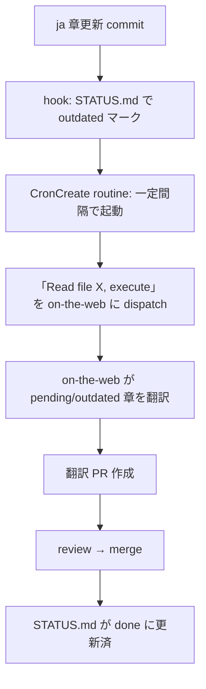

# Translation Prompts

OrbitScore learning サイトを Claude Desktop / Claude on the Web / CronCreate routine に翻訳作業を投げるためのプロンプトファイル。

**設計方針**: プロンプト本体はリポジトリ内のこのファイル群が canonical SoT。トリガーは「このファイル読んで実行して」 だけで完結する。これにより:

- プロンプト更新は PR で完結、Claude Desktop に貼り直す必要なし
- Routine から無修正で再 dispatch できる
- 章追加・削除は `TRANSLATION_STATUS.md` だけで反映、プロンプトは触らない

---

## トリガーコマンド

### User site

Claude Desktop / on-the-web に以下の 1 文だけ送る:

```
Read https://github.com/signalcompose/orbitscore/blob/main/docs/development/translation-prompts/translate-user-site.md and execute the task described in that file.
```

### Dev site

```
Read https://github.com/signalcompose/orbitscore/blob/main/docs/development/translation-prompts/translate-dev-site.md and execute the task described in that file.
```

これだけで on-the-web が:
1. プロンプトファイルを fetch
2. `TRANSLATION_STATUS.md` を読んで `pending` / `outdated` 章を抽出
3. 該当章を翻訳
4. PR を作成

## ファイル一覧

| ファイル | 対象 | 章数（残り） | 特記事項 |
|---|---|---|---|
| `translate-user-site.md` | `sites/user/` | 8 章 | spike 章 2 つ完訳済 |
| `translate-dev-site.md` | `sites/dev/` | 18 章 | **verbatim 規律 CRITICAL**、spike 章 1 つ完訳済 |

## 仕組み

### Status-driven scope

両プロンプトとも、翻訳対象の章リストを **ハードコードしない**。`docs/development/TRANSLATION_STATUS.md` の `Status` 列が `pending` または `outdated` の章を動的に拾う。

このため:
- 章を追加 → STATUS.md に行追加（status=pending） → 次回 dispatch で自動翻訳
- ja 章を更新 → STATUS.md で該当章を outdated にマーク → 次回 dispatch で再翻訳
- プロンプト本体は触らない

### プロンプト更新

プロンプトの内容（用語規律、verbatim ルール、ワークフロー）を変更したい場合:

1. `translate-{user,dev}-site.md` を直接編集
2. PR でレビュー → merge
3. 次回 dispatch から新ルールが効く

Routine 側の設定は変更不要。

### Routine 化想定



## 関連ドキュメント

- [`TRANSLATION_WORKFLOW.md`](../TRANSLATION_WORKFLOW.md) — 翻訳 workflow 全体
- [`TRANSLATION_STATUS.md`](../TRANSLATION_STATUS.md) — 章ごとの進捗（routine の SoT）
- `sites/user/.translation-glossary.md` — user サイト用語規律
- `sites/dev/.translation-glossary.md` — dev サイト用語規律 + verbatim 規律
