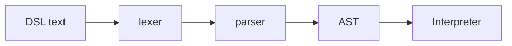

# OrbitScore Dev Site — Style Guide

本サイトの章執筆時に **必ず読む** こと。skill upstream (yuichkun/.claude) の `STYLE_GUIDE.template.md` を OrbitScore 用に specialize したもの。

## 1. 章の目的

本サイトの第一読者は **yamato 自身** (実装学習が目的)。第二読者は将来の contributor。**「ドキュメント」ではなく「個人の学習ノート」** として書く。

- 正確性責務は code のみが負う、本サイトはその時点の理解の snapshot
- 古い章は「歴史的読解」 として残しても OK
- 完全性を装わない (書かれていない章 = 「自明」 を意味しない)

## 2. 文体 (tone)

**ですます調、初学者向きの読み物。説明的だが過度にフォーマルにはしない。**

第一読者は実装を初めて読み解く立場 (yamato) なので、「自分が分かっている前提」 で書かない。論文や仕様書のようなだ・である調は避け、ですます調で語りかけるように書く。専門用語は使ってよいが、初出時は 1 行で意味を補う。

OK の例:
- 「parser は 2 段階で動きます。最初に lexer がトークン列を返し、次に parser が AST (抽象構文木) を組み立てます」
- 「ここで気をつけたいのは、...という点です」
- 「実装を読むと意外なほどシンプルな作りになっていて、...」

NG の例 (硬すぎ、だ・である調):
- 「parser は字句と構文の 2 段で動く。lexer がトークン列を返し、parser が AST を組む」 (突き放した感じ)

NG の例 (英語混在 / 学術的):
- 「Parser is a two-stage process consisting of lexical and syntactic analysis.」

NG の例 (過剰にカジュアル / 軽薄):
- 「parser ってこれめっちゃシンプルなんですよ〜!」 (cheerleading)
- 「マジで分かりやすい!」 (テンション過多)

### 具体的な書き方ガイド

- **文末**: 基本は「です」「ます」で終わる。同じ文末が連続すると単調なので「〜のです」「〜のでしょう」「〜と言えます」 等で variation
- **疑問形を活用**: 「ここで気になるのは〜」「では実際にはどう動くのでしょうか」 等、読者と一緒に考える運びにする
- **専門用語**: 初出時に 1 行で補足 (例: 「AST (抽象構文木、Abstract Syntax Tree) は...」)、2 回目以降は補足不要
- **コードブロックの導入文**: 「以下のコードを見てみましょう」「実装は次のとおりです」 等で読者を誘導
- **warmth marker** (「実は」「ちなみに」「面白いのは」 等) は 1 章あたり 3-5 回まで。多すぎると軽くなり、少なすぎると硬くなる
- **時間軸表現禁止**: 「現在」「最近」「以前」「これから」 は使わない (ですます調に変換しても禁止は維持)
- **絵文字 / 過度の修飾語禁止**: 「素晴らしい」「驚くべき」 等の主観的形容詞は使わない

## 3. 章の長さ

**shallow first pass: 1 章あたり 400-800 行目安**。深掘りは別 issue で後付け、1 章で全てを書こうとしない。

逸脱が必要な場合 (例: polymeter は本質的に長い) は STYLE_GUIDE 違反ではなく、`status: draft` で commit して Phase C で判断。

## 4. 章の必須構造

```markdown
---
title: "<章タイトル>"
chapter-id: <Part>-<番号> 例: 0-2、II-3
verified-against: <commit-sha-7-chars>
verified-at: YYYY-MM-DD
status: stub | draft | reviewed | stable
---

> **Note**: 本ページは {YYYY-MM-DD} 時点での著者の reading の足跡です。code が真実、本ページはその時点の理解の snapshot に過ぎません。

# <章タイトル>

<本文>

## 次の深掘り候補

- <深掘り候補 1>
- <深掘り候補 2>

## Sources

- `<file-path>:<start>-<end>` — <一行説明>
- PR/Issue link
- 外部仕様 URL (URL + 章節指定)
```

### frontmatter フィールド説明

| field | 必須 | 内容 |
|---|---|---|
| `title` | ✅ | 章タイトル (コロンを含む場合は **必ず quote**: `"Part 0: Intro"`) |
| `chapter-id` | ✅ | TOC 内の位置 (`0-2`, `II-3`, `adr-001` 等) |
| `verified-against` | draft 以降必須 | code との整合確認時点の commit (短縮 sha 7 文字) |
| `verified-at` | draft 以降必須 | 確認日 (`YYYY-MM-DD`) |
| `status` | ✅ | `stub` / `draft` / `reviewed` / `stable` |

stub の段階では `verified-against` `verified-at` は省略可、`status: stub` のみ必須。

## 5. `## Sources` の最低要件

- ファイル参照は `<file-path>:<start>-<end>` の line range 付き
- 外部仕様 (SuperCollider OSC protocol 等) は URL + 章/節指定
- 例:
  - `packages/engine/src/audio/supercollider/scsynth-resolver.ts:76-99` — `resolveScsynthPath()` の優先順位ロジック
  - PR [#155](https://github.com/signalcompose/orbitscore/pull/155) — strict mode 採用の経緯
  - [SuperCollider Server Command Reference](https://doc.sccode.org/Reference/Server-Command-Reference.html) §Synth Commands — `/s_new`、`/n_set`

## 5-bis. 本文中のコードブロック (引用) の規律

本サイトは **コード = SoT** という前提で書かれています。本文中のコードブロックが
SoT との対応を破ると、サイト全体の信頼性が失われます。以下を **必須**:

### 引用は文字単位で逐語 (verbatim)

`// <file>:<start>-<end>` のような行コメントを付けたコードブロックは、**指定 range
の actual code と文字単位で一致** すること。空白・改行・インデント・コメントを
書き手の都合で reformat してはいけない。

OK の例 (verbatim):
```typescript
// repl-mode.ts:27-38
export async function startREPLMode(options: REPLOptions = {}): Promise<void> {
  console.log('🎵 OrbitScore Audio Engine')
  console.log('✅ Initialized')

  // Create a global interpreter
  const globalInterpreter = new InterpreterV2()
  // ...
}
```

NG の例 (無印省略):
```typescript
// repl-mode.ts:27-38
export async function startREPLMode(options: REPLOptions = {}): Promise<void> {
  const globalInterpreter = new InterpreterV2()  // console.log 等を黙って削除
  await startREPL(globalInterpreter)
}
```

### 省略する場合は `// ...` を必ず置く

長い snippet で読み手の負担を下げたい場合、**省略は許容される**。ただし以下の
規則に従うこと:

1. **省略箇所には `// ...` を必ず置く** (黙って行を消さない)
2. **省略後の行コメントには対応する実 line range を付ける** (例:
   `// repl-mode.ts:27-38 (console.log と "Process arguments" コメント等を省略)`)
3. **末尾の `// ...` は actual code がさらに続く時のみ使う**。range の最終行が
   そこなら `// ...` を置かない (誤読を招く)

OK の例 (省略を明示):
```typescript
// event-scheduler.ts:155-177 (skip-cleared 分岐と error handler 詳細を省略)
this.intervalId = setInterval(() => {
  const now = Date.now() - this.startTime

  while (this.scheduledPlays.length > 0 && this.scheduledPlays[0].time <= now) {
    const play = this.scheduledPlays.shift()!
    // ...
    this.executePlayback(play.filepath, play.options, play.sequenceName, play.time)
    // ...
  }
}, 1)
```

NG の例 (誤った末尾 `// ...`):
```typescript
// event-scheduler.ts:317-335
await this.oscClient.sendMessage([
  '/s_new',
  // ...
  'duration',
  duration,
  // ...   ← 実際は actual code 末尾。さらに引数があるかのように読める。NG
])
```

### 行 comment / console.log 等の「些細に見える要素」も省略しない

引用元の `console.log` や inline comment は、**書き手にとっては些細でも、
学習者にとってはコンテキストの一部**。reformat や silent omission をすると
SoT が壊れる。verbatim を貫くか、省略するなら `// ...` で明示する。

### 範囲指定の精度

`// <file>:<start>-<end>` の range は **content と一致させる**。range が
27-38 なら、コードブロックの先頭が 27 行目、末尾が 38 行目に対応すること。
off-by-one は NG。

### writing agent への送信 prompt にこの規律を必ず含める

Phase B 以降の bulk parallel writing で sub-agent を dispatch する時、prompt
の "Fact-first discipline" セクションに本 §5-bis の内容 (verbatim、省略表記、
末尾 `// ...` の禁則、些細要素も削らない) を **必ず明記** する。同じ事故を
全章で再発させないため。

## 6. `## 次の深掘り候補` の意義

各章末に **必ず** 配置。これが無いと章が「閉じた」感じになり、深掘り issue 起票の seed が失われる。

例:
```markdown
## 次の深掘り候補

- lexer の正規表現 → 表形式トークンテーブル化 (現状はソース直読)
- error recovery (parser がどう error を返しているか、どこで stack を巻き戻すか)
- AST node の visitor パターン応用例 (interpreter 以外の使われ方)
```

複数挙げて OK。ここから将来 issue が起票される。

## 7. unverified marker

primary source で確認できない claim は inline で:

```markdown
> NOTE: unverified — needs confirmation
```

として明示。speculation without marker は Critical issue (audit で flag される)。

## 8. 図表

### Mermaid (baseline)

architecture / data flow / state machine 等は Mermaid を使う:

````markdown

````

### KaTeX (math)

数式は inline `$...$` または display `$$...$$`:

```markdown
$\text{tempo} = \frac{60}{\text{beat duration in seconds}}$
```

### SVG / 動画

凝った図 (実装が必要な polymeter 計算等) は SVG 直書きで OK。CJK 文字幅に注意 (gotchas §17): full-width は `font-size=13` で 13-15px/glyph、コンテナ rect 幅を **執筆前に** budget。

### Vue component

interactive demo が必要な章 (state visualization 等) は Vue component を local import:

```markdown
<script setup>
import MyDemo from '../.vitepress/theme/components/<part>/MyDemo.vue'
</script>

<MyDemo />
```

`theme/index.ts` を **触らない** (parallel writing agent の merge conflict 回避)。

## 9. リンク規約

- 内部リンク: `cleanUrls: true` 設定済、`.md` 拡張子を **付けない** (`/audio/supercollider` であって `/audio/supercollider.md` ではない)
- 外部リンク: 仕様 doc は version pin、GitHub link は commit-pin (`/blob/<sha>/...`) を推奨
- リポジトリ内 file 参照: `## Sources` で raw path、本文中で言及する時は GitHub permalink を使うと doc rot に強い

## 10. 言語

**日本語のみ** (現 phase)。英語は post-ICMC で i18n 検討時に追加。

技術用語 (parser, AST, OSC, scsynth 等) はオリジナル形のまま使用、無理に和訳しない。

## 11. status flag のライフサイクル

```
stub      ← scaffold 直後、本文 0
  ↓ (writing agent 初稿)
draft     ← writing 完了、advisor audit 未
  ↓ (advisor audit pass + cluster fix)
reviewed  ← advisor audit OK、yamato が読み手として一読済
  ↓ (深掘り or stable verify)
stable    ← 長期 stable、再度 code 突合済
```

格上げは別 PR で行うのが原則 (writing PR と review PR を分離)。
