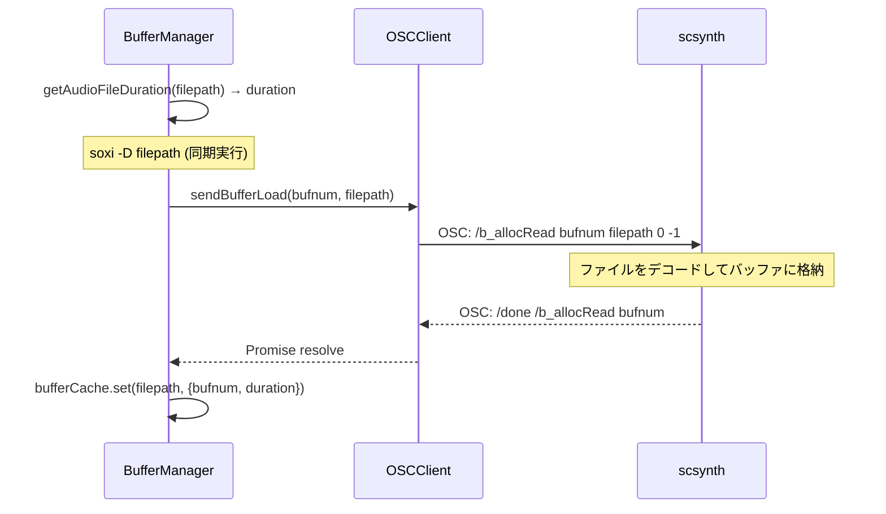
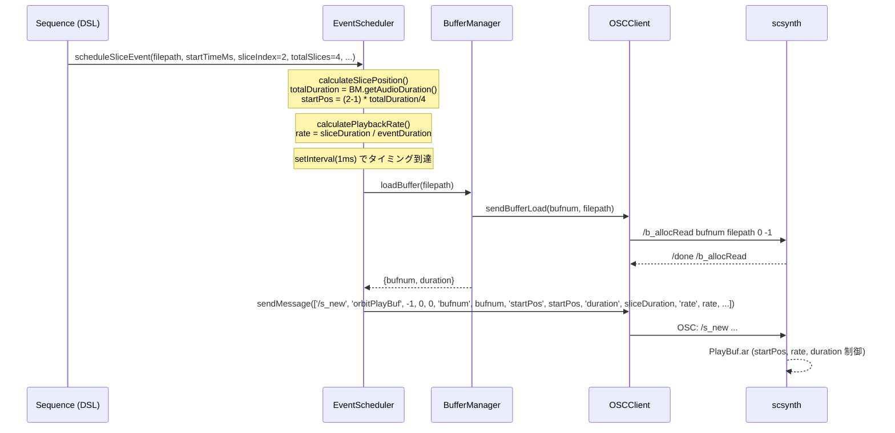

> **Note**: 本ページは 2026-05-05 時点での著者の reading の足跡です。code が真実、本ページはその時点の理解の snapshot に過ぎません。

# III-2. オーディオファイル再生

OrbitScore が音声ファイルを再生するとき、「ファイルをそのまま SuperCollider に渡す」ことはできません。scsynth は再生前にファイルを自分のバッファ空間に読み込む必要があります。本章では **BufferManager によるキャッシュ管理**、**soxi を使った尺取得**、**`/b_allocRead` での読み込み**、そして **`orbitPlayBuf` SynthDef のスライス再生ロジック** を順に見ていきます。

## バッファとは何か

scsynth は内部にバッファ空間を持っています。バッファは整数の `bufnum` で識別され、オーディオファイルのデコード済みサンプルを保持します。`PlayBuf.ar` のような UGen (Unit Generator) はバッファを参照して再生します。engine 側では「ファイルパス → bufnum」の対応関係を `BufferManager` が管理します。

## BufferManager の構造

`BufferManager` はシンプルな設計です。フィールドを見てみましょう。

```typescript
// buffer-manager.ts:11-15
export class BufferManager {
  private bufferCache: Map<string, BufferInfo> = new Map()
  private bufferDurations: Map<number, number> = new Map()
  private nextBufnum = 0
```

3 つのフィールドがあります。

- **`bufferCache`**: `filepath → BufferInfo` のマップ。同一ファイルの二重ロードを防ぐキャッシュ
- **`bufferDurations`**: `bufnum → duration(秒)` のマップ。スライス計算に使う
- **`nextBufnum`**: 0 から始まる単調増加カウンタ。`nextBufnum++` で採番するだけで、解放されたバッファの番号は再利用しません

`BufferInfo` 型は次のとおりです。

```typescript
// types.ts:5-8
export interface BufferInfo {
  bufnum: number
  duration: number
}
```

### キャッシュロジック

`loadBuffer()` は最初にキャッシュを確認します。

```typescript
// buffer-manager.ts:21-46
async loadBuffer(filepath: string): Promise<BufferInfo> {
    if (this.bufferCache.has(filepath)) {
      return this.bufferCache.get(filepath)!
    }

    const bufnum = this.nextBufnum++

    // Get duration from audio file using sox before loading into SuperCollider
    const duration = this.getAudioFileDuration(filepath)

    // Wait for SuperCollider to complete buffer loading (/done message)
    await this.oscClient.sendBufferLoad(bufnum, filepath)

    const bufferInfo: BufferInfo = { bufnum, duration }
    this.bufferCache.set(filepath, bufferInfo)
    this.bufferDurations.set(bufnum, duration)

    // Only log in debug mode
    if (process.env.ORBITSCORE_DEBUG) {
      console.log(
        `📦 Loaded buffer ${bufnum} (${path.basename(filepath)}): ${duration.toFixed(3)}s`,
      )
    }

    return bufferInfo
  }
```

同じファイルが 2 回目以降に要求されたときは、scsynth への `/b_allocRead` を送らずにキャッシュから即返します。これは live coding では重要な最適化です。パターンのループのたびにバッファをロードしていたら遅延が累積するからです。

注目したいのが、尺取得 (`getAudioFileDuration`) と バッファロード (`sendBufferLoad`) の順序です。**soxi で尺を取得してから、scsynth にバッファをロードします**。なぜこの順序なのでしょうか。尺は `scheduleSliceEvent` (chop) でスライス位置計算に使われるため、バッファロード完了前に知っておく必要があるからです。

### フォーマット対応

OrbitScore が対応する音声フォーマットは、scsynth がバッファ読み込みに使う libsndfile に依存します。`.vsix` に同梱される `libsndfile.dylib` のサポート範囲が事実上の対応フォーマットになります。

> NOTE: unverified — WAV / AIFF については libsndfile の標準サポートで確認できますが、MP3 / MP4 は libsndfile のビルドオプションと version に依存します。同梱 `libsndfile.dylib` (約 4.9 MB) の具体的な version と MP3 サポート有無は別途確認が必要です。

## soxi による尺取得: scsynth とは独立したコードパス

尺取得は SuperCollider を介さず、`soxi` コマンド (sox ツールチェインの一部) を直接呼びます。

```typescript
// buffer-manager.ts:52-74
private getAudioFileDuration(filepath: string): number {
    try {
      // Use execFileSync with separate arguments to prevent command injection
      // Suppress soxi warnings by redirecting stderr to /dev/null
      const output = execFileSync('soxi', ['-D', filepath], {
        encoding: 'utf8',
        stdio: ['pipe', 'pipe', 'ignore'], // Ignore stderr to suppress warnings
      })
      const duration = parseFloat(output.trim())

      if (isNaN(duration) || duration <= 0) {
        console.warn(`⚠️  Invalid duration from sox for ${filepath}, using default 0.3s`)
        return 0.3
      }

      return duration
    } catch (error: any) {
      console.warn(
        `⚠️  Failed to get duration for ${filepath}: ${error.message}, using default 0.3s`,
      )
      return 0.3
    }
  }
```

`soxi -D <filepath>` を同期実行します。`-D` は秒単位の尺を返すオプションです。引数を配列で渡すことで安全に呼び出しています。

`stdio: ['pipe', 'pipe', 'ignore']` の `ignore` は stderr を捨てています。soxi は一部のフォーマットで警告を出すことがあり、それが邪魔にならないようにしています。

失敗したときはデフォルト値として `0.3` 秒を返します。これはドラムサンプルを想定したフォールバック値です。尺が取れなくても scsynth のバッファロードや再生は行えるため、graceful degradation として機能します。

## バッファロード: `/b_allocRead` と `/done` の待機

尺が取れたら、scsynth にバッファをロードします。この処理は `OSCClient.sendBufferLoad()` 経由で行われ、callAndResponse パターン (詳細は [III-1. SuperCollider との通信](/audio/supercollider) §callAndResponse パターン) で `/done` を待ちます。



## `orbitPlayBuf` SynthDef: 再生のレシピ

scsynth でバッファを再生する音声処理の定義が `orbitPlayBuf` SynthDef です。`setup.scd` の sclang コードを読むと、その構造が分かります。

```supercollider
// packages/engine/supercollider/setup.scd:16-58 (writeDefFile 行を省略)
SynthDef(\orbitPlayBuf, {
    arg out = 0, bufnum = 0, rate = 1, amp = 0.5, pan = 0, 
        startPos = 0,      // 開始位置（秒）
        duration = 0;      // 再生時間（秒、0 = 全体）
    
    var sig, env, actualDuration, fadeIn, fadeOut, sustain;
    
    // 実際の再生時間を計算（0なら全体、それ以外なら指定された時間）
    actualDuration = Select.kr(duration > 0, [
        BufDur.kr(bufnum) - startPos,  // duration <= 0 の場合
        duration                         // duration > 0 の場合
    ]);
    
    // バッファから再生
    sig = PlayBuf.ar(
        numChannels: 1,
        bufnum: bufnum,
        rate: rate * BufRateScale.kr(bufnum),
        trigger: 1,
        startPos: startPos * BufSampleRate.kr(bufnum),
        loop: 0,
        doneAction: 0  // duration制御はエンベロープで行う
    );
    
    // エンベロープで再生時間を制御（クリック音防止のためフェードアウト）
    // フェード時間を再生時間に応じて調整（短い音ほど短いフェード）
    // アタック感を保つためフェードインなし、フェードアウトのみ
    fadeIn = 0;  // フェードインなし
    fadeOut = min(0.008, actualDuration * 0.04);  // 再生時間の4%、最大8ms
    sustain = max(0, actualDuration - fadeOut);
    
    env = EnvGen.kr(
        Env.linen(fadeIn, sustain, fadeOut),
        doneAction: 2  // 再生終了後にシンセを自動削除
    );
    
    sig = sig * env;
    
    // ステレオ化してパン
    sig = Pan2.ar(sig, pan, amp);
    
    // 出力
    Out.ar(out, sig);
// ...
```

### `PlayBuf` の `rate` と `BufRateScale`

`rate: rate * BufRateScale.kr(bufnum)` という部分が再生速度を決めます。

`BufRateScale.kr(bufnum)` はバッファのサンプルレートと scsynth のサーバーサンプルレートの比率を返します。たとえばバッファが 44100 Hz で scsynth が 48000 Hz で動いていると、`BufRateScale` は `44100/48000 ≈ 0.918` になります。これを掛けることでピッチを変えずに正しいテンポで再生できます。

`rate` 引数 (engine から渡す値) は 1.0 が等速再生、2.0 が 2 倍速、0.5 が半速です。重要な点として、**この `rate` 変更はピッチと速度が連動します**。倍速にすると 1 オクターブ上のピッチになります。タイムストレッチ (速度だけ変えてピッチを保つ処理) ではありません。

### `startPos` 単位変換

`startPos: startPos * BufSampleRate.kr(bufnum)` という変換があります。engine 側から渡す `startPos` は **秒単位** ですが、`PlayBuf.ar` の `startPos` 引数は **サンプル数** を要求します。`BufSampleRate.kr(bufnum)` (バッファのサンプルレート) を掛けることで単位変換しています。

### エンベロープとフェードアウト

再生時間を `duration` 引数で制御するため、エンベロープを使っています。

$$\text{fadeOut} = \min(0.008, \text{actualDuration} \times 0.04)$$

フェードアウト時間は「再生時間の 4%」か「8ms」の短い方です。これはクリックノイズ (音が突然切れるときに発生するノイズ) を防ぐための配慮です。アタック感を保つためにフェードインはゼロにしています。

`PlayBuf.ar` の `doneAction: 0` (再生終了でシンセを自動解放しない) と、`EnvGen.kr` の `doneAction: 2` (エンベロープ完了でシンセを自動解放) の組み合わせで、バッファの再生完了ではなくエンベロープの完了をもってシンセが解放されます。これにより `duration` 指定によるカット制御が正しく機能します。

## スライス再生: chop メソッドの仕組み

`chop` DSL メソッドは音声ファイルを等分割してスライス再生します。これを支えているのが `EventScheduler` のスライス計算ロジックです。

### スライス位置の計算

```typescript
// event-scheduler.ts:53-71
private calculateSlicePosition(
    filepath: string,
    sliceIndex: number,
    totalSlices: number,
  ): { sliceDuration: number; startPos: number; totalDuration: number } {
    const totalDuration = this.bufferManager.getAudioDuration(filepath)
    const sliceDuration = totalDuration / totalSlices
    // sliceIndex is 1-based from DSL, convert to 0-based
    const startPos = (sliceIndex - 1) * sliceDuration

    // Debug log for slice positioning (only in debug mode)
    if (process.env.ORBITSCORE_DEBUG) {
      console.log(
        `🔍 Slice debug: filepath=${filepath}, duration=${totalDuration}, sliceIndex=${sliceIndex}, totalSlices=${totalSlices}, sliceDuration=${sliceDuration}, startPos=${startPos}`,
      )
    }

    return { sliceDuration, startPos, totalDuration }
  }
```

`sliceIndex` は DSL 側が 1-based で渡すため、`(sliceIndex - 1) * sliceDuration` で 0-based に変換しています。たとえば 4 分割の 2 番目スライスなら `startPos = 1 * (totalDuration / 4)` です。

### 再生レートの計算

```typescript
// event-scheduler.ts:77-86
private calculatePlaybackRate(
    sliceDurationSec: number,
    eventDurationMs: number | undefined,
  ): number {
    if (!eventDurationMs || eventDurationMs <= 0) {
      return 1.0
    }
    return (sliceDurationSec * 1000) / eventDurationMs
  }
```

スライスを指定したビートグリッドに収めるため、レートを動的に計算します。

$$\text{rate} = \frac{\text{sliceDuration(ms)}}{\text{eventDuration(ms)}}$$

スライスが 500ms でイベントの尺が 250ms なら `rate = 2.0` (2 倍速再生) となります。これによって尺の異なる音声ファイルを等グリッドに並べることができます。先述のとおりピッチも変わりますが、chop パターンではピッチより rhythmic な一致を優先しているためこの実装になっています。

### scheduleSliceEvent でのパラメータ組み立て

```typescript
// event-scheduler.ts:107-138
scheduleSliceEvent(
    filepath: string,
    startTimeMs: number,
    sliceIndex: number,
    totalSlices: number,
    eventDurationMs: number | undefined,
    gainDb = 0,
    pan = 0,
    sequenceName = '',
  ): void {
    const { sliceDuration, startPos } = this.calculateSlicePosition(
      filepath,
      sliceIndex,
      totalSlices,
    )
    const rate = this.calculatePlaybackRate(sliceDuration, eventDurationMs)

    const play: ScheduledPlay = {
      time: startTimeMs,
      filepath,
      options: {
        gainDb,
        pan,
        startPos,
        duration: sliceDuration,
        rate,
      },
      sequenceName,
    }

    this.addToScheduledPlays(play)
  }
```

計算された `startPos`, `duration`, `rate` が `ScheduledPlay.options` に格納され、タイムライン上でディスパッチされると `sendPlaybackMessage()` 経由で `/s_new` の引数として scsynth に届きます。

### スライス再生の全体フロー



## 次の深掘り候補

- **フォーマット対応の確認**: 同梱 `libsndfile.dylib` の version と実際にデコードできるフォーマット (特に MP3/MP4) の確認
- **soxi の依存管理**: soxi が存在しない環境での fallback 戦略。duration = 0.3s のデフォルト値で動くが、chop の精度に影響する
- **バッファキャッシュの lifetime**: キャッシュはプロセス終了まで保持され、`clearCache()` や `removeBuffer()` が呼ばれないと解放されない。セッション長によるメモリ増大の影響
- **`rate` とピッチの関係**: `rate = 2.0` で 1 オクターブ上になる。ピッチ非変換の速度変化が必要な場合の実装選択肢 (SuperCollider の PVS 系 UGen 等)
- **stereo ファイルへの対応**: `PlayBuf.ar(numChannels: 1, ...)` でモノラル前提。stereo ファイルを渡したときの scsynth の挙動

## Sources

- `packages/engine/src/audio/supercollider/buffer-manager.ts:11-46` — `BufferManager` クラス定義、`loadBuffer()` キャッシュロジックと処理順序
- `packages/engine/src/audio/supercollider/buffer-manager.ts:52-74` — `getAudioFileDuration()`: soxi 呼び出しとフォールバック値
- `packages/engine/src/audio/supercollider/buffer-manager.ts:79-86` — `getAudioDuration()`: キャッシュからの尺取得
- `packages/engine/src/audio/supercollider/types.ts:5-8` — `BufferInfo` 型定義
- `packages/engine/src/audio/supercollider/types.ts:10-21` — `ScheduledPlay` 型: options フィールドの gainDb / pan / startPos / duration / rate
- `packages/engine/src/audio/supercollider/event-scheduler.ts:53-71` — `calculateSlicePosition()`: 1-based → 0-based 変換と startPos 計算
- `packages/engine/src/audio/supercollider/event-scheduler.ts:77-86` — `calculatePlaybackRate()`: スライスをイベント尺に収めるレート計算
- `packages/engine/src/audio/supercollider/event-scheduler.ts:107-138` — `scheduleSliceEvent()`: スライスパラメータ組み立てとキューへの追加
- `packages/engine/src/audio/supercollider/osc-client.ts:65-74` — `sendBufferLoad()`: `/b_allocRead` と callAndResponse
- `packages/engine/supercollider/setup.scd:16-58` — `orbitPlayBuf` SynthDef 全体: PlayBuf, BufRateScale, startPos 単位変換, エンベロープ, doneAction (writeDefFile 行を省略)
- `packages/vscode-extension/BUILD_GUIDE.md:71-82` — bundle に含まれる `libsndfile.dylib` のサイズと構成
- [SuperCollider Server Command Reference](https://doc.sccode.org/Reference/Server-Command-Reference.html) §Buffer Commands — `/b_allocRead` の引数定義
