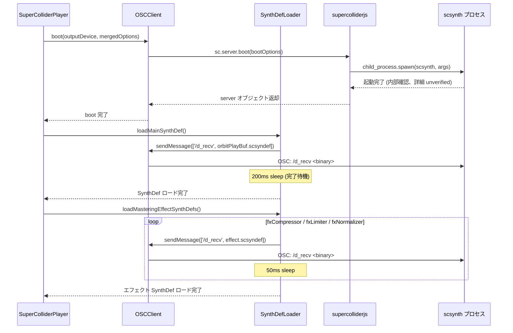
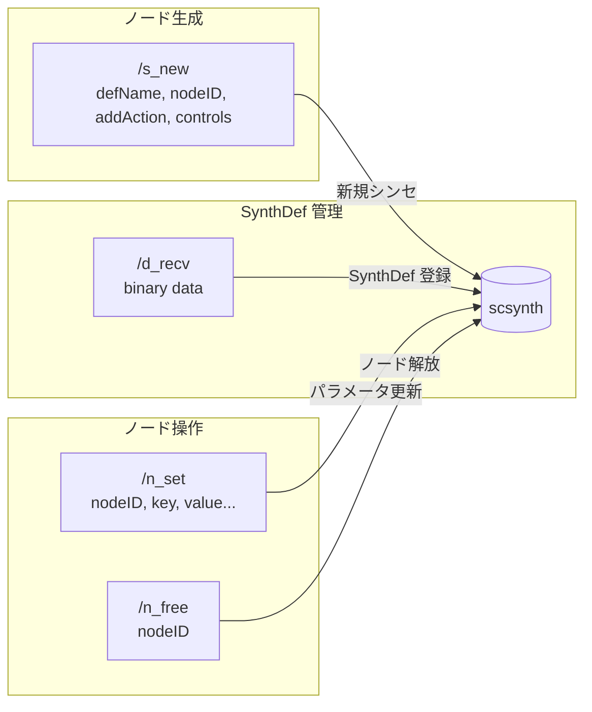

> **Note**: 本ページは 2026-05-05 時点での著者の reading の足跡です。code が真実、本ページはその時点の理解の snapshot に過ぎません。

# III-1. SuperCollider との通信

[0-2. アーキテクチャ全景](/orientation/architecture-overview) では、engine と scsynth が OSC over UDP で通信していること、そして `EventScheduler` が `/s_new` を送ることを鳥瞰しました。本章はその一段下へ降りて、「boot から音が出るまで」の 3 フェーズを詳細に追います。特に、`/d_recv` による SynthDef ロードと、`/b_allocRead` の callAndResponse パターン、`/n_set` / `/n_free` によるエフェクト制御という、spike 章では触れられなかった経路を中心に読んでいきます。

## OSC プロトコルとは何か

OSC (Open Sound Control) は、音楽・音響アプリケーション向けに設計されたバイナリメッセージプロトコルです。UDP 上で動作し、アドレスパターン (例: `/s_new`)、型タグ、引数列という構造を持ちます。SuperCollider のサーバー (scsynth) は UDP ポート 57110 を標準でリッスンしており、[SuperCollider Server Command Reference](https://doc.sccode.org/Reference/Server-Command-Reference.html) に定義されたコマンド群を受け付けます。

OrbitScore は `supercolliderjs` ライブラリを仲介役として使い、OSC メッセージの生バイナリ組み立てや UDP ソケット管理を supercolliderjs に任せています。engine 側のコードは `this.server.send.msg(message)` という薄いインターフェースを呼ぶだけです。

## boot フェーズ: scsynth の起動から SynthDef ロードまで

engine が起動するとき、`SuperColliderPlayer.boot()` が 2 つのことをやっています。**scsynth プロセスを起動すること** と **SynthDef をロードすること** です。

```typescript
// supercollider-player.ts:38-50
async boot(outputDevice?: string, options?: BootOptions): Promise<void> {
    const mergedOptions: BootOptions = { ...options }
    if (!mergedOptions.scsynth) {
      const resolution = resolveScsynthPath()
      mergedOptions.scsynth = resolution.path
      if (process.env.ORBITSCORE_DEBUG) {
        console.log(`🔍 scsynth resolved via ${resolution.source}: ${resolution.path}`)
      }
    }
    await this.oscClient.boot(outputDevice, mergedOptions)
    await this.synthDefLoader.loadMainSynthDef()
    await this.synthDefLoader.loadMasteringEffectSynthDefs()
  }
```

`resolveScsynthPath()` は scsynth バイナリのパスを解決するだけで、実際に scsynth を起動するのは `this.oscClient.boot()` です (パス解決の詳細は [III-3. scsynth bundle と path resolution](/audio/scsynth-bundle) で扱います)。

### OSCClient.boot() の中身

`OSCClient.boot()` が scsynth を起動します。実装を見てみましょう。

```typescript
// osc-client.ts:21-50
async boot(outputDevice?: string, options?: BootOptions): Promise<void> {
    console.log('🎵 Booting SuperCollider server...')

    const bootOptions: any = {
      debug: false,
      ...options,
    }

    if (!bootOptions.scsynth) {
      throw new Error(
        'OSCClient.boot: BootOptions.scsynth is required. Caller must resolve scsynth path (see scsynth-resolver.ts).',
      )
    }

    // Set output device if specified (by name)
    // device maps to scsynth -H flag, numInputBusChannels maps to -i flag
    // Output-only devices (e.g. "外部") need -i 0 to disable input channels
    // Note: supercolliderjs args() only accepts string values (_.isString check)
    if (outputDevice) {
      bootOptions.device = outputDevice
      bootOptions.numInputBusChannels = '0'
      this.currentOutputDevice = outputDevice
      console.log(`🔊 Using output device: ${outputDevice}`)
    }

    // @ts-expect-error - supercolliderjs types are incomplete
    this.server = await sc.server.boot(bootOptions)

    console.log('✅ SuperCollider server ready')
  }
```

ここで注目したいのが `@ts-expect-error` コメントです。`supercolliderjs` の TypeScript 型定義が不完全なため、型エラーを抑制しつつ呼び出しています。`sc.server.boot()` は supercolliderjs が scsynth プロセスを `child_process.spawn` して、起動確認まで完了するのを待ちます。返り値の `this.server` オブジェクトがその後の全 OSC 通信の窓口になります。

> NOTE: unverified — supercolliderjs が起動確認に使う OSC コマンド (`/status` 等) の詳細は supercolliderjs ソースを直接確認していません。内部実装の詳細は別途調査が必要です。

また、出力デバイスが指定されていると `device` (scsynth の `-H` フラグ対応) と `numInputBusChannels: '0'` (scsynth の `-i 0` に相当) が追加されます。文字列 `'0'` であることに少し違和感があるかもしれませんが、supercolliderjs の内部実装が `_.isString` チェックを行っているためで、数値ではなく文字列で渡す必要があります。

### SynthDef のロード: `/d_recv` コマンド

scsynth が起動したら、次は SynthDef をロードします。SynthDef (Synthesis Definition) とは SuperCollider における音声処理レシピのことで、事前に `.scsyndef` バイナリ形式でコンパイルされています。OrbitScore では `setup.scd` を sclang で実行することで生成した `.scsyndef` ファイルを ship します。

`SynthDefLoader.loadMainSynthDef()` はこの `.scsyndef` ファイルを読み込み、`/d_recv` OSC コマンドで scsynth に送ります。

```typescript
// synthdef-loader.ts:27-39
async loadMainSynthDef(): Promise<void> {
    if (!this.oscClient.isRunning()) {
      throw new Error('SuperCollider server not running')
    }

    const synthDefData = fs.readFileSync(this.synthDefPath)
    await this.oscClient.sendMessage(['/d_recv', synthDefData])

    // Wait for SynthDef to be ready
    await new Promise((resolve) => setTimeout(resolve, 200))

    console.log('✅ SynthDef loaded')
  }
```

`sendMessage(['/d_recv', synthDefData])` は SuperCollider Server Command Reference の `/d_recv` コマンドに対応しています。引数はバイナリデータ (Buffer) です。

ここで面白いのは、`/d_recv` の後に `setTimeout(resolve, 200)` という 200ms の待機が入っている点です。`/b_allocRead` (バッファロード) では後述の `callAndResponse` で `/done` を待つのですが、`/d_recv` は非同期の完了通知が使いにくいため、固定 200ms のスリープで代用しています。

> NOTE: unverified — `/d_recv` が `/done` 応答を返すかどうかは SuperCollider の version 依存の可能性があります。現在の実装は fixed sleep で対応しており、将来的に callAndResponse に移行できるか要確認。

マスタリングエフェクト用の SynthDef も同様の流れでロードします。

```typescript
// synthdef-loader.ts:44-61
async loadMasteringEffectSynthDefs(): Promise<void> {
    if (!this.oscClient.isRunning()) {
      return
    }

    const synthDefDir = path.join(__dirname, '../../../supercollider/synthdefs')
    const effectSynthDefs = ['fxCompressor', 'fxLimiter', 'fxNormalizer']

    for (const synthDefName of effectSynthDefs) {
      const synthDefPath = path.join(synthDefDir, `${synthDefName}.scsyndef`)
      if (fs.existsSync(synthDefPath)) {
        const synthDefData = fs.readFileSync(synthDefPath)
        await this.oscClient.sendMessage(['/d_recv', synthDefData])
        await new Promise((resolve) => setTimeout(resolve, 50))
      }
    }

    console.log('✅ Mastering effect SynthDefs loaded')
  }
```

エフェクト SynthDef は各 50ms 待機で順番にロードされます。ループで直列ロードしているため、3 つで最低 150ms かかります。

### boot シーケンスの全体像



## 再生フェーズ: `/s_new` でシンセを生成する

SynthDef がロード済みの scsynth に対して、再生の都度 `/s_new` コマンドでシンセインスタンスを生成します。`EventScheduler.sendPlaybackMessage()` がこれを担います。

```typescript
// event-scheduler.ts:307-335
private async sendPlaybackMessage(
    bufnum: number,
    amplitude: number,
    options: PlaybackOptions,
  ): Promise<void> {
    const pan = options.pan !== undefined ? options.pan / 100 : 0.0 // -100..100 -> -1.0..1.0
    const startPos = options.startPos ?? 0
    const duration = options.duration ?? 0
    const rate = options.rate ?? 1.0

    await this.oscClient.sendMessage([
      '/s_new',
      'orbitPlayBuf',
      -1,
      0,
      0,
      'bufnum',
      bufnum,
      'amp',
      amplitude,
      'pan',
      pan,
      'rate',
      rate,
      'startPos',
      startPos,
      'duration',
      duration,
    ])
  }
```

`/s_new` の引数のレイアウトは SuperCollider Server Command Reference で定義されており、`['/s_new', defName, nodeID, addAction, targetNodeID, ...controls]` の形です。

- **`defName`**: `'orbitPlayBuf'` — ロード済み SynthDef の名前
- **`nodeID`**: `-1` — scsynth にノード ID を自動割り当てさせる
- **`addAction`**: `0` — head に追加 (`addToHead`)
- **`targetNodeID`**: `0` — ルートグループ (グループ 0) に配置
- それ以降: `key, value` のペアで control を設定 (`bufnum`, `amp`, `pan`, `rate`, `startPos`, `duration`)

`nodeID = -1` を指定すると scsynth が一意のノード ID を採番し管理します。シンセは SynthDef 内の `doneAction: 2` によって再生完了時に scsynth 側が自動で解放するため、engine 側から `/n_free` を送る必要はありません (後述のエフェクト制御とは異なります)。

### sendMessage の実装

```typescript
// osc-client.ts:55-60
async sendMessage(message: any[]): Promise<void> {
    if (!this.server) {
      throw new Error('SuperCollider server not running')
    }
    await this.server.send.msg(message)
  }
```

`this.server.send.msg(message)` が supercolliderjs の API で、OSC メッセージを UDP で scsynth に送出します。`await` していますが、scsynth からの応答 (ACK) を待つわけではなく、fire-and-forget に近い動作です。

> NOTE: unverified — `await this.server.send.msg(message)` が内部で何を待機しているか (送信キューへの enqueue なのか、UDP 送出そのものなのか) は supercolliderjs ソースを確認していません。

## エフェクト制御フェーズ: `/n_set` と `/n_free`

マスタリングエフェクト (Compressor / Limiter / Normalizer) は、再生ノードとは異なり **ライフサイクルを明示的に管理** します。`SynthDefLoader.addEffect()` が新規作成か既存更新かを判断して、適切なコマンドを送ります。

### 既存エフェクトの更新: `/n_set`

エフェクトが既に存在する場合、パラメータだけを変更します。

```typescript
// synthdef-loader.ts:102-111
if (existingSynthId !== undefined) {
        // Update existing effect parameters
        const setParams: any[] = ['/n_set', existingSynthId]

        Object.entries(params).forEach(([key, value]) => {
          setParams.push(key, value)
        })

        await this.oscClient.sendMessage(setParams)
        console.log(`✅ ${effectType} updated`)
      }
```

`/n_set` は既存ノードのコントロールパラメータを変更します。`['/n_set', nodeID, key1, value1, key2, value2, ...]` の形で引数を渡します。

### 新規エフェクトの作成: `/s_new`

エフェクトが存在しない場合は `/s_new` で新規作成します。

```typescript
// synthdef-loader.ts:112-133
} else {
        // Create new effect synth with monotonically increasing ID
        const synthId = this.nextSynthId++
        const createParams: any[] = [
          '/s_new',
          synthDefName,
          synthId,
          1, // addToTail
          0, // target
        ]

        Object.entries(params).forEach(([key, value]) => {
          createParams.push(key, value)
        })

        await this.oscClient.sendMessage(createParams)

        // Store synth ID by effect type
        targetEffects.set(effectType, synthId)

        console.log(`✅ ${effectType} created (ID: ${synthId})`)
      }
```

再生ノードとの違いに注目してください。エフェクトノードは:
- **`nodeID`**: `this.nextSynthId++` — 2000 番台から単調増加する明示的な ID (`private nextSynthId = 2000`)
- **`addAction`**: `1` — `addToTail` (グループの末尾に追加、つまり再生後に処理される)
- ID は `effectSynths` Map で保存し、更新や削除のために保持する

### エフェクトの削除: `/n_free`

```typescript
// synthdef-loader.ts:152-160 (catch ブロックと外側の if/閉じ括弧を省略)
          await this.oscClient.sendMessage(['/n_free', synthId])
          targetEffects.delete(effectType)
          console.log(`✅ ${effectType} removed (ID: ${synthId})`)
          // ...
```

`/n_free` はノードを即時解放します。`addToTail` で配置されたエフェクトが削除されると、マスター出力への挿入が解除されます。

### 3 種の OSC コマンドまとめ



## callAndResponse パターン: `/b_allocRead`

OSC メッセージのほとんどは fire-and-forget ですが、バッファロードだけは異なります。`OSCClient.sendBufferLoad()` を見てみましょう。

```typescript
// osc-client.ts:65-74
async sendBufferLoad(bufnum: number, filepath: string): Promise<void> {
    if (!this.server) {
      throw new Error('SuperCollider server not running')
    }
    // Use callAndResponse to wait for /done message
    await this.server.callAndResponse({
      call: ['/b_allocRead', bufnum, filepath, 0, -1],
      response: ['/done', '/b_allocRead', bufnum],
    })
  }
```

`callAndResponse` は supercolliderjs の API で、`call` を送信してから `response` が届くまで Promise を待機させます。scsynth はバッファのロードが完了すると `/done /b_allocRead <bufnum>` を返します。

`/b_allocRead` の引数は `[bufnum, path, startFrame, numFrames]` で、`startFrame = 0`, `numFrames = -1` は「先頭から全フレーム」を意味します。

この callAndResponse パターンが重要なのは、**バッファロードが完了する前に `/s_new` を送ると scsynth 側でバッファが見つからず無音になる** からです。`BufferManager.loadBuffer()` で `await this.oscClient.sendBufferLoad(...)` としていることで、ロード完了を保証してから再生に進みます。

## 関連用語

- [scsynth](/glossary#scsynth) — 本章の主役。OrbitScore が `child_process.spawn` で起動するオーディオサーバーバイナリ
- [OSC (Open Sound Control)](/glossary#osc-open-sound-control) — engine と scsynth の通信プロトコル。`/d_recv` / `/s_new` / `/n_set` / `/n_free` / `/b_allocRead` がすべて OSC
- [SynthDef (SC)](/glossary#synthdef-sc) — `/d_recv` でロードする音声処理定義。`orbitPlayBuf` / `fxCompressor` / `fxLimiter` / `fxNormalizer` の 4 つ
- [orbitPlayBuf](/glossary#orbitplaybuf) — OrbitScore 専用 SynthDef。`/s_new` でインスタンス化して再生する
- [UGen (Unit Generator)](/glossary#ugen-unit-generator) — SynthDef を構成する基本処理単位。`PlayBuf` / `Pan2` / `EnvGen` 等
- [Buffer (SC)](/glossary#buffer-sc) — `/b_allocRead` でロードされる scsynth 上のオーディオメモリ領域
- [bundle (scsynth source)](/glossary#bundle-scsynth-source) — `.vsix` に同梱された scsynth バイナリ。`bundleCandidatePath()` が参照

## 関連 ADR

- [ADR-001 SuperCollider ベース実装の選択](/decisions/adr-001-supercollider) — なぜ scsynth を採用したか (sox 140-150ms → 0-8ms 達成) の意思決定
- [ADR-003 scsynth bundle strict mode](/decisions/adr-003-scsynth-bundle) — `.vsix` への同梱と SC.app fallback 削除の経緯

## 次の深掘り候補

- **supercolliderjs の内部**: `sc.server.boot()` はどう scsynth を spawn し、`/status` 確認をしているのか。supercolliderjs のソースを追跡する
- **`/d_recv` の完了通知**: SuperCollider docs では `/d_recv` に対して `/done` が返ると記述されているが、現実装は 200ms fixed sleep。callAndResponse に移行できるか確認
- **`setInterval(1ms)` の精度**: Node.js の `setInterval` は 1ms を保証しない。実際の drift 特性が音のタイミング精度に与える影響
- **`addToTail` vs `addToHead`**: エフェクトが `addToTail` で再生ノードが `addToHead` である構造上の意味。scsynth のシグナルグラフとの関係
- **`/n_free` vs `doneAction: 2`**: 再生ノードは SynthDef 側の `doneAction: 2` で自動解放、エフェクトノードは engine 側の `/n_free` で明示解放。この非対称性の設計理由

## Sources

- `packages/engine/src/audio/supercollider/osc-client.ts:21-50` — `OSCClient.boot()`: bootOptions 構築と `sc.server.boot()` 呼び出し
- `packages/engine/src/audio/supercollider/osc-client.ts:55-60` — `sendMessage()`: `this.server.send.msg(message)` による OSC 送信
- `packages/engine/src/audio/supercollider/osc-client.ts:65-74` — `sendBufferLoad()`: `callAndResponse` で `/done` を待つパターン
- `packages/engine/src/audio/supercollider-player.ts:38-50` — `SuperColliderPlayer.boot()`: scsynth 解決 → boot → SynthDef ロードの 3 ステップ
- `packages/engine/src/audio/supercollider/synthdef-loader.ts:27-39` — `loadMainSynthDef()`: `/d_recv` + 200ms sleep
- `packages/engine/src/audio/supercollider/synthdef-loader.ts:44-61` — `loadMasteringEffectSynthDefs()`: エフェクト SynthDef を 50ms 間隔でロード
- `packages/engine/src/audio/supercollider/synthdef-loader.ts:102-133` — `addEffect()`: `/n_set` (更新) と `/s_new` addToTail (新規) の分岐
- `packages/engine/src/audio/supercollider/synthdef-loader.ts:152-160` — `removeEffect()`: `/n_free` でノード解放
- `packages/engine/src/audio/supercollider/event-scheduler.ts:307-335` — `sendPlaybackMessage()`: `/s_new orbitPlayBuf` の引数レイアウト
- `packages/engine/src/audio/supercollider/types.ts:42-46` — `BootOptions` 型: `scsynth`, `debug`, `device` フィールド
- `packages/engine/supercollider/setup.scd:16-59` — `orbitPlayBuf` SynthDef の sclang 定義 (doneAction: 2 による自動解放)
- [SuperCollider Server Command Reference](https://doc.sccode.org/Reference/Server-Command-Reference.html) §Synth Commands — `/s_new`, `/n_set`, `/n_free`, `/d_recv`, `/b_allocRead` の仕様
