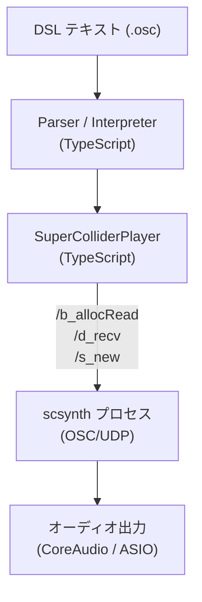

> **Note**: 本ページは 2026-05-05 時点での著者の reading の足跡です。code が真実、本ページはその時点の理解の snapshot に過ぎません。

# ADR-001 SuperCollider ベース実装の選択

OrbitScore のオーディオ出力は SuperCollider の `scsynth` (オーディオサーバー) を使っています。なぜ SuperCollider を選んだのか、他にどのような選択肢があって、何を理由に決めたのか。本章ではコミット履歴・研究ドキュメントを辿りながら、その経緯を読み解きます。

---

## 目次

1. [経緯の概略](#経緯の概略)
2. [ステップ 1: sox ベースの出発点](#ステップ-1-sox-ベースの出発点)
3. [ステップ 2: Web Audio API の試み](#ステップ-2-web-audio-api-の試み)
4. [ステップ 3: SuperCollider による置き換え](#ステップ-3-supercollider-による置き換え)
5. [ステップ 4: Rust への移行検討](#ステップ-4-rust-への移行検討)
6. [現状: SuperCollider + Rust 並走戦略](#現状-supercollider--rust-並走戦略)
7. [SuperCollider を選んだ理由の整理](#supercollider-を選んだ理由の整理)
8. [トレードオフ](#トレードオフ)
9. [アーキテクチャでの位置付け](#アーキテクチャでの位置付け)

---

## 経緯の概略

```
sox (系) → Web Audio API → SuperCollider (現行) → Rust 並走検討中
```

オーディオバックエンドは 3 回変化しています。それぞれにはっきりした失敗理由があり、SuperCollider は「3 番目の選択肢」として採用されました。Rust はさらにその後に並走で調査が始まったもので、SuperCollider の置き換えではなく補完的な位置付けです。

---

## ステップ 1: sox ベースの出発点

OrbitScore の初期実装では `sox` (Sound eXchange) によるオーディオ再生が使われていました。実装の詳細はコード上に残っていませんが、SuperCollider に置き換えた commit のメッセージに理由が明示されています:

> Replace sox-based audio engine with SuperCollider for professional-grade, low-latency audio scheduling (0-8ms drift vs 140-150ms with sox).
>
> — commit `081a474`

**140-150ms のドリフト**というのはライブコーディングには致命的な数字です。BPM 120 の 16 分音符が 125ms ですから、1 音分の遅れが発生していたことになります。

---

## ステップ 2: Web Audio API の試み

sox から SuperCollider に移行する前に、Web Audio API (`node-web-audio-api` パッケージ) を使ったエンジンが試みられました。commit `f2de913` がその実装です:

> feat(audio): implement audio engine with Web Audio API
>
> - Add AudioEngine class for audio playback
> - Add AudioFile class for loading and slicing
> - Implement WAV file support with 48kHz/24bit conversion
> - Add chop() functionality for audio slicing
> - Basic tempo control via playback rate
> - Add test suite (15 tests)
> - Install node-web-audio-api and wavefile dependencies

この実装は PR #31 で削除されました。削除コミット `cfa0381` によれば、約 1,085 行が取り除かれています:

> 削除ファイル (約1,085行):
> - audio-engine.ts および Phase 5-1で作成したモジュール群
>   - engine/ (audio-context-manager, master-gain-controller)
>   - loading/ (audio-file-loader, wav-decoder)
>   - playback/ (slice-player, sequence-player)
> - simple-player.ts (196行, 未使用)
> - precision-scheduler.ts (173行, 未使用)

削除理由はコミットメッセージに直接書かれていませんが、同時期に SuperCollider が導入されているため、レイテンシ・精度の問題が主因と考えられます。

> NOTE: unverified — Web Audio API を廃棄した直接的な理由 (レイテンシ計測値等) は PR #31 のスレッドには残っていません。sox の 140-150ms ドリフトと比べて Web Audio API がどの程度改善したかは、現時点では不明です。

---

## ステップ 3: SuperCollider による置き換え

`19766da` で SuperCollider の WIP 実装が入り、`081a474` で sox エンジンとの置き換えが完成します。

commit `081a474` の本文には SuperCollider 採用の技術的理由が詳しく書かれています:

> - Created `SuperColliderPlayer` class with OSC communication
> - Custom `orbitPlayBuf` SynthDef with chop support
> - Buffer management and caching
> - Precise timing with 1ms scheduler interval
> - Drift monitoring (0-8ms achieved)

**0-8ms のドリフト** は sox の 140-150ms と比べて 20-100 倍の改善です。1ms スケジューラーと OSC (Open Sound Control) による UDP 通信が精度の源です。

SuperCollider (scsynth) のアーキテクチャ的特性:
- **OSC/UDP 通信**: SuperCollider は OSC プロトコルで制御を受け付けるサーバーとして動作。クライアント側 (TypeScript) からメッセージを UDP で送るだけで良い
- **SynthDef のプリコンパイル**: `orbitPlayBuf` という専用 SynthDef を事前にロードしておき、再生時は `/s_new` メッセージ 1 本で音を出せる
- **Buffer 管理**: WAV ファイルはサーバー側のメモリに Buffer として保持。ファイル I/O なしで再生できる
- **独立したタイミング**: scsynth の内部クロックは OS のスケジューラから独立しており、Node.js の `setTimeout` の不正確さに影響されない

---

## ステップ 4: Rust への移行検討

SuperCollider 採用後に、将来の移行先として Rust エンジンの PoC が実施されました (Issue #91, commit `f5eee39c`)。

Rust PoC (`docs/research/RUST_POC_FINDINGS.md`) の結論:

> **Rust 化は技術的に十分現実的**。PoC のコード量はおよそ 300 行強で、cpal + symphonia のエコシステムが想像以上に成熟していた。Phase 2（本実装）に進めるだけの地固めは完了。

検証結果:
- `kick.wav` / `snare.wav` を 500ms 間隔でラウンドロビン再生成功
- 36ch オーディオインターフェースでも動作
- `cargo check / clippy / fmt` すべて clean

Rust PoC は「SuperCollider を今すぐ置き換える」という意図ではなく、長期的な選択肢として技術的実現可能性を確認するためのスパイクでした。

---

## 現状: SuperCollider + Rust 並走戦略

Rust ワークスペース (`rust/`) は現在も存在し、`orbit-audio-daemon` (WebSocket IPC サーバー) まで実装が進んでいます。一方で本番の audio engine は依然として SuperCollider (scsynth) を使っています。

```
rust/
├── crates/
│   ├── orbit-audio-core/       # platform-agnostic DSP / scheduler
│   ├── orbit-audio-native/     # cpal + symphonia + rubato (desktop)
│   ├── orbit-audio-wasm/       # wasm-bindgen スタブ (将来の web 版)
│   └── orbit-audio-daemon/     # WebSocket IPC server
```

`orbit-audio-daemon` は TypeScript クライアントから WebSocket で接続して音を出す仕組みです。将来的に SuperCollider を Rust に置き換える際の IPC プロトコル設計が進んでいます。

---

## SuperCollider を選んだ理由の整理

経緯を整理すると、SuperCollider が現行エンジンとして採用されている理由は以下の 3 点です:

### 1. 測定可能な低レイテンシ

sox: 140-150ms → SuperCollider: 0-8ms (commit `081a474` 実測値)

この改善は OrbitScore の核心的な価値 (ライブコーディングで音楽を演奏する) を直接支えています。

### 2. 実装工数の低さ

SuperCollider はすでに成熟したオーディオサーバーです。OSC/UDP という既存プロトコルで制御でき、SynthDef というオーディオ処理グラフの記述言語も持っています。`orbitPlayBuf` SynthDef と `SuperColliderPlayer` クラスを書くだけで、高品質な音声再生が実現できました。

Web Audio API での独自実装や Rust DSP の自作と比べると、実装工数が大きく異なります。

### 3. OrbitScore の学術的文脈との整合

OrbitScore は ICMC (International Computer Music Conference) での発表を目指しています。SuperCollider はコンピュータ音楽の研究コミュニティで広く使われているプラットフォームで、先行研究との比較・接続が容易です。

---

## トレードオフ

SuperCollider 採用には以下のトレードオフがあります:

| 側面 | メリット | デメリット |
|---|---|---|
| バイナリサイズ | — | scsynth + plugins で ~11.5MB の同梱が必要 (Issue #134-#136) |
| プラットフォーム | macOS では動作確認済み | Linux / Windows は別途対応が必要 |
| 依存管理 | SC 3.14.1 でバイナリが安定 | SC のバージョンアップへの追随が必要 |
| オーディオ精度 | 0-8ms ドリフトで十分 | Rust 独自実装なら理論上さらに低レイテンシ可能 |
| 将来の拡張 | SC の UGen 群が使える | SuperCollider 以外の DSP (granular synthesis 等) の追加が複雑 |

特に `fixpitch()` や `time()` (タイムストレッチ) は DSL のパーサには実装されているものの、エンジン側では未実装です (`completion-context.ts` のコメントに明示されています):

```typescript
// packages/vscode-extension/src/completion-context.ts:161-166
      // Future features (parsed by parser but not yet implemented in audio engine):
      // - fixpitch(): Pitch-preserving time-stretch (requires granular synthesis)
      // - time(): Time-stretch factor (requires granular synthesis)
      // Uncomment when granular synthesis is implemented in SuperCollider
      // completions.push(createCompletion('fixpitch', 'Set pitch offset in semitones', 'fixpitch(${1:0})'))
      // completions.push(createCompletion('time', 'Set time stretch factor', 'time(${1:1.0})'))
```

granular synthesis を SuperCollider で実装するか Rust で実装するかは、今後の判断になります。

---

## アーキテクチャでの位置付け

[アーキテクチャ概要](/orientation/architecture-overview) で示された 3 層アーキテクチャにおける SuperCollider の位置:



SuperCollider (scsynth) は TypeScript の解釈レイヤーとオーディオハードウェアの間に位置しています。TypeScript 側は OSC メッセージを UDP で送るだけで、実際の DSP 処理はすべて scsynth が担当します。

---

## 関連用語

- [scsynth](/glossary#scsynth) — OrbitScore が採用したオーディオサーバーバイナリ。本 ADR の選択対象
- [orbitPlayBuf](/glossary#orbitplaybuf) — scsynth 採用後に作成した専用 SynthDef。chop スライス再生を担当
- [SynthDef (SC)](/glossary#synthdef-sc) — `/d_recv` でロードする音声処理定義。SuperCollider 採用の恩恵の一つ
- [UGen (Unit Generator)](/glossary#ugen-unit-generator) — SynthDef を構成する基本処理単位。`PlayBuf` / `BufRateScale` 等
- [OSC (Open Sound Control)](/glossary#osc-open-sound-control) — engine と scsynth の通信プロトコル。UDP 経由で `/s_new` 等を送る
- [Buffer (SC)](/glossary#buffer-sc) — scsynth がオーディオファイルをデコードして保持するメモリ。`/b_allocRead` でロード
- [ICMC (International Computer Music Conference)](/glossary#icmc-international-computer-music-conference) — SuperCollider 選択の学術的文脈。コンピュータ音楽コミュニティとの整合

## 関連 ADR

- [ADR-002 DSL v3 Pivot](/decisions/adr-002-dsl-v3-pivot) — SuperCollider 採用と同時期に行われた MIDI → Audio の DSL 大転換
- [ADR-003 scsynth bundle strict mode](/decisions/adr-003-scsynth-bundle) — SuperCollider 採用後の配布方法として決定した scsynth 同梱戦略

## 次の深掘り候補

- `orbitPlayBuf` SynthDef の内容 — どのような UGen グラフで `chop()` の slice 再生を実現しているか
- `supercolliderjs` パッケージの役割 — OSC クライアントとして使っている箇所の詳細
- granular synthesis 実装の検討 — SuperCollider vs Rust vs 外部ライブラリ
- Rust `orbit-audio-daemon` の現状 — WebSocket IPC の protocol spec と TypeScript client の接続状態
- scsynth の Windows / Linux 対応状況 — クロスプラットフォーム展開のパス

---

## Sources

- `packages/engine/src/audio/supercollider/` — SuperColliderPlayer 実装ディレクトリ
- `packages/vscode-extension/src/completion-context.ts:161-166` — granular synthesis 未実装のコメント
- commit `f2de9133` — Web Audio API エンジン初実装 (`node-web-audio-api` + `wavefile`)
- commit `081a474` — SuperCollider 統合完成: sox 140-150ms ドリフト → 0-8ms 達成の記録
- commit `cfa0381` — PR #31: Web Audio API 実装 ~1,085 行の削除
- commit `f5eee39c` — Rust PoC 初実装 (Issue #91)
- `docs/research/RUST_POC_FINDINGS.md` — Rust PoC 所感レポート (cpal + symphonia による PoC 結果)
- `rust/README.md` — Rust ワークスペース構成と現在の status
- PR [#31](https://github.com/signalcompose/orbitscore/pull/31) — SuperCollider 一本化 (Web Audio API 削除)
- PR [#99](https://github.com/signalcompose/orbitscore/pull/99) — Rust PoC マージ (Issue #91)
