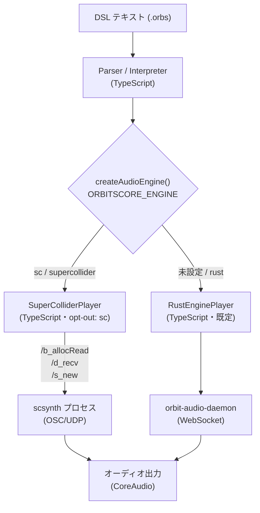

> **Note**: 本ページは 2026-09-01 時点での著者の reading の足跡です。code が真実、本ページはその時点の理解の snapshot に過ぎません。

::: warning 2026-09 時点の位置づけ
本 ADR が記録する「SuperCollider (scsynth) を音声バックエンドに選ぶ」という決定は、2026-07-03 の cutover #108（`docs/development/WORK_LOG.md` §6.179）で **既定としては上書きされました**。`createAudioEngine()` は `ORBITSCORE_ENGINE=sc` を明示したときだけ `SuperColliderPlayer` を返し、既定は Rust の `orbit-audio-daemon` です。本 ADR は決定当時の経緯を残す歴史的読解で、末尾の「Consequences revisited (2026-09)」に cutover 後の帰結をまとめます。既定経路は [RE-1. daemon アーキテクチャ概観](/rust-engine/) を参照してください。

```typescript
// packages/engine/src/audio/create-audio-engine.ts:17-22
export function createAudioEngine(env: NodeJS.ProcessEnv = process.env): AudioEngineBackend {
  const raw = env[ENGINE_ENV_VAR]
  if (resolveEngineKind(raw) === 'supercollider') {
    console.log(`🎛️ [engine] using SuperCollider backend (opt-out via ORBITSCORE_ENGINE=${raw})`)
    return new SuperColliderPlayer()
  }
```

```typescript
// packages/engine/src/audio/engine-backend.ts:52-53
/** バックエンド選択 env。既定（未設定）は Rust daemon 経路。`sc` / `supercollider` で SC に opt-out。 */
export const ENGINE_ENV_VAR = 'ORBITSCORE_ENGINE'
```
:::

# ADR-001 SuperCollider ベース実装の選択

OrbitScore のオーディオ出力は、v2.0 (2025-01) から cutover #108 (2026-07-03) までのあいだ SuperCollider の `scsynth` (オーディオサーバー) を使っていました。なぜ SuperCollider を選んだのか、他にどのような選択肢があって、何を理由に決めたのか。本章ではコミット履歴・研究ドキュメントを辿りながら、その経緯を読み解きます。

---

## 目次

1. [経緯の概略](#経緯の概略)
2. [ステップ 1: sox ベースの出発点](#ステップ-1-sox-ベースの出発点)
3. [ステップ 2: Web Audio API の試み](#ステップ-2-web-audio-api-の試み)
4. [ステップ 3: SuperCollider による置き換え](#ステップ-3-supercollider-による置き換え)
5. [ステップ 4: Rust への移行検討](#ステップ-4-rust-への移行検討)
6. [ADR 起案時 (2026-05) の並走戦略](#adr-起案時-2026-05-の並走戦略)
7. [SuperCollider を選んだ理由の整理](#supercollider-を選んだ理由の整理)
8. [トレードオフ](#トレードオフ)
9. [アーキテクチャでの位置付け](#アーキテクチャでの位置付け)
10. [Consequences revisited (2026-09)](#consequences-revisited-2026-09)

---

## 経緯の概略

```
sox (系) → Web Audio API → SuperCollider (v2.0〜) → Rust daemon (cutover #108・2026-07-03 から既定)
```

オーディオバックエンドは 4 回変化しています。それぞれにはっきりした理由があり、SuperCollider は「3 番目の選択肢」として採用されました。Rust はその後に並走で調査が始まり、ADR 起案時 (2026-05) には補完的な位置付けでしたが、2026-07 に既定へ昇格しました (詳細は末尾の「Consequences revisited」)。

---

## ステップ 1: sox ベースの出発点

OrbitScore の初期実装では `sox` (Sound eXchange) によるオーディオ再生が使われていました。実装の詳細はコード上に残っていませんが、SuperCollider に置き換えた commit のメッセージに理由が明示されています:

> Replace sox-based audio engine with SuperCollider for professional-grade, low-latency audio scheduling (0-8ms drift vs 140-150ms with sox).
>
> — commit `081a474`

**140-150ms のドリフト**というのはライブコーディングには致命的な数字です。BPM 120 の 16 分音符が 125ms ですから、1 音分の遅れが発生していたことになります。

---

## ステップ 2: Web Audio API の試み

sox から SuperCollider に移行する前に、Web Audio API (`node-web-audio-api` パッケージ) を使ったエンジンが試みられました。commit `f2de913` がその実装です:

> feat(audio): implement audio engine with Web Audio API
>
> - Add AudioEngine class for audio playback
> - Add AudioFile class for loading and slicing
> - Implement WAV file support with 48kHz/24bit conversion
> - Add chop() functionality for audio slicing
> - Basic tempo control via playback rate
> - Add test suite (15 tests)
> - Install node-web-audio-api and wavefile dependencies

この実装は PR #31 で削除されました。削除コミット `cfa0381` によれば、約 1,085 行が取り除かれています:

> 削除ファイル (約1,085行):
> - audio-engine.ts および Phase 5-1で作成したモジュール群
>   - engine/ (audio-context-manager, master-gain-controller)
>   - loading/ (audio-file-loader, wav-decoder)
>   - playback/ (slice-player, sequence-player)
> - simple-player.ts (196行, 未使用)
> - precision-scheduler.ts (173行, 未使用)

削除理由はコミットメッセージに直接書かれていませんが、同時期に SuperCollider が導入されているため、レイテンシ・精度の問題が主因と考えられます。

> NOTE: unverified — Web Audio API を廃棄した直接的な理由 (レイテンシ計測値等) は PR #31 のスレッドには残っていません。sox の 140-150ms ドリフトと比べて Web Audio API がどの程度改善したかは、69dc968 時点では不明です。

---

## ステップ 3: SuperCollider による置き換え

`19766da` で SuperCollider の WIP 実装が入り、`081a474` で sox エンジンとの置き換えが完成します。

commit `081a474` の本文には SuperCollider 採用の技術的理由が詳しく書かれています:

> - Created `SuperColliderPlayer` class with OSC communication
> - Custom `orbitPlayBuf` SynthDef with chop support
> - Buffer management and caching
> - Precise timing with 1ms scheduler interval
> - Drift monitoring (0-8ms achieved)

**0-8ms のドリフト** は sox の 140-150ms と比べて 20-100 倍の改善です。1ms スケジューラーと OSC (Open Sound Control) による UDP 通信が精度の源です。

SuperCollider (scsynth) のアーキテクチャ的特性:
- **OSC/UDP 通信**: SuperCollider は OSC プロトコルで制御を受け付けるサーバーとして動作。クライアント側 (TypeScript) からメッセージを UDP で送るだけで良い
- **SynthDef のプリコンパイル**: `orbitPlayBuf` という専用 SynthDef を事前にロードしておき、再生時は `/s_new` メッセージ 1 本で音を出せる
- **Buffer 管理**: WAV ファイルはサーバー側のメモリに Buffer として保持。ファイル I/O なしで再生できる
- **独立したタイミング**: scsynth の内部クロックは OS のスケジューラから独立しており、Node.js の `setTimeout` の不正確さに影響されない

---

## ステップ 4: Rust への移行検討

SuperCollider 採用後に、将来の移行先として Rust エンジンの PoC が実施されました (Issue #91, commit `f5eee39c`)。

Rust PoC (`docs/research/RUST_POC_FINDINGS.md`) の結論:

> **Rust 化は技術的に十分現実的**。PoC のコード量はおよそ 300 行強で、cpal + symphonia のエコシステムが想像以上に成熟していた。Phase 2（本実装）に進めるだけの地固めは完了。

検証結果:
- `kick.wav` / `snare.wav` を 500ms 間隔でラウンドロビン再生成功
- 36ch オーディオインターフェースでも動作
- `cargo check / clippy / fmt` すべて clean

Rust PoC は「SuperCollider を今すぐ置き換える」という意図ではなく、長期的な選択肢として技術的実現可能性を確認するためのスパイクでした。

---

## ADR 起案時 (2026-05) の並走戦略

本 ADR を最初に書いた 2026-05-05 時点では、Rust ワークスペース (`rust/`) は `orbit-audio-daemon` (WebSocket IPC サーバー) まで実装が進んでいる一方で、本番の audio engine は SuperCollider (scsynth) のままでした。当時の crate 構成は次の 4 つです。

```
rust/
├── crates/
│   ├── orbit-audio-core/       # platform-agnostic DSP / scheduler
│   ├── orbit-audio-native/     # cpal + symphonia + rubato (desktop)
│   ├── orbit-audio-wasm/       # wasm-bindgen スタブ (将来の web 版)
│   └── orbit-audio-daemon/     # WebSocket IPC server
```

`orbit-audio-daemon` は TypeScript クライアントから WebSocket で接続して音を出す仕組みで、この IPC プロトコル設計が cutover の土台になりました。

---

## SuperCollider を選んだ理由の整理

経緯を整理すると、SuperCollider が v2.0 でエンジンとして採用された理由は以下の 3 点です:

### 1. 測定可能な低レイテンシ

sox: 140-150ms → SuperCollider: 0-8ms (commit `081a474` 実測値)

この改善は OrbitScore の核心的な価値 (ライブコーディングで音楽を演奏する) を直接支えています。

### 2. 実装工数の低さ

SuperCollider はすでに成熟したオーディオサーバーです。OSC/UDP という既存プロトコルで制御でき、SynthDef というオーディオ処理グラフの記述言語も持っています。`orbitPlayBuf` SynthDef と `SuperColliderPlayer` クラスを書くだけで、高品質な音声再生が実現できました。

Web Audio API での独自実装や Rust DSP の自作と比べると、実装工数が大きく異なります。

### 3. OrbitScore の学術的文脈との整合

OrbitScore は ICMC (International Computer Music Conference) での発表を目指していました。SuperCollider はコンピュータ音楽の研究コミュニティで広く使われているプラットフォームで、先行研究との比較・接続が容易です。

---

## トレードオフ

SuperCollider 採用には以下のトレードオフがあります:

| 側面 | メリット | デメリット |
|---|---|---|
| バイナリサイズ | — | scsynth + plugins で ~11.5MB の同梱が必要 (Issue #134-#136) |
| プラットフォーム | macOS では動作確認済み | Linux / Windows は別途対応が必要 |
| 依存管理 | SC 3.14.1 でバイナリが安定 | SC のバージョンアップへの追随が必要 |
| オーディオ精度 | 0-8ms ドリフトで十分 | Rust 独自実装なら理論上さらに低レイテンシ可能 |
| 将来の拡張 | SC の UGen 群が使える | SuperCollider 以外の DSP (granular synthesis 等) の追加が複雑 |

特に `fixpitch()` や `time()` (タイムストレッチ) は、69dc968 時点でも補完候補から外されたままの planned 機能です (`completion-context.ts` のコメントが Issue #213 を指しています):

```typescript
// packages/vscode-extension/src/completion-context.ts:222-224
      // Future features (planned, see GitHub issue #213):
      // - fixpitch(): Pitch shift in semitones (planned)
      // - time(): Time stretch factor (planned)
```

cutover #108 の記録 (`docs/development/WORK_LOG.md` §6.179) でも `.time()` / `.fixpitch()` は「cutover blocker ではない out-of-scope → #213」と整理されています。granular synthesis を SuperCollider で実装するか Rust で実装するかという当初の問いは、既定が Rust に移ったことで Rust daemon 側の課題になりました。

---

## アーキテクチャでの位置付け

[アーキテクチャ概要](/orientation/architecture-overview) で示された 3 層アーキテクチャにおける SuperCollider の位置を、cutover 後の分岐込みで描くと次のようになります:


```mermaid
flowchart TD
    A["DSL テキスト (.orbs)"]
    B["Parser / Interpreter\n(TypeScript)"]
    F{"createAudioEngine()\nORBITSCORE_ENGINE"}
    C["SuperColliderPlayer\n(TypeScript・opt-out: sc)"]
    D["scsynth プロセス\n(OSC/UDP)"]
    R["RustEnginePlayer\n(TypeScript・既定)"]
    RD["orbit-audio-daemon\n(WebSocket)"]
    E["オーディオ出力\n(CoreAudio)"]

    A --> B
    B --> F
    F -->|"sc / supercollider"| C
    F -->|"未設定 / rust"| R
    C -->|"/b_allocRead\n/d_recv\n/s_new"| D
    R --> RD
    D --> E
    RD --> E
```

SC 経路では、scsynth は TypeScript の解釈レイヤーとオーディオハードウェアの間に位置します。TypeScript 側は OSC メッセージを UDP で送るだけで、実際の DSP 処理はすべて scsynth が担当します。Rust 経路でも「TypeScript は musical timing とコマンド送出、DSP は別プロセス」という分担は同じで、変わったのは wire protocol (OSC → WebSocket) と DSP の実装主体です。

---

## Consequences revisited (2026-09)

ADR の形式にならって、決定から約 1 年半後の帰結を記録します。

### 既定バックエンドは Rust に切り替わった (cutover #108・2026-07-03)

`docs/development/WORK_LOG.md` §6.179 が cutover の記録です。要点は 3 つあります。

- **parity の根拠は実測**: offline 3 層 22 テスト (interpreter schedule / core render / daemon render) が PASS し、22 examples の coverage matrix で audio 機能に "genuine gap なし"。gated `real-daemon-timing` で default/64f/32f を実測し、すべて ahead-of-cursor・xruns=0・polymeter parity。anchor drift は buffer 縮小で 6.7→2.4→0.7ms と単調に締まる
- **スコープは engine-level default のみ**: VS Code UI 既定 (`orbitscore.engine`) と `.vsix` 再ビルドは #366 の post-cutover 仕上げとして分離。scsynth の完全退役は「別後段」
- **flip はリバーシブル**: `ORBITSCORE_ENGINE=sc` で SC に戻れる

コード側ではファクトリのヘッダーコメントがそのまま決定の要約になっています。

```typescript
// packages/engine/src/audio/create-audio-engine.ts:1-7
/**
 * 音声バックエンドのファクトリ（post-2.0 S2 / Issue #296・cutover #108）。
 *
 * cutover #108 で既定を **Rust**（`RustEnginePlayer` / orbit-audio-daemon）に切替。
 * `ORBITSCORE_ENGINE=sc`（または `supercollider`）で既存 `SuperColliderPlayer` に opt-out
 * できる。未設定 / 未知値は既定の Rust。
 */
```

### 3 つの採用理由はどうなったか

| ADR の採用理由 | 2026-09 時点の帰結 |
|---|---|
| 1. 測定可能な低レイテンシ | Rust daemon が parity を実測で示し (§6.179)、既定を引き継いだ。SC の 0-8ms は「置き換え可能な水準」であることが確認された |
| 2. 実装工数の低さ | Rust ワークスペースは 69dc968 時点で 22 crates (`rust/crates/`: `orbit-audio-core` / `orbit-audio-daemon` / `orbit-audio-native` / `orbit-audio-sandbox` / `orbit-audio-verify` / `orbit-audio-wasm` / `orbit-child-runtime` / `orbit-child-ui` / `orbit-clap-effect-child` / `orbit-clap-host` / `orbit-clap-instrument-child` / `orbit-clap-spike` / `orbit-effect-rack-child` / `orbit-link-audio` / `orbit-plugin-scan` / `orbit-sandbox-spike` / `orbit-std-gain` / `orbit-vst3-effect-child` / `orbit-vst3-gain-oracle` / `orbit-vst3-host` / `orbit-vst3-instrument-child` / `orbit-vst3-synth-oracle`) まで育った。「工数が低い」は当初の判断として正しく、その後の投資が別の選択肢を開いた |
| 3. 学術的文脈 | 本番トラックは 2026-07-12 に ICLC 提出方向へ retarget (`CLAUDE.md`・統括 #413)。SuperCollider 依存であることが要件ではなくなった |

### SC 経路に残っているもの

- `packages/engine/src/audio/supercollider/` 一式と `SuperColliderPlayer` (`AudioEngineBackend` を `implements` する sibling として温存)
- LinkAudio 用 SC plugin (`packages/sc-link-audio`) と `orbitPlayBufLink` / `orbitLinkAudioKeepalive` SynthDef
- release pipeline の scsynth bundle 手順 (`docs/development/WORK_LOG.md` §6.186: "scsynth 関連ステップは無改変で維持"、owner 暫定判断)
- VS Code 拡張の `orbitscore.engine: "sc"` と、それに gate された `forceKillScsynth` / `selectAudioDevice` コマンド (`package.json` の `commandPalette` when 句)

本 ADR の決定は「間違っていた」のではなく、「役目を終えて opt-out に降格した」と読むのが正確です。

---

## 関連用語

- [scsynth](/glossary#scsynth) — 本 ADR で採用したオーディオサーバーバイナリ。cutover #108 以降は opt-out 経路
- [orbitPlayBuf](/glossary#orbitplaybuf) — scsynth 採用後に作成した専用 SynthDef。chop スライス再生を担当
- [SynthDef (SC)](/glossary#synthdef-sc) — `/d_recv` でロードする音声処理定義。SuperCollider 採用の恩恵の一つ
- [UGen (Unit Generator)](/glossary#ugen-unit-generator) — SynthDef を構成する基本処理単位。`PlayBuf` / `BufRateScale` 等
- [OSC (Open Sound Control)](/glossary#osc-open-sound-control) — engine と scsynth の通信プロトコル。UDP 経由で `/s_new` 等を送る
- [Buffer (SC)](/glossary#buffer-sc) — scsynth がオーディオファイルをデコードして保持するメモリ。`/b_allocRead` でロード
- [ICMC (International Computer Music Conference)](/glossary#icmc-international-computer-music-conference) — SuperCollider 選択の学術的文脈。コンピュータ音楽コミュニティとの整合

## 関連 ADR

- [ADR-002 DSL v3 Pivot](/decisions/adr-002-dsl-v3-pivot) — SuperCollider 採用と同時期に行われた MIDI → Audio の DSL 大転換
- [ADR-003 scsynth bundle strict mode](/decisions/adr-003-scsynth-bundle) — SuperCollider 採用後の配布方法として決定した scsynth 同梱戦略

## 次の深掘り候補

- `orbitPlayBuf` SynthDef の内容 — どのような UGen グラフで `chop()` の slice 再生を実現しているか
- `supercolliderjs` パッケージの役割 — OSC クライアントとして使っている箇所の詳細
- cutover #108 の parity 検証 (`docs/development/WORK_LOG.md` §6.179 が挙げる offline 22 テストと gated timing) を実際に読み、SC と daemon の dispatch モデル (fire-now vs schedule-ahead) の差を整理する
- `.time()` / `.fixpitch()` (#213) を Rust daemon 側でどう実装するか
- scsynth 完全退役の条件 — `SuperColliderPlayer` を消すときに `AudioEngineBackend` 契約から何が落とせるか

---

## Sources

- `packages/engine/src/audio/create-audio-engine.ts:1-36` — 音声バックエンドのファクトリ: cutover #108 後の既定 Rust / SC opt-out
- `packages/engine/src/audio/engine-backend.ts:1-68` — `AudioEngineBackend` 契約と `resolveEngineKind()`
- `packages/engine/src/audio/supercollider/` — SuperColliderPlayer 実装ディレクトリ (温存)
- `packages/vscode-extension/src/completion-context.ts:222-224` — `fixpitch()` / `time()` が planned (#213) であるコメント
- `rust/crates/` — 69dc968 時点の 22 crates (Consequences revisited の表)
- `docs/development/WORK_LOG.md` §6.179 — cutover #108 (2026-07-03): parity 根拠・スコープ境界・リバーシビリティ
- `docs/development/WORK_LOG.md` §6.186 — engine-kind 分岐 (#377) と scsynth bundle 手順の据え置き
- `CLAUDE.md` — 本番トラックの ICLC retarget (#413・2026-07-12)
- commit `f2de9133` — Web Audio API エンジン初実装 (`node-web-audio-api` + `wavefile`)
- commit `081a474` — SuperCollider 統合完成: sox 140-150ms ドリフト → 0-8ms 達成の記録
- commit `cfa0381` — PR #31: Web Audio API 実装 ~1,085 行の削除
- commit `f5eee39c` — Rust PoC 初実装 (Issue #91)
- `docs/research/RUST_POC_FINDINGS.md` — Rust PoC 所感レポート (cpal + symphonia による PoC 結果)
- `rust/README.md` — Rust ワークスペース構成
- PR [#31](https://github.com/signalcompose/orbitscore/pull/31) — SuperCollider 一本化 (Web Audio API 削除)
- PR [#99](https://github.com/signalcompose/orbitscore/pull/99) — Rust PoC マージ (Issue #91)
