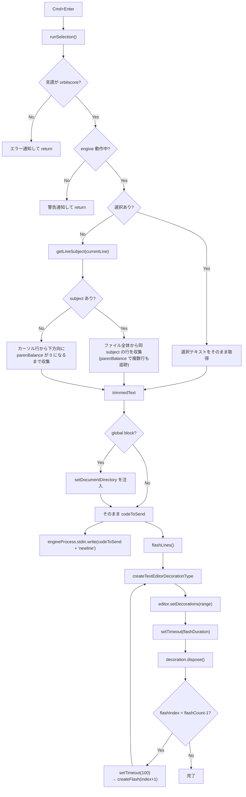

> **Note**: 本ページは 2026-05-05 時点での著者の reading の足跡です。code が真実、本ページはその時点の理解の snapshot に過ぎません。

# IV-2. インライン実行とフィードバック

`Cmd+Enter` を押すと何が起きるのでしょうか。OrbitScore では「カーソル位置のコードを賢く収集して engine に送り、実行範囲をフラッシュで知らせる」という一連の流れが走ります。本章ではその仕組みを `runSelection()` から `flashLines()`、そして `updateDiagnostics()` まで順に読み解きます。

---

## 目次

1. [エントリポイント: `runSelection()`](#エントリポイント-runselection)
2. [パス 1: テキストが選択されている場合](#パス-1-テキストが選択されている場合)
3. [パス 2: 選択なし・subject あり — subject-based block evaluation](#パス-2-選択なし-subject-あり--subject-based-block-evaluation)
4. [parenBalance による複数行追跡](#parenbalance-による複数行追跡)
5. [パス 3: 選択なし・subject なし — standalone コマンド](#パス-3-選択なし-subject-なし--standalone-コマンド)
6. [`setDocumentDirectory` の自動注入](#setdocumentdirectory-の自動注入)
7. [DSL テキストの送信](#dsl-テキストの送信)
8. [フラッシュフィードバック: `flashLines()`](#フラッシュフィードバック-flashlines)
9. [リアルタイム診断: `updateDiagnostics()`](#リアルタイム診断-updatediagnostics)
10. [フロー図](#フロー図)

---

## エントリポイント: `runSelection()`

`Cmd+Enter` が押されると `orbitscore.runSelection` コマンドが発火し、`runSelection()` 関数が呼ばれます。まず 2 つのガード条件を確認します:

```typescript
// extension.ts:935-946
async function runSelection() {
  const editor = vscode.window.activeTextEditor
  if (!editor || editor.document.languageId !== 'orbitscore') {
    vscode.window.showErrorMessage('Please open an OrbitScore file')
    return
  }

  // Check if engine is running
  if (!isLiveCodingMode || !engineProcess || engineProcess.killed) {
    vscode.window.showWarningMessage('⚠️ Engine is not running. Click status bar to start engine.')
    return
  }
```

`languageId !== 'orbitscore'` の確認は重要です。VS Code のキーバインドには `when: editorLangId == orbitscore` 条件が設定されていますが、コマンドパレットから直接呼ぶ場合にはその `when` が効かないため、関数内でも言語を確認しています。

---

## パス 1: テキストが選択されている場合

選択がある場合 (`!selection.isEmpty`) は単純です。選択範囲のテキストをそのまま取得します:

```typescript
// extension.ts:953-955
  if (!selection.isEmpty) {
    text = editor.document.getText(selection)
    executionRange = new vscode.Range(selection.start, selection.end)
```

`executionRange` は後でフラッシュのハイライト範囲としても使われます。

---

## パス 2: 選択なし・subject あり — subject-based block evaluation

選択がない場合が面白いです。「カーソルがいる行はどの変数 (subject) に属しているか」を調べて、そのsubject に関わる **ファイル全体の行** をかき集めます:

```typescript
// extension.ts:957-1004 (setDocumentDirectory 注入前まで)
  } else {
    // No selection: subject-based block evaluation
    // Detect which variable/object the current line belongs to, then collect all related lines
    const currentLine = selection.active.line
    const currentLineText = editor.document.lineAt(currentLine).text
    const subject = getLineSubject(currentLineText)

    if (subject) {
      // Collect all lines belonging to this subject (var decl + method calls)
      const collectedLines: { lineNum: number; text: string }[] = []

      for (let i = 0; i < editor.document.lineCount; i++) {
        const lineText = editor.document.lineAt(i).text
        const lineSubject = getLineSubject(lineText)

        if (lineSubject === subject) {
          collectedLines.push({ lineNum: i, text: lineText })

          // Handle multiline statements (unbalanced parentheses)
          let parenBalance = 0
          for (const char of lineText) {
            if (char === '(') parenBalance++
            if (char === ')') parenBalance--
          }
          while (parenBalance > 0 && i + 1 < editor.document.lineCount) {
            i++
            const contLine = editor.document.lineAt(i).text
            collectedLines.push({ lineNum: i, text: contLine })
            for (const char of contLine) {
              if (char === '(') parenBalance++
              if (char === ')') parenBalance--
            }
          }
        }
      }

      if (collectedLines.length > 0) {
        text = collectedLines.map((l) => l.text).join('\n')
        const firstLine = collectedLines[0].lineNum
        const lastLine = collectedLines[collectedLines.length - 1].lineNum
        executionRange = new vscode.Range(
          editor.document.lineAt(firstLine).range.start,
          editor.document.lineAt(lastLine).range.end,
        )
      } else {
        const line = editor.document.lineAt(currentLine)
        text = line.text
        executionRange = line.range
      }
    } else {
```

`getLineSubject()` は各行を見て「この行はどの変数に属するか」を返す関数です (実装詳細は本章では深掘りしません)。例えば `var _kick = ...` という行からは `_kick` が返り、`_kick.play(...)` からも `_kick` が返ります。

これにより、ファイルの中に点在する同一 subject の行をすべて集めて、まとめて engine に送ることができます。ライブコーディングのセッションでは、セットアップの設定行 (`var _kick = init SEQ ...`) とその後のパターン変更行 (`_kick.play(...)`) が離れた位置にある場合でも、正しくまとめて再評価できます。

---

## parenBalance による複数行追跡

上記のコードの中に `parenBalance` のロジックが埋め込まれています。これは**複数行にわたるメソッドチェーンをひとまとまりとして収集する**ための仕組みです。

例えばこのような DSL コードがあるとします:

```
_kick.play(
  1, 0, 1, 0,
  1, 0, 1, 0
)
```

`_kick.play(` の行で `parenBalance = 1` になります。`1, 0, 1, 0,` では変化なし、最終行の `)` で `parenBalance = 0` になり、ループを抜けます。この間の行もすべて `collectedLines` に入ります。

---

## パス 3: 選択なし・subject なし — standalone コマンド

`getLineSubject()` が `null` / falsy を返した場合は、スタンドアロンコマンド (`LOOP`, `RUN`, `MUTE` 等) と判断します。この場合も同じ `parenBalance` ロジックで複数行を追いかけますが、ファイル全体を走査するのではなく**カーソル行から下方向のみ**に範囲を拡張します:

```typescript
// extension.ts:1006-1028
    } else {
      // Standalone command (LOOP, RUN, MUTE, etc.) - evaluate current statement only
      let endLine = currentLine
      const lineText = editor.document.lineAt(currentLine).text
      let parenBalance = 0
      for (const char of lineText) {
        if (char === '(') parenBalance++
        if (char === ')') parenBalance--
      }
      while (parenBalance > 0 && endLine + 1 < editor.document.lineCount) {
        endLine++
        const contLine = editor.document.lineAt(endLine).text
        for (const char of contLine) {
          if (char === '(') parenBalance++
          if (char === ')') parenBalance--
        }
      }

      executionRange = new vscode.Range(
        editor.document.lineAt(currentLine).range.start,
        editor.document.lineAt(endLine).range.end,
      )
      text = editor.document.getText(executionRange)
    }
```

---

## `setDocumentDirectory` の自動注入

収集したテキストを engine に送る直前、`setDocumentDirectory` コマンドを自動で挿入します。`audioPath()` および `audio()` の相対パス解決を `.orbs` ファイルのディレクトリ基準で行うための仕掛けです。

```typescript
// extension.ts (Issue #168 で挙動を変更)
let codeToSend = trimmedText
const documentDir = path.dirname(editor.document.uri.fsPath)
const setDirCommand = `global.setDocumentDirectory("${documentDir.replace(/\\/g, '\\\\')}")`
const globalInitMatch = codeToSend.match(/(var\s+global\s*=\s*init\s+GLOBAL[^\n]*)/)
if (globalInitMatch) {
  // global を初期化する評価: init の直後に挿入
  const insertPos = globalInitMatch.index! + globalInitMatch[0].length
  codeToSend =
    codeToSend.slice(0, insertPos) + '\n' + setDirCommand + codeToSend.slice(insertPos)
  globalInitialized = true
} else if (globalInitialized) {
  // 既に global が存在するセッション: コード先頭に prepend
  codeToSend = setDirCommand + '\n' + codeToSend
}
```

注入は以下の 2 段階で行われます:

1. **global 初期化ブロックの評価時**: `var global = init GLOBAL` の直後に挿入し、`globalInitialized` フラグを立てる
2. **その後の任意の評価**: コード先頭に prepend する。これにより、ユーザーが別の `.orbs` ファイルに切り替えて部分評価しても、現在のファイルのディレクトリが反映される

`globalInitialized` フラグは engine プロセスのライフサイクル（起動・停止・拡張機能の activate）にバインドされ、リセットされます。

Windows のパス区切り文字 (`\`) を `\\` にエスケープする処理も含まれています (`replace(/\\/g, '\\\\')`).

engine 側に `process.cwd()` へのフォールバックは存在しません (Issue #168)。documentDirectory が未設定の状態で相対パスが指定された場合は明示エラーになります。

---

## DSL テキストの送信

収集・加工が終わったら、engine の stdin に書き込みます:

```typescript
// extension.ts:1102-1108
  // Execute the selected command (both single line and multiline)
  // Debug: log what we're sending if in debug mode (check status bar text for 🐛)
  if (statusBarItem?.text.includes('🐛')) {
    outputChannel?.appendLine(`📤 Sending: ${JSON.stringify(codeToSend)}`)
  }
  engineProcess.stdin?.write(codeToSend + '\n')
  flashLines()
```

デバッグモード (`🐛` が status bar にある) の場合は `JSON.stringify` でエスケープした送信テキストを Output Channel にも出力します。デバッグ時に「何が送られたか」を確認できる仕組みです。

送信後すぐに `flashLines()` を呼んでいます。エンジンからの応答を待たずに視覚フィードバックが走るため、ユーザーはすぐに「実行された」感を得られます。

---

## フラッシュフィードバック: `flashLines()`

実行した範囲をエディタ上で点滅させるのが `flashLines()` です。`createTextEditorDecorationType` (VS Code API) を使って実装されています:

```typescript
// extension.ts:1033-1083
  // Visual feedback: flash the executed lines (configurable)
  const flashLines = () => {
    const config = vscode.workspace.getConfiguration('orbitscore')
    const flashCount = config.get<number>('flashCount', 3)
    const flashDuration = config.get<number>('flashDuration', 150)
    const flashColor = config.get<string>('flashColor', 'selection')
    const flashCustomColor = config.get<string>('flashCustomColor', '#ff6b6b')

    // Determine background color
    let backgroundColor: string | vscode.ThemeColor
    switch (flashColor) {
      case 'error':
        backgroundColor = new vscode.ThemeColor('editorError.foreground')
        break
      case 'warning':
        backgroundColor = new vscode.ThemeColor('editorWarning.foreground')
        break
      case 'info':
        backgroundColor = new vscode.ThemeColor('editorInfo.foreground')
        break
      case 'custom':
        backgroundColor = flashCustomColor
        break
      default: // 'selection'
        backgroundColor = new vscode.ThemeColor('editor.selectionBackground')
        break
    }

    const isWholeLine = selection.isEmpty
    const range = executionRange

    // Create flash function
    const createFlash = (flashIndex: number) => {
      const decoration = vscode.window.createTextEditorDecorationType({
        backgroundColor: backgroundColor,
        isWholeLine: isWholeLine,
      })
      editor.setDecorations(decoration, [range])

      setTimeout(() => {
        decoration.dispose()
        // Schedule next flash if not the last one
        if (flashIndex < flashCount - 1) {
          setTimeout(() => createFlash(flashIndex + 1), 100)
        }
      }, flashDuration)
    }

    // Start flashing
    createFlash(0)
  }
```

`createTextEditorDecorationType` は毎回新しい decoration オブジェクトを作り、`setTimeout` 後に `decoration.dispose()` で破棄します。これが「点滅」の 1 サイクルです。`flashCount - 1` になるまで再帰的に `createFlash(flashIndex + 1)` を呼び出すことで、指定回数だけフラッシュを繰り返します。

デフォルト値は:
- `flashCount`: 3 回
- `flashDuration`: 150ms (点灯時間)
- フラッシュ間隔: `100ms` (ハードコード)

選択なしで実行した場合は `isWholeLine = true` になるため、行全体がハイライトされます。選択ありの場合は `isWholeLine = false` で、選択テキスト部分のみがハイライトされます。

設定できる色の種類:

| `flashColor` 設定値 | 使用される色 |
|---|---|
| `"selection"` (default) | `editor.selectionBackground` (テーマ色) |
| `"error"` | `editorError.foreground` (テーマ色) |
| `"warning"` | `editorWarning.foreground` (テーマ色) |
| `"info"` | `editorInfo.foreground` (テーマ色) |
| `"custom"` | `flashCustomColor` の hex 値 (default: `#ff6b6b`) |

---

## リアルタイム診断: `updateDiagnostics()`

`Cmd+Enter` とは別に、タイピングのたびに `updateDiagnostics()` が走ります。`activate()` が登録した `onDidChangeTextDocument` イベントで駆動します。

```typescript
// extension.ts:1180-1257
async function updateDiagnostics(
  document: vscode.TextDocument,
  collection: vscode.DiagnosticCollection,
) {
  const diagnostics: vscode.Diagnostic[] = []
  const text = document.getText()
  const lines = text.split('\n')

  // Track multiline statements (lines ending with open parenthesis and comma)
  let inMultilineStatement = false

  for (let i = 0; i < lines.length; i++) {
    const line = lines[i]
    if (!line) continue

    // Detect multiline statement start: ends with '(' or ','
    const trimmedLine = line.trim()
    if (trimmedLine.endsWith('(') || trimmedLine.endsWith(',')) {
      if (!inMultilineStatement) {
        inMultilineStatement = true
      }
      continue // Skip parenthesis check for multiline statements
    }

    // Detect multiline statement end: line with closing parenthesis
    if (inMultilineStatement && trimmedLine.endsWith(')')) {
      inMultilineStatement = false
      continue // Skip parenthesis check for closing line
    }

    // Skip parenthesis check if we're inside a multiline statement
    if (inMultilineStatement) {
      continue
    }

    // Check for common syntax errors

    // Missing closing parenthesis (only for single-line statements)
    const openParens = (line.match(/\(/g) || []).length
    const closeParens = (line.match(/\)/g) || []).length
    if (openParens > closeParens) {
      const diagnostic = new vscode.Diagnostic(
        new vscode.Range(i, 0, i, line.length),
        'Missing closing parenthesis',
        vscode.DiagnosticSeverity.Error,
      )
      diagnostics.push(diagnostic)
    }

    // Invalid tempo range
    const tempoMatch = line.match(/\.tempo\((\d+)\)/)
    if (tempoMatch && tempoMatch[1]) {
      const tempo = parseInt(tempoMatch[1])
      if (tempo < 20 || tempo > 999) {
        const start = line.indexOf(tempoMatch[1])
        const diagnostic = new vscode.Diagnostic(
          new vscode.Range(i, start, i, start + tempoMatch[1].length),
          `Tempo must be between 20 and 999 (got ${tempo})`,
          vscode.DiagnosticSeverity.Warning,
        )
        diagnostics.push(diagnostic)
      }
    }

    // Check for deprecated syntax (old MIDI DSL)
    if (line.includes('sequence ') && !line.includes('//')) {
      const diagnostic = new vscode.Diagnostic(
        new vscode.Range(i, 0, i, line.length),
        'Deprecated: Use "var seq = init GLOBAL.seq" instead of "sequence"',
        vscode.DiagnosticSeverity.Warning,
      )
      diagnostic.tags = [vscode.DiagnosticTag.Deprecated]
      diagnostics.push(diagnostic)
    }
  }

  collection.set(document.uri, diagnostics)
}
```

診断のチェック内容は 3 種類です:

### 1. 括弧の対応チェック (Error)

単一行のみが対象です。複数行ステートメント (行末が `(` または `,` で終わる行) は `inMultilineStatement` フラグで検出してスキップします。単一行で `(` > `)` なら `DiagnosticSeverity.Error` を出します。

::: tip 設計上の制限 (バグではない)
複数行ステートメント全体での括弧対応は意図的にチェックしていません。タイピング中の中間状態 (例: `_kick.play(` を打った直後) で false positive を出さないための trade-off です。実用上は `Cmd+Enter` 実行時に engine 側のパーサが構文エラーを返すので、二重防御の一段目として「単一行で明らかに閉じ忘れている」ケースのみ早期警告する設計です。複数行対応の改善案は「次の深掘り候補」を参照してください。
:::

### 2. tempo 範囲チェック (Warning)

`.tempo(N)` の N が 20 未満または 999 超なら `DiagnosticSeverity.Warning`。正規表現 `/\.tempo\((\d+)\)/` でキャプチャし、範囲外の数値の桁のみをハイライトします (`start` / `start + tempoMatch[1].length`)。

### 3. deprecated キーワード検出 (Warning + Deprecated タグ)

`sequence ` という文字列を含む行 (コメントアウトを除く) は旧 MIDI DSL の構文です。`DiagnosticTag.Deprecated` を付けることで、VS Code が取り消し線スタイルで表示します。

ちなみに `sequence ` の検出が「旧 MIDI DSL の名残」である背景は [ADR-002](/decisions/adr-002-dsl-v3-pivot) で扱います。

---

## フロー図



---

## 関連用語

- [subject-based block evaluation](/glossary#subject-based-block-evaluation) — `runSelection()` パス 2 の動作モード。カーソル行の subject を元にファイル全体から関連行を収集
- [flashLines()](/glossary#flashlines) — 実行した行範囲をエディタ上で点滅させる視覚フィードバック関数
- [DiagnosticCollection](/glossary#diagnosticcollection) — `updateDiagnostics()` が書き込む診断コレクション。タイピングごとに更新
- [DiagnosticTag.Deprecated](/glossary#diagnostictagdeprecated) — `sequence ` キーワード検出時に付加するタグ。取り消し線スタイルで表示
- [Extension Host](/glossary#extension-host) — `runSelection()` と `flashLines()` が動くプロセス。engine への stdin 送信もここで行う
- [setDocumentDirectory](/glossary#setdocumentdirectory) — global ブロック評価時に自動注入される相対パス解決コマンド
- [language ID (orbitscore)](/glossary#language-id-orbitscore) — `runSelection()` が最初に確認するガード条件。`.orbs` ファイル以外では実行しない
- [DSL (Domain-Specific Language)](/glossary#dsl) — engine の stdin に送られるテキスト。`codeToSend + '\n'` の形式

## 関連 ADR

- [ADR-002 DSL v3 Pivot](/decisions/adr-002-dsl-v3-pivot) — `sequence ` キーワードが deprecated として検出される背景 (v1.0 MIDI DSL の残滓)

## 次の深掘り候補

- `getLineSubject()` の実装詳細 — どのような正規表現・ルールで行の subject を判定しているか
- `setupStdoutHandler()` — engine から返ってくる応答の解析と Output Channel への表示
- `configureFlash` コマンド — Quick Pick UI で flashCount / flashDuration / flashColor をインタラクティブに設定する仕組み
- 診断の精度向上候補 — 複数行全体を追いかけた括弧対応チェック (現状は単一行のみ)
- `sequence ` 以外の deprecated 構文の列挙 — v1 DSL 残滓の全量調査

---

## Sources

- `packages/vscode-extension/src/extension.ts:935-1109` — `runSelection()` 全体: ガード・subject-based collection・注入・送信・フラッシュ
- `packages/vscode-extension/src/extension.ts:953-955` — パス 1: 選択ありの場合
- `packages/vscode-extension/src/extension.ts:957-1004` — パス 2: subject-based block evaluation
- `packages/vscode-extension/src/extension.ts:1006-1028` — パス 3: standalone コマンド
- `packages/vscode-extension/src/extension.ts:1033-1083` — `flashLines()`: 点滅フィードバック実装
- `packages/vscode-extension/src/extension.ts:1085-1100` — `setDocumentDirectory` 自動注入
- `packages/vscode-extension/src/extension.ts:1107` — `engineProcess.stdin?.write(codeToSend + '\n')`: 送信
- `packages/vscode-extension/src/extension.ts:1180-1257` — `updateDiagnostics()`: 括弧・tempo・deprecated 検出
