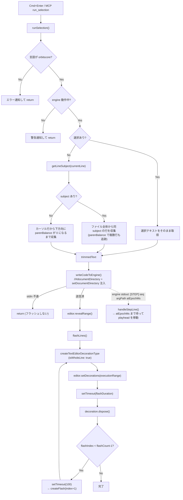

> **Note**: 本ページは 2026-09-01 時点での著者の reading の足跡です。code が真実、本ページはその時点の理解の snapshot に過ぎません。

# IV-2. インライン実行とフィードバック

`Cmd+Enter` を押すと何が起きるのでしょうか。OrbitScore では「カーソル位置のコードを賢く収集して engine に送り、実行範囲をフラッシュで知らせる」という一連の流れが走ります。本章ではその仕組みを `runSelection()` から `writeCodeToEngine()`、`flashLines()`、そして `updateDiagnostics()` まで順に読み解きます。2026-05 の初稿以降にフィードバックの経路は 2 つ増えました。engine から返る `[STEP]` 行を使った **live playhead** (#390) と、MCP 経由の評価に結果を返す **`//#evalMark`** (#614) です。

---

## 目次

1. [エントリポイント: `runSelection()`](#エントリポイント-runselection)
2. [パス 1: テキストが選択されている場合](#パス-1-テキストが選択されている場合)
3. [パス 2: 選択なし・subject あり — subject-based block evaluation](#パス-2-選択なし-subject-あり--subject-based-block-evaluation)
4. [parenBalance による複数行追跡](#parenbalance-による複数行追跡)
5. [パス 3: 選択なし・subject なし — standalone コマンド](#パス-3-選択なし-subject-なし--standalone-コマンド)
6. [`writeCodeToEngine()`: メタ行と `setDocumentDirectory` の注入](#writecodetoengine-メタ行と-setdocumentdirectory-の注入)
7. [送信の後始末: revealRange とフラッシュ](#送信の後始末-revealrange-とフラッシュ)
8. [フラッシュフィードバック: `flashLines()`](#フラッシュフィードバック-flashlines)
9. [live playhead: `[STEP]` 行で「今どこが鳴っているか」](#live-playhead-step-行で今どこが鳴っているか)
10. [評価結果のフィードバック: `//#evalMark`](#評価結果のフィードバック-evalmark)
11. [リアルタイム診断: `updateDiagnostics()`](#リアルタイム診断-updatediagnostics)
12. [フロー図](#フロー図)
13. [2026-09 時点の drift](#2026-09-時点の-drift)

---

## エントリポイント: `runSelection()`

`Cmd+Enter` が押されると `orbitscore.runSelection` コマンドが発火し、`runSelection()` 関数が呼ばれます。まず 2 つのガード条件を確認します:

```typescript
// packages/vscode-extension/src/extension.ts:2716-2727
async function runSelection() {
  const editor = vscode.window.activeTextEditor
  if (!editor || editor.document.languageId !== 'orbitscore') {
    vscode.window.showErrorMessage('Please open an OrbitScore file')
    return
  }

  // Check if engine is running
  if (!isLiveCodingMode || !engineProcess || engineProcess.killed) {
    vscode.window.showWarningMessage('⚠️ Engine is not running. Click status bar to start engine.')
    return
  }
```

`languageId !== 'orbitscore'` の確認は重要です。VS Code のキーバインドには `when: editorLangId == orbitscore` 条件が設定されていますが、コマンドパレットから直接呼ぶ場合にはその `when` が効かないため、関数内でも言語を確認しています。

ちなみに MCP の `run_selection` ツールもこの同じ関数を呼びます (`runSelectionForAgent()`、`extension.ts:3405`)。エージェントは事前に `set_selection` で範囲を置くので、パス 1 を通ることになります。

---

## パス 1: テキストが選択されている場合

選択がある場合 (`!selection.isEmpty`) は単純です。選択範囲のテキストをそのまま取得します:

```typescript
// packages/vscode-extension/src/extension.ts:2734-2736
  if (!selection.isEmpty) {
    text = editor.document.getText(selection)
    executionRange = new vscode.Range(selection.start, selection.end)
```

`executionRange` は後でフラッシュのハイライト範囲としても使われます。

---

## パス 2: 選択なし・subject あり — subject-based block evaluation

選択がない場合が面白いです。「カーソルがいる行はどの変数 (subject) に属しているか」を調べて、そのsubject に関わる **ファイル全体の行** をかき集めます:

```typescript
// packages/vscode-extension/src/extension.ts:2737-2786 (setDocumentDirectory 注入前まで)
  } else {
    // No selection: subject-based block evaluation
    // Detect which variable/object the current line belongs to, then collect all related lines
    const currentLine = selection.active.line
    const currentLineText = editor.document.lineAt(currentLine).text
    const subject = getLineSubject(currentLineText)

    if (subject) {
      // Collect all lines belonging to this subject (var decl + method calls)
      const collectedLines: { lineNum: number; text: string }[] = []

      for (let i = 0; i < editor.document.lineCount; i++) {
        const lineText = editor.document.lineAt(i).text
        const lineSubject = getLineSubject(lineText)

        if (lineSubject === subject) {
          collectedLines.push({ lineNum: i, text: lineText })

          // Handle multiline statements (unbalanced parentheses)
          let parenBalance = 0
          for (const char of lineText) {
            if (char === '(') parenBalance++
            if (char === ')') parenBalance--
          }
          while (parenBalance > 0 && i + 1 < editor.document.lineCount) {
            i++
            const contLine = editor.document.lineAt(i).text
            collectedLines.push({ lineNum: i, text: contLine })
            for (const char of contLine) {
              if (char === '(') parenBalance++
              if (char === ')') parenBalance--
            }
          }
        }
      }

      if (collectedLines.length > 0) {
        text = collectedLines.map((l) => l.text).join('\n')
        const firstLine = collectedLines[0].lineNum
        const lastLine = collectedLines[collectedLines.length - 1].lineNum
        executionRange = new vscode.Range(
          editor.document.lineAt(firstLine).range.start,
          editor.document.lineAt(lastLine).range.end,
        )
      } else {
        const line = editor.document.lineAt(currentLine)
        text = line.text
        executionRange = line.range
      }
    } else {
```

`getLineSubject()` は各行を見て「この行はどの変数に属するか」を返す関数です。初稿では深掘りしませんでしたが、実装は 2 本の正規表現だけの小さなものです。

```typescript
// packages/vscode-extension/src/extension.ts:2701-2714
function getLineSubject(lineText: string): string | null {
  const trimmed = lineText.trim()
  if (!trimmed || trimmed.startsWith('//')) return null

  // var <name> = init ...
  const varMatch = trimmed.match(/^var\s+(\w+)\s*=/)
  if (varMatch) return varMatch[1]

  // <name>.method(...)
  const dotMatch = trimmed.match(/^(\w+)\./)
  if (dotMatch) return dotMatch[1]

  return null
}
```

例えば `var _kick = ...` という行からは `_kick` が返り、`_kick.play(...)` からも `_kick` が返ります。コメント行と空行は `null` です。

これにより、ファイルの中に点在する同一 subject の行をすべて集めて、まとめて engine に送ることができます。ライブコーディングのセッションでは、セットアップの設定行 (`var _kick = init global.seq`) とその後のパターン変更行 (`_kick.play(...)`) が離れた位置にある場合でも、正しくまとめて再評価できます。

---

## parenBalance による複数行追跡

上記のコードの中に `parenBalance` のロジックが埋め込まれています。これは**複数行にわたるメソッドチェーンをひとまとまりとして収集する**ための仕組みです。

例えばこのような DSL コードがあるとします:

```
_kick.play(
  1, 0, 1, 0,
  1, 0, 1, 0
)
```

`_kick.play(` の行で `parenBalance = 1` になります。`1, 0, 1, 0,` では変化なし、最終行の `)` で `parenBalance = 0` になり、ループを抜けます。この間の行もすべて `collectedLines` に入ります。

---

## パス 3: 選択なし・subject なし — standalone コマンド

`getLineSubject()` が `null` を返した場合は、スタンドアロンコマンド (`LOOP`, `RUN`, `MUTE` 等) と判断します。この場合も同じ `parenBalance` ロジックで複数行を追いかけますが、ファイル全体を走査するのではなく**カーソル行から下方向のみ**に範囲を拡張します:

```typescript
// packages/vscode-extension/src/extension.ts:2786-2809
    } else {
      // Standalone command (LOOP, RUN, MUTE, etc.) - evaluate current statement only
      let endLine = currentLine
      const lineText = editor.document.lineAt(currentLine).text
      let parenBalance = 0
      for (const char of lineText) {
        if (char === '(') parenBalance++
        if (char === ')') parenBalance--
      }
      while (parenBalance > 0 && endLine + 1 < editor.document.lineCount) {
        endLine++
        const contLine = editor.document.lineAt(endLine).text
        for (const char of contLine) {
          if (char === '(') parenBalance++
          if (char === ')') parenBalance--
        }
      }

      executionRange = new vscode.Range(
        editor.document.lineAt(currentLine).range.start,
        editor.document.lineAt(endLine).range.end,
      )
      text = editor.document.getText(executionRange)
    }
```

---

## `writeCodeToEngine()`: メタ行と `setDocumentDirectory` の注入

収集したテキストを engine に送る役目は、2026-05 時点では `runSelection()` の末尾に直書きされていましたが、MCP の `evaluate_orbitscore` と共有するために `writeCodeToEngine()` に切り出されています。`audioPath()` や `audio()` の相対パス解決を `.orbs` ファイルのディレクトリ基準で行うための仕掛けが 2 層あります。

```typescript
// packages/vscode-extension/src/extension.ts:3000-3032
function writeCodeToEngine(rawCode: string, documentDir: string | undefined): boolean {
  if (!engineProcess || !engineProcess.stdin || !engineProcess.stdin.writable) {
    // 呼び出し側ガード通過後に engine が死んだ稀な競合。黙って no-op すると
    // palette 実行では「実行したのに無反応」になるので、ここで必ず痕跡を残す。
    outputChannel?.appendLine('⚠️ Engine stdin is not writable — code was NOT sent (engine died?)')
    return false
  }
  let codeToSend = rawCode
  if (documentDir) {
    // I3 (#456): REPL メタ行で基準ディレクトリを帯域外で先渡しする。import 文（IM.2）は
    // どの statement よりも先に評価されるため、下の DSL 注入（statements として実行）では
    // 間に合わない — メタ行だけが import の基準（IM.6）を初回 eval から確定できる。
    // DSL 注入も残す（audio() 等の既存経路の実績を変えない・同値の冪等再設定）。
    codeToSend = `//#documentDirectory ${documentDir}\n` + codeToSend
    const setDirCommand = `global.setDocumentDirectory("${documentDir.replace(/\\/g, '\\\\')}")`
    const globalInitMatch = codeToSend.match(/(var\s+global\s*=\s*init\s+GLOBAL[^\n]*)/)
    if (globalInitMatch) {
      const insertPos = globalInitMatch.index! + globalInitMatch[0].length
      codeToSend =
        codeToSend.slice(0, insertPos) + '\n' + setDirCommand + codeToSend.slice(insertPos)
      globalInitialized = true
    } else if (globalInitialized) {
      codeToSend = setDirCommand + '\n' + codeToSend
    }
  }

  // Debug: log what we're sending if in debug mode (check status bar text for 🐛)
  if (statusBarItem?.text.includes('🐛')) {
    outputChannel?.appendLine(`📤 Sending: ${JSON.stringify(codeToSend)}`)
  }
  engineProcess.stdin.write(codeToSend + '\n')
  return true
}
```

2 層とは次のことです。

1. **`//#documentDirectory` メタ行** (#456 I3): 先頭に必ず付けます。REPL 側がメタ行として先に処理するため、`import` 文 (どの statement よりも先に評価される) の基準ディレクトリも初回 eval から確定します
2. **`global.setDocumentDirectory(...)` の DSL 注入**: 従来どおりの経路で、`var global = init GLOBAL` を含む評価ならその直後に挿入して `globalInitialized` フラグを立て、以降の評価ではコード先頭に prepend します。global 未初期化のセッションでは注入しません (`global is not defined` になるため)

`globalInitialized` フラグは engine プロセスのライフサイクル (起動・停止・拡張の activate) でリセットされます。Windows のパス区切り文字 (`\`) を `\\` にエスケープする処理も含まれています。

デバッグモード (`🐛` が status bar にある) の場合は `JSON.stringify` でエスケープした送信テキストを Output Channel にも出力します。

engine 側に `process.cwd()` へのフォールバックは存在しません (Issue #168)。documentDirectory が未設定の状態で相対パスが指定された場合は明示エラーになります。

---

## 送信の後始末: revealRange とフラッシュ

`runSelection()` の末尾はこうなっています。

```typescript
// packages/vscode-extension/src/extension.ts:2873-2880
  if (!writeCodeToEngine(trimmedText, path.dirname(editor.document.uri.fsPath))) {
    return // stdin 不達（engine 死の競合）— 送れていないのに flash で「実行した」と見せない
  }
  // Scroll the executed range into view before flashing it: subject-block
  // auto-detection (no explicit selection) never reveals, so an agent-driven run
  // that lands on an off-screen line would otherwise flash outside the viewport.
  editor.revealRange(executionRange, vscode.TextEditorRevealType.InCenterIfOutsideViewport)
  flashLines()
```

ここで気をつけたいのは、送信に失敗したら **フラッシュしない** という順序です。2026-05 時点は `write` してすぐ `flashLines()` を呼んでいましたが、stdin に届いていないのに「実行した」と見せるのは誤ったフィードバックです。`revealRange` はエージェント経由の実行で画面外の行が対象になったときに、フラッシュが見えないのを防ぐために足されました (#388、`docs/development/WORK_LOG.md` §6.193)。

---

## フラッシュフィードバック: `flashLines()`

実行した範囲をエディタ上で点滅させるのが `flashLines()` です。`createTextEditorDecorationType` (VS Code API) を使って実装されています:

```typescript
// packages/vscode-extension/src/extension.ts:2814-2871
  // Visual feedback: flash the executed lines (configurable)
  const flashLines = () => {
    const config = vscode.workspace.getConfiguration('orbitscore')
    const flashCount = config.get<number>('flashCount', 3)
    const flashDuration = config.get<number>('flashDuration', 150)
    const flashColor = config.get<string>('flashColor', 'selection')
    const flashCustomColor = config.get<string>('flashCustomColor', '#ff6b6b')

    // Determine background color
    let backgroundColor: string | vscode.ThemeColor
    switch (flashColor) {
      case 'error':
        backgroundColor = new vscode.ThemeColor('editorError.foreground')
        break
      case 'warning':
        backgroundColor = new vscode.ThemeColor('editorWarning.foreground')
        break
      case 'info':
        backgroundColor = new vscode.ThemeColor('editorInfo.foreground')
        break
      case 'custom':
        backgroundColor = flashCustomColor
        break
      default: // 'selection'
        backgroundColor = new vscode.ThemeColor('editor.selectionBackground')
        break
    }

    // Always paint the whole line(s), never just the selected characters. When a
    // non-empty selection was executed — which is every MCP-triggered run, since
    // the Agent Bridge always targets a precise range via set_selection before
    // calling run_selection (#388) — a character-bounded decoration exactly
    // overlaps the editor's native selection highlight (same range, and with the
    // default flashColor='selection' the same background color too), so toggling
    // it on/off is visually imperceptible: the "off" state still shows the native
    // selection underneath. Whole-line painting extends past the selected text and
    // stays visible regardless of selection state, color config, or trigger source.

    // Create flash function
    const createFlash = (flashIndex: number) => {
      const decoration = vscode.window.createTextEditorDecorationType({
        backgroundColor: backgroundColor,
        isWholeLine: true,
      })
      editor.setDecorations(decoration, [executionRange])

      setTimeout(() => {
        decoration.dispose()
        // Schedule next flash if not the last one
        if (flashIndex < flashCount - 1) {
          setTimeout(() => createFlash(flashIndex + 1), 100)
        }
      }, flashDuration)
    }

    // Start flashing
    createFlash(0)
  }
```

`createTextEditorDecorationType` は毎回新しい decoration オブジェクトを作り、`setTimeout` 後に `decoration.dispose()` で破棄します。これが「点滅」の 1 サイクルです。`flashCount - 1` になるまで再帰的に `createFlash(flashIndex + 1)` を呼び出すことで、指定回数だけフラッシュを繰り返します。

デフォルト値は:
- `flashCount`: 3 回
- `flashDuration`: 150ms (点灯時間)
- フラッシュ間隔: `100ms` (ハードコード)

`isWholeLine` は **常に `true`** です。2026-05 時点は「選択あり = 選択文字だけ」でしたが、MCP の `run_selection` は必ず `set_selection` で範囲を置いてから呼ぶため、文字範囲の decoration がエディタ自身の選択ハイライトと完全に重なって、点滅が見えなくなっていました (`docs/development/WORK_LOG.md` §6.193)。行全体を塗れば選択状態・色設定・トリガ元に関係なく見えます。

設定できる色の種類:

| `flashColor` 設定値 | 使用される色 |
|---|---|
| `"selection"` (default) | `editor.selectionBackground` (テーマ色) |
| `"error"` | `editorError.foreground` (テーマ色) |
| `"warning"` | `editorWarning.foreground` (テーマ色) |
| `"info"` | `editorInfo.foreground` (テーマ色) |
| `"custom"` | `flashCustomColor` の hex 値 (default: `#ff6b6b`) |

---

## live playhead: `[STEP]` 行で「今どこが鳴っているか」

フラッシュは「送った」ことのフィードバックですが、#390 で「鳴っている」ことのフィードバックが加わりました。engine (Rust daemon 経路の `rust-engine-player.ts`) は dispatch した play イベントごとに機械可読な 1 行を stdout に出します。

```typescript
// packages/vscode-extension/src/playhead.ts:39-54
// Grammar: "[STEP] <seqName> <argPath> <atEpochMs>". seqName is a DSL
// identifier (no whitespace); argPath is dot-joined non-negative integers;
// atEpochMs is an integer (the engine rounds fractional bar subdivisions).
const STEP_LINE_RE = /^\s*\[STEP\]\s+(\S+)\s+(\d+(?:\.\d+)*)\s+(\d+)\s*$/

/**
 * Parse one stdout line as a `[STEP]` marker. Returns null for anything that
 * does not match the grammar exactly (the stdout stream is mostly human logs).
 */
export function parseStepLine(line: string): StepEvent | null {
  const m = line.match(STEP_LINE_RE)
  if (!m) return null
  const atEpochMs = Number(m[3])
  if (!Number.isSafeInteger(atEpochMs)) return null
  return { seqName: m[1], argPath: m[2], atEpochMs }
}
```

`argPath` は `play()` の引数ツリーへのインデックスで、`"1.0"` なら「2 番目の引数の中の最初の要素」です。`atEpochMs` はイベントの **グリッド時刻** で、engine は lookahead で先に dispatch するため行は早く届きます。拡張はその時刻まで decoration を遅らせます。

```typescript
// packages/vscode-extension/src/extension.ts:235-246
function handleStepLine(step: StepEvent): void {
  const delayMs = step.atEpochMs - Date.now()
  if (delayMs < -1000) return
  const timeout = setTimeout(
    () => {
      playheadTimeouts.delete(timeout)
      showPlayheadStep(step)
    },
    Math.max(0, delayMs),
  )
  playheadTimeouts.add(timeout)
}
```

`showPlayheadStep()` は `findPlayArgRangeForPath()` (`playhead.ts:509-534`) で document テキストの中から `<seqName>.play(...)` の該当引数の文字範囲を探し、seq ごとに 1 つの active range を置き換えます。色は `orbitscore.playheadPalette` (32 色、東京の地下鉄路線色をベースにした first-come 割り当て) から `colorForSeq()` で決まり、`⏹ <seq>` 行や `✅ Global stopped` 行、engine 停止で消えます。`[STEP]` 行そのものは `shouldFilterLine()` で Output Channel から隠されます。

引数ツリーの深いネスト (`(A)(B).root(X)` のような group run や `[ ... ]` の stack) には「解決できる最深の祖先」で妥協する、と `findPlayArgRangeForPath()` のコメントが書いています。間違った引数を光らせるより、1 段浅い範囲を光らせる方が誤解が少ない、という判断です。

---

## 評価結果のフィードバック: `//#evalMark`

人間のユーザーはエディタの赤線と Output Channel でエラーに気づけますが、MCP 経由の LLM には `evaluate_orbitscore` の `ok` しか届きません。そして `writeCodeToEngine()` の `true` は「stdin に届いた」までしか意味しません。#614 は、コードの直後に `//#evalMark {"requestId":...}` を送り、engine が FIFO でそこに到達したときに、直前の評価で溜まった診断を JSON で返す仕組みを足しました。

```typescript
// packages/vscode-extension/src/extension.ts:3059-3068
  const result = await evalMarkBridge.send((line, onError) => {
    // 既存 bridge（pluginUi）と同じ書き方に揃える。error は null 込みで来る。
    stdin.write(line, (error) => {
      if (error) {
        outputChannel?.appendLine(`⚠️ failed to write //#evalMark to stdin: ${error.message}`)
        onError(error)
      }
    })
  }, randomUUID())
  if (result.ok) return { ok: true }
```

stdout 側の受信は `setupStdoutHandler()` に **独立した分岐** として置かれています。コメントが、最初は `{"pluginUi"` 分岐に相乗りさせて一度も dispatch されず、ユニットテストは全部緑で実機 E2E だけが捕まえた、と記録しています。

```typescript
// packages/vscode-extension/src/extension.ts:1501-1509
        } else if (trimmedLine.startsWith('{"evalMark"')) {
          // 🔴 #614: この分岐は**独立していなければならない**。最初は `{"pluginUi"` 分岐の中に
          // 相乗りさせてしまい、`{"evalMark"` 行は prefix チェーンをすり抜けて一度も
          // dispatch されなかった（ユニットテストは全て緑・実機 E2E だけが捕まえた）。
          const parsed = isCurrent && evalMarkBridge.handleLine(rawLine)
          if (!parsed && isCurrent) {
            outputChannel?.appendLine(`⚠️ received a malformed //#evalMark result line: ${rawLine}`)
          }
        }
```

editor の `Cmd+Enter` はこのマーカーを送りません。人間にはフラッシュ + 診断 + Output Channel で足りるからで、evalMark は MCP の evaluate 専用です。MCP ツール群の全体は [IV-3. MCP サーバと実機 gated E2E](/editor/mcp-and-gated-e2e) で扱います。

---

## リアルタイム診断: `updateDiagnostics()`

`Cmd+Enter` とは別に、ドキュメントの open / change / activation 時に `updateDiagnostics()` が走ります (#384、[IV-1](/editor/vscode-architecture#intellisense-と診断の登録))。前半は 2026-05 時点と同じ行内チェック 3 種です。

```typescript
// packages/vscode-extension/src/extension.ts:3965-4039
async function updateDiagnostics(
  document: vscode.TextDocument,
  collection: vscode.DiagnosticCollection,
) {
  const diagnostics: vscode.Diagnostic[] = []
  const text = document.getText()
  const lines = text.split('\n')

  // Track multiline statements (lines ending with open parenthesis and comma)
  let inMultilineStatement = false

  for (let i = 0; i < lines.length; i++) {
    const line = lines[i]
    if (!line) continue

    // Detect multiline statement start: ends with '(' or ','
    const trimmedLine = line.trim()
    if (trimmedLine.endsWith('(') || trimmedLine.endsWith(',')) {
      if (!inMultilineStatement) {
        inMultilineStatement = true
      }
      continue // Skip parenthesis check for multiline statements
    }

    // Detect multiline statement end: line with closing parenthesis
    if (inMultilineStatement && trimmedLine.endsWith(')')) {
      inMultilineStatement = false
      continue // Skip parenthesis check for closing line
    }

    // Skip parenthesis check if we're inside a multiline statement
    if (inMultilineStatement) {
      continue
    }

    // Check for common syntax errors

    // Missing closing parenthesis (only for single-line statements)
    const openParens = (line.match(/\(/g) || []).length
    const closeParens = (line.match(/\)/g) || []).length
    if (openParens > closeParens) {
      const diagnostic = new vscode.Diagnostic(
        new vscode.Range(i, 0, i, line.length),
        'Missing closing parenthesis',
        vscode.DiagnosticSeverity.Error,
      )
      diagnostics.push(diagnostic)
    }

    // Invalid tempo range
    const tempoMatch = line.match(/\.tempo\((\d+)\)/)
    if (tempoMatch && tempoMatch[1]) {
      const tempo = parseInt(tempoMatch[1])
      if (tempo < 20 || tempo > 999) {
        const start = line.indexOf(tempoMatch[1])
        const diagnostic = new vscode.Diagnostic(
          new vscode.Range(i, start, i, start + tempoMatch[1].length),
          `Tempo must be between 20 and 999 (got ${tempo})`,
          vscode.DiagnosticSeverity.Warning,
        )
        diagnostics.push(diagnostic)
      }
    }

    // Check for deprecated syntax (old MIDI DSL)
    if (line.includes('sequence ') && !line.includes('//')) {
      const diagnostic = new vscode.Diagnostic(
        new vscode.Range(i, 0, i, line.length),
        'Deprecated: Use "var seq = init GLOBAL.seq" instead of "sequence"',
        vscode.DiagnosticSeverity.Warning,
      )
      diagnostic.tags = [vscode.DiagnosticTag.Deprecated]
      diagnostics.push(diagnostic)
    }
  }
```

後半は **横断解析** で、純関数 (`diagnostics-analysis.ts` / `plugin-name-diagnostics.ts`) が返す `DiagnosticIssue` を `vscode.Diagnostic` に写すだけです。

```typescript
// packages/vscode-extension/src/extension.ts:4041-4052
  // === Cross-line analyses (pure functions, unit-testable) ===
  // Pure logic は `diagnostics-analysis.ts` に分離し、ここでは
  // VS Code Diagnostic オブジェクトに変換するだけにする。
  for (const issue of analyzeGlobalOncePerFile(text)) {
    diagnostics.push(
      new vscode.Diagnostic(
        new vscode.Range(issue.line, issue.startCol, issue.line, issue.endCol),
        issue.message,
        vscode.DiagnosticSeverity.Warning,
      ),
    )
  }
```

診断のチェック内容は合計 9 種類です:

| # | チェック | 実装 | Severity |
|---|---|---|---|
| 1 | 括弧の対応 (単一行のみ) | `extension.ts:4002-4012` | Error |
| 2 | tempo 範囲 (20-999) | `extension.ts:4014-4027` | Warning |
| 3 | deprecated `sequence ` キーワード | `extension.ts:4029-4038` | Warning + `Deprecated` タグ |
| 4 | `global` state-setter の once-per-file | `analyzeGlobalOncePerFile` | Warning |
| 5 | `audioPath` ordering | `analyzeAudioPathOrdering` | Warning |
| 6 | `.output()` が `global.linkAudio()` より前 / 不在 | `analyzeOutputWithoutLinkAudio` | Warning |
| 7 | LinkAudio ファイルで `.output()` を持たない発音 sequence | `analyzeLinkAudioMissingOutput` | **Error** |
| 8 | `.output("")` の空引数 | `analyzeEmptyOutputArg` | **Error** |
| 9 | catalog に無い plugin 名 (#638) | `analyzeUnknownPluginNames` | Warning |

### 1. 括弧の対応チェック (Error)

単一行のみが対象です。複数行ステートメント (行末が `(` または `,` で終わる行) は `inMultilineStatement` フラグで検出してスキップします。単一行で `(` > `)` なら `DiagnosticSeverity.Error` を出します。

::: tip 設計上の制限 (バグではない)
複数行ステートメント全体での括弧対応は意図的にチェックしていません。タイピング中の中間状態 (例: `_kick.play(` を打った直後) で false positive を出さないための trade-off です。実用上は `Cmd+Enter` 実行時に engine 側のパーサが構文エラーを返すので、二重防御の一段目として「単一行で明らかに閉じ忘れている」ケースのみ早期警告する設計です。複数行対応の改善案は「次の深掘り候補」を参照してください。
:::

### 2. tempo 範囲チェック (Warning)

`.tempo(N)` の N が 20 未満または 999 超なら `DiagnosticSeverity.Warning`。正規表現 `/\.tempo\((\d+)\)/` でキャプチャし、範囲外の数値の桁のみをハイライトします (`start` / `start + tempoMatch[1].length`)。

### 3. deprecated キーワード検出 (Warning + Deprecated タグ)

`sequence ` という文字列を含む行 (コメントアウトを除く) は旧 MIDI DSL の構文です。`DiagnosticTag.Deprecated` を付けることで、VS Code が取り消し線スタイルで表示します。

ちなみに `sequence ` の検出が「旧 MIDI DSL の名残」である背景は [ADR-002](/decisions/adr-002-dsl-v3-pivot) で扱います。

### 4. global state-setter once-per-file (Warning)

`global` の state-setting メソッドはファイル中で 1 回のみ書くべき、というルールに違反した場合に `DiagnosticSeverity.Warning` を出します。対象メソッドは `GLOBAL_ONCE_METHODS` に列挙されていて、2026-05 時点から `linkAudio` が増えています。

```typescript
// packages/vscode-extension/src/diagnostics-analysis.ts:44-58
export const GLOBAL_ONCE_METHODS = new Set([
  'tempo',
  'beat',
  'audioPath',
  'start',
  'stop',
  'gain',
  'key',
  'normalizer',
  'limiter',
  'compressor',
  // LinkAudio mode declaration is a state setter (see DSL spec §8.1.1) and
  // therefore once-per-file like the other globals.
  'linkAudio',
])
```

ドキュメント全行を再ループして `\bglobal\s*\.\s*(\w+)\s*\(/g` で呼び出しを抽出し、対象メソッドごとの出現位置を Map に集計、2 回目以降の出現に Diagnostic を付けます。行末コメントは `stripLineComment()` で落とし、文字列リテラル内の `//` を誤検出しないよう簡易的なクォート追跡をしています。

対象外:
- `init global.seq` (sequence 宣言、複数必要)
- `LOOP`, `RUN`, `MUTE` (uppercase 標準形のトランスポートコマンド、評価ごとに発火する用途)
- `seq.<method>` (per-sequence メソッドは制限なし)

設計意図: live coding の正攻法は「行を書き換えて再評価」。重複行は意図しない誤動作 (どの値が効いているか不明) の温床になるため、編集スタイルの自然な誘導として warning を出します。

### 5. audioPath ordering (Warning)

`global.audioPath()` は最初の `\.audio("<相対パス>")` より先に書かなければならない、というルールです。順序が逆だと audio() 呼び出し時点で audioPath が空のため、絶対化のタイミングがズレます。

最初の `global.audioPath(` の出現行番号を取得し、各 `\.audio("...")` 呼び出しについて引数を判定:
- 絶対パス (`/`, `~/`, `C:\` 等) → スキップ
- 相対パス、かつ audioPath より前に出現または audioPath 不在 → Warning

メッセージは「audioPath 不在」と「順序逆」で分岐します。後者の場合は audioPath が宣言されている行番号も提示します。

ちなみにこのルールが導入された経緯は [Issue #168 / PR #169](https://github.com/signalcompose/orbitscore/pull/169) で扱った「パス解決の環境非依存化」と関連します。runtime エラーになる前に editor 上で予防する UX 改善です。

### 6-8. LinkAudio strict mode の編集時カウンターパート

DSL 仕様 §8.1.2 の「LinkAudio ファイルでは発音 sequence すべてが `.output()` を宣言する。hardware と LinkAudio は 1 ファイル内で混在できない」という契約は、runtime では `Sequence.resolveDispatchChannel()` の throw として現れます。診断 6-8 はその編集時カウンターパートです。7 と 8 が **Error** なのは、runtime で必ず throw するからです。7 は `.midi()` / `.instrument()` を持つ sequence を対象外にしていて、コメントが decision #14 (MIDI と SC オーディオは併走可) を引いています。

### 9. 未知の plugin 名 (Warning)

`effect("...")` / `instrument("...")` の名前が plugin catalog に無いときの警告です (#638)。engine は評価時に throw しますが、342 件の catalog では typo が普通に起きるので、評価前に知らせます。**Warning に留めている**のは、catalog がキャッシュされたスナップショットで、「正しい名前だがまだスキャンしていない」場合があるからです。

```typescript
// packages/vscode-extension/src/extension.ts:4095-4112
  // #638: plugin names that the catalog cannot resolve. The engine throws on
  // these at evaluation time, but with 342 catalog entries a typo is the common
  // case and waiting until evaluation to learn about it is expensive.
  //
  // Severity is Warning, not Error, even though the engine throws: the
  // extension's catalog is a cached snapshot, so a name can be *correct* and
  // merely not scanned yet (a plugin installed since the last rescan). Warning
  // says "this looks wrong" without asserting a certainty the snapshot cannot
  // support; the message names the rescan command for exactly that case.
  for (const issue of analyzeUnknownPluginNames(text, loadPluginCatalog()?.plugins)) {
    diagnostics.push(
      new vscode.Diagnostic(
        new vscode.Range(issue.line, issue.startCol, issue.line, issue.endCol),
        issue.message,
        vscode.DiagnosticSeverity.Warning,
      ),
    )
  }
```

catalog の仕組みは [PH-3. プラグインカタログと差し替え](/plugin-hosting/catalog) に譲ります。

---

## フロー図


```mermaid
flowchart TD
    A["Cmd+Enter / MCP run_selection"] --> B["runSelection()"]
    B --> C{言語が orbitscore?}
    C -->|No| D["エラー通知して return"]
    C -->|Yes| E{engine 動作中?}
    E -->|No| F["警告通知して return"]
    E -->|Yes| G{選択あり?}

    G -->|Yes| H["選択テキストをそのまま取得"]
    G -->|No| I["getLineSubject(currentLine)"]

    I --> J{subject あり?}
    J -->|Yes| K["ファイル全体から同 subject の行を収集\n(parenBalance で複数行も追跡)"]
    J -->|No| L["カーソル行から下方向に\nparenBalance が 0 になるまで収集"]

    H --> M["trimmedText"]
    K --> M
    L --> M

    M --> W["writeCodeToEngine()\n//#documentDirectory + setDocumentDirectory 注入"]
    W -->|"stdin 不達"| WX["return (フラッシュしない)"]
    W -->|"送信済"| RV["editor.revealRange()"]
    RV --> R["flashLines()"]

    R --> S["createTextEditorDecorationType\n(isWholeLine: true)"]
    S --> T["editor.setDecorations(executionRange)"]
    T --> U["setTimeout(flashDuration)"]
    U --> V["decoration.dispose()"]
    V --> X{flashIndex < flashCount-1?}
    X -->|Yes| Y["setTimeout(100)\n→ createFlash(index+1)"]
    Y --> S
    X -->|No| Z["完了"]

    W -.->|"engine stdout: [STEP] seq argPath atEpochMs"| PH["handleStepLine()\n→ atEpochMs まで待って playhead を移動"]
```

---

## 2026-09 時点の drift

2026-05-05 の初稿 (0a4b598) からの主な変更です。

| 変更 | Issue | 出典 |
|---|---|---|
| 送信部を `writeCodeToEngine()` に切り出し、MCP `evaluate_orbitscore` と共有 | #388 | `docs/development/WORK_LOG.md` §6.188 (2026-07-07)、`extension.ts:3000-3032` |
| フラッシュを常に whole-line に、送信前に `revealRange` | #388 | §6.193 (2026-07-07)、`extension.ts:2842-2857` / `2876-2880` |
| `[STEP]` 行による live playhead (per-seq 色、nested argPath) | #390 | §6.194-6.197 (2026-07-07)、`playhead.ts`、`extension.ts:150-284` |
| 診断を open / close / activation 時にも実行 | #384 | §6.187 (2026-07-07)、`extension.ts:414-443` |
| `//#documentDirectory` メタ行 (import の基準ディレクトリ) | #456 | §6.266 (2026-07-17)、`extension.ts:3009-3013` |
| `GLOBAL_ONCE_METHODS` に `linkAudio` を追加、LinkAudio 系の診断 6-8 | (LinkAudio #209 系) | `diagnostics-analysis.ts:44-58` / `:194-391` |
| 送信失敗時はフラッシュしない | — | `extension.ts:2873-2875` のコメント |
| `//#evalMark` による評価結果の相関 (MCP 専用) | #614 | `eval-mark-bridge.ts:1-23`、`extension.ts:3048-3077` / `:1501-1509` |
| 未知 plugin 名の診断 (Warning) | #638 | §6.412 (2026-08-29)、`extension.ts:4095-4112` |

---

## 関連用語

- [subject-based block evaluation](/glossary#subject-based-block-evaluation) — `runSelection()` パス 2 の動作モード。カーソル行の subject を元にファイル全体から関連行を収集
- [flashLines()](/glossary#flashlines) — 実行した行範囲をエディタ上で点滅させる視覚フィードバック関数 (常に whole-line)
- [DiagnosticCollection](/glossary#diagnosticcollection) — `updateDiagnostics()` が書き込む診断コレクション。open / change / close で更新
- [DiagnosticTag.Deprecated](/glossary#diagnostictagdeprecated) — `sequence ` キーワード検出時に付加するタグ。取り消し線スタイルで表示
- [Extension Host](/glossary#extension-host) — `runSelection()` と `flashLines()` が動くプロセス。engine への stdin 送信もここで行う
- [setDocumentDirectory](/glossary#setdocumentdirectory) — global ブロック評価時に自動注入される相対パス解決コマンド。`//#documentDirectory` メタ行と二重化
- [language ID (orbitscore)](/glossary#language-id-orbitscore) — `runSelection()` が最初に確認するガード条件。`.orbs` ファイル以外では実行しない
- [DSL (Domain-Specific Language)](/glossary#dsl) — engine の stdin に送られるテキスト。`codeToSend + '\n'` の形式

## 関連 ADR

- [ADR-002 DSL v3 Pivot](/decisions/adr-002-dsl-v3-pivot) — `sequence ` キーワードが deprecated として検出される背景 (v1.0 MIDI DSL の残滓)

## 次の深掘り候補

- `findPlayArgRangeForPath()` の「最深の解決可能な祖先」への劣化 — stack `[ ... ]` / group run / legato `{ ... }` の各ケースでどこが光るか
- engine 側の `[STEP]` 生成 (`rust-engine-player.ts`) と argPath の付与 — lookahead と `atEpochMs` の関係 (`docs/development/WORK_LOG.md` §6.194 / §6.196)
- `configureFlash` コマンド — Quick Pick UI で flashCount / flashDuration / flashColor をインタラクティブに設定する仕組み
- 診断の精度向上候補 — 複数行全体を追いかけた括弧対応チェック (単一行のみ)
- `analyzeLinkAudioMissingOutput` の per-sequence 正規表現の事前コンパイル — keystroke ごとの再コンパイルを避ける設計と、`kicker.output()` が `kick` にマッチしない word boundary
- REPL 側の `//#evalMark` 処理 (`packages/engine/src/cli/repl-mode.ts`) — 診断をどう溜めてどう返すか、#608 の stall reporter との関係

---

## Sources

- `packages/vscode-extension/src/extension.ts:2701-2714` — `getLineSubject()`: `var <name> =` と `<name>.` の 2 パターン
- `packages/vscode-extension/src/extension.ts:2716-2880` — `runSelection()` 全体: ガード・subject-based collection・`flashLines`・送信・`revealRange`
- `packages/vscode-extension/src/extension.ts:2734-2736` — パス 1: 選択ありの場合
- `packages/vscode-extension/src/extension.ts:2737-2786` — パス 2: subject-based block evaluation
- `packages/vscode-extension/src/extension.ts:2786-2809` — パス 3: standalone コマンド
- `packages/vscode-extension/src/extension.ts:2814-2871` — `flashLines()`: 点滅フィードバック実装 (whole-line)
- `packages/vscode-extension/src/extension.ts:3000-3032` — `writeCodeToEngine()`: `//#documentDirectory` メタ行と `setDocumentDirectory` 注入
- `packages/vscode-extension/src/extension.ts:3040-3077` — `evaluateForAgent()`: MCP evaluate と `//#evalMark`
- `packages/vscode-extension/src/extension.ts:1501-1509` — stdout の `{"evalMark"` 独立分岐
- `packages/vscode-extension/src/extension.ts:150-284` — playhead の decoration 管理と `handleStepLine()`
- `packages/vscode-extension/src/extension.ts:3965-4115` — `updateDiagnostics()`: 行内 3 種 + 横断 6 種
- `packages/vscode-extension/src/playhead.ts:39-54` — `[STEP]` 行の文法と `parseStepLine()`
- `packages/vscode-extension/src/playhead.ts:483-534` — `findPlayArgRanges()` / `findPlayArgRangeForPath()`
- `packages/vscode-extension/src/diagnostics-analysis.ts:44-58` — `GLOBAL_ONCE_METHODS`
- `packages/vscode-extension/src/diagnostics-analysis.ts:108-391` — 横断解析 5 関数
- `packages/vscode-extension/src/eval-mark-bridge.ts:1-23` — `//#evalMark` の設計理由
- `docs/development/WORK_LOG.md` §6.187, §6.188, §6.193, §6.194-6.197, §6.266, §6.412 — drift 表の出典
- [Issue #168 / PR #169](https://github.com/signalcompose/orbitscore/pull/169) — audioPath ordering 診断の背景
