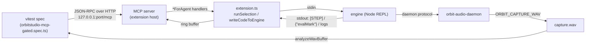

> **Note**: 本ページは 2026-09-01 時点での著者の reading の足跡で、2026-09-03 に #668 PR-E2（共有ハーネス層）、2026-09-04 に #724（#668 PR-E0・ハーネス仕様の改訂）まで追従しました。code が真実、本ページはその時点の理解の snapshot に過ぎません。

# IV-3. MCP サーバと実機 gated E2E — ユーザーと同じ動線で検証する

[IV-2](/editor/execution-feedback) では `Cmd+Enter` が押されてから engine にコードが届くまでを追いました。本章はその一段外側、「人間の代わりに **エージェント**（あるいはテストランナー）が同じ拡張を同じ経路で操作する」ための仕組みを読みます。登場人物は 3 つです。

1. **拡張ホストの中で動く MCP サーバ**（`packages/vscode-extension/src/mcp-server.ts`）
2. それを唯一の操作手段として **実 OrbitStudio.app を起動して音まで測る gated E2E**（`tests/e2e/orbitstudio-mcp-gated.spec.ts`）
3. engine が吐く `[STEP]` 行をエディタ上のハイライトに変える **ライブ playhead**（`playhead.ts` と `extension.ts`）

3 つは独立した機能に見えますが、「engine の stdout」という 1 本の線でつながっています。playhead の `[STEP]` 行も、`get_log` が返すエラーも、`evaluate_orbitscore` の完了通知も、すべて同じ stdout を extension が読み分けた結果です。この線を意識しながら読んでいきましょう。

---

## 目次

1. [なぜ拡張ホストの中に MCP サーバがあるのか](#なぜ拡張ホストの中に-mcp-サーバがあるのか)
2. [起動条件と HTTP 層](#起動条件と-http-層)
3. [ツールカタログ](#ツールカタログ)
4. [`evaluate_orbitscore` の `ok` は何を意味するか](#evaluate_orbitscore-の-ok-は何を意味するか)
5. [`get_log` とリングバッファ](#get_log-とリングバッファ)
6. [gated E2E ハーネス — 実 OrbitStudio.app を MCP だけで駆動する](#gated-e2e-ハーネス--実-orbitstudioapp-を-mcp-だけで駆動する)
7. [キャプチャ WAV と RMS アサーション](#キャプチャ-wav-と-rms-アサーション)
8. [規律を仕組みに変えるテスト — ラチェットとアサーション衛生](#規律を仕組みに変えるテスト--ラチェットとアサーション衛生)
9. [ライブ playhead — `[STEP]` 行から decoration まで](#ライブ-playhead--step-行から-decoration-まで)
10. [手元で走らせる](#手元で走らせる)

---

## なぜ拡張ホストの中に MCP サーバがあるのか

ファイル冒頭のコメントが出自を語っています。

```typescript
// packages/vscode-extension/src/mcp-server.ts:9-18
/**
 * OrbitScore MCP control server — the "Agent Bridge" of WCTM_SYSTEM_SPEC §3.
 *
 * Hosts an MCP server (Streamable HTTP) inside the extension host so an external
 * agent (e.g. Claude Code via `.mcp.json`) can drive OrbitScore operations for
 * E2E testing. The same tool surface is intended for reuse by the WCTM
 * performance runtime (pi harness — spec §4.2 "Bridge は harness-neutral").
 *
 * Only started when `orbitscore.mcpServer.port` is a nonzero port (see
 * extension.ts activate()). Binds 127.0.0.1 only.
```

出発点は WCTM（コンサートシステム）仕様の §3「Agent Bridge — 脳のない MCP サーバー」です。Bridge は「配管のみを担う。考える主体（ランタイム）を持たない」と定義されていて、`evaluate_orbitscore(code)` や `get_session_tail(n)` のようなツールを LLM ランタイムへ差し出す役でした。その配管を **VS Code 拡張の中に置いた**のが本ファイルです。

ここで気をつけたいのは「なぜ engine プロセスに直接 MCP を生やさなかったのか」という点です。答えはツールの説明文に何度も出てきます — `run_selection` は「the real "Run Selection" command (Cmd+Enter), including subject-block collection, setDocumentDirectory injection, and the flash animation」を実行する、と書かれています。つまりエージェントが通る道は **人間が `Cmd+Enter` を押したときとまったく同じ関数**（IV-2 で読んだ `runSelection()`）です。engine に別の入口を作ると、拡張側の配線（subject 収集・`setDocumentDirectory` の注入・flash）はテストの視野から外れてしまいます。

CLAUDE.md の「E2E が最重要」節に、owner の言葉としてこう記録されています。

> MCP ツールを用意して**ユーザーと同じ動線で試験できるようにしているのは「確実な動作を確認するため」**です。

MCP は「テスト用の裏口」ではなく、**ユーザーと同じ動線を機械が通るための装置**です。この章のあらゆる設計判断はここに戻ってきます。

ツール実装が VS Code に直接触らず `OrbitScoreToolHandlers` というインターフェイス越しに呼ばれているのも、同じ思想の延長です。

```typescript
// packages/vscode-extension/src/mcp-server.ts:233-286
/**
 * VSCode-agnostic handler seam. Keeping the tool implementations behind this
 * interface (rather than reaching into the extension directly) means the same
 * handlers can be re-hosted later by the WCTM pi harness (spec §3/§4.2).
 */
export interface OrbitScoreToolHandlers {
  evaluate(code: string): Promise<EvaluateResult> | EvaluateResult
  startEngine(options?: {
    captureWav?: string
    debug?: boolean
  }): Promise<CommandResult> | CommandResult
  stopEngine(): Promise<CommandResult> | CommandResult
  getEngineState(): EngineState
  forceKillScsynth(): Promise<CommandResult> | CommandResult
  listAudioDevices(): Promise<AudioDevicesResult> | AudioDevicesResult
  selectAudioDevice(device: string): Promise<CommandResult> | CommandResult
  configureFlash(options: FlashConfigInput): Promise<FlashConfigResult> | FlashConfigResult
  openFile(path: string): Promise<CommandResult> | CommandResult
  setSelection(range: SelectionInput): CommandResult
  runSelection(): Promise<CommandResult> | CommandResult
  editReplace(args: EditReplaceInput): Promise<CommandResult> | CommandResult
  getEditorState(): EditorState
  saveFile(): Promise<CommandResult> | CommandResult
  getDocumentText(): DocumentText
  getDiagnostics(path?: string): FileDiagnostics[]
  getLog(lines?: number): string[]
  analyzeAudio(
    wavPath: string,
    windowMs?: number,
    perChannel?: boolean,
  ): Promise<AnalyzeAudioResult> | AnalyzeAudioResult
  // ...
}
```

`extension.ts` の `activate()` がこのインターフェイスを `evaluateForAgent` / `runSelectionForAgent` のような `*ForAgent` 関数で埋めます。`mcp-server.ts` 自身は `vscode` を import していません。ユニットテスト（`tests/vscode-extension/mcp-server.spec.ts`）がスタブのハンドラで HTTP 層を丸ごと駆動できるのはこのためです。

---

## 起動条件と HTTP 層

サーバは既定では立ちません。`activate()` の末尾近くで、環境変数 → 設定の順にポートを決めます。

```typescript
// packages/vscode-extension/src/extension.ts:445-456
  // Optional MCP control server (Agent Bridge, #388) — dev/agent-integration
  // only, gated behind a nonzero port. The `ORBITSCORE_MCP_PORT` env var takes
  // precedence over the `orbitscore.mcpServer.port` setting so the extension can
  // be launched from the CLI (e.g. Extension Development Host) with the port set
  // without editing settings. Lets an external agent (e.g. Claude Code) drive
  // OrbitScore operations for E2E testing.
  const envMcpPort = Number(process.env.ORBITSCORE_MCP_PORT)
  const mcpPort =
    Number.isInteger(envMcpPort) && envMcpPort > 0
      ? envMcpPort
      : vscode.workspace.getConfiguration('orbitscore').get<number>('mcpServer.port', 0)
  if (mcpPort && mcpPort > 0) {
```

`orbitscore.mcpServer.port` の既定値は `0`（= 無効）です（`packages/vscode-extension/package.json:400-407`）。環境変数 `ORBITSCORE_MCP_PORT` が優先されるのは、gated E2E がアプリを **CLI から** 起動するときに設定ファイルを触らずに済ませるためです。CLAUDE.md の「マージ前ゲート」節が「`ORBITSCORE_MCP_PORT=39123` を付けて起動（この環境変数が無いと MCP サーバーが立たない）」と書いているのも同じ経路です。

HTTP 層は Node 標準の `http` モジュールで `127.0.0.1:<port>/mcp` を listen します。MCP の Streamable HTTP トランスポートは **stateful** で、`initialize` ごとにセッションを作ります。

```typescript
// packages/vscode-extension/src/mcp-server.ts:1185-1190
 * Sessions are created **per initialize request** and routed by the
 * `mcp-session-id` header. A single shared transport would permanently consume
 * its one session slot on the first client — any later client (or a Claude Code
 * reconnect) would get "Bad Request: Mcp-Session-Id header is required"
 * (observed live, 2026-07-07). Tool handlers stay shared — they close over the
 * same extension state regardless of which session invokes them.
```

セッションごとに `McpServer` インスタンスを作りますが、ハンドラは共有です。どのクライアントから呼んでも同じ `engineProcess` に届く、という点が「ユーザーと同じ動線」を保つ上で大事です。

ローカル bind だけでは足りない、という判断も入っています。

```typescript
// packages/vscode-extension/src/mcp-server.ts:1204-1211
  // DNS-rebinding protection: the server binds 127.0.0.1, but a malicious page
  // can point its own domain at 127.0.0.1 (short-TTL rebind) and then fetch()
  // same-origin — reaching this port from a browser with full response access.
  // The Host header still carries the attacker's domain in that case, so an
  // exact-match allowlist of loopback hosts closes the hole. (SDK 1.29.0 has
  // allowedHosts/enableDnsRebindingProtection but marks them deprecated in
  // favor of doing exactly this in the HTTP layer we already own.)
  const allowedHosts = new Set([`127.0.0.1:${port}`, `localhost:${port}`, `[::1]:${port}`])
```

`/mcp` 以外のパスも少しだけ受けます。`/orbitscore/dev/` と `/orbitscore/` には VitePress でビルドした学習サイト（本サイトとユーザーサイト）を配信し、`/docs` はそこへリダイレクトします。base 不一致の stale な dist を配信すると全アセットが 404 になる（`isDocsDistStale`・#480）ので、その検査もこの層にあります。本章の主題ではないので深入りしませんが、「MCP サーバ = 拡張が持つ唯一の HTTP 面」という位置づけは覚えておくと後で役立ちます。

Claude Code から接続するための登録ツールも同居しています。`register_mcp_server` は `scope: "project"` なら `.mcp.json` に `mcpServers.orbitscore` をマージし、`"user"` なら `claude mcp add --transport http --scope user` を実行します。URL の組み立ては純関数です。

```typescript
// packages/vscode-extension/src/mcp-registration.ts:10-13
/** URL where the extension's MCP server listens (see startOrbitScoreMcpServer). */
export function buildMcpServerUrl(port: number): string {
  return `http://127.0.0.1:${port}/mcp`
}
```

---

## ツールカタログ

`buildServer()` が `registerTool` で登録するツールを、役割ごとにまとめます（説明はツールの `description` 文字列を要約したものです）。

| 分類 | ツール | 何をするか |
|---|---|---|
| **評価** | `evaluate_orbitscore` | `.orbs` ソースを engine に送り、評価完了まで待って parse / runtime 診断の有無を返す |
| **engine 寿命** | `start_engine` | engine（Rust daemon）を起動。`capture_wav` でマスター出力を WAV に録音、`debug: true` で verbose ログ |
| | `stop_engine` | engine を停止 |
| | `get_engine_state` | `{ running, liveCoding }` を返す |
| | `force_kill_scsynth` | 迷子の scsynth を `killall`（SuperCollider 系の脱出口） |
| **オーディオデバイス** | `list_audio_devices` / `select_audio_device` | デバイス列挙と選択（Rust engine では list は未実装・select はライブ切替） |
| **エディタ操作** | `open_file` | `openTextDocument` + `showTextDocument` |
| | `set_selection` | 1-based の行・桁で選択範囲を置く |
| | `run_selection` | 本物の "Run Selection" コマンド（subject 収集・`setDocumentDirectory` 注入・flash 込み） |
| | `edit_replace` | リテラル find/replace（メモリ上のバッファのみ） |
| | `save_file` | `document.save()`（`edit_replace` は保存しないため必要） |
| | `get_editor_state` / `get_document_text` | アクティブエディタのメタ情報 / 全文 |
| | `configure_flash` | flash の回数・長さ・色 |
| **観測** | `get_diagnostics` | `vscode.languages.getDiagnostics` の結果 |
| | `get_log` | 出力チャネルの末尾 N 行（既定 50・上限 1000） |
| | `analyze_audio` | WAV を解析して peak / RMS / onset を返す（`window_ms` で時系列も） |
| **プラグイン** | `list_plugins` / `rescan_plugins` | プラグインカタログの読み出し / 再スキャン（#463） |
| | `save_plugin_state` | 実行中プラグインの state を保存（transport 停止中のみ） |
| | `open_plugin_ui` / `close_plugin_ui` | プラグイン UI の開閉。close は `UI_CLOSED_DONE` 受信まで待つ（#474 P4c） |
| **ドキュメント** | `get_dev_doc` / `search_dev_docs` | 本サイトの Markdown を読む / 検索する |
| **登録** | `register_mcp_server` | このサーバを Claude Code に登録（`.mcp.json` または `claude mcp add`） |

`save_plugin_state` / `open_plugin_ui` / `close_plugin_ui` / `register_mcp_server` はハンドラが optional で、無いホストでは登録されません。WCTM の pi ハーネスのような「別ホスト」がこの seam を再利用するときに、既存のスタブ suite を壊さないための配慮です。

面白いのは、このカタログの大半が「人間がコマンドパレットや設定から到達できる操作」の写しであることです。`start_engine` は "Start Engine" コマンド、`configure_flash` は "Configure Flash"、`rescan_plugins` は "Rescan Plugin Catalog" — 各 description が対応するコマンド名を明示しています。**新しい観測手段を増やすときも MCP のツール面を増やさない**、という方針が E2E 側のヘルパにも見えます（`tests/e2e/helpers/rack-child-pid.ts` の `rackChildPidsFromLog` に付いたコメント: 「**MCP の tool 表面を増やさず**、ERROR 計数や `[plugin-state]` 行と同じ `get_log` 経路で読めるようにしてある」）。

---

## `evaluate_orbitscore` の `ok` は何を意味するか

ここが本章で最も気をつけて読むべき箇所です。ツール説明はこう約束しています。

```typescript
// packages/vscode-extension/src/mcp-server.ts:542-559
  server.registerTool(
    'evaluate_orbitscore',
    {
      title: 'Evaluate OrbitScore',
      description:
        'Send OrbitScore (.orbs) source to the running engine live-coding session — ' +
        'the equivalent of "Run Selection" in the editor. The engine must be started ' +
        'first (via the Start Engine command). Waits for the engine to finish evaluating ' +
        'the submitted code and reports the result: ok only when the engine raised no parse ' +
        'or runtime diagnostics. A failure lists the diagnostics, so you do NOT need to poll ' +
        'get_log to find out whether your score was accepted.',
      inputSchema: { code: z.string().describe('OrbitScore source to evaluate') },
    },
    async (args) => {
      const code = typeof args.code === 'string' ? args.code : ''
      return toToolResult(await handlers.evaluate(code))
    },
  )
```

一方で CLAUDE.md は「`evaluate_orbitscore` の `ok` に assert しても何も証明しない」「エンジン側のエラーは `get_log` にしか出ない」と繰り返し書いています。どちらが正しいのでしょうか。**両方とも、それぞれの時点で正しい**のです。`#614` の前後で `ok` の意味が変わりました。

```typescript
// packages/vscode-extension/src/extension.ts:3041-3078
async function evaluateForAgent(code: string): Promise<EvaluateResult> {
  if (!isLiveCodingMode || !engineProcess || engineProcess.killed) {
    return { ok: false, error: 'engine is not running — start the engine first' }
  }
  const documentDir = vscode.workspace.workspaceFolders?.[0]?.uri.fsPath
  if (!writeCodeToEngine(code, documentDir)) {
    return { ok: false, error: 'engine stdin is not writable — the engine may have just died' }
  }
  // 🔴 #614: 以前はここで `{ ok: true }` を返していた。しかしその ok は
  // 「**stdin へ届いた**」までしか意味せず、パース/実行エラーは engine が stderr へ
  // 非同期に出すだけだった。LLM は ok を成功と解釈するので、実機で
  // `Variable not found: global` が出ていても先へ進んでしまう（実測）。
  //
  // REPL は行を FIFO で処理するので、コードの直後にマーカーを送れば
  // **マーカーに到達した時点で評価は完了している**。時間で待つ必要はない。
  const stdin = engineProcess.stdin
  if (!stdin || !stdin.writable) {
    return { ok: false, error: 'engine stdin is not writable — the engine may have just died' }
  }
  const result = await evalMarkBridge.send((line, onError) => {
    // 既存 bridge（pluginUi）と同じ書き方に揃える。error は null 込みで来る。
    stdin.write(line, (error) => {
      if (error) {
        outputChannel?.appendLine(`⚠️ failed to write //#evalMark to stdin: ${error.message}`)
        onError(error)
      }
    })
  }, randomUUID())
  if (result.ok) return { ok: true }
  const detail = result.diagnostics.length
    ? result.diagnostics.map((d) => `[${d.kind}] ${d.message}`).join('; ')
    : (result.error ?? 'engine reported an evaluation failure')
  return {
    ok: false,
    error: `evaluation failed: ${detail}`,
    ...(result.diagnostics.length ? { diagnostics: result.diagnostics } : {}),
  }
}
```

`#614` より前の `ok` は「stdin に書けた」だけでした。engine の REPL は行を FIFO で処理するので、コードの直後に `//#evalMark {"requestId": ...}` というメタ行を送れば、そのマーカーの応答が返ってきた時点で先行コードの評価は終わっています。「settle 時間を待つ」のではなく「マーカーの到着を待つ」ので、instrument を 6 本 attach して 30 秒かかる評価でも誤検知しません。

```typescript
// packages/vscode-extension/src/eval-mark-bridge.ts:14-22
 * 🔴 「どこまで待つか」を時間で決めない
 *
 * REPL は行を **FIFO** で処理する（#476）。コードの直後にマーカーを送れば、
 * **マーカーに到達した時点で先行コードの評価は完了している**。したがって settle 時間や
 * 「エラーが出ないこと」を待つ必要がない。長い評価（instrument 6 本の attach で 30 秒超）
 * でも、待つのは「実際に終わるまで」であって誤検知しない。
 *
 * timeout は最後の安全網としてのみ置く。詰まったキューは #608 の stall reporter が
 * 別途「塞いでいる行」を名指しして報告する。
```

engine は `{"evalMark": {...}}` という JSON 行を stdout に返し、`setupStdoutHandler` がそれを `evalMarkBridge.handleLine()` へ渡します。この分岐は **独立していなければならない**、と強調されています。

```typescript
// packages/vscode-extension/src/extension.ts:1502-1510
        } else if (trimmedLine.startsWith('{"evalMark"')) {
          // 🔴 #614: この分岐は**独立していなければならない**。最初は `{"pluginUi"` 分岐の中に
          // 相乗りさせてしまい、`{"evalMark"` 行は prefix チェーンをすり抜けて一度も
          // dispatch されなかった（ユニットテストは全て緑・実機 E2E だけが捕まえた）。
          const parsed = isCurrent && evalMarkBridge.handleLine(rawLine)
          if (!parsed && isCurrent) {
            outputChannel?.appendLine(`⚠️ received a malformed //#evalMark result line: ${rawLine}`)
          }
        }
```

「ユニットテストは全て緑・実機 E2E だけが捕まえた」— これは本章全体のテーマの縮図です。

では `#614` 後は `get_log` を見なくてよいのでしょうか。**そうではありません。** `ok` が保証するのは「マーカー到達までに engine が上げた診断が無い」ことまでです。評価が返ったあとに非同期に起きる失敗は、依然として stdout/stderr にしか現れません。gated spec 自身がその使い分けを示しています。`instSeq.instrument(...)` を `evaluate_orbitscore` で評価して `isError` が `false` であることを確認したあと、`sleep(6000)` してから `get_log` を読み、`[OUTPROC_ATTACH_FAILED]` が無いことを別途 assert しています（`tests/e2e/orbitstudio-mcp-gated.spec.ts:1017-1029`）。out-of-process の CLAP attach は spawn + IPC handshake を伴うため、評価の完了と attach の成否は別のタイムラインにあるからです。

`log-ring.ts` のコメントには `#614` より前の記述（「`get_log` はエンジン側のエラーが現れる**唯一のチャネル**である」）が残っていましたが、本 PR で「**評価が返ったあとに非同期に起きる失敗が現れる唯一のチャネル**」へ改めました。同時に `CLAUDE.md` の 3 箇所（「`ok` に assert しても何も証明しない」）も、`#614` 後の意味へ更新しています。**`ok` が意味を持つ範囲は広がったが、`get_log` が唯一の観測点である領域は残っている** — これが 2026-09-02 時点の正確な理解です。

---

## `get_log` とリングバッファ

拡張には中央のログ sink がありません。そこで `activate()` が出力チャネルの `appendLine` / `append` を monkey-patch して、同じ行をリングバッファにも積んでいます。

```typescript
// packages/vscode-extension/src/extension.ts:138-148
// Ring buffer of output-channel lines for the MCP get_log tool (#388). There is
// no other central log sink to tap, so activate() monkey-patches
// outputChannel.appendLine/append to also push here.
const outputLogRing: string[] = []

function pushLogRing(line: string): void {
  outputLogRing.push(line)
  if (outputLogRing.length > OUTPUT_LOG_RING_MAX) {
    outputLogRing.shift()
  }
}
```

```typescript
// packages/vscode-extension/src/extension.ts:301-312
  const rawAppendLine = outputChannel.appendLine.bind(outputChannel)
  outputChannel.appendLine = (value: string) => {
    pushLogRing(value)
    rawAppendLine(value)
  }
  const rawAppend = outputChannel.append.bind(outputChannel)
  outputChannel.append = (value: string) => {
    for (const line of value.split('\n')) {
      if (line) pushLogRing(line)
    }
    rawAppend(value)
  }
```

つまり `get_log` が返すのは「Output パネルの OrbitScore チャネルに出たものと同じ内容」です。engine の stdout がそのまま入るわけではなく、`shouldFilterLine()` を通ったあとの行が入ります（`[STEP]` が通常モードで見えない理由はここにあり、後述します）。

末尾 N 行を選ぶロジックは `#567` で純関数に切り出されました。要求がリング容量を超えたら **黙って切り詰めず、先頭に通知行を足す**のがポイントです。

```typescript
// packages/vscode-extension/src/log-ring.ts:35-47
export function selectLogLines(ring: readonly string[], requested?: number): string[] {
  const want = requested ?? DEFAULT_LOG_LINES
  const n = Math.max(1, Math.min(want, OUTPUT_LOG_RING_MAX))
  const out = ring.slice(-n)
  if (want > OUTPUT_LOG_RING_MAX) {
    return [
      `[get_log] truncated: requested ${want} lines, ring buffer holds at most ` +
        `${OUTPUT_LOG_RING_MAX}; returning ${out.length}.`,
      ...out,
    ]
  }
  return out
}
```

なぜここまで気を遣うのでしょうか。E2E は「操作前後の ERROR 件数を比較する」という書き方を多用します。窓が固定幅だと、古い ERROR が窓から流れ出るのと同時に新しい ERROR が入ればカウントが一致して **false green** になります。`#567` はそのために上限を 500 から実容量 1000 に引き上げ、切り詰めを応答に含めるようにしました。それでも窓は有限なので、CLAUDE.md は「ERROR 件数は厳密等価にしない（`<=` を使う）」と定めています。この規律は後述の hygiene テストで機械化されています。

---

## gated E2E ハーネス — 実 OrbitStudio.app を MCP だけで駆動する

ここからが本章の本体です。`tests/e2e/orbitstudio-mcp-gated.spec.ts` は 4,500 行を超える 1 ファイルで、実 OrbitStudio.app（VSCodium を OrbitStudio 名でリブランドしたアプリ・`scripts/orbitstudio/build_orbitstudio.sh`）を起動し、**MCP ツール呼び出しだけで**操作します。



### ゲート — 通常の `npm test` を壊さない

```typescript
// tests/e2e/orbitstudio-mcp-gated.spec.ts:10-21
 * ── Env contract ──
 *   ORBIT_GATED_ORBITSTUDIO=1   Required to enable this suite at all. Unset
 *                               (the default) → the whole describe block is
 *                               skipped via describe.skipIf, so this file
 *                               always parses and collects cleanly in normal
 *                               `npm test` runs.
 *   ORBITSTUDIO_APP=<path>      Overrides the OrbitStudio.app bundle path.
 *                               Default:
 *                               /Users/yamato/Src/proj_orbitscore/orbitstudio-build/vscodium/VSCode-darwin-arm64/OrbitStudio.app
 *                               If the resolved path doesn't exist, the test
 *                               is skipped with a console note (rather than
 *                               failing) even when the gate env var is set.
```

```typescript
// tests/e2e/orbitstudio-mcp-gated.spec.ts:73-79
const GATE_ENV = 'ORBIT_GATED_ORBITSTUDIO'
const DEFAULT_APP_PATH =
  '/Users/yamato/Src/proj_orbitscore/orbitstudio-build/vscodium/VSCode-darwin-arm64/OrbitStudio.app'

const gated = Boolean(process.env[GATE_ENV])
const appPath = process.env.ORBITSTUDIO_APP?.trim() || DEFAULT_APP_PATH
const appAvailable = fs.existsSync(appPath)
```

`describe.skipIf(!gated)` で describe 全体が skip され、各 `it` はさらに `it.skipIf(!appAvailable)` で守られています。二段のゲートがあるのは、「env が立っているがアプリが無い」環境（CI の ubuntu など）でも **失敗ではなく skip** にするためです。

### stale なバイナリを測らない

suite の読み込み時、テストを 1 本も走らせる前に daemon バイナリの鮮度を検査します。

```typescript
// tests/e2e/orbitstudio-mcp-gated.spec.ts:165-175
  if (newest.at > builtAt) {
    throw new Error(
      'gated E2E: the daemon binary is older than the Rust sources, so this run would measure ' +
        `stale code.\n  newest source: ${path.relative(REPO_ROOT, newest.file)}\n` +
        `  binary:        ${new Date(builtAt).toISOString()}\n` +
        `  source:        ${new Date(newest.at).toISOString()}\n` +
        'Rebuild before running (npm run test:e2e:gated does this for you):\n' +
        '  cargo build --release --manifest-path rust/Cargo.toml -p orbit-audio-daemon \\\n' +
        '    --features outproc-effect,outproc-instrument && npm run build',
    )
  }
```

どのバイナリを見るかは決め打ちせず、engine が実際に spawn 候補を決める `resolveDaemonBinaryPath()` に聞きます。WORK_LOG 6.416 / 6.417 によると、このガードは 2026-08-29 に **2 回パスを間違えて**います（最初は `rust/target/release/` を見ていて、実際に動いていたのは拡張に同梱された `packages/vscode-extension/engine/bin/<platform>/` のコピーだった）。そこで「ガードが守ろうとしている事故を、ガード自身が再導入しうる」形を避けるため、正本の解決関数を呼ぶ形に落ち着きました。

**何を「ソース」と数えるか**にも一手が入っています（#713）。`rust/` 配下の `.rs` を無条件に拾うと、別の cargo ターゲットである統合テスト（実測では `rust/crates/orbit-vst3-host/tests/spike_s_concurrent_load.rs`）が「最新のソース」に選ばれてしまいます。それらは `orbit-audio-daemon` のバイナリの依存グラフに入らないので、cargo は依存関係を正しく読んで何もビルドせず、バイナリの mtime も更新されません。つまりガードのメッセージが指示する `npm run test:e2e:gated` を何度打っても消えない、**解消不能な赤**になります。引き金は mtime の性質で、`git checkout` はファイルの mtime をチェックアウトした時刻へ更新するため、ブランチを行き来しただけで内容の変わっていない統合テストが「最新のソース」に化けます。#713 ではこれで実機 gated が起動段階から 1 本も走らなくなりました。

```typescript
// tests/e2e/orbitstudio-mcp-gated.spec.ts:154-156
        if (entry.name === 'tests' || entry.name === 'benches' || entry.name === 'examples') {
          continue
        }
```

`src/` は外していません。daemon が依存するコードが新しければ、ガードは本来の役目どおり赤になるべきだからです。この線引き自体も次節のアサーション衛生の検査 2 本（除外が消えたら赤 / `src` まで除外したら赤）で両側から留められています。

そしてガードより一段強い手当てとして、**手順そのものを消す**選択がされています。

```jsonc
// package.json:18-19
    "pretest:e2e:gated": "cargo build --release --manifest-path rust/Cargo.toml -p orbit-audio-daemon --features outproc-effect,outproc-instrument && npm run build",
    "test:e2e:gated": "ORBIT_GATED_ORBITSTUDIO=1 npx vitest run --dir tests --config vitest.config.ts --globals --pool=forks --poolOptions.forks.singleFork=true e2e/orbitstudio-mcp-gated",
```

npm は `pre<script>` を自動で先に走らせるので、`npm run test:e2e:gated` を打てば必ず cargo build と `npm run build`（同梱コピーの更新を含む）が先行します。WORK_LOG 6.417 の owner の言葉は「これ手順が確実になったら手動ではない形にした方がいいですよね」でした。

### アプリの起動 — `orbs` CLI と Extension Development Host

```typescript
// tests/e2e/orbitstudio-mcp-gated.spec.ts:752-773
      const orbsBin = path.join(appPath, 'Contents/Resources/app/bin/orbs')
      child = spawn(
        orbsBin,
        [
          '--new-window',
          `--extensionDevelopmentPath=${EXTENSION_DEV_PATH}`,
          `--user-data-dir=${userDataDir}`,
          `--extensions-dir=${extensionsDir}`,
          // `evaluate_orbitscore` は workspace root を documentDirectory として渡すので、
          // プロジェクト（project.yaml / states/）を置く tmpRoot を workspace として開く。
          // これはユーザーが曲フォルダを開く実際の使い方とも一致する。
          tmpRoot,
        ],
        {
          env: {
            ...appEnv,
            ORBITSCORE_MCP_PORT: String(port),
          },
          stdio: 'ignore',
          detached: false,
        },
      )
```

`--extensionDevelopmentPath` でリポジトリ内の拡張ソースをそのまま読ませ、`--user-data-dir` / `--extensions-dir` を一時ディレクトリに向けて手元の設定から隔離します。ポートは `39400 + Math.floor(Math.random() * 200)` で選び、`pollInitialize()` が `initialize` を 2 秒間隔で最大 60 秒叩いて接続を待ちます。クライアント（`tests/e2e/helpers/mcp-client.ts`）は MCP SDK を使わない生の JSON-RPC で、`tools/call` の `content[0].text` と `isError` を取り出すだけの薄い層です。

teardown は「安全性」の注意書きが繰り返されています。

```typescript
// tests/e2e/orbitstudio-mcp-gated.spec.ts:258-264
function killOrbitStudio(): void {
  try {
    execFileSync('pkill', ['-f', 'OrbitStudio.app/Contents/MacOS'], { stdio: 'ignore' })
  } catch {
    // pkill exits non-zero when no process matched — not an error here.
  }
}
```

パターンを `Code` や `Electron` に広げてはいけない、と 2 箇所で書かれています。ユーザーの VS Code を殺した過去の事故がその理由です。

### `capture_wav` は spawn 専用オプション

キャプチャの有効化は daemon の spawn 時に `ORBIT_CAPTURE_WAV` 環境変数で渡すしかありません。拡張は `activate()` 時に engine を自動起動するので、gated spec は **自動起動した engine を一度止めてから** capture 付きで起動し直します。

```typescript
// tests/e2e/orbitstudio-mcp-gated.spec.ts:890-895
      const preStopRes = await client.call('stop_engine')
      expect(preStopRes.isError, preStopRes.text).toBe(false)
      await waitForEngine(false, 15_000, 'engine stopped')

      const startRes = await client.call('start_engine', { capture_wav: captureWavFile })
      expect(startRes.isError, startRes.text).toBe(false)
```

すでに走っている engine に `capture_wav` を付けて `start_engine` を呼んだ場合の扱いも、純関数で決まっています。

```typescript
// packages/vscode-extension/src/engine-lifecycle.ts:271-291
export function decideStartEngineForAgent(
  engineRunning: boolean,
  options?: { captureWav?: string; debug?: boolean },
): StartEngineDecision {
  if (!engineRunning) return { kind: 'spawn' }

  const spawnOnlyOptions = [
    options?.captureWav ? 'capture_wav' : null,
    options?.debug ? 'debug' : null,
  ].filter((option): option is string => option !== null)
  if (spawnOnlyOptions.length > 0) {
    return {
      kind: 'reject',
      error:
        `engine is already running; requested spawn-only option(s): ${spawnOnlyOptions.join(', ')}. ` +
        'The existing engine may already have different spawn settings. Call stop_engine first, ' +
        'then start_engine again with the requested option(s).',
    }
  }
  return { kind: 'already-running' }
}
```

旧実装はここで `ok: true, 'engine already running'` を返して `captureWav` を黙って捨てていました。呼び出し側は録れていると信じ、`capture.wav` を読む段で初めて `ENOENT` に気づく — `#528` の回帰ピンとして、gated spec は「拒否されること」と「拒否しても engine が落ちないこと」の両方を assert しています（`tests/e2e/orbitstudio-mcp-gated.spec.ts:844-853`）。

### テスト一覧

2026-09-01 時点で describe には 20 本の `it` があります。先頭の 1 本がアプリ起動・カタログ初期化・capture 付き engine 起動を担い、残りはその状態を前提にします（WORK_LOG 6.409 が「1 本だけを `-t` で絞ると `catalogClapEffectPath` 未初期化で落ちる」と記録しているのはこのためです）。

| 行 | テスト名（要約） | 主な oracle |
|---|---|---|
| 636 | 実 OrbitStudio を端から端まで: diagnostics-on-open・`run_selection`・live edit・capture 検証 | onset 間隔（120 → 180 bpm） |
| 1433–1687 | #643 E2E-1〜7: `global.gain(-6)` / seq rack / attach 中のギャップ / `output(sum)` + `send(aux)` / instrument 差し替え / slot 解放 / 宣言なし instrument | 区間 RMS 比 |
| 1732, 1808 | #633 E2E-1〜2: 同一 insert 複数の UI 開閉・index シフト後の close | `open_plugin_ui` / `close_plugin_ui` 応答 |
| 1878 | カタログ v2 再スキャン・壊れたバンドルの報告 | `rescan_plugins` の failures |
| 1949 | 曖昧な bare mixer 名を `run_selection` + `get_log` で報告 | ログ文言 |
| 2040 | `instrument()` シーケンスで playhead が休符も含めて刻む（#654） | `[STEP]` 行の slot 集合 |
| 2139, 2381, 2602 | plugin state の再起動復元（instrument / sum-bus insert / 5 種 receiver 自動記録） | 測定ピッチ・RMS |
| 3157, 3421 | 再生中の instrument / effect 差し替え（#618 / #625） | 音・state・プロセス・失敗・UI |
| 3961, 4473 | #628 R28: rack chain の音のメインライン / master + 標準要素のエラー | RMS・child PID |

---

### 共有ハーネス層 — `tests/e2e/helpers/`

2026-09-03（#668 PR-E2）に、シナリオがそれぞれ手元で持っていた小さな道具が `tests/e2e/helpers/` の 5 モジュールへ集約されました。**既存 20 本のシナリオそのものは書き換えられていません** — 差し替えられたのは重複していた定義とパス組み立てだけです。

| モジュール | 何を持つか |
|---|---|
| `engine-log.ts` | `LOG_WINDOW_LINES` / `countLogMarker` / `countErrors` / `errorBaseline` / `expectNoNewErrors` / `expectLogMarkerAtLeast` |
| `gated-session.ts` | `GatedCatalog` / `GatedSession` / `captureWavPath` / `createGatedSession` |
| `run-score.ts` | `ScoreSource` / `CaptureWindows` / `ScoreRunContext` / `runScore` |
| `wait-for-file.ts` | `waitForFile` / `waitForMatchingFile` |
| `run-cli.ts` | `CliResult` / `runOrbitscoreCli` |

`countErrors` は gated spec の中に **7 箇所**、それぞれ独立に定義されていました（変更前の行番号で `:496 / 2144 / 2722 / 3155 / 3461 / 3969 / 4464`）。同じ 1 行が 7 回書かれていたので、ERROR 件数の数え方を変えたければ 7 箇所直さねばならず、直し漏れは静かに残ります。統合先は `expectNoNewErrors` で、比較が `<=` であることがここで 1 箇所に固定されます。

```typescript
// tests/e2e/helpers/engine-log.ts:51-62
export async function expectNoNewErrors(
  client: McpClient,
  baseline: number,
  label: string,
): Promise<void> {
  const log = (await client.call('get_log', { lines: LOG_WINDOW_LINES })).text
  const current = countErrors(log)
  expect(
    current,
    `${label} must add no ERROR lines. Log tail: ${log.slice(-1600)}`,
  ).toBeLessThanOrEqual(baseline)
}
```

capture WAV のパス組み立ても同じように散っていました。spec の中でパスを組む箇所は **13 箇所**ありますが、**`ORBIT_KEEP_CAPTURES` を見ていたのは `captureInstrumentScenario` の 1 箇所だけ**で（変更前 `:501-509`）、残り 12 箇所は素の `path.join(tmpRoot, ...)` でした。つまりそのシナリオが落ちると、証拠になるはずの WAV も `afterAll` の `tmpRoot` 削除で一緒に消えていました。13 箇所すべてが `captureWavPath()` を通るようになり、環境変数の効き方が揃います。

```typescript
// tests/e2e/helpers/gated-session.ts:47-51
export function captureWavPath(tmpRoot: string, slug: string): string {
  const dir =
    process.env.ORBIT_KEEP_CAPTURES !== undefined ? process.env.ORBIT_KEEP_CAPTURES : tmpRoot
  return path.join(dir, `${slug}.wav`)
}
```

`runScore` は「譜面を work copy にして、エディタ経路（`open_file` → `set_selection` → `run_selection`）で評価し、要求されれば capture を解析して区間 RMS を返す」までを 1 関数にしたものです。そこにある `evaluate` が `ok` / `isError` に assert しないのは意図した設計で、理由は本章の [`ok` の節](#evaluate-orbitscore-の-ok-は何を意味するか)と同じところにあります。

```typescript
// tests/e2e/helpers/run-score.ts:246-258
    // 🔴 **ただし「assert しない」は「握り潰す」ではない**（silent-failure レビュー 2026-09-04）。
    // `ok` は**必要条件**で、`ok: false` は `get_log` を漁らずその場で取れる一次シグナルである
    // （パース / 実行時診断・`mcp-server.ts` の tool 説明）。捨てると、セットアップの typo が
    // **後段の「音が鳴っていない」というアサーション失敗として現れる** — 書いた本人は
    // オーディオの不具合を疑って延々探すことになる。**assert はせず、見えるようにする。**
    const result = await client.call('evaluate_orbitscore', { code })
    if (result.isError) {
      // eslint-disable-next-line no-console
      console.warn(
        `[runScore ${source.slug}] evaluate_orbitscore reported a diagnostic (not asserted — ` +
          `a test may be verifying it on purpose):\n${result.text}`,
      )
    }
```

🔴 **「assert しない」は「握り潰す」ではありません。** `ok` は**必要条件**であって、
十分条件でないことは何も見ない理由になりません。捨ててしまうと、セットアップの typo が
**後段の「音が鳴っていない」というアサーション失敗**として現れ、書いた本人はオーディオの
不具合を疑って延々と探すことになります。診断が出ることを確かめる E2E を妨げないよう
assert はしませんが、**見えるようにはします**。

PR-E2 の時点で `runScore` を呼ぶシナリオはまだ 1 本もありません（既存 20 本を書き換えない方針のため）。最初の利用者は PR-E3 の予定です。

⚠️ `tests/e2e/helpers/` は `gated-sources.ts` の `GATED_SOURCE_GLOBS`（`orbitstudio-mcp-gated.spec.ts` と `gated/**`）に**含まれません**。後述のラチェットとアサーション衛生はどちらも `readGatedSources()` の返す文字列だけを読むので、helper 側のソースは走査対象外です。

---

## キャプチャ WAV と RMS アサーション

「音はデジタルなので観測できる」— CLAUDE.md の言い回しです。gated spec は聴かずに判定します。解析器は `packages/vscode-extension/src/wav-analysis.ts` で、daemon の capture 形式（RIFF/WAVE・IEEE float32）を読み、mono mixdown に対して 20 ms 窓の RMS・peak・onset を計算します。

```typescript
// packages/vscode-extension/src/wav-analysis.ts:158-197
  const rms = Math.sqrt(sumSq / Math.max(1, frames))

  // Onsets: window RMS rises past threshold from below, with a minimum gap.
  const sorted = [...windows].sort((a, b) => a - b)
  const noiseFloor = sorted[Math.floor(sorted.length / 2)] ?? 0
  const threshold = Math.max(noiseFloor * 4, ONSET_THRESHOLD_FLOOR)
  const minGapWindows = Math.ceil(MIN_ONSET_GAP_SEC / WINDOW_SEC)
  const onsets: number[] = []
  let lastOnset = -minGapWindows
  for (let w = 1; w < windows.length; w++) {
    const rising = windows[w]! >= threshold && windows[w - 1]! < threshold
    if (rising && w - lastOnset >= minGapWindows) {
      onsets.push(w * WINDOW_SEC)
      lastOnset = w
    }
  }
  const onsetGaps = onsets.slice(1).map((t, i) => t - onsets[i]!)

  return {
    format,
    frames,
    durationSec,
    peak,
    rms,
    onsets,
    onsetGaps,
    soundDetected: onsets.length >= 1 && peak > 0.05,
    ...(opts?.windowMs && opts.windowMs > 0
      ? { windows: windowSeries(buf, dataOff, frames, format, opts.windowMs / 1000) }
      : {}),
    // ...
  }
```

onset の閾値は「窓 RMS の中央値 × 4」と絶対床 `0.01` の大きい方です。`soundDetected` は「onset が 1 つ以上かつ peak > 0.05」で、`#478` で「3 つ以上」から緩められました（one-shot 1 発を無音と誤報していたため）。ヘッダが finalize されていない WAV（data chunk size 0）でも EOF まで読む、という頑健性は `#651` より前のキャプチャ事故（WORK_LOG 6.416: RIFF size=36 / data size=0 のまま 2.29 MB のデータを抱えていた）を吸収するためのものです。

先頭テストの最後の assert は、この onset 間隔をテンポの証拠に使います。

```typescript
// tests/e2e/orbitstudio-mcp-gated.spec.ts:1431-1445
      // ── 9. Objective audio verification (no listening required) ──
      const wavBuf = fs.readFileSync(captureWavFile)
      const analysis = analyzeWavBuffer(wavBuf)
      expect(analysis.soundDetected, JSON.stringify(analysis)).toBe(true)

      const gapsAt120bpm = analysis.onsetGaps.filter((g) => g >= 0.45 && g <= 0.57)
      const gapsAt180bpm = analysis.onsetGaps.filter((g) => g >= 0.29 && g <= 0.4)
      expect(
        gapsAt120bpm.length,
        `expected >=3 gaps in [0.45,0.57]s (120bpm), got onsetGaps: ${JSON.stringify(analysis.onsetGaps)}`,
      ).toBeGreaterThanOrEqual(3)
      expect(
        gapsAt180bpm.length,
        `expected >=3 gaps in [0.29,0.40]s (180bpm), got onsetGaps: ${JSON.stringify(analysis.onsetGaps)}`,
      ).toBeGreaterThanOrEqual(3)
```

`kick_loop.orbs` は 120 bpm で 4 分音符ごとに kick を鳴らし、途中で `edit_replace` により `global.tempo(180)` に書き換えて再評価します。0.5 秒間隔の onset 群と 0.333 秒間隔の onset 群が **両方** 3 つ以上あれば、「run_selection が動いた」「edit_replace + run_selection で live に変わった」「音が出た」がまとめて証明されます。

`#643` 系のテストはもう一歩踏み込み、時間区間ごとの RMS を比べます。区間の境界では **キャプチャファイルのバイト長**をそのまま時計として読み（`(stat.size - 44) / (channels × 4) / sampleRate`）、最初の区間は**音が出たことを検出してから**開きます。その区間の 20 ms 窓 RMS を二乗平均します。

🔴 かつては「各操作の壁時計時刻を記録し、capture 終了時刻から逆算して WAV 上の区間に写像する」形でした。これは #739 で撤去されています — 逆算はキャプチャ実長が壁時計より短いと負になり、`Math.max(0, …)` で **黙って 0 にクランプされてファイル先頭を指す**ためです。窓を後ろへずらすと逆に前を測る、という形で実際に事故が起きました。

```typescript
// tests/e2e/helpers/capture-windows.ts:190-195
export function quadraticMeanRms(windows: ReadonlyArray<{ readonly rms: number }>): number {
  if (windows.length === 0) throw new Error('quadraticMeanRms requires at least one window')
  return Math.sqrt(
    windows.reduce((sum, window) => sum + window.rms * window.rms, 0) / windows.length,
  )
}
```

たとえば E2E-1 は `rms('unity')` と `rms('half')` を比べて、`global.gain(-6)` が RMS をおよそ半分（$10^{-6/20} \approx 0.501$）にすることを確かめます。

このアサーションが何を捕まえたかは、WORK_LOG 6.415 に記録されています。2026-08-29、この E2E を書いて実機で走らせたところ、**`global.gain()` が instrument にまったく効いていない**ことが分かりました。原因は `output.rs` でミキサーの stage から master へ合流する音が **master gain を掛けた後に加算されていた**ことです。各層は成功を返し、ERROR は 1 行も出ず、変異検証 35 件もユニットテスト 2149 件も捕まえていませんでした。CLAUDE.md がこの事例を「E2E が最重要」の根拠として引くのは、それが「**正しく見えるが合成が違う**」を捕まえられる唯一の層だったからです。

同じ日に `ORBIT_KEEP_CAPTURES=<dir>` が正式化されました。指定するとキャプチャ WAV を tmpRoot ではなくそのディレクトリに残します。「ハーネスのアサーションは窓の中の 1 つの数しか見せないが、欠陥は窓の外にいることがある」（6.415）ためです。ただしこの環境変数が spec 全体で効くようになったのは #668 PR-E2 以降です — それまでは 13 箇所のパス組み立てのうち 1 箇所しか見ていませんでした（[共有ハーネス層](#共有ハーネス層-—-tests-e2e-helpers)）。

### 写像そのものを守る 4 つの不変条件 — A1 / U1 / U2 / U3

時計を替えても、区間の作り方を間違えれば測る場所はずれます。そこで `captureWindowsFrom` は区間を
バケットへ写像する前に 4 つの不変条件を検査し、破れたら **どの不変条件がどの区間で破れたか**を
名前つきの Error にして投げます（`label` + `A1` などの id + `fromSec` / `toSec` / `durationSec` /
`soundStartSec` / `bucketCount` の JSON）。#739 が直したのは時計ですが、同時にこの 4 本が入りました。

**A1 — 最初の区間は、音が出る前に開いてはいけない。** これが #739 の元の事故そのものです。
`LOOP()` の小節量子化とプラグイン attach で音は数秒後に出るので、固定 settle で窓を開けると
`unity` 窓が丸ごと無音になり、比較の分母が意味を失います。

```typescript
// tests/e2e/helpers/capture-windows.ts:441-449
    if (index === 0 && (soundStartSec === null || segment.fromSec < soundStartSec)) {
      throw invariantError(
        'A1',
        name,
        segment,
        bucketCount,
        'the first segment must not open before sound starts',
      )
    }
```

**U1 — 区間から取れたバケット数が、区間長から期待される数と合っていること。** guard を引いた
区間長を 20 ms で割った値と実際に選ばれたバケット数を比べ、`±2` を超えたら落とします。0 件も
落とします。「窓を指定したのに何も入っていなかった」という静かな失敗を、ここで音になる前に
止めるためです。

```typescript
// tests/e2e/helpers/capture-windows.ts:388-391
    const expected = Math.round(
      (segment.toSec - segment.fromSec - 2 * guardSec) / ANALYSIS_BUCKET_SEC,
    )
    if (Math.abs(selected.length - expected) > BUCKET_COUNT_TOLERANCE) {
```

**U2 — キャプチャ時計で測った区間長と、壁時計で測った区間長が食い違わないこと。** 時計をバイト長へ
移したので、その時計が壁時計から離れていないことを毎回確かめます。許容は `0.12` 秒です。時計が
壊れれば区間はどこでも指せてしまうので、時計そのものへ張った検査だと言えます。

```typescript
// tests/e2e/helpers/capture-windows.ts:450-452
    const captureDurationSec = segment.toSec - segment.fromSec
    const wallDurationSec = (segment.toWall - segment.fromWall) / 1000
    if (Math.abs(captureDurationSec - wallDurationSec) > CLOCK_WALL_TOLERANCE_SEC) {
```

**U3 — 区間は有限・キャプチャ時間内・単調で、重ならないこと。** 面白いのは例外の作り方です。
`#643` E2E-3 の境界プローブは直前の区間へ 250 ms わざと食い込むので、重なりは
`CaptureSegment.overlapsPrevious` で **区間側が明示的に opt-in** する形になっています。#739 の
レビューで、区間名の文字列 `'transition'` を見る実装からここへ移されました。名前で例外を判定すると、
同じ名前を別の意図で使った瞬間に検査が静かに緩みます。

```typescript
// tests/e2e/helpers/capture-windows.ts:426-430
      // #643 E2E-3's boundary probe intentionally looks back 250 ms. Every overlap must
      // opt in explicitly; regular capture segments remain strictly non-overlapping.
      (previous !== undefined &&
        segment.overlapsPrevious !== true &&
        segment.fromSec < previous[1].toSec)
```

---

## 規律を仕組みに変えるテスト — ラチェットとアサーション衛生

WORK_LOG 6.418 のタイトルは「今日の是正を『知識』から『再現可能な仕組み』へ」です。CLAUDE.md には「DSL の機能を追加したら必ず E2E テストを追加する」と書いてあったのに、実測すると `seq` の 32 語のうち 19 語が実機で一度も評価されていませんでした。文章は読まれない時があります。そこで 2 本のテストが gated E2E の **ソースそのもの**を検査します。

### 走査先は 1 箇所が持つ

2 本の検査はどちらも「gated E2E のソースを読んで判定する」という作りなので、**どのファイルを読むか**を各自が抱えると具合が悪くなります。シナリオを別ファイルへ切り出した瞬間に、ラチェットは「カバー済みだった語が消えた」と読んで red になり、衛生検査のほうは新しいファイルを見ないまま **黙って通ってしまう**からです。後者は red にならないぶん厄介で、検査が効いていないことに気づけません。そこで走査先は `tests/e2e/gated-sources.ts` が 1 箇所で持ちます。

```typescript
// tests/e2e/gated-sources.ts:37-47
const GATED_SOURCE_GLOBS: readonly {
  readonly dir: string
  readonly match: (name: string) => boolean
}[] = [
  { dir: E2E_DIR, match: (name) => name === 'orbitstudio-mcp-gated.spec.ts' },
  { dir: path.join(E2E_DIR, 'gated'), match: (name) => name.endsWith('.ts') },
  {
    dir: path.join(E2E_DIR, 'helpers'),
    match: (name) => name.endsWith('.ts') && !name.endsWith('.spec.ts'),
  },
]
```

入口の `orbitstudio-mcp-gated.spec.ts` は vitest が発見する唯一の spec で、アプリの起動を 1 回に保つ役目を持ちます。`gated/` 配下はシナリオ本体の置き場として空けてある枠で、拡張子を `.spec.ts` にしないので vitest は発見しません。つまり **検査からは見えるが、テストランナーからは 1 本に見える**という形になっています。

もう 1 つ、一覧が空になったときの扱いが決めてあります。

```typescript
// tests/e2e/gated-sources.ts:99-116
/** 各ソースを「相対パス + 中身」で返す。行番号つきで報告したい検査はこちらを使う。 */
export function readGatedSourceEntries(): readonly {
  readonly file: string
  readonly source: string
}[] {
  if (cachedEntries !== undefined) return cachedEntries
  if (GATED_SOURCE_FILES.length === 0) {
    throw new Error(
      'gated E2E のソースが 1 本も見つからない。' +
        'ラチェットと衛生検査が黙って無意味になるので、GATED_SOURCE_GLOBS を確認すること。',
    )
  }
  cachedEntries = GATED_SOURCE_FILES.map((file) => ({
    file: path.relative(E2E_DIR, file),
    source: fs.readFileSync(file, 'utf8'),
  }))
  return cachedEntries
}
```

連結して返す `readGatedSources()` は、この関数の結果をファイル境界のマーカーで繋ぐだけです。
読み取りとガードが 1 箇所にあるので、**片方だけ直して他方を直し忘れる**ということが起きません。

入口 spec の改名やディレクトリの移動で一覧が空になると、両検査は「何も見つからなかった」を「違反ゼロ」と読んでしまいます。全件 green のまま無意味になる状態なので、ソースが 1 本も無ければ throw する、という決めです。

読み方は 2 通り用意されています。ラチェットは「どのファイルの何行目か」を問わないので、全ソースを連結した文字列を返す `readGatedSources()` を使います。行番号つきで違反を名指ししたい衛生検査のほうは、ファイルごとに「相対パス + 中身」を返す `readGatedSourceEntries()` を使い、`ファイル名:行番号` の形で報告します。

```typescript
// tests/e2e/gated-assertion-hygiene.spec.ts:25-29
/** ファイル名つき・行番号つきで、条件に合う行を集める。 */
const linesMatching = (predicate: (line: string) => boolean): string[] =>
  lines
    .filter(({ line }) => predicate(line))
    .map(({ file, line, n }) => `${file}:${n}: ${line.trim()}`)
```

### DSL 網羅率のラチェット

```typescript
// tests/e2e/dsl-e2e-coverage.spec.ts:47-57
function methodsExercisedByGatedE2E(): ReadonlySet<string> {
  // 🔴 走査先は `gated-sources.ts` が持つ（#668 §3.4・PR-E1）。ここで 1 ファイルを決め打ちすると、
  // シナリオを別ファイルへ出した時に**カバー済みの語が未カバー扱いになって red** になる。
  const source = readGatedSources()
  const found = new Set<string>()
  for (const match of source.matchAll(/\.([a-zA-Z][a-zA-Z0-9]*)\s*\(/g)) {
    const name = match[1]
    if (name !== undefined) found.add(name)
  }
  return found
}
```

`readGatedSources()` が返す gated E2E のソース全体に `.<name>(` が現れるかどうかだけを見ます。語彙側は `packages/engine/src/signal-chain/runtime` の `SEQUENCE_DSL_METHODS` / `GLOBAL_DSL_METHODS` — インタプリタの dispatch テーブルそのものです。

```typescript
// tests/e2e/dsl-e2e-coverage.spec.ts:149-159
  it('A-1 does not leave a new sequence method untested on real hardware', () => {
    const now = uncovered(SEQUENCE_DSL_METHODS)
    const baseline = new Set(SEQUENCE_UNCOVERED_BASELINE)
    const regressions = now.filter((name) => !baseline.has(name))
    expect(
      regressions,
      'A sequence DSL method was added (or its E2E removed) without real-device coverage. ' +
        'Add a gated E2E that evaluates it — for anything audible, assert on the captured RMS, ' +
        'not on the `ok` of evaluate_orbitscore. See CLAUDE.md「DSL 機能を足したら E2E も足す」.',
    ).toEqual([])
  })
```

「未カバーの語が増えたら red、減る分には落ちない」— これがラチェットです。baseline（`SEQUENCE_UNCOVERED_BASELINE` / `GLOBAL_UNCOVERED_BASELINE`）は減らす方向にしか編集してはいけません。さらに「baseline に残っているが実は covered」という状態も別の `it` が落とします（次に誰かが同名の語を足したときにラチェットがすり抜けるため）。`#654` で playhead の E2E が加わったとき、baseline は 19 → 16 に縮みました（`length` / `octave` / `run` がカバー済みになった）。2026-09-01 時点の `seq` 側 baseline は 16 語です。

限界も正直に書かれています。ソースを文字列走査するだけなので「その E2E が意味のある検証をしているか」は見ません。「音に出る語はキャプチャの数値で判定すること」という規律は、次のテストと組み合わせて初めて効きます。

### アサーション衛生

```typescript
// tests/e2e/gated-assertion-hygiene.spec.ts:32-46
  it('never asserts on a bare ERROR count equality', () => {
    // `get_log` は固定 500 行窓なので、ERROR 件数の**厳密等価**は窓の外へ流れた瞬間に
    // 嘘になる（#625）。`<=` / `toBeLessThanOrEqual` を使うこと。
    const offenders = linesMatching(
      (line) =>
        /errorsBefore|errorCount|countErrors/.test(line) &&
        /toBe\(|toEqual\(/.test(line) &&
        !/LessThanOrEqual|GreaterThan/.test(line),
    )
    expect(
      offenders,
      'ERROR counts come from a fixed 500-line window; compare with toBeLessThanOrEqual, ' +
        'not strict equality (see CLAUDE.md #625).',
    ).toEqual([])
  })
```

残り 4 本は「capture を使う spec に `rms(` / `peak(` / `.rms` のアサーションが実在するか」「stale ガードが `resolveDaemonBinaryPath()` を呼んでいるか」、そして #713 で足された 2 本、「stale ガードが `tests` / `benches` / `examples` を除外しているか」と「`src` まで除外していないか」です。書いた直後に実在の違反を 1 件検出した（`.toBe(errorCountBeforeMixer)` を `<=` へ修正）と 6.418 は記録しています。

後半 2 本は**片方向ずつ**を留めるペアになっています。前者だけなら「除外を消す」退行を捕まえられますが、後者が無いと「行きすぎて `src` まで除外する」方向は素通りします。ガードの目的（古いバイナリで測らない）は `src` を見ていることに依存するので、両方向を留めて初めて線引きが固定されます。

```typescript
// tests/e2e/gated-assertion-hygiene.spec.ts:104-108
    expect(
      /entry\.name === 'src'/.test(source),
      'The stale-binary guard must NOT skip src/: excluding it would let a stale daemon ' +
        'binary pass, which is exactly what the guard exists to prevent.',
    ).toBe(false)
```

ただし 5 本すべてが gated spec の**ソース文字列**を走査するだけなので、保証するのは「そう書いてある」ことまでです。ガード本体の `assertDaemonBinaryIsNotStale()` は `gated && appAvailable` のときだけ呼ばれるので、通常の `npm test` では 1 行も実行されません。この節の検査は「実行された振る舞い」ではなく「書かれた形」を留めるもの、という位置づけで読むのが正確です。

ちなみにコメントの「固定 500 行窓」は `#567` で 1000 行に拡張される前の数字ですが、有限窓であることに変わりはないので規律そのものは有効です。

### ハーネス仕様が実装に追いついた（2026-09-04・#724）

ここまで読んできた形は、長らく正本の側に書かれていませんでした。`docs/testing/E2E_HARNESS_SPEC.md` は 2026-07-28 版のまま「現行の gated E2E は配線 smoke であり、本仕様の網羅ハーネスが完成するまでの暫定である」と述べていて、実機 spec が既に `it(` 20 件とキャプチャの数値判定を持っている状態と食い違っていたのです。#724（#668 PR-E0）はその記述を改訂し、2 層の役割分担を入れ替えました。

| 層 | 旧版（2026-07-28） | 改訂版（2026-09-04・#724） |
|---|---|---|
| オフライン決定論層 | DSL 意味論の**網羅** | **回帰の固定**（同一 `.orbs` → bit 一致 PCM） |
| 実機層 | 配線検証（**代表構文のみ**） | **語彙・構文表面の網羅** |

改訂の根拠は、前節がそのまま示しています。網羅を数えているラチェットは `readGatedSources()` 経由で**実機 spec のソース**を走査するので、網羅の圧力は実機層にかかっていました。仕様の方が実装より古いまま置かれていた、というのが #724 の説明です。

同じ改訂で、観測タイプ（`ObservationKind`）が `tests/e2e/dsl-coverage-ledger.ts` の列挙を正本として仕様側に固定されました。`smoke`（評価が通っただけ）の扱いも「監査で警告」から**件数ラチェット**へ書き換えられています（`E2E_HARNESS_SPEC.md` §4.1）。「警告は読まれないが red は止まる」という理由づけは、この節のラチェットとまったく同じ考え方です。

---

## ライブ playhead — `[STEP]` 行から decoration まで

最後に、同じ stdout を **人間向けの視覚フィードバック**に変える経路を読みます。`#390` で導入された playhead は、再生中の `play()` 引数をエディタ上でハイライトします。

### 文法と発生源

```typescript
// packages/vscode-extension/src/playhead.ts:4-17
 * The engine (rust-engine-player.ts) prints one machine-readable line per
 * dispatched play event:
 *
 *     [STEP] <seqName> <argPath> <atEpochMs>
 *
 * - `argPath`: dot-joined indices into the `play()` argument tree. The MVP
 *   emits the top-level index only ("0", "1", ...); nested subdivision paths
 *   ("1.0") are reserved for a later phase.
 * - `atEpochMs`: absolute epoch ms of the event's GRID time (the scheduler's
 *   intended onset). Play events are dispatched lookahead-early, so the line
 *   arrives EARLIER than this time — the extension must delay the decoration
 *   until `atEpochMs`. Actual audio lands ~one daemon lookahead (~50ms) after
 *   the grid time; that shift is a uniform constant across all sequences, so
 *   the playhead stays mutually consistent (merely uniformly early).
```

```typescript
// packages/vscode-extension/src/playhead.ts:39-54
// Grammar: "[STEP] <seqName> <argPath> <atEpochMs>". seqName is a DSL
// identifier (no whitespace); argPath is dot-joined non-negative integers;
// atEpochMs is an integer (the engine rounds fractional bar subdivisions).
const STEP_LINE_RE = /^\s*\[STEP\]\s+(\S+)\s+(\d+(?:\.\d+)*)\s+(\d+)\s*$/

/**
 * Parse one stdout line as a `[STEP]` marker. Returns null for anything that
 * does not match the grammar exactly (the stdout stream is mostly human logs).
 */
export function parseStepLine(line: string): StepEvent | null {
  const m = line.match(STEP_LINE_RE)
  if (!m) return null
  const atEpochMs = Number(m[3])
  if (!Number.isSafeInteger(atEpochMs)) return null
  return { seqName: m[1], argPath: m[2], atEpochMs }
}
```

audio 側の発生源は `rust-engine-player.ts` の 1 箇所です。

```typescript
// packages/engine/src/audio/rust-engine/rust-engine-player.ts:1556-1562
  private emitStepMarker(play: ScheduledPlay): void {
    if (play.sequenceName && play.argPath !== undefined) {
      console.log(
        `[STEP] ${play.sequenceName} ${play.argPath} ${Math.round(this.startTime + play.time)}`,
      )
    }
  }
```

ここで `#654` の話になります。WORK_LOG 6.421 によると、SIGMUS 用の新曲（7 層）を実機で鳴らしたところ、`audio()` の gong 1 層だけが playhead を刻み、Kontakt の 6 層は静止したままでした。退行ではなく **最初から片翼**だった — `[STEP]` を出すのは audio 経路だけで、MIDI 側は `sequence.ts` の Stage C で `argPath` を捨てていたのです。修正は TS のみで、`MidiScheduler` に marker 専用のアクションを積む口を足しました。

```typescript
// packages/engine/src/midi/midi-scheduler.ts:171-176
  scheduleStepMarker(time: number, owner: string, argPath: string): void {
    const atEpochMs = Math.round(time)
    this.enqueue(time, owner, () => {
      console.log(`[STEP] ${owner} ${argPath} ${atEpochMs}`)
    })
  }
```

```typescript
// packages/engine/src/core/sequence.ts:1421-1431
    if (owner) {
      const markedSlots = new Set<string>()
      for (const ev of timedEvents) {
        if (ev.argPath === undefined) continue
        const at = schedulerStartTime + baseTime + ev.startTime
        const slot = `${ev.argPath}@${at}`
        if (markedSlots.has(slot)) continue
        markedSlots.add(slot)
        scheduler.scheduleStepMarker(at, owner, ev.argPath)
      }
    }
```

設計判断は 6.421 に列挙されています。`owner` を queue owner に兼ねさせることで `stop()` がノートと一緒に marker も取り消す（停止後も行進する playhead は動かない playhead より悪い）。休符 `0` とタイ `_` でも刻む（刻まないと音符の所だけ飛ぶ）。stack `[ ]` は voice ごとに `TimedEvent` が出るので 1 スロット 1 marker にデデュープする。そして marker は `sendDelay` を足さないグリッド時刻に置く — audio 側もグリッドを打つので、ポートごとの送出補正を混ぜると層どうしを比べられなくなるからです。

### 拡張側 — 分類・遅延・decoration

stdout の 1 行は `engine-lifecycle.ts` の純関数で分類されます。

```typescript
// packages/vscode-extension/src/engine-lifecycle.ts:76-85
export function classifyEngineStdoutLine(rawLine: string): EngineStdoutLineIntent {
  const step = parseStepLine(rawLine)
  return {
    rawLine,
    step,
    stoppedSequence: step ? null : (rawLine.match(/⏹\s+(\S+)/)?.[1] ?? null),
    globalStopped: !step && rawLine.includes('✅ Global stopped'),
    selectAudioDeviceCandidate: !step && rawLine.trim().startsWith('{"selectAudioDevice'),
  }
}
```

```typescript
// packages/vscode-extension/src/engine-lifecycle.ts:128-134
    if (!isCurrent) continue
    if (intent.step) {
      effects.handleStep(intent.step)
      continue
    }
    if (intent.stoppedSequence) effects.clearSequence(intent.stoppedSequence)
    if (intent.globalStopped) effects.clearAllPlayheads()
```

`isCurrent`（そのチャンクを出したプロセスが今の `engineProcess` か）で状態変更を守っているのは、`stop_engine → start_engine` を素早く回したときに死んだプロセスの末尾出力が新しい engine の playhead を消してしまう `#528` の競合を避けるためです。

`handleStep` の実体は `extension.ts` にあり、**グリッド時刻まで待ってから**ハイライトを動かします。

```typescript
// packages/vscode-extension/src/extension.ts:235-246
function handleStepLine(step: StepEvent): void {
  const delayMs = step.atEpochMs - Date.now()
  if (delayMs < -1000) return
  const timeout = setTimeout(
    () => {
      playheadTimeouts.delete(timeout)
      showPlayheadStep(step)
    },
    Math.max(0, delayMs),
  )
  playheadTimeouts.add(timeout)
}
```

dispatch は lookahead 分だけ早く走るので、行が届いた瞬間に光らせると音より先に動いてしまいます。1 秒以上遅れた行（バッファされた出力の再生など）は捨てます。

```typescript
// packages/vscode-extension/src/extension.ts:248-267
function showPlayheadStep(step: StepEvent): void {
  for (const editor of vscode.window.visibleTextEditors) {
    // Resolves the full dot path ("1.0" → first element inside the 2nd arg),
    // degrading to the deepest resolvable ancestor (stacks are one visual
    // unit). Null = even the top-level arg is gone (user edited away the
    // pattern) — skip; leaving the previous highlight is less misleading
    // than lighting a wrong arg.
    const argRange = findPlayArgRangeForPath(editor.document.getText(), step.seqName, step.argPath)
    if (!argRange) continue
    playheadActiveRanges.set(step.seqName, {
      docUriString: editor.document.uri.toString(),
      range: new vscode.Range(
        editor.document.positionAt(argRange.start),
        editor.document.positionAt(argRange.end),
      ),
    })
    applyPlayheadDecorations()
    return // first visible editor containing the call wins (MVP)
  }
}
```

`findPlayArgRangeForPath()`（`playhead.ts`）は文書テキストから最初の `<seqName>.play(` を探し、括弧の深さを追って top-level 引数の文字範囲に分割します。seq ごとに 1 つの active range を持ち、step のたびに置き換えるので「ハイライトが拍ごとに移動し、ループ先頭で巻き戻る」ように見えます。色は `orbitscore.playheadPalette`（既定は東京メトロ・都営の路線色をもとにした 32 色）から seq の登場順に割り当てられ、decoration type は色ごとに 1 つだけ遅延生成されます。

### `[STEP]` は通常モードでは見えない

```typescript
// packages/vscode-extension/src/extension.ts:1154-1178
function shouldFilterLine(line: string): boolean {
  const trimmed = line.trim()

  // Machine-readable playhead markers (#390): parsed by setupStdoutHandler
  // from the raw stream BEFORE this filter runs; pure noise for humans
  // (~pattern-length lines per bar per seq), so keep them out of the channel.
  if (line.includes('[STEP]')) {
    return true
  }

  // Correlated REPL bridge envelopes are consumed above before human-log
  // transcription. Keep successful/error payloads (which may contain project
  // paths) out of the output channel; malformed envelopes get their own loud warning.
  //
  // 🔴 `{"evalMark"` を落とすのは見た目の問題ではない: envelope は失敗診断の本文
  // （例: `[OUTPROC_ATTACH_FAILED] ...`）を丸ごと含むので、transcribe されると
  // 同じ失敗が log に**二重に**現れ、get_log を数える側（E2E・LLM の自己検証）の
  // 前後比較が全部ずれる（#614 の導入時にこの除外が漏れていた実害）。
  if (
    trimmed.startsWith('{"savePluginState"') ||
    trimmed.startsWith('{"pluginUi"') ||
    trimmed.startsWith('{"evalMark"')
  ) {
    return true
  }
```

playhead は raw stream から読み、出力チャネル（= `get_log`）には `[STEP]` を流しません。つまり **MCP から playhead を観測する経路は debug モードしかない**ことになります。debug モードでは `transcribeLog` が `output` をそのまま append するので、`[STEP]` 行も `get_log` に現れます。`#654` の E2E はまさにその形です。

```typescript
// tests/e2e/orbitstudio-mcp-gated.spec.ts:2099-2109
      const dslLines = [
        'var global = init GLOBAL',
        'global.tempo(120)',
        'var ph654 = init global.seq',
        'ph654.beat(4 by 4).length(1)',
        `ph654.instrument(${JSON.stringify(catalog.clapSynthName)})`,
        'ph654.octave(4)',
        'ph654.play(1, 0, 3, 0)',
        'global.start()',
        'ph654.run()',
      ]
```

```typescript
// tests/e2e/orbitstudio-mcp-gated.spec.ts:2112-2113
      const start = await activeClient.call('start_engine', { debug: true })
      expect(start.isError, start.text).toBe(false)
```

```typescript
// tests/e2e/orbitstudio-mcp-gated.spec.ts:2169-2171
        // Slots 1 and 3 carry no note, so their presence is the whole point:
        // this is what a note-only marker stream would fail.
        expect([...seenSlots].sort()).toEqual(['0', '1', '2', '3'])
```

slot 1 と 3 が休符 `0` であることが要点です。「音符の所だけ刻む」実装ならこの assert は落ちます。debug モードのログは多いので、`get_log` を 200 ms ごとにポーリングして **累積の Set** に足していきます（毎回新しい Set を作ると、先に出た slot が窓から流れ出て 4 つ揃わない）。

同じ `[STEP]` 行と同じ `get_log` 経路が、人間には playhead として、機械には E2E の oracle として働いている — 冒頭で「1 本の線でつながっている」と書いたのはこのことです。

---

## 手元で走らせる

macOS で OrbitStudio.app がビルド済みであることが前提です（`scripts/orbitstudio/README.md`。作業場は git 管理外で、拡張は同梱されないため `--extensionDevelopmentPath` で読ませます）。

```bash
# 実機 gated E2E（cargo build + npm run build が pretest で自動実行される）
npm run test:e2e:gated

# アプリの場所を変える / キャプチャ WAV を残す
ORBITSTUDIO_APP=/path/to/OrbitStudio.app ORBIT_KEEP_CAPTURES=/tmp/captures npm run test:e2e:gated
```

実行すると GUI アプリが起動して実際に音が鳴るので、CLAUDE.md の指示どおり **無人・無断で回さない**ことになっています。ゲート env が無い通常の `npm test` では describe ごと skip され、ラチェットと hygiene の 2 テストだけが常時走ります。

エージェント（Claude Code）から対話的に触りたい場合は、`ORBITSCORE_MCP_PORT=39123` を付けて OrbitStudio を起動し、`register_mcp_server` ツールか "Register Claude Code MCP Server" コマンドで `.mcp.json` に登録します。CLAUDE.md の「マージ前ゲート」節が定める手順は、`get_engine_state` で起動確認 → `evaluate_orbitscore` で当該 PR の DSL を評価 → **`get_log` で ERROR を確認**、の 3 段です。「起動中の OrbitStudio を必ず終了してから起動し直す」（古い extension host が新しい daemon を spawn すると `DaemonStartupError` になる）という注意も同じ節にあります。

---

## 関連用語

- **Agent Bridge**: WCTM 仕様 §3 の「脳のない MCP サーバー」。本章の MCP サーバはその実装
- **capture seam**: daemon がマスター出力を WAV に書き出す機構（`ORBIT_CAPTURE_WAV`）。spawn 時にしか有効化できない
- **ラチェット**: 未カバー DSL 語の baseline を「減らす方向にしか編集できない」テスト
- **`[STEP]`**: engine が stdout に出す playhead 用の機械可読行

## 関連 ADR

- 該当なし。2026-09-01 時点の `sites/dev/decisions/`（ADR-001〜003）に MCP サーバ・gated E2E・playhead を扱う ADR はありません。設計経緯は WORK_LOG（6.348 / 6.409 / 6.415〜6.418 / 6.421）と WCTM 仕様 §3 に分散しています

---

## 次の深掘り候補

- `mcp-server.ts` の docs 配信部（`/orbitscore/dev/` / `isDocsDistStale`）と `get_dev_doc` / `search_dev_docs` — 学習サイトがエージェントの文脈に乗るまでの経路
- `EvalMarkBridge` の timeout（120 秒）と `#608` stall reporter の連携 — 詰まったキューが「塞いでいる行」を名指しするまで
- `findPlayArgRangeForPath()` のネスト解決（`"1.0"` の descend 条件と group run の扱い）と、`#391` で予定されている `seq.color()` の seam（`PlayheadColorConfig.seqColors`）
- `tests/e2e/dsl-coverage-ledger.ts` の台帳 2（実装 ↔ テスト）が #671 段階 3 で生成器による導出に変わったあと、手書きの行とラチェットの関係がどうなるか（`E2E_HARNESS_SPEC.md` §2.1）
- `analyze_audio` の `estimateFundamentalHz()` — plugin state 復元テストが「同じ測定ピッチ」をどう assert しているか
- `killOrbitStudio()` / `replaceGatedPluginFixtureSymlink()` の安全域（allowlist）— ハーネスがユーザー環境を壊さないための境界
- gated spec が 1 本ずつ実行できない構造（WORK_LOG 6.409）の改善案

## Sources

- `packages/vscode-extension/src/mcp-server.ts:9-28` — ファイルヘッダ（Agent Bridge の出自・SDK を `require` で読む理由）
- `packages/vscode-extension/src/mcp-server.ts:233-286` — `OrbitScoreToolHandlers` seam
- `packages/vscode-extension/src/mcp-server.ts:538-1147` — `buildServer()` の `registerTool` 群（ツールカタログの出典）
- `packages/vscode-extension/src/mcp-server.ts:1158-1368` — `startOrbitScoreMcpServer()`（セッション管理・Host allowlist・docs 配信・`/mcp` ルーティング）
- `packages/vscode-extension/src/mcp-registration.ts:1-62` — `.mcp.json` マージと URL 組み立て
- `packages/vscode-extension/src/extension.ts:138-148` / `301-312` — 出力チャネルのリングバッファと monkey-patch
- `packages/vscode-extension/src/extension.ts:150-284` — playhead の状態と decoration 適用
- `packages/vscode-extension/src/extension.ts:445-495` — MCP サーバの起動ゲートとハンドラ配線
- `packages/vscode-extension/src/extension.ts:1153-1177` — `shouldFilterLine()`（`[STEP]` と bridge envelope の除外）
- `packages/vscode-extension/src/extension.ts:1473-1553` — `setupStdoutHandler()`
- `packages/vscode-extension/src/extension.ts:3040-3077` — `evaluateForAgent()`（#614）
- `packages/vscode-extension/src/extension.ts:3585-3597` — `getLogForAgent()` / `analyzeAudioForAgent()`
- `packages/vscode-extension/src/eval-mark-bridge.ts:1-142` — `//#evalMark` の requestId 相関ブリッジ
- `packages/vscode-extension/src/log-ring.ts:1-45` — `selectLogLines()`（#567）
- `packages/vscode-extension/src/engine-lifecycle.ts:76-152` — stdout 行の分類と適用（`isCurrent` 分割）
- `packages/vscode-extension/src/engine-lifecycle.ts:264-291` — `decideStartEngineForAgent()`（spawn 専用オプション）
- `packages/vscode-extension/src/playhead.ts:1-273` — `[STEP]` 文法・パレット・`findPlayArgRangeForPath()`
- `packages/vscode-extension/src/wav-analysis.ts:1-171` — WAV 解析（peak / RMS / onset / `soundDetected`）
- `packages/vscode-extension/package.json:400-407` — `orbitscore.mcpServer.port` 設定
- `packages/engine/src/audio/rust-engine/rust-engine-player.ts:1546-1562` — audio 経路の `[STEP]` 発生源
- `packages/engine/src/midi/midi-scheduler.ts:156-176` — `scheduleStepMarker()`（#654）
- `packages/engine/src/core/sequence.ts:1381-1404` — note 経路の marker 積み込みとデデュープ（#654）
- `tests/e2e/orbitstudio-mcp-gated.spec.ts:1-153` — env contract・stale artifact ガード
- `tests/e2e/orbitstudio-mcp-gated.spec.ts:360-633` — describe のセットアップ・`captureInstrumentScenario` の RMS ヘルパ・teardown
- `tests/e2e/orbitstudio-mcp-gated.spec.ts:635-1430` — 先頭テスト（起動・カタログ・capture・run_selection・onset 検証）
- `tests/e2e/orbitstudio-mcp-gated.spec.ts:2030-2136` — #654 playhead E2E
- `tests/e2e/helpers/mcp-client.ts:1-174` — 生 JSON-RPC クライアント
- `tests/e2e/gated-sources.ts:1-106` — ラチェットと衛生検査が読む gated ソースの一覧（#668 PR-E1）
- `tests/e2e/helpers/engine-log.ts:1-74` — `get_log` の判定（`countErrors` 7 重定義の統合先・#668 PR-E2）
- `tests/e2e/helpers/gated-session.ts:1-65` — `GatedSession` と `captureWavPath()`
- `tests/e2e/helpers/capture-windows.ts:1-489` — キャプチャ時計・音の検出・区間 → バケット写像と不変条件 A1 / U1 / U2 / U3（#739）
- `tests/e2e/helpers/run-score.ts:1-272` — 譜面を work copy にして実機で評価する 1 関数
- `tests/e2e/helpers/wait-for-file.ts:1-57` — 生成物の待ち合わせ（`minBytes` つき）
- `tests/e2e/helpers/run-cli.ts:1-62` — `orbitscore replay` / `render` の子プロセス実行（MCP を通らない唯一の例外）
- `tests/e2e/helpers/rack-child-pid.ts:1-38` — rack child の PID オラクル（ログ由来・#668 PR-E1 で spec から移動）
- `tests/e2e/dsl-e2e-coverage.spec.ts:1-146` — DSL 網羅率ラチェット
- `tests/e2e/gated-assertion-hygiene.spec.ts:1-68` — アサーション衛生
- `tests/fixtures/mcp-e2e/kick_loop.orbs` / `diagnostic_case.orbs` — E2E fixture
- `package.json:18-19` — `pretest:e2e:gated` / `test:e2e:gated`
- `scripts/orbitstudio/README.md` / `build_orbitstudio.sh` — OrbitStudio.app のビルド
- `docs/testing/E2E_HARNESS_SPEC.md` — DSL 網羅 E2E ハーネス仕様（#543・2026-09-04 に #724 = #668 PR-E0 で §2.1 / §3 / §4.1 / §6.3 を改訂）
- `docs/specs-v2/WCTM_SYSTEM_SPEC_v1.md` §3 — Agent Bridge の原設計
- `docs/archive/WORK_LOG_2026-08.md` 6.348 / 6.409 / 6.415 / 6.416 / 6.417 / 6.418 / 6.421 — MCP ツール追加・実機検証・stale ガード・仕組み化・#654
- `CLAUDE.md` 「E2E が最重要」「これらは仕組みで強制されている」「マージ前ゲート」
- Issue [#388](https://github.com/signalcompose/orbitscore/issues/388) — Agent Bridge / MCP サーバ
- Issue [#390](https://github.com/signalcompose/orbitscore/issues/390) — ライブ playhead
- Issue [#614](https://github.com/signalcompose/orbitscore/issues/614) — `evaluate_orbitscore` の `ok` を評価完了まで待たせる
- Issue [#528](https://github.com/signalcompose/orbitscore/issues/528) — `setDocumentDirectory` 配線事故と capture の spawn 専用化
- Issue [#567](https://github.com/signalcompose/orbitscore/issues/567) — `get_log` の silent truncation 廃止
- Issue [#643](https://github.com/signalcompose/orbitscore/issues/643) — instrument のミキサー統合（E2E-1〜7）
- Issue [#651](https://github.com/signalcompose/orbitscore/issues/651) — capture ヘッダの定期 patch と stale ガード
- Issue [#654](https://github.com/signalcompose/orbitscore/issues/654) — instrument シーケンスで playhead が動かない
- Issue [#668](https://github.com/signalcompose/orbitscore/issues/668) — gated E2E の基盤（PR-E1 `gated-sources.ts` / PR-E2 共有ハーネス層）
