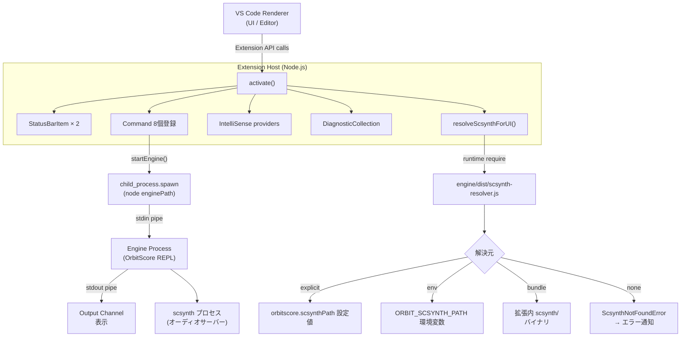

> **Note**: 本ページは 2026-05-05 時点での著者の reading の足跡です。code が真実、本ページはその時点の理解の snapshot に過ぎません。

# IV-1. VS Code 拡張アーキテクチャ

OrbitScore の VS Code 拡張 (`packages/vscode-extension`) は、どのようにして起動し、エンジンとどのようにつながっているのでしょうか。本章ではその内部構造を extension の activation から engine プロセスとの通信まで順を追って読み解きます。

---

## 目次

1. [Extension Host の基礎](#extension-host-の基礎)
2. [activation と activationEvents](#activation-と-activationevents)
3. [`activate()` 関数の全体像](#activate-関数の全体像)
4. [Status Bar: 2 本のインジケータ](#status-bar-2-本のインジケータ)
5. [Command 登録](#command-登録)
6. [IntelliSense と診断の登録](#intellisense-と診断の登録)
7. [scsynth 解決: `resolveScsynthForUI()`](#scsynth-解決-resolvescsynthforui)
8. [Engine プロセスの spawn](#engine-プロセスの-spawn)
9. [Engine との通信プロトコル](#engine-との通信プロトコル)
10. [Engine の停止](#engine-の停止)
11. [アーキテクチャ全体図](#アーキテクチャ全体図)

---

## Extension Host の基礎

VS Code 拡張は **Extension Host** と呼ばれる専用の Node.js プロセス上で動きます。Renderer プロセス (エディタ UI) から fork されていて、DOM へのアクセスはありませんが、Node.js の全機能 (`fs`, `child_process` 等) が使えます。OrbitScore 拡張はこの Extension Host から別途 `child_process.spawn` で engine プロセスを起動するため、プロセスは 3 層になります:

```
VS Code Renderer (UI)
    └── Extension Host (Node.js)  ← 拡張コードが動く
            └── engine process (Node.js)  ← OrbitScore DSL エンジン
                    └── scsynth (SuperCollider audio server)
```

---

## activation と activationEvents

`package.json` が `activationEvents` フィールドで「どのタイミングで起動するか」を宣言します。

OrbitScore が使っているのは 2 種類です:

- `"onStartupFinished"`: VS Code 起動が完了した時点で無条件に起動
- `"onLanguage:orbitscore"`: `.orbs` ファイル (language ID: `orbitscore`) を開いた瞬間に起動

`onStartupFinished` があるため、OrbitScore ファイルを開いていなくても拡張は常時ロードされます。Status bar インジケータが常に表示されているのはこのためです。

---

## `activate()` 関数の全体像

エントリポイントは `extension.ts` の `activate()` です。VS Code が extension を読み込んだ直後に一度だけ呼ばれます。

```typescript
// extension.ts:19-97
export async function activate(context: vscode.ExtensionContext) {
  console.log('OrbitScore Audio DSL extension activated!')

  // Reset state on activation (important for reload)
  engineProcess = null
  isLiveCodingMode = false

  // Create output channel
  outputChannel = vscode.window.createOutputChannel('OrbitScore')

  // Show version info
  const packageJson = JSON.parse(fs.readFileSync(path.join(__dirname, '../package.json'), 'utf8'))
  const buildTime = fs.statSync(__filename).mtime.toISOString()
  outputChannel.appendLine('━━━━━━━━━━━━━━━━━━━━━━━━━━━━━━━━━━━━━━')
  outputChannel.appendLine(`🎵 OrbitScore Extension v${packageJson.version}`)
  outputChannel.appendLine(`📦 Build: ${buildTime}`)
  outputChannel.appendLine(`📂 Path: ${__dirname}`)
  outputChannel.appendLine('━━━━━━━━━━━━━━━━━━━━━━━━━━━━━━━━━━━━━━')
  outputChannel.appendLine('')

  // Create status bar item
  statusBarItem = vscode.window.createStatusBarItem(vscode.StatusBarAlignment.Right, 100)
  statusBarItem.text = '🎵 OrbitScore: Stopped'
  statusBarItem.tooltip = 'Click to show commands'
  statusBarItem.command = 'orbitscore.showCommands'
  statusBarItem.show()

  // Bundle status indicator (priority 99 → 既存 100 の左隣に並ぶ)
  bundleStatusItem = vscode.window.createStatusBarItem(vscode.StatusBarAlignment.Right, 99)
  // Click → orbitscore.scsynthPath に絞った設定画面に直接遷移
  // (tooltip 案内と一致、maybeShowBundleNotice の "Open Settings" ボタンとも統一)
  bundleStatusItem.command = {
    command: 'workbench.action.openSettings',
    title: 'Open scsynth settings',
    arguments: ['orbitscore.scsynthPath'],
  }
  updateBundleStatus()
  bundleStatusItem.show()

  // Re-evaluate bundle status when user changes the override setting
  context.subscriptions.push(
    vscode.workspace.onDidChangeConfiguration((e) => {
      if (e.affectsConfiguration('orbitscore.scsynthPath')) {
        updateBundleStatus()
      }
    }),
  )

  // Register commands
  context.subscriptions.push(
    vscode.commands.registerCommand('orbitscore.toggleEngine', toggleEngine),
    vscode.commands.registerCommand('orbitscore.showCommands', showCommands),
    vscode.commands.registerCommand('orbitscore.runSelection', runSelection),
    vscode.commands.registerCommand('orbitscore.stopEngine', stopEngine),
    vscode.commands.registerCommand('orbitscore.startEngineDebug', startEngineDebug),
    vscode.commands.registerCommand('orbitscore.forceKillScsynth', forceKillScsynth),
    vscode.commands.registerCommand('orbitscore.selectAudioDevice', selectAudioDevice),
    vscode.commands.registerCommand('orbitscore.configureFlash', configureFlash),
    statusBarItem,
    bundleStatusItem,
  )

  // Register IntelliSense providers
  registerCompletionProviders(context)
  registerHoverProvider(context)

  // Register diagnostics
  const diagnosticCollection = vscode.languages.createDiagnosticCollection('orbitscore')
  context.subscriptions.push(diagnosticCollection)

  // Update diagnostics on document change
  context.subscriptions.push(
    vscode.workspace.onDidChangeTextDocument((event) => {
      if (event.document.languageId === 'orbitscore') {
        updateDiagnostics(event.document, diagnosticCollection)
      }
    }),
  )
}
```

ざっと見ると、`activate()` はいくつかの仕事をまとめてやっています:

1. モジュールレベル変数 (`engineProcess`, `isLiveCodingMode`) を初期化
2. Output Channel を作成して version 情報を表示
3. Status bar アイテムを 2 個作成・表示
4. `orbitscore.scsynthPath` 設定変更のリスナーを登録
5. 8 つのコマンドを登録
6. IntelliSense (補完・ホバー) プロバイダを登録
7. 診断 (リアルタイム構文チェック) を登録

---

## Status Bar: 2 本のインジケータ

面白いのは、Status bar インジケータが **2 本** あることです。priority の値が違い、右端から並ぶ順が決まります:

| 変数 | priority | 役割 | クリック時 |
|---|---|---|---|
| `statusBarItem` | 100 (右端) | エンジン動作状態 (`Stopped` / `Ready` / `Ready 🐛`) | `showCommands` パレット |
| `bundleStatusItem` | 99 (その左) | scsynth 解決状態 (`bundled` / `custom` / `not found`) | `orbitscore.scsynthPath` 設定 |

`bundleStatusItem` は `updateBundleStatus()` が `resolveScsynthForUI()` を呼んで、解決できた source (bundle / env / explicit) によって表示を切り替えます:

```typescript
// extension.ts:138-163
function updateBundleStatus(): void {
  if (!bundleStatusItem) return
  const resolution = resolveScsynthForUI()
  if (!resolution) {
    bundleStatusItem.text = '$(error) scsynth: not found'
    bundleStatusItem.tooltip =
      'Bundled scsynth not found. Reinstall the extension or set orbitscore.scsynthPath to a system scsynth.'
    bundleStatusItem.backgroundColor = new vscode.ThemeColor('statusBarItem.errorBackground')
    return
  }
  bundleStatusItem.backgroundColor = undefined
  switch (resolution.source) {
    case 'bundle':
      bundleStatusItem.text = '$(check) scsynth (bundled)'
      bundleStatusItem.tooltip = `Using bundled scsynth\n${resolution.path}`
      break
    case 'env':
    case 'explicit':
      bundleStatusItem.text = '$(gear) scsynth (custom)'
      bundleStatusItem.tooltip = `Using user-overridden scsynth\n${resolution.path}`
      break
    default:
      bundleStatusItem.text = '$(question) scsynth: unknown source'
      bundleStatusItem.tooltip = resolution.path
  }
}
```

`env` と `explicit` を同じ表示にまとめている点が興味深いです。どちらも「ユーザーがカスタム設定した scsynth を使っている」という意味では同じなので、UI 上では区別しないという判断です。

また、`orbitscore.scsynthPath` の設定が変更されたら `updateBundleStatus()` を再呼び出しするリスナーが `activate()` 内に設定されています。設定変更がリアルタイムで反映される仕組みです。

---

## Command 登録

`activate()` が登録している 8 つのコマンドを整理します:

| コマンド ID | 関数 | 説明 |
|---|---|---|
| `orbitscore.toggleEngine` | `toggleEngine` | エンジン起動/停止トグル |
| `orbitscore.showCommands` | `showCommands` | コマンドパレット表示 |
| `orbitscore.runSelection` | `runSelection` | 選択コード/現在ブロック実行 (Cmd+Enter) |
| `orbitscore.stopEngine` | `stopEngine` | エンジン停止 |
| `orbitscore.startEngineDebug` | `startEngineDebug` | デバッグモードで起動 |
| `orbitscore.forceKillScsynth` | `forceKillScsynth` | scsynth を強制終了 |
| `orbitscore.selectAudioDevice` | `selectAudioDevice` | オーディオデバイス選択 |
| `orbitscore.configureFlash` | `configureFlash` | フラッシュエフェクト設定 |

`orbitscore.runSelection` には `package.json` でキーバインドが設定されています:

```json
{
  "key": "cmd+enter",
  "command": "orbitscore.runSelection",
  "when": "editorTextFocus && editorLangId == orbitscore"
}
```

`when` 条件で `editorLangId == orbitscore` が指定されているため、`.orbs` ファイルにフォーカスがある時のみ有効です。

---

## IntelliSense と診断の登録

`registerCompletionProviders(context)` と `registerHoverProvider(context)` が IntelliSense を担当します。実装の核は `completion-context.ts` にある `analyzeMethodChain()` と `getContextualCompletions()` です。

```typescript
// completion-context.ts:6-15
interface MethodChainContext {
  hasAudio: boolean
  hasChop: boolean
  hasPlay: boolean
  hasBeat: boolean
  hasLength: boolean
  hasTempo: boolean
  hasRun: boolean
  lastMethod: string
}
```

`analyzeMethodChain(lineText, position)` は、カーソル位置までのテキストを走査して、メソッドチェーンのどの段階にいるかを判定します。`getContextualCompletions(context, isGlobal)` はその結果を受けて、文脈に適した補完候補を並べ直して返します。例えば `.audio()` がまだない段階では `audio` が補完の先頭に来て、`.play()` 済みなら `run`, `loop` が先頭に来ます。

診断 (`updateDiagnostics`) はドキュメント変更イベント (`onDidChangeTextDocument`) で駆動します。`languageId === 'orbitscore'` の文書だけが対象です。チェック内容は 5 種類: 括弧の対応 (Error)、tempo 範囲 (Warning)、deprecated キーワード (Warning)、`global` state-setter の once-per-file (Warning)、`audioPath` ordering (Warning)。詳細は [II-2](/editor/execution-feedback#リアルタイム診断-updatediagnostics) を参照してください。

---

## scsynth 解決: `resolveScsynthForUI()`

scsynth (SuperCollider のオーディオサーバー) のパスを解決するのが `resolveScsynthForUI()` です。ここで一つ面白い実装パターンがあります。**Extension Host の JS (TypeScript にコンパイル済) が、engine パッケージの compiled JS を `require` でランタイムロードする** という構造です。

```typescript
// extension.ts:113-129
function resolveScsynthForUI(): { path: string; source: string } | null {
  try {
    // eslint-disable-next-line @typescript-eslint/no-require-imports, @typescript-eslint/no-var-requires
    const resolverModule = require('../engine/dist/audio/supercollider/scsynth-resolver') as {
      resolveScsynthPath: (opts?: { explicit?: string }) => { path: string; source: string }
    }
    const userOverride = vscode.workspace
      .getConfiguration('orbitscore')
      .get<string>('scsynthPath', '')
      .trim()
    return resolverModule.resolveScsynthPath(userOverride ? { explicit: userOverride } : undefined)
  } catch (err) {
    const reason = err instanceof Error ? err.message : String(err)
    outputChannel?.appendLine(`❌ scsynth resolver failed: ${reason}`)
    return null
  }
}
```

`require('../engine/dist/...')` は静的 import ではなく動的な `require` です。engine パッケージのビルド成果物 (`engine/dist/`) が存在しない場合は `catch` に落ちて `null` を返します。この場合、status bar に `$(error) scsynth: not found` が表示されます。

実際の解決ロジックは `scsynth-resolver.ts` (engine パッケージ) が担当します。優先順位チェーンは [ADR-003](/decisions/adr-003-scsynth-bundle) で詳しく述べますが、コードを見ておきましょう:

```typescript
// packages/engine/src/audio/supercollider/scsynth-resolver.ts:91-98
  return (
    tryCandidate(opts.explicit, 'explicit') ??
    tryCandidate(process.env[ENV_VAR], 'env') ??
    tryCandidate(bundleCandidatePath(), 'bundle') ??
    (() => {
      throw new ScsynthNotFoundError(searched)
    })()
  )
}
```

`explicit > env > bundle > throw` の優先順位です。どれも見つからなければ `ScsynthNotFoundError` をスローし、`resolveScsynthForUI()` の `catch` がそれを捕まえます。

---

## Engine プロセスの spawn

`startEngine(debugMode)` が実際に engine を子プロセスとして起動します。重要な部分を読んでみましょう:

```typescript
// extension.ts:681-743 (前半の事前チェックと env 設定を省略して core 部分)
function startEngine(debugMode: boolean = false) {
  if (engineProcess && !engineProcess.killed) {
    vscode.window.showWarningMessage('⚠️ Engine is already running')
    return
  }

  // Pre-check: scsynth が解決できない場合は engine spawn を行わず、エラー
  // Notification のみ表示する。spawn してから boot 失敗するとユーザーに
  // 二重通知 (resolver エラー + engine 終了ログ) が出てしまうのを防ぐ
  // (claude-review on PR #155 の Significant 指摘 #2)。
  // 解決できた場合はその path を engine spawn に再利用 (Minor #1: 二重 fs.statSync 回避)。
  const scResolution = resolveScsynthForUI()
  if (!scResolution) {
    void maybeShowBundleNotice()
    return
  }
  // ...
```

spawn 前に `resolveScsynthForUI()` を呼んでいるのは二重の理由があります。1 つ目は「scsynth が見つからないなら spawn 自体を止める」(二重通知の防止)。2 つ目は「解決済みのパスを環境変数で engine に渡す」(二重 `fs.statSync` の回避) です。PR #155 のコードレビューコメントが inline に残っていて、なぜこうなっているかが分かりやすいです。

実際の spawn はここです:

```typescript
// extension.ts:739-743
  engineProcess = child_process.spawn('node', [enginePath, ...args], {
    cwd: workspaceRoot,
    stdio: ['pipe', 'pipe', 'pipe'],
    env,
  })
```

`stdio: ['pipe', 'pipe', 'pipe']` が重要です。stdin/stdout/stderr をすべて pipe にすることで、Extension Host から直接 write/read できます。scsynth のパスは環境変数で渡します:

```typescript
// extension.ts:735
  env.ORBIT_SCSYNTH_PATH = scResolution.path
```

---

## Engine との通信プロトコル

Extension Host と engine プロセスの通信は **stdin/stdout パイプ** で行われています。シンプルな行指向プロトコルです:

- **Extension → Engine**: DSL テキストを stdin に 1 行分として `write(text + '\n')` で送信
- **Engine → Extension**: 実行結果やログを stdout に出力、拡張が読み取って Output Channel に表示

この送信部分は `runSelection()` の末尾にあります:

```typescript
// extension.ts:1107
  engineProcess.stdin?.write(codeToSend + '\n')
```

`codeToSend` は単一行の場合も複数行の場合もありますが、末尾に `\n` を付けることで engine 側が「1 つのコマンドの終わり」を検出できます。実行フィードバック (選択行のフラッシュ表示、エラー位置表示) については [IV-2 インライン実行とフィードバック](/editor/execution-feedback) で詳しく扱います。

---

## Engine の停止

`stopEngine()` は SIGTERM → (2 秒後) SIGKILL という 2 段階のシャットダウンを行います:

```typescript
// extension.ts:765-789
function stopEngine() {
  if (engineProcess && !engineProcess.killed) {
    // Capture process reference before nulling module-level variable
    // (the SIGKILL timeout needs this reference after engineProcess is set to null)
    const proc = engineProcess
    engineProcess = null
    isLiveCodingMode = false

    // Send graceful shutdown signal (SIGTERM)
    // This allows the engine to clean up SuperCollider properly
    proc.kill('SIGTERM')

    // Force kill after 2 seconds if still running
    setTimeout(() => {
      if (!proc.killed) {
        proc.kill('SIGKILL')
      }
    }, 2000)

    statusBarItem!.text = '🎵 OrbitScore: Stopped'
    statusBarItem!.tooltip = 'Click to start engine'
    vscode.window.showInformationMessage('🛑 Engine stopped')
    outputChannel?.appendLine('🛑 Engine stopped')
  }
}
```

`engineProcess = null` にした後でも `setTimeout` のクロージャが `proc` (ローカル変数) を参照する必要があるため、先に `const proc = engineProcess` でキャプチャしています。このコメントが inline にあるのが読みやすいです。

SIGTERM を先に送るのは、engine 側が SuperCollider (scsynth) を graceful に終了させる時間を与えるためです。もし engine が 2 秒以内に終了しなければ SIGKILL で強制終了します。

---

## アーキテクチャ全体図



---

## 関連用語

- [activate() / deactivate()](/glossary#activate--deactivate) — VS Code 拡張のライフサイクル関数。本章で詳説する `activate()` がすべての登録を行う
- [activationEvents](/glossary#activationevents) — `"onStartupFinished"` と `"onLanguage:orbitscore"` の 2 種類で常時起動を実現
- [Extension Host](/glossary#extension-host) — 拡張コードが動く Node.js プロセス。engine プロセスの親プロセス
- [StatusBarItem](/glossary#statusbaritem) — `statusBarItem` (priority 100) と `bundleStatusItem` (priority 99) の 2 本を管理
- [language ID (orbitscore)](/glossary#language-id-orbitscore) — `.orbs` ファイルに割り当てた言語 ID。IntelliSense・診断・キーバインドがすべてこの ID でフィルタリング
- [DiagnosticCollection](/glossary#diagnosticcollection) — `updateDiagnostics()` が書き込む診断コレクション。タイピングのたびに更新
- [scsynth](/glossary#scsynth) — `resolveScsynthForUI()` が起動前に解決するオーディオサーバーバイナリ
- [strict mode (scsynth resolver)](/glossary#strict-mode-scsynth-resolver) — scsynth が見つからなければ spawn 自体をキャンセルする fail-loud 設計
- [MethodChainContext](/glossary#methodchaincontext) — IntelliSense が文脈に応じた補完候補を出すためのメソッドチェーン状態表現

## 関連 ADR

- [ADR-001 SuperCollider ベース実装の選択](/decisions/adr-001-supercollider) — engine が scsynth を必要とする背景
- [ADR-003 scsynth bundle strict mode](/decisions/adr-003-scsynth-bundle) — `resolveScsynthForUI()` の優先順位と fail-loud 設計の意思決定

## 次の深掘り候補

- `registerCompletionProviders` と `registerHoverProvider` の実装詳細 (`extension.ts` の別セクション)
- `getLineSubject()` の実装 — どのようにして「この行はどの変数に属するか」を判定しているか
- `setupStdoutHandler` / `setupStderrHandler` — engine からの出力をどう処理しているか
- `selectAudioDevice` コマンドの実装 — audio device 設定ファイルの保存先と形式
- `deactivate()` のクリーンアップ処理 — subscriptions の自動 dispose と手動 kill の関係
- `startEngineDebug()` と通常起動の差分 — `ORBITSCORE_DEBUG=1` の engine 側での扱い

---

## Sources

- `packages/vscode-extension/src/extension.ts:19-97` — `activate()` 全体: output channel 作成・status bar 作成・command 登録・diagnostics 登録
- `packages/vscode-extension/src/extension.ts:113-129` — `resolveScsynthForUI()`: runtime `require` による scsynth 解決
- `packages/vscode-extension/src/extension.ts:138-163` — `updateBundleStatus()`: source 種別による status bar 表示切り替え
- `packages/vscode-extension/src/extension.ts:173-190` — `maybeShowBundleNotice()`: scsynth 解決失敗時のエラー通知
- `packages/vscode-extension/src/extension.ts:681-759` — `startEngine()`: scsynth 事前チェック・env 設定・child_process.spawn
- `packages/vscode-extension/src/extension.ts:739-743` — engine spawn コア: `stdio: ['pipe','pipe','pipe']`
- `packages/vscode-extension/src/extension.ts:765-789` — `stopEngine()`: SIGTERM + 2s SIGKILL フォールバック
- `packages/vscode-extension/src/extension.ts:1107` — `engineProcess.stdin?.write(codeToSend + '\n')`: DSL 送信
- `packages/vscode-extension/src/completion-context.ts:6-15` — `MethodChainContext` インターフェース
- `packages/vscode-extension/package.json` — `activationEvents`, `contributes.commands`, キーバインド定義
- `packages/engine/src/audio/supercollider/scsynth-resolver.ts:91-98` — `explicit > env > bundle > throw` 優先順位チェーン
- PR [#155](https://github.com/signalcompose/orbitscore/pull/155) — scsynth strict mode 採用・二重通知防止のコードレビューコメント
