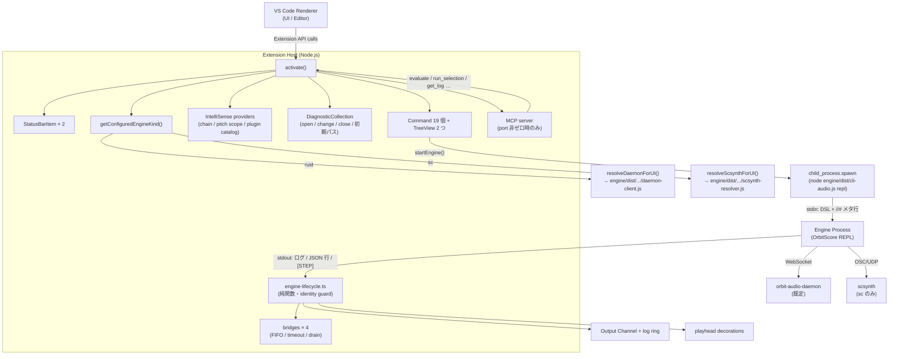

> **Note**: 本ページは 2026-09-01 時点での著者の reading の足跡で、2026-09-04 に #385（PR [#730](https://github.com/signalcompose/orbitscore/pull/730)・`capabilities.untrustedWorkspaces` の宣言）まで追従しました。code が真実、本ページはその時点の理解の snapshot に過ぎません。

# IV-1. VS Code 拡張アーキテクチャ

OrbitScore の VS Code 拡張 (`packages/vscode-extension`、package version 2.1.0) は、どのようにして起動し、エンジンとどのようにつながっているのでしょうか。本章ではその内部構造を extension の activation から engine プロセスとの通信まで順を追って読み解きます。2026-05 の初稿から最も変わったのは「engine kind の分岐」「engine ライフサイクルの vscode 非依存モジュールへの抽出」「MCP サーバ・playhead・Engine ビューといった周辺機能の増加」で、末尾に drift の一覧をまとめました。

---

## 目次

1. [Extension Host の基礎](#extension-host-の基礎)
2. [activation と activationEvents](#activation-と-activationevents)
3. [workspace trust と untrustedWorkspaces](#workspace-trust-と-untrustedworkspaces)
4. [モジュールレベルの状態](#モジュールレベルの状態)
5. [`activate()` 関数の全体像](#activate-関数の全体像)
6. [Status Bar: 2 本のインジケータと engine kind](#status-bar-2-本のインジケータと-engine-kind)
7. [Command 登録](#command-登録)
8. [IntelliSense と診断の登録](#intellisense-と診断の登録)
9. [バイナリ解決: scsynth と daemon](#バイナリ解決-scsynth-と-daemon)
10. [Engine プロセスの spawn](#engine-プロセスの-spawn)
11. [Engine との通信プロトコル](#engine-との通信プロトコル)
12. [Engine の停止とライフサイクルの識別ガード](#engine-の停止とライフサイクルの識別ガード)
13. [アーキテクチャ全体図](#アーキテクチャ全体図)
14. [2026-09 時点の drift](#2026-09-時点の-drift)

---

## Extension Host の基礎

VS Code 拡張は **Extension Host** と呼ばれる専用の Node.js プロセス上で動きます。Renderer プロセス (エディタ UI) から fork されていて、DOM へのアクセスはありませんが、Node.js の全機能 (`fs`, `child_process` 等) が使えます。OrbitScore 拡張はこの Extension Host から別途 `child_process.spawn` で engine プロセスを起動し、engine がさらに音声プロセスを起動するため、プロセスは 3 層になります:

```
VS Code Renderer (UI)
    └── Extension Host (Node.js)  ← 拡張コードが動く
            └── engine process (node engine/dist/cli-audio.js repl)  ← OrbitScore DSL エンジン
                    ├── orbit-audio-daemon (Rust・既定・WebSocket)
                    └── scsynth (SuperCollider・orbitscore.engine が "sc" のときのみ・OSC)
```

音声プロセスがどちらになるかは `orbitscore.engine` 設定 (既定 `"rust"`) で決まります。この分岐が本章の随所に顔を出します。

---

## activation と activationEvents

`package.json` が `activationEvents` フィールドで「どのタイミングで起動するか」を宣言します。

OrbitScore が使っているのは 2 種類です:

- `"onStartupFinished"`: VS Code 起動が完了した時点で無条件に起動
- `"onLanguage:orbitscore"`: `.orbs` ファイル (language ID: `orbitscore`) を開いた瞬間に起動

`onStartupFinished` があるため、OrbitScore ファイルを開いていなくても拡張は常時ロードされます。Status bar インジケータが常に表示されているのはこのためです。

---

## workspace trust と untrustedWorkspaces

`activationEvents` が決めるのは「いつ起動するか」でした。では「そもそも起動してよいか」は誰が決めるのでしょうか。それが VS Code の **workspace trust** (ワークスペースの信頼) です。信頼されていないワークスペースでは拡張は既定で「制限付き」になり、`activate()` そのものが呼ばれません。

ここで問題になるのが、フォルダを開かずに `.orbs` を 1 本だけ渡す起動 (`orbs file.orbs`) です。この形は VS Code 側では **ad-hoc な未信頼ワークスペース**として扱われるため、`capabilities.untrustedWorkspaces` を宣言していない拡張はそこで activate されません。利用者からは「何も起きない」ようにしか見えないので、**実害は拒否ではなく沈黙**でした (#385)。

宣言は `package.json` の `engines` と `main` のあいだに置かれています。

```json
// packages/vscode-extension/package.json:34-43
  "capabilities": {
    "untrustedWorkspaces": {
      "supported": true,
      "description": "OrbitScore starts a native audio engine and loads the audio plugins named by the score, the same way a DAW opens a project. Evaluation works in untrusted workspaces; only the settings that choose which executable runs are restricted.",
      "restrictedConfigurations": [
        "orbitscore.scsynthPath",
        "orbitscore.engine"
      ]
    }
  },
```

`supported: true` は「未信頼でも制限しない」という宣言です。裁定の根拠は「一般的な DAW の挙動に併せて」で (`docs/design/656-release-design.md` §16 (1))、DAW はプロジェクトを開くときに信頼を問わずプラグインを読みます。OrbitScore も未信頼ワークスペースで engine を起動し、譜面の `instrument(path)` を読みます。そのため `startEngine()` の側に信頼を確かめるガードは置かれていません。ライブコーディングは評価を繰り返す行為なので、1 回の確認ダイアログが「毎回の中断」になってしまうからです。

一方 `restrictedConfigurations` は `supported` の値とは独立に効きます。ここに挙げた設定キーは、未信頼ワークスペースでは**ワークスペース側の設定値が無視され、ユーザー設定の値が使われます**。基準は「ワークスペースが値を決めると別の実行ファイルが動く」ものだけ、という 1 点です。

| 設定 | 入れた理由 |
|---|---|
| `orbitscore.scsynthPath` | 実行ファイルのパスそのもの |
| `orbitscore.engine` | `"sc"` に倒すと `scsynthPath` を有効化する |

`orbitscore.audioDevice` はこの基準に当てはまりません。デバイス名は実行対象を選ばないうえ、gated E2E のハーネスがワークスペース設定へ書き込むので、restrict すると実機テストが壊れます。

面白いのは、この宣言がコードからは一度も読まれないという点です。放っておくと「誰も読まない設定」になってしまうので、`tests/vscode-extension/untrusted-workspace-capability.spec.ts` の 6 本がマニフェストを直接読んで検査しています。`restrictedConfigurations` を配列として取り出せない形になったらその場で落とす、という書き方になっているのは、`?? []` へフォールバックすると宣言が丸ごと消えたときに `for...of` が 0 周して green になってしまうためです。

ただし**この層が保証するのは宣言の内容までです**。「実際に未信頼ワークスペースで activate され、しかも普通に音が出る」ことは実機の gated E2E (`E2E-D1`) が押さえる予定で、こちらは #735 へ分離されました。`--extensionDevelopmentPath` で起動する開発モードは workspace trust の制限を迂回するため、そこで書いた E2E は `capabilities` ブロックを丸ごと削除しても緑になってしまう、というのが 2026-09-04 の実測です。

---

## モジュールレベルの状態

`extension.ts` は 4,115 行の大きなファイルで、状態はモジュールレベル変数に置かれています。先頭付近の宣言を見ると、この拡張が何を抱えているかの索引になります。

```typescript
// packages/vscode-extension/src/extension.ts:104-115
let engineProcess: child_process.ChildProcess | null = null
let outputChannel: vscode.OutputChannel | null = null
let statusBarItem: vscode.StatusBarItem | null = null
let bundleStatusItem: vscode.StatusBarItem | null = null
let devDocsPanel: vscode.WebviewPanel | null = null
let isLiveCodingMode: boolean = false
// Tracks whether `var global = init GLOBAL` has been evaluated in the current engine session.
// Used to decide if `global.setDocumentDirectory(...)` can be prepended safely.
let globalInitialized: boolean = false
let transportPlaying: boolean = false
// Optional MCP control server (Agent Bridge). Non-null only while running.
let mcpServerHandle: McpServerHandle | null = null
```

この後に、engine の stdout に乗って返ってくる JSON 行を待ち受ける **bridge** が 4 つ続きます (`DeviceSwitchBridge` / `PluginStateBridge` / `PluginUiBridge` / `EvalMarkBridge`)。いずれも「stdin にメタ行を書き、stdout の対応する 1 行 JSON で resolve する」FIFO で、engine が死んだら `drainAll()` で全部を失敗させます。engine の `stop → start` を素早く繰り返したときに古いプロセスの応答が新しい engine の要求にマッチしてしまう競合 (#501 / #528) を防ぐための構造です。

---

## `activate()` 関数の全体像

エントリポイントは `extension.ts` の `activate()` です。VS Code が extension を読み込んだ直後に一度だけ呼ばれます。前半を見てみましょう。

```typescript
// packages/vscode-extension/src/extension.ts:286-341
export async function activate(context: vscode.ExtensionContext) {
  console.log('OrbitScore Audio DSL extension activated!')

  // Reset state on activation (important for reload)
  engineProcess = null
  isLiveCodingMode = false
  globalInitialized = false
  transportPlaying = false

  // Create output channel
  outputChannel = vscode.window.createOutputChannel('OrbitScore')

  // Tap appendLine/append into the ring buffer so the MCP get_log tool can read
  // recent output without a separate logging sink (#388). Installed before the
  // version banner below so get_log's history starts from activation.
  const rawAppendLine = outputChannel.appendLine.bind(outputChannel)
  outputChannel.appendLine = (value: string) => {
    pushLogRing(value)
    rawAppendLine(value)
  }
  const rawAppend = outputChannel.append.bind(outputChannel)
  outputChannel.append = (value: string) => {
    for (const line of value.split('\n')) {
      if (line) pushLogRing(line)
    }
    rawAppend(value)
  }

  // Show version info
  const packageJson = JSON.parse(fs.readFileSync(path.join(__dirname, '../package.json'), 'utf8'))
  const buildTime = fs.statSync(__filename).mtime.toISOString()
  outputChannel.appendLine('━━━━━━━━━━━━━━━━━━━━━━━━━━━━━━━━━━━━━━')
  outputChannel.appendLine(`🎵 OrbitScore Extension v${packageJson.version}`)
  outputChannel.appendLine(`📦 Build: ${buildTime}`)
  outputChannel.appendLine(`📂 Path: ${__dirname}`)
  outputChannel.appendLine('━━━━━━━━━━━━━━━━━━━━━━━━━━━━━━━━━━━━━━')
  outputChannel.appendLine('')

  // Create status bar item
  statusBarItem = vscode.window.createStatusBarItem(vscode.StatusBarAlignment.Right, 100)
  statusBarItem.text = '🎵 OrbitScore: Stopped'
  statusBarItem.tooltip = 'Open Audio Engine Settings'
  statusBarItem.command = 'orbitscore.showCommands'
  statusBarItem.show()

  // Bundle status indicator (priority 99 → 既存 100 の左隣に並ぶ)
  bundleStatusItem = vscode.window.createStatusBarItem(vscode.StatusBarAlignment.Right, 99)
  // Click → orbitscore.scsynthPath に絞った設定画面に直接遷移
  // (tooltip 案内と一致、maybeShowBundleNotice の "Open Settings" ボタンとも統一)
  bundleStatusItem.command = {
    command: 'workbench.action.openSettings',
    title: 'Open scsynth settings',
    arguments: ['orbitscore.scsynthPath'],
  }
  updateBundleStatus()
  updateStatusBarEngineAction()
```

面白いのは Output Channel の `appendLine` / `append` を **monkey-patch** している箇所です。拡張には中央のログ sink が無いので、MCP の `get_log` ツール (#388) が読めるように、Output Channel に流れる行をリングバッファ (`outputLogRing`、上限は `log-ring.ts` の `OUTPUT_LOG_RING_MAX = 1000`) にも積んでいます。

`activate()` の残りは大きく 5 つの仕事です:

1. 設定変更リスナー (`orbitscore.scsynthPath` / `orbitscore.engine` / `orbitscore.playheadPalette`) の登録
2. コマンドと TreeView provider の登録 (次節)
3. IntelliSense (補完・ホバー) プロバイダの登録
4. 診断 (`DiagnosticCollection`) の登録と、開いているドキュメントへの初期パス (#384)
5. MCP サーバの起動 (port が非ゼロのときのみ) と、Rust engine の自動起動

最後の 2 つはこう書かれています。

```typescript
// packages/vscode-extension/src/extension.ts:445-499 (MCP ツールのハンドラ表を省略)
  // Optional MCP control server (Agent Bridge, #388) — dev/agent-integration
  // only, gated behind a nonzero port. The `ORBITSCORE_MCP_PORT` env var takes
  // precedence over the `orbitscore.mcpServer.port` setting so the extension can
  // be launched from the CLI (e.g. Extension Development Host) with the port set
  // without editing settings. Lets an external agent (e.g. Claude Code) drive
  // OrbitScore operations for E2E testing.
  const envMcpPort = Number(process.env.ORBITSCORE_MCP_PORT)
  const mcpPort =
    Number.isInteger(envMcpPort) && envMcpPort > 0
      ? envMcpPort
      : vscode.workspace.getConfiguration('orbitscore').get<number>('mcpServer.port', 0)
  if (mcpPort && mcpPort > 0) {
    // ...
  }

  void autoStartConfiguredRustEngine()
}
```

省略したブロックが `startOrbitScoreMcpServer()` に 25 個のハンドラ (`evaluate` / `startEngine` / `getLog` / `analyzeAudio` / `listPlugins` …) を渡す表です。MCP サーバの中身と gated E2E は [IV-3. MCP サーバと実機 gated E2E](/editor/mcp-and-gated-e2e) に譲ります。`autoStartConfiguredRustEngine()` は `rust` kind で出力デバイスが保存済みなら engine を自動起動し、5 秒後に生存確認をします (`extension.ts:1699-1723`)。

---

## Status Bar: 2 本のインジケータと engine kind

Status bar インジケータは **2 本** あります。priority の値が違い、右端から並ぶ順が決まります:

| 変数 | priority | 役割 | クリック時 |
|---|---|---|---|
| `statusBarItem` | 100 (右端) | エンジン動作状態 (`Stopped` / `Ready` / `▶️ Playing`、debug なら `🐛` 付き) | `showCommands` (`rust` なら Engine ビューを focus、`sc` なら QuickPick) |
| `bundleStatusItem` | 99 (その左) | バイナリ解決状態 | `orbitscore.scsynthPath` 設定 |

`bundleStatusItem` の表示は `updateBundleStatus()` が決めますが、その最初の分岐が **engine kind** です。

```typescript
// packages/vscode-extension/src/extension.ts:726-742
function updateBundleStatus(): void {
  if (!bundleStatusItem) return
  if (getConfiguredEngineKind() === 'rust') {
    const daemonResolution = resolveDaemonForUI()
    if (!daemonResolution) {
      bundleStatusItem.show()
      bundleStatusItem.text = '$(error) daemon: not found'
      bundleStatusItem.tooltip =
        'orbit-audio-daemon not found. Reinstall the extension, build it via `cd rust && cargo build --release`, or set ORBIT_AUDIO_DAEMON_PATH to a custom binary.'
      bundleStatusItem.backgroundColor = new vscode.ThemeColor('statusBarItem.errorBackground')
      return
    }
    // 既定（Rust・健全）ではインジケータ自体を出さない（owner 判断 2026-07-17: 常時表示の
    // 意味がない）。daemon 不在エラーと SC バックエンド時のみ表示する。
    bundleStatusItem.hide()
    return
  }
```

`rust` kind で daemon が見つかる (= 通常の状態) ときはインジケータを **隠します**。`sc` kind のときだけ scsynth の解決結果 (`bundled` / `custom` / `not found`) を表示します (`extension.ts:742-766`、[III-3](/audio/scsynth-bundle) 参照)。`env` と `explicit` を同じ `custom` 表示にまとめている判断は 2026-05 から変わっていません。

engine kind を決める `getConfiguredEngineKind()` は `orbitscore.engine` 設定を読み、engine パッケージの `resolveEngineKind()` を runtime `require` で借りて正規化します (`extension.ts:653-669`)。UI と engine の判定を 1 か所に寄せるための工夫です。

---

## Command 登録

`activate()` が登録しているコマンドを整理します。`contributes.commands` に載る 17 個と、TreeView のノードからだけ呼ばれる内部コマンド 2 個があります。

```typescript
// packages/vscode-extension/src/extension.ts:367-404
  // Register commands
  context.subscriptions.push(
    vscode.commands.registerCommand('orbitscore.toggleEngine', toggleEngine),
    vscode.commands.registerCommand('orbitscore.showCommands', showCommands),
    vscode.commands.registerCommand('orbitscore.runSelection', runSelection),
    vscode.commands.registerCommand('orbitscore.stopEngine', stopEngine),
    vscode.commands.registerCommand('orbitscore.restartEngine', restartEngine),
    vscode.commands.registerCommand('orbitscore.reloadWindow', reloadWindow),
    vscode.commands.registerCommand('orbitscore.startEngineDebug', startEngineDebug),
    vscode.commands.registerCommand('orbitscore.forceKillScsynth', forceKillScsynth),
    vscode.commands.registerCommand('orbitscore.selectAudioDevice', selectAudioDevice),
    vscode.commands.registerCommand('orbitscore.configureFlash', configureFlash),
    vscode.commands.registerCommand('orbitscore.registerMcpServer', registerMcpServer),
    vscode.commands.registerCommand('orbitscore.rescanPlugins', rescanPlugins),
    vscode.commands.registerCommand('orbitscore.browsePlugins', browsePlugins),
    // viewsWelcome コンテンツは view に provider が登録されて初めて描画される
    // （空 TreeView で十分 — 章ツリーの本実装は #451 確定後の follow-up）。
    vscode.window.registerTreeDataProvider('orbitscore.learningView', {
      getChildren: () => [],
      getTreeItem: (element: vscode.TreeItem) => element,
    }),
    // Engine ビュー（#484 D3）: エンジン停止中は空を返し viewsWelcome（Start/Debug/Stop ボタン）を
    // 出す（viewsWelcome は tree が空の時だけ描画される — 上の学習ビューと同じ制約）。起動中は
    // engine 状態 + Output Device セクションを TreeView として描画する。
    (() => {
      engineViewProvider = new EngineViewProvider()
      return vscode.window.registerTreeDataProvider('orbitscore.engineView', engineViewProvider)
    })(),
    vscode.commands.registerCommand('orbitscore.engineViewSelectDevice', engineViewSelectDevice),
    vscode.commands.registerCommand('orbitscore.engineViewToggleEngine', engineViewToggleEngine),
    vscode.commands.registerCommand('orbitscore.engineViewToggleDebug', engineViewToggleDebug),
    vscode.commands.registerCommand('orbitscore.openDocs', openUserDocs),
    vscode.commands.registerCommand('orbitscore.openDevDocs', openDevDocs),
    vscode.commands.registerCommand('orbitscore.openDevDocsPanel', () => openDevDocsPanel(context)),
    vscode.commands.registerCommand('orbitscore.openWalkthrough', openWalkthrough),
    statusBarItem,
    bundleStatusItem,
  )
```

| コマンド ID | 関数 | 説明 | palette 表示 |
|---|---|---|---|
| `orbitscore.toggleEngine` | `toggleEngine` | エンジン起動/停止トグル | 非表示 (`editor/title` ボタン) |
| `orbitscore.showCommands` | `showCommands` | `rust`: Engine ビューを focus / `sc`: QuickPick | (status bar から) |
| `orbitscore.runSelection` | `runSelection` | 選択コード/現在ブロック実行 (Cmd+Enter) | 表示 |
| `orbitscore.stopEngine` | `stopEngine` | エンジン停止 | 非表示 |
| `orbitscore.restartEngine` | `restartEngine` | stop → 2.2 秒待ち → start (recovery) | 非表示 (Engine ビューの Recovery) |
| `orbitscore.reloadWindow` | `reloadWindow` | `workbench.action.reloadWindow` | 非表示 (Engine ビューの Recovery) |
| `orbitscore.startEngineDebug` | `startEngineDebug` | デバッグモードで起動 | 非表示 |
| `orbitscore.forceKillScsynth` | `forceKillScsynth` | `killall scsynth` | `orbitscore.engine == 'sc'` のみ |
| `orbitscore.selectAudioDevice` | `selectAudioDevice` | SC 用オーディオデバイス選択 | `orbitscore.engine == 'sc'` のみ |
| `orbitscore.configureFlash` | `configureFlash` | フラッシュエフェクト設定 | 表示 |
| `orbitscore.registerMcpServer` | `registerMcpServer` | `.mcp.json` に Claude Code 用エントリを書く (#388) | 表示 |
| `orbitscore.rescanPlugins` | `rescanPlugins` | plugin catalog の再スキャン (#463) | 表示 + `editor/context` |
| `orbitscore.browsePlugins` | `browsePlugins` | catalog から名前を選んで挿入 (#638) | 表示 |
| `orbitscore.engineViewSelectDevice` | `engineViewSelectDevice` | Engine ビューのデバイスノードをクリック (#484 D3) | 非表示 |
| `orbitscore.openDocs` | `openUserDocs` | user 向け学習サイトをブラウザで開く | 表示 + `editor/title` |
| `orbitscore.openDevDocs` | `openDevDocs` | dev 学習サイト (本サイト) をブラウザで開く (#450) | 表示 |
| `orbitscore.openDevDocsPanel` | `openDevDocsPanel` | 同上を Webview タブで開く (#457) | 表示 |
| `orbitscore.openWalkthrough` | `openWalkthrough` | `orbitscore.learnOrbitScore` walkthrough (4 ステップ) を開く (#457) | 表示 |
| `orbitscore.engineViewToggleEngine` / `engineViewToggleDebug` | — | Engine ビューのノードから呼ばれる内部コマンド | `contributes.commands` に無し |

`orbitscore.runSelection` には `package.json` でキーバインドが設定されています:

```json
{
  "key": "cmd+enter",
  "command": "orbitscore.runSelection",
  "when": "editorTextFocus && editorLangId == orbitscore"
}
```

`when` 条件で `editorLangId == orbitscore` が指定されているため、`.orbs` ファイルにフォーカスがある時のみ有効です。

Activity Bar には 2 つのコンテナ (`orbitscore` = Learning view、`orbitscore-engine` = Audio Engine Settings view) が生えています。Learning view は空の TreeView で、`viewsWelcome` のボタン (Open Learning Site / Start the Walkthrough) だけを出す入口です。Engine ビューの方は `engine-view.ts` の純関数がノードを組み立て、`extension.ts` の `EngineViewProvider` がそれを `vscode.TreeItem` に写します。

```typescript
// packages/vscode-extension/src/engine-view.ts:47-54
export function buildRootNodes(engineRunning: boolean): EngineViewNode[] {
  return [
    buildEngineStatusNode(engineRunning),
    buildDebugToggleNode(false),
    buildDeviceSectionNode(),
    buildRecoverySectionNode(),
  ]
}
```

デバイスをクリックしたときの意味論は「選択 = 電源」で、同じデバイスをもう一度クリックすると停止、未起動なら起動、起動中なら走行中切替、と `resolveDeviceClickAction()` (`engine-view.ts:207-216`) が決めます。走行中の切替は `//#selectAudioDevice` メタ行で engine に依頼します (次々節)。

---

## IntelliSense と診断の登録

`registerCompletionProviders(context)` と `registerHoverProvider(context)` が IntelliSense を担当します。補完は 3 系統に増えました。

1. **メソッドチェーン文脈補完**: `completion-context.ts` の `analyzeMethodChain()` と `getContextualCompletions()`。`.` をトリガに、チェーンのどの段階かを見て候補を並べ替えます
2. **pitch scope 補完**: `.play(` の括弧が閉じていない位置で `).` と打ったときは `getPitchScopeCompletions()` に切り替わります (`extension.ts:3652-3672`)
3. **plugin catalog 名前補完**: `effect(` / `instrument(` の文字列引数の中で `"` をトリガに catalog の名前を出します (#463 C3、`extension.ts:3689-` 以降)。深掘りは [PH-3. プラグインカタログと差し替え](/plugin-hosting/catalog)

`MethodChainContext` は 2026-05 から 3 フラグ増えています。

```typescript
// packages/vscode-extension/src/completion-context.ts:6-18
interface MethodChainContext {
  hasAudio: boolean
  hasChop: boolean
  hasPlay: boolean
  hasBeat: boolean
  hasLength: boolean
  hasTempo: boolean
  hasRun: boolean
  hasOutput: boolean
  hasLinkAudio: boolean
  hasQuantize: boolean
  lastMethod: string
}
```

補完候補の語彙は `dsl-method-catalog.ts` に複製されていて、engine 側の `SEQUENCE_DSL_METHODS` / `GLOBAL_DSL_METHODS` / `BUS_DSL_METHODS` と一字一句一致することをテストが強制します。拡張プロセスは engine のモジュールを import しない設計なので、複製は避けられず、代わりにテストで乖離を赤にする、という割り切りです。

```typescript
// packages/vscode-extension/src/dsl-method-catalog.ts:1-14
/**
 * DSL メソッド補完の候補表（#495 第1段）。
 *
 * 🔴 **正本は engine 側**（`packages/engine/src/signal-chain/runtime.ts` の
 * `SEQUENCE_DSL_METHODS` / `GLOBAL_DSL_METHODS` / `BUS_DSL_METHODS`）。
 *
 * ここに複製があるのは、拡張が engine を**プロセス境界越しに**使う設計だから
 * （`plugin-catalog-reader.ts` も同じ理由で "deliberately independent" と書いている）。
 * 拡張プロセスは engine のモジュールを import しない。
 *
 * 複製は乖離する。それを防ぐため **`tests/vscode-extension/dsl-method-catalog.spec.ts` が
 * engine の語彙と一字一句一致することを検査する**。DSL にメソッドを足してここを更新し忘れると
 * テストが red になる（`seq.ui()` を足したのに補完に出ない、を構造的に防ぐ）。
 */
```

診断 (`updateDiagnostics`) は、2026-05 時点では `onDidChangeTextDocument` だけで駆動していましたが、#384 で「開いたとき」「閉じたとき」「activation 時に既に開いていたもの」にも広がりました。

```typescript
// packages/vscode-extension/src/extension.ts:414-443
  // Compute diagnostics on open and change; clear them on close (#384).
  // Diagnostics must not wait for the first edit — files opened from the CLI,
  // restored tabs, or the activation-time initial pass below all need
  // errors/warnings surfaced immediately.
  context.subscriptions.push(
    vscode.workspace.onDidOpenTextDocument((document) => {
      if (isOrbitscoreDocument(document)) {
        updateDiagnostics(document, diagnosticCollection)
      }
    }),
    vscode.workspace.onDidChangeTextDocument((event) => {
      if (isOrbitscoreDocument(event.document)) {
        updateDiagnostics(event.document, diagnosticCollection)
      }
    }),
    vscode.workspace.onDidCloseTextDocument((document) => {
      if (isOrbitscoreDocument(document)) {
        diagnosticCollection.delete(document.uri)
      }
    }),
  )

  // Initial pass over documents already open at activation (#384): the
  // extension activates on `onLanguage:orbitscore`, so the triggering document
  // is already open and would otherwise never fire onDidOpenTextDocument.
  for (const document of vscode.workspace.textDocuments) {
    if (isOrbitscoreDocument(document)) {
      updateDiagnostics(document, diagnosticCollection)
    }
  }
```

チェック内容は行内 3 種 + 横断解析 6 種の計 9 種です。詳細は [IV-2](/editor/execution-feedback#リアルタイム診断-updatediagnostics) を参照してください。

---

## バイナリ解決: scsynth と daemon

engine を spawn する前に、拡張は「音声プロセスの実行ファイルが本当にあるか」を事前チェックします。ここに面白い実装パターンがあります。**Extension Host の JS (TypeScript にコンパイル済) が、engine パッケージの compiled JS を `require` でランタイムロードする** という構造で、scsynth と daemon の両方に同じ形の wrapper があります。

```typescript
// packages/vscode-extension/src/extension.ts:677-711
function resolveScsynthForUI(): { path: string; source: string } | null {
  try {
    // eslint-disable-next-line @typescript-eslint/no-require-imports, @typescript-eslint/no-var-requires
    const resolverModule = require('../engine/dist/audio/supercollider/scsynth-resolver') as {
      resolveScsynthPath: (opts?: { explicit?: string }) => { path: string; source: string }
    }
    const userOverride = vscode.workspace
      .getConfiguration('orbitscore')
      .get<string>('scsynthPath', '')
      .trim()
    return resolverModule.resolveScsynthPath(userOverride ? { explicit: userOverride } : undefined)
  } catch (err) {
    const reason = err instanceof Error ? err.message : String(err)
    outputChannel?.appendLine(`❌ scsynth resolver failed: ${reason}`)
    return null
  }
}

/**
 * Resolve the native Rust daemon binary via shared resolver (engine の
 * compiled JS を runtime require). Returns null on failure. Symmetric to
 * `resolveScsynthForUI()` — same runtime-require pattern, same
 * log-reason-to-outputChannel-on-failure behavior (C2). Used to pre-check
 * daemon availability under the `rust` engine kind, mirroring how
 * `resolveScsynthForUI()` pre-checks scsynth under the `sc` kind.
 */
function resolveDaemonForUI(): { path: string; source: string } | null {
  try {
    return resolveDaemonBinaryForExtension()
  } catch (err) {
    const reason = err instanceof Error ? err.message : String(err)
    outputChannel?.appendLine(`❌ daemon resolver failed: ${reason}`)
    return null
  }
}
```

daemon 側の `require` は `engine-startup-runtime.ts` という小さなモジュールに切り出されています。ユニットテストがこの境界を差し替えられるようにするためで、拡張のビルド成果物 (`engine/dist/`) が無い環境でも `startEngine()` のロジックをテストできます。

```typescript
// packages/vscode-extension/src/engine-startup-runtime.ts:14-24
export function resolveDaemonBinaryForExtension(): EngineBinaryResolution {
  // eslint-disable-next-line @typescript-eslint/no-require-imports, @typescript-eslint/no-var-requires
  const daemonModule = require('../engine/dist/audio/rust-engine/daemon-client') as {
    resolveDaemonBinaryPath: (explicitPath?: string) => EngineBinaryResolution
  }
  return daemonModule.resolveDaemonBinaryPath()
}

export function extensionEngineFileExists(enginePath: string): boolean {
  return fs.existsSync(enginePath)
}
```

scsynth の resolver は `explicit > env > bundle > throw`、daemon の resolver は `explicit > env > monorepo-release > monorepo-debug > extension-bundle > throw` です。どちらも silent fallback を持たず、見つからなければ例外で fail loud します ([ADR-003](/decisions/adr-003-scsynth-bundle))。

---

## Engine プロセスの spawn

`startEngine(debugMode?, agentOpts?)` が実際に engine を子プロセスとして起動します。2026-05 との違いは、`async` になって `boolean` を返すこと、engine kind で事前チェックが分岐すること、MCP からの `capture_wav` を受け取ることです。

事前チェックは [III-3](/audio/scsynth-bundle#engine-kind-で呼び出しそのものが-gate-される) に引用したので、ここでは引数と env の組み立てから spawn までを読みます。

```typescript
// packages/vscode-extension/src/extension.ts:2112-2125
  // Build args
  const args = ['repl']
  if (audioDevice && audioDevice !== '__default__') {
    args.push('--audio-device', audioDevice)
  }
  if (effectiveDebugMode) {
    args.push('--debug')
  }

  // Set environment
  const env = { ...process.env }
  if (effectiveDebugMode) {
    env.ORBITSCORE_DEBUG = '1'
  }
```

engine CLI (`engine/dist/cli-audio.js`) は `repl` サブコマンドで起動され、出力デバイスは `--audio-device` 引数で渡されます (`orbitscore.audioDevice` 設定が優先、無ければ `.orbitscore.json`)。`__default__` は「OS の既定出力」を意味する番兵です。

```typescript
// packages/vscode-extension/src/extension.ts:2143-2165
  if (engineKind === 'rust') {
    env.ORBITSCORE_ENGINE = 'rust'
    outputChannel?.appendLine('🦀 Audio backend: rust (orbit-audio-daemon, native, default)')
  } else {
    env.ORBITSCORE_ENGINE = 'sc'

    // Pass scsynth path to engine via env. pre-check で解決済 (scResolution.path) を
    // そのまま engine に渡すことで resolver の二重 fs.statSync を avoid + pre-check と
    // engine 内部での resolution 結果ズレ (タイミング差) のリスクを排除。
    // scResolution is guaranteed non-null here: the 'sc' branch above returns
    // early when resolution fails.
    env.ORBIT_SCSYNTH_PATH = scResolution!.path
    outputChannel?.appendLine(`🔧 scsynth (${scResolution!.source}): ${scResolution!.path}`)
  }

  // Spawn engine process
  try {
    engineProcess = child_process.spawn('node', [enginePath, ...args], {
      cwd: workspaceRoot,
      stdio: ['pipe', 'pipe', 'pipe'],
      env,
    })
  } catch (err) {
```

ここで気をつけたいのは、`ORBITSCORE_ENGINE` を **両方の分岐で明示的に set** している点です。cutover #108 で「未設定 = rust」に既定が反転したため、`delete env.ORBITSCORE_ENGINE` で SC を守る旧ロジックは常に rust になってしまう landmine でした (`docs/archive/WORK_LOG_2026-07.md` §6.186 の I1)。`sc` 分岐では事前チェックで解決済みの scsynth パスを `ORBIT_SCSYNTH_PATH` で engine に渡し、二重の `fs.statSync` と解決結果のズレを避けています。

`stdio: ['pipe', 'pipe', 'pipe']` が重要です。stdin/stdout/stderr をすべて pipe にすることで、Extension Host から直接 write/read できます。spawn 直後にはハンドラを 5 本付け、`process.nextTick` を 1 回またいでから「まだ同じプロセスが生きているか」を確認します。

```typescript
// packages/vscode-extension/src/extension.ts:2180-2191
  // Setup handlers
  setupStdoutHandler(engineProcess, effectiveDebugMode)
  setupStderrHandler(engineProcess)
  setupExitHandler(engineProcess)
  setupStdinErrorHandler(engineProcess)
  setupErrorHandler(engineProcess)

  const spawnedProcess = engineProcess
  await new Promise<void>((resolve) => process.nextTick(resolve))
  if (!engineProcess || engineProcess !== spawnedProcess || engineProcess.killed) {
    return false
  }
```

`setupErrorHandler` (#533) は spawn 失敗 (`ENOENT` 等) の `'error'` イベントを受けるもので、これが無いと `engineProcess` が non-null のまま残って `isEngineRunning()` が嘘をつきます。

---

## Engine との通信プロトコル

Extension Host と engine プロセスの通信は **stdin/stdout パイプ** で行われています。行指向ですが、2026-05 時点より語彙が増えました。

- **Extension → Engine (stdin)**: DSL テキストを `write(text + '\n')` で送信。加えて `//#` で始まる **メタ行** がいくつかあります
  - `//#documentDirectory <path>` — 基準ディレクトリを帯域外で先渡し (#456 I3)。`import` 文はどの statement よりも先に評価されるので、DSL 注入では間に合わない
  - `//#selectAudioDevice <name>` — 走行中の出力デバイス切替 (#484 D2.5)
  - `//#savePluginState` / `//#pluginUi` — plugin 状態保存・UI 開閉
  - `//#evalMark {"requestId":...}` — 直前のコードの評価完了と診断を返してもらう (#614)
- **Engine → Extension (stdout)**: 人間向けログに混じって、`{"selectAudioDevice":...}` / `{"savePluginState":...}` / `{"pluginUi":...}` / `{"evalMark":...}` の 1 行 JSON と、playhead 用の `[STEP] <seq> <argPath> <atEpochMs>` 行が流れます

送信部分は editor の Run Selection と MCP の `evaluate_orbitscore` が共有する `writeCodeToEngine()` に集約されています。

```typescript
// packages/vscode-extension/src/extension.ts:3001-3033
function writeCodeToEngine(rawCode: string, documentDir: string | undefined): boolean {
  if (!engineProcess || !engineProcess.stdin || !engineProcess.stdin.writable) {
    // 呼び出し側ガード通過後に engine が死んだ稀な競合。黙って no-op すると
    // palette 実行では「実行したのに無反応」になるので、ここで必ず痕跡を残す。
    outputChannel?.appendLine('⚠️ Engine stdin is not writable — code was NOT sent (engine died?)')
    return false
  }
  let codeToSend = rawCode
  if (documentDir) {
    // I3 (#456): REPL メタ行で基準ディレクトリを帯域外で先渡しする。import 文（IM.2）は
    // どの statement よりも先に評価されるため、下の DSL 注入（statements として実行）では
    // 間に合わない — メタ行だけが import の基準（IM.6）を初回 eval から確定できる。
    // DSL 注入も残す（audio() 等の既存経路の実績を変えない・同値の冪等再設定）。
    codeToSend = `//#documentDirectory ${documentDir}\n` + codeToSend
    const setDirCommand = `global.setDocumentDirectory("${documentDir.replace(/\\/g, '\\\\')}")`
    const globalInitMatch = codeToSend.match(/(var\s+global\s*=\s*init\s+GLOBAL[^\n]*)/)
    if (globalInitMatch) {
      const insertPos = globalInitMatch.index! + globalInitMatch[0].length
      codeToSend =
        codeToSend.slice(0, insertPos) + '\n' + setDirCommand + codeToSend.slice(insertPos)
      globalInitialized = true
    } else if (globalInitialized) {
      codeToSend = setDirCommand + '\n' + codeToSend
    }
  }

  // Debug: log what we're sending if in debug mode (check status bar text for 🐛)
  if (statusBarItem?.text.includes('🐛')) {
    outputChannel?.appendLine(`📤 Sending: ${JSON.stringify(codeToSend)}`)
  }
  engineProcess.stdin.write(codeToSend + '\n')
  return true
}
```

返り値の `true` は「stdin に届いた」までしか意味しません。パースエラーや実行エラーは engine が非同期に stderr / stdout に出すだけです。人間ならエディタ上の赤線や Output Channel で気づけますが、MCP 経由の LLM には `ok` しか届かない、というのが #614 で `//#evalMark` が足された理由です。REPL は行を FIFO で処理する (#476) ので、コードの直後にマーカーを送れば「マーカーに到達した時点で評価は終わっている」と言えます。

```typescript
// packages/vscode-extension/src/eval-mark-bridge.ts:14-23
 * 🔴 「どこまで待つか」を時間で決めない
 *
 * REPL は行を **FIFO** で処理する（#476）。コードの直後にマーカーを送れば、
 * **マーカーに到達した時点で先行コードの評価は完了している**。したがって settle 時間や
 * 「エラーが出ないこと」を待つ必要がない。長い評価（instrument 6 本の attach で 30 秒超）
 * でも、待つのは「実際に終わるまで」であって誤検知しない。
 *
 * timeout は最後の安全網としてのみ置く。詰まったキューは #608 の stall reporter が
 * 別途「塞いでいる行」を名指しして報告する。
 */
```

受信側の `setupStdoutHandler()` は、まず bridge 系の JSON 行を prefix で振り分け、残りを `engine-lifecycle.ts` の `applyEngineStdoutChunk()` に渡します。この関数は vscode に依存しない純粋なロジックで、行を分類して「何をすべきか」を effects コールバックに指示します。

```typescript
// packages/vscode-extension/src/engine-lifecycle.ts:76-85
export function classifyEngineStdoutLine(rawLine: string): EngineStdoutLineIntent {
  const step = parseStepLine(rawLine)
  return {
    rawLine,
    step,
    stoppedSequence: step ? null : (rawLine.match(/⏹\s+(\S+)/)?.[1] ?? null),
    globalStopped: !step && rawLine.includes('✅ Global stopped'),
    selectAudioDeviceCandidate: !step && rawLine.trim().startsWith('{"selectAudioDevice'),
  }
}
```

```typescript
// packages/vscode-extension/src/extension.ts:1513-1549 (effects の中身を一部省略)
      applyEngineStdoutChunk(output, lines, isCurrent, {
        handleStep: handleStepLine,
        clearSequence: clearPlayheadForSequence,
        clearAllPlayheads: clearAllPlayheadDecorations,
        handleSelectAudioDeviceLine: (rawLine) => selectAudioDeviceBridge.handleLine(rawLine),
        // ...
        setTransportStatus: (state) => {
          transportPlaying = state === 'playing'
          statusBarItem!.text = transportStatusText(state, debugMode)
        },
      })
```

`setTransportStatus(state)` が引数付きの 1 本になっているのは #527 レビューの帰結です。#527 レビュー前は `setPlayingStatus` / `setReadyStatus` という同一シグネチャの兄弟で、配線を取り違えても型チェックを通ってしまいました。1 本に畳めば取り違えは表現できなくなります。文字列の描画も `transportStatusText()` の exhaustive switch に委ね、未知の状態が来たら黙って "Ready" にせず throw します。

```typescript
// packages/vscode-extension/src/engine-lifecycle.ts:35-46
export function transportStatusText(state: TransportState, debugMode: boolean): string {
  switch (state) {
    case 'playing':
      return debugMode ? '🎵 OrbitScore: ▶️ Playing 🐛' : '🎵 OrbitScore: ▶️ Playing'
    case 'ready':
      return debugMode ? '🎵 OrbitScore: Ready 🐛' : '🎵 OrbitScore: Ready'
    default: {
      const _exhaustive: never = state
      throw new Error(`Unhandled transport state: ${String(_exhaustive)}`)
    }
  }
}
```

実行フィードバック (選択行のフラッシュ、playhead、診断) については [IV-2 インライン実行とフィードバック](/editor/execution-feedback) で詳しく扱います。

---

## Engine の停止とライフサイクルの識別ガード

`stopEngine()` は SIGTERM → (2 秒後) SIGKILL という 2 段階のシャットダウンを行います。2026-05 と比べると、bridge の drain と playhead のクリアが増え、SIGKILL の条件が直っています。

```typescript
// packages/vscode-extension/src/extension.ts:2205-2253
export function stopEngine(): boolean {
  engineGeneration += 1
  if (engineProcess && !engineProcess.killed) {
    // Capture process reference before nulling module-level variable
    // (the SIGKILL timeout needs this reference after engineProcess is set to null)
    const proc = engineProcess
    engineProcess = null
    isLiveCodingMode = false
    globalInitialized = false
    transportPlaying = false
    clearAllPlayheadDecorations() // #390: don't wait for the exit event
    // #501 review Critical #1: drain here too — `stopEngine()` nulls
    // `engineProcess` immediately (before the `exit` event fires), so a caller
    // awaiting `sendSelectAudioDeviceMeta()` would otherwise hang until the
    // 10s timeout instead of failing fast.
    selectAudioDeviceBridge.drainAll('engine was stopped before responding to //#selectAudioDevice')
    pluginStateBridge.drainAll('engine was stopped before responding to //#savePluginState')
    pluginUiBridge.drainAll('engine was stopped before responding to //#pluginUi')
    evalMarkBridge.drainAll('engine was stopped before responding to //#evalMark')

    // Send graceful shutdown signal (SIGTERM)
    // This allows the engine to clean up SuperCollider properly
    proc.kill('SIGTERM')

    // Force kill after 2 seconds if still running.
    //
    // #532: `proc.killed` means "a signal was successfully SENT", not "the
    // process has exited" (`node_modules/@types/node/child_process.d.ts`
    // documents this explicitly). `proc.kill('SIGTERM')` above already makes
    // `killed === true` the instant the signal is delivered, so `!proc.killed`
    // here was always false and this SIGKILL never fired — a process that
    // ignores or hangs on SIGTERM was never escalated to, orphaning it.
    // `exitCode` / `signalCode` are the correct signal: both stay `null`
    // until the process has actually terminated.
    setTimeout(() => {
      if (proc.exitCode === null && proc.signalCode === null) {
        proc.kill('SIGKILL')
      }
    }, 2000)

    statusBarItem!.text = '🎵 OrbitScore: Stopped'
    statusBarItem!.tooltip = 'Click to start engine'
    engineViewProvider?.refresh()
    vscode.window.showInformationMessage('🛑 Engine stopped')
    outputChannel?.appendLine('🛑 Engine stopped')
    return true
  }
  return false
}
```

#532 のコメントが指摘するとおり、2026-05 時点の `if (!proc.killed)` は「シグナルを送れたか」を見ていたので、SIGKILL は一度も発火しませんでした。`exitCode` / `signalCode` が両方 `null` かどうかが「まだ生きている」の正しい判定です。

`exit` イベント側は `applyEngineExit()` に委ねられ、**プロセスの同一性** (`engineProcess === process`) で共有状態の更新を gate します。`stop → start` を素早く行うと、古いプロセスの `exit` が新しい engine を spawn した後に届くことがあり、無条件に `engineProcess = null` すると新しい engine が孤児になるからです (#528)。

```typescript
// packages/vscode-extension/src/engine-lifecycle.ts:177-192
export function applyEngineExit(
  code: number | null,
  isCurrent: boolean,
  effects: EngineExitEffects,
): void {
  effects.logExit(code)
  if (!isCurrent) return
  effects.clearEngineState()
  effects.clearAllPlayheads() // #390: nothing is sounding anymore
  // #501 review Critical #1: drain any //#selectAudioDevice requests still
  // awaiting a response — otherwise a stale resolver could FIFO-match the
  // next engine instance's response.
  effects.drainDeviceBridge('engine process exited before responding to //#selectAudioDevice')
  effects.showStoppedStatus()
  effects.refreshEngineView()
}
```

`deactivate()` は engine を `kill()` し、playhead の decoration type と MCP サーバ、Webview panel を dispose します (`extension.ts:500-521`)。

---

## アーキテクチャ全体図


```mermaid
flowchart TD
    A["VS Code Renderer\n(UI / Editor)"] -->|"Extension API calls"| B

    subgraph ExtHost["Extension Host (Node.js)"]
        B["activate()"]
        B --> C["StatusBarItem × 2"]
        B --> D["Command 19 個 + TreeView 2 つ"]
        B --> E["IntelliSense providers\n(chain / pitch scope / plugin catalog)"]
        B --> F["DiagnosticCollection\n(open / change / close / 初期パス)"]
        B --> G["getConfiguredEngineKind()"]
        B --> MCP["MCP server\n(port 非ゼロ時のみ)"]
        LC["engine-lifecycle.ts\n(純関数・identity guard)"]
        BR["bridges × 4\n(FIFO / timeout / drain)"]
    end

    G -->|"rust"| H1["resolveDaemonForUI()\n→ engine/dist/.../daemon-client.js"]
    G -->|"sc"| H2["resolveScsynthForUI()\n→ engine/dist/.../scsynth-resolver.js"]

    D -->|"startEngine()"| N["child_process.spawn\n(node engine/dist/cli-audio.js repl)"]
    N -->|"stdin: DSL + //# メタ行"| O["Engine Process\n(OrbitScore REPL)"]
    O -->|"stdout: ログ / JSON 行 / [STEP]"| LC
    LC --> P["Output Channel + log ring"]
    LC --> BR
    LC --> PH["playhead decorations"]
    O -->|"WebSocket"| Q1["orbit-audio-daemon\n(既定)"]
    O -->|"OSC/UDP"| Q2["scsynth\n(sc のみ)"]
    MCP -->|"evaluate / run_selection / get_log …"| B
```

---

## 2026-09 時点の drift

2026-05-05 の初稿 (0a4b598) から 69dc968 までに拡張へ入った主な変更を、1 行ずつ出典付きで並べます。深掘りは各リンク先に譲ります。

| 変更 | Issue | 出典 |
|---|---|---|
| `.vsix` に `orbit-audio-daemon` を同梱し、`resolveDaemonBinaryPath()` の最終候補に追加 | #306 | `docs/archive/WORK_LOG_2026-07.md` §6.185 (2026-07-03) |
| `orbitscore.engine` 設定 (既定 `rust`) と `getConfiguredEngineKind()` による 4 サイトの分岐、`ORBITSCORE_ENGINE` の明示 set | #377 / #366 | §6.186 (2026-07-07)、`extension.ts:653-669` |
| 診断を open / close / activation 時にも実行 | #384 | §6.187 (2026-07-07)、`extension.ts:414-443` |
| MCP control server (Agent Bridge)、`evaluate_orbitscore` から始まり 25 ハンドラへ、`get_log` 用 log ring、`.mcp.json` 登録コマンド | #388 | §6.188-6.192 (2026-07-07)、`extension.ts:445-495`、`log-ring.ts` → [IV-3](/editor/mcp-and-gated-e2e) |
| `[STEP]` 行による live playhead highlight (per-seq 色・nested argPath・`orbitscore.playheadPalette`) | #390 | §6.194-6.197 (2026-07-07)、`playhead.ts`、`extension.ts:150-284` |
| dev 学習サイトのローカル配信と `openDevDocs` / Webview panel / Walkthrough / Activity Bar の Learning view | #450 / #457 | §6.260-6.261 (2026-07-17)、`extension.ts:530-651` |
| `//#documentDirectory` メタ行で基準ディレクトリを帯域外先渡し (import 対応) | #456 | §6.266 (2026-07-17)、`extension.ts:3009-3013` |
| plugin catalog の名前補完 + `rescanPlugins` (3 面: コマンド / 右クリック / MCP) | #463 | §6.279 (2026-07-17)、`extension.ts:3689-` |
| REPL 行処理の FIFO 直列化 (evalMark の前提) | #476 | §6.271 (2026-07-17) |
| Engine ビュー (`orbitscore.engineView`)、デバイス表示/選択、走行中デバイス切替 (`DeviceSwitchBridge`)、選択=電源モデル、auto-start | #484 D2.5 / D3 / D3.5 | §6.280-6.283 (2026-07-17/18)、`engine-view.ts`、`device-switch-bridge.ts` |
| engine ライフサイクルの判断を `engine-lifecycle.ts` に抽出、identity guard、handler 例外の隔離、`setTransportStatus(state)` への畳み込み | #528 / #527 | §6.295-6.300 (2026-07-27) |
| spawn `'error'` ハンドラ、`proc.killed` 誤用の修正 (SIGKILL 昇格) | #532 / #533 | §6.301 (2026-07-27)、`extension.ts:2228-2242` |
| `get_log` の silent truncation をやめ、上限をリング容量 1000 に | #567 | `log-ring.ts:1-18` |
| `//#evalMark` による評価結果の相関 (`EvalMarkBridge`)、stdout の独立分岐 | #614 | `eval-mark-bridge.ts:1-23`、`extension.ts:1501-1509` |
| `browsePlugins` コマンドと未知プラグイン名の診断 | #638 | §6.412 (2026-08-29)、`extension.ts:2285-2298`、`extension.ts:4095-4112` → [PH-3](/plugin-hosting/catalog) |
| `capabilities.untrustedWorkspaces` の宣言 (`supported: true`・`restrictedConfigurations` は 2 件)。フォルダ無しの loose-file 起動でも activate する | #385 (PR [#730](https://github.com/signalcompose/orbitscore/pull/730)) | `docs/development/WORK_LOG.md` "fix(studio): declare untrusted-workspace capability (#385 PR-S-T1)"、`package.json:34-43` |

初稿の「8 つのコマンド」「診断は 3 種 (+2)」「`startEngine` は同期で scsynth 必須」はいずれも 69dc968 では成り立ちません。

---

## 関連用語

- [activate() / deactivate()](/glossary#activate--deactivate) — VS Code 拡張のライフサイクル関数。本章で詳説する `activate()` がすべての登録を行う
- [activationEvents](/glossary#activationevents) — `"onStartupFinished"` と `"onLanguage:orbitscore"` の 2 種類で常時起動を実現
- [workspace trust (untrustedWorkspaces)](/glossary#workspace-trust-untrustedworkspaces) — 未信頼ワークスペースで activate してよいかの宣言。`supported: true` と 2 件の `restrictedConfigurations`
- [Extension Host](/glossary#extension-host) — 拡張コードが動く Node.js プロセス。engine プロセスの親プロセス
- [StatusBarItem](/glossary#statusbaritem) — `statusBarItem` (priority 100) と `bundleStatusItem` (priority 99) の 2 本を管理
- [language ID (orbitscore)](/glossary#language-id-orbitscore) — `.orbs` ファイルに割り当てた言語 ID。IntelliSense・診断・キーバインドがすべてこの ID でフィルタリング
- [DiagnosticCollection](/glossary#diagnosticcollection) — `updateDiagnostics()` が書き込む診断コレクション。open / change / close で更新
- [scsynth](/glossary#scsynth) — `sc` kind のときだけ `resolveScsynthForUI()` が起動前に解決するオーディオサーバーバイナリ
- [strict mode (scsynth resolver)](/glossary#strict-mode-scsynth-resolver) — バイナリが見つからなければ spawn 自体をキャンセルする fail-loud 設計。daemon 側にも継承
- [MethodChainContext](/glossary#methodchaincontext) — IntelliSense が文脈に応じた補完候補を出すためのメソッドチェーン状態表現

## 関連 ADR

- [ADR-001 SuperCollider ベース実装の選択](/decisions/adr-001-supercollider) — engine の音声バックエンドの経緯と cutover #108 後の位置づけ
- [ADR-003 scsynth bundle strict mode](/decisions/adr-003-scsynth-bundle) — `resolveScsynthForUI()` / `resolveDaemonForUI()` の fail-loud 設計の意思決定

## 次の深掘り候補

- `setupStdoutHandler` の bridge 振り分け (`{"savePluginState"` / `{"pluginUi"` / `{"evalMark"`) と `applyEngineStdoutChunk` の 2 段構成 — なぜ bridge 系だけ手前で拾うのか
- `EngineViewProvider` (`extension.ts` 側) と `engine-view.ts` の純関数の境界 — `DeviceFetchState` の lazy fetch と `--list-audio-devices` の spawn
- `autoStartConfiguredRustEngine()` の `engineGeneration` による「後から起きた操作を誤警告しない」仕組み
- `registerCompletionProviders` の 3 系統の優先順位 — `.play(` の括弧バランスで pitch scope に切り替える判定の境界ケース
- `deactivate()` と detached な plugin scanner プロセス (`terminateActivePluginScans()`) の関係
- `tests/vscode-extension/` の 28 spec が `vscode` モックでどこまで配線を検証しているか (`extension-wiring.spec.ts`)

---

## Sources

- `packages/vscode-extension/package.json` — version 2.1.0、`activationEvents`、`contributes.commands` (17)、`viewsContainers` / `views` / `viewsWelcome`、`walkthroughs`、`menus`、`keybindings`、`configuration` (`orbitscore.engine` / `mcpServer.port` / `playheadPalette` 等)
- `packages/vscode-extension/package.json:34-43` — `capabilities.untrustedWorkspaces` の宣言 (#385)
- `tests/vscode-extension/untrusted-workspace-capability.spec.ts:1-125` — 宣言を検査する 6 本 (`restrictedConfigurations` を `?? []` に落とさない理由もここ)
- `tests/helpers/vscode-extension-manifest.ts:1-53` — マニフェスト読み取りの共有ヘルパー (`readExtensionManifest()` / `declaredConfigurationKeys()`)
- `packages/vscode-extension/src/extension.ts:104-134` — モジュールレベル状態と 4 つの bridge
- `packages/vscode-extension/src/extension.ts:150-284` — live playhead の decoration 管理 (#390)
- `packages/vscode-extension/src/extension.ts:286-498` — `activate()` 全体: log ring の monkey-patch・status bar・設定リスナー・command / TreeView 登録・診断・MCP サーバ・auto-start
- `packages/vscode-extension/src/extension.ts:500-521` — `deactivate()`
- `packages/vscode-extension/src/extension.ts:653-710` — `getConfiguredEngineKind()` / `resolveScsynthForUI()` / `resolveDaemonForUI()`
- `packages/vscode-extension/src/extension.ts:725-798` — `updateBundleStatus()` / `maybeShowBundleNotice()`
- `packages/vscode-extension/src/extension.ts:800-883` — `showCommands()` (engine kind で分岐) / `restartEngine()` / `reloadWindow()`
- `packages/vscode-extension/src/extension.ts:1473-1553` — `setupStdoutHandler()`: bridge 振り分けと `applyEngineStdoutChunk` 呼び出し
- `packages/vscode-extension/src/extension.ts:1699-1723` — `autoStartConfiguredRustEngine()`
- `packages/vscode-extension/src/extension.ts:2044-2198` — `startEngine()`: engine kind 事前チェック・args / env・spawn・ハンドラ・nextTick ガード
- `packages/vscode-extension/src/extension.ts:2204-2252` — `stopEngine()`: drain・SIGTERM・`exitCode`/`signalCode` 判定の SIGKILL
- `packages/vscode-extension/src/extension.ts:3000-3032` — `writeCodeToEngine()`: `//#documentDirectory` メタ行と `setDocumentDirectory` 注入
- `packages/vscode-extension/src/extension.ts:3638-3700` — `registerCompletionProviders()`: chain / pitch scope / plugin catalog の 3 系統
- `packages/vscode-extension/src/engine-lifecycle.ts:35-46` / `:76-85` / `:113-152` / `:177-192` — `transportStatusText` / `classifyEngineStdoutLine` / `applyEngineStdoutChunk` / `applyEngineExit`
- `packages/vscode-extension/src/engine-startup-runtime.ts:14-24` — daemon resolver の runtime require 境界
- `packages/vscode-extension/src/engine-view.ts:47-54` / `:207-216` — Engine ビューのルートノードとデバイスクリックの意味論
- `packages/vscode-extension/src/completion-context.ts:6-18` — `MethodChainContext` インターフェース
- `packages/vscode-extension/src/dsl-method-catalog.ts:1-14` — 補完語彙の複製とテストによる一致強制
- `packages/vscode-extension/src/eval-mark-bridge.ts:1-23` — `//#evalMark` の設計理由 (FIFO)
- `packages/vscode-extension/src/log-ring.ts:20-24` — `OUTPUT_LOG_RING_MAX = 1000` / `DEFAULT_LOG_LINES = 50`
- `packages/engine/src/audio/supercollider/scsynth-resolver.ts:91-98` — `explicit > env > bundle > throw` 優先順位チェーン
- `packages/engine/src/audio/rust-engine/daemon-client.ts:221-250` — daemon 側の 5 候補チェーン
- `docs/archive/WORK_LOG_2026-07.md` §6.185-6.187, §6.188-6.192, §6.194-6.197, §6.260-6.261, §6.266, §6.271, §6.279-6.283, §6.295-6.301 / `docs/archive/WORK_LOG_2026-08.md` §6.412 — drift 表の出典
- PR [#155](https://github.com/signalcompose/orbitscore/pull/155) — scsynth strict mode 採用・二重通知防止のコードレビューコメント
