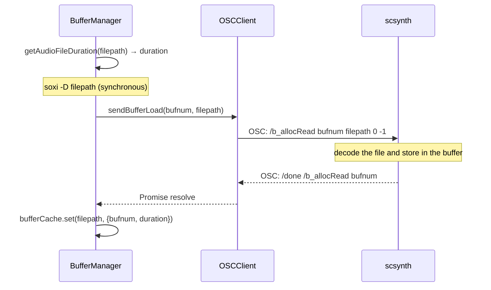
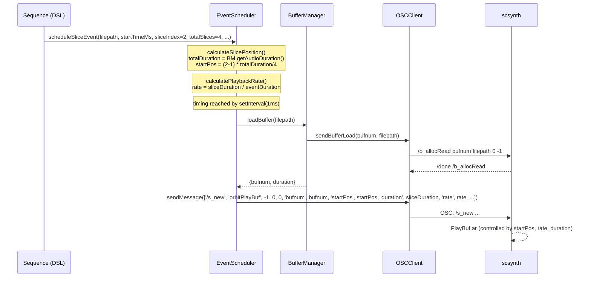

> **Note**: This page is a trace of the author's reading as of 2026-05-05. The code is the truth; this page is merely a snapshot of understanding at that point in time.

# III-2. Audio File Playback

When OrbitScore plays an audio file, it cannot just "hand the file as-is to SuperCollider." scsynth needs to load the file into its own buffer space before playback. This chapter looks in order at **buffer cache management by BufferManager**, **duration retrieval using soxi**, **loading via `/b_allocRead`**, and **the slice playback logic of the `orbitPlayBuf` SynthDef**.

## What is a Buffer

scsynth has an internal buffer space. A buffer is identified by an integer `bufnum` and holds the decoded samples of an audio file. UGens (Unit Generators) such as `PlayBuf.ar` reference the buffer for playback. On the engine side, the mapping "filepath → bufnum" is managed by `BufferManager`.

## The Structure of BufferManager

`BufferManager` is a simple design. Let's look at its fields.

```typescript
// buffer-manager.ts:11-15
export class BufferManager {
  private bufferCache: Map<string, BufferInfo> = new Map()
  private bufferDurations: Map<number, number> = new Map()
  private nextBufnum = 0
```

There are three fields.

- **`bufferCache`**: a `filepath → BufferInfo` map. A cache to prevent double-loading of the same file
- **`bufferDurations`**: a `bufnum → duration(seconds)` map. Used for slice calculations
- **`nextBufnum`**: a monotonically increasing counter starting from 0. It is just `nextBufnum++`; numbers from released buffers are not reused

The `BufferInfo` type is as follows.

```typescript
// types.ts:5-8
export interface BufferInfo {
  bufnum: number
  duration: number
}
```

### Cache Logic

`loadBuffer()` first checks the cache.

```typescript
// buffer-manager.ts:21-46
async loadBuffer(filepath: string): Promise<BufferInfo> {
    if (this.bufferCache.has(filepath)) {
      return this.bufferCache.get(filepath)!
    }

    const bufnum = this.nextBufnum++

    // Get duration from audio file using sox before loading into SuperCollider
    const duration = this.getAudioFileDuration(filepath)

    // Wait for SuperCollider to complete buffer loading (/done message)
    await this.oscClient.sendBufferLoad(bufnum, filepath)

    const bufferInfo: BufferInfo = { bufnum, duration }
    this.bufferCache.set(filepath, bufferInfo)
    this.bufferDurations.set(bufnum, duration)

    // Only log in debug mode
    if (process.env.ORBITSCORE_DEBUG) {
      console.log(
        `📦 Loaded buffer ${bufnum} (${path.basename(filepath)}): ${duration.toFixed(3)}s`,
      )
    }

    return bufferInfo
  }
```

When the same file is requested a second or later time, instead of sending `/b_allocRead` to scsynth it returns immediately from the cache. This is an important optimization in live coding. If buffers were loaded on every loop of a pattern, latency would accumulate.

What is worth noting is the order of duration retrieval (`getAudioFileDuration`) and buffer loading (`sendBufferLoad`). **The duration is fetched with soxi first, then the buffer is loaded into scsynth**. Why this order? Because the duration is used in `scheduleSliceEvent` (chop) for slice position calculations, so it must be known before buffer loading completes.

### Format Support

The audio formats OrbitScore supports depend on libsndfile, which scsynth uses for buffer loading. The support range of `libsndfile.dylib` bundled in the `.vsix` becomes the de facto supported format list.

> NOTE: unverified — for WAV / AIFF, libsndfile's standard support can be confirmed, but MP3 / MP4 depend on libsndfile's build options and version. The specific version of the bundled `libsndfile.dylib` (about 4.9 MB) and whether it includes MP3 support need separate confirmation.

## Duration via soxi: A Code Path Independent of scsynth

Duration retrieval does not go through SuperCollider; it directly invokes the `soxi` command (part of the sox toolchain).

```typescript
// buffer-manager.ts:52-74
private getAudioFileDuration(filepath: string): number {
    try {
      // Use execFileSync with separate arguments to prevent command injection
      // Suppress soxi warnings by redirecting stderr to /dev/null
      const output = execFileSync('soxi', ['-D', filepath], {
        encoding: 'utf8',
        stdio: ['pipe', 'pipe', 'ignore'], // Ignore stderr to suppress warnings
      })
      const duration = parseFloat(output.trim())

      if (isNaN(duration) || duration <= 0) {
        console.warn(`⚠️  Invalid duration from sox for ${filepath}, using default 0.3s`)
        return 0.3
      }

      return duration
    } catch (error: any) {
      console.warn(
        `⚠️  Failed to get duration for ${filepath}: ${error.message}, using default 0.3s`,
      )
      return 0.3
    }
  }
```

It runs `soxi -D <filepath>` synchronously. `-D` is the option that returns duration in seconds. By passing arguments as an array, the call is made safely.

The `ignore` in `stdio: ['pipe', 'pipe', 'ignore']` discards stderr. soxi may emit warnings for some formats; this avoids letting them get in the way.

On failure, it returns `0.3` seconds as a default value. This is a fallback value assuming a drum sample. Even if duration cannot be obtained, scsynth's buffer loading and playback still work, so this functions as graceful degradation.

## Buffer Loading: Waiting for `/b_allocRead` and `/done`

Once duration is obtained, the buffer is loaded into scsynth. This is performed via `OSCClient.sendBufferLoad()`, which uses the callAndResponse pattern (for details, see [III-1. Communication with SuperCollider](/en/audio/supercollider) §The callAndResponse Pattern) to wait for `/done`.



## The `orbitPlayBuf` SynthDef: the Recipe for Playback

The audio processing definition that plays back a buffer in scsynth is the `orbitPlayBuf` SynthDef. Reading the sclang code in `setup.scd` reveals its structure.

```supercollider
// packages/engine/supercollider/setup.scd:16-58 (writeDefFile line omitted)
SynthDef(\orbitPlayBuf, {
    arg out = 0, bufnum = 0, rate = 1, amp = 0.5, pan = 0, 
        startPos = 0,      // 開始位置（秒）
        duration = 0;      // 再生時間（秒、0 = 全体）
    
    var sig, env, actualDuration, fadeIn, fadeOut, sustain;
    
    // 実際の再生時間を計算（0なら全体、それ以外なら指定された時間）
    actualDuration = Select.kr(duration > 0, [
        BufDur.kr(bufnum) - startPos,  // duration <= 0 の場合
        duration                         // duration > 0 の場合
    ]);
    
    // バッファから再生
    sig = PlayBuf.ar(
        numChannels: 1,
        bufnum: bufnum,
        rate: rate * BufRateScale.kr(bufnum),
        trigger: 1,
        startPos: startPos * BufSampleRate.kr(bufnum),
        loop: 0,
        doneAction: 0  // duration制御はエンベロープで行う
    );
    
    // エンベロープで再生時間を制御（クリック音防止のためフェードアウト）
    // フェード時間を再生時間に応じて調整（短い音ほど短いフェード）
    // アタック感を保つためフェードインなし、フェードアウトのみ
    fadeIn = 0;  // フェードインなし
    fadeOut = min(0.008, actualDuration * 0.04);  // 再生時間の4%、最大8ms
    sustain = max(0, actualDuration - fadeOut);
    
    env = EnvGen.kr(
        Env.linen(fadeIn, sustain, fadeOut),
        doneAction: 2  // 再生終了後にシンセを自動削除
    );
    
    sig = sig * env;
    
    // ステレオ化してパン
    sig = Pan2.ar(sig, pan, amp);
    
    // 出力
    Out.ar(out, sig);
// ...
```

### `PlayBuf`'s `rate` and `BufRateScale`

The `rate: rate * BufRateScale.kr(bufnum)` part determines the playback speed.

`BufRateScale.kr(bufnum)` returns the ratio of the buffer's sample rate to scsynth's server sample rate. For example, if the buffer is 44100 Hz and scsynth runs at 48000 Hz, `BufRateScale` becomes `44100/48000 ≈ 0.918`. Multiplying by it allows playback at the correct tempo without changing pitch.

The `rate` argument (the value passed from the engine) is 1.0 for normal speed, 2.0 for double speed, and 0.5 for half speed. Importantly, **this `rate` change couples pitch and speed**. Doubling the rate raises the pitch by one octave. It is not time-stretching (changing speed only while preserving pitch).

### `startPos` Unit Conversion

There is a conversion `startPos: startPos * BufSampleRate.kr(bufnum)`. The `startPos` passed from the engine is **in seconds**, while the `startPos` argument of `PlayBuf.ar` requires **a sample count**. Multiplying by `BufSampleRate.kr(bufnum)` (the buffer's sample rate) performs the unit conversion.

### Envelope and Fade-out

To control playback duration via the `duration` argument, an envelope is used.

$$\text{fadeOut} = \min(0.008, \text{actualDuration} \times 0.04)$$

The fade-out time is the smaller of "4% of the playback duration" and "8 ms." This is consideration to prevent click noise (the noise produced when sound is cut off abruptly). Fade-in is set to zero to preserve the attack feel.

The combination of `PlayBuf.ar`'s `doneAction: 0` (do not auto-release the synth on playback completion) and `EnvGen.kr`'s `doneAction: 2` (auto-release the synth on envelope completion) means the synth is released by the envelope's completion rather than by the buffer's playback completion. This makes cut control by `duration` work correctly.

## Slice Playback: How the chop Method Works

The `chop` DSL method splits the audio file equally and plays slices. Supporting this is the slice calculation logic of `EventScheduler`.

### Slice Position Calculation

```typescript
// event-scheduler.ts:53-71
private calculateSlicePosition(
    filepath: string,
    sliceIndex: number,
    totalSlices: number,
  ): { sliceDuration: number; startPos: number; totalDuration: number } {
    const totalDuration = this.bufferManager.getAudioDuration(filepath)
    const sliceDuration = totalDuration / totalSlices
    // sliceIndex is 1-based from DSL, convert to 0-based
    const startPos = (sliceIndex - 1) * sliceDuration

    // Debug log for slice positioning (only in debug mode)
    if (process.env.ORBITSCORE_DEBUG) {
      console.log(
        `🔍 Slice debug: filepath=${filepath}, duration=${totalDuration}, sliceIndex=${sliceIndex}, totalSlices=${totalSlices}, sliceDuration=${sliceDuration}, startPos=${startPos}`,
      )
    }

    return { sliceDuration, startPos, totalDuration }
  }
```

Because `sliceIndex` is passed 1-based from the DSL side, it is converted to 0-based as `(sliceIndex - 1) * sliceDuration`. For example, the second slice when divided into 4 is `startPos = 1 * (totalDuration / 4)`.

### Playback Rate Calculation

```typescript
// event-scheduler.ts:77-86
private calculatePlaybackRate(
    sliceDurationSec: number,
    eventDurationMs: number | undefined,
  ): number {
    if (!eventDurationMs || eventDurationMs <= 0) {
      return 1.0
    }
    return (sliceDurationSec * 1000) / eventDurationMs
  }
```

To fit the slice into the specified beat grid, the rate is calculated dynamically.

$$\text{rate} = \frac{\text{sliceDuration(ms)}}{\text{eventDuration(ms)}}$$

If a slice is 500 ms and the event duration is 250 ms, then `rate = 2.0` (double-speed playback). This makes it possible to align audio files of different lengths into an even grid. As mentioned earlier, pitch also changes; in chop patterns, rhythmic alignment is prioritized over pitch, hence this implementation.

### Parameter Assembly in scheduleSliceEvent

```typescript
// event-scheduler.ts:107-138
scheduleSliceEvent(
    filepath: string,
    startTimeMs: number,
    sliceIndex: number,
    totalSlices: number,
    eventDurationMs: number | undefined,
    gainDb = 0,
    pan = 0,
    sequenceName = '',
  ): void {
    const { sliceDuration, startPos } = this.calculateSlicePosition(
      filepath,
      sliceIndex,
      totalSlices,
    )
    const rate = this.calculatePlaybackRate(sliceDuration, eventDurationMs)

    const play: ScheduledPlay = {
      time: startTimeMs,
      filepath,
      options: {
        gainDb,
        pan,
        startPos,
        duration: sliceDuration,
        rate,
      },
      sequenceName,
    }

    this.addToScheduledPlays(play)
  }
```

The computed `startPos`, `duration`, and `rate` are stored in `ScheduledPlay.options`, and when dispatched on the timeline, they reach scsynth as arguments to `/s_new` via `sendPlaybackMessage()`.

### The Big Picture of Slice Playback



## Related Terms

- [Buffer (SC)](/en/glossary#buffer-sc) — the audio memory area on scsynth managed by `BufferManager`. Identified by `bufnum`
- [orbitPlayBuf](/en/glossary#orbitplaybuf) — the dedicated SynthDef that plays a buffer. Takes `startPos` / `duration` / `rate` / `pan` / `amp` as arguments
- [chop](/en/glossary#chop) — the DSL `seq.chop(N)` method. The slice splitting feature explained in this chapter
- [play pattern](/en/glossary#play-pattern) — the sequence of slice indices specified by `seq.play(1, 0, 1, 0)`
- [OSC (Open Sound Control)](/en/glossary#osc-open-sound-control) — the communication protocol that sends `/b_allocRead` and `/s_new` to scsynth
- [scsynth](/en/glossary#scsynth) — the server binary that holds buffers and outputs audio
- [UGen (Unit Generator)](/en/glossary#ugen-unit-generator) — the processing units inside `orbitPlayBuf` such as `PlayBuf` / `BufRateScale` / `EnvGen` / `Pan2`

## Related ADRs

- [ADR-001 Choosing SuperCollider as the Implementation Base](/en/decisions/adr-001-supercollider) — the background of adopting the playback architecture of Buffer + SynthDef + `/s_new`
- [ADR-003 scsynth Bundle Strict Mode](/en/decisions/adr-003-scsynth-bundle) — the decision to include `libsndfile.dylib` in the bundle (the basis for format support)

## Next Exploration Candidates

- **Confirming format support**: the version of the bundled `libsndfile.dylib` and the formats it can actually decode (especially MP3/MP4)
- **soxi dependency management**: a fallback strategy in environments where soxi is missing. It works with the default duration of 0.3 s, but this affects the precision of chop
- **Buffer cache lifetime**: the cache is held until process termination and is not released unless `clearCache()` or `removeBuffer()` is called. The impact of memory growth depending on session length
- **The relationship between `rate` and pitch**: `rate = 2.0` raises pitch by one octave. Implementation choices when speed change without pitch change is needed (such as SuperCollider's PVS-family UGens)
- **Support for stereo files**: `PlayBuf.ar(numChannels: 1, ...)` assumes mono. The behavior of scsynth when a stereo file is passed

## Sources

- `packages/engine/src/audio/supercollider/buffer-manager.ts:11-46` — `BufferManager` class definition, `loadBuffer()` cache logic and processing order
- `packages/engine/src/audio/supercollider/buffer-manager.ts:52-74` — `getAudioFileDuration()`: soxi invocation and fallback value
- `packages/engine/src/audio/supercollider/buffer-manager.ts:79-86` — `getAudioDuration()`: duration retrieval from cache
- `packages/engine/src/audio/supercollider/types.ts:5-8` — `BufferInfo` type definition
- `packages/engine/src/audio/supercollider/types.ts:10-21` — `ScheduledPlay` type: gainDb / pan / startPos / duration / rate fields of options
- `packages/engine/src/audio/supercollider/event-scheduler.ts:53-71` — `calculateSlicePosition()`: 1-based → 0-based conversion and startPos calculation
- `packages/engine/src/audio/supercollider/event-scheduler.ts:77-86` — `calculatePlaybackRate()`: rate calculation to fit a slice into the event duration
- `packages/engine/src/audio/supercollider/event-scheduler.ts:107-138` — `scheduleSliceEvent()`: assembling slice parameters and adding to the queue
- `packages/engine/src/audio/supercollider/osc-client.ts:65-74` — `sendBufferLoad()`: `/b_allocRead` and callAndResponse
- `packages/engine/supercollider/setup.scd:16-58` — entire `orbitPlayBuf` SynthDef: PlayBuf, BufRateScale, startPos unit conversion, envelope, doneAction (writeDefFile line omitted)
- `packages/vscode-extension/BUILD_GUIDE.md:71-82` — size and composition of `libsndfile.dylib` included in the bundle
- [SuperCollider Server Command Reference](https://doc.sccode.org/Reference/Server-Command-Reference.html) §Buffer Commands — argument definitions for `/b_allocRead`
