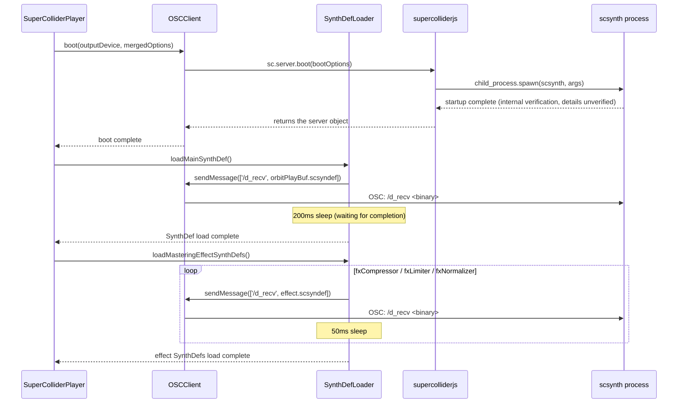
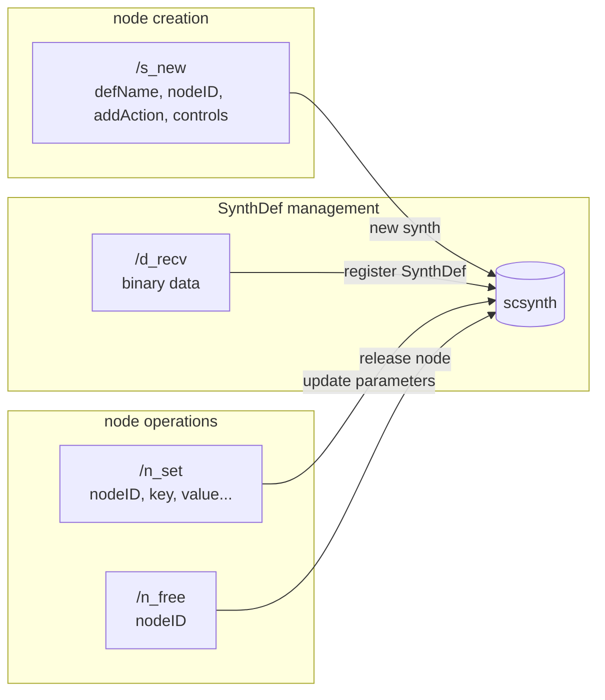

> **Note**: This page is a trace of the author's reading as of 2026-05-05. The code is the truth; this page is merely a snapshot of understanding at that point in time.

# III-1. Communication with SuperCollider

In [0-2. Architecture Overview](/en/orientation/architecture-overview), we surveyed the fact that the engine and scsynth communicate over OSC over UDP, and that `EventScheduler` sends `/s_new`. This chapter goes one level deeper to follow in detail the three phases of "from boot to producing sound." In particular, it focuses on the paths not covered in the spike chapter: SynthDef loading via `/d_recv`, the callAndResponse pattern of `/b_allocRead`, and effect control via `/n_set` / `/n_free`.

## What is the OSC Protocol

OSC (Open Sound Control) is a binary message protocol designed for music and audio applications. It runs over UDP and has the structure of an address pattern (e.g., `/s_new`), type tags, and an argument list. The SuperCollider server (scsynth) listens on UDP port 57110 by default and accepts the set of commands defined in the [SuperCollider Server Command Reference](https://doc.sccode.org/Reference/Server-Command-Reference.html).

OrbitScore uses the `supercolliderjs` library as an intermediary, leaving raw OSC binary assembly and UDP socket management to supercolliderjs. The engine-side code only calls a thin interface like `this.server.send.msg(message)`.

## Boot Phase: From scsynth Startup to SynthDef Loading

When the engine starts up, `SuperColliderPlayer.boot()` does two things: **starting the scsynth process** and **loading SynthDefs**.

```typescript
// supercollider-player.ts:38-50
async boot(outputDevice?: string, options?: BootOptions): Promise<void> {
    const mergedOptions: BootOptions = { ...options }
    if (!mergedOptions.scsynth) {
      const resolution = resolveScsynthPath()
      mergedOptions.scsynth = resolution.path
      if (process.env.ORBITSCORE_DEBUG) {
        console.log(`🔍 scsynth resolved via ${resolution.source}: ${resolution.path}`)
      }
    }
    await this.oscClient.boot(outputDevice, mergedOptions)
    await this.synthDefLoader.loadMainSynthDef()
    await this.synthDefLoader.loadMasteringEffectSynthDefs()
  }
```

`resolveScsynthPath()` only resolves the path of the scsynth binary; what actually starts scsynth is `this.oscClient.boot()` (the details of path resolution are covered in [III-3. scsynth Bundle and Path Resolution](/en/audio/scsynth-bundle)).

### Inside OSCClient.boot()

`OSCClient.boot()` starts scsynth. Let's look at the implementation.

```typescript
// osc-client.ts:21-50
async boot(outputDevice?: string, options?: BootOptions): Promise<void> {
    console.log('🎵 Booting SuperCollider server...')

    const bootOptions: any = {
      debug: false,
      ...options,
    }

    if (!bootOptions.scsynth) {
      throw new Error(
        'OSCClient.boot: BootOptions.scsynth is required. Caller must resolve scsynth path (see scsynth-resolver.ts).',
      )
    }

    // Set output device if specified (by name)
    // device maps to scsynth -H flag, numInputBusChannels maps to -i flag
    // Output-only devices (e.g. "外部") need -i 0 to disable input channels
    // Note: supercolliderjs args() only accepts string values (_.isString check)
    if (outputDevice) {
      bootOptions.device = outputDevice
      bootOptions.numInputBusChannels = '0'
      this.currentOutputDevice = outputDevice
      console.log(`🔊 Using output device: ${outputDevice}`)
    }

    // @ts-expect-error - supercolliderjs types are incomplete
    this.server = await sc.server.boot(bootOptions)

    console.log('✅ SuperCollider server ready')
  }
```

What is worth noting here is the `@ts-expect-error` comment. Because the TypeScript type definitions of `supercolliderjs` are incomplete, the call is made while suppressing the type error. `sc.server.boot()` makes supercolliderjs `child_process.spawn` the scsynth process and waits until startup is confirmed. The returned `this.server` object becomes the gateway for all subsequent OSC communication.

> NOTE: unverified — the details of the OSC commands (such as `/status`) that supercolliderjs uses to confirm startup have not been verified by directly examining the supercolliderjs source. The internals require separate investigation.

Also, when an output device is specified, `device` (corresponding to scsynth's `-H` flag) and `numInputBusChannels: '0'` (equivalent to scsynth's `-i 0`) are added. The string `'0'` may feel a little odd, but it is because supercolliderjs's internal implementation does an `_.isString` check, so it must be passed as a string rather than a number.

### Loading SynthDefs: the `/d_recv` Command

Once scsynth has started, the next step is to load SynthDefs. A SynthDef (Synthesis Definition) is SuperCollider's audio processing recipe, pre-compiled into the `.scsyndef` binary format. OrbitScore ships `.scsyndef` files generated by running `setup.scd` with sclang.

`SynthDefLoader.loadMainSynthDef()` reads this `.scsyndef` file and sends it to scsynth via the `/d_recv` OSC command.

```typescript
// synthdef-loader.ts:27-39
async loadMainSynthDef(): Promise<void> {
    if (!this.oscClient.isRunning()) {
      throw new Error('SuperCollider server not running')
    }

    const synthDefData = fs.readFileSync(this.synthDefPath)
    await this.oscClient.sendMessage(['/d_recv', synthDefData])

    // Wait for SynthDef to be ready
    await new Promise((resolve) => setTimeout(resolve, 200))

    console.log('✅ SynthDef loaded')
  }
```

`sendMessage(['/d_recv', synthDefData])` corresponds to the `/d_recv` command in the SuperCollider Server Command Reference. The argument is binary data (Buffer).

What is interesting here is that a 200 ms wait of `setTimeout(resolve, 200)` is inserted after `/d_recv`. While `/b_allocRead` (buffer load) waits for `/done` via `callAndResponse` (described later), `/d_recv` is harder to use with asynchronous completion notifications, so a fixed 200 ms sleep is used as a substitute.

> NOTE: unverified — whether `/d_recv` returns a `/done` response may depend on the SuperCollider version. The current implementation handles it with a fixed sleep; whether it can be migrated to callAndResponse needs to be confirmed.

Mastering effect SynthDefs are loaded with the same flow.

```typescript
// synthdef-loader.ts:44-61
async loadMasteringEffectSynthDefs(): Promise<void> {
    if (!this.oscClient.isRunning()) {
      return
    }

    const synthDefDir = path.join(__dirname, '../../../supercollider/synthdefs')
    const effectSynthDefs = ['fxCompressor', 'fxLimiter', 'fxNormalizer']

    for (const synthDefName of effectSynthDefs) {
      const synthDefPath = path.join(synthDefDir, `${synthDefName}.scsyndef`)
      if (fs.existsSync(synthDefPath)) {
        const synthDefData = fs.readFileSync(synthDefPath)
        await this.oscClient.sendMessage(['/d_recv', synthDefData])
        await new Promise((resolve) => setTimeout(resolve, 50))
      }
    }

    console.log('✅ Mastering effect SynthDefs loaded')
  }
```

The effect SynthDefs are loaded sequentially with a 50 ms wait each. Because the loop loads them serially, three of them take at least 150 ms.

### The Big Picture of the Boot Sequence



## Playback Phase: Creating a Synth with `/s_new`

Against scsynth that already has a SynthDef loaded, a synth instance is created with the `/s_new` command on each playback. `EventScheduler.sendPlaybackMessage()` handles this.

```typescript
// event-scheduler.ts:307-335
private async sendPlaybackMessage(
    bufnum: number,
    amplitude: number,
    options: PlaybackOptions,
  ): Promise<void> {
    const pan = options.pan !== undefined ? options.pan / 100 : 0.0 // -100..100 -> -1.0..1.0
    const startPos = options.startPos ?? 0
    const duration = options.duration ?? 0
    const rate = options.rate ?? 1.0

    await this.oscClient.sendMessage([
      '/s_new',
      'orbitPlayBuf',
      -1,
      0,
      0,
      'bufnum',
      bufnum,
      'amp',
      amplitude,
      'pan',
      pan,
      'rate',
      rate,
      'startPos',
      startPos,
      'duration',
      duration,
    ])
  }
```

The argument layout for `/s_new` is defined in the SuperCollider Server Command Reference, in the form `['/s_new', defName, nodeID, addAction, targetNodeID, ...controls]`.

- **`defName`**: `'orbitPlayBuf'` — the name of the loaded SynthDef
- **`nodeID`**: `-1` — let scsynth auto-assign a node ID
- **`addAction`**: `0` — add to head (`addToHead`)
- **`targetNodeID`**: `0` — place into the root group (group 0)
- After that: `key, value` pairs to set controls (`bufnum`, `amp`, `pan`, `rate`, `startPos`, `duration`)

When `nodeID = -1` is specified, scsynth assigns and manages a unique node ID. Because the synth is automatically released by scsynth on playback completion via `doneAction: 2` inside the SynthDef, there is no need for the engine to send `/n_free` (which is different from effect control described later).

### sendMessage Implementation

```typescript
// osc-client.ts:55-60
async sendMessage(message: any[]): Promise<void> {
    if (!this.server) {
      throw new Error('SuperCollider server not running')
    }
    await this.server.send.msg(message)
  }
```

`this.server.send.msg(message)` is supercolliderjs's API and sends the OSC message to scsynth via UDP. Although it is `await`ed, it does not wait for an ACK response from scsynth — closer to fire-and-forget.

> NOTE: unverified — what `await this.server.send.msg(message)` is actually waiting for internally (whether enqueueing into a send queue, or the UDP send itself) has not been confirmed in the supercolliderjs source.

## Effect Control Phase: `/n_set` and `/n_free`

Mastering effects (Compressor / Limiter / Normalizer), unlike playback nodes, **explicitly manage their lifecycles**. `SynthDefLoader.addEffect()` decides whether it is a new creation or an existing update and sends the appropriate command.

### Updating an Existing Effect: `/n_set`

If the effect already exists, only the parameters are changed.

```typescript
// synthdef-loader.ts:102-111
if (existingSynthId !== undefined) {
        // Update existing effect parameters
        const setParams: any[] = ['/n_set', existingSynthId]

        Object.entries(params).forEach(([key, value]) => {
          setParams.push(key, value)
        })

        await this.oscClient.sendMessage(setParams)
        console.log(`✅ ${effectType} updated`)
      }
```

`/n_set` changes the control parameters of an existing node. Arguments are passed in the form `['/n_set', nodeID, key1, value1, key2, value2, ...]`.

### Creating a New Effect: `/s_new`

If the effect does not exist, it is newly created with `/s_new`.

```typescript
// synthdef-loader.ts:112-133
} else {
        // Create new effect synth with monotonically increasing ID
        const synthId = this.nextSynthId++
        const createParams: any[] = [
          '/s_new',
          synthDefName,
          synthId,
          1, // addToTail
          0, // target
        ]

        Object.entries(params).forEach(([key, value]) => {
          createParams.push(key, value)
        })

        await this.oscClient.sendMessage(createParams)

        // Store synth ID by effect type
        targetEffects.set(effectType, synthId)

        console.log(`✅ ${effectType} created (ID: ${synthId})`)
      }
```

Notice the differences from the playback node. Effect nodes:

- **`nodeID`**: `this.nextSynthId++` — an explicit ID that monotonically increases from 2000 (`private nextSynthId = 2000`)
- **`addAction`**: `1` — `addToTail` (added to the tail of the group, i.e., processed after playback)
- The ID is stored in the `effectSynths` Map, retained for updates and removals

### Removing an Effect: `/n_free`

```typescript
// synthdef-loader.ts:152-160 (catch block and outer if/closing brace omitted)
          await this.oscClient.sendMessage(['/n_free', synthId])
          targetEffects.delete(effectType)
          console.log(`✅ ${effectType} removed (ID: ${synthId})`)
          // ...
```

`/n_free` releases the node immediately. When an effect placed via `addToTail` is removed, the insertion into the master output is undone.

### Summary of the Three OSC Commands



## The callAndResponse Pattern: `/b_allocRead`

Most OSC messages are fire-and-forget, but buffer loading is different. Let's look at `OSCClient.sendBufferLoad()`.

```typescript
// osc-client.ts:65-74
async sendBufferLoad(bufnum: number, filepath: string): Promise<void> {
    if (!this.server) {
      throw new Error('SuperCollider server not running')
    }
    // Use callAndResponse to wait for /done message
    await this.server.callAndResponse({
      call: ['/b_allocRead', bufnum, filepath, 0, -1],
      response: ['/done', '/b_allocRead', bufnum],
    })
  }
```

`callAndResponse` is a supercolliderjs API; it sends the `call` and waits the Promise until the `response` arrives. scsynth, on completion of buffer loading, returns `/done /b_allocRead <bufnum>`.

The arguments of `/b_allocRead` are `[bufnum, path, startFrame, numFrames]`; `startFrame = 0`, `numFrames = -1` means "all frames from the start."

This callAndResponse pattern is important because **if `/s_new` is sent before buffer loading completes, scsynth cannot find the buffer and produces silence**. By doing `await this.oscClient.sendBufferLoad(...)` in `BufferManager.loadBuffer()`, completion is guaranteed before proceeding to playback.

## Related Terms

- [scsynth](/en/glossary#scsynth) — the protagonist of this chapter. The audio server binary that OrbitScore starts via `child_process.spawn`
- [OSC (Open Sound Control)](/en/glossary#osc-open-sound-control) — the communication protocol between engine and scsynth. `/d_recv` / `/s_new` / `/n_set` / `/n_free` / `/b_allocRead` are all OSC
- [SynthDef (SC)](/en/glossary#synthdef-sc) — the audio processing definition loaded with `/d_recv`. The four are `orbitPlayBuf` / `fxCompressor` / `fxLimiter` / `fxNormalizer`
- [orbitPlayBuf](/en/glossary#orbitplaybuf) — OrbitScore's dedicated SynthDef. Instantiated and played via `/s_new`
- [UGen (Unit Generator)](/en/glossary#ugen-unit-generator) — the basic processing unit that composes a SynthDef. `PlayBuf` / `Pan2` / `EnvGen`, etc.
- [Buffer (SC)](/en/glossary#buffer-sc) — the audio memory area on scsynth loaded by `/b_allocRead`
- [bundle (scsynth source)](/en/glossary#bundle-scsynth-source) — the scsynth binary bundled in the `.vsix`. Referenced by `bundleCandidatePath()`

## Related ADRs

- [ADR-001 Choosing SuperCollider as the Implementation Base](/en/decisions/adr-001-supercollider) — the decision behind why scsynth was adopted (sox 140-150ms → 0-8ms achieved)
- [ADR-003 scsynth Bundle Strict Mode](/en/decisions/adr-003-scsynth-bundle) — the background of bundling into the `.vsix` and removing the SC.app fallback

## Next Exploration Candidates

- **supercolliderjs internals**: how does `sc.server.boot()` spawn scsynth and verify `/status`? Trace the supercolliderjs source
- **`/d_recv` completion notification**: the SuperCollider docs say `/done` is returned for `/d_recv`, but the current implementation uses a 200 ms fixed sleep. Confirm whether migration to callAndResponse is possible
- **The precision of `setInterval(1ms)`**: Node.js's `setInterval` does not guarantee 1 ms. The impact of actual drift characteristics on sound timing precision
- **`addToTail` vs `addToHead`**: the structural meaning of effects being `addToTail` while playback nodes are `addToHead`. The relationship to scsynth's signal graph
- **`/n_free` vs `doneAction: 2`**: playback nodes are auto-released via `doneAction: 2` inside the SynthDef, while effect nodes are explicitly released via `/n_free` from the engine. The design rationale for this asymmetry

## Sources

- `packages/engine/src/audio/supercollider/osc-client.ts:21-50` — `OSCClient.boot()`: bootOptions assembly and `sc.server.boot()` call
- `packages/engine/src/audio/supercollider/osc-client.ts:55-60` — `sendMessage()`: OSC send via `this.server.send.msg(message)`
- `packages/engine/src/audio/supercollider/osc-client.ts:65-74` — `sendBufferLoad()`: pattern of waiting `/done` with `callAndResponse`
- `packages/engine/src/audio/supercollider-player.ts:38-50` — `SuperColliderPlayer.boot()`: three steps of scsynth resolution → boot → SynthDef loading
- `packages/engine/src/audio/supercollider/synthdef-loader.ts:27-39` — `loadMainSynthDef()`: `/d_recv` + 200 ms sleep
- `packages/engine/src/audio/supercollider/synthdef-loader.ts:44-61` — `loadMasteringEffectSynthDefs()`: load effect SynthDefs at 50 ms intervals
- `packages/engine/src/audio/supercollider/synthdef-loader.ts:102-133` — `addEffect()`: branch between `/n_set` (update) and `/s_new` addToTail (new)
- `packages/engine/src/audio/supercollider/synthdef-loader.ts:152-160` — `removeEffect()`: release node with `/n_free`
- `packages/engine/src/audio/supercollider/event-scheduler.ts:307-335` — `sendPlaybackMessage()`: argument layout of `/s_new orbitPlayBuf`
- `packages/engine/src/audio/supercollider/types.ts:42-46` — `BootOptions` type: `scsynth`, `debug`, `device` fields
- `packages/engine/supercollider/setup.scd:16-59` — sclang definition of the `orbitPlayBuf` SynthDef (auto-release via doneAction: 2)
- [SuperCollider Server Command Reference](https://doc.sccode.org/Reference/Server-Command-Reference.html) §Synth Commands — specification of `/s_new`, `/n_set`, `/n_free`, `/d_recv`, `/b_allocRead`
