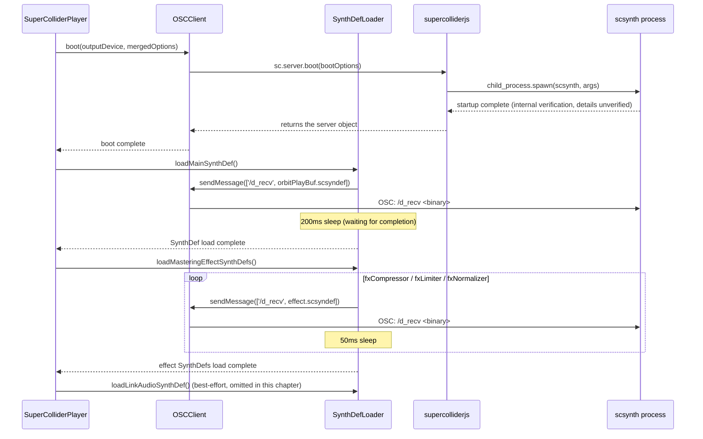
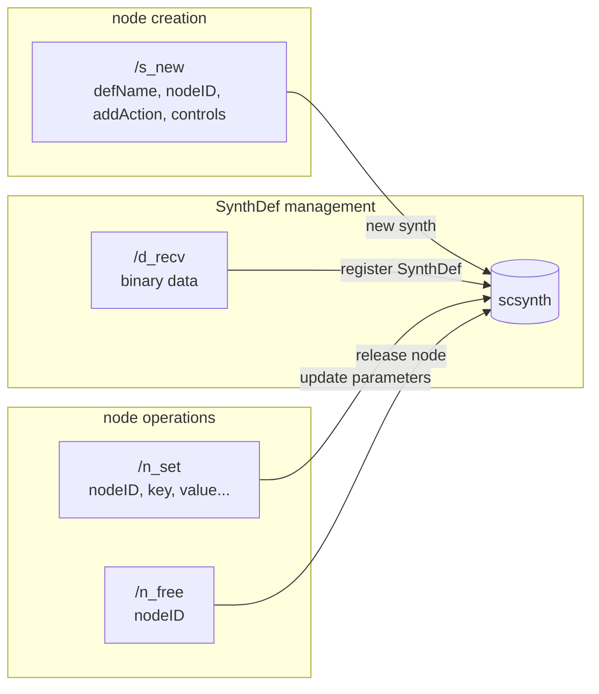

> **Note**: This page is a trace of the author's reading as of 2026-09-01. The code is the truth; this page is only a snapshot of understanding at that time.

::: warning Status as of 2026-09
The SuperCollider (scsynth / OSC) path this chapter follows is **no longer the default audio backend** since cutover #108 on 2026-07-03 (`docs/archive/WORK_LOG_2026-07.md` §6.179). `createAudioEngine()` returns `SuperColliderPlayer` only when `ORBITSCORE_ENGINE=sc` (or `supercollider`) is set explicitly; when unset it picks the Rust `orbit-audio-daemon` (`RustEnginePlayer`). In other words, this chapter describes the **opt-out path**. The code still lives under `packages/engine/src/audio/supercollider/`, and every citation in this chapter matches the real code at 69dc968, but read it as historical reading. For the default path, see [RE-1. Daemon Architecture Overview](/en/rust-engine/).

```typescript
// packages/engine/src/audio/create-audio-engine.ts:17-36
export function createAudioEngine(env: NodeJS.ProcessEnv = process.env): AudioEngineBackend {
  const raw = env[ENGINE_ENV_VAR]
  if (resolveEngineKind(raw) === 'supercollider') {
    console.log(`🎛️ [engine] using SuperCollider backend (opt-out via ORBITSCORE_ENGINE=${raw})`)
    return new SuperColliderPlayer()
  }
  // ...
  const source = normalized === '' ? 'default since cutover #108' : `ORBITSCORE_ENGINE=${raw}`
  console.log(`🦀 [engine] using rust orbit-audio-daemon backend (${source})`)
  return new RustEnginePlayer()
}
```

```typescript
// packages/engine/src/audio/engine-backend.ts:67-70
export function resolveEngineKind(raw: string | undefined): EngineKind {
  const v = raw?.trim().toLowerCase()
  return v === 'sc' || v === 'supercollider' ? 'supercollider' : 'rust'
}
```
:::

# III-1. Communication with SuperCollider

In [0-2. Architecture Overview](/en/orientation/architecture-overview), we surveyed the fact that, when the SC path is selected, the engine and scsynth communicate over OSC over UDP, and that `EventScheduler` sends `/s_new`. This chapter goes one level deeper to follow in detail the three phases of "from boot to producing sound." In particular, it focuses on the paths not covered in the spike chapter: SynthDef loading via `/d_recv`, the callAndResponse pattern of `/b_allocRead`, and effect control via `/n_set` / `/n_free`.

Both backends share a single contract surface called `AudioEngineBackend`. `SuperColliderPlayer` is one implementation of it, positioned as the sibling of `RustEnginePlayer`.

```typescript
// packages/engine/src/audio/supercollider-player.ts:14-23
/**
 * SuperCollider audio player with low-latency scheduling.
 *
 * `AudioEngineBackend`（Scheduler + AudioEngine 面）を満たす音声バックエンド。
 * `RustEnginePlayer` の sibling。cutover #108 以降、`createAudioEngine()` は
 * `ORBITSCORE_ENGINE=sc`（または `supercollider`）で opt-out したときのみこれを選ぶ
 * （既定は Rust）。`implements` 宣言は契約を型でロックする（interface 変更時に差分を
 * コンパイラが報告する）。
 */
export class SuperColliderPlayer implements AudioEngineBackend {
```

## What is the OSC Protocol

OSC (Open Sound Control) is a binary message protocol designed for music and audio applications. It runs over UDP and has the structure of an address pattern (e.g., `/s_new`), type tags, and an argument list. The SuperCollider server (scsynth) listens on UDP port 57110 by default and accepts the set of commands defined in the [SuperCollider Server Command Reference](https://doc.sccode.org/Reference/Server-Command-Reference.html).

OrbitScore uses the `supercolliderjs` library as an intermediary, leaving raw OSC binary assembly and UDP socket management to supercolliderjs. The engine-side code only calls a thin interface like `this.server.send.msg(message)`.

## Boot Phase: From scsynth Startup to SynthDef Loading

When the engine starts up on the SC path, `SuperColliderPlayer.boot()` does two things: **starting the scsynth process** and **loading SynthDefs**.

```typescript
// packages/engine/src/audio/supercollider-player.ts:45-79 (LinkAudio SynthDef の best-effort ロード部を省略)
  async boot(outputDevice?: string, options?: BootOptions): Promise<void> {
    const mergedOptions: BootOptions = { ...options }
    if (!mergedOptions.scsynth) {
      const resolution = resolveScsynthPath()
      mergedOptions.scsynth = resolution.path
      if (process.env.ORBITSCORE_DEBUG) {
        console.log(`🔍 scsynth resolved via ${resolution.source}: ${resolution.path}`)
      }
    }
    await this.oscClient.boot(outputDevice, mergedOptions)
    await this.synthDefLoader.loadMainSynthDef()
    await this.synthDefLoader.loadMasteringEffectSynthDefs()
    // ...
  }
```

`resolveScsynthPath()` only resolves the path of the scsynth binary; what actually starts scsynth is `this.oscClient.boot()` (the details of path resolution are covered in [III-3. scsynth Bundle and Path Resolution](/en/audio/scsynth-bundle)). The omitted second half loads the `orbitPlayBufLink` SynthDef for LinkAudio (#209) on a best-effort basis; if the `.scsyndef` is absent it sets `setLinkAudioPluginAvailable(false)` and continues hardware-only. This chapter sticks to the hardware path.

### Inside OSCClient.boot()

`OSCClient.boot()` starts scsynth. Let's look at the implementation.

```typescript
// packages/engine/src/audio/supercollider/osc-client.ts:35-64
  async boot(outputDevice?: string, options?: BootOptions): Promise<void> {
    console.log('🎵 Booting SuperCollider server...')

    const bootOptions: any = {
      debug: false,
      ...options,
    }

    if (!bootOptions.scsynth) {
      throw new Error(
        'OSCClient.boot: BootOptions.scsynth is required. Caller must resolve scsynth path (see scsynth-resolver.ts).',
      )
    }

    // Set output device if specified (by name)
    // device maps to scsynth -H flag, numInputBusChannels maps to -i flag
    // Output-only devices (e.g. "外部") need -i 0 to disable input channels
    // Note: supercolliderjs args() only accepts string values (_.isString check)
    if (outputDevice) {
      bootOptions.device = outputDevice
      bootOptions.numInputBusChannels = '0'
      this.currentOutputDevice = outputDevice
      console.log(`🔊 Using output device: ${outputDevice}`)
    }

    // @ts-expect-error - supercolliderjs types are incomplete
    this.server = await sc.server.boot(bootOptions)

    console.log('✅ SuperCollider server ready')
  }
```

What is worth noting here is the `@ts-expect-error` comment. Because the TypeScript type definitions of `supercolliderjs` are incomplete, the call is made while suppressing the type error. `sc.server.boot()` makes supercolliderjs `child_process.spawn` the scsynth process and waits until startup is confirmed. The returned `this.server` object becomes the gateway for all subsequent OSC communication.

> NOTE: unverified — the details of the OSC commands (such as `/status`) that supercolliderjs uses to confirm startup have not been verified by directly examining the supercolliderjs source. The internals require separate investigation.

Also, when an output device is specified, `device` (corresponding to scsynth's `-H` flag) and `numInputBusChannels: '0'` (equivalent to scsynth's `-i 0`) are added. The string `'0'` may feel a little odd, but it is because supercolliderjs's internal implementation does an `_.isString` check, so it must be passed as a string rather than a number.

### Loading SynthDefs: the `/d_recv` Command

Once scsynth has started, the next step is to load SynthDefs. A SynthDef (Synthesis Definition) is SuperCollider's audio processing recipe, pre-compiled into the `.scsyndef` binary format. OrbitScore ships `.scsyndef` files generated by running `setup.scd` with sclang.

`SynthDefLoader.loadMainSynthDef()` reads this `.scsyndef` file and sends it to scsynth via the `/d_recv` OSC command.

```typescript
// packages/engine/src/audio/supercollider/synthdef-loader.ts:45-57
  async loadMainSynthDef(): Promise<void> {
    if (!this.oscClient.isRunning()) {
      throw new Error('SuperCollider server not running')
    }

    const synthDefData = fs.readFileSync(this.synthDefPath)
    await this.oscClient.sendMessage(['/d_recv', synthDefData])

    // Wait for SynthDef to be ready
    await this.sleep(200)

    console.log('✅ SynthDef loaded')
  }
```

`sendMessage(['/d_recv', synthDefData])` corresponds to the `/d_recv` command in the SuperCollider Server Command Reference. The argument is binary data (Buffer).

What is interesting here is that a 200 ms wait of `this.sleep(200)` is inserted after `/d_recv`. While `/b_allocRead` (buffer load) waits for `/done` via `callAndResponse` (described later), `/d_recv` is harder to use with asynchronous completion notifications, so a fixed 200 ms sleep is used as a substitute. This `sleep` is a small helper inside the class, and its comment explains the design trade-off as is.

```typescript
// packages/engine/src/audio/supercollider/synthdef-loader.ts:34-40
  /**
   * `/d_recv` 後にサーバへの SynthDef 反映を待つ固定ディレイ（best-effort）。
   * `d_recv` の完了 OSC を待たない簡易方式のため、各ロード箇所で共有する。
   */
  private sleep(ms: number): Promise<void> {
    return new Promise((resolve) => setTimeout(resolve, ms))
  }
```

> NOTE: unverified — whether `/d_recv` returns a `/done` response may depend on the SuperCollider version. The implementation at 69dc968 handles it with a fixed sleep; whether it can be migrated to callAndResponse needs to be confirmed.

Mastering effect SynthDefs are loaded with the same flow.

```typescript
// packages/engine/src/audio/supercollider/synthdef-loader.ts:105-123
  async loadMasteringEffectSynthDefs(): Promise<void> {
    if (!this.oscClient.isRunning()) {
      return
    }

    const synthDefDir = path.join(__dirname, '../../../supercollider/synthdefs')
    const effectSynthDefs = ['fxCompressor', 'fxLimiter', 'fxNormalizer']

    for (const synthDefName of effectSynthDefs) {
      const synthDefPath = path.join(synthDefDir, `${synthDefName}.scsyndef`)
      if (fs.existsSync(synthDefPath)) {
        const synthDefData = fs.readFileSync(synthDefPath)
        await this.oscClient.sendMessage(['/d_recv', synthDefData])
        await this.sleep(50)
      }
    }

    console.log('✅ Mastering effect SynthDefs loaded')
  }
```

The effect SynthDefs are loaded sequentially with a 50 ms wait each. Because the loop loads them serially, three of them take at least 150 ms.

### The Big Picture of the Boot Sequence


```mermaid
sequenceDiagram
  participant SP as SuperColliderPlayer
  participant OC as OSCClient
  participant SDL as SynthDefLoader
  participant SCjs as supercolliderjs
  participant SC as scsynth process

  SP->>OC: boot(outputDevice, mergedOptions)
  OC->>SCjs: sc.server.boot(bootOptions)
  SCjs->>SC: child_process.spawn(scsynth, args)
  SC-->>SCjs: startup complete (internal verification, details unverified)
  SCjs-->>OC: returns the server object
  OC-->>SP: boot complete

  SP->>SDL: loadMainSynthDef()
  SDL->>OC: sendMessage(['/d_recv', orbitPlayBuf.scsyndef])
  OC->>SC: OSC: /d_recv <binary>
  Note over SDL: 200ms sleep (waiting for completion)
  SDL-->>SP: SynthDef load complete

  SP->>SDL: loadMasteringEffectSynthDefs()
  loop fxCompressor / fxLimiter / fxNormalizer
    SDL->>OC: sendMessage(['/d_recv', effect.scsyndef])
    OC->>SC: OSC: /d_recv <binary>
    Note over SDL: 50ms sleep
  end
  SDL-->>SP: effect SynthDefs load complete

  SP->>SDL: loadLinkAudioSynthDef() (best-effort, omitted in this chapter)
```

## Playback Phase: Creating a Synth with `/s_new`

Against scsynth that already has a SynthDef loaded, a synth instance is created with the `/s_new` command on each playback. `EventScheduler.sendPlaybackMessage()` handles this. The SynthDef names are kept as constants to prevent typos.

```typescript
// packages/engine/src/audio/supercollider/event-scheduler.ts:17-18
const SYNTHDEF_HARDWARE = 'orbitPlayBuf'
const SYNTHDEF_LINK = 'orbitPlayBufLink'
```

```typescript
// packages/engine/src/audio/supercollider/event-scheduler.ts:537-605 (outputChannel 指定時の LinkAudio 分岐を省略)
  private async sendPlaybackMessage(
    bufnum: number,
    amplitude: number,
    options: PlaybackOptions,
  ): Promise<void> {
    const pan = options.pan !== undefined ? options.pan / 100 : 0.0 // -100..100 -> -1.0..1.0
    const startPos = options.startPos ?? 0
    const duration = options.duration ?? 0
    const rate = options.rate ?? 1.0

    // ...
    await this.oscClient.sendMessage([
      '/s_new',
      SYNTHDEF_HARDWARE,
      -1,
      0,
      0,
      'bufnum',
      bufnum,
      'amp',
      amplitude,
      'pan',
      pan,
      'rate',
      rate,
      'startPos',
      startPos,
      'duration',
      duration,
    ])
  }
```

The argument layout for `/s_new` is defined in the SuperCollider Server Command Reference, in the form `['/s_new', defName, nodeID, addAction, targetNodeID, ...controls]`.

- **`defName`**: `SYNTHDEF_HARDWARE` (`'orbitPlayBuf'`) — the name of the loaded SynthDef
- **`nodeID`**: `-1` — let scsynth auto-assign a node ID
- **`addAction`**: `0` — add to head (`addToHead`)
- **`targetNodeID`**: `0` — place into the root group (group 0)
- After that: `key, value` pairs to set controls (`bufnum`, `amp`, `pan`, `rate`, `startPos`, `duration`)

When `nodeID = -1` is specified, scsynth assigns and manages a unique node ID. Because the synth is automatically released by scsynth on playback completion via `doneAction: 2` inside the SynthDef, there is no need for the engine to send `/n_free` (which is different from effect control described later).

The omitted branch sends `SYNTHDEF_LINK` with `'channel', channelId` when `options.outputChannel` is set; if the OrbitLinkAudio plugin is absent it warns once and falls through to the hardware path.

### sendMessage Implementation

```typescript
// packages/engine/src/audio/supercollider/osc-client.ts:69-74
  async sendMessage(message: any[]): Promise<void> {
    if (!this.server) {
      throw new Error('SuperCollider server not running')
    }
    await this.server.send.msg(message)
  }
```

`this.server.send.msg(message)` is supercolliderjs's API and sends the OSC message to scsynth via UDP. Although it is `await`ed, it does not wait for an ACK response from scsynth — closer to fire-and-forget.

> NOTE: unverified — what `await this.server.send.msg(message)` is actually waiting for internally (whether enqueueing into a send queue, or the UDP send itself) has not been confirmed in the supercolliderjs source.

## Effect Control Phase: `/n_set` and `/n_free`

Mastering effects (Compressor / Limiter / Normalizer), unlike playback nodes, **explicitly manage their lifecycles**. `SynthDefLoader.addEffect()` decides whether it is a new creation or an existing update and sends the appropriate command.

### Updating an Existing Effect: `/n_set`

If the effect already exists, only the parameters are changed.

```typescript
// packages/engine/src/audio/supercollider/synthdef-loader.ts:163-172
      if (existingSynthId !== undefined) {
        // Update existing effect parameters
        const setParams: any[] = ['/n_set', existingSynthId]

        Object.entries(params).forEach(([key, value]) => {
          setParams.push(key, value)
        })

        await this.oscClient.sendMessage(setParams)
        console.log(`✅ ${effectType} updated`)
```

`/n_set` changes the control parameters of an existing node. Arguments are passed in the form `['/n_set', nodeID, key1, value1, key2, value2, ...]`.

### Creating a New Effect: `/s_new`

If the effect does not exist, it is newly created with `/s_new`.

```typescript
// packages/engine/src/audio/supercollider/synthdef-loader.ts:173-194
      } else {
        // Create new effect synth with monotonically increasing ID
        const synthId = this.nextSynthId++
        const createParams: any[] = [
          '/s_new',
          synthDefName,
          synthId,
          1, // addToTail
          0, // target
        ]

        Object.entries(params).forEach(([key, value]) => {
          createParams.push(key, value)
        })

        await this.oscClient.sendMessage(createParams)

        // Store synth ID by effect type
        targetEffects.set(effectType, synthId)

        console.log(`✅ ${effectType} created (ID: ${synthId})`)
      }
```

Notice the differences from the playback node. Effect nodes:
- **`nodeID`**: `this.nextSynthId++` — an explicit ID that monotonically increases from 2000 (`private nextSynthId = 2000`)
- **`addAction`**: `1` — `addToTail` (added to the tail of the group, i.e., processed after playback)
- The ID is stored in the `effectSynths` Map, retained for updates and removals

### Removing an Effect: `/n_free`

```typescript
// packages/engine/src/audio/supercollider/synthdef-loader.ts:213-221 (catch ブロックと外側の if/閉じ括弧を省略)
          await this.oscClient.sendMessage(['/n_free', synthId])
          targetEffects.delete(effectType)
          console.log(`✅ ${effectType} removed (ID: ${synthId})`)
          // ...
```

`/n_free` releases the node immediately. When an effect placed via `addToTail` is removed, the insertion into the master output is undone.

### Summary of the Three OSC Commands


```mermaid
flowchart LR
  subgraph "SynthDef management"
    D["/d_recv\nbinary data"] -->|register SynthDef| SC[(scsynth)]
  end
  subgraph "node creation"
    N["/s_new\ndefName, nodeID, addAction, controls"] -->|new synth| SC
  end
  subgraph "node operations"
    S["/n_set\nnodeID, key, value..."] -->|update parameters| SC
    F["/n_free\nnodeID"] -->|release node| SC
  end
```

## The callAndResponse Pattern: `/b_allocRead`

Most OSC messages are fire-and-forget, but buffer loading is different. Let's look at `OSCClient.sendBufferLoad()`.

```typescript
// packages/engine/src/audio/supercollider/osc-client.ts:79-88
  async sendBufferLoad(bufnum: number, filepath: string): Promise<void> {
    if (!this.server) {
      throw new Error('SuperCollider server not running')
    }
    // Use callAndResponse to wait for /done message
    await this.server.callAndResponse({
      call: ['/b_allocRead', bufnum, filepath, 0, -1],
      response: ['/done', '/b_allocRead', bufnum],
    })
  }
```

`callAndResponse` is a supercolliderjs API; it sends the `call` and waits the Promise until the `response` arrives. scsynth, on completion of buffer loading, returns `/done /b_allocRead <bufnum>`.

The arguments of `/b_allocRead` are `[bufnum, path, startFrame, numFrames]`; `startFrame = 0`, `numFrames = -1` means "all frames from the start."

This callAndResponse pattern is important because **if `/s_new` is sent before buffer loading completes, scsynth cannot find the buffer and produces silence**. By doing `await this.oscClient.sendBufferLoad(...)` in `BufferManager.loadBuffer()`, completion is guaranteed before proceeding to playback.

Incidentally, the same `callAndResponse` is also used for LinkAudio channel registration (`/cmd /orbit/registerLinkAudioChannel`), where a separate 2000 ms timeout is layered on with `Promise.race` so that "no reply because the plugin is absent" can be detected (`osc-client.ts:109-141`).

## Related Terms

- [scsynth](/en/glossary#scsynth) — the protagonist of this chapter. The audio server binary that OrbitScore starts via `child_process.spawn` on the SC path
- [OSC (Open Sound Control)](/en/glossary#osc-open-sound-control) — the communication protocol between engine and scsynth. `/d_recv` / `/s_new` / `/n_set` / `/n_free` / `/b_allocRead` are all OSC
- [SynthDef (SC)](/en/glossary#synthdef-sc) — the audio processing definition loaded with `/d_recv`. `orbitPlayBuf` / `fxCompressor` / `fxLimiter` / `fxNormalizer`, plus `orbitPlayBufLink` / `orbitLinkAudioKeepalive` for LinkAudio
- [orbitPlayBuf](/en/glossary#orbitplaybuf) — OrbitScore's dedicated SynthDef. Instantiated and played via `/s_new`
- [UGen (Unit Generator)](/en/glossary#ugen-unit-generator) — the basic processing unit that composes a SynthDef. `PlayBuf` / `Pan2` / `EnvGen`, etc.
- [Buffer (SC)](/en/glossary#buffer-sc) — the audio memory area on scsynth loaded by `/b_allocRead`
- [bundle (scsynth source)](/en/glossary#bundle-scsynth-source) — the scsynth binary bundled in the `.vsix`. Referenced by `bundleCandidatePath()`

## Related ADRs

- [ADR-001 Choosing SuperCollider as the Implementation Base](/en/decisions/adr-001-supercollider) — the decision behind why scsynth was adopted (sox 140-150ms → 0-8ms achieved) and its position after cutover #108
- [ADR-003 scsynth Bundle Strict Mode](/en/decisions/adr-003-scsynth-bundle) — the background of bundling into the `.vsix` and removing the SC.app fallback

## Next Exploration Candidates

- **supercolliderjs internals**: how does `sc.server.boot()` spawn scsynth and verify `/status`? Trace the supercolliderjs source
- **`/d_recv` completion notification**: the SuperCollider docs say `/done` is returned for `/d_recv`, but the implementation at 69dc968 uses a 200 ms fixed sleep. Confirm whether migration to callAndResponse is possible
- **The precision of `setInterval(1ms)`**: Node.js's `setInterval` does not guarantee 1 ms. The impact of actual drift characteristics on sound timing precision
- **`addToTail` vs `addToHead`**: the structural meaning of effects being `addToTail` while playback nodes are `addToHead`. The relationship to scsynth's signal graph
- **`/n_free` vs `doneAction: 2`**: playback nodes are auto-released via `doneAction: 2` inside the SynthDef, while effect nodes are explicitly released via `/n_free` from the engine. The design rationale for this asymmetry
- **The whole LinkAudio branch**: read the tri-state of `resolveLinkAudioChannel()` (`null` / `false` / `true`) and the keepalive synth (`KEEPALIVE_NODE_BASE = 800000`) side by side with the Rust daemon's `orbit-link-audio` crate

## Sources

- `packages/engine/src/audio/create-audio-engine.ts:17-36` — `createAudioEngine()`: the opt-out branch that returns `SuperColliderPlayer` only when `ORBITSCORE_ENGINE=sc`
- `packages/engine/src/audio/engine-backend.ts:52-68` — `ENGINE_ENV_VAR` and `resolveEngineKind()`: default `rust`
- `packages/engine/src/audio/supercollider-player.ts:14-23` — `SuperColliderPlayer implements AudioEngineBackend` and the post-cutover positioning comment
- `packages/engine/src/audio/supercollider-player.ts:45-79` — `SuperColliderPlayer.boot()`: scsynth resolution → boot → SynthDef loading → best-effort LinkAudio SynthDef loading
- `packages/engine/src/audio/supercollider/osc-client.ts:35-64` — `OSCClient.boot()`: bootOptions assembly and `sc.server.boot()` call
- `packages/engine/src/audio/supercollider/osc-client.ts:69-74` — `sendMessage()`: OSC send via `this.server.send.msg(message)`
- `packages/engine/src/audio/supercollider/osc-client.ts:79-88` — `sendBufferLoad()`: pattern of waiting `/done` with `callAndResponse`
- `packages/engine/src/audio/supercollider/osc-client.ts:109-141` — `registerLinkAudioChannel()`: callAndResponse + own timeout for plugin-absence detection
- `packages/engine/src/audio/supercollider/synthdef-loader.ts:34-40` — `sleep()`: the fixed-delay helper after `/d_recv`
- `packages/engine/src/audio/supercollider/synthdef-loader.ts:45-57` — `loadMainSynthDef()`: `/d_recv` + 200 ms sleep
- `packages/engine/src/audio/supercollider/synthdef-loader.ts:105-123` — `loadMasteringEffectSynthDefs()`: load effect SynthDefs at 50 ms intervals
- `packages/engine/src/audio/supercollider/synthdef-loader.ts:163-194` — `addEffect()`: branch between `/n_set` (update) and `/s_new` addToTail (new)
- `packages/engine/src/audio/supercollider/synthdef-loader.ts:203-221` — `removeEffect()`: release node with `/n_free`
- `packages/engine/src/audio/supercollider/event-scheduler.ts:17-18` — the `SYNTHDEF_HARDWARE` / `SYNTHDEF_LINK` constants
- `packages/engine/src/audio/supercollider/event-scheduler.ts:537-605` — `sendPlaybackMessage()`: argument layout of `/s_new orbitPlayBuf` and the LinkAudio branch
- `packages/engine/src/audio/supercollider/types.ts:48-52` — `BootOptions` type: `scsynth`, `debug`, `device` fields
- `packages/engine/supercollider/setup.scd:22-65` — sclang definition of the `orbitPlayBuf` SynthDef (auto-release via doneAction: 2)
- `docs/archive/WORK_LOG_2026-07.md` §6.179 — cutover #108 (2026-07-03): default backend switched to Rust, SC path retained via `ORBITSCORE_ENGINE=sc`
- [SuperCollider Server Command Reference](https://doc.sccode.org/Reference/Server-Command-Reference.html) §Synth Commands — specification of `/s_new`, `/n_set`, `/n_free`, `/d_recv`, `/b_allocRead`
