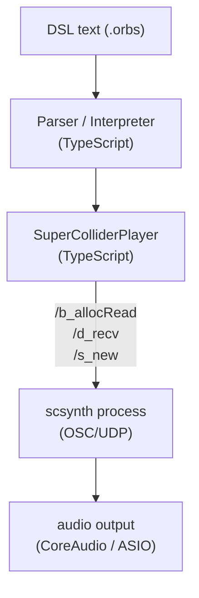

> **Note**: This page is a trace of the author's reading as of 2026-05-05. The code is the truth; this page is merely a snapshot of understanding at that point in time.

# ADR-001 Choosing SuperCollider as the Implementation Base

OrbitScore's audio output uses SuperCollider's `scsynth` (audio server). Why was SuperCollider chosen, what other options existed, and on what grounds was the decision made? This chapter unpacks the journey by following the commit history and research documents.

---

## Table of Contents

1. [Outline of the Journey](#outline-of-the-journey)
2. [Step 1: sox-based Starting Point](#step-1-sox-based-starting-point)
3. [Step 2: The Web Audio API Attempt](#step-2-the-web-audio-api-attempt)
4. [Step 3: Replacement by SuperCollider](#step-3-replacement-by-supercollider)
5. [Step 4: Considering Migration to Rust](#step-4-considering-migration-to-rust)
6. [Current State: SuperCollider + Rust Parallel Strategy](#current-state-supercollider-rust-parallel-strategy)
7. [Reasons for Choosing SuperCollider, Organized](#reasons-for-choosing-supercollider-organized)
8. [Trade-offs](#trade-offs)
9. [Position in the Architecture](#position-in-the-architecture)

---

## Outline of the Journey

```
sox (family) → Web Audio API → SuperCollider (current) → Rust parallel investigation
```

The audio backend has changed three times. Each had a clear reason for failure, and SuperCollider was adopted as "the third option." Rust, which started being investigated in parallel afterward, is complementary rather than a replacement for SuperCollider.

---

## Step 1: sox-based Starting Point

In OrbitScore's early implementation, audio playback by `sox` (Sound eXchange) was used. The implementation details are no longer in the code, but the message of the commit that replaced it with SuperCollider explicitly states the reason:

> Replace sox-based audio engine with SuperCollider for professional-grade, low-latency audio scheduling (0-8ms drift vs 140-150ms with sox).
>
> — commit `081a474`

**A 140-150 ms drift** is a fatal number for live coding. A sixteenth note at BPM 120 is 125 ms, so a delay of an entire note was occurring.

---

## Step 2: The Web Audio API Attempt

Before migrating from sox to SuperCollider, an engine using the Web Audio API (`node-web-audio-api` package) was attempted. Commit `f2de913` is that implementation:

> feat(audio): implement audio engine with Web Audio API
>
> - Add AudioEngine class for audio playback
> - Add AudioFile class for loading and slicing
> - Implement WAV file support with 48kHz/24bit conversion
> - Add chop() functionality for audio slicing
> - Basic tempo control via playback rate
> - Add test suite (15 tests)
> - Install node-web-audio-api and wavefile dependencies

This implementation was removed in PR #31. According to the deletion commit `cfa0381`, about 1,085 lines were removed:

> 削除ファイル (約1,085行):
> - audio-engine.ts および Phase 5-1で作成したモジュール群
>   - engine/ (audio-context-manager, master-gain-controller)
>   - loading/ (audio-file-loader, wav-decoder)
>   - playback/ (slice-player, sequence-player)
> - simple-player.ts (196行, 未使用)
> - precision-scheduler.ts (173行, 未使用)

The reason for removal is not directly written in the commit message, but because SuperCollider was introduced around the same time, latency and precision issues are considered the main causes.

> NOTE: unverified — the direct reason for discarding the Web Audio API (such as latency measurements) is not preserved in the PR #31 thread. How much the Web Audio API improved over sox's 140-150 ms drift is currently unknown.

---

## Step 3: Replacement by SuperCollider

The WIP implementation of SuperCollider entered with `19766da`, and the replacement of the sox engine was completed with `081a474`.

The body of commit `081a474` describes the technical reasons for adopting SuperCollider in detail:

> - Created `SuperColliderPlayer` class with OSC communication
> - Custom `orbitPlayBuf` SynthDef with chop support
> - Buffer management and caching
> - Precise timing with 1ms scheduler interval
> - Drift monitoring (0-8ms achieved)

**A drift of 0-8 ms** is a 20–100x improvement over sox's 140-150 ms. The 1 ms scheduler and OSC (Open Sound Control) UDP communication are the source of precision.

Architectural characteristics of SuperCollider (scsynth):
- **OSC/UDP communication**: SuperCollider runs as a server that accepts control via the OSC protocol. Clients (TypeScript) just need to send messages over UDP
- **SynthDef pre-compilation**: a dedicated SynthDef called `orbitPlayBuf` is pre-loaded; a single `/s_new` message at playback time is enough to produce sound
- **Buffer management**: WAV files are held in server-side memory as Buffers. Playback works without file I/O
- **Independent timing**: scsynth's internal clock is independent of the OS scheduler and is unaffected by Node.js's `setTimeout` imprecision

---

## Step 4: Considering Migration to Rust

After adopting SuperCollider, a PoC of a Rust engine was carried out as a future migration target (Issue #91, commit `f5eee39c`).

Conclusion of the Rust PoC (`docs/research/RUST_POC_FINDINGS.md`):

> **Rust 化は技術的に十分現実的**。PoC のコード量はおよそ 300 行強で、cpal + symphonia のエコシステムが想像以上に成熟していた。Phase 2（本実装）に進めるだけの地固めは完了。

Validation results:
- Round-robin playback of `kick.wav` / `snare.wav` at 500 ms intervals successful
- Works also on a 36-channel audio interface
- `cargo check / clippy / fmt` all clean

The Rust PoC was a spike to confirm technical feasibility as a long-term option, not an intent to "replace SuperCollider right now."

---

## Current State: SuperCollider + Rust Parallel Strategy

The Rust workspace (`rust/`) still exists, and implementation has progressed up to `orbit-audio-daemon` (a WebSocket IPC server). Meanwhile, the production audio engine still uses SuperCollider (scsynth).

```
rust/
├── crates/
│   ├── orbit-audio-core/       # platform-agnostic DSP / scheduler
│   ├── orbit-audio-native/     # cpal + symphonia + rubato (desktop)
│   ├── orbit-audio-wasm/       # wasm-bindgen stub (future web edition)
│   └── orbit-audio-daemon/     # WebSocket IPC server
```

`orbit-audio-daemon` is a mechanism in which the TypeScript client connects via WebSocket to produce sound. The IPC protocol design for replacing SuperCollider with Rust in the future is progressing.

---

## Reasons for Choosing SuperCollider, Organized

Organizing the journey, the reasons SuperCollider is adopted as the current engine are the following three points:

### 1. Measurable Low Latency

sox: 140-150 ms → SuperCollider: 0-8 ms (measured value in commit `081a474`)

This improvement directly supports OrbitScore's core value (performing music in live coding).

### 2. Low Implementation Effort

SuperCollider is already a mature audio server. It can be controlled via the existing OSC/UDP protocol, and it has its own description language for audio processing graphs called SynthDef. Just by writing the `orbitPlayBuf` SynthDef and the `SuperColliderPlayer` class, high-quality audio playback was realized.

Compared to a custom implementation in the Web Audio API or self-built Rust DSP, the implementation effort differs greatly.

### 3. Alignment with OrbitScore's Academic Context

OrbitScore aims for a presentation at ICMC (International Computer Music Conference). SuperCollider is a platform widely used in the computer music research community, making comparison and connection with prior work easy.

---

## Trade-offs

Adopting SuperCollider involves the following trade-offs:

| Aspect | Advantages | Disadvantages |
|---|---|---|
| Binary size | — | requires bundling ~11.5 MB of scsynth + plugins (Issue #134-#136) |
| Platform | confirmed working on macOS | Linux / Windows require separate support |
| Dependency management | binary is stable on SC 3.14.1 | requires keeping up with SC version upgrades |
| Audio precision | 0-8 ms drift is sufficient | a custom Rust implementation could theoretically achieve even lower latency |
| Future extensibility | SC's UGen library is available | adding non-SuperCollider DSP (granular synthesis, etc.) is complex |

In particular, `fixpitch()` and `time()` (time stretching) are implemented in the DSL parser but not on the engine side (this is explicitly noted in a comment in `completion-context.ts`):

```typescript
// packages/vscode-extension/src/completion-context.ts:161-166
      // Future features (parsed by parser but not yet implemented in audio engine):
      // - fixpitch(): Pitch-preserving time-stretch (requires granular synthesis)
      // - time(): Time-stretch factor (requires granular synthesis)
      // Uncomment when granular synthesis is implemented in SuperCollider
      // completions.push(createCompletion('fixpitch', 'Set pitch offset in semitones', 'fixpitch(${1:0})'))
      // completions.push(createCompletion('time', 'Set time stretch factor', 'time(${1:1.0})'))
```

Whether to implement granular synthesis in SuperCollider or in Rust is a future decision.

---

## Position in the Architecture

SuperCollider's position in the three-layer architecture shown in [Architecture Overview](/en/orientation/architecture-overview):



SuperCollider (scsynth) sits between the TypeScript interpretation layer and the audio hardware. The TypeScript side just sends OSC messages over UDP, and all the actual DSP processing is handled by scsynth.

---

## Related Terms

- [scsynth](/en/glossary#scsynth) — the audio server binary OrbitScore adopted. The subject of this ADR
- [orbitPlayBuf](/en/glossary#orbitplaybuf) — the dedicated SynthDef created after adopting scsynth. Handles chop slice playback
- [SynthDef (SC)](/en/glossary#synthdef-sc) — the audio processing definition loaded with `/d_recv`. One of the benefits of adopting SuperCollider
- [UGen (Unit Generator)](/en/glossary#ugen-unit-generator) — the basic processing unit composing a SynthDef. `PlayBuf` / `BufRateScale`, etc.
- [OSC (Open Sound Control)](/en/glossary#osc-open-sound-control) — the communication protocol between engine and scsynth. Sends `/s_new`, etc., over UDP
- [Buffer (SC)](/en/glossary#buffer-sc) — the memory in which scsynth holds decoded audio files. Loaded via `/b_allocRead`
- [ICMC (International Computer Music Conference)](/en/glossary#icmc-international-computer-music-conference) — the academic context for the SuperCollider choice. Alignment with the computer music community

## Related ADRs

- [ADR-002 DSL v3 Pivot](/en/decisions/adr-002-dsl-v3-pivot) — the major MIDI → Audio DSL transition that took place around the same time as the SuperCollider adoption
- [ADR-003 scsynth Bundle Strict Mode](/en/decisions/adr-003-scsynth-bundle) — the scsynth bundling strategy decided as the distribution method after adopting SuperCollider

## Next Exploration Candidates

- Contents of the `orbitPlayBuf` SynthDef — what UGen graph realizes the slice playback for `chop()`
- Role of the `supercolliderjs` package — details of where it is used as the OSC client
- Considerations of granular synthesis implementation — SuperCollider vs. Rust vs. external libraries
- Current state of the Rust `orbit-audio-daemon` — the WebSocket IPC protocol spec and the connection state of the TypeScript client
- scsynth Windows / Linux support status — the path to cross-platform deployment

---

## Sources

- `packages/engine/src/audio/supercollider/` — the SuperColliderPlayer implementation directory
- `packages/vscode-extension/src/completion-context.ts:161-166` — comment that granular synthesis is not yet implemented
- commit `f2de9133` — initial implementation of the Web Audio API engine (`node-web-audio-api` + `wavefile`)
- commit `081a474` — completion of the SuperCollider integration: record of achieving the sox 140-150 ms drift → 0-8 ms
- commit `cfa0381` — PR #31: removal of ~1,085 lines of the Web Audio API implementation
- commit `f5eee39c` — initial implementation of the Rust PoC (Issue #91)
- `docs/research/RUST_POC_FINDINGS.md` — the Rust PoC findings report (PoC results with cpal + symphonia)
- `rust/README.md` — the structure and current status of the Rust workspace
- PR [#31](https://github.com/signalcompose/orbitscore/pull/31) — consolidating on SuperCollider (removal of the Web Audio API)
- PR [#99](https://github.com/signalcompose/orbitscore/pull/99) — merging the Rust PoC (Issue #91)
