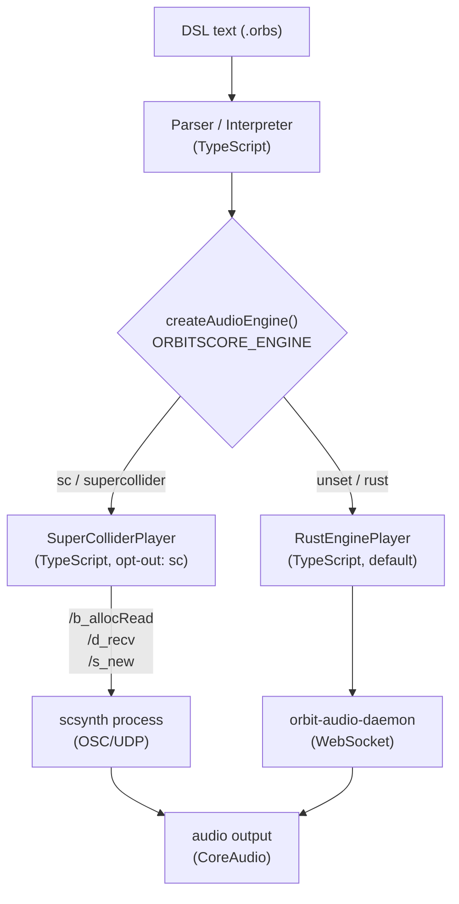

> **Note**: This page is a trace of the author's reading as of 2026-09-01. The code is the truth; this page is only a snapshot of understanding at that time.

::: warning Status as of 2026-09
The decision this ADR records — "choose SuperCollider (scsynth) as the audio backend" — was **overridden as the default** by cutover #108 on 2026-07-03 (`docs/archive/WORK_LOG_2026-07.md` §6.179). `createAudioEngine()` returns `SuperColliderPlayer` only when `ORBITSCORE_ENGINE=sc` is set explicitly; the default is the Rust `orbit-audio-daemon`. This ADR is historical reading that preserves the circumstances at the time of the decision, and "Consequences revisited (2026-09)" at the end summarizes what followed the cutover. For the default path, see [RE-1. Daemon Architecture Overview](/en/rust-engine/).

```typescript
// packages/engine/src/audio/create-audio-engine.ts:17-22
export function createAudioEngine(env: NodeJS.ProcessEnv = process.env): AudioEngineBackend {
  const raw = env[ENGINE_ENV_VAR]
  if (resolveEngineKind(raw) === 'supercollider') {
    console.log(`🎛️ [engine] using SuperCollider backend (opt-out via ORBITSCORE_ENGINE=${raw})`)
    return new SuperColliderPlayer()
  }
```

```typescript
// packages/engine/src/audio/engine-backend.ts:52-53
/** バックエンド選択 env。既定（未設定）は Rust daemon 経路。`sc` / `supercollider` で SC に opt-out。 */
export const ENGINE_ENV_VAR = 'ORBITSCORE_ENGINE'
```
:::

# ADR-001 Choosing SuperCollider as the Implementation Base

From v2.0 (2025-01) until cutover #108 (2026-07-03), OrbitScore's audio output used SuperCollider's `scsynth` (audio server). Why was SuperCollider chosen, what other options existed, and on what grounds was the decision made? This chapter unpacks the journey by following the commit history and research documents.

---

## Table of Contents

1. [Outline of the Journey](#outline-of-the-journey)
2. [Step 1: sox-based Starting Point](#step-1-sox-based-starting-point)
3. [Step 2: The Web Audio API Attempt](#step-2-the-web-audio-api-attempt)
4. [Step 3: Replacement by SuperCollider](#step-3-replacement-by-supercollider)
5. [Step 4: Considering Migration to Rust](#step-4-considering-migration-to-rust)
6. [The Parallel Strategy When the ADR Was Drafted (2026-05)](#the-parallel-strategy-when-the-adr-was-drafted-2026-05)
7. [Reasons for Choosing SuperCollider, Organized](#reasons-for-choosing-supercollider-organized)
8. [Trade-offs](#trade-offs)
9. [Position in the Architecture](#position-in-the-architecture)
10. [Consequences revisited (2026-09)](#consequences-revisited-2026-09)

---

## Outline of the Journey

```
sox (family) → Web Audio API → SuperCollider (v2.0 onward) → Rust daemon (default since cutover #108, 2026-07-03)
```

The audio backend has changed four times. Each had a clear reason, and SuperCollider was adopted as "the third option." Rust started being investigated in parallel afterward; when the ADR was drafted (2026-05) it was complementary, and in 2026-07 it was promoted to the default (details in "Consequences revisited" at the end).

---

## Step 1: sox-based Starting Point

In OrbitScore's early implementation, audio playback by `sox` (Sound eXchange) was used. The implementation details are no longer in the code, but the message of the commit that replaced it with SuperCollider explicitly states the reason:

> Replace sox-based audio engine with SuperCollider for professional-grade, low-latency audio scheduling (0-8ms drift vs 140-150ms with sox).
>
> — commit `081a474`

**A 140-150 ms drift** is a fatal number for live coding. A sixteenth note at BPM 120 is 125 ms, so a delay of an entire note was occurring.

---

## Step 2: The Web Audio API Attempt

Before migrating from sox to SuperCollider, an engine using the Web Audio API (`node-web-audio-api` package) was attempted. Commit `f2de913` is that implementation:

> feat(audio): implement audio engine with Web Audio API
>
> - Add AudioEngine class for audio playback
> - Add AudioFile class for loading and slicing
> - Implement WAV file support with 48kHz/24bit conversion
> - Add chop() functionality for audio slicing
> - Basic tempo control via playback rate
> - Add test suite (15 tests)
> - Install node-web-audio-api and wavefile dependencies

This implementation was removed in PR #31. According to the deletion commit `cfa0381`, about 1,085 lines were removed:

> 削除ファイル (約1,085行):
> - audio-engine.ts および Phase 5-1で作成したモジュール群
>   - engine/ (audio-context-manager, master-gain-controller)
>   - loading/ (audio-file-loader, wav-decoder)
>   - playback/ (slice-player, sequence-player)
> - simple-player.ts (196行, 未使用)
> - precision-scheduler.ts (173行, 未使用)

The reason for removal is not directly written in the commit message, but because SuperCollider was introduced around the same time, latency and precision issues are considered the main causes.

> NOTE: unverified — the direct reason for discarding the Web Audio API (such as latency measurements) is not preserved in the PR #31 thread. How much the Web Audio API improved over sox's 140-150 ms drift is unknown at 69dc968.

---

## Step 3: Replacement by SuperCollider

The WIP implementation of SuperCollider entered with `19766da`, and the replacement of the sox engine was completed with `081a474`.

The body of commit `081a474` describes the technical reasons for adopting SuperCollider in detail:

> - Created `SuperColliderPlayer` class with OSC communication
> - Custom `orbitPlayBuf` SynthDef with chop support
> - Buffer management and caching
> - Precise timing with 1ms scheduler interval
> - Drift monitoring (0-8ms achieved)

**A drift of 0-8 ms** is a 20–100x improvement over sox's 140-150 ms. The 1 ms scheduler and OSC (Open Sound Control) UDP communication are the source of precision.

Architectural characteristics of SuperCollider (scsynth):
- **OSC/UDP communication**: SuperCollider runs as a server that accepts control via the OSC protocol. Clients (TypeScript) just need to send messages over UDP
- **SynthDef pre-compilation**: a dedicated SynthDef called `orbitPlayBuf` is pre-loaded; a single `/s_new` message at playback time is enough to produce sound
- **Buffer management**: WAV files are held in server-side memory as Buffers. Playback works without file I/O
- **Independent timing**: scsynth's internal clock is independent of the OS scheduler and is unaffected by Node.js's `setTimeout` imprecision

---

## Step 4: Considering Migration to Rust

After adopting SuperCollider, a PoC of a Rust engine was carried out as a future migration target (Issue #91, commit `f5eee39c`).

Conclusion of the Rust PoC (`docs/research/RUST_POC_FINDINGS.md`):

> **Rust 化は技術的に十分現実的**。PoC のコード量はおよそ 300 行強で、cpal + symphonia のエコシステムが想像以上に成熟していた。Phase 2（本実装）に進めるだけの地固めは完了。

Validation results:
- Round-robin playback of `kick.wav` / `snare.wav` at 500 ms intervals successful
- Works also on a 36-channel audio interface
- `cargo check / clippy / fmt` all clean

The Rust PoC was a spike to confirm technical feasibility as a long-term option, not an intent to "replace SuperCollider right now."

---

## The Parallel Strategy When the ADR Was Drafted (2026-05)

When this ADR was first written on 2026-05-05, the Rust workspace (`rust/`) had progressed up to `orbit-audio-daemon` (a WebSocket IPC server), while the production audio engine was still SuperCollider (scsynth). The crate layout at that time was these four:

```
rust/
├── crates/
│   ├── orbit-audio-core/       # platform-agnostic DSP / scheduler
│   ├── orbit-audio-native/     # cpal + symphonia + rubato (desktop)
│   ├── orbit-audio-wasm/       # wasm-bindgen スタブ (将来の web 版)
│   └── orbit-audio-daemon/     # WebSocket IPC server
```

`orbit-audio-daemon` is a mechanism in which the TypeScript client connects via WebSocket to produce sound, and this IPC protocol design became the foundation of the cutover.

---

## Reasons for Choosing SuperCollider, Organized

Organizing the journey, the reasons SuperCollider was adopted as the engine in v2.0 are the following three points:

### 1. Measurable Low Latency

sox: 140-150 ms → SuperCollider: 0-8 ms (measured value in commit `081a474`)

This improvement directly supports OrbitScore's core value (performing music in live coding).

### 2. Low Implementation Effort

SuperCollider is already a mature audio server. It can be controlled via the existing OSC/UDP protocol, and it has its own description language for audio processing graphs called SynthDef. Just by writing the `orbitPlayBuf` SynthDef and the `SuperColliderPlayer` class, high-quality audio playback was realized.

Compared to a custom implementation in the Web Audio API or self-built Rust DSP, the implementation effort differs greatly.

### 3. Alignment with OrbitScore's Academic Context

OrbitScore was aiming for a presentation at ICMC (International Computer Music Conference). SuperCollider is a platform widely used in the computer music research community, making comparison and connection with prior work easy.

---

## Trade-offs

Adopting SuperCollider involves the following trade-offs:

| Aspect | Advantages | Disadvantages |
|---|---|---|
| Binary size | — | requires bundling ~11.5 MB of scsynth + plugins (Issue #134-#136) |
| Platform | confirmed working on macOS | Linux / Windows require separate support |
| Dependency management | binary is stable on SC 3.14.1 | requires keeping up with SC version upgrades |
| Audio precision | 0-8 ms drift is sufficient | a custom Rust implementation could theoretically achieve even lower latency |
| Future extensibility | SC's UGen library is available | adding non-SuperCollider DSP (granular synthesis, etc.) is complex |

In particular, `fixpitch()` and `time()` (time stretching) remain planned features excluded from the completion candidates even at 69dc968 (the comment in `completion-context.ts` points to Issue #213):

```typescript
// packages/vscode-extension/src/completion-context.ts:222-224
      // Future features (planned, see GitHub issue #213):
      // - fixpitch(): Pitch shift in semitones (planned)
      // - time(): Time stretch factor (planned)
```

The cutover #108 record (`docs/archive/WORK_LOG_2026-07.md` §6.179) also files `.time()` / `.fixpitch()` as "not a cutover blocker, out of scope → #213." The original question of whether to implement granular synthesis in SuperCollider or in Rust became a Rust-daemon-side task once the default moved to Rust.

---

## Position in the Architecture

Drawing SuperCollider's position in the three-layer architecture shown in [Architecture Overview](/en/orientation/architecture-overview), including the post-cutover branch:


```mermaid
flowchart TD
    A["DSL text (.orbs)"]
    B["Parser / Interpreter\n(TypeScript)"]
    F{"createAudioEngine()\nORBITSCORE_ENGINE"}
    C["SuperColliderPlayer\n(TypeScript, opt-out: sc)"]
    D["scsynth process\n(OSC/UDP)"]
    R["RustEnginePlayer\n(TypeScript, default)"]
    RD["orbit-audio-daemon\n(WebSocket)"]
    E["audio output\n(CoreAudio)"]

    A --> B
    B --> F
    F -->|"sc / supercollider"| C
    F -->|"unset / rust"| R
    C -->|"/b_allocRead\n/d_recv\n/s_new"| D
    R --> RD
    D --> E
    RD --> E
```

On the SC path, scsynth sits between the TypeScript interpretation layer and the audio hardware. The TypeScript side just sends OSC messages over UDP, and all the actual DSP processing is handled by scsynth. On the Rust path, the division of labor — "TypeScript does musical timing and command dispatch, DSP lives in a separate process" — is the same; what changed is the wire protocol (OSC → WebSocket) and who implements the DSP.

---

## Consequences revisited (2026-09)

Following the ADR format, this records the consequences roughly a year and a half after the decision.

### The default backend switched to Rust (cutover #108, 2026-07-03)

`docs/archive/WORK_LOG_2026-07.md` §6.179 is the record of the cutover. There are three key points.

- **Parity is backed by measurement**: 22 offline tests across 3 layers (interpreter schedule / core render / daemon render) PASS, and the coverage matrix over 22 examples shows "no genuine gap" in audio features. The gated `real-daemon-timing` was measured at default/64f/32f: all ahead-of-cursor, xruns=0, polymeter parity. Anchor drift tightens monotonically as the buffer shrinks (6.7→2.4→0.7 ms)
- **Scope is the engine-level default only**: the VS Code UI default (`orbitscore.engine`) and the `.vsix` rebuild were split off as post-cutover finishing in #366. Full retirement of scsynth is "a separate later stage"
- **The flip is reversible**: `ORBITSCORE_ENGINE=sc` returns to SC

On the code side, the factory's header comment is itself a summary of the decision.

```typescript
// packages/engine/src/audio/create-audio-engine.ts:1-7
/**
 * 音声バックエンドのファクトリ（post-2.0 S2 / Issue #296・cutover #108）。
 *
 * cutover #108 で既定を **Rust**（`RustEnginePlayer` / orbit-audio-daemon）に切替。
 * `ORBITSCORE_ENGINE=sc`（または `supercollider`）で既存 `SuperColliderPlayer` に opt-out
 * できる。未設定 / 未知値は既定の Rust。
 */
```

### What became of the three reasons for adoption

| Reason in the ADR | Consequence as of 2026-09 |
|---|---|
| 1. Measurable low latency | The Rust daemon demonstrated parity by measurement (§6.179) and took over the default. SC's 0-8 ms was confirmed to be "a level that can be replaced" |
| 2. Low implementation effort | The Rust workspace grew to 22 crates at 69dc968 (`rust/crates/`: `orbit-audio-core` / `orbit-audio-daemon` / `orbit-audio-native` / `orbit-audio-sandbox` / `orbit-audio-verify` / `orbit-audio-wasm` / `orbit-child-runtime` / `orbit-child-ui` / `orbit-clap-effect-child` / `orbit-clap-host` / `orbit-clap-instrument-child` / `orbit-clap-spike` / `orbit-effect-rack-child` / `orbit-link-audio` / `orbit-plugin-scan` / `orbit-sandbox-spike` / `orbit-std-gain` / `orbit-vst3-effect-child` / `orbit-vst3-gain-oracle` / `orbit-vst3-host` / `orbit-vst3-instrument-child` / `orbit-vst3-synth-oracle`). "Low effort" was correct as the initial judgment, and the later investment opened a different option |
| 3. Academic context | The production track was retargeted toward an ICLC submission on 2026-07-12, and that ICLC submission was itself withdrawn on 2026-09-03 (`CLAUDE.md`, tracked in #413). The production track no longer has a deadline, and depending on SuperCollider is no longer a requirement |

### What remains on the SC path

- The whole of `packages/engine/src/audio/supercollider/` and `SuperColliderPlayer` (retained as a sibling that `implements` `AudioEngineBackend`)
- The SC plugin for LinkAudio (`packages/sc-link-audio`) and the `orbitPlayBufLink` / `orbitLinkAudioKeepalive` SynthDefs
- The scsynth bundle steps in the release pipeline (`docs/archive/WORK_LOG_2026-07.md` §6.186: "scsynth-related steps kept unchanged," an interim owner decision)
- The VS Code extension's `orbitscore.engine: "sc"` and the `forceKillScsynth` / `selectAudioDevice` commands gated on it (`when` clauses in `package.json`'s `commandPalette`)

The accurate reading is not that this ADR's decision "was wrong," but that "it served its purpose and was demoted to an opt-out."

---

## Related Terms

- [scsynth](/en/glossary#scsynth) — the audio server binary adopted by this ADR. An opt-out path since cutover #108
- [orbitPlayBuf](/en/glossary#orbitplaybuf) — the dedicated SynthDef created after adopting scsynth. Handles chop slice playback
- [SynthDef (SC)](/en/glossary#synthdef-sc) — the audio processing definition loaded with `/d_recv`. One of the benefits of adopting SuperCollider
- [UGen (Unit Generator)](/en/glossary#ugen-unit-generator) — the basic processing unit composing a SynthDef. `PlayBuf` / `BufRateScale`, etc.
- [OSC (Open Sound Control)](/en/glossary#osc-open-sound-control) — the communication protocol between engine and scsynth. Sends `/s_new`, etc., over UDP
- [Buffer (SC)](/en/glossary#buffer-sc) — the memory in which scsynth holds decoded audio files. Loaded via `/b_allocRead`
- [ICMC (International Computer Music Conference)](/en/glossary#icmc-international-computer-music-conference) — the academic context for the SuperCollider choice. Alignment with the computer music community

## Related ADRs

- [ADR-002 DSL v3 Pivot](/en/decisions/adr-002-dsl-v3-pivot) — the major MIDI → Audio DSL transition that took place around the same time as the SuperCollider adoption
- [ADR-003 scsynth Bundle Strict Mode](/en/decisions/adr-003-scsynth-bundle) — the scsynth bundling strategy decided as the distribution method after adopting SuperCollider

## Next Exploration Candidates

- Contents of the `orbitPlayBuf` SynthDef — what UGen graph realizes the slice playback for `chop()`
- Role of the `supercolliderjs` package — details of where it is used as the OSC client
- Actually read the parity verification of cutover #108 (the 22 offline tests and gated timing cited in `docs/archive/WORK_LOG_2026-07.md` §6.179) and organize the difference in dispatch models between SC and the daemon (fire-now vs schedule-ahead)
- How to implement `.time()` / `.fixpitch()` (#213) on the Rust daemon side
- Conditions for fully retiring scsynth — what can be dropped from the `AudioEngineBackend` contract when `SuperColliderPlayer` is deleted

---

## Sources

- `packages/engine/src/audio/create-audio-engine.ts:1-36` — the audio backend factory: Rust default / SC opt-out after cutover #108
- `packages/engine/src/audio/engine-backend.ts:1-68` — the `AudioEngineBackend` contract and `resolveEngineKind()`
- `packages/engine/src/audio/supercollider/` — the SuperColliderPlayer implementation directory (retained)
- `packages/vscode-extension/src/completion-context.ts:222-224` — comment that `fixpitch()` / `time()` are planned (#213)
- `rust/crates/` — the 22 crates at 69dc968 (table in Consequences revisited)
- `docs/archive/WORK_LOG_2026-07.md` §6.179 — cutover #108 (2026-07-03): parity evidence, scope boundary, reversibility
- `docs/archive/WORK_LOG_2026-07.md` §6.186 — engine-kind branching (#377) and keeping the scsynth bundle steps
- `CLAUDE.md` — the ICLC retarget of the production track (#413, 2026-07-12) and the withdrawal of that ICLC submission (2026-09-03, PR #700)
- commit `f2de9133` — initial implementation of the Web Audio API engine (`node-web-audio-api` + `wavefile`)
- commit `081a474` — completion of the SuperCollider integration: record of achieving the sox 140-150 ms drift → 0-8 ms
- commit `cfa0381` — PR #31: removal of ~1,085 lines of the Web Audio API implementation
- commit `f5eee39c` — initial implementation of the Rust PoC (Issue #91)
- `docs/research/RUST_POC_FINDINGS.md` — the Rust PoC findings report (PoC results with cpal + symphonia)
- `rust/README.md` — the structure of the Rust workspace
- PR [#31](https://github.com/signalcompose/orbitscore/pull/31) — consolidating on SuperCollider (removal of the Web Audio API)
- PR [#99](https://github.com/signalcompose/orbitscore/pull/99) — merging the Rust PoC (Issue #91)
