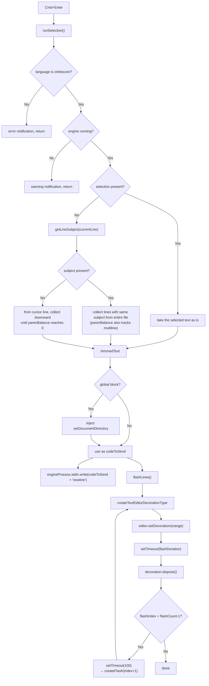

> **Note**: This page is a trace of the author's reading as of 2026-05-05. The code is the truth; this page is merely a snapshot of understanding at that point in time.

# IV-2. Inline Execution and Feedback

What happens when you press `Cmd+Enter`? In OrbitScore, a sequence runs of "intelligently collecting code at the cursor position, sending it to the engine, and notifying the executed range with a flash." This chapter unpacks the mechanism in order from `runSelection()` through `flashLines()` and `updateDiagnostics()`.

---

## Table of Contents

1. [Entry Point: `runSelection()`](#entry-point-runselection)
2. [Path 1: When Text is Selected](#path-1-when-text-is-selected)
3. [Path 2: No Selection, Subject Present — subject-based block evaluation](#path-2-no-selection-subject-present-subject-based-block-evaluation)
4. [Multi-Line Tracking via parenBalance](#multi-line-tracking-via-parenbalance)
5. [Path 3: No Selection, No Subject — Standalone Commands](#path-3-no-selection-no-subject-standalone-commands)
6. [Auto-Injection of `setDocumentDirectory`](#auto-injection-of-setdocumentdirectory)
7. [Sending the DSL Text](#sending-the-dsl-text)
8. [Flash Feedback: `flashLines()`](#flash-feedback-flashlines)
9. [Real-Time Diagnostics: `updateDiagnostics()`](#real-time-diagnostics-updatediagnostics)
10. [Flow Diagram](#flow-diagram)

---

## Entry Point: `runSelection()`

When `Cmd+Enter` is pressed, the `orbitscore.runSelection` command fires and the `runSelection()` function is called. Two guard conditions are checked first:

```typescript
// extension.ts:935-946
async function runSelection() {
  const editor = vscode.window.activeTextEditor
  if (!editor || editor.document.languageId !== 'orbitscore') {
    vscode.window.showErrorMessage('Please open an OrbitScore file')
    return
  }

  // Check if engine is running
  if (!isLiveCodingMode || !engineProcess || engineProcess.killed) {
    vscode.window.showWarningMessage('⚠️ Engine is not running. Click status bar to start engine.')
    return
  }
```

The check `languageId !== 'orbitscore'` is important. The keybinding in VS Code has the condition `when: editorLangId == orbitscore`, but when the command is called directly from the command palette, that `when` does not apply, so the language is also confirmed inside the function.

---

## Path 1: When Text is Selected

When there is a selection (`!selection.isEmpty`), it is simple. The text of the selected range is taken as is:

```typescript
// extension.ts:953-955
  if (!selection.isEmpty) {
    text = editor.document.getText(selection)
    executionRange = new vscode.Range(selection.start, selection.end)
```

`executionRange` is later also used as the highlight range for the flash.

---

## Path 2: No Selection, Subject Present — subject-based block evaluation

The case with no selection is interesting. It investigates "to which variable (subject) does the line at the cursor belong" and gathers **lines from the entire file** related to that subject:

```typescript
// extension.ts:957-1004 (up to before setDocumentDirectory injection)
  } else {
    // No selection: subject-based block evaluation
    // Detect which variable/object the current line belongs to, then collect all related lines
    const currentLine = selection.active.line
    const currentLineText = editor.document.lineAt(currentLine).text
    const subject = getLineSubject(currentLineText)

    if (subject) {
      // Collect all lines belonging to this subject (var decl + method calls)
      const collectedLines: { lineNum: number; text: string }[] = []

      for (let i = 0; i < editor.document.lineCount; i++) {
        const lineText = editor.document.lineAt(i).text
        const lineSubject = getLineSubject(lineText)

        if (lineSubject === subject) {
          collectedLines.push({ lineNum: i, text: lineText })

          // Handle multiline statements (unbalanced parentheses)
          let parenBalance = 0
          for (const char of lineText) {
            if (char === '(') parenBalance++
            if (char === ')') parenBalance--
          }
          while (parenBalance > 0 && i + 1 < editor.document.lineCount) {
            i++
            const contLine = editor.document.lineAt(i).text
            collectedLines.push({ lineNum: i, text: contLine })
            for (const char of contLine) {
              if (char === '(') parenBalance++
              if (char === ')') parenBalance--
            }
          }
        }
      }

      if (collectedLines.length > 0) {
        text = collectedLines.map((l) => l.text).join('\n')
        const firstLine = collectedLines[0].lineNum
        const lastLine = collectedLines[collectedLines.length - 1].lineNum
        executionRange = new vscode.Range(
          editor.document.lineAt(firstLine).range.start,
          editor.document.lineAt(lastLine).range.end,
        )
      } else {
        const line = editor.document.lineAt(currentLine)
        text = line.text
        executionRange = line.range
      }
    } else {
```

`getLineSubject()` is a function that looks at each line and returns "to which variable does this line belong" (we do not dive into the implementation in this chapter). For example, the line `var _kick = ...` returns `_kick`, and `_kick.play(...)` also returns `_kick`.

This makes it possible to gather all lines of the same subject scattered throughout the file and send them together to the engine. In a live coding session, even when the setup configuration line (`var _kick = init SEQ ...`) and the subsequent pattern change line (`_kick.play(...)`) are in distant positions, they can be re-evaluated together correctly.

---

## Multi-Line Tracking via parenBalance

Embedded in the code above is the `parenBalance` logic. This is a mechanism to **collect a method chain that spans multiple lines as one unit**.

For example, suppose there is DSL code like the following:

```
_kick.play(
  1, 0, 1, 0,
  1, 0, 1, 0
)
```

On the line `_kick.play(`, `parenBalance = 1`. On `1, 0, 1, 0,` there is no change; on the final line `)`, `parenBalance = 0` and the loop exits. All lines in between are also included in `collectedLines`.

---

## Path 3: No Selection, No Subject — Standalone Commands

When `getLineSubject()` returns `null` / falsy, it is judged a standalone command (`LOOP`, `RUN`, `MUTE`, etc.). In this case, the same `parenBalance` logic is used to follow multiple lines, but rather than scanning the entire file, the range is extended **only downward from the cursor line**:

```typescript
// extension.ts:1006-1028
    } else {
      // Standalone command (LOOP, RUN, MUTE, etc.) - evaluate current statement only
      let endLine = currentLine
      const lineText = editor.document.lineAt(currentLine).text
      let parenBalance = 0
      for (const char of lineText) {
        if (char === '(') parenBalance++
        if (char === ')') parenBalance--
      }
      while (parenBalance > 0 && endLine + 1 < editor.document.lineCount) {
        endLine++
        const contLine = editor.document.lineAt(endLine).text
        for (const char of contLine) {
          if (char === '(') parenBalance++
          if (char === ')') parenBalance--
        }
      }

      executionRange = new vscode.Range(
        editor.document.lineAt(currentLine).range.start,
        editor.document.lineAt(endLine).range.end,
      )
      text = editor.document.getText(executionRange)
    }
```

---

## Auto-Injection of `setDocumentDirectory`

Just before sending the collected text to the engine, the `setDocumentDirectory` command is automatically inserted. This is a mechanism to perform the relative-path resolution of `audioPath()` and `audio()` based on the directory of the `.orbs` file.

```typescript
// extension.ts (behavior changed in Issue #168)
let codeToSend = trimmedText
const documentDir = path.dirname(editor.document.uri.fsPath)
const setDirCommand = `global.setDocumentDirectory("${documentDir.replace(/\\/g, '\\\\')}")`
const globalInitMatch = codeToSend.match(/(var\s+global\s*=\s*init\s+GLOBAL[^\n]*)/)
if (globalInitMatch) {
  // Evaluation that initializes global: insert right after init
  const insertPos = globalInitMatch.index! + globalInitMatch[0].length
  codeToSend =
    codeToSend.slice(0, insertPos) + '\n' + setDirCommand + codeToSend.slice(insertPos)
  globalInitialized = true
} else if (globalInitialized) {
  // Session that already has a global: prepend at the head of the code
  codeToSend = setDirCommand + '\n' + codeToSend
}
```

Injection is performed in the following two stages:

1. **On evaluating a global initialization block**: insert right after `var global = init GLOBAL` and set the `globalInitialized` flag
2. **On any subsequent evaluation**: prepend at the head of the code. As a result, even if the user switches to a different `.orbs` file and runs partial evaluation, the current file's directory is reflected

The `globalInitialized` flag is bound to the engine process lifecycle (boot, stop, extension activate) and is reset accordingly.

It also includes processing to escape the Windows path separator (`\`) to `\\` (`replace(/\\/g, '\\\\')`).

There is no fallback to `process.cwd()` on the engine side (Issue #168). If documentDirectory is unset and a relative path is specified, an explicit error is raised.

---

## Sending the DSL Text

Once collection and processing are complete, it is written to the engine's stdin:

```typescript
// extension.ts:1102-1108
  // Execute the selected command (both single line and multiline)
  // Debug: log what we're sending if in debug mode (check status bar text for 🐛)
  if (statusBarItem?.text.includes('🐛')) {
    outputChannel?.appendLine(`📤 Sending: ${JSON.stringify(codeToSend)}`)
  }
  engineProcess.stdin?.write(codeToSend + '\n')
  flashLines()
```

In debug mode (when `🐛` is in the status bar), the send text escaped via `JSON.stringify` is also output to the Output Channel. This is a mechanism to confirm "what was sent" while debugging.

`flashLines()` is called immediately after sending. Because the visual feedback runs without waiting for a response from the engine, the user can immediately get the sense that "it ran."

---

## Flash Feedback: `flashLines()`

What flashes the executed range in the editor is `flashLines()`. It is implemented using `createTextEditorDecorationType` (VS Code API):

```typescript
// extension.ts:1033-1083
  // Visual feedback: flash the executed lines (configurable)
  const flashLines = () => {
    const config = vscode.workspace.getConfiguration('orbitscore')
    const flashCount = config.get<number>('flashCount', 3)
    const flashDuration = config.get<number>('flashDuration', 150)
    const flashColor = config.get<string>('flashColor', 'selection')
    const flashCustomColor = config.get<string>('flashCustomColor', '#ff6b6b')

    // Determine background color
    let backgroundColor: string | vscode.ThemeColor
    switch (flashColor) {
      case 'error':
        backgroundColor = new vscode.ThemeColor('editorError.foreground')
        break
      case 'warning':
        backgroundColor = new vscode.ThemeColor('editorWarning.foreground')
        break
      case 'info':
        backgroundColor = new vscode.ThemeColor('editorInfo.foreground')
        break
      case 'custom':
        backgroundColor = flashCustomColor
        break
      default: // 'selection'
        backgroundColor = new vscode.ThemeColor('editor.selectionBackground')
        break
    }

    const isWholeLine = selection.isEmpty
    const range = executionRange

    // Create flash function
    const createFlash = (flashIndex: number) => {
      const decoration = vscode.window.createTextEditorDecorationType({
        backgroundColor: backgroundColor,
        isWholeLine: isWholeLine,
      })
      editor.setDecorations(decoration, [range])

      setTimeout(() => {
        decoration.dispose()
        // Schedule next flash if not the last one
        if (flashIndex < flashCount - 1) {
          setTimeout(() => createFlash(flashIndex + 1), 100)
        }
      }, flashDuration)
    }

    // Start flashing
    createFlash(0)
  }
```

`createTextEditorDecorationType` creates a new decoration object each time and discards it with `decoration.dispose()` after `setTimeout`. That is one cycle of "flashing." By recursively calling `createFlash(flashIndex + 1)` until `flashCount - 1`, the flash is repeated the specified number of times.

The defaults are:
- `flashCount`: 3 times
- `flashDuration`: 150 ms (lit time)
- Flash interval: `100 ms` (hard-coded)

When executing without selection, `isWholeLine = true`, so the entire line is highlighted. When executing with selection, `isWholeLine = false`, and only the selected text portion is highlighted.

The kinds of colors that can be set:

| `flashColor` value | Color used |
|---|---|
| `"selection"` (default) | `editor.selectionBackground` (theme color) |
| `"error"` | `editorError.foreground` (theme color) |
| `"warning"` | `editorWarning.foreground` (theme color) |
| `"info"` | `editorInfo.foreground` (theme color) |
| `"custom"` | `flashCustomColor` hex value (default: `#ff6b6b`) |

---

## Real-Time Diagnostics: `updateDiagnostics()`

Separately from `Cmd+Enter`, `updateDiagnostics()` runs on every keystroke. It is driven by the `onDidChangeTextDocument` event registered by `activate()`.

```typescript
// extension.ts:1180-1257
async function updateDiagnostics(
  document: vscode.TextDocument,
  collection: vscode.DiagnosticCollection,
) {
  const diagnostics: vscode.Diagnostic[] = []
  const text = document.getText()
  const lines = text.split('\n')

  // Track multiline statements (lines ending with open parenthesis and comma)
  let inMultilineStatement = false

  for (let i = 0; i < lines.length; i++) {
    const line = lines[i]
    if (!line) continue

    // Detect multiline statement start: ends with '(' or ','
    const trimmedLine = line.trim()
    if (trimmedLine.endsWith('(') || trimmedLine.endsWith(',')) {
      if (!inMultilineStatement) {
        inMultilineStatement = true
      }
      continue // Skip parenthesis check for multiline statements
    }

    // Detect multiline statement end: line with closing parenthesis
    if (inMultilineStatement && trimmedLine.endsWith(')')) {
      inMultilineStatement = false
      continue // Skip parenthesis check for closing line
    }

    // Skip parenthesis check if we're inside a multiline statement
    if (inMultilineStatement) {
      continue
    }

    // Check for common syntax errors

    // Missing closing parenthesis (only for single-line statements)
    const openParens = (line.match(/\(/g) || []).length
    const closeParens = (line.match(/\)/g) || []).length
    if (openParens > closeParens) {
      const diagnostic = new vscode.Diagnostic(
        new vscode.Range(i, 0, i, line.length),
        'Missing closing parenthesis',
        vscode.DiagnosticSeverity.Error,
      )
      diagnostics.push(diagnostic)
    }

    // Invalid tempo range
    const tempoMatch = line.match(/\.tempo\((\d+)\)/)
    if (tempoMatch && tempoMatch[1]) {
      const tempo = parseInt(tempoMatch[1])
      if (tempo < 20 || tempo > 999) {
        const start = line.indexOf(tempoMatch[1])
        const diagnostic = new vscode.Diagnostic(
          new vscode.Range(i, start, i, start + tempoMatch[1].length),
          `Tempo must be between 20 and 999 (got ${tempo})`,
          vscode.DiagnosticSeverity.Warning,
        )
        diagnostics.push(diagnostic)
      }
    }

    // Check for deprecated syntax (old MIDI DSL)
    if (line.includes('sequence ') && !line.includes('//')) {
      const diagnostic = new vscode.Diagnostic(
        new vscode.Range(i, 0, i, line.length),
        'Deprecated: Use "var seq = init GLOBAL.seq" instead of "sequence"',
        vscode.DiagnosticSeverity.Warning,
      )
      diagnostic.tags = [vscode.DiagnosticTag.Deprecated]
      diagnostics.push(diagnostic)
    }
  }

  collection.set(document.uri, diagnostics)
}
```

There are five kinds of diagnostic checks:

### 1. Parenthesis Matching Check (Error)

Only single lines are targeted. Multi-line statements (lines ending with `(` or `,`) are detected with the `inMultilineStatement` flag and skipped. If `(` > `)` on a single line, it raises `DiagnosticSeverity.Error`.

::: tip Design limitation (not a bug)
Parenthesis matching across an entire multi-line statement is intentionally not checked. This is a trade-off to avoid false positives during intermediate typing states (e.g., right after typing `_kick.play(`). In practice, the engine-side parser will return a syntax error on `Cmd+Enter` execution, so as the first stage of dual defense, only the case of "obviously forgotten close on a single line" is warned early. For improvements regarding multi-line support, see "Next exploration candidates."
:::

### 2. Tempo Range Check (Warning)

If N in `.tempo(N)` is less than 20 or greater than 999, raises `DiagnosticSeverity.Warning`. The regex `/\.tempo\((\d+)\)/` captures it, highlighting only the digits of the out-of-range number (`start` / `start + tempoMatch[1].length`).

### 3. Deprecated Keyword Detection (Warning + Deprecated tag)

Lines containing the string `sequence ` (excluding comment-outs) are old MIDI DSL syntax. By attaching `DiagnosticTag.Deprecated`, VS Code displays them with strikethrough styling.

The background of the `sequence ` detection being a "remnant of the old MIDI DSL" is covered in [ADR-002](/en/decisions/adr-002-dsl-v3-pivot).

### 4. global state-setter once-per-file (Warning)

`global` state-setting methods (tempo / beat / audioPath / start / stop / gain / key / normalizer / limiter / compressor) should be written only once per file; if violated, raises `DiagnosticSeverity.Warning`.

It loops over all document lines again, extracts calls with `\bglobal\s*\.\s*(\w+)\s*\(/g`, aggregates the appearance positions per target method into a Map, and attaches a Diagnostic to the second and later occurrences.

Excluded:
- `init global.seq` (sequence declaration; multiple are needed)
- `LOOP`, `RUN`, `MUTE` (uppercase canonical-form transport commands; intended to fire on each evaluation)
- `seq.<method>` (per-sequence methods; no restriction)

Design intent: the orthodox way for live coding is "rewrite the line and re-evaluate." Duplicate lines become a hotbed of unintended misbehavior (which value is in effect is unclear), so a warning is shown as a natural nudge in editing style.

### 5. audioPath ordering (Warning)

The rule that `global.audioPath()` must be written before the first `\.audio("<relative path>")`. If reversed, audioPath is empty at the time of `audio()` invocation, so the timing of absolutization is off.

It obtains the line number of the first occurrence of `global.audioPath(`, and for each `\.audio("...")` call, judges the argument:
- absolute path (`/`, `~/`, `C:\`, etc.) → skip
- relative path, and it appears before audioPath or audioPath is absent → Warning

The message branches into "audioPath absent" and "order reversed." In the latter case, the line number where audioPath is declared is also presented.

The background of when this rule was introduced relates to "environment-independent path resolution" handled in [Issue #168 / PR #169](https://github.com/signalcompose/orbitscore/pull/169). It is a UX improvement to prevent runtime errors in the editor.

---

## Flow Diagram



---

## Related Terms

- [subject-based block evaluation](/en/glossary#subject-based-block-evaluation) — the operating mode of Path 2 in `runSelection()`. Collects related lines from the entire file based on the cursor line's subject
- [flashLines()](/en/glossary#flashlines) — the visual feedback function that flashes the executed line range in the editor
- [DiagnosticCollection](/en/glossary#diagnosticcollection) — the diagnostic collection that `updateDiagnostics()` writes to. Updated on every keystroke
- [DiagnosticTag.Deprecated](/en/glossary#diagnostictagdeprecated) — the tag attached when the `sequence ` keyword is detected. Displayed in strikethrough style
- [Extension Host](/en/glossary#extension-host) — the process where `runSelection()` and `flashLines()` run. The stdin send to the engine also happens here
- [setDocumentDirectory](/en/glossary#setdocumentdirectory) — the relative-path resolution command auto-injected on global block evaluation
- [language ID (orbitscore)](/en/glossary#language-id-orbitscore) — the guard condition `runSelection()` checks first. Does not run on anything other than `.orbs` files
- [DSL (Domain-Specific Language)](/en/glossary#dsl) — the text sent to the engine's stdin. In the form `codeToSend + '\n'`

## Related ADRs

- [ADR-002 DSL v3 Pivot](/en/decisions/adr-002-dsl-v3-pivot) — the background of the `sequence ` keyword being detected as deprecated (a remnant of v1.0 MIDI DSL)

## Next Exploration Candidates

- Implementation details of `getLineSubject()` — what regular expressions and rules determine the line's subject
- `setupStdoutHandler()` — analysis of responses returned from the engine and display in the Output Channel
- `configureFlash` command — a mechanism that interactively sets flashCount / flashDuration / flashColor via a Quick Pick UI
- Candidates for improving diagnostic accuracy — parenthesis matching that follows entire multi-line statements (currently single-line only)
- Enumeration of deprecated syntax other than `sequence ` — exhaustive survey of v1 DSL remnants

---

## Sources

- `packages/vscode-extension/src/extension.ts:935-1109` — entire `runSelection()`: guards, subject-based collection, injection, sending, flash
- `packages/vscode-extension/src/extension.ts:953-955` — Path 1: when there is a selection
- `packages/vscode-extension/src/extension.ts:957-1004` — Path 2: subject-based block evaluation
- `packages/vscode-extension/src/extension.ts:1006-1028` — Path 3: standalone command
- `packages/vscode-extension/src/extension.ts:1033-1083` — `flashLines()`: flash feedback implementation
- `packages/vscode-extension/src/extension.ts:1085-1100` — `setDocumentDirectory` auto-injection
- `packages/vscode-extension/src/extension.ts:1107` — `engineProcess.stdin?.write(codeToSend + '\n')`: send
- `packages/vscode-extension/src/extension.ts:1180-1257` — `updateDiagnostics()`: parenthesis, tempo, deprecated detection
