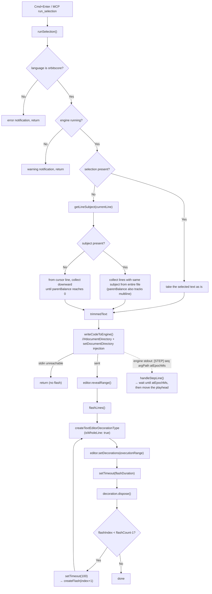

> **Note**: This page is a trace of the author's reading as of 2026-09-01. The code is the truth; this page is only a snapshot of understanding at that time.

# IV-2. Inline Execution and Feedback

What happens when you press `Cmd+Enter`? In OrbitScore, a sequence runs of "intelligently collecting code at the cursor position, sending it to the engine, and notifying the executed range with a flash." This chapter unpacks the mechanism in order from `runSelection()` through `writeCodeToEngine()`, `flashLines()`, and `updateDiagnostics()`. Since the first draft in 2026-05, two feedback paths were added: the **live playhead** (#390) driven by `[STEP]` lines coming back from the engine, and **`//#evalMark`** (#614), which returns results to evaluations made through MCP.

---

## Table of Contents

1. [Entry Point: `runSelection()`](#entry-point-runselection)
2. [Path 1: When Text is Selected](#path-1-when-text-is-selected)
3. [Path 2: No Selection, Subject Present — subject-based block evaluation](#path-2-no-selection-subject-present-subject-based-block-evaluation)
4. [Multi-Line Tracking via parenBalance](#multi-line-tracking-via-parenbalance)
5. [Path 3: No Selection, No Subject — Standalone Commands](#path-3-no-selection-no-subject-standalone-commands)
6. [`writeCodeToEngine()`: the Meta Line and `setDocumentDirectory` Injection](#writecodetoengine-the-meta-line-and-setdocumentdirectory-injection)
7. [After Sending: revealRange and the Flash](#after-sending-revealrange-and-the-flash)
8. [Flash Feedback: `flashLines()`](#flash-feedback-flashlines)
9. [Live Playhead: "Where is it Sounding Now" via `[STEP]` Lines](#live-playhead-where-is-it-sounding-now-via-step-lines)
10. [Evaluation Result Feedback: `//#evalMark`](#evaluation-result-feedback-evalmark)
11. [Real-Time Diagnostics: `updateDiagnostics()`](#real-time-diagnostics-updatediagnostics)
12. [Flow Diagram](#flow-diagram)
13. [Drift as of 2026-09](#drift-as-of-2026-09)

---

## Entry Point: `runSelection()`

When `Cmd+Enter` is pressed, the `orbitscore.runSelection` command fires and the `runSelection()` function is called. Two guard conditions are checked first:

```typescript
// packages/vscode-extension/src/extension.ts:2717-2728
async function runSelection() {
  const editor = vscode.window.activeTextEditor
  if (!editor || editor.document.languageId !== 'orbitscore') {
    vscode.window.showErrorMessage('Please open an OrbitScore file')
    return
  }

  // Check if engine is running
  if (!isLiveCodingMode || !engineProcess || engineProcess.killed) {
    vscode.window.showWarningMessage('⚠️ Engine is not running. Click status bar to start engine.')
    return
  }
```

The check `languageId !== 'orbitscore'` is important. The keybinding in VS Code has the condition `when: editorLangId == orbitscore`, but when the command is called directly from the command palette, that `when` does not apply, so the language is also confirmed inside the function.

Incidentally, the MCP `run_selection` tool calls this same function (`runSelectionForAgent()`, `extension.ts:3405`). Because the agent places a range beforehand with `set_selection`, it goes through Path 1.

---

## Path 1: When Text is Selected

When there is a selection (`!selection.isEmpty`), it is simple. The text of the selected range is taken as is:

```typescript
// packages/vscode-extension/src/extension.ts:2735-2737
  if (!selection.isEmpty) {
    text = editor.document.getText(selection)
    executionRange = new vscode.Range(selection.start, selection.end)
```

`executionRange` is later also used as the highlight range for the flash.

---

## Path 2: No Selection, Subject Present — subject-based block evaluation

The case with no selection is interesting. It investigates "to which variable (subject) does the line at the cursor belong" and gathers **lines from the entire file** related to that subject:

```typescript
// packages/vscode-extension/src/extension.ts:2738-2787 (setDocumentDirectory 注入前まで)
  } else {
    // No selection: subject-based block evaluation
    // Detect which variable/object the current line belongs to, then collect all related lines
    const currentLine = selection.active.line
    const currentLineText = editor.document.lineAt(currentLine).text
    const subject = getLineSubject(currentLineText)

    if (subject) {
      // Collect all lines belonging to this subject (var decl + method calls)
      const collectedLines: { lineNum: number; text: string }[] = []

      for (let i = 0; i < editor.document.lineCount; i++) {
        const lineText = editor.document.lineAt(i).text
        const lineSubject = getLineSubject(lineText)

        if (lineSubject === subject) {
          collectedLines.push({ lineNum: i, text: lineText })

          // Handle multiline statements (unbalanced parentheses)
          let parenBalance = 0
          for (const char of lineText) {
            if (char === '(') parenBalance++
            if (char === ')') parenBalance--
          }
          while (parenBalance > 0 && i + 1 < editor.document.lineCount) {
            i++
            const contLine = editor.document.lineAt(i).text
            collectedLines.push({ lineNum: i, text: contLine })
            for (const char of contLine) {
              if (char === '(') parenBalance++
              if (char === ')') parenBalance--
            }
          }
        }
      }

      if (collectedLines.length > 0) {
        text = collectedLines.map((l) => l.text).join('\n')
        const firstLine = collectedLines[0].lineNum
        const lastLine = collectedLines[collectedLines.length - 1].lineNum
        executionRange = new vscode.Range(
          editor.document.lineAt(firstLine).range.start,
          editor.document.lineAt(lastLine).range.end,
        )
      } else {
        const line = editor.document.lineAt(currentLine)
        text = line.text
        executionRange = line.range
      }
    } else {
```

`getLineSubject()` is a function that looks at each line and returns "to which variable does this line belong." The first draft did not dive into it, but the implementation is a small one with just two regular expressions.

```typescript
// packages/vscode-extension/src/extension.ts:2702-2715
function getLineSubject(lineText: string): string | null {
  const trimmed = lineText.trim()
  if (!trimmed || trimmed.startsWith('//')) return null

  // var <name> = init ...
  const varMatch = trimmed.match(/^var\s+(\w+)\s*=/)
  if (varMatch) return varMatch[1]

  // <name>.method(...)
  const dotMatch = trimmed.match(/^(\w+)\./)
  if (dotMatch) return dotMatch[1]

  return null
}
```

For example, the line `var _kick = ...` returns `_kick`, and `_kick.play(...)` also returns `_kick`. Comment lines and blank lines return `null`.

This makes it possible to gather all lines of the same subject scattered throughout the file and send them together to the engine. In a live coding session, even when the setup configuration line (`var _kick = init global.seq`) and the subsequent pattern change line (`_kick.play(...)`) are in distant positions, they can be re-evaluated together correctly.

---

## Multi-Line Tracking via parenBalance

Embedded in the code above is the `parenBalance` logic. This is a mechanism to **collect a method chain that spans multiple lines as one unit**.

For example, suppose there is DSL code like the following:

```
_kick.play(
  1, 0, 1, 0,
  1, 0, 1, 0
)
```

On the line `_kick.play(`, `parenBalance = 1`. On `1, 0, 1, 0,` there is no change; on the final line `)`, `parenBalance = 0` and the loop exits. All lines in between are also included in `collectedLines`.

---

## Path 3: No Selection, No Subject — Standalone Commands

When `getLineSubject()` returns `null`, it is judged a standalone command (`LOOP`, `RUN`, `MUTE`, etc.). In this case, the same `parenBalance` logic is used to follow multiple lines, but rather than scanning the entire file, the range is extended **only downward from the cursor line**:

```typescript
// packages/vscode-extension/src/extension.ts:2787-2810
    } else {
      // Standalone command (LOOP, RUN, MUTE, etc.) - evaluate current statement only
      let endLine = currentLine
      const lineText = editor.document.lineAt(currentLine).text
      let parenBalance = 0
      for (const char of lineText) {
        if (char === '(') parenBalance++
        if (char === ')') parenBalance--
      }
      while (parenBalance > 0 && endLine + 1 < editor.document.lineCount) {
        endLine++
        const contLine = editor.document.lineAt(endLine).text
        for (const char of contLine) {
          if (char === '(') parenBalance++
          if (char === ')') parenBalance--
        }
      }

      executionRange = new vscode.Range(
        editor.document.lineAt(currentLine).range.start,
        editor.document.lineAt(endLine).range.end,
      )
      text = editor.document.getText(executionRange)
    }
```

---

## `writeCodeToEngine()`: the Meta Line and `setDocumentDirectory` Injection

The job of sending the collected text to the engine was written inline at the tail of `runSelection()` as of 2026-05, but it has been carved out into `writeCodeToEngine()` so it can be shared with MCP's `evaluate_orbitscore`. There are two layers of mechanism for resolving the relative paths of `audioPath()` and `audio()` against the `.orbs` file's directory.

```typescript
// packages/vscode-extension/src/extension.ts:3001-3033
function writeCodeToEngine(rawCode: string, documentDir: string | undefined): boolean {
  if (!engineProcess || !engineProcess.stdin || !engineProcess.stdin.writable) {
    // 呼び出し側ガード通過後に engine が死んだ稀な競合。黙って no-op すると
    // palette 実行では「実行したのに無反応」になるので、ここで必ず痕跡を残す。
    outputChannel?.appendLine('⚠️ Engine stdin is not writable — code was NOT sent (engine died?)')
    return false
  }
  let codeToSend = rawCode
  if (documentDir) {
    // I3 (#456): REPL メタ行で基準ディレクトリを帯域外で先渡しする。import 文（IM.2）は
    // どの statement よりも先に評価されるため、下の DSL 注入（statements として実行）では
    // 間に合わない — メタ行だけが import の基準（IM.6）を初回 eval から確定できる。
    // DSL 注入も残す（audio() 等の既存経路の実績を変えない・同値の冪等再設定）。
    codeToSend = `//#documentDirectory ${documentDir}\n` + codeToSend
    const setDirCommand = `global.setDocumentDirectory("${documentDir.replace(/\\/g, '\\\\')}")`
    const globalInitMatch = codeToSend.match(/(var\s+global\s*=\s*init\s+GLOBAL[^\n]*)/)
    if (globalInitMatch) {
      const insertPos = globalInitMatch.index! + globalInitMatch[0].length
      codeToSend =
        codeToSend.slice(0, insertPos) + '\n' + setDirCommand + codeToSend.slice(insertPos)
      globalInitialized = true
    } else if (globalInitialized) {
      codeToSend = setDirCommand + '\n' + codeToSend
    }
  }

  // Debug: log what we're sending if in debug mode (check status bar text for 🐛)
  if (statusBarItem?.text.includes('🐛')) {
    outputChannel?.appendLine(`📤 Sending: ${JSON.stringify(codeToSend)}`)
  }
  engineProcess.stdin.write(codeToSend + '\n')
  return true
}
```

The two layers are:

1. **The `//#documentDirectory` meta line** (#456 I3): always prepended. Because the REPL side processes it first as a meta line, the base directory for `import` statements (evaluated before any statement) is also settled from the very first eval
2. **DSL injection of `global.setDocumentDirectory(...)`**: the previous path — if the evaluation contains `var global = init GLOBAL`, it is inserted right after it and the `globalInitialized` flag is set; on later evaluations it is prepended to the code. In a session where global is not initialized, nothing is injected (it would fail with `global is not defined`)

The `globalInitialized` flag is reset on the engine process lifecycle (start, stop, extension activate). It also includes processing to escape the Windows path separator (`\`) to `\\`.

In debug mode (when `🐛` is in the status bar), the send text escaped via `JSON.stringify` is also output to the Output Channel.

There is no fallback to `process.cwd()` on the engine side (Issue #168). If documentDirectory is unset and a relative path is specified, an explicit error is raised.

---

## After Sending: revealRange and the Flash

The tail of `runSelection()` looks like this.

```typescript
// packages/vscode-extension/src/extension.ts:2874-2881
  if (!writeCodeToEngine(trimmedText, path.dirname(editor.document.uri.fsPath))) {
    return // stdin 不達（engine 死の競合）— 送れていないのに flash で「実行した」と見せない
  }
  // Scroll the executed range into view before flashing it: subject-block
  // auto-detection (no explicit selection) never reveals, so an agent-driven run
  // that lands on an off-screen line would otherwise flash outside the viewport.
  editor.revealRange(executionRange, vscode.TextEditorRevealType.InCenterIfOutsideViewport)
  flashLines()
```

A point to note here is the ordering: if sending fails, **no flash**. As of 2026-05 it called `flashLines()` right after `write`, but showing "it ran" when nothing reached stdin is false feedback. `revealRange` was added so that when an agent-driven run targets an off-screen line, the flash is not invisible (#388, `docs/archive/WORK_LOG_2026-07.md` §6.193).

---

## Flash Feedback: `flashLines()`

What flashes the executed range in the editor is `flashLines()`. It is implemented using `createTextEditorDecorationType` (VS Code API):

```typescript
// packages/vscode-extension/src/extension.ts:2815-2872
  // Visual feedback: flash the executed lines (configurable)
  const flashLines = () => {
    const config = vscode.workspace.getConfiguration('orbitscore')
    const flashCount = config.get<number>('flashCount', 3)
    const flashDuration = config.get<number>('flashDuration', 150)
    const flashColor = config.get<string>('flashColor', 'selection')
    const flashCustomColor = config.get<string>('flashCustomColor', '#ff6b6b')

    // Determine background color
    let backgroundColor: string | vscode.ThemeColor
    switch (flashColor) {
      case 'error':
        backgroundColor = new vscode.ThemeColor('editorError.foreground')
        break
      case 'warning':
        backgroundColor = new vscode.ThemeColor('editorWarning.foreground')
        break
      case 'info':
        backgroundColor = new vscode.ThemeColor('editorInfo.foreground')
        break
      case 'custom':
        backgroundColor = flashCustomColor
        break
      default: // 'selection'
        backgroundColor = new vscode.ThemeColor('editor.selectionBackground')
        break
    }

    // Always paint the whole line(s), never just the selected characters. When a
    // non-empty selection was executed — which is every MCP-triggered run, since
    // the Agent Bridge always targets a precise range via set_selection before
    // calling run_selection (#388) — a character-bounded decoration exactly
    // overlaps the editor's native selection highlight (same range, and with the
    // default flashColor='selection' the same background color too), so toggling
    // it on/off is visually imperceptible: the "off" state still shows the native
    // selection underneath. Whole-line painting extends past the selected text and
    // stays visible regardless of selection state, color config, or trigger source.

    // Create flash function
    const createFlash = (flashIndex: number) => {
      const decoration = vscode.window.createTextEditorDecorationType({
        backgroundColor: backgroundColor,
        isWholeLine: true,
      })
      editor.setDecorations(decoration, [executionRange])

      setTimeout(() => {
        decoration.dispose()
        // Schedule next flash if not the last one
        if (flashIndex < flashCount - 1) {
          setTimeout(() => createFlash(flashIndex + 1), 100)
        }
      }, flashDuration)
    }

    // Start flashing
    createFlash(0)
  }
```

`createTextEditorDecorationType` creates a new decoration object each time and discards it with `decoration.dispose()` after `setTimeout`. That is one cycle of "flashing." By recursively calling `createFlash(flashIndex + 1)` until `flashCount - 1`, the flash is repeated the specified number of times.

The defaults are:
- `flashCount`: 3 times
- `flashDuration`: 150 ms (lit time)
- Flash interval: `100 ms` (hard-coded)

`isWholeLine` is **always `true`**. As of 2026-05 it was "with a selection = only the selected characters," but because MCP's `run_selection` always places a range via `set_selection` before calling, a character-bounded decoration exactly overlapped the editor's own selection highlight and the flash became invisible (`docs/archive/WORK_LOG_2026-07.md` §6.193). Painting the whole line stays visible regardless of selection state, color config, or trigger source.

The kinds of colors that can be set:

| `flashColor` value | Color used |
|---|---|
| `"selection"` (default) | `editor.selectionBackground` (theme color) |
| `"error"` | `editorError.foreground` (theme color) |
| `"warning"` | `editorWarning.foreground` (theme color) |
| `"info"` | `editorInfo.foreground` (theme color) |
| `"custom"` | `flashCustomColor` hex value (default: `#ff6b6b`) |

---

## Live Playhead: "Where is it Sounding Now" via `[STEP]` Lines

The flash is feedback that "it was sent"; #390 added feedback that "it is sounding." The engine (`rust-engine-player.ts` on the Rust daemon path) prints one machine-readable line to stdout for each dispatched play event.

```typescript
// packages/vscode-extension/src/playhead.ts:39-54
// Grammar: "[STEP] <seqName> <argPath> <atEpochMs>". seqName is a DSL
// identifier (no whitespace); argPath is dot-joined non-negative integers;
// atEpochMs is an integer (the engine rounds fractional bar subdivisions).
const STEP_LINE_RE = /^\s*\[STEP\]\s+(\S+)\s+(\d+(?:\.\d+)*)\s+(\d+)\s*$/

/**
 * Parse one stdout line as a `[STEP]` marker. Returns null for anything that
 * does not match the grammar exactly (the stdout stream is mostly human logs).
 */
export function parseStepLine(line: string): StepEvent | null {
  const m = line.match(STEP_LINE_RE)
  if (!m) return null
  const atEpochMs = Number(m[3])
  if (!Number.isSafeInteger(atEpochMs)) return null
  return { seqName: m[1], argPath: m[2], atEpochMs }
}
```

`argPath` is an index into the argument tree of `play()`; `"1.0"` means "the first element inside the second argument." `atEpochMs` is the event's **grid time**; because the engine dispatches ahead with lookahead, the line arrives early. The extension delays the decoration until that time.

```typescript
// packages/vscode-extension/src/extension.ts:235-246
function handleStepLine(step: StepEvent): void {
  const delayMs = step.atEpochMs - Date.now()
  if (delayMs < -1000) return
  const timeout = setTimeout(
    () => {
      playheadTimeouts.delete(timeout)
      showPlayheadStep(step)
    },
    Math.max(0, delayMs),
  )
  playheadTimeouts.add(timeout)
}
```

`showPlayheadStep()` uses `findPlayArgRangeForPath()` (`playhead.ts:509-534`) to locate the character range of the matching argument of `<seqName>.play(...)` in the document text, and replaces the single active range per seq. The color is decided by `colorForSeq()` from `orbitscore.playheadPalette` (32 colors, a first-come assignment based on Tokyo subway line colors), and it is cleared by `⏹ <seq>` lines, the `✅ Global stopped` line, and engine stop. The `[STEP]` lines themselves are hidden from the Output Channel by `shouldFilterLine()`.

For deep nesting of the argument tree (group runs like `(A)(B).root(X)` or stacks `[ ... ]`), the comment on `findPlayArgRangeForPath()` says it settles for "the deepest resolvable ancestor." Lighting a range one level shallower is less misleading than lighting a wrong argument.

---

## Evaluation Result Feedback: `//#evalMark`

A human user notices errors via the editor's red squiggles and the Output Channel, but an LLM going through MCP receives only the `ok` of `evaluate_orbitscore`. And the `true` of `writeCodeToEngine()` only means "it reached stdin." #614 added a mechanism that sends `//#evalMark {"requestId":...}` right after the code, and when the engine reaches it in FIFO order, returns the diagnostics accumulated during the preceding evaluation as JSON.

```typescript
// packages/vscode-extension/src/extension.ts:3060-3069
  const result = await evalMarkBridge.send((line, onError) => {
    // 既存 bridge（pluginUi）と同じ書き方に揃える。error は null 込みで来る。
    stdin.write(line, (error) => {
      if (error) {
        outputChannel?.appendLine(`⚠️ failed to write //#evalMark to stdin: ${error.message}`)
        onError(error)
      }
    })
  }, randomUUID())
  if (result.ok) return { ok: true }
```

The reception on the stdout side is placed as an **independent branch** in `setupStdoutHandler()`. The comment records that at first it was piggybacked on the `{"pluginUi"` branch and never dispatched; all unit tests were green and only the real-device E2E caught it.

```typescript
// packages/vscode-extension/src/extension.ts:1502-1510
        } else if (trimmedLine.startsWith('{"evalMark"')) {
          // 🔴 #614: この分岐は**独立していなければならない**。最初は `{"pluginUi"` 分岐の中に
          // 相乗りさせてしまい、`{"evalMark"` 行は prefix チェーンをすり抜けて一度も
          // dispatch されなかった（ユニットテストは全て緑・実機 E2E だけが捕まえた）。
          const parsed = isCurrent && evalMarkBridge.handleLine(rawLine)
          if (!parsed && isCurrent) {
            outputChannel?.appendLine(`⚠️ received a malformed //#evalMark result line: ${rawLine}`)
          }
        }
```

The editor's `Cmd+Enter` does not send this marker. For a human, the flash + diagnostics + Output Channel suffice; evalMark is dedicated to MCP evaluate. The full set of MCP tools is covered in [IV-3. MCP Server and Gated Real-Device E2E](/en/editor/mcp-and-gated-e2e).

---

## Real-Time Diagnostics: `updateDiagnostics()`

Separately from `Cmd+Enter`, `updateDiagnostics()` runs on document open / change / activation (#384, [IV-1](/en/editor/vscode-architecture#intellisense-and-diagnostics-registration)). The first half is the same three per-line checks as of 2026-05.

```typescript
// packages/vscode-extension/src/extension.ts:3970-4044
async function updateDiagnostics(
  document: vscode.TextDocument,
  collection: vscode.DiagnosticCollection,
) {
  const diagnostics: vscode.Diagnostic[] = []
  const text = document.getText()
  const lines = text.split('\n')

  // Track multiline statements (lines ending with open parenthesis and comma)
  let inMultilineStatement = false

  for (let i = 0; i < lines.length; i++) {
    const line = lines[i]
    if (!line) continue

    // Detect multiline statement start: ends with '(' or ','
    const trimmedLine = line.trim()
    if (trimmedLine.endsWith('(') || trimmedLine.endsWith(',')) {
      if (!inMultilineStatement) {
        inMultilineStatement = true
      }
      continue // Skip parenthesis check for multiline statements
    }

    // Detect multiline statement end: line with closing parenthesis
    if (inMultilineStatement && trimmedLine.endsWith(')')) {
      inMultilineStatement = false
      continue // Skip parenthesis check for closing line
    }

    // Skip parenthesis check if we're inside a multiline statement
    if (inMultilineStatement) {
      continue
    }

    // Check for common syntax errors

    // Missing closing parenthesis (only for single-line statements)
    const openParens = (line.match(/\(/g) || []).length
    const closeParens = (line.match(/\)/g) || []).length
    if (openParens > closeParens) {
      const diagnostic = new vscode.Diagnostic(
        new vscode.Range(i, 0, i, line.length),
        'Missing closing parenthesis',
        vscode.DiagnosticSeverity.Error,
      )
      diagnostics.push(diagnostic)
    }

    // Invalid tempo range
    const tempoMatch = line.match(/\.tempo\((\d+)\)/)
    if (tempoMatch && tempoMatch[1]) {
      const tempo = parseInt(tempoMatch[1])
      if (tempo < 20 || tempo > 999) {
        const start = line.indexOf(tempoMatch[1])
        const diagnostic = new vscode.Diagnostic(
          new vscode.Range(i, start, i, start + tempoMatch[1].length),
          `Tempo must be between 20 and 999 (got ${tempo})`,
          vscode.DiagnosticSeverity.Warning,
        )
        diagnostics.push(diagnostic)
      }
    }

    // Check for deprecated syntax (old MIDI DSL)
    if (line.includes('sequence ') && !line.includes('//')) {
      const diagnostic = new vscode.Diagnostic(
        new vscode.Range(i, 0, i, line.length),
        'Deprecated: Use "var seq = init GLOBAL.seq" instead of "sequence"',
        vscode.DiagnosticSeverity.Warning,
      )
      diagnostic.tags = [vscode.DiagnosticTag.Deprecated]
      diagnostics.push(diagnostic)
    }
  }
```

The second half consists of **cross-line analyses**, which merely map the `DiagnosticIssue`s returned by pure functions (`diagnostics-analysis.ts` / `plugin-name-diagnostics.ts`) to `vscode.Diagnostic`.

```typescript
// packages/vscode-extension/src/extension.ts:4046-4057
  // === Cross-line analyses (pure functions, unit-testable) ===
  // Pure logic は `diagnostics-analysis.ts` に分離し、ここでは
  // VS Code Diagnostic オブジェクトに変換するだけにする。
  for (const issue of analyzeGlobalOncePerFile(text)) {
    diagnostics.push(
      new vscode.Diagnostic(
        new vscode.Range(issue.line, issue.startCol, issue.line, issue.endCol),
        issue.message,
        vscode.DiagnosticSeverity.Warning,
      ),
    )
  }
```

There are 9 kinds of diagnostic checks in total:

| # | Check | Implementation | Severity |
|---|---|---|---|
| 1 | Parenthesis matching (single line only) | `extension.ts:4002-4012` | Error |
| 2 | tempo range (20-999) | `extension.ts:4014-4027` | Warning |
| 3 | Deprecated `sequence ` keyword | `extension.ts:4029-4038` | Warning + `Deprecated` tag |
| 4 | `global` state-setter once-per-file | `analyzeGlobalOncePerFile` | Warning |
| 5 | `audioPath` ordering | `analyzeAudioPathOrdering` | Warning |
| 6 | `.output()` before / without `global.linkAudio()` | `analyzeOutputWithoutLinkAudio` | Warning |
| 7 | Sounding sequence without `.output()` in a LinkAudio file | `analyzeLinkAudioMissingOutput` | **Error** |
| 8 | Empty argument `.output("")` | `analyzeEmptyOutputArg` | **Error** |
| 9 | Plugin name absent from the catalog (#638) | `analyzeUnknownPluginNames` | Warning |

### 1. Parenthesis Matching Check (Error)

Only single lines are targeted. Multi-line statements (lines ending with `(` or `,`) are detected with the `inMultilineStatement` flag and skipped. If `(` > `)` on a single line, it raises `DiagnosticSeverity.Error`.

::: tip Design limitation (not a bug)
Parenthesis matching across an entire multi-line statement is intentionally not checked. This is a trade-off to avoid false positives during intermediate typing states (e.g., right after typing `_kick.play(`). In practice, the engine-side parser will return a syntax error on `Cmd+Enter` execution, so as the first stage of dual defense, only the case of "obviously forgotten close on a single line" is warned early. For improvements regarding multi-line support, see "Next exploration candidates."
:::

### 2. Tempo Range Check (Warning)

If N in `.tempo(N)` is less than 20 or greater than 999, raises `DiagnosticSeverity.Warning`. The regex `/\.tempo\((\d+)\)/` captures it, highlighting only the digits of the out-of-range number (`start` / `start + tempoMatch[1].length`).

### 3. Deprecated Keyword Detection (Warning + Deprecated tag)

Lines containing the string `sequence ` (excluding comment-outs) are old MIDI DSL syntax. By attaching `DiagnosticTag.Deprecated`, VS Code displays them with strikethrough styling.

The background of the `sequence ` detection being a "remnant of the old MIDI DSL" is covered in [ADR-002](/en/decisions/adr-002-dsl-v3-pivot).

### 4. global state-setter once-per-file (Warning)

`global` state-setting methods should be written only once per file; if violated, raises `DiagnosticSeverity.Warning`. The target methods are enumerated in `GLOBAL_ONCE_METHODS`, and `linkAudio` was added since 2026-05.

```typescript
// packages/vscode-extension/src/diagnostics-analysis.ts:44-58
export const GLOBAL_ONCE_METHODS = new Set([
  'tempo',
  'beat',
  'audioPath',
  'start',
  'stop',
  'gain',
  'key',
  'normalizer',
  'limiter',
  'compressor',
  // LinkAudio mode declaration is a state setter (see DSL spec §8.1.1) and
  // therefore once-per-file like the other globals.
  'linkAudio',
])
```

It loops over all document lines again, extracts calls with `\bglobal\s*\.\s*(\w+)\s*\(/g`, aggregates the appearance positions per target method into a Map, and attaches a Diagnostic to the second and later occurrences. Trailing comments are stripped by `stripLineComment()`, with a simple quote tracker so that `//` inside a string literal is not misdetected.

Excluded:
- `init global.seq` (sequence declaration; multiple are needed)
- `LOOP`, `RUN`, `MUTE` (uppercase canonical-form transport commands; intended to fire on each evaluation)
- `seq.<method>` (per-sequence methods; no restriction)

Design intent: the orthodox way for live coding is "rewrite the line and re-evaluate." Duplicate lines become a hotbed of unintended misbehavior (which value is in effect is unclear), so a warning is shown as a natural nudge in editing style.

### 5. audioPath ordering (Warning)

The rule that `global.audioPath()` must be written before the first `\.audio("<relative path>")`. If reversed, audioPath is empty at the time of `audio()` invocation, so the timing of absolutization is off.

It obtains the line number of the first occurrence of `global.audioPath(`, and for each `\.audio("...")` call, judges the argument:
- absolute path (`/`, `~/`, `C:\`, etc.) → skip
- relative path, and it appears before audioPath or audioPath is absent → Warning

The message branches into "audioPath absent" and "order reversed." In the latter case, the line number where audioPath is declared is also presented.

The background of when this rule was introduced relates to "environment-independent path resolution" handled in [Issue #168 / PR #169](https://github.com/signalcompose/orbitscore/pull/169). It is a UX improvement to prevent runtime errors in the editor.

### 6-8. The Edit-Time Counterpart of LinkAudio Strict Mode

The contract in DSL spec §8.1.2 — "in a LinkAudio file every sounding sequence declares `.output()`; hardware and LinkAudio cannot mix within one file" — shows up at runtime as a throw in `Sequence.resolveDispatchChannel()`. Diagnostics 6-8 are its edit-time counterpart. 7 and 8 are **Error** because the runtime always throws. 7 excludes sequences that have `.midi()` / `.instrument()`, and the comment cites decision #14 (MIDI and SC audio may run side by side).

### 9. Unknown Plugin Name (Warning)

A warning when the name in `effect("...")` / `instrument("...")` is not in the plugin catalog (#638). The engine throws at evaluation time, but with 342 catalog entries a typo is common, so it is reported before evaluation. It **stays at Warning** because the catalog is a cached snapshot, and a name may be "correct but not scanned yet."

```typescript
// packages/vscode-extension/src/extension.ts:4100-4117
  // #638: plugin names that the catalog cannot resolve. The engine throws on
  // these at evaluation time, but with 342 catalog entries a typo is the common
  // case and waiting until evaluation to learn about it is expensive.
  //
  // Severity is Warning, not Error, even though the engine throws: the
  // extension's catalog is a cached snapshot, so a name can be *correct* and
  // merely not scanned yet (a plugin installed since the last rescan). Warning
  // says "this looks wrong" without asserting a certainty the snapshot cannot
  // support; the message names the rescan command for exactly that case.
  for (const issue of analyzeUnknownPluginNames(text, loadPluginCatalog()?.plugins)) {
    diagnostics.push(
      new vscode.Diagnostic(
        new vscode.Range(issue.line, issue.startCol, issue.line, issue.endCol),
        issue.message,
        vscode.DiagnosticSeverity.Warning,
      ),
    )
  }
```

The catalog mechanism is left to [PH-3. The Plugin Catalog and Replacement](/en/plugin-hosting/catalog).

---

## Flow Diagram


```mermaid
flowchart TD
    A["Cmd+Enter / MCP run_selection"] --> B["runSelection()"]
    B --> C{language is orbitscore?}
    C -->|No| D["error notification, return"]
    C -->|Yes| E{engine running?}
    E -->|No| F["warning notification, return"]
    E -->|Yes| G{selection present?}

    G -->|Yes| H["take the selected text as is"]
    G -->|No| I["getLineSubject(currentLine)"]

    I --> J{subject present?}
    J -->|Yes| K["collect lines with same subject from entire file\n(parenBalance also tracks multiline)"]
    J -->|No| L["from cursor line, collect downward\nuntil parenBalance reaches 0"]

    H --> M["trimmedText"]
    K --> M
    L --> M

    M --> W["writeCodeToEngine()\n//#documentDirectory + setDocumentDirectory injection"]
    W -->|"stdin unreachable"| WX["return (no flash)"]
    W -->|"sent"| RV["editor.revealRange()"]
    RV --> R["flashLines()"]

    R --> S["createTextEditorDecorationType\n(isWholeLine: true)"]
    S --> T["editor.setDecorations(executionRange)"]
    T --> U["setTimeout(flashDuration)"]
    U --> V["decoration.dispose()"]
    V --> X{flashIndex < flashCount-1?}
    X -->|Yes| Y["setTimeout(100)\n→ createFlash(index+1)"]
    Y --> S
    X -->|No| Z["done"]

    W -.->|"engine stdout: [STEP] seq argPath atEpochMs"| PH["handleStepLine()\n→ wait until atEpochMs, then move the playhead"]
```

---

## Drift as of 2026-09

The main changes since the first draft on 2026-05-05 (0a4b598).

| Change | Issue | Source |
|---|---|---|
| Carve the send part out into `writeCodeToEngine()`, shared with MCP `evaluate_orbitscore` | #388 | `docs/archive/WORK_LOG_2026-07.md` §6.188 (2026-07-07), `extension.ts:3000-3032` |
| Always flash whole-line, `revealRange` before flashing | #388 | §6.193 (2026-07-07), `extension.ts:2842-2857` / `2876-2880` |
| Live playhead via `[STEP]` lines (per-seq colors, nested argPath) | #390 | §6.194-6.197 (2026-07-07), `playhead.ts`, `extension.ts:150-284` |
| Run diagnostics on open / close / activation too | #384 | §6.187 (2026-07-07), `extension.ts:414-443` |
| The `//#documentDirectory` meta line (base directory for import) | #456 | §6.266 (2026-07-17), `extension.ts:3009-3013` |
| `linkAudio` added to `GLOBAL_ONCE_METHODS`, LinkAudio diagnostics 6-8 | (LinkAudio #209 family) | `diagnostics-analysis.ts:44-58` / `:194-391` |
| No flash when sending fails | — | the comment at `extension.ts:2873-2875` |
| Correlating evaluation results via `//#evalMark` (MCP only) | #614 | `eval-mark-bridge.ts:1-23`, `extension.ts:3048-3077` / `:1501-1509` |
| Unknown plugin name diagnostic (Warning) | #638 | §6.412 (2026-08-29), `extension.ts:4095-4112` |

---

## Related Terms

- [subject-based block evaluation](/en/glossary#subject-based-block-evaluation) — the operating mode of Path 2 in `runSelection()`. Collects related lines from the entire file based on the cursor line's subject
- [flashLines()](/en/glossary#flashlines) — the visual feedback function that flashes the executed line range in the editor (always whole-line)
- [DiagnosticCollection](/en/glossary#diagnosticcollection) — the diagnostic collection that `updateDiagnostics()` writes to. Updated on open / change / close
- [DiagnosticTag.Deprecated](/en/glossary#diagnostictagdeprecated) — the tag attached when the `sequence ` keyword is detected. Displayed in strikethrough style
- [Extension Host](/en/glossary#extension-host) — the process where `runSelection()` and `flashLines()` run. The stdin send to the engine also happens here
- [setDocumentDirectory](/en/glossary#setdocumentdirectory) — the relative-path resolution command auto-injected on global block evaluation. Doubled with the `//#documentDirectory` meta line
- [language ID (orbitscore)](/en/glossary#language-id-orbitscore) — the guard condition `runSelection()` checks first. Does not run on anything other than `.orbs` files
- [DSL (Domain-Specific Language)](/en/glossary#dsl) — the text sent to the engine's stdin. In the form `codeToSend + '\n'`

## Related ADRs

- [ADR-002 DSL v3 Pivot](/en/decisions/adr-002-dsl-v3-pivot) — the background of the `sequence ` keyword being detected as deprecated (a remnant of v1.0 MIDI DSL)

## Next Exploration Candidates

- The degradation of `findPlayArgRangeForPath()` to "the deepest resolvable ancestor" — what lights up in each case of stacks `[ ... ]`, group runs, and legato `{ ... }`
- Engine-side `[STEP]` generation (`rust-engine-player.ts`) and argPath tagging — the relationship between lookahead and `atEpochMs` (`docs/archive/WORK_LOG_2026-07.md` §6.194 / §6.196)
- `configureFlash` command — a mechanism that interactively sets flashCount / flashDuration / flashColor via a Quick Pick UI
- Candidates for improving diagnostic accuracy — parenthesis matching that follows entire multi-line statements (single-line only)
- The precompiled per-sequence regexes in `analyzeLinkAudioMissingOutput` — the design that avoids recompiling on every keystroke, and the word boundary that keeps `kicker.output()` from matching `kick`
- The REPL-side `//#evalMark` handling (`packages/engine/src/cli/repl-mode.ts`) — how diagnostics are accumulated and returned, and the relationship to the #608 stall reporter

---

## Sources

- `packages/vscode-extension/src/extension.ts:2701-2714` — `getLineSubject()`: the two patterns `var <name> =` and `<name>.`
- `packages/vscode-extension/src/extension.ts:2716-2880` — entire `runSelection()`: guards, subject-based collection, `flashLines`, sending, `revealRange`
- `packages/vscode-extension/src/extension.ts:2734-2736` — Path 1: when there is a selection
- `packages/vscode-extension/src/extension.ts:2737-2786` — Path 2: subject-based block evaluation
- `packages/vscode-extension/src/extension.ts:2786-2809` — Path 3: standalone command
- `packages/vscode-extension/src/extension.ts:2814-2871` — `flashLines()`: flash feedback implementation (whole-line)
- `packages/vscode-extension/src/extension.ts:3000-3032` — `writeCodeToEngine()`: the `//#documentDirectory` meta line and `setDocumentDirectory` injection
- `packages/vscode-extension/src/extension.ts:3040-3077` — `evaluateForAgent()`: MCP evaluate and `//#evalMark`
- `packages/vscode-extension/src/extension.ts:1501-1509` — the independent `{"evalMark"` branch on stdout
- `packages/vscode-extension/src/extension.ts:150-284` — playhead decoration management and `handleStepLine()`
- `packages/vscode-extension/src/extension.ts:3965-4115` — `updateDiagnostics()`: 3 per-line + 6 cross-line
- `packages/vscode-extension/src/playhead.ts:39-54` — the `[STEP]` line grammar and `parseStepLine()`
- `packages/vscode-extension/src/playhead.ts:483-534` — `findPlayArgRanges()` / `findPlayArgRangeForPath()`
- `packages/vscode-extension/src/diagnostics-analysis.ts:44-58` — `GLOBAL_ONCE_METHODS`
- `packages/vscode-extension/src/diagnostics-analysis.ts:108-391` — the 5 cross-line analysis functions
- `packages/vscode-extension/src/eval-mark-bridge.ts:1-23` — the design rationale of `//#evalMark`
- `docs/archive/WORK_LOG_2026-07.md` §6.187, §6.188, §6.193, §6.194-6.197, §6.266 / `docs/archive/WORK_LOG_2026-08.md` §6.412 — sources of the drift table
- [Issue #168 / PR #169](https://github.com/signalcompose/orbitscore/pull/169) — background of the audioPath ordering diagnostic
