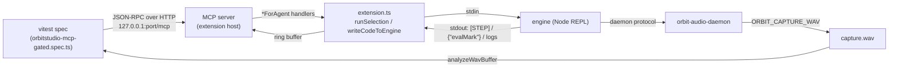

> **Note**: This page is a trace of the author's reading as of 2026-09-01, brought up to #668 PR-E2 (the shared harness layer) on 2026-09-03. The code is the truth; this page is only a snapshot of understanding at that time.

# IV-3. The MCP Server and Gated Real-Device E2E — Testing Through the User's Own Path

[IV-2](/en/editor/execution-feedback) followed what happens between pressing `Cmd+Enter` and the code reaching the engine. This chapter reads one layer further out: the machinery that lets an **agent** (or a test runner) operate the same extension through the same path a human would. There are three players.

1. **An MCP server running inside the extension host** (`packages/vscode-extension/src/mcp-server.ts`)
2. **A gated E2E suite that launches the real OrbitStudio.app and measures the audio**, using that server as its only control surface (`tests/e2e/orbitstudio-mcp-gated.spec.ts`)
3. **The live playhead**, which turns the `[STEP]` lines emitted by the engine into editor highlights (`playhead.ts` and `extension.ts`)

They look like three independent features, but a single line — the engine's stdout — connects them. The `[STEP]` lines of the playhead, the errors returned by `get_log`, and the completion notice of `evaluate_orbitscore` are all the result of the extension sorting that one stdout stream. Keep that line in mind as we read.

---

## Table of contents

1. [Why an MCP server inside the extension host](#why-an-mcp-server-inside-the-extension-host)
2. [Startup conditions and the HTTP layer](#startup-conditions-and-the-http-layer)
3. [Tool catalogue](#tool-catalogue)
4. [What `ok` from `evaluate_orbitscore` means](#what-ok-from-evaluate_orbitscore-means)
5. [`get_log` and the ring buffer](#get_log-and-the-ring-buffer)
6. [The gated E2E harness — driving the real OrbitStudio.app through MCP alone](#the-gated-e2e-harness--driving-the-real-orbitstudioapp-through-mcp-alone)
7. [Capture WAV and RMS assertions](#capture-wav-and-rms-assertions)
8. [Turning discipline into mechanism — the ratchet and assertion hygiene](#turning-discipline-into-mechanism--the-ratchet-and-assertion-hygiene)
9. [The live playhead — from `[STEP]` lines to decorations](#the-live-playhead--from-step-lines-to-decorations)
10. [Running it locally](#running-it-locally)

---

## Why an MCP server inside the extension host

The comment at the top of the file explains where it comes from.

```typescript
// packages/vscode-extension/src/mcp-server.ts:9-18
/**
 * OrbitScore MCP control server — the "Agent Bridge" of WCTM_SYSTEM_SPEC §3.
 *
 * Hosts an MCP server (Streamable HTTP) inside the extension host so an external
 * agent (e.g. Claude Code via `.mcp.json`) can drive OrbitScore operations for
 * E2E testing. The same tool surface is intended for reuse by the WCTM
 * performance runtime (pi harness — spec §4.2 "Bridge は harness-neutral").
 *
 * Only started when `orbitscore.mcpServer.port` is a nonzero port (see
 * extension.ts activate()). Binds 127.0.0.1 only.
```

The starting point is §3 of the WCTM (concert system) spec, "Agent Bridge — an MCP server without a brain". The Bridge is defined as "plumbing only; it has no thinking subject (runtime)", and its job was to hand tools such as `evaluate_orbitscore(code)` and `get_session_tail(n)` to an LLM runtime. This file is that plumbing, **placed inside the VS Code extension**.

A point to note here is why the MCP server was not grown directly on the engine process. The answer appears repeatedly in the tool descriptions — `run_selection` executes "the real "Run Selection" command (Cmd+Enter), including subject-block collection, setDocumentDirectory injection, and the flash animation". In other words, the route an agent takes is **exactly the same function a human triggers by pressing `Cmd+Enter`** (the `runSelection()` we read in IV-2). A separate entry point on the engine would push the extension-side wiring (subject collection, `setDocumentDirectory` injection, flash) out of the tests' field of view.

The "E2E matters most" section of CLAUDE.md records the owner's words:

> MCP ツールを用意して**ユーザーと同じ動線で試験できるようにしているのは「確実な動作を確認するため」**です。

MCP is not a "test back door"; it is **a device that lets a machine walk the same path as the user**. Every design decision in this chapter comes back to that.

The fact that the tool implementations never touch VS Code directly, and are called through an `OrbitScoreToolHandlers` interface instead, is an extension of the same idea.

```typescript
// packages/vscode-extension/src/mcp-server.ts:233-286
/**
 * VSCode-agnostic handler seam. Keeping the tool implementations behind this
 * interface (rather than reaching into the extension directly) means the same
 * handlers can be re-hosted later by the WCTM pi harness (spec §3/§4.2).
 */
export interface OrbitScoreToolHandlers {
  evaluate(code: string): Promise<EvaluateResult> | EvaluateResult
  startEngine(options?: {
    captureWav?: string
    debug?: boolean
  }): Promise<CommandResult> | CommandResult
  stopEngine(): Promise<CommandResult> | CommandResult
  getEngineState(): EngineState
  forceKillScsynth(): Promise<CommandResult> | CommandResult
  listAudioDevices(): Promise<AudioDevicesResult> | AudioDevicesResult
  selectAudioDevice(device: string): Promise<CommandResult> | CommandResult
  configureFlash(options: FlashConfigInput): Promise<FlashConfigResult> | FlashConfigResult
  openFile(path: string): Promise<CommandResult> | CommandResult
  setSelection(range: SelectionInput): CommandResult
  runSelection(): Promise<CommandResult> | CommandResult
  editReplace(args: EditReplaceInput): Promise<CommandResult> | CommandResult
  getEditorState(): EditorState
  saveFile(): Promise<CommandResult> | CommandResult
  getDocumentText(): DocumentText
  getDiagnostics(path?: string): FileDiagnostics[]
  getLog(lines?: number): string[]
  analyzeAudio(
    wavPath: string,
    windowMs?: number,
    perChannel?: boolean,
  ): Promise<AnalyzeAudioResult> | AnalyzeAudioResult
  // ...
}
```

`activate()` in `extension.ts` fills this interface with `*ForAgent` functions such as `evaluateForAgent` / `runSelectionForAgent`. `mcp-server.ts` itself never imports `vscode`. That is why the unit test (`tests/vscode-extension/mcp-server.spec.ts`) can drive the whole HTTP layer with stub handlers.

---

## Startup conditions and the HTTP layer

The server does not start by default. Near the end of `activate()`, the port is decided in the order environment variable → setting.

```typescript
// packages/vscode-extension/src/extension.ts:445-456
  // Optional MCP control server (Agent Bridge, #388) — dev/agent-integration
  // only, gated behind a nonzero port. The `ORBITSCORE_MCP_PORT` env var takes
  // precedence over the `orbitscore.mcpServer.port` setting so the extension can
  // be launched from the CLI (e.g. Extension Development Host) with the port set
  // without editing settings. Lets an external agent (e.g. Claude Code) drive
  // OrbitScore operations for E2E testing.
  const envMcpPort = Number(process.env.ORBITSCORE_MCP_PORT)
  const mcpPort =
    Number.isInteger(envMcpPort) && envMcpPort > 0
      ? envMcpPort
      : vscode.workspace.getConfiguration('orbitscore').get<number>('mcpServer.port', 0)
  if (mcpPort && mcpPort > 0) {
```

The default of `orbitscore.mcpServer.port` is `0` (= disabled) (`packages/vscode-extension/package.json:400-407`). The `ORBITSCORE_MCP_PORT` environment variable takes precedence so that the gated E2E, which launches the app **from the CLI**, does not have to touch settings files. The "pre-merge gate" section of CLAUDE.md, which says to launch with `ORBITSCORE_MCP_PORT=39123` ("without this environment variable the MCP server does not come up"), uses the same route.

The HTTP layer listens on `127.0.0.1:<port>/mcp` using Node's standard `http` module. The MCP Streamable HTTP transport is **stateful**, and a session is created per `initialize`.

```typescript
// packages/vscode-extension/src/mcp-server.ts:1185-1190
 * Sessions are created **per initialize request** and routed by the
 * `mcp-session-id` header. A single shared transport would permanently consume
 * its one session slot on the first client — any later client (or a Claude Code
 * reconnect) would get "Bad Request: Mcp-Session-Id header is required"
 * (observed live, 2026-07-07). Tool handlers stay shared — they close over the
 * same extension state regardless of which session invokes them.
```

A `McpServer` instance is created per session, but the handlers are shared. Whichever client calls, the request lands on the same `engineProcess` — which is what keeps the "same path as the user" property intact.

There is also a judgement that a loopback bind alone is not enough.

```typescript
// packages/vscode-extension/src/mcp-server.ts:1204-1211
  // DNS-rebinding protection: the server binds 127.0.0.1, but a malicious page
  // can point its own domain at 127.0.0.1 (short-TTL rebind) and then fetch()
  // same-origin — reaching this port from a browser with full response access.
  // The Host header still carries the attacker's domain in that case, so an
  // exact-match allowlist of loopback hosts closes the hole. (SDK 1.29.0 has
  // allowedHosts/enableDnsRebindingProtection but marks them deprecated in
  // favor of doing exactly this in the HTTP layer we already own.)
  const allowedHosts = new Set([`127.0.0.1:${port}`, `localhost:${port}`, `[::1]:${port}`])
```

A few paths other than `/mcp` are served too. `/orbitscore/dev/` and `/orbitscore/` serve the VitePress-built learning sites (this site and the user site), and `/docs` redirects there. Serving a stale dist built with a different base makes every asset 404 (`isDocsDistStale`, #480), so that check lives in this layer as well. It is not the subject of this chapter, but it is worth remembering that "the MCP server = the extension's only HTTP surface".

The registration tool for connecting from Claude Code also lives here. `register_mcp_server` merges `mcpServers.orbitscore` into `.mcp.json` for `scope: "project"`, or runs `claude mcp add --transport http --scope user` for `"user"`. Building the URL is a pure function.

```typescript
// packages/vscode-extension/src/mcp-registration.ts:10-13
/** URL where the extension's MCP server listens (see startOrbitScoreMcpServer). */
export function buildMcpServerUrl(port: number): string {
  return `http://127.0.0.1:${port}/mcp`
}
```

---

## Tool catalogue

The tools registered by `buildServer()` via `registerTool`, grouped by role (the descriptions summarise each tool's `description` string).

| Group | Tool | What it does |
|---|---|---|
| **Evaluation** | `evaluate_orbitscore` | Send `.orbs` source to the engine, wait for evaluation to finish, and report whether parse / runtime diagnostics were raised |
| **Engine lifecycle** | `start_engine` | Start the engine (Rust daemon). `capture_wav` records the master output to a WAV; `debug: true` gives verbose logging |
| | `stop_engine` | Stop the engine |
| | `get_engine_state` | Return `{ running, liveCoding }` |
| | `force_kill_scsynth` | `killall` stray scsynth processes (an escape hatch for the SuperCollider path) |
| **Audio devices** | `list_audio_devices` / `select_audio_device` | Enumerate and select devices (on the Rust engine, list is unimplemented and select switches live) |
| **Editor operations** | `open_file` | `openTextDocument` + `showTextDocument` |
| | `set_selection` | Place the selection by 1-based line and column |
| | `run_selection` | The real "Run Selection" command (subject collection, `setDocumentDirectory` injection, flash included) |
| | `edit_replace` | Literal find/replace (in-memory buffer only) |
| | `save_file` | `document.save()` (needed because `edit_replace` does not persist) |
| | `get_editor_state` / `get_document_text` | Metadata / full text of the active editor |
| | `configure_flash` | Flash count, duration, colour |
| **Observation** | `get_diagnostics` | The result of `vscode.languages.getDiagnostics` |
| | `get_log` | The last N lines of the output channel (default 50, cap 1000) |
| | `analyze_audio` | Parse a WAV and return peak / RMS / onsets (`window_ms` adds a time series) |
| **Plugins** | `list_plugins` / `rescan_plugins` | Read / rescan the plugin catalogue (#463) |
| | `save_plugin_state` | Save a running plugin's state (only while the transport is stopped) |
| | `open_plugin_ui` / `close_plugin_ui` | Open / close a plugin UI; close waits for `UI_CLOSED_DONE` (#474 P4c) |
| **Docs** | `get_dev_doc` / `search_dev_docs` | Read / search this site's Markdown |
| **Registration** | `register_mcp_server` | Register this server into Claude Code (`.mcp.json` or `claude mcp add`) |

`save_plugin_state` / `open_plugin_ui` / `close_plugin_ui` / `register_mcp_server` have optional handlers and are not registered on hosts that lack them. This keeps existing stub suites valid when a "different host" such as the WCTM pi harness reuses the seam.

What is interesting is that most of this catalogue mirrors "operations a human can reach from the command palette or settings". `start_engine` is the "Start Engine" command, `configure_flash` is "Configure Flash", `rescan_plugins` is "Rescan Plugin Catalog" — each description names its counterpart command. The policy of **not widening the MCP tool surface even when a new observation is needed** is visible on the E2E helper side too (the comment on `rackChildPidsFromLog` in `tests/e2e/helpers/rack-child-pid.ts`: "**MCP の tool 表面を増やさず**、ERROR 計数や `[plugin-state]` 行と同じ `get_log` 経路で読めるようにしてある").

---

## What `ok` from `evaluate_orbitscore` means

This is the part of the chapter to read most carefully. The tool description makes this promise:

```typescript
// packages/vscode-extension/src/mcp-server.ts:542-559
  server.registerTool(
    'evaluate_orbitscore',
    {
      title: 'Evaluate OrbitScore',
      description:
        'Send OrbitScore (.orbs) source to the running engine live-coding session — ' +
        'the equivalent of "Run Selection" in the editor. The engine must be started ' +
        'first (via the Start Engine command). Waits for the engine to finish evaluating ' +
        'the submitted code and reports the result: ok only when the engine raised no parse ' +
        'or runtime diagnostics. A failure lists the diagnostics, so you do NOT need to poll ' +
        'get_log to find out whether your score was accepted.',
      inputSchema: { code: z.string().describe('OrbitScore source to evaluate') },
    },
    async (args) => {
      const code = typeof args.code === 'string' ? args.code : ''
      return toToolResult(await handlers.evaluate(code))
    },
  )
```

Meanwhile CLAUDE.md repeats that "asserting on the `ok` of `evaluate_orbitscore` proves nothing" and "engine-side errors appear only in `get_log`". Which one is right? **Both, each at its own point in time.** The meaning of `ok` changed with `#614`.

```typescript
// packages/vscode-extension/src/extension.ts:3041-3078
async function evaluateForAgent(code: string): Promise<EvaluateResult> {
  if (!isLiveCodingMode || !engineProcess || engineProcess.killed) {
    return { ok: false, error: 'engine is not running — start the engine first' }
  }
  const documentDir = vscode.workspace.workspaceFolders?.[0]?.uri.fsPath
  if (!writeCodeToEngine(code, documentDir)) {
    return { ok: false, error: 'engine stdin is not writable — the engine may have just died' }
  }
  // 🔴 #614: 以前はここで `{ ok: true }` を返していた。しかしその ok は
  // 「**stdin へ届いた**」までしか意味せず、パース/実行エラーは engine が stderr へ
  // 非同期に出すだけだった。LLM は ok を成功と解釈するので、実機で
  // `Variable not found: global` が出ていても先へ進んでしまう（実測）。
  //
  // REPL は行を FIFO で処理するので、コードの直後にマーカーを送れば
  // **マーカーに到達した時点で評価は完了している**。時間で待つ必要はない。
  const stdin = engineProcess.stdin
  if (!stdin || !stdin.writable) {
    return { ok: false, error: 'engine stdin is not writable — the engine may have just died' }
  }
  const result = await evalMarkBridge.send((line, onError) => {
    // 既存 bridge（pluginUi）と同じ書き方に揃える。error は null 込みで来る。
    stdin.write(line, (error) => {
      if (error) {
        outputChannel?.appendLine(`⚠️ failed to write //#evalMark to stdin: ${error.message}`)
        onError(error)
      }
    })
  }, randomUUID())
  if (result.ok) return { ok: true }
  const detail = result.diagnostics.length
    ? result.diagnostics.map((d) => `[${d.kind}] ${d.message}`).join('; ')
    : (result.error ?? 'engine reported an evaluation failure')
  return {
    ok: false,
    error: `evaluation failed: ${detail}`,
    ...(result.diagnostics.length ? { diagnostics: result.diagnostics } : {}),
  }
}
```

Before `#614`, `ok` meant only "written to stdin". The engine's REPL processes lines FIFO, so if a meta line `//#evalMark {"requestId": ...}` is sent immediately after the code, the preceding code has finished evaluating by the time the marker's response comes back. Rather than "waiting for a settle time" it "waits for the marker to arrive", so even an evaluation that attaches six instruments and takes 30 seconds does not produce a false result.

```typescript
// packages/vscode-extension/src/eval-mark-bridge.ts:14-22
 * 🔴 「どこまで待つか」を時間で決めない
 *
 * REPL は行を **FIFO** で処理する（#476）。コードの直後にマーカーを送れば、
 * **マーカーに到達した時点で先行コードの評価は完了している**。したがって settle 時間や
 * 「エラーが出ないこと」を待つ必要がない。長い評価（instrument 6 本の attach で 30 秒超）
 * でも、待つのは「実際に終わるまで」であって誤検知しない。
 *
 * timeout は最後の安全網としてのみ置く。詰まったキューは #608 の stall reporter が
 * 別途「塞いでいる行」を名指しして報告する。
```

The engine answers with a JSON line `{"evalMark": {...}}` on stdout, and `setupStdoutHandler` hands it to `evalMarkBridge.handleLine()`. The comment stresses that this branch **must be independent**.

```typescript
// packages/vscode-extension/src/extension.ts:1502-1510
        } else if (trimmedLine.startsWith('{"evalMark"')) {
          // 🔴 #614: この分岐は**独立していなければならない**。最初は `{"pluginUi"` 分岐の中に
          // 相乗りさせてしまい、`{"evalMark"` 行は prefix チェーンをすり抜けて一度も
          // dispatch されなかった（ユニットテストは全て緑・実機 E2E だけが捕まえた）。
          const parsed = isCurrent && evalMarkBridge.handleLine(rawLine)
          if (!parsed && isCurrent) {
            outputChannel?.appendLine(`⚠️ received a malformed //#evalMark result line: ${rawLine}`)
          }
        }
```

"Every unit test was green; only the real-device E2E caught it" — a miniature of this chapter's whole theme.

So after `#614`, is `get_log` unnecessary? **No.** What `ok` guarantees is that no diagnostics were raised by the engine up to the point the marker was reached. Failures that occur asynchronously after the evaluation returns still appear only in stdout/stderr. The gated spec itself shows the division of labour: after evaluating `instSeq.instrument(...)` with `evaluate_orbitscore` and confirming `isError` is `false`, it does `sleep(6000)`, then reads `get_log` and asserts separately that `[OUTPROC_ATTACH_FAILED]` is absent (`tests/e2e/orbitstudio-mcp-gated.spec.ts:1017-1029`). An out-of-process CLAP attach involves a spawn plus an IPC handshake, so the completion of the evaluation and the success of the attach live on different timelines.

The comment in `log-ring.ts` still carried its pre-`#614` wording ("`get_log` is the **only channel** in which engine-side errors appear"); this PR rewords it to "the **only channel in which failures that happen asynchronously after evaluation returns** appear". The three matching passages in `CLAUDE.md` ("asserting on `ok` proves nothing") were updated to the post-`#614` meaning as well. **The range over which `ok` carries meaning has widened, but there is still a region where `get_log` is the only observation point** — that is the accurate understanding as of 2026-09-02.

---

## `get_log` and the ring buffer

The extension has no central log sink. So `activate()` monkey-patches the output channel's `appendLine` / `append` to push the same lines into a ring buffer.

```typescript
// packages/vscode-extension/src/extension.ts:138-148
// Ring buffer of output-channel lines for the MCP get_log tool (#388). There is
// no other central log sink to tap, so activate() monkey-patches
// outputChannel.appendLine/append to also push here.
const outputLogRing: string[] = []

function pushLogRing(line: string): void {
  outputLogRing.push(line)
  if (outputLogRing.length > OUTPUT_LOG_RING_MAX) {
    outputLogRing.shift()
  }
}
```

```typescript
// packages/vscode-extension/src/extension.ts:301-312
  const rawAppendLine = outputChannel.appendLine.bind(outputChannel)
  outputChannel.appendLine = (value: string) => {
    pushLogRing(value)
    rawAppendLine(value)
  }
  const rawAppend = outputChannel.append.bind(outputChannel)
  outputChannel.append = (value: string) => {
    for (const line of value.split('\n')) {
      if (line) pushLogRing(line)
    }
    rawAppend(value)
  }
```

In other words, what `get_log` returns is "the same content that appeared in the OrbitScore channel of the Output panel". The engine's stdout does not go in as-is; the lines that pass `shouldFilterLine()` do (this is why `[STEP]` is invisible in normal mode — more on that later).

The logic that selects the last N lines was extracted into a pure function in `#567`. The point is that when the request exceeds the ring capacity, it **does not silently truncate; it prepends a notice line**.

```typescript
// packages/vscode-extension/src/log-ring.ts:35-47
export function selectLogLines(ring: readonly string[], requested?: number): string[] {
  const want = requested ?? DEFAULT_LOG_LINES
  const n = Math.max(1, Math.min(want, OUTPUT_LOG_RING_MAX))
  const out = ring.slice(-n)
  if (want > OUTPUT_LOG_RING_MAX) {
    return [
      `[get_log] truncated: requested ${want} lines, ring buffer holds at most ` +
        `${OUTPUT_LOG_RING_MAX}; returning ${out.length}.`,
      ...out,
    ]
  }
  return out
}
```

Why so much care? The E2E frequently "compares the ERROR count before and after an operation". With a fixed-width window, an old ERROR scrolling out at the same moment a new ERROR scrolls in leaves the count unchanged — a **false green**. `#567` raised the cap from 500 to the actual capacity of 1000 and made truncation part of the response for this reason. The window is still finite, though, so CLAUDE.md rules that "ERROR counts must not be compared with strict equality (use `<=`)". That rule is mechanised by the hygiene test described below.

---

## The gated E2E harness — driving the real OrbitStudio.app through MCP alone

From here on is the body of the chapter. `tests/e2e/orbitstudio-mcp-gated.spec.ts` is a single file of more than 4,500 lines that launches the real OrbitStudio.app (VSCodium rebranded as OrbitStudio; `scripts/orbitstudio/build_orbitstudio.sh`) and operates it **only through MCP tool calls**.



### The gate — not breaking the ordinary `npm test`

```typescript
// tests/e2e/orbitstudio-mcp-gated.spec.ts:10-21
 * ── Env contract ──
 *   ORBIT_GATED_ORBITSTUDIO=1   Required to enable this suite at all. Unset
 *                               (the default) → the whole describe block is
 *                               skipped via describe.skipIf, so this file
 *                               always parses and collects cleanly in normal
 *                               `npm test` runs.
 *   ORBITSTUDIO_APP=<path>      Overrides the OrbitStudio.app bundle path.
 *                               Default:
 *                               /Users/yamato/Src/proj_orbitscore/orbitstudio-build/vscodium/VSCode-darwin-arm64/OrbitStudio.app
 *                               If the resolved path doesn't exist, the test
 *                               is skipped with a console note (rather than
 *                               failing) even when the gate env var is set.
```

```typescript
// tests/e2e/orbitstudio-mcp-gated.spec.ts:62-68
const GATE_ENV = 'ORBIT_GATED_ORBITSTUDIO'
const DEFAULT_APP_PATH =
  '/Users/yamato/Src/proj_orbitscore/orbitstudio-build/vscodium/VSCode-darwin-arm64/OrbitStudio.app'

const gated = Boolean(process.env[GATE_ENV])
const appPath = process.env.ORBITSTUDIO_APP?.trim() || DEFAULT_APP_PATH
const appAvailable = fs.existsSync(appPath)
```

`describe.skipIf(!gated)` skips the whole describe, and each `it` is further guarded by `it.skipIf(!appAvailable)`. The two-stage gate exists so that an environment where "the env var is set but the app is absent" (CI on ubuntu, say) **skips rather than fails**.

### Never measure a stale binary

When the suite is loaded, before a single test runs, it checks the freshness of the daemon binary.

```typescript
// tests/e2e/orbitstudio-mcp-gated.spec.ts:154-164
  if (newest.at > builtAt) {
    throw new Error(
      'gated E2E: the daemon binary is older than the Rust sources, so this run would measure ' +
        `stale code.\n  newest source: ${path.relative(REPO_ROOT, newest.file)}\n` +
        `  binary:        ${new Date(builtAt).toISOString()}\n` +
        `  source:        ${new Date(newest.at).toISOString()}\n` +
        'Rebuild before running (npm run test:e2e:gated does this for you):\n' +
        '  cargo build --release --manifest-path rust/Cargo.toml -p orbit-audio-daemon \\\n' +
        '    --features outproc-effect,outproc-instrument && npm run build',
    )
  }
```

Which binary to inspect is not hardcoded; the guard asks `resolveDaemonBinaryPath()`, the function the engine actually uses to pick its spawn candidate. According to WORK_LOG 6.416 / 6.417, this guard **got the path wrong twice** on 2026-08-29 (it first looked at `rust/target/release/`, while the binary actually running was the copy bundled into the extension at `packages/vscode-extension/engine/bin/<platform>/`). To avoid a shape where "the guard itself can reintroduce the very accident it exists to stop", it settled on calling the canonical resolver.

And as a remedy one step stronger than the guard, the choice was made to **remove the manual step altogether**.

```jsonc
// package.json:18-19
    "pretest:e2e:gated": "cargo build --release --manifest-path rust/Cargo.toml -p orbit-audio-daemon --features outproc-effect,outproc-instrument && npm run build",
    "test:e2e:gated": "ORBIT_GATED_ORBITSTUDIO=1 npx vitest run --dir tests --config vitest.config.ts --globals --pool=forks --poolOptions.forks.singleFork=true e2e/orbitstudio-mcp-gated",
```

npm runs `pre<script>` automatically first, so typing `npm run test:e2e:gated` always runs cargo build and `npm run build` (which refreshes the bundled copy) beforehand. The owner's words in WORK_LOG 6.417 were: "これ手順が確実になったら手動ではない形にした方がいいですよね".

### Launching the app — the `orbs` CLI and the Extension Development Host

```typescript
// tests/e2e/orbitstudio-mcp-gated.spec.ts:723-744
      const orbsBin = path.join(appPath, 'Contents/Resources/app/bin/orbs')
      child = spawn(
        orbsBin,
        [
          '--new-window',
          `--extensionDevelopmentPath=${EXTENSION_DEV_PATH}`,
          `--user-data-dir=${userDataDir}`,
          `--extensions-dir=${extensionsDir}`,
          // `evaluate_orbitscore` は workspace root を documentDirectory として渡すので、
          // プロジェクト（project.yaml / states/）を置く tmpRoot を workspace として開く。
          // これはユーザーが曲フォルダを開く実際の使い方とも一致する。
          tmpRoot,
        ],
        {
          env: {
            ...appEnv,
            ORBITSCORE_MCP_PORT: String(port),
          },
          stdio: 'ignore',
          detached: false,
        },
      )
```

`--extensionDevelopmentPath` loads the extension source straight from the repository, and `--user-data-dir` / `--extensions-dir` point at temporary directories to isolate the run from the developer's own settings. The port is chosen as `39400 + Math.floor(Math.random() * 200)`, and `pollInitialize()` hits `initialize` every 2 seconds for up to 60 seconds until the connection comes up. The client (`tests/e2e/helpers/mcp-client.ts`) is raw JSON-RPC without the MCP SDK — a thin layer that just extracts `content[0].text` and `isError` from `tools/call`.

The teardown repeats a safety warning.

```typescript
// tests/e2e/orbitstudio-mcp-gated.spec.ts:247-253
function killOrbitStudio(): void {
  try {
    execFileSync('pkill', ['-f', 'OrbitStudio.app/Contents/MacOS'], { stdio: 'ignore' })
  } catch {
    // pkill exits non-zero when no process matched — not an error here.
  }
}
```

The pattern must never be widened to `Code` or `Electron`, it says in two places. The reason is a past incident in which the user's actual VS Code was killed.

### `capture_wav` is a spawn-only option

Capture can only be enabled by passing the `ORBIT_CAPTURE_WAV` environment variable at daemon spawn time. The extension auto-starts the engine during `activate()`, so the gated spec **stops the auto-started engine first**, then starts it again with capture.

```typescript
// tests/e2e/orbitstudio-mcp-gated.spec.ts:861-866
      const preStopRes = await client.call('stop_engine')
      expect(preStopRes.isError, preStopRes.text).toBe(false)
      await waitForEngine(false, 15_000, 'engine stopped')

      const startRes = await client.call('start_engine', { capture_wav: captureWavFile })
      expect(startRes.isError, startRes.text).toBe(false)
```

What happens when `start_engine` is called with `capture_wav` while an engine is already running is also decided by a pure function.

```typescript
// packages/vscode-extension/src/engine-lifecycle.ts:271-291
export function decideStartEngineForAgent(
  engineRunning: boolean,
  options?: { captureWav?: string; debug?: boolean },
): StartEngineDecision {
  if (!engineRunning) return { kind: 'spawn' }

  const spawnOnlyOptions = [
    options?.captureWav ? 'capture_wav' : null,
    options?.debug ? 'debug' : null,
  ].filter((option): option is string => option !== null)
  if (spawnOnlyOptions.length > 0) {
    return {
      kind: 'reject',
      error:
        `engine is already running; requested spawn-only option(s): ${spawnOnlyOptions.join(', ')}. ` +
        'The existing engine may already have different spawn settings. Call stop_engine first, ' +
        'then start_engine again with the requested option(s).',
    }
  }
  return { kind: 'already-running' }
}
```

The old implementation returned `ok: true, 'engine already running'` here and silently dropped `captureWav`. The caller believed it was recording and only discovered `ENOENT` when it tried to read `capture.wav`. As the regression pin for `#528`, the gated spec asserts both "it is rejected" and "the rejection does not tear the engine down" (`tests/e2e/orbitstudio-mcp-gated.spec.ts:844-853`).

### Test list

As of 2026-09-01 the describe holds 20 `it`s. The first one launches the app, initialises the catalogue and starts the engine with capture; the rest assume that state (which is why WORK_LOG 6.409 records that narrowing to one test with `-t` fails with `catalogClapEffectPath` uninitialised).

| Line | Test name (summary) | Main oracle |
|---|---|---|
| 636 | The real OrbitStudio end-to-end: diagnostics-on-open, `run_selection`, live edit, capture verification | Onset gaps (120 → 180 bpm) |
| 1433–1687 | #643 E2E-1 to 7: `global.gain(-6)` / sequence rack / gap during attach / `output(sum)` + `send(aux)` / instrument replacement / slot release / instrument without a mixer declaration | Segment RMS ratios |
| 1732, 1808 | #633 E2E-1 to 2: UI open/close on multiple identical inserts; close after an index shift | `open_plugin_ui` / `close_plugin_ui` responses |
| 1878 | Catalogue v2 rescan, reporting a broken bundle | `rescan_plugins` failures |
| 1949 | Reporting an ambiguous bare mixer name via `run_selection` + `get_log` | Log wording |
| 2040 | The playhead steps through an `instrument()` sequence, rests included (#654) | The set of `[STEP]` slots |
| 2139, 2381, 2602 | Plugin state restore across restart (instrument / sum-bus insert / auto-record of five receiver kinds) | Measured pitch, RMS |
| 3157, 3421 | Replacing a playing instrument / effect (#618 / #625) | Audio, state, process, failure, UI |
| 3961, 4473 | #628 R28: rack chain audio mainline / master + standard-element error | RMS, child PID |

---

### The shared harness layer — `tests/e2e/helpers/`

On 2026-09-03 (#668 PR-E2) the small tools each scenario had been keeping locally were collected into five modules under `tests/e2e/helpers/`. **The 20 existing scenarios themselves were not rewritten** — only duplicated definitions and path construction were swapped out.

| Module | What it holds |
|---|---|
| `engine-log.ts` | `LOG_WINDOW_LINES` / `countLogMarker` / `countErrors` / `errorBaseline` / `expectNoNewErrors` / `expectLogMarkerAtLeast` |
| `gated-session.ts` | `GatedCatalog` / `GatedSession` / `captureWavPath` / `createGatedSession` |
| `run-score.ts` | `ScoreSource` / `CaptureWindows` / `ScoreRunContext` / `runScore` |
| `wait-for-file.ts` | `waitForFile` / `waitForMatchingFile` |
| `run-cli.ts` | `CliResult` / `runOrbitscoreCli` |

`countErrors` had **seven** independent definitions inside the gated spec (at pre-change lines `:496 / 2144 / 2722 / 3155 / 3461 / 3969 / 4464`). The same single line was written seven times, so changing how ERROR lines are counted meant editing seven places — and a missed one stays silently behind. They now converge on `expectNoNewErrors`, which pins the comparison to `<=` in one place.

```typescript
// tests/e2e/helpers/engine-log.ts:51-62
export async function expectNoNewErrors(
  client: McpClient,
  baseline: number,
  label: string,
): Promise<void> {
  const log = (await client.call('get_log', { lines: LOG_WINDOW_LINES })).text
  const current = countErrors(log)
  expect(
    current,
    `${label} must add no ERROR lines. Log tail: ${log.slice(-1600)}`,
  ).toBeLessThanOrEqual(baseline)
}
```

Capture WAV paths were scattered the same way. The spec builds a capture path in **13 places**, but **only one of them — inside `captureInstrumentScenario` — looked at `ORBIT_KEEP_CAPTURES`** (pre-change `:501-509`); the other twelve were a bare `path.join(tmpRoot, ...)`. So when one of those scenarios failed, the WAV that was supposed to be the evidence was deleted along with `tmpRoot` in `afterAll`. All 13 now go through `captureWavPath()`, so the environment variable behaves uniformly.

```typescript
// tests/e2e/helpers/gated-session.ts:47-51
export function captureWavPath(tmpRoot: string, slug: string): string {
  const dir =
    process.env.ORBIT_KEEP_CAPTURES !== undefined ? process.env.ORBIT_KEEP_CAPTURES : tmpRoot
  return path.join(dir, `${slug}.wav`)
}
```

`runScore` folds "copy the score into a work copy, evaluate it through the editor path (`open_file` → `set_selection` → `run_selection`), and if asked, analyse the capture and return segment RMS" into one function. Its `evaluate` deliberately does not assert on `ok` / `isError`, for the reason given in [the `ok` section](#what-ok-from-evaluate-orbitscore-means) of this chapter.

```typescript
// tests/e2e/helpers/run-score.ts:196-205
  const evaluate = async (code: string): Promise<void> => {
    // 🔴 **`ok` / `isError` に assert しない**（設計 §4.2）。診断は `engine-log.ts` の
    // `expectNoNewErrors` / `expectLogMarkerAtLeast` で見る。
    //
    // なぜ assert しないか: **診断が出ることを確かめる E2E がある**（doc 610 の異常系は
    // 「この譜面は診断を出す」が判定条件）。ここで弾くと、そちらが `runScore` を使えない。
    // 逆に #614 以降 `ok` は「評価完了までに診断が無かった」までしか保証しないので、
    // 正常系でも `ok` は十分条件にならない（評価後に非同期で起きる失敗は `get_log` だけに出る）。
    await client.call('evaluate_orbitscore', { code })
  }
```

As of PR-E2 no scenario calls `runScore` yet (the policy was not to rewrite the existing 20). Its first consumer is planned for PR-E3.

⚠️ `tests/e2e/helpers/` is **not** part of `GATED_SOURCE_GLOBS` in `gated-sources.ts` (`orbitstudio-mcp-gated.spec.ts` and `gated/**`). The ratchet and the assertion hygiene test described below both read only the string returned by `readGatedSources()`, so helper sources are outside what they scan.

---

## Capture WAV and RMS assertions

"Audio is digital, so it can be observed" — the phrase from CLAUDE.md. The gated spec judges without listening. The analyser is `packages/vscode-extension/src/wav-analysis.ts`, which reads the daemon's capture format (RIFF/WAVE, IEEE float32) and computes 20 ms-window RMS, peak and onsets over the mono mixdown.

```typescript
// packages/vscode-extension/src/wav-analysis.ts:158-197
  const rms = Math.sqrt(sumSq / Math.max(1, frames))

  // Onsets: window RMS rises past threshold from below, with a minimum gap.
  const sorted = [...windows].sort((a, b) => a - b)
  const noiseFloor = sorted[Math.floor(sorted.length / 2)] ?? 0
  const threshold = Math.max(noiseFloor * 4, ONSET_THRESHOLD_FLOOR)
  const minGapWindows = Math.ceil(MIN_ONSET_GAP_SEC / WINDOW_SEC)
  const onsets: number[] = []
  let lastOnset = -minGapWindows
  for (let w = 1; w < windows.length; w++) {
    const rising = windows[w]! >= threshold && windows[w - 1]! < threshold
    if (rising && w - lastOnset >= minGapWindows) {
      onsets.push(w * WINDOW_SEC)
      lastOnset = w
    }
  }
  const onsetGaps = onsets.slice(1).map((t, i) => t - onsets[i]!)

  return {
    format,
    frames,
    durationSec,
    peak,
    rms,
    onsets,
    onsetGaps,
    soundDetected: onsets.length >= 1 && peak > 0.05,
    ...(opts?.windowMs && opts.windowMs > 0
      ? { windows: windowSeries(buf, dataOff, frames, format, opts.windowMs / 1000) }
      : {}),
    // ...
  }
```

The onset threshold is the larger of "median window RMS × 4" and the absolute floor `0.01`. `soundDetected` is "at least one onset and peak > 0.05", relaxed in `#478` from "three or more" (it had been misreporting a single one-shot as silence). The robustness against a WAV whose header was never finalised (data chunk size 0) — read to EOF — absorbs the capture accident that preceded `#651` (WORK_LOG 6.416: RIFF size=36 / data size=0 while holding 2.29 MB of data).

The last assertion of the first test uses these onset gaps as evidence of tempo.

```typescript
// tests/e2e/orbitstudio-mcp-gated.spec.ts:1402-1416
      // ── 9. Objective audio verification (no listening required) ──
      const wavBuf = fs.readFileSync(captureWavFile)
      const analysis = analyzeWavBuffer(wavBuf)
      expect(analysis.soundDetected, JSON.stringify(analysis)).toBe(true)

      const gapsAt120bpm = analysis.onsetGaps.filter((g) => g >= 0.45 && g <= 0.57)
      const gapsAt180bpm = analysis.onsetGaps.filter((g) => g >= 0.29 && g <= 0.4)
      expect(
        gapsAt120bpm.length,
        `expected >=3 gaps in [0.45,0.57]s (120bpm), got onsetGaps: ${JSON.stringify(analysis.onsetGaps)}`,
      ).toBeGreaterThanOrEqual(3)
      expect(
        gapsAt180bpm.length,
        `expected >=3 gaps in [0.29,0.40]s (180bpm), got onsetGaps: ${JSON.stringify(analysis.onsetGaps)}`,
      ).toBeGreaterThanOrEqual(3)
```

`kick_loop.orbs` plays a kick on every quarter note at 120 bpm; midway, `edit_replace` rewrites it to `global.tempo(180)` and re-evaluates. If there are at least three onset gaps at 0.5 s **and** at least three at 0.333 s, then "run_selection worked", "edit_replace + run_selection changed it live", and "sound came out" are proven together.

The `#643` tests go one step further and compare RMS per time segment. The wall-clock time of each operation is recorded as a segment, mapped back onto the WAV from the capture end time, and the 20 ms-window RMS values in that interval are combined as a root mean square.

```typescript
// tests/e2e/orbitstudio-mcp-gated.spec.ts:585-590
    const rms = (name: string, guardSec = 0.15): number => {
      const selected = windows(name, guardSec)
      return Math.sqrt(
        selected.reduce((sum, window) => sum + window.rms * window.rms, 0) / selected.length,
      )
    }
```

E2E-1, for example, compares `rms('unity')` and `rms('half')` to confirm that `global.gain(-6)` roughly halves the RMS ($10^{-6/20} \approx 0.501$).

What this assertion caught is recorded in WORK_LOG 6.415. On 2026-08-29, when this E2E was written and run on the real device, it turned out that **`global.gain()` had no effect at all on instruments**. The cause was in `output.rs`: audio joining the master from the mixer stages **was added after the master gain had been applied**. Every layer returned success, not a single ERROR line appeared, and neither 35 mutation checks nor 2149 unit tests had caught it. CLAUDE.md cites this case as the grounds for "E2E matters most" because it was the only layer able to catch "**looks correct, but the composition is wrong**".

`ORBIT_KEEP_CAPTURES=<dir>` was formalised the same day. When set, capture WAVs are written to that directory instead of tmpRoot — because "the harness's assertions show only one number inside the window, but the defect may be outside it" (6.415). It only started taking effect across the whole spec with #668 PR-E2, though: before that, one of the 13 capture-path sites honoured it ([the shared harness layer](#the-shared-harness-layer-—-tests-e2e-helpers)).

---

## Turning discipline into mechanism — the ratchet and assertion hygiene

The title of WORK_LOG 6.418 is "turning today's corrections from 'knowledge' into a 'reproducible mechanism'". CLAUDE.md said "when you add a DSL feature, always add an E2E test", yet measurement showed that 19 of the 32 `seq` words had never been evaluated on the real device. Prose is sometimes not read. So two tests inspect the **source of the gated E2E itself**.

### One place owns the list of files to scan

Both checks work by reading the source of the gated E2E, so letting each of them hard-code **which files to read** goes badly. The moment a scenario is moved out into another file, the ratchet reads it as "words that used to be covered have disappeared" and turns red, while assertion hygiene never sees the new file and **silently keeps passing**. The second one is the nastier of the two, precisely because it does not go red: nothing tells you the check has stopped biting. So the scan list lives in one place, `tests/e2e/gated-sources.ts`.

```typescript
// tests/e2e/gated-sources.ts:29-35
const GATED_SOURCE_GLOBS: readonly {
  readonly dir: string
  readonly match: (name: string) => boolean
}[] = [
  { dir: E2E_DIR, match: (name) => name === 'orbitstudio-mcp-gated.spec.ts' },
  { dir: path.join(E2E_DIR, 'gated'), match: (name) => name.endsWith('.ts') },
]
```

The entry point `orbitstudio-mcp-gated.spec.ts` is the only spec vitest discovers, which is what keeps the app launch down to one. The `gated/` directory is the slot left open for the scenario bodies themselves; since those files are not named `.spec.ts`, vitest does not discover them. In other words they are **visible to the checks, but look like a single file to the test runner**.

One more thing is settled here: what happens when the list comes out empty.

```typescript
// tests/e2e/gated-sources.ts:74-89
/** 各ソースを「相対パス + 中身」で返す。行番号つきで報告したい検査はこちらを使う。 */
export function readGatedSourceEntries(): readonly {
  readonly file: string
  readonly source: string
}[] {
  if (GATED_SOURCE_FILES.length === 0) {
    throw new Error(
      'gated E2E のソースが 1 本も見つからない。' +
        'ラチェットと衛生検査が黙って無意味になるので、GATED_SOURCE_GLOBS を確認すること。',
    )
  }
  return GATED_SOURCE_FILES.map((file) => ({
    file: path.relative(E2E_DIR, file),
    source: fs.readFileSync(file, 'utf8'),
  }))
}
```

連結して返す `readGatedSources()` は、この関数の結果をファイル境界のマーカーで繋ぐだけです。
読み取りとガードが 1 箇所にあるので、**片方だけ直して他方を直し忘れる**ということが起きません。

If the entry spec is renamed or a directory is moved and the list empties out, both checks would read "found nothing" as "zero violations" — every test green and both checks meaningless. So when not a single source file is found, it throws.

There are two ways to read the list. The ratchet does not care which file or which line a match came from, so it uses `readGatedSources()`, which returns all sources concatenated into one string. Assertion hygiene, which wants to name the offending line, uses `readGatedSourceEntries()` — relative path plus contents, per file — and reports in `file:line` form.

```typescript
// tests/e2e/gated-assertion-hygiene.spec.ts:25-29
/** ファイル名つき・行番号つきで、条件に合う行を集める。 */
const linesMatching = (predicate: (line: string) => boolean): string[] =>
  lines
    .filter(({ line }) => predicate(line))
    .map(({ file, line, n }) => `${file}:${n}: ${line.trim()}`)
```

### The DSL coverage ratchet

```typescript
// tests/e2e/dsl-e2e-coverage.spec.ts:47-57
function methodsExercisedByGatedE2E(): ReadonlySet<string> {
  // 🔴 走査先は `gated-sources.ts` が持つ（#668 §3.4・PR-E1）。ここで 1 ファイルを決め打ちすると、
  // シナリオを別ファイルへ出した時に**カバー済みの語が未カバー扱いになって red** になる。
  const source = readGatedSources()
  const found = new Set<string>()
  for (const match of source.matchAll(/\.([a-zA-Z][a-zA-Z0-9]*)\s*\(/g)) {
    const name = match[1]
    if (name !== undefined) found.add(name)
  }
  return found
}
```

It only checks whether `.<name>(` appears anywhere in the gated E2E sources returned by `readGatedSources()`. The vocabulary side is `SEQUENCE_DSL_METHODS` / `GLOBAL_DSL_METHODS` from `packages/engine/src/signal-chain/runtime` — the interpreter's dispatch table itself.

```typescript
// tests/e2e/dsl-e2e-coverage.spec.ts:150-160
  it('A-1 does not leave a new sequence method untested on real hardware', () => {
    const now = uncovered(SEQUENCE_DSL_METHODS)
    const baseline = new Set(SEQUENCE_UNCOVERED_BASELINE)
    const regressions = now.filter((name) => !baseline.has(name))
    expect(
      regressions,
      'A sequence DSL method was added (or its E2E removed) without real-device coverage. ' +
        'Add a gated E2E that evaluates it — for anything audible, assert on the captured RMS, ' +
        'not on the `ok` of evaluate_orbitscore. See CLAUDE.md「DSL 機能を足したら E2E も足す」.',
    ).toEqual([])
  })
```

"Red when the uncovered words grow; never red when they shrink" — that is the ratchet. The baseline (`SEQUENCE_UNCOVERED_BASELINE` / `GLOBAL_UNCOVERED_BASELINE`) may only be edited in the shrinking direction. A separate `it` also fails the state "still in the baseline but actually covered" (otherwise the ratchet would slip the next time someone added a word with the same name). When the playhead E2E was added in `#654`, the baseline shrank from 19 to 16 (`length` / `octave` / `run` became covered). As of 2026-09-01 the `seq`-side baseline holds 16 words.

Its limits are stated honestly too. Since it only scans the source as text, it does not see "whether that E2E verifies anything meaningful". The rule "anything audible must be judged by capture numbers" only bites in combination with the next test.

### Assertion hygiene

```typescript
// tests/e2e/gated-assertion-hygiene.spec.ts:32-46
  it('never asserts on a bare ERROR count equality', () => {
    // `get_log` は固定 500 行窓なので、ERROR 件数の**厳密等価**は窓の外へ流れた瞬間に
    // 嘘になる（#625）。`<=` / `toBeLessThanOrEqual` を使うこと。
    const offenders = linesMatching(
      (line) =>
        /errorsBefore|errorCount|countErrors/.test(line) &&
        /toBe\(|toEqual\(/.test(line) &&
        !/LessThanOrEqual|GreaterThan/.test(line),
    )
    expect(
      offenders,
      'ERROR counts come from a fixed 500-line window; compare with toBeLessThanOrEqual, ' +
        'not strict equality (see CLAUDE.md #625).',
    ).toEqual([])
  })
```

The remaining two check "does a spec that uses capture actually contain an `rms(` / `peak(` / `.rms` assertion" and "does the stale guard call `resolveDaemonBinaryPath()`". 6.418 records that it detected one real violation immediately after being written (`.toBe(errorCountBeforeMixer)`, corrected to `<=`).

Incidentally, the "fixed 500-line window" in the comment is the number from before `#567` widened it to 1000 lines; the window is still finite, so the rule itself stands.

---

## The live playhead — from `[STEP]` lines to decorations

Finally, we read the path that turns the same stdout into **visual feedback for humans**. The playhead, introduced in `#390`, highlights the `play()` argument currently sounding in the editor.

### Grammar and sources

```typescript
// packages/vscode-extension/src/playhead.ts:4-17
 * The engine (rust-engine-player.ts) prints one machine-readable line per
 * dispatched play event:
 *
 *     [STEP] <seqName> <argPath> <atEpochMs>
 *
 * - `argPath`: dot-joined indices into the `play()` argument tree. The MVP
 *   emits the top-level index only ("0", "1", ...); nested subdivision paths
 *   ("1.0") are reserved for a later phase.
 * - `atEpochMs`: absolute epoch ms of the event's GRID time (the scheduler's
 *   intended onset). Play events are dispatched lookahead-early, so the line
 *   arrives EARLIER than this time — the extension must delay the decoration
 *   until `atEpochMs`. Actual audio lands ~one daemon lookahead (~50ms) after
 *   the grid time; that shift is a uniform constant across all sequences, so
 *   the playhead stays mutually consistent (merely uniformly early).
```

```typescript
// packages/vscode-extension/src/playhead.ts:39-54
// Grammar: "[STEP] <seqName> <argPath> <atEpochMs>". seqName is a DSL
// identifier (no whitespace); argPath is dot-joined non-negative integers;
// atEpochMs is an integer (the engine rounds fractional bar subdivisions).
const STEP_LINE_RE = /^\s*\[STEP\]\s+(\S+)\s+(\d+(?:\.\d+)*)\s+(\d+)\s*$/

/**
 * Parse one stdout line as a `[STEP]` marker. Returns null for anything that
 * does not match the grammar exactly (the stdout stream is mostly human logs).
 */
export function parseStepLine(line: string): StepEvent | null {
  const m = line.match(STEP_LINE_RE)
  if (!m) return null
  const atEpochMs = Number(m[3])
  if (!Number.isSafeInteger(atEpochMs)) return null
  return { seqName: m[1], argPath: m[2], atEpochMs }
}
```

The audio-side source is a single place in `rust-engine-player.ts`.

```typescript
// packages/engine/src/audio/rust-engine/rust-engine-player.ts:1556-1562
  private emitStepMarker(play: ScheduledPlay): void {
    if (play.sequenceName && play.argPath !== undefined) {
      console.log(
        `[STEP] ${play.sequenceName} ${play.argPath} ${Math.round(this.startTime + play.time)}`,
      )
    }
  }
```

This is where `#654` enters. According to WORK_LOG 6.421, when a new seven-layer piece for SIGMUS was played on the real device, only the single `audio()` gong layer stepped the playhead while the six Kontakt layers sat frozen. Not a regression but **one-winged from the start** — only the audio path emitted `[STEP]`; the MIDI side discarded `argPath` in Stage C of `sequence.ts`. The fix was TypeScript only: a marker-only action was added to `MidiScheduler`.

```typescript
// packages/engine/src/midi/midi-scheduler.ts:171-176
  scheduleStepMarker(time: number, owner: string, argPath: string): void {
    const atEpochMs = Math.round(time)
    this.enqueue(time, owner, () => {
      console.log(`[STEP] ${owner} ${argPath} ${atEpochMs}`)
    })
  }
```

```typescript
// packages/engine/src/core/sequence.ts:1394-1404
    if (owner) {
      const markedSlots = new Set<string>()
      for (const ev of timedEvents) {
        if (ev.argPath === undefined) continue
        const at = schedulerStartTime + baseTime + ev.startTime
        const slot = `${ev.argPath}@${at}`
        if (markedSlots.has(slot)) continue
        markedSlots.add(slot)
        scheduler.scheduleStepMarker(at, owner, ev.argPath)
      }
    }
```

The design decisions are listed in 6.421. Making `owner` double as the queue owner means `stop()` cancels the markers together with the notes (a playhead that keeps marching after stop is worse than one that never moved). Rests `0` and ties `_` are marked too (otherwise the highlight hops between notes only). A stack `[ ]` yields one `TimedEvent` per voice, so markers are deduplicated to one per slot. And the marker sits at the grid time without `sendDelay` — the audio side marks the grid as well, and mixing in per-port send compensation would make the layers incomparable.

### Extension side — classify, delay, decorate

Each stdout line is classified by a pure function in `engine-lifecycle.ts`.

```typescript
// packages/vscode-extension/src/engine-lifecycle.ts:76-85
export function classifyEngineStdoutLine(rawLine: string): EngineStdoutLineIntent {
  const step = parseStepLine(rawLine)
  return {
    rawLine,
    step,
    stoppedSequence: step ? null : (rawLine.match(/⏹\s+(\S+)/)?.[1] ?? null),
    globalStopped: !step && rawLine.includes('✅ Global stopped'),
    selectAudioDeviceCandidate: !step && rawLine.trim().startsWith('{"selectAudioDevice'),
  }
}
```

```typescript
// packages/vscode-extension/src/engine-lifecycle.ts:128-134
    if (!isCurrent) continue
    if (intent.step) {
      effects.handleStep(intent.step)
      continue
    }
    if (intent.stoppedSequence) effects.clearSequence(intent.stoppedSequence)
    if (intent.globalStopped) effects.clearAllPlayheads()
```

State mutations are guarded by `isCurrent` (whether the process that produced this chunk is the current `engineProcess`) to avoid the `#528` race in which a dead process's trailing output, arriving after a fast `stop_engine → start_engine`, would clear the new engine's playhead.

The real `handleStep` is in `extension.ts`, and it **waits until the grid time** before moving the highlight.

```typescript
// packages/vscode-extension/src/extension.ts:235-246
function handleStepLine(step: StepEvent): void {
  const delayMs = step.atEpochMs - Date.now()
  if (delayMs < -1000) return
  const timeout = setTimeout(
    () => {
      playheadTimeouts.delete(timeout)
      showPlayheadStep(step)
    },
    Math.max(0, delayMs),
  )
  playheadTimeouts.add(timeout)
}
```

Dispatch runs a lookahead early, so lighting the highlight the moment the line arrives would move it ahead of the sound. Lines more than one second late (replayed buffered output, for example) are dropped.

```typescript
// packages/vscode-extension/src/extension.ts:248-267
function showPlayheadStep(step: StepEvent): void {
  for (const editor of vscode.window.visibleTextEditors) {
    // Resolves the full dot path ("1.0" → first element inside the 2nd arg),
    // degrading to the deepest resolvable ancestor (stacks are one visual
    // unit). Null = even the top-level arg is gone (user edited away the
    // pattern) — skip; leaving the previous highlight is less misleading
    // than lighting a wrong arg.
    const argRange = findPlayArgRangeForPath(editor.document.getText(), step.seqName, step.argPath)
    if (!argRange) continue
    playheadActiveRanges.set(step.seqName, {
      docUriString: editor.document.uri.toString(),
      range: new vscode.Range(
        editor.document.positionAt(argRange.start),
        editor.document.positionAt(argRange.end),
      ),
    })
    applyPlayheadDecorations()
    return // first visible editor containing the call wins (MVP)
  }
}
```

`findPlayArgRangeForPath()` (`playhead.ts`) finds the first `<seqName>.play(` in the document text and, tracking bracket depth, splits it into the character ranges of the top-level arguments. One active range is kept per sequence and replaced on every step, so the highlight appears to "move per beat and wrap at the loop start". Colours are assigned in order of first appearance from `orbitscore.playheadPalette` (by default 32 colours based on the Tokyo Metro / Toei line colours), and one decoration type per colour is created lazily.

### `[STEP]` is invisible in normal mode

```typescript
// packages/vscode-extension/src/extension.ts:1154-1178
function shouldFilterLine(line: string): boolean {
  const trimmed = line.trim()

  // Machine-readable playhead markers (#390): parsed by setupStdoutHandler
  // from the raw stream BEFORE this filter runs; pure noise for humans
  // (~pattern-length lines per bar per seq), so keep them out of the channel.
  if (line.includes('[STEP]')) {
    return true
  }

  // Correlated REPL bridge envelopes are consumed above before human-log
  // transcription. Keep successful/error payloads (which may contain project
  // paths) out of the output channel; malformed envelopes get their own loud warning.
  //
  // 🔴 `{"evalMark"` を落とすのは見た目の問題ではない: envelope は失敗診断の本文
  // （例: `[OUTPROC_ATTACH_FAILED] ...`）を丸ごと含むので、transcribe されると
  // 同じ失敗が log に**二重に**現れ、get_log を数える側（E2E・LLM の自己検証）の
  // 前後比較が全部ずれる（#614 の導入時にこの除外が漏れていた実害）。
  if (
    trimmed.startsWith('{"savePluginState"') ||
    trimmed.startsWith('{"pluginUi"') ||
    trimmed.startsWith('{"evalMark"')
  ) {
    return true
  }
```

The playhead reads from the raw stream, and `[STEP]` never reaches the output channel (= `get_log`). This means **the only way to observe the playhead from MCP is debug mode**. In debug mode `transcribeLog` appends `output` as-is, so `[STEP]` lines appear in `get_log`. The `#654` E2E takes exactly that shape.

```typescript
// tests/e2e/orbitstudio-mcp-gated.spec.ts:2039-2049
      const dslLines = [
        'var global = init GLOBAL',
        'global.tempo(120)',
        'var ph654 = init global.seq',
        'ph654.beat(4 by 4).length(1)',
        `ph654.instrument(${JSON.stringify(catalog.clapSynthName)})`,
        'ph654.octave(4)',
        'ph654.play(1, 0, 3, 0)',
        'global.start()',
        'ph654.run()',
      ]
```

```typescript
// tests/e2e/orbitstudio-mcp-gated.spec.ts:2052-2053
      const start = await activeClient.call('start_engine', { debug: true })
      expect(start.isError, start.text).toBe(false)
```

```typescript
// tests/e2e/orbitstudio-mcp-gated.spec.ts:2109-2111
        // Slots 1 and 3 carry no note, so their presence is the whole point:
        // this is what a note-only marker stream would fail.
        expect([...seenSlots].sort()).toEqual(['0', '1', '2', '3'])
```

The point is that slots 1 and 3 are rests (`0`). An implementation that "marks only where there is a note" fails this assertion. Debug-mode logs are verbose, so `get_log` is polled every 200 ms and the slots are added to an **accumulating Set** (a fresh Set on each poll would never see all four, because an early slot scrolls out of the window).

The same `[STEP]` lines and the same `get_log` route serve humans as the playhead and machines as the E2E oracle — this is what "connected by a single line" at the top of the chapter meant.

---

## Running it locally

The prerequisite is a built OrbitStudio.app on macOS (`scripts/orbitstudio/README.md`; the workspace is outside git, and the extension is not bundled, so it is loaded with `--extensionDevelopmentPath`).

```bash
# 実機 gated E2E（cargo build + npm run build が pretest で自動実行される）
npm run test:e2e:gated

# アプリの場所を変える / キャプチャ WAV を残す
ORBITSTUDIO_APP=/path/to/OrbitStudio.app ORBIT_KEEP_CAPTURES=/tmp/captures npm run test:e2e:gated
```

Running it launches a GUI app and plays audible sound, so, as CLAUDE.md instructs, it is **not to be run unattended or unprompted**. In an ordinary `npm test` without the gate env var the whole describe is skipped, and only the ratchet and hygiene tests run every time.

To poke at it interactively from an agent (Claude Code), launch OrbitStudio with `ORBITSCORE_MCP_PORT=39123` and register it into `.mcp.json` with the `register_mcp_server` tool or the "Register Claude Code MCP Server" command. The procedure defined in the "pre-merge gate" section of CLAUDE.md has three steps: confirm startup with `get_engine_state` → evaluate the PR's DSL with `evaluate_orbitscore` → **check for ERROR with `get_log`**. The same section carries the warning to "always quit any running OrbitStudio before launching again" (a stale extension host spawning a new daemon ends in `DaemonStartupError`).

---

## Related terms

- **Agent Bridge**: the "MCP server without a brain" of WCTM spec §3. The MCP server in this chapter is its implementation
- **capture seam**: the daemon mechanism that writes the master output to a WAV (`ORBIT_CAPTURE_WAV`). It can only be enabled at spawn time
- **ratchet**: a test whose baseline of uncovered DSL words "can only be edited in the shrinking direction"
- **`[STEP]`**: the machine-readable line the engine prints to stdout for the playhead

## Related ADRs

- None. As of 2026-09-01, no ADR under `sites/dev/decisions/` (ADR-001 to 003) covers the MCP server, the gated E2E, or the playhead. The design history is spread across WORK_LOG (6.348 / 6.409 / 6.415 to 6.418 / 6.421) and WCTM spec §3

---

## Next exploration candidates

- The docs-serving part of `mcp-server.ts` (`/orbitscore/dev/`, `isDocsDistStale`) and `get_dev_doc` / `search_dev_docs` — the route by which the learning site enters an agent's context
- The `EvalMarkBridge` timeout (120 seconds) and its coordination with the `#608` stall reporter — how a blocked queue gets its "blocking line" named
- Nested resolution in `findPlayArgRangeForPath()` (the descend condition for `"1.0"` and the handling of group runs), and the seam for the planned `seq.color()` in `#391` (`PlayheadColorConfig.seqColors`)
- How the two-layer structure of `docs/testing/E2E_HARNESS_SPEC.md` (offline deterministic layer + real-device wiring layer) plans to replace the gated spec's "wiring smoke"
- `estimateFundamentalHz()` in `analyze_audio` — how the plugin-state restore tests assert "the same measured pitch"
- The safety envelope of `killOrbitStudio()` / `replaceGatedPluginFixtureSymlink()` (allowlists) — the boundary that keeps the harness from damaging the user's environment
- Improving the structure that prevents gated tests from running one at a time (WORK_LOG 6.409)

## Sources

- `packages/vscode-extension/src/mcp-server.ts:9-28` — file header (Agent Bridge origin; why the SDK is loaded via `require`)
- `packages/vscode-extension/src/mcp-server.ts:233-286` — the `OrbitScoreToolHandlers` seam
- `packages/vscode-extension/src/mcp-server.ts:538-1147` — the `registerTool` calls in `buildServer()` (source of the tool catalogue)
- `packages/vscode-extension/src/mcp-server.ts:1158-1368` — `startOrbitScoreMcpServer()` (session management, Host allowlist, docs serving, `/mcp` routing)
- `packages/vscode-extension/src/mcp-registration.ts:1-62` — `.mcp.json` merge and URL construction
- `packages/vscode-extension/src/extension.ts:138-148` / `301-312` — output-channel ring buffer and monkey-patch
- `packages/vscode-extension/src/extension.ts:150-284` — playhead state and decoration application
- `packages/vscode-extension/src/extension.ts:445-495` — MCP server startup gate and handler wiring
- `packages/vscode-extension/src/extension.ts:1153-1177` — `shouldFilterLine()` (exclusion of `[STEP]` and bridge envelopes)
- `packages/vscode-extension/src/extension.ts:1473-1553` — `setupStdoutHandler()`
- `packages/vscode-extension/src/extension.ts:3040-3077` — `evaluateForAgent()` (#614)
- `packages/vscode-extension/src/extension.ts:3585-3597` — `getLogForAgent()` / `analyzeAudioForAgent()`
- `packages/vscode-extension/src/eval-mark-bridge.ts:1-142` — the `//#evalMark` requestId correlation bridge
- `packages/vscode-extension/src/log-ring.ts:1-45` — `selectLogLines()` (#567)
- `packages/vscode-extension/src/engine-lifecycle.ts:76-152` — stdout line classification and application (`isCurrent` partitioning)
- `packages/vscode-extension/src/engine-lifecycle.ts:264-291` — `decideStartEngineForAgent()` (spawn-only options)
- `packages/vscode-extension/src/playhead.ts:1-273` — `[STEP]` grammar, palette, `findPlayArgRangeForPath()`
- `packages/vscode-extension/src/wav-analysis.ts:1-171` — WAV analysis (peak / RMS / onsets / `soundDetected`)
- `packages/vscode-extension/package.json:400-407` — the `orbitscore.mcpServer.port` setting
- `packages/engine/src/audio/rust-engine/rust-engine-player.ts:1546-1562` — audio-path `[STEP]` source
- `packages/engine/src/midi/midi-scheduler.ts:156-176` — `scheduleStepMarker()` (#654)
- `packages/engine/src/core/sequence.ts:1381-1404` — note-path marker enqueueing and dedup (#654)
- `tests/e2e/orbitstudio-mcp-gated.spec.ts:1-153` — env contract, stale-artifact guard
- `tests/e2e/orbitstudio-mcp-gated.spec.ts:360-633` — describe setup, the RMS helper of `captureInstrumentScenario`, teardown
- `tests/e2e/orbitstudio-mcp-gated.spec.ts:635-1430` — the first test (launch, catalogue, capture, run_selection, onset verification)
- `tests/e2e/orbitstudio-mcp-gated.spec.ts:2030-2136` — the #654 playhead E2E
- `tests/e2e/helpers/mcp-client.ts:1-174` — raw JSON-RPC client
- `tests/e2e/gated-sources.ts:1-106` — the list of gated sources the ratchet and hygiene test read (#668 PR-E1)
- `tests/e2e/helpers/engine-log.ts:1-74` — `get_log` assertions (where the seven `countErrors` definitions converged, #668 PR-E2)
- `tests/e2e/helpers/gated-session.ts:1-65` — `GatedSession` and `captureWavPath()`
- `tests/e2e/helpers/run-score.ts:1-272` — one function that copies a score and evaluates it on real hardware
- `tests/e2e/helpers/wait-for-file.ts:1-57` — waiting for generated artefacts (with `minBytes`)
- `tests/e2e/helpers/run-cli.ts:1-62` — child-process runs of `orbitscore replay` / `render` (the only path that bypasses MCP)
- `tests/e2e/helpers/rack-child-pid.ts:1-38` — the rack child PID oracle (log-derived; moved out of the spec in #668 PR-E1)
- `tests/e2e/dsl-e2e-coverage.spec.ts:1-146` — DSL coverage ratchet
- `tests/e2e/gated-assertion-hygiene.spec.ts:1-68` — assertion hygiene
- `tests/fixtures/mcp-e2e/kick_loop.orbs` / `diagnostic_case.orbs` — E2E fixtures
- `package.json:18-19` — `pretest:e2e:gated` / `test:e2e:gated`
- `scripts/orbitstudio/README.md` / `build_orbitstudio.sh` — building OrbitStudio.app
- `docs/testing/E2E_HARNESS_SPEC.md` — DSL coverage E2E harness spec (#543)
- `docs/specs-v2/WCTM_SYSTEM_SPEC_v1.md` §3 — original design of the Agent Bridge
- `docs/development/WORK_LOG.md` 6.348 / 6.409 / 6.415 / 6.416 / 6.417 / 6.418 / 6.421 — MCP tool additions, real-device verification, stale guard, mechanisation, #654
- `CLAUDE.md` "E2E が最重要", "これらは仕組みで強制されている", "マージ前ゲート"
- Issue [#388](https://github.com/signalcompose/orbitscore/issues/388) — Agent Bridge / MCP server
- Issue [#390](https://github.com/signalcompose/orbitscore/issues/390) — live playhead
- Issue [#614](https://github.com/signalcompose/orbitscore/issues/614) — make `evaluate_orbitscore`'s `ok` wait for evaluation to finish
- Issue [#528](https://github.com/signalcompose/orbitscore/issues/528) — the `setDocumentDirectory` wiring accident and spawn-only capture
- Issue [#567](https://github.com/signalcompose/orbitscore/issues/567) — ending silent truncation in `get_log`
- Issue [#643](https://github.com/signalcompose/orbitscore/issues/643) — mixer integration of instruments (E2E-1 to 7)
- Issue [#651](https://github.com/signalcompose/orbitscore/issues/651) — periodic capture header patch and stale guard
- Issue [#654](https://github.com/signalcompose/orbitscore/issues/654) — playhead not moving for instrument sequences
- Issue [#668](https://github.com/signalcompose/orbitscore/issues/668) — gated E2E foundation (PR-E1 `gated-sources.ts` / PR-E2 the shared harness layer)
