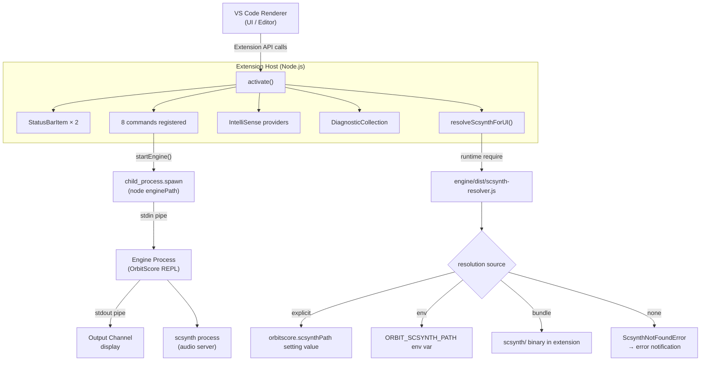

> **Note**: This page is a trace of the author's reading as of 2026-05-05. The code is the truth; this page is merely a snapshot of understanding at that point in time.

# IV-1. VS Code Extension Architecture

How does OrbitScore's VS Code extension (`packages/vscode-extension`) start up, and how is it connected to the engine? This chapter reads its internal structure in order, from the extension's activation to the communication with the engine process.

---

## Table of Contents

1. [Extension Host Basics](#extension-host-basics)
2. [activation and activationEvents](#activation-and-activationevents)
3. [The Big Picture of the `activate()` Function](#the-big-picture-of-the-activate-function)
4. [Status Bar: Two Indicators](#status-bar-two-indicators)
5. [Command Registration](#command-registration)
6. [IntelliSense and Diagnostics Registration](#intellisense-and-diagnostics-registration)
7. [scsynth Resolution: `resolveScsynthForUI()`](#scsynth-resolution-resolvescsynthforui)
8. [Spawning the Engine Process](#spawning-the-engine-process)
9. [Communication Protocol with the Engine](#communication-protocol-with-the-engine)
10. [Stopping the Engine](#stopping-the-engine)
11. [Architecture Overview Diagram](#architecture-overview-diagram)

---

## Extension Host Basics

VS Code extensions run on a dedicated Node.js process called the **Extension Host**. It is forked from the Renderer process (the editor UI); it has no DOM access but has all of Node.js's features (`fs`, `child_process`, etc.) available. Because the OrbitScore extension separately starts the engine process via `child_process.spawn` from this Extension Host, the processes form three layers:

```
VS Code Renderer (UI)
    └── Extension Host (Node.js)  ← extension code runs
            └── engine process (Node.js)  ← OrbitScore DSL engine
                    └── scsynth (SuperCollider audio server)
```

---

## activation and activationEvents

`package.json` declares "at what timing the extension activates" via the `activationEvents` field.

OrbitScore uses two kinds:

- `"onStartupFinished"`: activates unconditionally after VS Code finishes startup
- `"onLanguage:orbitscore"`: activates the moment an `.orbs` file (language ID: `orbitscore`) is opened

Because of `onStartupFinished`, the extension is always loaded even if no OrbitScore file is open. That is why the status bar indicators are always visible.

---

## The Big Picture of the `activate()` Function

The entry point is `activate()` in `extension.ts`. It is called once immediately after VS Code loads the extension.

```typescript
// extension.ts:19-97
export async function activate(context: vscode.ExtensionContext) {
  console.log('OrbitScore Audio DSL extension activated!')

  // Reset state on activation (important for reload)
  engineProcess = null
  isLiveCodingMode = false

  // Create output channel
  outputChannel = vscode.window.createOutputChannel('OrbitScore')

  // Show version info
  const packageJson = JSON.parse(fs.readFileSync(path.join(__dirname, '../package.json'), 'utf8'))
  const buildTime = fs.statSync(__filename).mtime.toISOString()
  outputChannel.appendLine('━━━━━━━━━━━━━━━━━━━━━━━━━━━━━━━━━━━━━━')
  outputChannel.appendLine(`🎵 OrbitScore Extension v${packageJson.version}`)
  outputChannel.appendLine(`📦 Build: ${buildTime}`)
  outputChannel.appendLine(`📂 Path: ${__dirname}`)
  outputChannel.appendLine('━━━━━━━━━━━━━━━━━━━━━━━━━━━━━━━━━━━━━━')
  outputChannel.appendLine('')

  // Create status bar item
  statusBarItem = vscode.window.createStatusBarItem(vscode.StatusBarAlignment.Right, 100)
  statusBarItem.text = '🎵 OrbitScore: Stopped'
  statusBarItem.tooltip = 'Click to show commands'
  statusBarItem.command = 'orbitscore.showCommands'
  statusBarItem.show()

  // Bundle status indicator (priority 99 → 既存 100 の左隣に並ぶ)
  bundleStatusItem = vscode.window.createStatusBarItem(vscode.StatusBarAlignment.Right, 99)
  // Click → orbitscore.scsynthPath に絞った設定画面に直接遷移
  // (tooltip 案内と一致、maybeShowBundleNotice の "Open Settings" ボタンとも統一)
  bundleStatusItem.command = {
    command: 'workbench.action.openSettings',
    title: 'Open scsynth settings',
    arguments: ['orbitscore.scsynthPath'],
  }
  updateBundleStatus()
  bundleStatusItem.show()

  // Re-evaluate bundle status when user changes the override setting
  context.subscriptions.push(
    vscode.workspace.onDidChangeConfiguration((e) => {
      if (e.affectsConfiguration('orbitscore.scsynthPath')) {
        updateBundleStatus()
      }
    }),
  )

  // Register commands
  context.subscriptions.push(
    vscode.commands.registerCommand('orbitscore.toggleEngine', toggleEngine),
    vscode.commands.registerCommand('orbitscore.showCommands', showCommands),
    vscode.commands.registerCommand('orbitscore.runSelection', runSelection),
    vscode.commands.registerCommand('orbitscore.stopEngine', stopEngine),
    vscode.commands.registerCommand('orbitscore.startEngineDebug', startEngineDebug),
    vscode.commands.registerCommand('orbitscore.forceKillScsynth', forceKillScsynth),
    vscode.commands.registerCommand('orbitscore.selectAudioDevice', selectAudioDevice),
    vscode.commands.registerCommand('orbitscore.configureFlash', configureFlash),
    statusBarItem,
    bundleStatusItem,
  )

  // Register IntelliSense providers
  registerCompletionProviders(context)
  registerHoverProvider(context)

  // Register diagnostics
  const diagnosticCollection = vscode.languages.createDiagnosticCollection('orbitscore')
  context.subscriptions.push(diagnosticCollection)

  // Update diagnostics on document change
  context.subscriptions.push(
    vscode.workspace.onDidChangeTextDocument((event) => {
      if (event.document.languageId === 'orbitscore') {
        updateDiagnostics(event.document, diagnosticCollection)
      }
    }),
  )
}
```

Glancing through it, `activate()` does several things together:

1. Initialize module-level variables (`engineProcess`, `isLiveCodingMode`)
2. Create the Output Channel and display version information
3. Create and show two status bar items
4. Register a listener for `orbitscore.scsynthPath` setting changes
5. Register eight commands
6. Register IntelliSense (completion / hover) providers
7. Register diagnostics (real-time syntax checking)

---

## Status Bar: Two Indicators

What is interesting is that there are **two** status bar indicators. Their priority values differ, determining the order from the right edge:

| Variable | priority | Role | On click |
|---|---|---|---|
| `statusBarItem` | 100 (rightmost) | Engine running state (`Stopped` / `Ready` / `Ready 🐛`) | `showCommands` palette |
| `bundleStatusItem` | 99 (left of it) | scsynth resolution state (`bundled` / `custom` / `not found`) | `orbitscore.scsynthPath` setting |

`bundleStatusItem` calls `resolveScsynthForUI()` via `updateBundleStatus()` and switches the display based on the resolved source (bundle / env / explicit):

```typescript
// extension.ts:138-163
function updateBundleStatus(): void {
  if (!bundleStatusItem) return
  const resolution = resolveScsynthForUI()
  if (!resolution) {
    bundleStatusItem.text = '$(error) scsynth: not found'
    bundleStatusItem.tooltip =
      'Bundled scsynth not found. Reinstall the extension or set orbitscore.scsynthPath to a system scsynth.'
    bundleStatusItem.backgroundColor = new vscode.ThemeColor('statusBarItem.errorBackground')
    return
  }
  bundleStatusItem.backgroundColor = undefined
  switch (resolution.source) {
    case 'bundle':
      bundleStatusItem.text = '$(check) scsynth (bundled)'
      bundleStatusItem.tooltip = `Using bundled scsynth\n${resolution.path}`
      break
    case 'env':
    case 'explicit':
      bundleStatusItem.text = '$(gear) scsynth (custom)'
      bundleStatusItem.tooltip = `Using user-overridden scsynth\n${resolution.path}`
      break
    default:
      bundleStatusItem.text = '$(question) scsynth: unknown source'
      bundleStatusItem.tooltip = resolution.path
  }
}
```

It is interesting that `env` and `explicit` are rolled into the same display. They both mean "the user is using a custom scsynth," so the decision is to not distinguish them in the UI.

Also, a listener that re-invokes `updateBundleStatus()` when the `orbitscore.scsynthPath` setting changes is set inside `activate()`. This is the mechanism by which configuration changes are reflected in real time.

---

## Command Registration

Let's organize the eight commands `activate()` registers:

| Command ID | Function | Description |
|---|---|---|
| `orbitscore.toggleEngine` | `toggleEngine` | Toggle engine start/stop |
| `orbitscore.showCommands` | `showCommands` | Show the command palette |
| `orbitscore.runSelection` | `runSelection` | Execute selected code / current block (Cmd+Enter) |
| `orbitscore.stopEngine` | `stopEngine` | Stop the engine |
| `orbitscore.startEngineDebug` | `startEngineDebug` | Start in debug mode |
| `orbitscore.forceKillScsynth` | `forceKillScsynth` | Force-kill scsynth |
| `orbitscore.selectAudioDevice` | `selectAudioDevice` | Select audio device |
| `orbitscore.configureFlash` | `configureFlash` | Configure flash effect |

A keybinding for `orbitscore.runSelection` is set in `package.json`:

```json
{
  "key": "cmd+enter",
  "command": "orbitscore.runSelection",
  "when": "editorTextFocus && editorLangId == orbitscore"
}
```

Because `editorLangId == orbitscore` is specified in the `when` clause, it is only effective when an `.orbs` file has focus.

---

## IntelliSense and Diagnostics Registration

`registerCompletionProviders(context)` and `registerHoverProvider(context)` handle IntelliSense. The core of the implementation is in `analyzeMethodChain()` and `getContextualCompletions()` in `completion-context.ts`.

```typescript
// completion-context.ts:6-15
interface MethodChainContext {
  hasAudio: boolean
  hasChop: boolean
  hasPlay: boolean
  hasBeat: boolean
  hasLength: boolean
  hasTempo: boolean
  hasRun: boolean
  lastMethod: string
}
```

`analyzeMethodChain(lineText, position)` scans the text up to the cursor position and decides at what stage of the method chain we are. `getContextualCompletions(context, isGlobal)` takes that result and reorders the completion candidates appropriate for the context. For example, when `.audio()` has not yet appeared, `audio` comes to the top of completions; once `.play()` is done, `run` and `loop` come to the top.

Diagnostics (`updateDiagnostics`) are driven by the document change event (`onDidChangeTextDocument`). Only documents with `languageId === 'orbitscore'` are targeted. There are five kinds of checks: parenthesis matching (Error), tempo range (Warning), deprecated keywords (Warning), `global` state-setter once-per-file (Warning), and `audioPath` ordering (Warning). For details, see [II-2](/en/editor/execution-feedback#real-time-diagnostics-updatediagnostics).

---

## scsynth Resolution: `resolveScsynthForUI()`

What resolves the path to scsynth (SuperCollider's audio server) is `resolveScsynthForUI()`. There is one interesting implementation pattern here. It is a structure where **the JS of the Extension Host (compiled from TypeScript) runtime-loads the engine package's compiled JS via `require`**.

```typescript
// extension.ts:113-129
function resolveScsynthForUI(): { path: string; source: string } | null {
  try {
    // eslint-disable-next-line @typescript-eslint/no-require-imports, @typescript-eslint/no-var-requires
    const resolverModule = require('../engine/dist/audio/supercollider/scsynth-resolver') as {
      resolveScsynthPath: (opts?: { explicit?: string }) => { path: string; source: string }
    }
    const userOverride = vscode.workspace
      .getConfiguration('orbitscore')
      .get<string>('scsynthPath', '')
      .trim()
    return resolverModule.resolveScsynthPath(userOverride ? { explicit: userOverride } : undefined)
  } catch (err) {
    const reason = err instanceof Error ? err.message : String(err)
    outputChannel?.appendLine(`❌ scsynth resolver failed: ${reason}`)
    return null
  }
}
```

`require('../engine/dist/...')` is not a static import but a dynamic `require`. If the engine package's build artifact (`engine/dist/`) does not exist, it falls into `catch` and returns `null`. In that case, `$(error) scsynth: not found` is shown in the status bar.

The actual resolution logic is handled by `scsynth-resolver.ts` (engine package). The priority chain is described in detail in [ADR-003](/en/decisions/adr-003-scsynth-bundle), but let's look at the code:

```typescript
// packages/engine/src/audio/supercollider/scsynth-resolver.ts:91-98
  return (
    tryCandidate(opts.explicit, 'explicit') ??
    tryCandidate(process.env[ENV_VAR], 'env') ??
    tryCandidate(bundleCandidatePath(), 'bundle') ??
    (() => {
      throw new ScsynthNotFoundError(searched)
    })()
  )
}
```

The priority is `explicit > env > bundle > throw`. If none is found, `ScsynthNotFoundError` is thrown, and the `catch` of `resolveScsynthForUI()` catches it.

---

## Spawning the Engine Process

`startEngine(debugMode)` actually starts the engine as a child process. Let's read the important parts:

```typescript
// extension.ts:681-743 (omitting the pre-check and env setup in the first half and showing the core)
function startEngine(debugMode: boolean = false) {
  if (engineProcess && !engineProcess.killed) {
    vscode.window.showWarningMessage('⚠️ Engine is already running')
    return
  }

  // Pre-check: scsynth が解決できない場合は engine spawn を行わず、エラー
  // Notification のみ表示する。spawn してから boot 失敗するとユーザーに
  // 二重通知 (resolver エラー + engine 終了ログ) が出てしまうのを防ぐ
  // (claude-review on PR #155 の Significant 指摘 #2)。
  // 解決できた場合はその path を engine spawn に再利用 (Minor #1: 二重 fs.statSync 回避)。
  const scResolution = resolveScsynthForUI()
  if (!scResolution) {
    void maybeShowBundleNotice()
    return
  }
  // ...
```

Calling `resolveScsynthForUI()` before spawn has two reasons. The first is to "stop the spawn itself if scsynth cannot be found" (preventing double notification). The second is to "pass the resolved path to the engine via an environment variable" (avoiding a double `fs.statSync`). The code review comments from PR #155 are kept inline, making it clear why this is so.

The actual spawn is here:

```typescript
// extension.ts:739-743
  engineProcess = child_process.spawn('node', [enginePath, ...args], {
    cwd: workspaceRoot,
    stdio: ['pipe', 'pipe', 'pipe'],
    env,
  })
```

`stdio: ['pipe', 'pipe', 'pipe']` is important. By making stdin/stdout/stderr all pipes, the Extension Host can directly write/read them. The scsynth path is passed via an environment variable:

```typescript
// extension.ts:735
  env.ORBIT_SCSYNTH_PATH = scResolution.path
```

---

## Communication Protocol with the Engine

Communication between the Extension Host and the engine process is via **stdin/stdout pipes**. It is a simple line-oriented protocol:

- **Extension → Engine**: send DSL text to stdin one line at a time via `write(text + '\n')`
- **Engine → Extension**: write execution results and logs to stdout; the extension reads them and displays them in the Output Channel

The send part is at the tail of `runSelection()`:

```typescript
// extension.ts:1107
  engineProcess.stdin?.write(codeToSend + '\n')
```

`codeToSend` may be a single line or multiple lines, but appending `\n` at the end allows the engine side to detect "the end of one command." Execution feedback (flashing the executed lines, error position display) is covered in detail in [IV-2 Inline Execution and Feedback](/en/editor/execution-feedback).

---

## Stopping the Engine

`stopEngine()` performs a two-stage shutdown of SIGTERM → (after 2 seconds) SIGKILL:

```typescript
// extension.ts:765-789
function stopEngine() {
  if (engineProcess && !engineProcess.killed) {
    // Capture process reference before nulling module-level variable
    // (the SIGKILL timeout needs this reference after engineProcess is set to null)
    const proc = engineProcess
    engineProcess = null
    isLiveCodingMode = false

    // Send graceful shutdown signal (SIGTERM)
    // This allows the engine to clean up SuperCollider properly
    proc.kill('SIGTERM')

    // Force kill after 2 seconds if still running
    setTimeout(() => {
      if (!proc.killed) {
        proc.kill('SIGKILL')
      }
    }, 2000)

    statusBarItem!.text = '🎵 OrbitScore: Stopped'
    statusBarItem!.tooltip = 'Click to start engine'
    vscode.window.showInformationMessage('🛑 Engine stopped')
    outputChannel?.appendLine('🛑 Engine stopped')
  }
}
```

Even after `engineProcess = null`, the closure of `setTimeout` needs to reference `proc` (a local variable), so it is captured first as `const proc = engineProcess`. The fact that this comment is inline makes it easy to read.

SIGTERM is sent first to give the engine side time to gracefully shut down SuperCollider (scsynth). If the engine does not terminate within 2 seconds, it is force-killed with SIGKILL.

---

## Architecture Overview Diagram



---

## Related Terms

- [activate() / deactivate()](/en/glossary#activate--deactivate) — VS Code extension lifecycle functions. The `activate()` covered in detail in this chapter does all the registration
- [activationEvents](/en/glossary#activationevents) — the two kinds `"onStartupFinished"` and `"onLanguage:orbitscore"` realize always-on activation
- [Extension Host](/en/glossary#extension-host) — the Node.js process where extension code runs. The parent process of the engine process
- [StatusBarItem](/en/glossary#statusbaritem) — manages the two: `statusBarItem` (priority 100) and `bundleStatusItem` (priority 99)
- [language ID (orbitscore)](/en/glossary#language-id-orbitscore) — the language ID assigned to `.orbs` files. IntelliSense, diagnostics, and key bindings all filter by this ID
- [DiagnosticCollection](/en/glossary#diagnosticcollection) — the diagnostic collection that `updateDiagnostics()` writes to. Updated on every keystroke
- [scsynth](/en/glossary#scsynth) — the audio server binary that `resolveScsynthForUI()` resolves before startup
- [strict mode (scsynth resolver)](/en/glossary#strict-mode-scsynth-resolver) — the fail-loud design that cancels the spawn itself if scsynth is not found
- [MethodChainContext](/en/glossary#methodchaincontext) — the method chain state representation that IntelliSense uses to provide context-aware completion candidates

## Related ADRs

- [ADR-001 Choosing SuperCollider as the Implementation Base](/en/decisions/adr-001-supercollider) — the background of the engine requiring scsynth
- [ADR-003 scsynth Bundle Strict Mode](/en/decisions/adr-003-scsynth-bundle) — the priority order of `resolveScsynthForUI()` and the decision behind the fail-loud design

## Next Exploration Candidates

- Implementation details of `registerCompletionProviders` and `registerHoverProvider` (other sections of `extension.ts`)
- Implementation of `getLineSubject()` — how it determines "to which variable does this line belong"
- `setupStdoutHandler` / `setupStderrHandler` — how output from the engine is processed
- Implementation of the `selectAudioDevice` command — the location and format of the audio device settings file
- Cleanup processing in `deactivate()` — the relationship between auto-disposal of subscriptions and manual kill
- Differences between `startEngineDebug()` and normal startup — handling of `ORBITSCORE_DEBUG=1` on the engine side

---

## Sources

- `packages/vscode-extension/src/extension.ts:19-97` — entire `activate()`: output channel creation, status bar creation, command registration, diagnostics registration
- `packages/vscode-extension/src/extension.ts:113-129` — `resolveScsynthForUI()`: scsynth resolution via runtime `require`
- `packages/vscode-extension/src/extension.ts:138-163` — `updateBundleStatus()`: status bar display switching by source kind
- `packages/vscode-extension/src/extension.ts:173-190` — `maybeShowBundleNotice()`: error notification when scsynth resolution fails
- `packages/vscode-extension/src/extension.ts:681-759` — `startEngine()`: scsynth pre-check, env setup, child_process.spawn
- `packages/vscode-extension/src/extension.ts:739-743` — engine spawn core: `stdio: ['pipe','pipe','pipe']`
- `packages/vscode-extension/src/extension.ts:765-789` — `stopEngine()`: SIGTERM + 2s SIGKILL fallback
- `packages/vscode-extension/src/extension.ts:1107` — `engineProcess.stdin?.write(codeToSend + '\n')`: DSL send
- `packages/vscode-extension/src/completion-context.ts:6-15` — the `MethodChainContext` interface
- `packages/vscode-extension/package.json` — `activationEvents`, `contributes.commands`, keybinding definitions
- `packages/engine/src/audio/supercollider/scsynth-resolver.ts:91-98` — `explicit > env > bundle > throw` priority chain
- PR [#155](https://github.com/signalcompose/orbitscore/pull/155) — code review comments on adopting scsynth strict mode and preventing double notification
