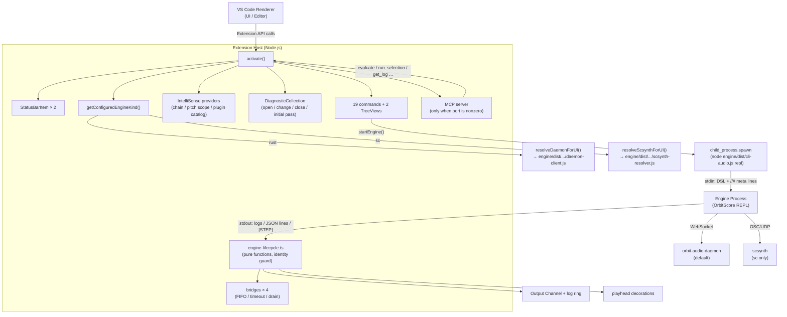

> **Note**: This page is a trace of the author's reading as of 2026-09-01. The code is the truth; this page is only a snapshot of understanding at that time.

# IV-1. VS Code Extension Architecture

How does OrbitScore's VS Code extension (`packages/vscode-extension`, package version 2.1.0) start up, and how is it connected to the engine? This chapter reads its internal structure in order, from the extension's activation to the communication with the engine process. What changed most since the first draft in 2026-05 is "the engine-kind branch," "the extraction of the engine lifecycle into a vscode-free module," and "the growth of peripheral features such as the MCP server, the playhead, and the Engine view"; a list of the drift is collected at the end.

---

## Table of Contents

1. [Extension Host Basics](#extension-host-basics)
2. [activation and activationEvents](#activation-and-activationevents)
3. [Module-Level State](#module-level-state)
4. [The Big Picture of the `activate()` Function](#the-big-picture-of-the-activate-function)
5. [Status Bar: Two Indicators and the Engine Kind](#status-bar-two-indicators-and-the-engine-kind)
6. [Command Registration](#command-registration)
7. [IntelliSense and Diagnostics Registration](#intellisense-and-diagnostics-registration)
8. [Binary Resolution: scsynth and the Daemon](#binary-resolution-scsynth-and-the-daemon)
9. [Spawning the Engine Process](#spawning-the-engine-process)
10. [Communication Protocol with the Engine](#communication-protocol-with-the-engine)
11. [Stopping the Engine and the Lifecycle Identity Guard](#stopping-the-engine-and-the-lifecycle-identity-guard)
12. [Architecture Overview Diagram](#architecture-overview-diagram)
13. [Drift as of 2026-09](#drift-as-of-2026-09)

---

## Extension Host Basics

VS Code extensions run on a dedicated Node.js process called the **Extension Host**. It is forked from the Renderer process (the editor UI); it has no DOM access but has all of Node.js's features (`fs`, `child_process`, etc.) available. Because the OrbitScore extension separately starts the engine process via `child_process.spawn` from this Extension Host, and the engine in turn starts an audio process, the processes form three layers:

```
VS Code Renderer (UI)
    └── Extension Host (Node.js)  ← extension code runs
            └── engine process (node engine/dist/cli-audio.js repl)  ← OrbitScore DSL engine
                    ├── orbit-audio-daemon (Rust, default, WebSocket)
                    └── scsynth (SuperCollider, only when orbitscore.engine is "sc", OSC)
```

Which audio process it is depends on the `orbitscore.engine` setting (default `"rust"`). This branch shows up throughout the chapter.

---

## activation and activationEvents

`package.json` declares "at what timing the extension activates" via the `activationEvents` field.

OrbitScore uses two kinds:

- `"onStartupFinished"`: activates unconditionally after VS Code finishes startup
- `"onLanguage:orbitscore"`: activates the moment an `.orbs` file (language ID: `orbitscore`) is opened

Because of `onStartupFinished`, the extension is always loaded even if no OrbitScore file is open. That is why the status bar indicators are always visible.

---

## Module-Level State

`extension.ts` is a large file of 4,115 lines, and state lives in module-level variables. The declarations near the top serve as an index of what this extension carries.

```typescript
// packages/vscode-extension/src/extension.ts:104-115
let engineProcess: child_process.ChildProcess | null = null
let outputChannel: vscode.OutputChannel | null = null
let statusBarItem: vscode.StatusBarItem | null = null
let bundleStatusItem: vscode.StatusBarItem | null = null
let devDocsPanel: vscode.WebviewPanel | null = null
let isLiveCodingMode: boolean = false
// Tracks whether `var global = init GLOBAL` has been evaluated in the current engine session.
// Used to decide if `global.setDocumentDirectory(...)` can be prepended safely.
let globalInitialized: boolean = false
let transportPlaying: boolean = false
// Optional MCP control server (Agent Bridge). Non-null only while running.
let mcpServerHandle: McpServerHandle | null = null
```

After this come four **bridges** that wait for JSON lines coming back on the engine's stdout (`DeviceSwitchBridge` / `PluginStateBridge` / `PluginUiBridge` / `EvalMarkBridge`). Each is a FIFO that "writes a meta line to stdin and resolves on the corresponding one-line JSON on stdout," and when the engine dies, `drainAll()` fails all of them. This structure prevents the race where, after a fast `stop → start` of the engine, a response from the old process matches a request of the new engine (#501 / #528).

---

## The Big Picture of the `activate()` Function

The entry point is `activate()` in `extension.ts`. It is called once immediately after VS Code loads the extension. Let's look at the first half.

```typescript
// packages/vscode-extension/src/extension.ts:286-341
export async function activate(context: vscode.ExtensionContext) {
  console.log('OrbitScore Audio DSL extension activated!')

  // Reset state on activation (important for reload)
  engineProcess = null
  isLiveCodingMode = false
  globalInitialized = false
  transportPlaying = false

  // Create output channel
  outputChannel = vscode.window.createOutputChannel('OrbitScore')

  // Tap appendLine/append into the ring buffer so the MCP get_log tool can read
  // recent output without a separate logging sink (#388). Installed before the
  // version banner below so get_log's history starts from activation.
  const rawAppendLine = outputChannel.appendLine.bind(outputChannel)
  outputChannel.appendLine = (value: string) => {
    pushLogRing(value)
    rawAppendLine(value)
  }
  const rawAppend = outputChannel.append.bind(outputChannel)
  outputChannel.append = (value: string) => {
    for (const line of value.split('\n')) {
      if (line) pushLogRing(line)
    }
    rawAppend(value)
  }

  // Show version info
  const packageJson = JSON.parse(fs.readFileSync(path.join(__dirname, '../package.json'), 'utf8'))
  const buildTime = fs.statSync(__filename).mtime.toISOString()
  outputChannel.appendLine('━━━━━━━━━━━━━━━━━━━━━━━━━━━━━━━━━━━━━━')
  outputChannel.appendLine(`🎵 OrbitScore Extension v${packageJson.version}`)
  outputChannel.appendLine(`📦 Build: ${buildTime}`)
  outputChannel.appendLine(`📂 Path: ${__dirname}`)
  outputChannel.appendLine('━━━━━━━━━━━━━━━━━━━━━━━━━━━━━━━━━━━━━━')
  outputChannel.appendLine('')

  // Create status bar item
  statusBarItem = vscode.window.createStatusBarItem(vscode.StatusBarAlignment.Right, 100)
  statusBarItem.text = '🎵 OrbitScore: Stopped'
  statusBarItem.tooltip = 'Open Audio Engine Settings'
  statusBarItem.command = 'orbitscore.showCommands'
  statusBarItem.show()

  // Bundle status indicator (priority 99 → 既存 100 の左隣に並ぶ)
  bundleStatusItem = vscode.window.createStatusBarItem(vscode.StatusBarAlignment.Right, 99)
  // Click → orbitscore.scsynthPath に絞った設定画面に直接遷移
  // (tooltip 案内と一致、maybeShowBundleNotice の "Open Settings" ボタンとも統一)
  bundleStatusItem.command = {
    command: 'workbench.action.openSettings',
    title: 'Open scsynth settings',
    arguments: ['orbitscore.scsynthPath'],
  }
  updateBundleStatus()
  updateStatusBarEngineAction()
```

What is interesting is the spot where the Output Channel's `appendLine` / `append` are **monkey-patched**. The extension has no central log sink, so in order for the MCP `get_log` tool (#388) to read it, the lines flowing into the Output Channel are also pushed to a ring buffer (`outputLogRing`, capped by `OUTPUT_LOG_RING_MAX = 1000` in `log-ring.ts`).

The rest of `activate()` is roughly five jobs:

1. Register configuration-change listeners (`orbitscore.scsynthPath` / `orbitscore.engine` / `orbitscore.playheadPalette`)
2. Register commands and TreeView providers (next section)
3. Register IntelliSense (completion / hover) providers
4. Register diagnostics (`DiagnosticCollection`) and run an initial pass over already-open documents (#384)
5. Start the MCP server (only when the port is nonzero) and auto-start the Rust engine

The last two are written like this.

```typescript
// packages/vscode-extension/src/extension.ts:445-499 (MCP ツールのハンドラ表を省略)
  // Optional MCP control server (Agent Bridge, #388) — dev/agent-integration
  // only, gated behind a nonzero port. The `ORBITSCORE_MCP_PORT` env var takes
  // precedence over the `orbitscore.mcpServer.port` setting so the extension can
  // be launched from the CLI (e.g. Extension Development Host) with the port set
  // without editing settings. Lets an external agent (e.g. Claude Code) drive
  // OrbitScore operations for E2E testing.
  const envMcpPort = Number(process.env.ORBITSCORE_MCP_PORT)
  const mcpPort =
    Number.isInteger(envMcpPort) && envMcpPort > 0
      ? envMcpPort
      : vscode.workspace.getConfiguration('orbitscore').get<number>('mcpServer.port', 0)
  if (mcpPort && mcpPort > 0) {
    // ...
  }

  void autoStartConfiguredRustEngine()
}
```

The omitted block is the table that hands 25 handlers (`evaluate` / `startEngine` / `getLog` / `analyzeAudio` / `listPlugins` …) to `startOrbitScoreMcpServer()`. The internals of the MCP server and the gated E2E are left to [IV-3. MCP Server and Gated Real-Device E2E](/en/editor/mcp-and-gated-e2e). `autoStartConfiguredRustEngine()` auto-starts the engine under the `rust` kind when an output device is saved, and checks liveness 5 seconds later (`extension.ts:1699-1723`).

---

## Status Bar: Two Indicators and the Engine Kind

There are **two** status bar indicators. Their priority values differ, determining the order from the right edge:

| Variable | priority | Role | On click |
|---|---|---|---|
| `statusBarItem` | 100 (rightmost) | Engine running state (`Stopped` / `Ready` / `▶️ Playing`, with `🐛` in debug) | `showCommands` (focuses the Engine view under `rust`, a QuickPick under `sc`) |
| `bundleStatusItem` | 99 (left of it) | Binary resolution state | `orbitscore.scsynthPath` setting |

The display of `bundleStatusItem` is decided by `updateBundleStatus()`, and its first branch is the **engine kind**.

```typescript
// packages/vscode-extension/src/extension.ts:726-742
function updateBundleStatus(): void {
  if (!bundleStatusItem) return
  if (getConfiguredEngineKind() === 'rust') {
    const daemonResolution = resolveDaemonForUI()
    if (!daemonResolution) {
      bundleStatusItem.show()
      bundleStatusItem.text = '$(error) daemon: not found'
      bundleStatusItem.tooltip =
        'orbit-audio-daemon not found. Reinstall the extension, build it via `cd rust && cargo build --release`, or set ORBIT_AUDIO_DAEMON_PATH to a custom binary.'
      bundleStatusItem.backgroundColor = new vscode.ThemeColor('statusBarItem.errorBackground')
      return
    }
    // 既定（Rust・健全）ではインジケータ自体を出さない（owner 判断 2026-07-17: 常時表示の
    // 意味がない）。daemon 不在エラーと SC バックエンド時のみ表示する。
    bundleStatusItem.hide()
    return
  }
```

Under the `rust` kind, when the daemon is found (= the normal state), the indicator is **hidden**. Only under the `sc` kind is the scsynth resolution result (`bundled` / `custom` / `not found`) shown (`extension.ts:742-766`, see [III-3](/en/audio/scsynth-bundle)). The decision to roll `env` and `explicit` into the same `custom` display is unchanged since 2026-05.

`getConfiguredEngineKind()`, which decides the engine kind, reads the `orbitscore.engine` setting and normalizes it by borrowing the engine package's `resolveEngineKind()` via runtime `require` (`extension.ts:653-669`). This keeps the UI and engine decisions in one place.

---

## Command Registration

Let's organize the commands `activate()` registers. There are 17 listed in `contributes.commands`, plus 2 internal commands invoked only from TreeView nodes.

```typescript
// packages/vscode-extension/src/extension.ts:367-404
  // Register commands
  context.subscriptions.push(
    vscode.commands.registerCommand('orbitscore.toggleEngine', toggleEngine),
    vscode.commands.registerCommand('orbitscore.showCommands', showCommands),
    vscode.commands.registerCommand('orbitscore.runSelection', runSelection),
    vscode.commands.registerCommand('orbitscore.stopEngine', stopEngine),
    vscode.commands.registerCommand('orbitscore.restartEngine', restartEngine),
    vscode.commands.registerCommand('orbitscore.reloadWindow', reloadWindow),
    vscode.commands.registerCommand('orbitscore.startEngineDebug', startEngineDebug),
    vscode.commands.registerCommand('orbitscore.forceKillScsynth', forceKillScsynth),
    vscode.commands.registerCommand('orbitscore.selectAudioDevice', selectAudioDevice),
    vscode.commands.registerCommand('orbitscore.configureFlash', configureFlash),
    vscode.commands.registerCommand('orbitscore.registerMcpServer', registerMcpServer),
    vscode.commands.registerCommand('orbitscore.rescanPlugins', rescanPlugins),
    vscode.commands.registerCommand('orbitscore.browsePlugins', browsePlugins),
    // viewsWelcome コンテンツは view に provider が登録されて初めて描画される
    // （空 TreeView で十分 — 章ツリーの本実装は #451 確定後の follow-up）。
    vscode.window.registerTreeDataProvider('orbitscore.learningView', {
      getChildren: () => [],
      getTreeItem: (element: vscode.TreeItem) => element,
    }),
    // Engine ビュー（#484 D3）: エンジン停止中は空を返し viewsWelcome（Start/Debug/Stop ボタン）を
    // 出す（viewsWelcome は tree が空の時だけ描画される — 上の学習ビューと同じ制約）。起動中は
    // engine 状態 + Output Device セクションを TreeView として描画する。
    (() => {
      engineViewProvider = new EngineViewProvider()
      return vscode.window.registerTreeDataProvider('orbitscore.engineView', engineViewProvider)
    })(),
    vscode.commands.registerCommand('orbitscore.engineViewSelectDevice', engineViewSelectDevice),
    vscode.commands.registerCommand('orbitscore.engineViewToggleEngine', engineViewToggleEngine),
    vscode.commands.registerCommand('orbitscore.engineViewToggleDebug', engineViewToggleDebug),
    vscode.commands.registerCommand('orbitscore.openDocs', openUserDocs),
    vscode.commands.registerCommand('orbitscore.openDevDocs', openDevDocs),
    vscode.commands.registerCommand('orbitscore.openDevDocsPanel', () => openDevDocsPanel(context)),
    vscode.commands.registerCommand('orbitscore.openWalkthrough', openWalkthrough),
    statusBarItem,
    bundleStatusItem,
  )
```

| Command ID | Function | Description | Palette visibility |
|---|---|---|---|
| `orbitscore.toggleEngine` | `toggleEngine` | Toggle engine start/stop | hidden (`editor/title` button) |
| `orbitscore.showCommands` | `showCommands` | `rust`: focus the Engine view / `sc`: QuickPick | (from the status bar) |
| `orbitscore.runSelection` | `runSelection` | Execute selected code / current block (Cmd+Enter) | shown |
| `orbitscore.stopEngine` | `stopEngine` | Stop the engine | hidden |
| `orbitscore.restartEngine` | `restartEngine` | stop → wait 2.2 s → start (recovery) | hidden (Engine view Recovery) |
| `orbitscore.reloadWindow` | `reloadWindow` | `workbench.action.reloadWindow` | hidden (Engine view Recovery) |
| `orbitscore.startEngineDebug` | `startEngineDebug` | Start in debug mode | hidden |
| `orbitscore.forceKillScsynth` | `forceKillScsynth` | `killall scsynth` | only when `orbitscore.engine == 'sc'` |
| `orbitscore.selectAudioDevice` | `selectAudioDevice` | Audio device selection for SC | only when `orbitscore.engine == 'sc'` |
| `orbitscore.configureFlash` | `configureFlash` | Configure flash effect | shown |
| `orbitscore.registerMcpServer` | `registerMcpServer` | Write a Claude Code entry into `.mcp.json` (#388) | shown |
| `orbitscore.rescanPlugins` | `rescanPlugins` | Rescan the plugin catalog (#463) | shown + `editor/context` |
| `orbitscore.browsePlugins` | `browsePlugins` | Pick a name from the catalog and insert it (#638) | shown |
| `orbitscore.engineViewSelectDevice` | `engineViewSelectDevice` | Click on a device node in the Engine view (#484 D3) | hidden |
| `orbitscore.openDocs` | `openUserDocs` | Open the user learning site in the browser | shown + `editor/title` |
| `orbitscore.openDevDocs` | `openDevDocs` | Open the dev learning site (this site) in the browser (#450) | shown |
| `orbitscore.openDevDocsPanel` | `openDevDocsPanel` | Same, in a Webview tab (#457) | shown |
| `orbitscore.openWalkthrough` | `openWalkthrough` | Open the `orbitscore.learnOrbitScore` walkthrough (4 steps) (#457) | shown |
| `orbitscore.engineViewToggleEngine` / `engineViewToggleDebug` | — | Internal commands invoked from Engine view nodes | not in `contributes.commands` |

A keybinding for `orbitscore.runSelection` is set in `package.json`:

```json
{
  "key": "cmd+enter",
  "command": "orbitscore.runSelection",
  "when": "editorTextFocus && editorLangId == orbitscore"
}
```

Because `editorLangId == orbitscore` is specified in the `when` clause, it is only effective when an `.orbs` file has focus.

Two containers have grown on the Activity Bar (`orbitscore` = the Learning view, `orbitscore-engine` = the Audio Engine Settings view). The Learning view is an empty TreeView, an entry point that only shows the `viewsWelcome` buttons (Open Learning Site / Start the Walkthrough). For the Engine view, the pure functions in `engine-view.ts` assemble the nodes and `EngineViewProvider` in `extension.ts` maps them to `vscode.TreeItem`.

```typescript
// packages/vscode-extension/src/engine-view.ts:47-54
export function buildRootNodes(engineRunning: boolean): EngineViewNode[] {
  return [
    buildEngineStatusNode(engineRunning),
    buildDebugToggleNode(false),
    buildDeviceSectionNode(),
    buildRecoverySectionNode(),
  ]
}
```

The semantics of clicking a device is "selection = power": clicking the same device again stops, clicking while not running starts, clicking while running switches live — decided by `resolveDeviceClickAction()` (`engine-view.ts:207-216`). A live switch is requested from the engine via the `//#selectAudioDevice` meta line (two sections below).

---

## IntelliSense and Diagnostics Registration

`registerCompletionProviders(context)` and `registerHoverProvider(context)` handle IntelliSense. Completion has grown to three families.

1. **Method-chain contextual completion**: `analyzeMethodChain()` and `getContextualCompletions()` in `completion-context.ts`. Triggered by `.`, it looks at which stage of the chain we are in and reorders candidates
2. **Pitch-scope completion**: when `).` is typed at a position where the parentheses of `.play(` are still open, it switches to `getPitchScopeCompletions()` (`extension.ts:3652-3672`)
3. **Plugin catalog name completion**: inside the string argument of `effect(` / `instrument(`, triggered by `"`, it offers names from the catalog (#463 C3, `extension.ts:3689-` onward). For depth, see [PH-3. The Plugin Catalog and Replacement](/en/plugin-hosting/catalog)

`MethodChainContext` has gained three flags since 2026-05.

```typescript
// packages/vscode-extension/src/completion-context.ts:6-18
interface MethodChainContext {
  hasAudio: boolean
  hasChop: boolean
  hasPlay: boolean
  hasBeat: boolean
  hasLength: boolean
  hasTempo: boolean
  hasRun: boolean
  hasOutput: boolean
  hasLinkAudio: boolean
  hasQuantize: boolean
  lastMethod: string
}
```

The completion vocabulary is duplicated in `dsl-method-catalog.ts`, and a test enforces that it matches the engine's `SEQUENCE_DSL_METHODS` / `GLOBAL_DSL_METHODS` / `BUS_DSL_METHODS` character for character. Because the extension process is designed not to import engine modules, duplication is unavoidable; the trade-off is to make drift red via the test instead.

```typescript
// packages/vscode-extension/src/dsl-method-catalog.ts:1-14
/**
 * DSL メソッド補完の候補表（#495 第1段）。
 *
 * 🔴 **正本は engine 側**（`packages/engine/src/signal-chain/runtime.ts` の
 * `SEQUENCE_DSL_METHODS` / `GLOBAL_DSL_METHODS` / `BUS_DSL_METHODS`）。
 *
 * ここに複製があるのは、拡張が engine を**プロセス境界越しに**使う設計だから
 * （`plugin-catalog-reader.ts` も同じ理由で "deliberately independent" と書いている）。
 * 拡張プロセスは engine のモジュールを import しない。
 *
 * 複製は乖離する。それを防ぐため **`tests/vscode-extension/dsl-method-catalog.spec.ts` が
 * engine の語彙と一字一句一致することを検査する**。DSL にメソッドを足してここを更新し忘れると
 * テストが red になる（`seq.ui()` を足したのに補完に出ない、を構造的に防ぐ）。
 */
```

Diagnostics (`updateDiagnostics`) were driven only by `onDidChangeTextDocument` as of 2026-05, but #384 extended them to "when opened," "when closed," and "documents already open at activation."

```typescript
// packages/vscode-extension/src/extension.ts:414-443
  // Compute diagnostics on open and change; clear them on close (#384).
  // Diagnostics must not wait for the first edit — files opened from the CLI,
  // restored tabs, or the activation-time initial pass below all need
  // errors/warnings surfaced immediately.
  context.subscriptions.push(
    vscode.workspace.onDidOpenTextDocument((document) => {
      if (isOrbitscoreDocument(document)) {
        updateDiagnostics(document, diagnosticCollection)
      }
    }),
    vscode.workspace.onDidChangeTextDocument((event) => {
      if (isOrbitscoreDocument(event.document)) {
        updateDiagnostics(event.document, diagnosticCollection)
      }
    }),
    vscode.workspace.onDidCloseTextDocument((document) => {
      if (isOrbitscoreDocument(document)) {
        diagnosticCollection.delete(document.uri)
      }
    }),
  )

  // Initial pass over documents already open at activation (#384): the
  // extension activates on `onLanguage:orbitscore`, so the triggering document
  // is already open and would otherwise never fire onDidOpenTextDocument.
  for (const document of vscode.workspace.textDocuments) {
    if (isOrbitscoreDocument(document)) {
      updateDiagnostics(document, diagnosticCollection)
    }
  }
```

There are 9 kinds of checks in total: 3 per-line plus 6 cross-line analyses. For details, see [IV-2](/en/editor/execution-feedback#real-time-diagnostics-updatediagnostics).

---

## Binary Resolution: scsynth and the Daemon

Before spawning the engine, the extension pre-checks "does the audio process's executable really exist?" There is an interesting implementation pattern here. It is a structure where **the JS of the Extension Host (compiled from TypeScript) runtime-loads the engine package's compiled JS via `require`**, with a wrapper of the same shape for both scsynth and the daemon.

```typescript
// packages/vscode-extension/src/extension.ts:677-711
function resolveScsynthForUI(): { path: string; source: string } | null {
  try {
    // eslint-disable-next-line @typescript-eslint/no-require-imports, @typescript-eslint/no-var-requires
    const resolverModule = require('../engine/dist/audio/supercollider/scsynth-resolver') as {
      resolveScsynthPath: (opts?: { explicit?: string }) => { path: string; source: string }
    }
    const userOverride = vscode.workspace
      .getConfiguration('orbitscore')
      .get<string>('scsynthPath', '')
      .trim()
    return resolverModule.resolveScsynthPath(userOverride ? { explicit: userOverride } : undefined)
  } catch (err) {
    const reason = err instanceof Error ? err.message : String(err)
    outputChannel?.appendLine(`❌ scsynth resolver failed: ${reason}`)
    return null
  }
}

/**
 * Resolve the native Rust daemon binary via shared resolver (engine の
 * compiled JS を runtime require). Returns null on failure. Symmetric to
 * `resolveScsynthForUI()` — same runtime-require pattern, same
 * log-reason-to-outputChannel-on-failure behavior (C2). Used to pre-check
 * daemon availability under the `rust` engine kind, mirroring how
 * `resolveScsynthForUI()` pre-checks scsynth under the `sc` kind.
 */
function resolveDaemonForUI(): { path: string; source: string } | null {
  try {
    return resolveDaemonBinaryForExtension()
  } catch (err) {
    const reason = err instanceof Error ? err.message : String(err)
    outputChannel?.appendLine(`❌ daemon resolver failed: ${reason}`)
    return null
  }
}
```

The daemon-side `require` is carved out into a small module, `engine-startup-runtime.ts`. This lets unit tests replace this boundary, so the logic of `startEngine()` can be tested even in an environment without the extension's build artifacts (`engine/dist/`).

```typescript
// packages/vscode-extension/src/engine-startup-runtime.ts:14-24
export function resolveDaemonBinaryForExtension(): EngineBinaryResolution {
  // eslint-disable-next-line @typescript-eslint/no-require-imports, @typescript-eslint/no-var-requires
  const daemonModule = require('../engine/dist/audio/rust-engine/daemon-client') as {
    resolveDaemonBinaryPath: (explicitPath?: string) => EngineBinaryResolution
  }
  return daemonModule.resolveDaemonBinaryPath()
}

export function extensionEngineFileExists(enginePath: string): boolean {
  return fs.existsSync(enginePath)
}
```

The scsynth resolver is `explicit > env > bundle > throw`; the daemon resolver is `explicit > env > monorepo-release > monorepo-debug > extension-bundle > throw`. Neither has a silent fallback; if nothing is found, they fail loud with an exception ([ADR-003](/en/decisions/adr-003-scsynth-bundle)).

---

## Spawning the Engine Process

`startEngine(debugMode?, agentOpts?)` actually starts the engine as a child process. The differences from 2026-05 are that it became `async` and returns a `boolean`, that the pre-check branches on the engine kind, and that it accepts `capture_wav` from MCP.

The pre-check is quoted in [III-3](/en/audio/scsynth-bundle#the-call-itself-is-gated-by-the-engine-kind), so here we read from assembling args and env through the spawn.

```typescript
// packages/vscode-extension/src/extension.ts:2112-2125
  // Build args
  const args = ['repl']
  if (audioDevice && audioDevice !== '__default__') {
    args.push('--audio-device', audioDevice)
  }
  if (effectiveDebugMode) {
    args.push('--debug')
  }

  // Set environment
  const env = { ...process.env }
  if (effectiveDebugMode) {
    env.ORBITSCORE_DEBUG = '1'
  }
```

The engine CLI (`engine/dist/cli-audio.js`) is started with the `repl` subcommand, and the output device is passed via the `--audio-device` argument (the `orbitscore.audioDevice` setting takes precedence, otherwise `.orbitscore.json`). `__default__` is a sentinel meaning "the OS default output."

```typescript
// packages/vscode-extension/src/extension.ts:2143-2165
  if (engineKind === 'rust') {
    env.ORBITSCORE_ENGINE = 'rust'
    outputChannel?.appendLine('🦀 Audio backend: rust (orbit-audio-daemon, native, default)')
  } else {
    env.ORBITSCORE_ENGINE = 'sc'

    // Pass scsynth path to engine via env. pre-check で解決済 (scResolution.path) を
    // そのまま engine に渡すことで resolver の二重 fs.statSync を avoid + pre-check と
    // engine 内部での resolution 結果ズレ (タイミング差) のリスクを排除。
    // scResolution is guaranteed non-null here: the 'sc' branch above returns
    // early when resolution fails.
    env.ORBIT_SCSYNTH_PATH = scResolution!.path
    outputChannel?.appendLine(`🔧 scsynth (${scResolution!.source}): ${scResolution!.path}`)
  }

  // Spawn engine process
  try {
    engineProcess = child_process.spawn('node', [enginePath, ...args], {
      cwd: workspaceRoot,
      stdio: ['pipe', 'pipe', 'pipe'],
      env,
    })
  } catch (err) {
```

A point to note here is that `ORBITSCORE_ENGINE` is **set explicitly in both branches**. Because cutover #108 flipped the default to "unset = rust," the old logic of protecting SC with `delete env.ORBITSCORE_ENGINE` was a landmine that always produced rust (I1 in `docs/archive/WORK_LOG_2026-07.md` §6.186). In the `sc` branch, the scsynth path resolved by the pre-check is passed to the engine via `ORBIT_SCSYNTH_PATH`, avoiding a double `fs.statSync` and any mismatch in resolution results.

`stdio: ['pipe', 'pipe', 'pipe']` is important. By making stdin/stdout/stderr all pipes, the Extension Host can directly write/read them. Right after spawn, five handlers are attached, and after one `process.nextTick` it checks "is the same process still alive?"

```typescript
// packages/vscode-extension/src/extension.ts:2180-2191
  // Setup handlers
  setupStdoutHandler(engineProcess, effectiveDebugMode)
  setupStderrHandler(engineProcess)
  setupExitHandler(engineProcess)
  setupStdinErrorHandler(engineProcess)
  setupErrorHandler(engineProcess)

  const spawnedProcess = engineProcess
  await new Promise<void>((resolve) => process.nextTick(resolve))
  if (!engineProcess || engineProcess !== spawnedProcess || engineProcess.killed) {
    return false
  }
```

`setupErrorHandler` (#533) receives the `'error'` event of a spawn failure (`ENOENT`, etc.); without it, `engineProcess` stays non-null and `isEngineRunning()` lies.

---

## Communication Protocol with the Engine

Communication between the Extension Host and the engine process is via **stdin/stdout pipes**. It is line-oriented, but the vocabulary has grown since 2026-05.

- **Extension → Engine (stdin)**: DSL text is sent via `write(text + '\n')`. In addition, there are several **meta lines** starting with `//#`
  - `//#documentDirectory <path>` — passes the base directory out-of-band, ahead of time (#456 I3). `import` statements are evaluated before any statement, so DSL injection would be too late
  - `//#selectAudioDevice <name>` — live output-device switch while running (#484 D2.5)
  - `//#savePluginState` / `//#pluginUi` — plugin state save and UI open/close
  - `//#evalMark {"requestId":...}` — asks for completion of the preceding code's evaluation and its diagnostics (#614)
- **Engine → Extension (stdout)**: mixed in with human-oriented logs flow one-line JSON of `{"selectAudioDevice":...}` / `{"savePluginState":...}` / `{"pluginUi":...}` / `{"evalMark":...}`, and `[STEP] <seq> <argPath> <atEpochMs>` lines for the playhead

The send part is consolidated into `writeCodeToEngine()`, shared by the editor's Run Selection and MCP's `evaluate_orbitscore`.

```typescript
// packages/vscode-extension/src/extension.ts:3001-3033
function writeCodeToEngine(rawCode: string, documentDir: string | undefined): boolean {
  if (!engineProcess || !engineProcess.stdin || !engineProcess.stdin.writable) {
    // 呼び出し側ガード通過後に engine が死んだ稀な競合。黙って no-op すると
    // palette 実行では「実行したのに無反応」になるので、ここで必ず痕跡を残す。
    outputChannel?.appendLine('⚠️ Engine stdin is not writable — code was NOT sent (engine died?)')
    return false
  }
  let codeToSend = rawCode
  if (documentDir) {
    // I3 (#456): REPL メタ行で基準ディレクトリを帯域外で先渡しする。import 文（IM.2）は
    // どの statement よりも先に評価されるため、下の DSL 注入（statements として実行）では
    // 間に合わない — メタ行だけが import の基準（IM.6）を初回 eval から確定できる。
    // DSL 注入も残す（audio() 等の既存経路の実績を変えない・同値の冪等再設定）。
    codeToSend = `//#documentDirectory ${documentDir}\n` + codeToSend
    const setDirCommand = `global.setDocumentDirectory("${documentDir.replace(/\\/g, '\\\\')}")`
    const globalInitMatch = codeToSend.match(/(var\s+global\s*=\s*init\s+GLOBAL[^\n]*)/)
    if (globalInitMatch) {
      const insertPos = globalInitMatch.index! + globalInitMatch[0].length
      codeToSend =
        codeToSend.slice(0, insertPos) + '\n' + setDirCommand + codeToSend.slice(insertPos)
      globalInitialized = true
    } else if (globalInitialized) {
      codeToSend = setDirCommand + '\n' + codeToSend
    }
  }

  // Debug: log what we're sending if in debug mode (check status bar text for 🐛)
  if (statusBarItem?.text.includes('🐛')) {
    outputChannel?.appendLine(`📤 Sending: ${JSON.stringify(codeToSend)}`)
  }
  engineProcess.stdin.write(codeToSend + '\n')
  return true
}
```

A return value of `true` only means "it reached stdin." Parse errors and runtime errors are merely emitted asynchronously by the engine to stderr / stdout. A human notices via red squiggles in the editor or the Output Channel, but an LLM going through MCP only receives `ok` — which is why `//#evalMark` was added in #614. Because the REPL processes lines FIFO (#476), sending a marker right after the code lets us say "by the time the marker is reached, evaluation is done."

```typescript
// packages/vscode-extension/src/eval-mark-bridge.ts:14-23
 * 🔴 「どこまで待つか」を時間で決めない
 *
 * REPL は行を **FIFO** で処理する（#476）。コードの直後にマーカーを送れば、
 * **マーカーに到達した時点で先行コードの評価は完了している**。したがって settle 時間や
 * 「エラーが出ないこと」を待つ必要がない。長い評価（instrument 6 本の attach で 30 秒超）
 * でも、待つのは「実際に終わるまで」であって誤検知しない。
 *
 * timeout は最後の安全網としてのみ置く。詰まったキューは #608 の stall reporter が
 * 別途「塞いでいる行」を名指しして報告する。
 */
```

On the receiving side, `setupStdoutHandler()` first dispatches the bridge JSON lines by prefix, then hands the rest to `applyEngineStdoutChunk()` in `engine-lifecycle.ts`. This function is pure logic with no vscode dependency; it classifies lines and tells effects callbacks "what to do."

```typescript
// packages/vscode-extension/src/engine-lifecycle.ts:76-85
export function classifyEngineStdoutLine(rawLine: string): EngineStdoutLineIntent {
  const step = parseStepLine(rawLine)
  return {
    rawLine,
    step,
    stoppedSequence: step ? null : (rawLine.match(/⏹\s+(\S+)/)?.[1] ?? null),
    globalStopped: !step && rawLine.includes('✅ Global stopped'),
    selectAudioDeviceCandidate: !step && rawLine.trim().startsWith('{"selectAudioDevice'),
  }
}
```

```typescript
// packages/vscode-extension/src/extension.ts:1513-1549 (effects の中身を一部省略)
      applyEngineStdoutChunk(output, lines, isCurrent, {
        handleStep: handleStepLine,
        clearSequence: clearPlayheadForSequence,
        clearAllPlayheads: clearAllPlayheadDecorations,
        handleSelectAudioDeviceLine: (rawLine) => selectAudioDeviceBridge.handleLine(rawLine),
        // ...
        setTransportStatus: (state) => {
          transportPlaying = state === 'playing'
          statusBarItem!.text = transportStatusText(state, debugMode)
        },
      })
```

`setTransportStatus(state)` being a single parameterized callback is a consequence of the #527 review. Previously there were siblings `setPlayingStatus` / `setReadyStatus` with the same signature, so swapping the wiring passed the type checker. Folded into one, the mistake becomes unrepresentable. Rendering the string is delegated to the exhaustive switch in `transportStatusText()`, which throws on an unknown state instead of silently showing "Ready."

```typescript
// packages/vscode-extension/src/engine-lifecycle.ts:35-46
export function transportStatusText(state: TransportState, debugMode: boolean): string {
  switch (state) {
    case 'playing':
      return debugMode ? '🎵 OrbitScore: ▶️ Playing 🐛' : '🎵 OrbitScore: ▶️ Playing'
    case 'ready':
      return debugMode ? '🎵 OrbitScore: Ready 🐛' : '🎵 OrbitScore: Ready'
    default: {
      const _exhaustive: never = state
      throw new Error(`Unhandled transport state: ${String(_exhaustive)}`)
    }
  }
}
```

Execution feedback (flashing the executed lines, the playhead, diagnostics) is covered in detail in [IV-2 Inline Execution and Feedback](/en/editor/execution-feedback).

---

## Stopping the Engine and the Lifecycle Identity Guard

`stopEngine()` performs a two-stage shutdown of SIGTERM → (after 2 seconds) SIGKILL. Compared with 2026-05, draining the bridges and clearing the playhead were added, and the SIGKILL condition was fixed.

```typescript
// packages/vscode-extension/src/extension.ts:2205-2253
export function stopEngine(): boolean {
  engineGeneration += 1
  if (engineProcess && !engineProcess.killed) {
    // Capture process reference before nulling module-level variable
    // (the SIGKILL timeout needs this reference after engineProcess is set to null)
    const proc = engineProcess
    engineProcess = null
    isLiveCodingMode = false
    globalInitialized = false
    transportPlaying = false
    clearAllPlayheadDecorations() // #390: don't wait for the exit event
    // #501 review Critical #1: drain here too — `stopEngine()` nulls
    // `engineProcess` immediately (before the `exit` event fires), so a caller
    // awaiting `sendSelectAudioDeviceMeta()` would otherwise hang until the
    // 10s timeout instead of failing fast.
    selectAudioDeviceBridge.drainAll('engine was stopped before responding to //#selectAudioDevice')
    pluginStateBridge.drainAll('engine was stopped before responding to //#savePluginState')
    pluginUiBridge.drainAll('engine was stopped before responding to //#pluginUi')
    evalMarkBridge.drainAll('engine was stopped before responding to //#evalMark')

    // Send graceful shutdown signal (SIGTERM)
    // This allows the engine to clean up SuperCollider properly
    proc.kill('SIGTERM')

    // Force kill after 2 seconds if still running.
    //
    // #532: `proc.killed` means "a signal was successfully SENT", not "the
    // process has exited" (`node_modules/@types/node/child_process.d.ts`
    // documents this explicitly). `proc.kill('SIGTERM')` above already makes
    // `killed === true` the instant the signal is delivered, so `!proc.killed`
    // here was always false and this SIGKILL never fired — a process that
    // ignores or hangs on SIGTERM was never escalated to, orphaning it.
    // `exitCode` / `signalCode` are the correct signal: both stay `null`
    // until the process has actually terminated.
    setTimeout(() => {
      if (proc.exitCode === null && proc.signalCode === null) {
        proc.kill('SIGKILL')
      }
    }, 2000)

    statusBarItem!.text = '🎵 OrbitScore: Stopped'
    statusBarItem!.tooltip = 'Click to start engine'
    engineViewProvider?.refresh()
    vscode.window.showInformationMessage('🛑 Engine stopped')
    outputChannel?.appendLine('🛑 Engine stopped')
    return true
  }
  return false
}
```

As the #532 comment points out, the `if (!proc.killed)` of 2026-05 was checking "was the signal sent," so SIGKILL never fired. Whether both `exitCode` / `signalCode` are `null` is the correct test for "still alive."

The `exit` event side is delegated to `applyEngineExit()`, which gates shared-state updates on **process identity** (`engineProcess === process`). With a fast `stop → start`, the old process's `exit` can arrive after the new engine has been spawned, and unconditionally doing `engineProcess = null` would orphan the new engine (#528).

```typescript
// packages/vscode-extension/src/engine-lifecycle.ts:177-192
export function applyEngineExit(
  code: number | null,
  isCurrent: boolean,
  effects: EngineExitEffects,
): void {
  effects.logExit(code)
  if (!isCurrent) return
  effects.clearEngineState()
  effects.clearAllPlayheads() // #390: nothing is sounding anymore
  // #501 review Critical #1: drain any //#selectAudioDevice requests still
  // awaiting a response — otherwise a stale resolver could FIFO-match the
  // next engine instance's response.
  effects.drainDeviceBridge('engine process exited before responding to //#selectAudioDevice')
  effects.showStoppedStatus()
  effects.refreshEngineView()
}
```

`deactivate()` `kill()`s the engine and disposes the playhead decoration types, the MCP server, and the Webview panel (`extension.ts:500-521`).

---

## Architecture Overview Diagram


```mermaid
flowchart TD
    A["VS Code Renderer\n(UI / Editor)"] -->|"Extension API calls"| B

    subgraph ExtHost["Extension Host (Node.js)"]
        B["activate()"]
        B --> C["StatusBarItem × 2"]
        B --> D["19 commands + 2 TreeViews"]
        B --> E["IntelliSense providers\n(chain / pitch scope / plugin catalog)"]
        B --> F["DiagnosticCollection\n(open / change / close / initial pass)"]
        B --> G["getConfiguredEngineKind()"]
        B --> MCP["MCP server\n(only when port is nonzero)"]
        LC["engine-lifecycle.ts\n(pure functions, identity guard)"]
        BR["bridges × 4\n(FIFO / timeout / drain)"]
    end

    G -->|"rust"| H1["resolveDaemonForUI()\n→ engine/dist/.../daemon-client.js"]
    G -->|"sc"| H2["resolveScsynthForUI()\n→ engine/dist/.../scsynth-resolver.js"]

    D -->|"startEngine()"| N["child_process.spawn\n(node engine/dist/cli-audio.js repl)"]
    N -->|"stdin: DSL + //# meta lines"| O["Engine Process\n(OrbitScore REPL)"]
    O -->|"stdout: logs / JSON lines / [STEP]"| LC
    LC --> P["Output Channel + log ring"]
    LC --> BR
    LC --> PH["playhead decorations"]
    O -->|"WebSocket"| Q1["orbit-audio-daemon\n(default)"]
    O -->|"OSC/UDP"| Q2["scsynth\n(sc only)"]
    MCP -->|"evaluate / run_selection / get_log …"| B
```

---

## Drift as of 2026-09

The main changes that entered the extension between the first draft on 2026-05-05 (0a4b598) and 69dc968, one line each with sources. Depth is left to the linked chapters.

| Change | Issue | Source |
|---|---|---|
| Bundle `orbit-audio-daemon` into the `.vsix` and add it as the last candidate of `resolveDaemonBinaryPath()` | #306 | `docs/archive/WORK_LOG_2026-07.md` §6.185 (2026-07-03) |
| The `orbitscore.engine` setting (default `rust`), branching at 4 sites via `getConfiguredEngineKind()`, explicit setting of `ORBITSCORE_ENGINE` | #377 / #366 | §6.186 (2026-07-07), `extension.ts:653-669` |
| Run diagnostics on open / close / activation too | #384 | §6.187 (2026-07-07), `extension.ts:414-443` |
| MCP control server (Agent Bridge), from `evaluate_orbitscore` to 25 handlers, log ring for `get_log`, `.mcp.json` registration command | #388 | §6.188-6.192 (2026-07-07), `extension.ts:445-495`, `log-ring.ts` → [IV-3](/en/editor/mcp-and-gated-e2e) |
| Live playhead highlight via `[STEP]` lines (per-seq colors, nested argPath, `orbitscore.playheadPalette`) | #390 | §6.194-6.197 (2026-07-07), `playhead.ts`, `extension.ts:150-284` |
| Local serving of the dev learning site and `openDevDocs` / Webview panel / Walkthrough / the Learning view on the Activity Bar | #450 / #457 | §6.260-6.261 (2026-07-17), `extension.ts:530-651` |
| Passing the base directory out-of-band via the `//#documentDirectory` meta line (for import) | #456 | §6.266 (2026-07-17), `extension.ts:3009-3013` |
| Plugin catalog name completion + `rescanPlugins` (3 surfaces: command / right-click / MCP) | #463 | §6.279 (2026-07-17), `extension.ts:3689-` |
| FIFO serialization of REPL line processing (the premise of evalMark) | #476 | §6.271 (2026-07-17) |
| Engine view (`orbitscore.engineView`), device display/selection, live device switch (`DeviceSwitchBridge`), the selection-is-power model, auto-start | #484 D2.5 / D3 / D3.5 | §6.280-6.283 (2026-07-17/18), `engine-view.ts`, `device-switch-bridge.ts` |
| Extraction of engine lifecycle decisions into `engine-lifecycle.ts`, identity guard, handler exception containment, folding into `setTransportStatus(state)` | #528 / #527 | §6.295-6.300 (2026-07-27) |
| Spawn `'error'` handler, fix of the `proc.killed` misuse (SIGKILL escalation) | #532 / #533 | §6.301 (2026-07-27), `extension.ts:2228-2242` |
| Stop `get_log`'s silent truncation; raise the cap to the ring capacity of 1000 | #567 | `log-ring.ts:1-18` |
| Correlating evaluation results via `//#evalMark` (`EvalMarkBridge`), an independent stdout branch | #614 | `eval-mark-bridge.ts:1-23`, `extension.ts:1501-1509` |
| The `browsePlugins` command and the unknown-plugin-name diagnostic | #638 | §6.412 (2026-08-29), `extension.ts:2285-2298`, `extension.ts:4095-4112` → [PH-3](/en/plugin-hosting/catalog) |

The first draft's "eight commands," "3 (+2) kinds of diagnostics," and "`startEngine` is synchronous and requires scsynth" no longer hold at 69dc968.

---

## Related Terms

- [activate() / deactivate()](/en/glossary#activate--deactivate) — VS Code extension lifecycle functions. The `activate()` covered in detail in this chapter does all the registration
- [activationEvents](/en/glossary#activationevents) — the two kinds `"onStartupFinished"` and `"onLanguage:orbitscore"` realize always-on activation
- [Extension Host](/en/glossary#extension-host) — the Node.js process where extension code runs. The parent process of the engine process
- [StatusBarItem](/en/glossary#statusbaritem) — manages the two: `statusBarItem` (priority 100) and `bundleStatusItem` (priority 99)
- [language ID (orbitscore)](/en/glossary#language-id-orbitscore) — the language ID assigned to `.orbs` files. IntelliSense, diagnostics, and key bindings all filter by this ID
- [DiagnosticCollection](/en/glossary#diagnosticcollection) — the diagnostic collection that `updateDiagnostics()` writes to. Updated on open / change / close
- [scsynth](/en/glossary#scsynth) — the audio server binary that `resolveScsynthForUI()` resolves before startup, only under the `sc` kind
- [strict mode (scsynth resolver)](/en/glossary#strict-mode-scsynth-resolver) — the fail-loud design that cancels the spawn itself if the binary is not found. Inherited by the daemon side
- [MethodChainContext](/en/glossary#methodchaincontext) — the method chain state representation that IntelliSense uses to provide context-aware completion candidates

## Related ADRs

- [ADR-001 Choosing SuperCollider as the Implementation Base](/en/decisions/adr-001-supercollider) — the history of the engine's audio backend and its position after cutover #108
- [ADR-003 scsynth Bundle Strict Mode](/en/decisions/adr-003-scsynth-bundle) — the decision behind the fail-loud design of `resolveScsynthForUI()` / `resolveDaemonForUI()`

## Next Exploration Candidates

- The two-stage structure of `setupStdoutHandler`'s bridge dispatch (`{"savePluginState"` / `{"pluginUi"` / `{"evalMark"`) and `applyEngineStdoutChunk` — why only the bridge lines are picked up up front
- The boundary between `EngineViewProvider` (in `extension.ts`) and the pure functions of `engine-view.ts` — the lazy fetch of `DeviceFetchState` and the spawn of `--list-audio-devices`
- How `autoStartConfiguredRustEngine()` uses `engineGeneration` to "not falsely warn about a later action"
- The precedence of the three completion families in `registerCompletionProviders` — edge cases of the paren-balance test that switches to pitch scope on `.play(`
- The relationship between `deactivate()` and the detached plugin scanner processes (`terminateActivePluginScans()`)
- How far the 28 specs in `tests/vscode-extension/` verify the wiring with the `vscode` mock (`extension-wiring.spec.ts`)

---

## Sources

- `packages/vscode-extension/package.json` — version 2.1.0, `activationEvents`, `contributes.commands` (17), `viewsContainers` / `views` / `viewsWelcome`, `walkthroughs`, `menus`, `keybindings`, `configuration` (`orbitscore.engine` / `mcpServer.port` / `playheadPalette`, etc.)
- `packages/vscode-extension/src/extension.ts:104-134` — module-level state and the 4 bridges
- `packages/vscode-extension/src/extension.ts:150-284` — live playhead decoration management (#390)
- `packages/vscode-extension/src/extension.ts:286-498` — entire `activate()`: log-ring monkey-patch, status bar, config listeners, command / TreeView registration, diagnostics, MCP server, auto-start
- `packages/vscode-extension/src/extension.ts:500-521` — `deactivate()`
- `packages/vscode-extension/src/extension.ts:653-710` — `getConfiguredEngineKind()` / `resolveScsynthForUI()` / `resolveDaemonForUI()`
- `packages/vscode-extension/src/extension.ts:725-798` — `updateBundleStatus()` / `maybeShowBundleNotice()`
- `packages/vscode-extension/src/extension.ts:800-883` — `showCommands()` (branches on engine kind) / `restartEngine()` / `reloadWindow()`
- `packages/vscode-extension/src/extension.ts:1473-1553` — `setupStdoutHandler()`: bridge dispatch and the `applyEngineStdoutChunk` call
- `packages/vscode-extension/src/extension.ts:1699-1723` — `autoStartConfiguredRustEngine()`
- `packages/vscode-extension/src/extension.ts:2044-2198` — `startEngine()`: engine-kind pre-check, args / env, spawn, handlers, nextTick guard
- `packages/vscode-extension/src/extension.ts:2204-2252` — `stopEngine()`: drain, SIGTERM, SIGKILL on the `exitCode`/`signalCode` test
- `packages/vscode-extension/src/extension.ts:3000-3032` — `writeCodeToEngine()`: the `//#documentDirectory` meta line and `setDocumentDirectory` injection
- `packages/vscode-extension/src/extension.ts:3638-3700` — `registerCompletionProviders()`: the 3 families chain / pitch scope / plugin catalog
- `packages/vscode-extension/src/engine-lifecycle.ts:35-46` / `:76-85` / `:113-152` / `:177-192` — `transportStatusText` / `classifyEngineStdoutLine` / `applyEngineStdoutChunk` / `applyEngineExit`
- `packages/vscode-extension/src/engine-startup-runtime.ts:14-24` — the runtime-require boundary of the daemon resolver
- `packages/vscode-extension/src/engine-view.ts:47-54` / `:207-216` — the Engine view root nodes and the device-click semantics
- `packages/vscode-extension/src/completion-context.ts:6-18` — the `MethodChainContext` interface
- `packages/vscode-extension/src/dsl-method-catalog.ts:1-14` — duplication of the completion vocabulary and test-enforced equality
- `packages/vscode-extension/src/eval-mark-bridge.ts:1-23` — the design rationale of `//#evalMark` (FIFO)
- `packages/vscode-extension/src/log-ring.ts:20-24` — `OUTPUT_LOG_RING_MAX = 1000` / `DEFAULT_LOG_LINES = 50`
- `packages/engine/src/audio/supercollider/scsynth-resolver.ts:91-98` — `explicit > env > bundle > throw` priority chain
- `packages/engine/src/audio/rust-engine/daemon-client.ts:221-250` — the daemon-side 5-candidate chain
- `docs/archive/WORK_LOG_2026-07.md` §6.185-6.187, §6.188-6.192, §6.194-6.197, §6.260-6.261, §6.266, §6.271, §6.279-6.283, §6.295-6.301 / `docs/archive/WORK_LOG_2026-08.md` §6.412 — sources of the drift table
- PR [#155](https://github.com/signalcompose/orbitscore/pull/155) — code review comments on adopting scsynth strict mode and preventing double notification
