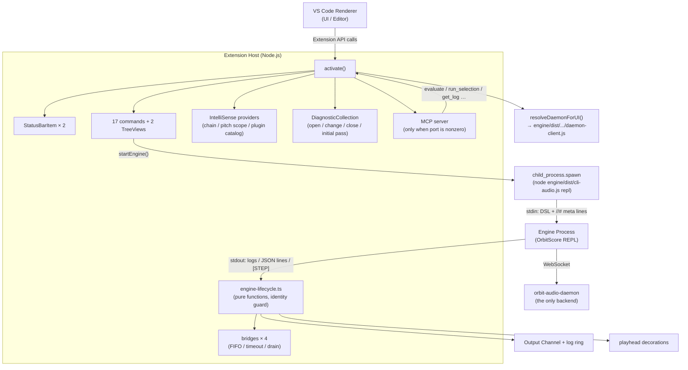

> **Note**: This page is a trace of the author's reading as of 2026-09-01, brought up to #385 (PR [#730](https://github.com/signalcompose/orbitscore/pull/730), the `capabilities.untrustedWorkspaces` declaration) on 2026-09-04, to the deferral of #385 layer 2 (PR [#750](https://github.com/signalcompose/orbitscore/pull/750)) on 2026-09-06, to #756 (PR [#776](https://github.com/signalcompose/orbitscore/pull/776), line-wise `ERROR:` prefixing) the same day, to #773 (PR [#811](https://github.com/signalcompose/orbitscore/pull/811), line-framing the stdout bridge envelopes) on 2026-09-08, and to #873 (PR [#874](https://github.com/signalcompose/orbitscore/pull/874), bundling the extension's own runtime dependencies) and #843 (PR [#871](https://github.com/signalcompose/orbitscore/pull/871), the bump to extension 3.0.0 — **the package-version wording only**) on 2026-09-11, and — **in the engine spawn section only** — to #878 (PR [#889](https://github.com/signalcompose/orbitscore/pull/889), starting the engine on VS Code's bundled Node) on 2026-09-12. The code is the truth; this page is only a snapshot of understanding at that time.

# IV-1. VS Code Extension Architecture

How does OrbitScore's VS Code extension (`packages/vscode-extension`, package version 3.0.0) start up, and how is it connected to the engine? This chapter reads its internal structure in order, from the extension's activation to the communication with the engine process. What changed most since the first draft in 2026-05 is "the engine-kind branch," "the extraction of the engine lifecycle into a vscode-free module," and "the growth of peripheral features such as the MCP server, the playhead, and the Engine view"; a list of the drift is collected at the end.

---

## Table of Contents

1. [Extension Host Basics](#extension-host-basics)
2. [activation and activationEvents](#activation-and-activationevents)
3. [Workspace Trust and untrustedWorkspaces](#workspace-trust-and-untrustedworkspaces)
4. [Module-Level State](#module-level-state)
5. [The Big Picture of the `activate()` Function](#the-big-picture-of-the-activate-function)
6. [Status Bar: Two Indicators](#status-bar-two-indicators)
7. [Command Registration](#command-registration)
8. [IntelliSense and Diagnostics Registration](#intellisense-and-diagnostics-registration)
9. [Binary Resolution: the Daemon](#binary-resolution-the-daemon)
10. [Spawning the Engine Process](#spawning-the-engine-process)
11. [Communication Protocol with the Engine](#communication-protocol-with-the-engine)
12. [Stopping the Engine and the Lifecycle Identity Guard](#stopping-the-engine-and-the-lifecycle-identity-guard)
13. [Architecture Overview Diagram](#architecture-overview-diagram)
14. [Drift as of 2026-09](#drift-as-of-2026-09)

---

## Extension Host Basics

VS Code extensions run on a dedicated Node.js process called the **Extension Host**. It is forked from the Renderer process (the editor UI); it has no DOM access but has all of Node.js's features (`fs`, `child_process`, etc.) available. Because the OrbitScore extension separately starts the engine process via `child_process.spawn` from this Extension Host, and the engine in turn starts an audio process, the processes form three layers:

```
VS Code Renderer (UI)
    └── Extension Host (Node.js)  ← extension code runs
            └── engine process (node engine/dist/cli-audio.js repl)  ← OrbitScore DSL engine
                    └── orbit-audio-daemon (Rust, the only backend, WebSocket)
```

There is only one audio process: `orbit-audio-daemon`. The `orbitscore.engine` setting (default `"rust"`) used to let you pick scsynth (SuperCollider, OSC) instead, and that branch showed up throughout the chapter, but both the setting and the branch were removed in [#840](https://github.com/signalcompose/orbitscore/pull/840) (#502). Where the text below touches that branch, it now says so.

---

## activation and activationEvents

`package.json` declares "at what timing the extension activates" via the `activationEvents` field.

OrbitScore uses two kinds:

- `"onStartupFinished"`: activates unconditionally after VS Code finishes startup
- `"onLanguage:orbitscore"`: activates the moment an `.orbs` file (language ID: `orbitscore`) is opened

Because of `onStartupFinished`, the extension is always loaded even if no OrbitScore file is open. That is why the status bar indicators are always visible.

---

## Workspace Trust and untrustedWorkspaces

What `activationEvents` decides is "when the extension activates." So who decides whether it may activate at all? That is VS Code's **workspace trust**. In a workspace that is not trusted, an extension is restricted by default and `activate()` itself is never called.

The case where this bites is a launch that opens no folder and passes a single `.orbs` file (`orbs file.orbs`). VS Code treats that shape as an **ad-hoc untrusted workspace**, so an extension that does not declare `capabilities.untrustedWorkspaces` will not activate there. To the user it simply looks like "nothing happens," which means **the real damage is not a refusal but silence** (#385).

The declaration sits in `package.json` between `engines` and `main`.

```json
// packages/vscode-extension/package.json:32-38
  "capabilities": {
    "untrustedWorkspaces": {
      "supported": true,
      "description": "OrbitScore starts a native audio engine and loads the audio plugins named by the score, the same way a DAW opens a project. Evaluation works in untrusted workspaces; only the settings that choose which executable runs are restricted.",
      "restrictedConfigurations": []
    }
  },
```

`supported: true` declares "do not restrict me even when untrusted." The rationale of the ruling is "to match the behaviour of a typical DAW" (`docs/design/656-release-design.md` §16 (1)): a DAW loads the plugins of a project when it opens it, without asking about trust. OrbitScore likewise starts the engine in an untrusted workspace and loads the `instrument(path)` entries of the score. That is why no trust-checking guard is placed in `startEngine()`. Live coding is the act of evaluating over and over, so a single confirmation dialog turns into "an interruption every time."

`restrictedConfigurations` takes effect independently of the `supported` value: for any key listed there, the workspace-side value is ignored in an untrusted workspace and the user-level value is used instead. It used to list two keys — `orbitscore.scsynthPath` (the path of the executable itself) and `orbitscore.engine` (tipping it to `"sc"` activated `scsynthPath`) — but **both were removed along with the SC path in #502**, so **as of 2026-09-10 it is an empty array**. With only one remaining backend (the Rust daemon), no workspace setting chooses which executable runs anymore, so there is nothing left to restrict.

What is interesting is that this declaration is never read from code. Left alone it would become "a setting nobody reads," so the 6 tests in `tests/vscode-extension/untrusted-workspace-capability.spec.ts` read the manifest directly and inspect it. They are written to fail on the spot when `restrictedConfigurations` cannot be taken out as an array, because falling back to `?? []` would let `for...of` iterate zero times and go green the moment the declaration disappears entirely.

That said, **what this layer guarantees stops at the content of the declaration**. Whether the extension really activates in an untrusted workspace, and moreover produces sound as usual, is meant to be pinned down by the gated real-device E2E (`E2E-D1`), which was split out into #735. Development mode launched with `--extensionDevelopmentPath` bypasses the workspace-trust restriction, so an E2E written there stays green even when the whole `capabilities` block is deleted — that is what was measured on 2026-09-04.

Beyond that, **the declaration only covers OrbitScore's own extension**. `anthropic.claude-code` ships alongside it inside OrbitStudio, and according to `docs/planning/DEVELOPMENT_MAP.md` §4.J (PR [#750](https://github.com/signalcompose/orbitscore/pull/750)) that extension declares `untrustedWorkspaces.supported: false`; it is managed by Anthropic, so **we cannot add the declaration from our side**. In a loose-file launch OrbitScore therefore activates while **the LLM side silently does not**, which is a shipping blocker under a policy that treats the LLM as a first-class user. So #385 is **not finished at the declaration (layer 1)**: a **layer 2** remains, turning workspace trust off by default in the OrbitStudio build itself (`product.overrides.json` + `build_orbitstudio.sh`, PR-S-T2 in the plan, designed in `docs/design/656-release-design.md` §3.4). Layer 2 is scheduled before the #656 release, and it was decided that stage 1 (the must-fix audio path) would not touch it (owner, 2026-09-05).

---

## Module-Level State

Module-level mutable state is collected in `extension-state.ts` (split in #887, 2026-09-12). Reads are ES module live bindings, so the reading sites are unchanged; only writes go through setters. These declarations serve as an index of what this extension carries.

```typescript
// packages/vscode-extension/src/extension-state.ts:25-36
export let engineProcess: child_process.ChildProcess | null = null
export let outputChannel: vscode.OutputChannel | null = null
export let statusBarItem: vscode.StatusBarItem | null = null
export let bundleStatusItem: vscode.StatusBarItem | null = null
export let devDocsPanel: vscode.WebviewPanel | null = null
export let isLiveCodingMode: boolean = false
// Tracks whether `var global = init GLOBAL` has been evaluated in the current engine session.
// Used to decide if `global.setDocumentDirectory(...)` can be prepended safely.
export let globalInitialized: boolean = false
export let transportPlaying: boolean = false
// Optional MCP control server (Agent Bridge). Non-null only while running.
export let mcpServerHandle: McpServerHandle | null = null
```

After this come four **bridges** that wait for JSON lines coming back on the engine's stdout (`DeviceSwitchBridge` / `PluginStateBridge` / `PluginUiBridge` / `EvalMarkBridge`). Each is a FIFO that "writes a meta line to stdin and resolves on the corresponding one-line JSON on stdout," and when the engine dies, `drainAll()` fails all of them. This structure prevents the race where, after a fast `stop → start` of the engine, a response from the old process matches a request of the new engine (#501 / #528).

---

## The Big Picture of the `activate()` Function

The entry point is `activate()` in `extension.ts`. It is called once immediately after VS Code loads the extension. Let's look at the first half.

```typescript
// packages/vscode-extension/src/extension.ts:129-185
export async function activate(context: vscode.ExtensionContext) {
  console.log('OrbitScore Audio DSL extension activated!')

  // Reset state on activation (important for reload)
  setEngineProcess(null)
  setLiveCodingMode(false)
  setGlobalInitialized(false)
  setTransportPlaying(false)

  // Create output channel
  const channel = vscode.window.createOutputChannel('OrbitScore')
  setOutputChannel(channel)

  // Tap appendLine/append into the ring buffer so the MCP get_log tool can read
  // recent output without a separate logging sink (#388). Installed before the
  // version banner below so get_log's history starts from activation.
  const rawAppendLine = channel.appendLine.bind(channel)
  channel.appendLine = (value: string) => {
    pushLogRing(value)
    rawAppendLine(value)
  }
  const rawAppend = channel.append.bind(channel)
  channel.append = (value: string) => {
    for (const line of value.split('\n')) {
      if (line) pushLogRing(line)
    }
    rawAppend(value)
  }

  // Show version info
  const packageJson = JSON.parse(fs.readFileSync(path.join(__dirname, '../package.json'), 'utf8'))
  const buildTime = fs.statSync(__filename).mtime.toISOString()
  channel.appendLine('━━━━━━━━━━━━━━━━━━━━━━━━━━━━━━━━━━━━━━')
  channel.appendLine(`🎵 OrbitScore Extension v${packageJson.version}`)
  channel.appendLine(`📦 Build: ${buildTime}`)
  channel.appendLine(`📂 Path: ${__dirname}`)
  channel.appendLine('━━━━━━━━━━━━━━━━━━━━━━━━━━━━━━━━━━━━━━')
  channel.appendLine('')

  // Create status bar item
  const statusItem = vscode.window.createStatusBarItem(vscode.StatusBarAlignment.Right, 100)
  setStatusBarItem(statusItem)
  statusItem.text = '🎵 OrbitScore: Stopped'
  statusItem.tooltip = 'Open Audio Engine Settings'
  statusItem.command = 'orbitscore.showCommands'
  statusItem.show()

  // Bundle status indicator (priority 99 → 既存 100 の左隣に並ぶ)。daemon
  // が解決できない時だけ表示するエラー・インジケータ（健全時は非表示）。
  const bundleItem = vscode.window.createStatusBarItem(vscode.StatusBarAlignment.Right, 99)
  setBundleStatusItem(bundleItem)
  bundleItem.command = {
    command: 'workbench.action.openSettings',
    title: 'Open OrbitScore settings',
    arguments: ['orbitscore'],
  }
  updateBundleStatus()
```

What is interesting is the spot where the Output Channel's `appendLine` / `append` are **monkey-patched**. The extension has no central log sink, so in order for the MCP `get_log` tool (#388) to read it, the lines flowing into the Output Channel are also pushed to a ring buffer (`outputLogRing`, capped by `OUTPUT_LOG_RING_MAX = 1000` in `log-ring.ts`).

The rest of `activate()` is roughly five jobs:

1. Register configuration-change listeners (`orbitscore.playheadPalette` — the SC-path settings `scsynthPath` / `engine` were removed in #502)
2. Register commands and TreeView providers (next section)
3. Register IntelliSense (completion / hover) providers
4. Register diagnostics (`DiagnosticCollection`) and run an initial pass over already-open documents (#384)
5. Start the MCP server (only when the port is nonzero) and auto-start the Rust engine

The last two are written like this.

```typescript
// packages/vscode-extension/src/extension.ts:275-329 (MCP ツールのハンドラ表を省略)
  // Optional MCP control server (Agent Bridge, #388) — dev/agent-integration
  // only, gated behind a nonzero port. The `ORBITSCORE_MCP_PORT` env var takes
  // precedence over the `orbitscore.mcpServer.port` setting so the extension can
  // be launched from the CLI (e.g. Extension Development Host) with the port set
  // without editing settings. Lets an external agent (e.g. Claude Code) drive
  // OrbitScore operations for E2E testing.
  const envMcpPort = Number(process.env.ORBITSCORE_MCP_PORT)
  const mcpPort =
    Number.isInteger(envMcpPort) && envMcpPort > 0
      ? envMcpPort
      : vscode.workspace.getConfiguration('orbitscore').get<number>('mcpServer.port', 0)
  if (mcpPort && mcpPort > 0) {
    try {
      const handle = await startOrbitScoreMcpServer({
        port: mcpPort,
        version: packageJson.version,
        handlers: {
          evaluate: (code) => evaluateForAgent(code),
          startEngine: (options) => startEngineForAgent(options),
          stopEngine: () => stopEngineForAgent(),
          getEngineState: () => getEngineStateForAgent(),
          listAudioDevices: () => listAudioDevicesForAgent(),
          selectAudioDevice: (device) => selectAudioDeviceForAgent(device),
          configureFlash: (options) => configureFlashForAgent(options),
          openFile: (filePath) => openFileForAgent(filePath),
          setSelection: (range) => setSelectionForAgent(range),
          runSelection: () => runSelectionForAgent(),
          editReplace: (args) => editReplaceForAgent(args),
          getEditorState: () => getEditorStateForAgent(),
          saveFile: () => saveFileForAgent(),
          getDocumentText: () => getDocumentTextForAgent(),
          getDiagnostics: (filePath) => getDiagnosticsForAgent(filePath),
          getLog: (lines) => getLogForAgent(lines),
          analyzeAudio: (wavPath, windowMs, perChannel) =>
            analyzeAudioForAgent(wavPath, windowMs, perChannel),
          listPlugins: () => listPluginsForAgent(),
          rescanPlugins: () => rescanPluginsForAgent(),
          savePluginState: (sequence, index) => savePluginStateForAgent(sequence, index),
          openPluginUi: (receiver, index, expectedName) =>
            pluginUiForAgent('open', receiver, index, expectedName),
          closePluginUi: (receiver, index) => pluginUiForAgent('close', receiver, index),
          registerMcpServer: (args) => registerMcpServerForAgent(args),
        },
        log: (message) => outputChannel?.appendLine(`🔌 ${message}`),
      })
      setMcpServerHandle(handle)
    } catch (err) {
      const reason = err instanceof Error ? err.message : String(err)
      outputChannel?.appendLine(`❌ MCP server failed to start on port ${mcpPort}: ${reason}`)
      vscode.window.showWarningMessage(`OrbitScore MCP server failed to start: ${reason}`)
    }
  }

  void autoStartConfiguredRustEngine()
}
```

The omitted block is the table that hands 25 handlers (`evaluate` / `startEngine` / `getLog` / `analyzeAudio` / `listPlugins` …) to `startOrbitScoreMcpServer()`. The internals of the MCP server and the gated E2E are left to [IV-3. MCP Server and Gated Real-Device E2E](/en/editor/mcp-and-gated-e2e). `autoStartConfiguredRustEngine()` auto-starts the engine under the `rust` kind when an output device is saved, and checks liveness 5 seconds later (`extension.ts:1699-1723`).

### In the shipped artifact it died before `activate()` (#873)

The `activate()` we have been reading was, on a plain VS Code with the `.vsix` installed, **never running a single line**. PR [#874](https://github.com/signalcompose/orbitscore/pull/874) found this by trying a cold install — launching as an installed extension, without `--extensionDevelopmentPath`. The exception comes not from the body of `activate()` but from loading the module itself.

```
Error: Cannot find module '@modelcontextprotocol/sdk/server/mcp.js'
  at Object.<anonymous> (.../local.orbitscore-3.0.0/dist/extension.js:74:22)
```

Why at load time? Because `extension.ts` imports from `./mcp-server` (`extension.ts:43`), and `mcp-server.ts` loads the MCP SDK with a top-level `require`.

```typescript
// packages/vscode-extension/src/mcp-server.ts:52-58
/* eslint-disable @typescript-eslint/no-require-imports, @typescript-eslint/no-var-requires */
const { McpServer } = require('@modelcontextprotocol/sdk/server/mcp.js') as {
  McpServer: new (info: { name: string; version: string }) => McpServerLike
}
const { StreamableHTTPServerTransport } =
  require('@modelcontextprotocol/sdk/server/streamableHttp.js') as {
    StreamableHTTPServerTransport: new (opts: {
```

That `require` sits at the top level of the file rather than inside a function, so it is never deferred to the fifth job of the previous section (starting the MCP server). If the SDK is absent from the bundle, `activate()` throws before reaching its first line — whether the MCP port is 0, and whether or not a single `.orbs` file is open.

What made it absent was npm workspaces hoisting. `packages/vscode-extension/package.json` declares `@modelcontextprotocol/sdk` and `zod` as runtime dependencies, but both are hoisted to the repository root. `.vscodeignore` drops everything outside the package with `../../**` and `../*/**`, so the `extension/node_modules` that `vsce package` shipped held only `@types` and `undici-types` — that is the measurement recorded in #874.

The fix is to put the extension's own dependencies back into the bundle at the end of the build.

```json
// packages/vscode-extension/package.json:419-421
    "build": "npm run build:engine && tsc -p tsconfig.json && bash ../../scripts/install-extension-deps.sh",
    "build:clean": "npm run build:engine:clean && tsc -p tsconfig.json && bash ../../scripts/install-extension-deps.sh",
    "build:engine": "cd ../engine && npm run build && bash ../../scripts/install-engine-deps.sh && bash ../../scripts/copy-daemon-bin.sh",
```

`install-engine-deps.sh` (for the engine) and `install-extension-deps.sh` (for the extension) are both thin wrappers; the substance lives in the shared `scripts/install-bundle-deps.sh`. What it does is run `npm install` in a temporary directory that has no workspace root above it, then move the resulting `node_modules` into the bundle — with nowhere to hoist to, every declared dependency is necessarily written locally. The same class of accident had already happened twice on the engine side (WORK_LOG 6.119 for `@julusian/midi` / `uuid` / `ws`, 6.422 for `yaml`); the extension side was simply the one left undefended.

The interesting part is **where** they land: the extension's dependencies go into `dist/node_modules` (`install-extension-deps.sh:37-40`). The script header gives two reasons. One is that `vsce package` excludes the package-root `node_modules` unconditionally, and a `!node_modules/**` negation in `.vscodeignore` cannot override it — while nested ones such as `engine/node_modules` and `dist/node_modules` ship normally. The other is Node's resolution order: seen from `dist/mcp-server.js`, `dist/node_modules` is the first candidate, so no path rewriting is needed. Alongside it, `vsce package` now carries `--no-dependencies`, which switches off the dependency walk that was returning hoisted root paths in the first place (`.github/workflows/release.yml:118`).

The regression gate changed too. The post-package check in `release.yml` used to count dependency names from `packages/engine/package.json` and test for directories; now `node scripts/check-vsix-bundled-deps.mjs` **resolves from the real files inside the shipped artifact**. The script is explicit that its guarantee is not uniform with depth: depth 1 is a real `require.resolve()` (a broken `exports` map or a missing entry point fails there), while depth > 1 only locates the directory the way Node would, so an ESM-only transitive package passes as long as it is present. Resolving every edge for real was tried and rejected — it reddens the release over ESM-only transitive packages the CJS code never requires — and walking the actual `import` graph with esbuild was filed as #875 instead.

::: warning The gated E2E cannot reach this path
The real-device gated E2E launches VS Code with `--extensionDevelopmentPath` (`tests/e2e/orbitstudio-mcp-gated.spec.ts:728`). In that shape the dependencies always resolve from the hoisted repository root, so **the suite stays green even with an empty bundle**. That makes one more path reachable only by a cold install (the other is the daemon's `extension-bundle` branch — under `--extensionDevelopmentPath` the repository's `rust/target/release` is picked up instead). The cold-install verification in #874 was done by hand and has not been landed as an automated test.
:::

---

## Status Bar: Two Indicators

There are **two** status bar indicators. Their priority values differ, determining the order from the right edge:

| Variable | priority | Role | On click |
|---|---|---|---|
| `statusBarItem` | 100 (rightmost) | Engine running state (`Stopped` / `Ready` / `▶️ Playing`, with `🐛` in debug) | `showCommands` (focuses the Engine view) |
| `bundleStatusItem` | 99 (left of it) | daemon binary resolution state | `orbitscore` setting |

**The 2026-09-10 ruling (#827 / #502) removed the SC path and the `getConfiguredEngineKind()` branch.** `updateBundleStatus()`, which decides the display of `bundleStatusItem`, no longer looks at the engine kind at all — it only looks at whether the daemon resolves.

```typescript
// packages/vscode-extension/src/engine-process.ts:74-84
export function updateBundleStatus(): void {
  if (!bundleStatusItem) return
  const daemonResolution = resolveDaemonForUI()
  if (!daemonResolution) {
    bundleStatusItem.show()
    bundleStatusItem.text = '$(error) daemon: not found'
    bundleStatusItem.tooltip =
      'orbit-audio-daemon not found. Reinstall the extension, build it via `cd rust && cargo build --release`, or set ORBIT_AUDIO_DAEMON_PATH to a custom binary.'
    bundleStatusItem.backgroundColor = new vscode.ThemeColor('statusBarItem.errorBackground')
    return
  }
```

When the daemon is found (= the normal state), the indicator is **hidden**. It is shown only as `$(error) daemon: not found` when the daemon cannot be resolved (see [ADR-003 scsynth Bundle Strict Mode](/en/decisions/adr-003-scsynth-bundle) — a historical record of the decision for the scsynth resolver this ADR covers; that resolver itself was removed in the 2026-09-10 ruling #827 / #502).

---

## Command Registration

Let's organize the commands `activate()` registers. There are 15 listed in `contributes.commands` (down from 17 — `forceKillScsynth` / `selectAudioDevice` were removed in #502), plus 2 internal commands invoked only from TreeView nodes.

```typescript
// packages/vscode-extension/src/extension.ts:197-232
  // Register commands
  context.subscriptions.push(
    vscode.commands.registerCommand('orbitscore.toggleEngine', toggleEngine),
    vscode.commands.registerCommand('orbitscore.showCommands', showCommands),
    vscode.commands.registerCommand('orbitscore.runSelection', runSelection),
    vscode.commands.registerCommand('orbitscore.stopEngine', stopEngine),
    vscode.commands.registerCommand('orbitscore.restartEngine', restartEngine),
    vscode.commands.registerCommand('orbitscore.reloadWindow', reloadWindow),
    vscode.commands.registerCommand('orbitscore.startEngineDebug', startEngineDebug),
    vscode.commands.registerCommand('orbitscore.configureFlash', configureFlash),
    vscode.commands.registerCommand('orbitscore.registerMcpServer', registerMcpServer),
    vscode.commands.registerCommand('orbitscore.rescanPlugins', rescanPlugins),
    vscode.commands.registerCommand('orbitscore.browsePlugins', browsePlugins),
    // viewsWelcome コンテンツは view に provider が登録されて初めて描画される
    // （空 TreeView で十分 — 章ツリーの本実装は #451 確定後の follow-up）。
    vscode.window.registerTreeDataProvider('orbitscore.learningView', {
      getChildren: () => [],
      getTreeItem: (element: vscode.TreeItem) => element,
    }),
    // Engine ビュー（#484 D3）: エンジン停止中は空を返し viewsWelcome（Start/Debug/Stop ボタン）を
    // 出す（viewsWelcome は tree が空の時だけ描画される — 上の学習ビューと同じ制約）。起動中は
    // engine 状態 + Output Device セクションを TreeView として描画する。
    (() => {
      const provider = new EngineViewProvider()
      setEngineViewProvider(provider)
      return vscode.window.registerTreeDataProvider('orbitscore.engineView', provider)
    })(),
    vscode.commands.registerCommand('orbitscore.engineViewSelectDevice', engineViewSelectDevice),
    vscode.commands.registerCommand('orbitscore.engineViewToggleEngine', engineViewToggleEngine),
    vscode.commands.registerCommand('orbitscore.engineViewToggleDebug', engineViewToggleDebug),
    vscode.commands.registerCommand('orbitscore.openDocs', openUserDocs),
    vscode.commands.registerCommand('orbitscore.openDevDocs', openDevDocs),
    vscode.commands.registerCommand('orbitscore.openDevDocsPanel', () => openDevDocsPanel(context)),
    vscode.commands.registerCommand('orbitscore.openWalkthrough', openWalkthrough),
    statusItem,
    bundleItem,
```

| Command ID | Function | Description | Palette visibility |
|---|---|---|---|
| `orbitscore.toggleEngine` | `toggleEngine` | Toggle engine start/stop | hidden (`editor/title` button) |
| `orbitscore.showCommands` | `showCommands` | Focus the Engine view | (from the status bar) |
| `orbitscore.runSelection` | `runSelection` | Execute selected code / current block (Cmd+Enter) | shown |
| `orbitscore.stopEngine` | `stopEngine` | Stop the engine | hidden |
| `orbitscore.restartEngine` | `restartEngine` | stop → wait 2.2 s → start (recovery) | hidden (Engine view Recovery) |
| `orbitscore.reloadWindow` | `reloadWindow` | `workbench.action.reloadWindow` | hidden (Engine view Recovery) |
| `orbitscore.startEngineDebug` | `startEngineDebug` | Start in debug mode | hidden |
| `orbitscore.configureFlash` | `configureFlash` | Configure flash effect | shown |
| `orbitscore.registerMcpServer` | `registerMcpServer` | Write a Claude Code entry into `.mcp.json` (#388) | shown |
| `orbitscore.rescanPlugins` | `rescanPlugins` | Rescan the plugin catalog (#463) | shown + `editor/context` |
| `orbitscore.browsePlugins` | `browsePlugins` | Pick a name from the catalog and insert it (#638) | shown |
| `orbitscore.engineViewSelectDevice` | `engineViewSelectDevice` | Click on a device node in the Engine view (#484 D3) | hidden |
| `orbitscore.openDocs` | `openUserDocs` | Open the user learning site in the browser | shown + `editor/title` |
| `orbitscore.openDevDocs` | `openDevDocs` | Open the dev learning site (this site) in the browser (#450) | shown |
| `orbitscore.openDevDocsPanel` | `openDevDocsPanel` | Same, in a Webview tab (#457) | shown |
| `orbitscore.openWalkthrough` | `openWalkthrough` | Open the `orbitscore.learnOrbitScore` walkthrough (4 steps) (#457) | shown |
| `orbitscore.engineViewToggleEngine` / `engineViewToggleDebug` | — | Internal commands invoked from Engine view nodes | not in `contributes.commands` |

A keybinding for `orbitscore.runSelection` is set in `package.json`:

```json
{
  "key": "cmd+enter",
  "command": "orbitscore.runSelection",
  "when": "editorTextFocus && editorLangId == orbitscore"
}
```

Because `editorLangId == orbitscore` is specified in the `when` clause, it is only effective when an `.orbs` file has focus.

Two containers have grown on the Activity Bar (`orbitscore` = the Learning view, `orbitscore-engine` = the Audio Engine Settings view). The Learning view is an empty TreeView, an entry point that only shows the `viewsWelcome` buttons (Open Learning Site / Start the Walkthrough). For the Engine view, the pure functions in `engine-view.ts` assemble the nodes and `EngineViewProvider` in `engine-view-provider.ts` maps them to `vscode.TreeItem`.

```typescript
// packages/vscode-extension/src/engine-view.ts:47-54
export function buildRootNodes(engineRunning: boolean): EngineViewNode[] {
  return [
    buildEngineStatusNode(engineRunning),
    buildDebugToggleNode(false),
    buildDeviceSectionNode(),
    buildRecoverySectionNode(),
  ]
}
```

The semantics of clicking a device is "selection = power": clicking the same device again stops, clicking while not running starts, clicking while running switches live — decided by `resolveDeviceClickAction()` (`engine-view.ts:207-216`). A live switch is requested from the engine via the `//#selectAudioDevice` meta line (two sections below).

---

## IntelliSense and Diagnostics Registration

`registerCompletionProviders(context)` and `registerHoverProvider(context)` handle IntelliSense. Completion has grown to four families.

1. **Method-chain contextual completion**: `analyzeMethodChain()` and `getContextualCompletions()` in `completion-context.ts`. Triggered by `.`, it looks at which stage of the chain we are in and reorders candidates
2. **Pitch-scope completion**: when `).` is typed at a position where the parentheses of `.play(` are still open, it switches to `getPitchScopeCompletions()` (`extension.ts:3652-3672`)
3. **Plugin catalog name completion**: inside the string argument of `effect(` / `instrument(`, triggered by `"`, it offers names from the catalog (#463 C3, `extension.ts:3689-` onward). For depth, see [PH-3. The Plugin Catalog and Replacement](/en/plugin-hosting/catalog)
4. **`.output(` destination completion**: candidates appear as soon as `.output(` is typed (#883 bundle C, PR #884). Inside the string argument (the `"` trigger) it offers `master` plus the declared sum / aux names; at the identifier position right after the paren (the `(` trigger) it offers `master` plus the declared mixer-node variables (`mix.sum` / `mix.aux` / `mix.output(...)`)

The `.output(` destination completion splits into two contexts. `detectDslCompletionContext()` in
`dsl-completion-context.ts` returns `output-string` inside a string and `output-node` at a code
position.

```typescript
// packages/vscode-extension/src/dsl-completion-context.ts:86-97
  if (state !== 'code') return null

  // `.output(` accepts the reserved `master` identifier and any declared mixer-node
  // variable (`mix.sum`, `mix.aux`, or `mix.output(...)`). Stop at the first argument:
  // options after a comma are a different completion surface.
  const outputNode = /\.output\(\s*([A-Za-z_$][\w$]*)?$/.exec(prefix)
  // A mixer-node declaration uses numeric channel arguments, not routing destinations. Reuse
  // the receiver-aware declaration pattern below so `var cue = mix.output(` cannot be mistaken
  // for a Sequence/MixerBusHandle output call.
  if (outputNode && !VAR_NODE_PATTERNS.mixerNode.test(prefix)) {
    return { kind: 'output-node', typed: outputNode[1] ?? '' }
  }
```

🔴 The `VAR_NODE_PATTERNS.mixerNode.test(prefix)` exclusion matters because the `output(` in
`var cue = mix.output(3, 4)` is **a physical-output node declaration, not the destination-taking
`output()`**. Without the exclusion, `master` would be offered where a channel number belongs.

Assembling the candidates happens on the `extension.ts` side.

```typescript
// packages/vscode-extension/src/extension.ts:1704-1717
      case 'output-string':
        return makeItems(
          [
            'master',
            ...extractDeclaredBusNames(document.getText(), 'sum'),
            ...extractDeclaredBusNames(document.getText(), 'aux'),
          ],
          vscode.CompletionItemKind.Value,
        )
      case 'output-node':
        return makeItems(
          ['master', ...extractDeclaredMixerNodeNames(document.getText())],
          vscode.CompletionItemKind.Variable,
        )
```

`output-string` offers sum **and** aux because `output()` can name an aux as well (`send` is sugar
over it) — see the destination table in `docs/core/INSTRUCTION_ORBITSCORE_DSL.md` MX.2. By
contrast `aux-name` (inside `.send("`) offers only aux names.

One trigger character was added too. Without `(`, nothing appears right after `.output(` unless
completion is invoked explicitly.

```typescript
// packages/vscode-extension/src/extension.ts:1574-1584
  const dslCompletionProvider = vscode.languages.registerCompletionItemProvider(
    'orbitscore',
    dslCompletionItemProvider,
    '"',
    '{',
    // #495 第1段: `<receiver>.` の後のメソッド補完を出すためのトリガー。
    // これが無いと、明示的に補完を呼び出さない限り出てこない。
    '.',
    // #883: destination completion starts as soon as `.output(` is typed.
    '(',
  )
```

`MethodChainContext` has gained three flags since 2026-05.

```typescript
// packages/vscode-extension/src/completion-context.ts:6-18
interface MethodChainContext {
  hasAudio: boolean
  hasChop: boolean
  hasPlay: boolean
  hasBeat: boolean
  hasLength: boolean
  hasTempo: boolean
  hasRun: boolean
  hasOutput: boolean
  hasLinkAudio: boolean
  hasQuantize: boolean
  lastMethod: string
}
```

The completion vocabulary is duplicated in `dsl-method-catalog.ts`, and a test enforces that it matches the engine's `SEQUENCE_DSL_METHODS` / `GLOBAL_DSL_METHODS` / `BUS_DSL_METHODS` character for character. Because the extension process is designed not to import engine modules, duplication is unavoidable; the trade-off is to make drift red via the test instead.

```typescript
// packages/vscode-extension/src/extension.ts:1-6
/**
 * OrbitScore VS Code extension root and public re-export surface.
 *
 * Engine wiring function bodies were moved unchanged to the engine modules;
 * formerly private helpers are imported only where this root still wires them.
 */
```

Diagnostics (`updateDiagnostics`) were driven only by `onDidChangeTextDocument` as of 2026-05, but #384 extended them to "when opened," "when closed," and "documents already open at activation."

```typescript
// packages/vscode-extension/src/extension.ts:244-273
  // Compute diagnostics on open and change; clear them on close (#384).
  // Diagnostics must not wait for the first edit — files opened from the CLI,
  // restored tabs, or the activation-time initial pass below all need
  // errors/warnings surfaced immediately.
  context.subscriptions.push(
    vscode.workspace.onDidOpenTextDocument((document) => {
      if (isOrbitscoreDocument(document)) {
        updateDiagnostics(document, diagnosticCollection)
      }
    }),
    vscode.workspace.onDidChangeTextDocument((event) => {
      if (isOrbitscoreDocument(event.document)) {
        updateDiagnostics(event.document, diagnosticCollection)
      }
    }),
    vscode.workspace.onDidCloseTextDocument((document) => {
      if (isOrbitscoreDocument(document)) {
        diagnosticCollection.delete(document.uri)
      }
    }),
  )

  // Initial pass over documents already open at activation (#384): the
  // extension activates on `onLanguage:orbitscore`, so the triggering document
  // is already open and would otherwise never fire onDidOpenTextDocument.
  for (const document of vscode.workspace.textDocuments) {
    if (isOrbitscoreDocument(document)) {
      updateDiagnostics(document, diagnosticCollection)
    }
  }
```

There are 9 kinds of checks in total: 3 per-line plus 6 cross-line analyses. For details, see [IV-2](/en/editor/execution-feedback#real-time-diagnostics-updatediagnostics).

#883 added one more line next to the diagnostic registration: **the quick fix**. `registerOutputCodeActionProvider(context)` returns an "add `<name>.output()`" CodeAction for the two diagnostic codes `output-missing` and `dry-not-routed`.

```typescript
// packages/vscode-extension/src/extension.ts:235-238
  // Register IntelliSense providers
  registerCompletionProviders(context)
  registerHoverProvider(context)
  registerOutputCodeActionProvider(context)
```

The provider itself lives at `extension.ts:3482-3520` and pushes the return value of `vscode.languages.registerCodeActionsProvider` onto `context.subscriptions`. Its body is covered in [IV-2](/en/editor/execution-feedback).

---

## Binary Resolution: the Daemon

Before spawning the engine, the extension pre-checks "does the audio process's executable really exist?" There is an interesting implementation pattern here: **the JS of the Extension Host (compiled from TypeScript) runtime-loads the engine package's compiled JS via `require`**. Before it was removed by the **2026-09-10 ruling (#827 / #502)**, this wrapper existed in symmetric pairs for scsynth (`resolveScsynthForUI()`) and the daemon (`resolveDaemonForUI()`); with the SC path gone, **only `resolveDaemonForUI()` remains**.

```typescript
// packages/vscode-extension/src/engine-process.ts:57-64
export function resolveDaemonForUI(): { path: string; source: string } | null {
  try {
    return resolveDaemonBinaryForExtension()
  } catch (err) {
    const reason = err instanceof Error ? err.message : String(err)
    outputChannel?.appendLine(`❌ daemon resolver failed: ${reason}`)
    return null
  }
```

The daemon-side `require` is carved out into a small module, `engine-startup-runtime.ts`. This lets unit tests replace this boundary, so the logic of `startEngine()` can be tested even in an environment without the extension's build artifacts (`engine/dist/`).

```typescript
// packages/vscode-extension/src/engine-startup-runtime.ts:14-24
export function resolveDaemonBinaryForExtension(): EngineBinaryResolution {
  // eslint-disable-next-line @typescript-eslint/no-require-imports, @typescript-eslint/no-var-requires
  const daemonModule = require('../engine/dist/audio/rust-engine/daemon-client') as {
    resolveDaemonBinaryPath: (explicitPath?: string) => EngineBinaryResolution
  }
  return daemonModule.resolveDaemonBinaryPath()
}

export function extensionEngineFileExists(enginePath: string): boolean {
  return fs.existsSync(enginePath)
}
```

The daemon resolver is `explicit > env > monorepo-release > monorepo-debug > extension-bundle > throw`. It has no silent fallback; if nothing is found, it fails loud with an exception (see [ADR-003](/en/decisions/adr-003-scsynth-bundle) — a historical record of the decision for the scsynth resolver it covers; that resolver was removed in #502).

::: warning The scsynth resolver is gone from the extension (#836 → #838, 2026-09-10)
First, [#836](https://github.com/signalcompose/orbitscore/pull/836) made `packages/engine/scripts/sync-dist.js` delete `engine/scsynth` and the synced `dist/audio/supercollider/` every time it syncs the engine into the extension. From that point, in a shipped `.vsix`:

- the `bundle` candidate path (`<engine root>/scsynth/Contents/Resources/scsynth`) did not exist
- **the very module** the extension `require`d — `../engine/dist/audio/supercollider/scsynth-resolver` — did not exist either

The extension's TypeScript was not touched by #836, so `resolveScsynthForUI()` caught the require failure, wrote `❌ scsynth resolver failed: …` to the outputChannel and returned `null`.

Then [#838](https://github.com/signalcompose/orbitscore/pull/838) (part of bundle [#840](https://github.com/signalcompose/orbitscore/pull/840)) **deleted `resolveScsynthForUI()` outright**, and no reference to `scsynth` remains anywhere under `packages/vscode-extension/src/`. Because that was a runtime `require` that never goes through `tsc`, deleting the engine-side source alone would have left type-checking green while the code failed at runtime (the "runtime `require` trap" in the #840 description). The only binary resolution left is the daemon side, `resolveDaemonForUI()`.
:::

---

## Spawning the Engine Process

`startEngine(debugMode?, agentOpts?)` actually starts the engine as a child process. The differences from 2026-05 are that it became `async` and returns a `boolean`, that the pre-check branches on the engine kind, and that it accepts `capture_wav` from MCP.

The pre-check is quoted in the former III-3 chapter, now removed from the site (recorded in [ADR-003](/en/decisions/adr-003-scsynth-bundle)), so here we read from assembling args and env through the spawn.

```typescript
// packages/vscode-extension/src/engine-process.ts:304-308
  // Build args
  const args = ['repl']
  if (audioDevice && audioDevice !== '__default__') {
    args.push('--audio-device', audioDevice)
  }
```

The engine CLI (`engine/dist/cli-audio.js`) is started with the `repl` subcommand, and the output device is passed via the `--audio-device` argument (the `orbitscore.audioDevice` setting takes precedence, otherwise `.orbitscore.json`). `__default__` is a sentinel meaning "the OS default output."

```typescript
// packages/vscode-extension/src/engine-process.ts:313-362
  // Set environment
  const env = { ...process.env }
  if (effectiveDebugMode) {
    env.ORBITSCORE_DEBUG = '1'
  }

  // Capture seam (#307): the daemon records the master output to this WAV while
  // the stream runs. Only set when explicitly requested (MCP start_engine tool)
  // — inherited env stays authoritative otherwise.
  if (agentOpts?.captureWav) {
    env.ORBIT_CAPTURE_WAV = agentOpts.captureWav
    outputChannel?.appendLine(`🎙️ Capture: ${agentOpts.captureWav}`)
  }

  outputChannel?.appendLine('🦀 Audio backend: rust (orbit-audio-daemon, native)')

  // Spawn engine process
  // 🔴 `node` を PATH から引かない（#878）。Finder / launchd から起動された VS Code の PATH は
  // `/etc/paths` の最小構成で、`nodenv` / Homebrew で node を入れている環境ではそこに node が
  // 無い。engine は `spawn node ENOENT` で起動せず、症状は「エンジンが起動しない」だけなので
  // 原因が PATH だと利用者には分からない。VS Code がログインシェルの環境を解決してくれる時は
  // 通るが、それは実装詳細への暗黙の依存で、2026-09-12 に通らない条件を実測で特定した
  // （cold install した `.vsix` を CLI ラッパ経由 + 最小 PATH で起動すると確定で ENOENT）。
  //
  // 代わりに **VS Code 同梱の Node** を使う。拡張ホストは Electron なので `process.execPath` は
  // そのままでは Node として動かず（実測: `Unable to find helper app` で落ちる）、
  // `ELECTRON_RUN_AS_NODE=1` が要る。**実測の出典: #878 / PR #889・2026-09-12・この開発機**
  // （VS Code **1.134.0** / Electron 42.8.1）: 同梱 Node は 24.18.1 でルートの
  // `engines.node >=22.0.0` を満たし、`@julusian/midi` の prebuild も素の node と同じく読めた
  // （port count が一致）。後者は偶然ではない — `pkg-prebuilds` のローダは **N-API の時
  // Electron 判定へ入らず** `node-napi-v7.node` に決定論的に落ちる（`pkg-prebuilds/bindings.js`）。
  // 🔴 版は VS Code に従属するので、ここの数値は**その時点の観測**であって要件ではない。
  //
  // 🔴 「Electron の `runAsNode` fuse を将来 VS Code が無効化したら、`spawn` は成功するのに
  // Node として動かず、ENOENT も出ないまま偽の『起動した』になるのでは」— レビューで出た問い。
  // **VS Code はこの fuse を無効化できない**: 自身の CLI が
  // `ELECTRON_RUN_AS_NODE=1 "$ELECTRON" "$CLI"` で動いており（`Contents/Resources/app/bin/code`）、
  // 拡張ホストの fork（`out/bootstrap-fork.js`）も同じ変数に依存している。無効化すれば
  // `code` コマンド自体が壊れる。つまりこの経路は **VS Code 自身と同じ土台**に乗っている。
  const spawnedProcess = (() => {
    try {
      return child_process.spawn(process.execPath, [enginePath, ...args], {
        cwd: workspaceRoot,
        stdio: ['pipe', 'pipe', 'pipe'],
        // `ELECTRON_NO_ASAR` は**素の node との意味論差を消すため**に併記する。
        // `ELECTRON_RUN_AS_NODE` の子では Electron の asar フックが生きており、`fs` が
        // 「`.asar` で終わるディレクトリ」をアーカイブとして扱う（Electron docs）。engine は
        // 利用者の与えたパス（`global.audioPath(...)`）を読むので、そこに `.asar` が現れた時だけ
        // 素の node と挙動が変わる。踏む確率は低いが、消すコストがゼロなら消しておく。
        env: { ...env, ELECTRON_RUN_AS_NODE: '1', ELECTRON_NO_ASAR: '1' },
```

**The 2026-09-10 ruling (#827 / #502) removed the `engineKind` branch entirely, along with the explicit `ORBITSCORE_ENGINE` set and the `ORBIT_SCSYNTH_PATH` hand-off.** For the sole remaining backend (the Rust daemon), only the debug flag and the capture seam (#307) are pushed into the `env` variable.

That is not, however, everything the spawn receives. **On 2026-09-12 (#878, PR [#889](https://github.com/signalcompose/orbitscore/pull/889)) the spawn arguments themselves changed.** The extension stopped looking up `node` on PATH and now uses **the Node that VS Code itself bundles** (`process.execPath`), because a VS Code launched from Finder or launchd has the minimal PATH from `/etc/paths` and there is no `node` there on machines where node comes from nodenv or Homebrew. The extension host is Electron, so `process.execPath` does not run as Node on its own; it becomes Node only once `ELECTRON_RUN_AS_NODE=1` is passed. `ELECTRON_NO_ASAR=1` is set alongside it because Electron's asar hook stays alive in that child, making `fs` treat a directory whose name ends in `.asar` as an archive — a difference from plain node that would only show up if such a path appeared in what the user passed to `global.audioPath(...)`.

Both variables enter the engine process, so they would also flow on to the daemon the engine starts unless something stopped them. The exit point on the engine side (`daemonEnv()`) drops `ELECTRON_RUN_AS_NODE` only (see [0-2 Architecture Overview](/en/orientation/architecture-overview)).

`stdio: ['pipe', 'pipe', 'pipe']` is important. By making stdin/stdout/stderr all pipes, the Extension Host can directly write/read them. Right after spawn, five handlers are attached, and after one `process.nextTick` it checks "is the same process still alive?"

```typescript
// packages/vscode-extension/src/engine-process.ts:382-392
  // Setup handlers
  setupStdoutHandler(spawnedProcess, effectiveDebugMode)
  setupStderrHandler(spawnedProcess)
  setupExitHandler(spawnedProcess)
  setupStdinErrorHandler(spawnedProcess)
  setupErrorHandler(spawnedProcess)

  await new Promise<void>((resolve) => process.nextTick(resolve))
  if (!engineProcess || engineProcess !== spawnedProcess || engineProcess.killed) {
    return false
  }
```

`setupErrorHandler` (#533) receives the `'error'` event of a spawn failure (`ENOENT`, etc.); without it, `engineProcess` stays non-null and `isEngineRunning()` lies.

### Turning stderr back into lines — `createLinePrefixer` (#756)

Of those five, `setupStderrHandler` is the one that copies the engine's stderr into the Output Channel with an `ERROR:` prefix. There is one mechanism worth noting here. What arrives from the pipe is a **chunk** (a fragment of text cut wherever the read happened), not a line, so prefixing chunk by chunk means that when a single chunk holds two lines, **the second line and everything after it gets no `ERROR:`**. The Output Channel is read by the MCP `get_log` tool through the ring buffer seen at the start of this chapter, and the gated E2E counts those `ERROR:` occurrences to claim "this operation added no ERROR lines" — so a dropped prefix becomes a straightforward **undercount (false green)**.

A small helper therefore sits in between, reassembling the chunk stream into lines.

```typescript
// packages/vscode-extension/src/engine-handlers.ts:371-383
export function createLinePrefixer(emit: (line: string) => void): {
  push: (chunk: string) => void
  flush: () => void
} {
  let partial = ''
  return {
    push(chunk: string): void {
      partial += chunk
      const lines = partial.split('\n')
      partial = lines.pop() ?? ''
      for (const line of lines) {
        if (line.trim() !== '') emit(line)
      }
```

There are three things to read here. The first is carrying `partial` over: a naive `chunk.split('\n')` does not fix this, because **chunk boundaries do not coincide with line boundaries**, so the tail of a line would be treated as an independent line and get a second `ERROR:` prefix. The second is the existence of `flush()`: once output is reassembled into lines, the **final piece of output that does not end in a newline** stays in the buffer when the process exits. That would have the change meant to fix an undercount open the very same hole in the other direction, so the `end` event always drains it. The third is the check that skips empty lines: emitting a bare `ERROR: ` line would **inflate** the count instead.

`setupStderrHandler` itself is now just `push` / `flush` wired up inside `logHandlerFailure` containment.

```typescript
// packages/vscode-extension/src/engine-handlers.ts:407-419
export function setupStderrHandler(process: child_process.ChildProcess): void {
  const prefixer = createLinePrefixer((line) => {
    outputChannel?.appendLine(`ERROR: ${line}`)
  })
  process.stderr?.on('error', (err) => {
    logHandlerFailure('setupStderrHandler', err)
  })
  process.stderr?.on('data', (data) => {
    try {
      prefixer.push(data.toString())
    } catch (err) {
      logHandlerFailure('setupStderrHandler', err)
    }
```

Incidentally, there are **four** routes from "chunk stream" to "lines" across the repository. The implementation comment enumerates all four precisely so that nobody fixes `createLinePrefixer` and assumes the set is now consistent: this one for engine stderr; `createDaemonStderrLineRouter` for daemon stderr (`packages/engine/src/audio/rust-engine/daemon-client.ts`, [#777](https://github.com/signalcompose/orbitscore/issues/777)); `setupStdoutHandler` for engine stdout ([#773](https://github.com/signalcompose/orbitscore/issues/773)); and the ring proxy seen at the start of this chapter (the part that does `value.split('\n')` on `append` and copies into the ring). The extension package does not depend on `@orbitscore/engine`, so at least the first two cannot be shared as things stand. Decisions about newline handling, empty lines, and the trailing flush can propagate to all four sites — that is the conclusion the implementation comment draws.

### The stdout bridge envelopes are reassembled into lines too (#773)

The third of them, `setupStdoutHandler`, became a caller of `createLinePrefixer` on 2026-09-08 in [#811](https://github.com/signalcompose/orbitscore/pull/811) (bundle O-wire). Until then it split each chunk with `output.split('\n')` and fed the pieces straight into the four branches for `{"savePluginState"` / `{"pluginUi"` / `{"evalMark"` / `{"engineState"`, so **when a bridge JSON envelope was cut at a chunk boundary, both fragments were lost**: the first half matched none of the prefixes, and the second half did not start with `{`, so it matched none of them either.

```typescript
// packages/vscode-extension/src/engine-handlers.ts:228-235
export function setupStdoutHandler(process: child_process.ChildProcess, debugMode: boolean): void {
  // #773: Bridge envelopes are line-framed, but stdout data events are not.
  // Keep this buffer inside the handler so a stale process can never donate a
  // partial line to the current process. Only bridge dispatch is buffered:
  // applyEngineStdoutChunk still receives each raw chunk immediately below.
  const bridgeLines = createLinePrefixer((rawLine) => {
    const trimmedLine = rawLine.trim()
    const isCurrent = engineProcess === process
```

The detail worth noticing is that `bridgeLines` is created **inside the handler**. At module level, a half-finished line left behind by an old process between `stopEngine()` and `startEngine()` would mix into the new process's buffer. The stale guard can decide on identity alone (`engineProcess === process`) precisely because each process has its own buffer.

The other device is `StringDecoder`.

```typescript
// packages/vscode-extension/src/engine-handlers.ts:265-268
  // Decode only the buffered bridge-dispatch path across Buffer boundaries. The log/playhead path
  // below intentionally keeps its historical per-chunk `data.toString()` timing and values.
  // stderr has the same UTF-8 boundary hazard but remains out of scope for this change.
  const bridgeDecoder = new StringDecoder('utf8')
```

`data.toString()` interprets a chunk as UTF-8 on its own, so a multi-byte character straddling a chunk boundary **turns into `U+FFFD` right there**. Rejoining the lines afterwards cannot bring the character back. `StringDecoder` carries an incomplete byte sequence over to the next chunk, which guards the step before. As the comment states, the replacement covers **only the bridge dispatch path**: the `output` / `lines` handed to logging and the playhead still come from `data.toString()` as before. That is the line drawn to leave the existing calling convention and timing untouched, and it also records that the same hazard on stderr is out of scope for this change.

```typescript
// packages/vscode-extension/src/engine-handlers.ts:283-284
      const bridgeOutput = bridgeDecoder.write(data)
      if (bridgeOutput) bridgeLines.push(bridgeOutput)
```

And, as on the stderr side, everything is flushed on `end`. `bridgeDecoder.end()` comes first because the decoder's pending bytes have to be turned back into characters before they reach the prefixer; otherwise the last line would be emitted already mangled.

```typescript
// packages/vscode-extension/src/engine-handlers.ts:327-335
  process.stdout?.on('end', () => {
    try {
      const bridgeRemainder = bridgeDecoder.end()
      if (bridgeRemainder) bridgeLines.push(bridgeRemainder)
      bridgeLines.flush()
    } catch (err) {
      logHandlerFailure('setupStdoutHandler', err)
    }
  })
```

---

## Communication Protocol with the Engine

Communication between the Extension Host and the engine process is via **stdin/stdout pipes**. It is line-oriented, but the vocabulary has grown since 2026-05.

- **Extension → Engine (stdin)**: DSL text is sent via `write(text + '\n')`. In addition, there are several **meta lines** starting with `//#`
  - `//#documentDirectory <path>` — passes the base directory out-of-band, ahead of time (#456 I3). `import` statements are evaluated before any statement, so DSL injection would be too late
  - `//#selectAudioDevice <name>` — live output-device switch while running (#484 D2.5)
  - `//#savePluginState` / `//#pluginUi` — plugin state save and UI open/close
  - `//#evalMark {"requestId":...}` — asks for completion of the preceding code's evaluation and its diagnostics (#614)
- **Engine → Extension (stdout)**: mixed in with human-oriented logs flow one-line JSON of `{"selectAudioDevice":...}` / `{"savePluginState":...}` / `{"pluginUi":...}` / `{"evalMark":...}`, and `[STEP] <seq> <argPath> <atEpochMs>` lines for the playhead

The send part is consolidated into `writeCodeToEngine()`, shared by the editor's Run Selection and MCP's `evaluate_orbitscore`.

```typescript
// packages/vscode-extension/src/engine-process.ts:592-598
export function writeCodeToEngine(rawCode: string, documentDir: string | undefined): boolean {
  if (!engineProcess || !engineProcess.stdin || !engineProcess.stdin.writable) {
    // 呼び出し側ガード通過後に engine が死んだ稀な競合。黙って no-op すると
    // palette 実行では「実行したのに無反応」になるので、ここで必ず痕跡を残す。
    outputChannel?.appendLine('⚠️ Engine stdin is not writable — code was NOT sent (engine died?)')
    return false
  }
```

A return value of `true` only means "it reached stdin." Parse errors and runtime errors are merely emitted asynchronously by the engine to stderr / stdout. A human notices via red squiggles in the editor or the Output Channel, but an LLM going through MCP only receives `ok` — which is why `//#evalMark` was added in #614. Because the REPL processes lines FIFO (#476), sending a marker right after the code lets us say "by the time the marker is reached, evaluation is done."

```typescript
// packages/vscode-extension/src/eval-mark-bridge.ts:14-23
 * 🔴 「どこまで待つか」を時間で決めない
 *
 * REPL は行を **FIFO** で処理する（#476）。コードの直後にマーカーを送れば、
 * **マーカーに到達した時点で先行コードの評価は完了している**。したがって settle 時間や
 * 「エラーが出ないこと」を待つ必要がない。長い評価（instrument 6 本の attach で 30 秒超）
 * でも、待つのは「実際に終わるまで」であって誤検知しない。
 *
 * timeout は最後の安全網としてのみ置く。詰まったキューは #608 の stall reporter が
 * 別途「塞いでいる行」を名指しして報告する。
 */
```

On the receiving side, `setupStdoutHandler()` first dispatches the bridge JSON lines by prefix, then hands the rest to `applyEngineStdoutChunk()` in `engine-lifecycle.ts`. This function is pure logic with no vscode dependency; it classifies lines and tells effects callbacks "what to do."

```typescript
// packages/vscode-extension/src/engine-lifecycle.ts:76-85
export function classifyEngineStdoutLine(rawLine: string): EngineStdoutLineIntent {
  const step = parseStepLine(rawLine)
  return {
    rawLine,
    step,
    stoppedSequence: step ? null : (rawLine.match(/⏹\s+(\S+)/)?.[1] ?? null),
    globalStopped: !step && rawLine.includes('✅ Global stopped'),
    selectAudioDeviceCandidate: !step && rawLine.trim().startsWith('{"selectAudioDevice'),
  }
}
```

```typescript
// packages/vscode-extension/src/engine-handlers.ts:286-322 (effects の中身を一部省略)
      applyEngineStdoutChunk(output, lines, isCurrent, {
        handleStep: handleStepLine,
        clearSequence: clearPlayheadForSequence,
        clearAllPlayheads: clearAllPlayheadDecorations,
        handleSelectAudioDeviceLine: (rawLine) => selectAudioDeviceBridge.handleLine(rawLine),
        warnMalformedSelectAudioDeviceLine: (rawLine, stale) => {
          outputChannel?.appendLine(
            `⚠️ received a malformed //#selectAudioDevice result line${
              stale ? ' from a stale engine' : ''
            } (possible chunk-boundary split): ${rawLine}`,
          )
        },
        transcribeLog: () => {
          // Second pass over the SAME `lines` array classifyEngineStdoutLine()
          // (inside applyEngineStdoutChunk) already scanned — not a re-split of
          // `output`. Unlike before this lifecycle extraction — when a stale
          // process's line loop ran zero iterations — this now always runs,
          // current or stale: the malformed-//#selectAudioDevice diagnostic
          // must see stale output too (#527 review Important #1).
          if (!debugMode) {
            const filteredOutput = lines.filter((line) => !shouldFilterLine(line)).join('\n')
            if (filteredOutput.trim()) outputChannel?.append(filteredOutput + '\n')
          } else {
            outputChannel?.append(output)
          }
        },
        // #527 review Important #2: rendering delegated to transportStatusText()
        // (engine-lifecycle.ts) — an exhaustive switch, not a ternary, so a
        // state value outside 'playing' | 'ready' throws instead of silently
        // displaying "Ready". That throw is caught by the try/catch wrapping
        // this whole listener body (#527 review round 4 Important #1) — it
        // reaches `logHandlerFailure` below, NOT the extension host.
        setTransportStatus: (state) => {
          setTransportPlaying(state === 'playing')
          statusBarItem!.text = transportStatusText(state, debugMode)
        },
      })
```

`setTransportStatus(state)` being a single parameterized callback is a consequence of the #527 review. Previously there were siblings `setPlayingStatus` / `setReadyStatus` with the same signature, so swapping the wiring passed the type checker. Folded into one, the mistake becomes unrepresentable. Rendering the string is delegated to the exhaustive switch in `transportStatusText()`, which throws on an unknown state instead of silently showing "Ready."

```typescript
// packages/vscode-extension/src/engine-lifecycle.ts:35-46
export function transportStatusText(state: TransportState, debugMode: boolean): string {
  switch (state) {
    case 'playing':
      return debugMode ? '🎵 OrbitScore: ▶️ Playing 🐛' : '🎵 OrbitScore: ▶️ Playing'
    case 'ready':
      return debugMode ? '🎵 OrbitScore: Ready 🐛' : '🎵 OrbitScore: Ready'
    default: {
      const _exhaustive: never = state
      throw new Error(`Unhandled transport state: ${String(_exhaustive)}`)
    }
  }
}
```

Execution feedback (flashing the executed lines, the playhead, diagnostics) is covered in detail in [IV-2 Inline Execution and Feedback](/en/editor/execution-feedback).

---

## Stopping the Engine and the Lifecycle Identity Guard

`stopEngine()` performs a two-stage shutdown of SIGTERM → (after 2 seconds) SIGKILL. Compared with 2026-05, draining the bridges and clearing the playhead were added, and the SIGKILL condition was fixed.

```typescript
// packages/vscode-extension/src/engine-process.ts:406-454
export function stopEngine(): boolean {
  bumpEngineGeneration()
  if (engineProcess && !engineProcess.killed) {
    // Capture process reference before nulling module-level variable
    // (the SIGKILL timeout needs this reference after engineProcess is set to null)
    const proc = engineProcess
    setEngineProcess(null)
    setLiveCodingMode(false)
    setGlobalInitialized(false)
    setTransportPlaying(false)
    clearAllPlayheadDecorations() // #390: don't wait for the exit event
    // #501 review Critical #1: drain here too — `stopEngine()` nulls
    // `engineProcess` immediately (before the `exit` event fires), so a caller
    // awaiting `sendSelectAudioDeviceMeta()` would otherwise hang until the
    // 10s timeout instead of failing fast.
    selectAudioDeviceBridge.drainAll('engine was stopped before responding to //#selectAudioDevice')
    pluginStateBridge.drainAll('engine was stopped before responding to //#savePluginState')
    pluginUiBridge.drainAll('engine was stopped before responding to //#pluginUi')
    evalMarkBridge.drainAll('engine was stopped before responding to //#evalMark')
    engineStateBridge.drainAll('engine was stopped before responding to //#getEngineState')

    // Send graceful shutdown signal (SIGTERM)
    // This allows the engine to clean up the audio backend properly
    proc.kill('SIGTERM')

    // Force kill after 2 seconds if still running.
    //
    // #532: `proc.killed` means "a signal was successfully SENT", not "the
    // process has exited" (`node_modules/@types/node/child_process.d.ts`
    // documents this explicitly). `proc.kill('SIGTERM')` above already makes
    // `killed === true` the instant the signal is delivered, so `!proc.killed`
    // here was always false and this SIGKILL never fired — a process that
    // ignores or hangs on SIGTERM was never escalated to, orphaning it.
    // `exitCode` / `signalCode` are the correct signal: both stay `null`
    // until the process has actually terminated.
    setTimeout(() => {
      if (proc.exitCode === null && proc.signalCode === null) {
        proc.kill('SIGKILL')
      }
    }, 2000)

    statusBarItem!.text = '🎵 OrbitScore: Stopped'
    statusBarItem!.tooltip = 'Click to start engine'
    engineViewProvider?.refresh()
    vscode.window.showInformationMessage('🛑 Engine stopped')
    outputChannel?.appendLine('🛑 Engine stopped')
    return true
  }
  return false
```

As the #532 comment points out, the `if (!proc.killed)` of 2026-05 was checking "was the signal sent," so SIGKILL never fired. Whether both `exitCode` / `signalCode` are `null` is the correct test for "still alive."

The `exit` event side is delegated to `applyEngineExit()`, which gates shared-state updates on **process identity** (`engineProcess === process`). With a fast `stop → start`, the old process's `exit` can arrive after the new engine has been spawned, and unconditionally doing `engineProcess = null` would orphan the new engine (#528).

```typescript
// packages/vscode-extension/src/engine-lifecycle.ts:177-192
export function applyEngineExit(
  code: number | null,
  isCurrent: boolean,
  effects: EngineExitEffects,
): void {
  effects.logExit(code)
  if (!isCurrent) return
  effects.clearEngineState()
  effects.clearAllPlayheads() // #390: nothing is sounding anymore
  // #501 review Critical #1: drain any //#selectAudioDevice requests still
  // awaiting a response — otherwise a stale resolver could FIFO-match the
  // next engine instance's response.
  effects.drainDeviceBridge('engine process exited before responding to //#selectAudioDevice')
  effects.showStoppedStatus()
  effects.refreshEngineView()
}
```

`deactivate()` `kill()`s the engine and disposes the playhead decoration types, the MCP server, and the Webview panel (`extension.ts:500-521`).

---

## Architecture Overview Diagram


```mermaid
flowchart TD
    A["VS Code Renderer\n(UI / Editor)"] -->|"Extension API calls"| B

    subgraph ExtHost["Extension Host (Node.js)"]
        B["activate()"]
        B --> C["StatusBarItem × 2"]
        B --> D["17 commands + 2 TreeViews"]
        B --> E["IntelliSense providers\n(chain / pitch scope / plugin catalog)"]
        B --> F["DiagnosticCollection\n(open / change / close / initial pass)"]
        B --> MCP["MCP server\n(only when port is nonzero)"]
        LC["engine-lifecycle.ts\n(pure functions, identity guard)"]
        BR["bridges × 4\n(FIFO / timeout / drain)"]
    end

    B --> H1["resolveDaemonForUI()\n→ engine/dist/.../daemon-client.js"]

    D -->|"startEngine()"| N["child_process.spawn\n(node engine/dist/cli-audio.js repl)"]
    N -->|"stdin: DSL + //# meta lines"| O["Engine Process\n(OrbitScore REPL)"]
    O -->|"stdout: logs / JSON lines / [STEP]"| LC
    LC --> P["Output Channel + log ring"]
    LC --> BR
    LC --> PH["playhead decorations"]
    O -->|"WebSocket"| Q1["orbit-audio-daemon\n(the only backend)"]
    MCP -->|"evaluate / run_selection / get_log …"| B
```

---

## Drift as of 2026-09

The main changes that entered the extension between the first draft on 2026-05-05 (0a4b598) and 69dc968, one line each with sources. Depth is left to the linked chapters.

| Change | Issue | Source |
|---|---|---|
| Bundle `orbit-audio-daemon` into the `.vsix` and add it as the last candidate of `resolveDaemonBinaryPath()` | #306 | `docs/archive/WORK_LOG_2026-07.md` §6.185 (2026-07-03) |
| The `orbitscore.engine` setting (default `rust`), branching at 4 sites via `getConfiguredEngineKind()`, explicit setting of `ORBITSCORE_ENGINE` | #377 / #366 | §6.186 (2026-07-07), `extension.ts:653-669` |
| Run diagnostics on open / close / activation too | #384 | §6.187 (2026-07-07), `extension.ts:414-443` |
| MCP control server (Agent Bridge), from `evaluate_orbitscore` to 25 handlers, log ring for `get_log`, `.mcp.json` registration command | #388 | §6.188-6.192 (2026-07-07), `extension.ts:445-495`, `log-ring.ts` → [IV-3](/en/editor/mcp-and-gated-e2e) |
| Live playhead highlight via `[STEP]` lines (per-seq colors, nested argPath, `orbitscore.playheadPalette`) | #390 | §6.194-6.197 (2026-07-07), `playhead.ts`, `extension.ts:150-284` |
| Local serving of the dev learning site and `openDevDocs` / Webview panel / Walkthrough / the Learning view on the Activity Bar | #450 / #457 | §6.260-6.261 (2026-07-17), `extension.ts:530-651` |
| Passing the base directory out-of-band via the `//#documentDirectory` meta line (for import) | #456 | §6.266 (2026-07-17), `extension.ts:3009-3013` |
| Plugin catalog name completion + `rescanPlugins` (3 surfaces: command / right-click / MCP) | #463 | §6.279 (2026-07-17), `extension.ts:3689-` |
| FIFO serialization of REPL line processing (the premise of evalMark) | #476 | §6.271 (2026-07-17) |
| Engine view (`orbitscore.engineView`), device display/selection, live device switch (`DeviceSwitchBridge`), the selection-is-power model, auto-start | #484 D2.5 / D3 / D3.5 | §6.280-6.283 (2026-07-17/18), `engine-view.ts`, `device-switch-bridge.ts` |
| Extraction of engine lifecycle decisions into `engine-lifecycle.ts`, identity guard, handler exception containment, folding into `setTransportStatus(state)` | #528 / #527 | §6.295-6.300 (2026-07-27) |
| Spawn `'error'` handler, fix of the `proc.killed` misuse (SIGKILL escalation) | #532 / #533 | §6.301 (2026-07-27), `extension.ts:2228-2242` |
| Stop `get_log`'s silent truncation; raise the cap to the ring capacity of 1000 | #567 | `log-ring.ts:1-18` |
| Correlating evaluation results via `//#evalMark` (`EvalMarkBridge`), an independent stdout branch | #614 | `eval-mark-bridge.ts:1-23`, `extension.ts:1501-1509` |
| The `browsePlugins` command and the unknown-plugin-name diagnostic | #638 | §6.412 (2026-08-29), `extension.ts:2285-2298`, `extension.ts:4095-4112` → [PH-3](/en/plugin-hosting/catalog) |
| The `capabilities.untrustedWorkspaces` declaration (`supported: true`, 2 `restrictedConfigurations`). A folder-less loose-file launch activates too | #385 (PR [#730](https://github.com/signalcompose/orbitscore/pull/730)) | `docs/archive/WORK_LOG_2026-09.md` "fix(studio): declare untrusted-workspace capability (#385 PR-S-T1)" (rotated out of the current log), `package.json:34-43` |
| The extension's own runtime dependencies (`@modelcontextprotocol/sdk` / `zod`) bundled into `dist/node_modules`. On a cold install hoisting kept them out of the `.vsix` and `activate()` died at module load | #873 (PR [#874](https://github.com/signalcompose/orbitscore/pull/874)) | `docs/development/WORK_LOG.md` "fix(release): ship the extension's own runtime deps so the .vsix can activate (#873)", `packages/vscode-extension/package.json:419-420`, `scripts/install-bundle-deps.sh` |

The first draft's "eight commands," "3 (+2) kinds of diagnostics," and "`startEngine` is synchronous and requires scsynth" no longer hold at 69dc968.

---

## Related Terms

- [activate() / deactivate()](/en/glossary#activate--deactivate) — VS Code extension lifecycle functions. The `activate()` covered in detail in this chapter does all the registration
- [activationEvents](/en/glossary#activationevents) — the two kinds `"onStartupFinished"` and `"onLanguage:orbitscore"` realize always-on activation
- [workspace trust (untrustedWorkspaces)](/en/glossary#workspace-trust-untrustedworkspaces) — the declaration of whether the extension may activate in an untrusted workspace. `supported: true` plus, since #502, an **empty** `restrictedConfigurations`
- [Extension Host](/en/glossary#extension-host) — the Node.js process where extension code runs. The parent process of the engine process
- [StatusBarItem](/en/glossary#statusbaritem) — manages the two: `statusBarItem` (priority 100) and `bundleStatusItem` (priority 99)
- [language ID (orbitscore)](/en/glossary#language-id-orbitscore) — the language ID assigned to `.orbs` files. IntelliSense, diagnostics, and key bindings all filter by this ID
- [DiagnosticCollection](/en/glossary#diagnosticcollection) — the diagnostic collection that `updateDiagnostics()` writes to. Updated on open / change / close
- [scsynth](/en/glossary#scsynth) — the audio server binary that `resolveScsynthForUI()` used to resolve before startup, only under the `sc` kind. Removed together with its resolution path in #502 (historical reading)
- [strict mode (scsynth resolver)](/en/glossary#strict-mode-scsynth-resolver) — the fail-loud design that cancels the spawn itself if the binary is not found. The scsynth-side implementation was removed in #502; the daemon resolver carries the policy forward
- [MethodChainContext](/en/glossary#methodchaincontext) — the method chain state representation that IntelliSense uses to provide context-aware completion candidates

## Related ADRs

- [ADR-001 Choosing SuperCollider as the Implementation Base](/en/decisions/adr-001-supercollider) — the history of the engine's audio backend and its position after cutover #108
- [ADR-003 scsynth Bundle Strict Mode](/en/decisions/adr-003-scsynth-bundle) — the decision behind the fail-loud design of `resolveScsynthForUI()` / `resolveDaemonForUI()`. The scsynth side was removed in #502; only `resolveDaemonForUI()` implements this design today

## Next Exploration Candidates

- The two-stage structure of `setupStdoutHandler`'s bridge dispatch (`{"savePluginState"` / `{"pluginUi"` / `{"evalMark"`) and `applyEngineStdoutChunk` — why only the bridge lines are picked up up front
- The boundary between `EngineViewProvider` (in `extension.ts`) and the pure functions of `engine-view.ts` — the lazy fetch of `DeviceFetchState` and the spawn of `--list-audio-devices`
- How `autoStartConfiguredRustEngine()` uses `engineGeneration` to "not falsely warn about a later action"
- The precedence of the three completion families in `registerCompletionProviders` — edge cases of the paren-balance test that switches to pitch scope on `.play(`
- The relationship between `deactivate()` and the detached plugin scanner processes (`terminateActivePluginScans()`)
- How far the 28 specs in `tests/vscode-extension/` verify the wiring with the `vscode` mock (`extension-wiring.spec.ts`)

---

## Sources

- `packages/vscode-extension/package.json` — version 3.0.0, `activationEvents`, `contributes.commands` (17), `viewsContainers` / `views` / `viewsWelcome`, `walkthroughs`, `menus`, `keybindings`, `configuration` (`orbitscore.engine` / `mcpServer.port` / `playheadPalette`, etc.)
- `packages/vscode-extension/package.json:34-43` — the `capabilities.untrustedWorkspaces` declaration (#385)
- `tests/vscode-extension/untrusted-workspace-capability.spec.ts:1-125` — the 6 tests that inspect the declaration (including why `restrictedConfigurations` must not fall back to `?? []`)
- `tests/helpers/vscode-extension-manifest.ts:1-53` — the shared helper for reading the manifest (`readExtensionManifest()` / `declaredConfigurationKeys()`)
- `packages/vscode-extension/src/extension.ts:104-134` — module-level state and the 4 bridges
- `packages/vscode-extension/src/extension.ts:150-284` — live playhead decoration management (#390)
- `packages/vscode-extension/src/extension.ts:286-498` — entire `activate()`: log-ring monkey-patch, status bar, config listeners, command / TreeView registration, diagnostics, MCP server, auto-start
- `packages/vscode-extension/src/extension.ts:500-521` — `deactivate()`
- `packages/vscode-extension/src/extension.ts:628-642` — `resolveDaemonForUI()` (`getConfiguredEngineKind()` / `resolveScsynthForUI()` were removed in #502)
- `packages/vscode-extension/src/extension.ts:644-664` — `updateBundleStatus()` (`maybeShowBundleNotice()` was scsynth-only and was removed in #502)
- `packages/vscode-extension/src/extension.ts:666-683` — `showCommands()` (the engine-kind branch was removed in #502; it now always focuses the Engine view) / `restartEngine()` / `reloadWindow()`
- `packages/vscode-extension/src/extension.ts:1479-1587` — `setupStdoutHandler()`: bridge dispatch through `createLinePrefixer` + `StringDecoder`, and the `applyEngineStdoutChunk` call (#773)
- `packages/vscode-extension/src/extension.ts:1589-1642` — `createLinePrefixer()`: reassembling a chunk stream into lines (carrying `partial` over, `flush()`, skipping empty lines), plus the implementation comment enumerating all four "chunk → line" routes (#756 / #773)
- `packages/vscode-extension/src/extension.ts:1644-1680` — `setupStderrHandler()`: line-wise `ERROR:` prefixing and the flush on `end`
- Issue [#773](https://github.com/signalcompose/orbitscore/issues/773) / PR [#811](https://github.com/signalcompose/orbitscore/pull/811) — stdout bridge envelopes split at a chunk boundary losing both fragments
- `tests/vscode-extension/extension-wiring.spec.ts` — the four specs pinning line-wise prefixing (PR [#772](https://github.com/signalcompose/orbitscore/pull/772))
- `packages/vscode-extension/src/extension.ts:1699-1723` — `autoStartConfiguredRustEngine()`
- `packages/vscode-extension/src/extension.ts:2044-2198` — `startEngine()`: engine-kind pre-check, args / env, spawn, handlers, nextTick guard
- `packages/vscode-extension/src/extension.ts:2204-2252` — `stopEngine()`: drain, SIGTERM, SIGKILL on the `exitCode`/`signalCode` test
- `packages/vscode-extension/src/extension.ts:3000-3032` — `writeCodeToEngine()`: the `//#documentDirectory` meta line and `setDocumentDirectory` injection
- `packages/vscode-extension/src/extension.ts:3638-3700` — `registerCompletionProviders()`: the 3 families chain / pitch scope / plugin catalog
- `packages/vscode-extension/src/engine-lifecycle.ts:35-46` / `:76-85` / `:113-152` / `:177-192` — `transportStatusText` / `classifyEngineStdoutLine` / `applyEngineStdoutChunk` / `applyEngineExit`
- `packages/vscode-extension/src/engine-startup-runtime.ts:14-24` — the runtime-require boundary of the daemon resolver
- `packages/vscode-extension/src/engine-view.ts:47-54` / `:207-216` — the Engine view root nodes and the device-click semantics
- `packages/vscode-extension/src/completion-context.ts:6-18` — the `MethodChainContext` interface
- `packages/vscode-extension/src/dsl-method-catalog.ts:1-14` — duplication of the completion vocabulary and test-enforced equality
- `packages/vscode-extension/src/eval-mark-bridge.ts:1-23` — the design rationale of `//#evalMark` (FIFO)
- `packages/vscode-extension/src/log-ring.ts:20-24` — `OUTPUT_LOG_RING_MAX = 1000` / `DEFAULT_LOG_LINES = 50`
- `packages/vscode-extension/src/mcp-server.ts:52-80` — the top-level `require` of the MCP SDK and `zod`. Evaluated before `activate()`, so a bundling gap takes down activation entirely (#873)
- `packages/vscode-extension/package.json:419-420` — `install-extension-deps.sh` appended to `build` / `build:clean` (#873)
- `scripts/install-bundle-deps.sh:13-37` — the hoisting problem itself, the table of the two engine-side and one extension-side incidents, and why the esbuild migration (#875) is called the destination rather than this stopgap
- `scripts/install-extension-deps.sh:10-28` — the two reasons the destination is `dist/node_modules`, and the path to `--no-dependencies`
- `scripts/check-vsix-bundled-deps.mjs:83-98` — the post-package gate stating that its guarantee differs between depth 1 and depth > 1
- `.github/workflows/release.yml:118` / `:188` — `vsce package --no-dependencies` and the call into the dependency gate that resolves from the shipped artifact
- Issue [#873](https://github.com/signalcompose/orbitscore/issues/873) / PR [#874](https://github.com/signalcompose/orbitscore/pull/874) — `activate()` never running at all on a cold install
- `packages/engine/src/audio/supercollider/scsynth-resolver.ts:91-98` — `explicit > env > bundle > throw` priority chain (**the whole file was deleted in #502**; this is its location as of commit `58f558f5`. The surviving counterpart is the daemon resolver on the next line)
- `packages/engine/src/audio/rust-engine/daemon-client.ts:221-250` — the daemon-side 5-candidate chain
- `docs/archive/WORK_LOG_2026-07.md` §6.185-6.187, §6.188-6.192, §6.194-6.197, §6.260-6.261, §6.266, §6.271, §6.279-6.283, §6.295-6.301 / `docs/archive/WORK_LOG_2026-08.md` §6.412 — sources of the drift table
- PR [#155](https://github.com/signalcompose/orbitscore/pull/155) — code review comments on adopting scsynth strict mode and preventing double notification
