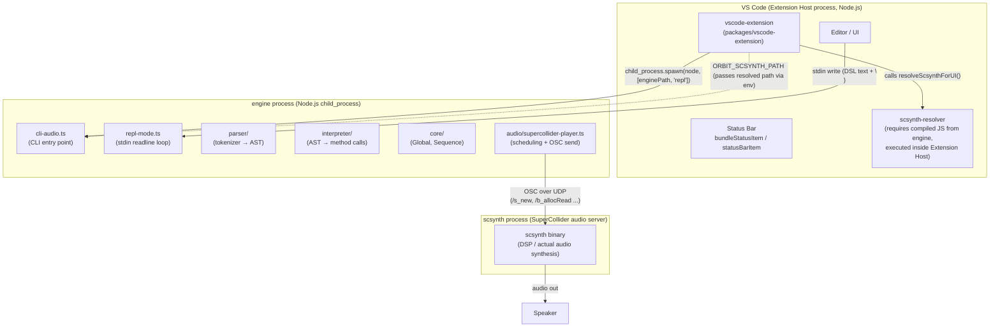
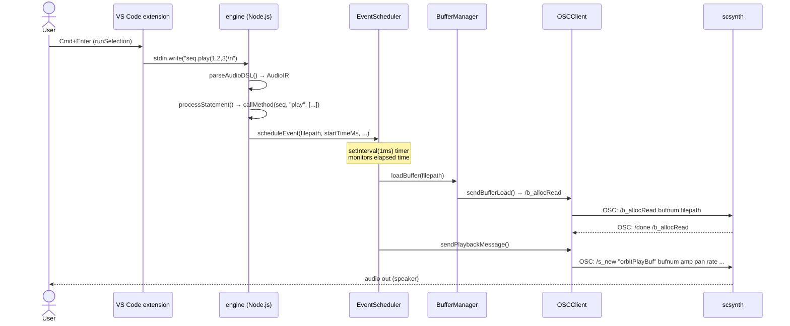

> **Note**: This page is a trace of the author's reading as of 2026-05-05. The code is the truth; this page is merely a snapshot of understanding at that point in time.

# 0-2. Architecture Overview

Write `seq.play(1, 2, 3)` in a `.orbs` file, press `Cmd+Enter`, and a moment later you hear sound. What exactly happens in between? That is the question this chapter sets out to answer.

The answer does not live inside a single process — it spans **three separate processes**: the **VS Code extension** (UI layer), the **engine** (Node.js DSL runtime), and **scsynth** (SuperCollider audio server). Each runs as an independent process with a well-defined boundary of responsibility.

## The Three-Layer Overview

Let's start with the big picture. The following diagram shows the three processes and the communication channels between them.



> **How to read this diagram**: `RESOLVER` is compiled JS from the engine, but since it is `require`d by the Extension Host process, it is placed inside the Extension Host subgraph. It runs independently from the engine process — this is not an "intrusion" into the engine process, but a code-level dependency on the engine's build artifact (compiled JS).

### Responsibilities of Each Layer

Here is a summary of what each of the three layers is responsible for.

| Layer | Process | Language | Responsibility |
|---|---|---|---|
| **VS Code extension** | Extension Host (Node.js, forked from Renderer) | TypeScript | Accepting user input, spawning / killing the engine, resolving the scsynth path, displaying status |
| **engine** | Node.js | TypeScript | Parsing the DSL, interpreting the AST, scheduling events, generating OSC messages |
| **scsynth** | C++ native | C++ | DSP processing, buffer loading, actual audio output |

The separation of responsibilities is clean. **Input** is received by the extension, **meaning** is interpreted by the engine, and **sound** is produced by scsynth — a clear division of labor.

## Details of Each Layer

Let's move a little closer to each layer in turn.

### VS Code Extension Layer

`packages/vscode-extension/src/extension.ts` is the activation entry point. When VS Code calls the `activate()` function, it does three main things.

1. **Registering the status bar**: Sets up two icons — `statusBarItem` (engine state) and `bundleStatusItem` (scsynth resolution state) — and keeps them visible at all times
2. **Registering commands**: Registers commands such as `orbitscore.toggleEngine`, `orbitscore.runSelection`, and `orbitscore.stopEngine` with VS Code
3. **Registering language features**: Binds a CompletionProvider and a HoverProvider to the `orbitscore` language ID (enabling completions and hover information)

Engine startup is handled by the `startEngine()` function. A point worth noting here is that **scsynth path resolution must always happen before spawning the engine**.

```typescript
// extension.ts:692-696
const scResolution = resolveScsynthForUI()
if (!scResolution) {
  void maybeShowBundleNotice()
  return
}
```

If scsynth cannot be found, the engine is not started at all. The reason is simple: it is better to stop before spawning than to let the engine start and then fail on boot — one error notification instead of two.

The engine process itself is launched with `child_process.spawn`, starting Node.js.

```typescript
// extension.ts:739-743
engineProcess = child_process.spawn('node', [enginePath, ...args], {
  cwd: workspaceRoot,
  stdio: ['pipe', 'pipe', 'pipe'],
  env,
})
```

What does `stdio: ['pipe', 'pipe', 'pipe']` mean? It means all three of stdin, stdout, and stderr are piped and accessible from the parent process (the extension). This is what makes it possible to **write DSL text to stdin** and pass it to the engine.

```typescript
// extension.ts:1107
engineProcess.stdin?.write(codeToSend + '\n')
```

This is the very first step of the "press `Cmd+Enter` and hear sound" flow — **delivering DSL text to the engine**.

### Engine Layer

The engine's entry point is `packages/engine/src/cli-audio.ts`. When launched with the `repl` command, `startREPLMode()` is called, and three steps run in sequence: creating an interpreter, booting it, and starting the REPL.

```typescript
// cli/repl-mode.ts:27-38
export async function startREPLMode(options: REPLOptions = {}): Promise<void> {
  console.log('🎵 OrbitScore Audio Engine')
  console.log('✅ Initialized')

  // Create a global interpreter
  const globalInterpreter = new InterpreterV2()

  // Boot SuperCollider once at startup with optional audio device
  await globalInterpreter.boot(options.audioDevice)

  console.log('🎵 Live coding mode')
  await startREPL(globalInterpreter)
}
```

Inside `boot()`, `SuperColliderPlayer.boot()` is called and the scsynth process is started (more on this in the audio layer section below).

The REPL loop monitors stdin with readline and interprets each received line as DSL text. The actual processing is two-stage.

1. **parse**: `parseAudioDSL(text)` converts text into an `AudioIR` (an intermediate representation equivalent to an AST)
2. **execute**: `interpreter.execute(ir)` walks the IR and calls the appropriate methods

The `AudioIR` type is defined in `packages/engine/src/parser/types.ts` and has three fields.

```typescript
// parser/types.ts:36-40
export type AudioIR = {
  globalInit?: GlobalInit
  sequenceInits: SequenceInit[]
  statements: Statement[]
}
```

Each element of the `statements` array is one of `GlobalStatement`, `SequenceStatement`, or `TransportStatement`. `processStatement()` dispatches based on type and calls the corresponding method on the target object (Global / Sequence) via `callMethod()`.

```typescript
// interpreter/evaluate-method.ts:23-38
export async function callMethod(obj: any, methodName: string, args: any[]): Promise<any> {
  const method = obj[methodName]
  if (!method || typeof method !== 'function') {
    console.error(`Method not found: ${methodName} on ${obj.constructor.name}`)
    return obj
  }

  // Process arguments
  const processedArgs = await processArguments(methodName, args)

  // Call the method
  const result = await method.apply(obj, processedArgs)

  // Return the result (usually 'this' for chaining)
  return result || obj
}
```

For example, when `seq.play()` is called, `EventScheduler.scheduleEvent()` is ultimately invoked, and a playback event is placed in the internal queue with a timestamp.

### Audio / scsynth Layer

`SuperColliderPlayer` is the boundary of the audio layer within the engine. It is composed of four classes, each with a distinct responsibility.

```
SuperColliderPlayer
├── OSCClient       ← communicates with scsynth via supercolliderjs
├── BufferManager   ← manages audio file buffers (bufnum ↔ filepath mapping)
├── EventScheduler  ← timeline management and OSC send timing control
└── SynthDefLoader  ← loads SynthDefs (orbitPlayBuf, etc.)
```

Communication with scsynth uses **OSC (Open Sound Control) over UDP**. The concrete messages are sent by `EventScheduler.sendPlaybackMessage()`.

```typescript
// audio/supercollider/event-scheduler.ts:317-335
await this.oscClient.sendMessage([
  '/s_new',
  'orbitPlayBuf',
  -1,
  0,
  0,
  'bufnum',
  bufnum,
  'amp',
  amplitude,
  'pan',
  pan,
  'rate',
  rate,
  'startPos',
  startPos,
  'duration',
  duration,
])
```

`/s_new` is a standard OSC command defined in the SuperCollider Server Command Reference. It instantiates the SynthDef `orbitPlayBuf` and triggers immediate playback.

`EventScheduler.start()` fires a 1ms-interval timer (setInterval) that compares elapsed time against the event queue to control playback timing.

```typescript
// audio/supercollider/event-scheduler.ts:155-177
this.intervalId = setInterval(() => {
  const now = Date.now() - this.startTime

  while (this.scheduledPlays.length > 0 && this.scheduledPlays[0].time <= now) {
    const play = this.scheduledPlays.shift()!

    // Skip if this sequence's events have been cleared
    // (sequenceEvents.has() returns false if clearSequenceEvents() was called)
    if (play.sequenceName && !this.sequenceEvents.has(play.sequenceName)) {
      console.log(
        `🔧 [skip cleared] ${play.sequenceName}: skipping event at ${play.time}ms (cleared)`,
      )
      continue
    }

    // Execute playback asynchronously but handle errors
    this.executePlayback(play.filepath, play.options, play.sequenceName, play.time).catch(
      (error) => {
        console.error(`❌ Playback error for ${play.sequenceName}:`, error)
      },
    )
  }
}, 1)
```

## scsynth Is a Separate Process

One interesting implementation detail is that **scsynth is bundled inside the extension**.

```
packages/vscode-extension/
└── engine/           ← engine/dist/ is copied here at build time
    ├── dist/         ← compiled JS from the engine
    └── scsynth/      ← bundled scsynth binary
        └── Contents/Resources/scsynth
```

`scsynth-resolver.ts` tries this bundle path as its last candidate. This is what is called strict mode.

```typescript
// audio/supercollider/scsynth-resolver.ts:91-98
return (
  tryCandidate(opts.explicit, 'explicit') ??
  tryCandidate(process.env[ENV_VAR], 'env') ??
  tryCandidate(bundleCandidatePath(), 'bundle') ??
  (() => { throw new ScsynthNotFoundError(searched) })()
)
```

The priority order is `explicit > env (ORBIT_SCSYNTH_PATH) > bundle`. What is intentional here is that there is **no implicit fallback to SC.app or Spotlight** (a policy finalized in Issue #136 and PR #155). Having an SC.app fallback would risk masking production failures — if bundle extraction fails, SC.app would silently compensate, hiding the real problem.

When `OSCClient.boot()` starts scsynth via the `supercolliderjs` library, scsynth runs as a **child process from the engine's perspective**. However, communication uses OSC over UDP rather than stdin/stdout (scsynth listens on UDP by default; TCP is only available when the `-t <port>` startup option is specified).

```typescript
// audio/supercollider/osc-client.ts:46-48
// @ts-expect-error - supercolliderjs types are incomplete
this.server = await sc.server.boot(bootOptions)
```

`supercolliderjs` handles the scsynth lifecycle (spawn / kill / alive detection via `/status`), while the engine sends and receives OSC messages on top of that.

## The "play() → sound" Data Flow

With the above context in mind, let's look at the full flow when `seq.play(1, 2, 3)` is evaluated with `Cmd+Enter`, using a sequence diagram.



Two points stand out in this diagram.

1. **The extension does not interpret the DSL**: it simply pipes the text to stdin, and the engine handles all interpretation
2. **The engine does not produce sound**: it generates OSC messages, and the audio DSP is handled entirely by scsynth

This separation of responsibilities means that swapping out the engine in the future leaves scsynth unchanged, and replacing scsynth with a different binary leaves the engine's parser and interpreter untouched — a structurally robust design.

## Navigation to Following Chapters

This chapter was a shallow first pass to establish the big picture. The details of each layer will be covered in the corresponding chapters going forward.

| Area of interest | Reference |
|---|---|
| How DSL text is converted into a token sequence and an AST is constructed | [I-1. From Text to AST](/pipeline/text-to-ast) |
| How `seq.play()` calculates timing and enqueues events | [II-3. Event Queue and Look-Ahead](/scheduling/event-queue) |
| The SuperCollider server command system from `/s_new` to audio output | [III-1. Communication with SuperCollider](/audio/supercollider) |
| Extension activation, IntelliSense, and flash visual feedback | [IV-1. VS Code Extension Architecture](/editor/vscode-architecture) |

## Related Terms

Terms covered in this chapter are available in the [Glossary](/glossary). Key terms:

- [scsynth](/glossary#scsynth) — SuperCollider's audio server binary
- [OSC (Open Sound Control)](/glossary#osc-open-sound-control) — communication protocol between engine and scsynth
- [SynthDef (SC)](/glossary#synthdef-sc) — audio processing definitions such as orbitPlayBuf
- [Extension Host](/glossary#extension-host) — the Node.js process in which VS Code extensions run
- [orbitPlayBuf](/glossary#orbitplaybuf) — the name of OrbitScore's dedicated SynthDef
- [strict mode (scsynth resolver)](/glossary#strict-mode-scsynth-resolver) — fail-loud design with no SC.app fallback
- [StatusBarItem](/glossary#statusbaritem) — status bar items displaying engine state and scsynth resolution state

## Related ADRs

- [ADR-001 Choosing SuperCollider as the Implementation Base](/decisions/adr-001-supercollider) — why scsynth was chosen as the audio backend
- [ADR-003 scsynth bundle strict mode](/decisions/adr-003-scsynth-bundle) — the decision-making process and bundle configuration for strict mode

## Next Exploration Candidates

Further areas to explore in more depth, each suitable as a separate issue and chapter.

- **scsynth bundle strategy**: why there is no SC.app fallback. Tracing the reasoning behind strict mode (Issue #136) through the original discussion
- **supercolliderjs internals**: how `sc.server.boot()` spawns scsynth. Tracking the supercolliderjs source
- **Type boundary between engine and extension**: the structure where `resolveScsynthForUI()` `require()`s the engine's compiled JS. How the build artifact dependency is managed, and how the type boundary (engine-side exports vs. extension-side imports) is kept aligned
- **Precision of setInterval(1ms)**: Node.js does not guarantee 1ms intervals. The actual drift characteristics and their impact on timing accuracy
- **OSC message buffering**: does `sendMessage` send a UDP packet on every call, or does `supercolliderjs` buffer internally?
- **The SynthDef `orbitPlayBuf` itself**: where is the SynthDef definition that the engine calls via `/s_new`, and how is it loaded into scsynth?

## Sources

- `packages/vscode-extension/src/extension.ts:19-97` — overall structure of `activate()`, registration of both status bar items
- `packages/vscode-extension/src/extension.ts:113-129` — `resolveScsynthForUI()`: the boundary where the engine's compiled JS is required at runtime
- `packages/vscode-extension/src/extension.ts:681-759` — `startEngine()`: pre-check → spawn → stdin/stdout pipe setup
- `packages/vscode-extension/src/extension.ts:735-736` — passing the resolved path to the engine via the `ORBIT_SCSYNTH_PATH` env variable
- `packages/vscode-extension/src/extension.ts:1085-1108` — `runSelection()`: DSL delivery via `stdin.write(codeToSend + '\n')`
- `packages/vscode-extension/package.json:36-38` — `activationEvents: ["onStartupFinished", "onLanguage:orbitscore"]`
- `packages/engine/src/cli-audio.ts:1-39` — CLI entry point, `InterpreterV2` instantiation and `executeCommand()` call
- `packages/engine/src/cli/repl-mode.ts:27-38` — `startREPLMode()`: three steps of interpreter creation → boot → REPL start
- `packages/engine/src/cli/repl-mode.ts:50-108` — `startREPL()`: readline stdin monitoring and buffer accumulation logic
- `packages/engine/src/cli/execute-command.ts:50-60` — `executeCommand()`: command routing for play / repl / eval / test
- `packages/engine/src/interpreter/interpreter-v2.ts:22-47` — `InterpreterV2` constructor: `SuperColliderPlayer` instantiation and state initialization
- `packages/engine/src/interpreter/interpreter-v2.ts:62-90` — `execute()`: sequential processing of globalInit → sequenceInits → statements
- `packages/engine/src/interpreter/process-statement.ts:32-56` — `processStatement()`: dispatch by Statement type
- `packages/engine/src/interpreter/evaluate-method.ts:23-38` — `callMethod()`: invokes a method on obj via apply
- `packages/engine/src/parser/types.ts:36-60` — type definitions for `AudioIR`, `GlobalInit`, `SequenceInit`, and `Statement`
- `packages/engine/src/audio/supercollider-player.ts:16-50` — `SuperColliderPlayer` constructor and `boot()`: assembly of 4 dependency classes and scsynth resolution
- `packages/engine/src/audio/supercollider/event-scheduler.ts:143-177` — `start()`: event dispatch via setInterval 1ms timer
- `packages/engine/src/audio/supercollider/event-scheduler.ts:240-273` — `executePlayback()`: drift check → bufferManager.loadBuffer → sendPlaybackMessage
- `packages/engine/src/audio/supercollider/event-scheduler.ts:307-335` — `sendPlaybackMessage()`: the actual `/s_new orbitPlayBuf` OSC message
- `packages/engine/src/audio/supercollider/osc-client.ts:21-49` — `OSCClient.boot()`: starting scsynth via `sc.server.boot(bootOptions)`
- `packages/engine/src/audio/supercollider/osc-client.ts:55-60` — `sendMessage()`: OSC send via `this.server.send.msg(message)`
- `packages/engine/src/audio/supercollider/scsynth-resolver.ts:22-99` — `ScsynthResolution` type, `ScsynthNotFoundError`, and strict mode implementation of `resolveScsynthPath()`
- `packages/engine/src/audio/supercollider/scsynth-resolver.ts:57-59` — `bundleCandidatePath()`: calculating the bundle path relative to `__dirname`
- `packages/engine/package.json:1-31` — `@orbitscore/engine` dependencies: `supercolliderjs`, `ws`, `wavefile`, `uuid`
- PR [#155](https://github.com/signalcompose/orbitscore/pull/155) — background on adopting scsynth strict mode (removal of SC.app / Spotlight fallback)
- Issue [#136](https://github.com/signalcompose/orbitscore/issues/136) — "works without SC.app" requirement and strict mode policy decision
- [SuperCollider Server Command Reference](https://doc.sccode.org/Reference/Server-Command-Reference.html) — specification for `/s_new`, `/b_allocRead`, and `/done`
