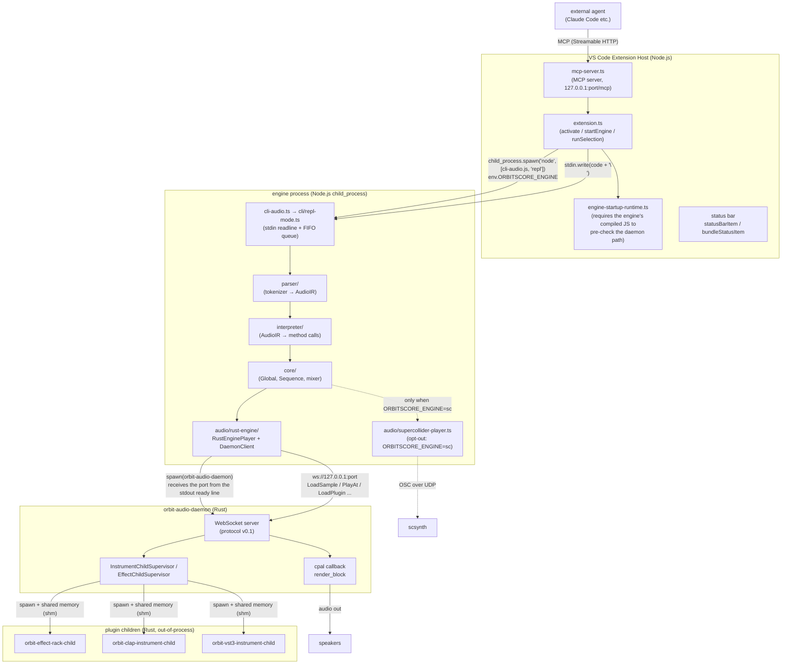
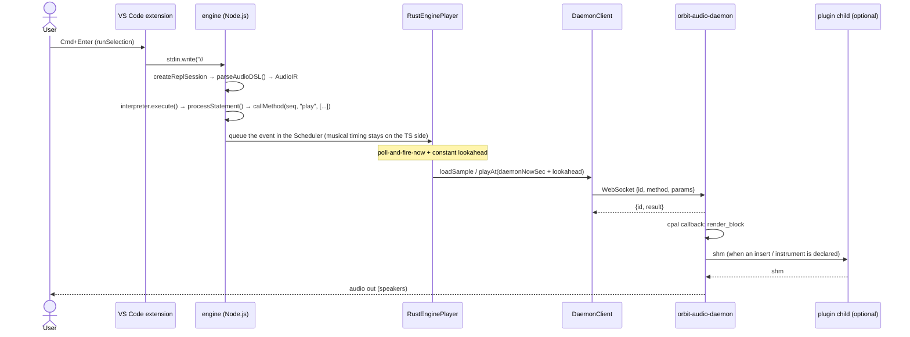

> **Note**: This page is a trace of the author's reading as of 2026-09-01. The code is the truth; this page is only a snapshot of understanding at that time.

# 0-2. Architecture Overview

You write `seq.play(1, 2, 3)` in an `.orbs` file, press `Cmd+Enter`, and a moment later you hear sound. What happens in between? That is the question of this chapter.

The answer does not fit inside a single process. It spans at least four kinds of processes: the **VS Code Extension Host**, the **engine** (the Node.js DSL runtime), **orbit-audio-daemon** (the Rust audio daemon), and the **plugin children** (out-of-process plugin hosts) that the daemon in turn spawns. SuperCollider (scsynth) is outside this picture; it is an opt-out path that only appears when you select it explicitly with `ORBITSCORE_ENGINE=sc`.

## Drift since the 2026-05 edition

The 2026-05-05 edition of this chapter was written around a "three processes: extension / engine / scsynth" picture. With cutover #108 on 2026-07-03 (WORK_LOG 6.179) the default audio backend switched to the Rust daemon, and that picture no longer holds for the default path. What follows is a full rewrite against the code as of 2026-09-01. The SC path itself still exists under `packages/engine/src/audio/supercollider/`, so read the SuperCollider chapters in Part III as a "historical reading of the opt-out path."

Incidentally, code comments refer to the same cutover by two numbers, `#108` and `#369` (`engine-backend.ts` says `#108`; `extension.ts` and `copy-daemon-bin.sh` say `#369`).

> NOTE: unverified — needs confirmation: the mapping "#108 is the Issue, #369 is the PR" is inferred from the WORK_LOG 6.179 heading (`cutover #108`); the #369 side has not been confirmed against a primary source.

## The Four Layers at a Glance

Let's start with the big picture. The following diagram shows the process boundaries and the communication channels that cross them.


```mermaid
graph TD
  subgraph "VS Code Extension Host (Node.js)"
    EXT["extension.ts\n(activate / startEngine / runSelection)"]
    MCP["mcp-server.ts\n(MCP server, 127.0.0.1:port/mcp)"]
    RESOLVER["engine-startup-runtime.ts\n(requires the engine's compiled JS to\npre-check the daemon path)"]
    STATUS["status bar\nstatusBarItem / bundleStatusItem"]
  end

  subgraph "engine process (Node.js child_process)"
    CLI["cli-audio.ts → cli/repl-mode.ts\n(stdin readline + FIFO queue)"]
    PARSER["parser/\n(tokenizer → AudioIR)"]
    INTERP["interpreter/\n(AudioIR → method calls)"]
    CORE["core/\n(Global, Sequence, mixer)"]
    PLAYER["audio/rust-engine/\nRustEnginePlayer + DaemonClient"]
    SC["audio/supercollider-player.ts\n(opt-out: ORBITSCORE_ENGINE=sc)"]
  end

  subgraph "orbit-audio-daemon (Rust)"
    WS["WebSocket server\n(protocol v0.1)"]
    RENDER["cpal callback\nrender_block"]
    SUP["InstrumentChildSupervisor /\nEffectChildSupervisor"]
  end

  subgraph "plugin children (Rust, out-of-process)"
    CHILD1["orbit-effect-rack-child"]
    CHILD2["orbit-clap-instrument-child"]
    CHILD3["orbit-vst3-instrument-child"]
  end

  AGENT["external agent\n(Claude Code etc.)"] -->|"MCP (Streamable HTTP)"| MCP
  MCP --> EXT
  EXT -->|"child_process.spawn('node', [cli-audio.js, 'repl'])\nenv.ORBITSCORE_ENGINE"| CLI
  EXT -->|"stdin.write(code + '\\n')"| CLI
  EXT --> RESOLVER
  CLI --> PARSER --> INTERP --> CORE --> PLAYER
  CORE -.->|"only when ORBITSCORE_ENGINE=sc"| SC
  PLAYER -->|"spawn(orbit-audio-daemon)\nreceives the port from the stdout ready line"| WS
  PLAYER -->|"ws://127.0.0.1:port\nLoadSample / PlayAt / LoadPlugin ..."| WS
  WS --> RENDER
  WS --> SUP
  SUP -->|"spawn + shared memory (shm)"| CHILD1
  SUP -->|"spawn + shared memory (shm)"| CHILD2
  SUP -->|"spawn + shared memory (shm)"| CHILD3
  RENDER -->|"audio out"| DAC["speakers"]
  SC -.->|"OSC over UDP"| SCSYNTH["scsynth"]
```

> **How to read the diagram**: `RESOLVER` is the engine's build artifact (compiled JS) that the Extension Host side `require()`s and runs, so it is placed in the Extension Host subgraph rather than the engine process. It does not "intrude" into the engine process; it is a code-level dependency in which the same resolver function runs on both sides so that the results agree.

### Responsibilities of Each Layer

| Layer | Process | Language | Responsibility |
|---|---|---|---|
| **VS Code extension** | Extension Host (Node.js) | TypeScript | Accepts user input, spawns / kills the engine, pre-checks the daemon binary, shows status, hosts the MCP server |
| **engine** | Node.js (`cli-audio.js repl`) | TypeScript | Parses the DSL, interprets the AudioIR, computes musical timing (scheduler), sends commands to the daemon |
| **orbit-audio-daemon** | native (Rust) | Rust | Receives commands over WebSocket, renders audio in the cpal realtime callback, supervises plugin children |
| **plugin child** | native (Rust, child of the daemon) | Rust | Hosts the actual CLAP / VST3 plugin in an isolated process; exchanges audio with the daemon over shared memory |
| (opt-out) **scsynth** | native (C++) | C++ | Takes over DSP from the daemon only when `ORBITSCORE_ENGINE=sc` |

**Input** is received by the extension, **meaning** is interpreted by the engine, **sound** is produced by the daemon, and **untrusted code (3rd-party plugins)** is isolated in children — that is the division of labor.

## The VS Code Extension Layer

`activate()` in `packages/vscode-extension/src/extension.ts` is the entry point (as of 2026-09-01 it is a large file of over 4,000 lines, so this chapter only picks up the parts that concern the boundaries). `activate()` does the following.

1. **Sets up the output channel and the log ring**: it replaces `outputChannel.appendLine` so that output also flows into a ring buffer the MCP `get_log` tool can read
2. **Registers the status bar items**: two of them, `statusBarItem` (engine state) and `bundleStatusItem` (backend binary resolution state)
3. **Registers commands**: `orbitscore.toggleEngine`, `orbitscore.runSelection`, `orbitscore.stopEngine`, `orbitscore.registerMcpServer`, and so on
4. **Registers language features**: completion, hover, diagnostics (DiagnosticCollection)
5. **Starts the MCP server (optional)**: only when the `ORBITSCORE_MCP_PORT` env var or the `orbitscore.mcpServer.port` setting is nonzero

### Starting the engine: pre-check → env → spawn

`startEngine()` is responsible for starting the engine. The first thing it does is decide "which backend to use," normalizing the `orbitscore.engine` setting with the engine-side `resolveEngineKind` (loaded from compiled JS via a runtime require).

```typescript
// packages/vscode-extension/src/extension.ts:2060-2063
  // engine kind (#377): scsynth is only relevant under the 'sc' kind. Under
  // 'rust' (default since cutover #369), skip the scsynth pre-check entirely —
  // the native daemon doesn't need scsynth to be resolvable.
  const engineKind = getConfiguredEngineKind()
```

A point to note here is that **backend binary resolution always precedes spawning the engine**. Under the default `rust` kind it pre-checks the daemon binary.

```typescript
// packages/vscode-extension/src/extension.ts:2085-2094
    const daemonResolution = resolveDaemonForUI()
    if (!daemonResolution) {
      outputChannel?.appendLine(
        '❌ orbit-audio-daemon not found — engine cannot start with the rust backend.',
      )
      vscode.window.showErrorMessage(
        '⚠️ orbit-audio-daemon not found. Reinstall the extension, build it via `cd rust && cargo build --release`, or set ORBIT_AUDIO_DAEMON_PATH to a custom binary.',
      )
      return false
    }
```

If the daemon cannot be found, the engine is not started at all. The reason is in the comment: if the engine were started first and the daemon spawn failed inside it, an "Engine started" success toast would appear before the failure log caught up — a false-success UX.

The substance of `resolveDaemonForUI()` lives in `engine-startup-runtime.ts`, which borrows `resolveDaemonBinaryPath` from the engine's compiled JS.

```typescript
// packages/vscode-extension/src/engine-startup-runtime.ts:14-20
export function resolveDaemonBinaryForExtension(): EngineBinaryResolution {
  // eslint-disable-next-line @typescript-eslint/no-require-imports, @typescript-eslint/no-var-requires
  const daemonModule = require('../engine/dist/audio/rust-engine/daemon-client') as {
    resolveDaemonBinaryPath: (explicitPath?: string) => EngineBinaryResolution
  }
  return daemonModule.resolveDaemonBinaryPath()
}
```

What is interesting is that the resolved path is not handed to the engine via env. The spawned engine CLI runs the same `resolveDaemonBinaryPath()` itself, so the result is deterministically identical and there is no reason to re-inject it, as the comment states explicitly (extension.ts:2075-2077).

The backend kind is **always set explicitly** on the engine through the `ORBITSCORE_ENGINE` env var.

```typescript
// packages/vscode-extension/src/extension.ts:2149-2162
  if (engineKind === 'rust') {
    env.ORBITSCORE_ENGINE = 'rust'
    outputChannel?.appendLine('🦀 Audio backend: rust (orbit-audio-daemon, native, default)')
  } else {
    env.ORBITSCORE_ENGINE = 'sc'

    // Pass scsynth path to engine via env. pre-check で解決済 (scResolution.path) を
    // そのまま engine に渡すことで resolver の二重 fs.statSync を avoid + pre-check と
    // engine 内部での resolution 結果ズレ (タイミング差) のリスクを排除。
    // scResolution is guaranteed non-null here: the 'sc' branch above returns
    // early when resolution fails.
    env.ORBIT_SCSYNTH_PATH = scResolution!.path
    outputChannel?.appendLine(`🔧 scsynth (${scResolution!.source}): ${scResolution!.path}`)
  }
```

The engine process itself is then started with `child_process.spawn` running Node.js.

```typescript
// packages/vscode-extension/src/extension.ts:2164-2170
  // Spawn engine process
  try {
    engineProcess = child_process.spawn('node', [enginePath, ...args], {
      cwd: workspaceRoot,
      stdio: ['pipe', 'pipe', 'pipe'],
      env,
    })
```

`stdio: ['pipe', 'pipe', 'pipe']` means all three of stdin / stdout / stderr become pipes the parent (the extension) can touch. DSL text reaches the engine by being **written to stdin**.

```typescript
// packages/vscode-extension/src/extension.ts:3056-3057
  engineProcess.stdin.write(codeToSend + '\n')
  return true
```

This is the first step of the "press `Cmd+Enter` and sound comes out" flow: **delivering DSL text to the engine**. The mechanism that injects the `//#documentDirectory` meta line and `global.setDocumentDirectory(...)` before this write is covered in [I-3. Selective Execution](/en/pipeline/selective-execution).

### The MCP server: the extension as the agent's front door

Since #388 on 2026-07-07 (WORK_LOG 6.188-6.192), the extension hosts an MCP (Model Context Protocol) server inside the Extension Host. An external agent (Claude Code, for example) can drive OrbitScore with tools such as `evaluate_orbitscore` / `start_engine` / `get_log`, going through the same path as an editor user.

```typescript
// packages/vscode-extension/src/mcp-server.ts:9-18
/**
 * OrbitScore MCP control server — the "Agent Bridge" of WCTM_SYSTEM_SPEC §3.
 *
 * Hosts an MCP server (Streamable HTTP) inside the extension host so an external
 * agent (e.g. Claude Code via `.mcp.json`) can drive OrbitScore operations for
 * E2E testing. The same tool surface is intended for reuse by the WCTM
 * performance runtime (pi harness — spec §4.2 "Bridge は harness-neutral").
 *
 * Only started when `orbitscore.mcpServer.port` is a nonzero port (see
 * extension.ts activate()). Binds 127.0.0.1 only.
```

The start condition lives in `activate()`. The env var takes precedence over the setting so that an Extension Development Host launched from the CLI can have its port set without touching a settings file.

```typescript
// packages/vscode-extension/src/extension.ts:454-459
  const envMcpPort = Number(process.env.ORBITSCORE_MCP_PORT)
  const mcpPort =
    Number.isInteger(envMcpPort) && envMcpPort > 0
      ? envMcpPort
      : vscode.workspace.getConfiguration('orbitscore').get<number>('mcpServer.port', 0)
  if (mcpPort && mcpPort > 0) {
```

The server binds only to loopback.

```typescript
// packages/vscode-extension/src/mcp-server.ts:1365-1369
  await new Promise<void>((resolve, reject) => {
    httpServer.once('error', reject)
    httpServer.listen(port, '127.0.0.1', () => resolve())
  })
  log(`OrbitScore MCP server listening on http://127.0.0.1:${port}/mcp`)
```

The MCP tool `evaluate_orbitscore` writes to the engine's stdin through the very same `writeCodeToEngine()` that the editor's `runSelection()` uses (extension.ts:3040-3047). In other words, **there is no back door for agents**; they go through the same wiring as the user. This is also the premise CLAUDE.md stresses for E2E tests.

## The Engine Layer

The engine's entry point is `packages/engine/src/cli-audio.ts`; when it receives the `repl` subcommand, `startREPLMode()` is called.

```typescript
// packages/engine/src/cli/repl-mode.ts:30-53
export async function startREPLMode(options: REPLOptions = {}): Promise<void> {
  console.log('🎵 OrbitScore Audio Engine')
  console.log('✅ Initialized')

  // Create a global interpreter
  const globalInterpreter = new InterpreterV2()
  // 🔴 #607: startREPLMode() は返らないので、戻り値経由では shutdown ハンドラに
  // 届かない。生成した時点で publish する（詳細は active-interpreter.ts）。
  setActiveInterpreter(globalInterpreter)

  // §L1 (#229): session-log は 2.0.0 では dormant（既定 off）。file-scoped ログが
  // 複数ファイルをまたぐライブセッションに合わない設計ミスマッチのため、session-scoped で
  // 再設計するまで明示 opt-in に退避（writer/API/ユニットは保持・resurrect 可）。
  // 詳細・redesign 北極星: docs/development/POST_2.0_ROADMAP_NOTES.md
  if (shouldEnableSessionLog()) {
    globalInterpreter.enableSessionLog({ cwd: process.cwd() })
  }

  // Boot the audio engine backend once at startup with optional audio device
  await globalInterpreter.boot(options.audioDevice)

  console.log('🎵 Live coding mode')
  await startREPL(globalInterpreter)
}
```

Create one `InterpreterV2`, `boot()` it, enter the REPL. These three steps are unchanged from the 2026-05 edition. What changed is what lies beyond `boot()`. The `InterpreterV2` constructor lets `createAudioEngine()` choose the audio backend.

```typescript
// packages/engine/src/interpreter/interpreter-v2.ts:48-64
  constructor(opts?: { audioEngine?: AudioEngineBackend }) {
    this.state = {
      audioEngine: opts?.audioEngine ?? createAudioEngine(),
      globals: new Map(),
      sequences: new Map(),
      mixers: createMixerRuntimeRegistry(),
      currentGlobal: undefined,
      isBooted: false,
      // Initialize unidirectional toggle groups
      runGroup: new Set(),
      loopGroup: new Set(),
      muteGroup: new Set(),
      // §L1: the rolling-buffer origin (§3 wall). The writer itself stays absent
      // until enableSessionLog() — so logging is inert in unit-test paths.
      engineT0: Date.now(),
    }
  }
```

### Backend selection: `createAudioEngine()`

`createAudioEngine()` looks at the env and returns either a `RustEnginePlayer` or a `SuperColliderPlayer`. The default is Rust.

```typescript
// packages/engine/src/audio/create-audio-engine.ts:17-36
export function createAudioEngine(env: NodeJS.ProcessEnv = process.env): AudioEngineBackend {
  const raw = env[ENGINE_ENV_VAR]
  if (resolveEngineKind(raw) === 'supercollider') {
    console.log(`🎛️ [engine] using SuperCollider backend (opt-out via ORBITSCORE_ENGINE=${raw})`)
    return new SuperColliderPlayer()
  }
  // 既定は Rust。ただし raw が「未設定/空」でも 'rust' でもない未認識値のときは、
  // SC のつもりの typo（例: ORBITSCORE_ENGINE=scc）が黙って Rust 起動に落ちるのを
  // warn で observable にする（未設定と誤入力を区別する）。
  const normalized = raw?.trim().toLowerCase() ?? ''
  if (normalized !== '' && normalized !== 'rust') {
    console.warn(
      `⚠️  [engine] ORBITSCORE_ENGINE=${JSON.stringify(raw)} は未認識 — ` +
        `'rust' / 'sc' / 'supercollider' を想定。既定の Rust にフォールバック`,
    )
  }
  const source = normalized === '' ? 'default since cutover #108' : `ORBITSCORE_ENGINE=${raw}`
  console.log(`🦀 [engine] using rust orbit-audio-daemon backend (${source})`)
  return new RustEnginePlayer()
}
```

`resolveEngineKind()` returns only two values, and everything other than `sc` / `supercollider` falls to `rust`.

```typescript
// packages/engine/src/audio/engine-backend.ts:67-70
export function resolveEngineKind(raw: string | undefined): EngineKind {
  const v = raw?.trim().toLowerCase()
  return v === 'sc' || v === 'supercollider' ? 'supercollider' : 'rust'
}
```

The contract both backends satisfy is the `AudioEngineBackend` interface: `Scheduler` (musical timing) plus `boot` / `quit` / device operations / plugin operations (engine-backend.ts:26-50). The interpreter and `Global` see only this contract surface, so **the DSL semantics are unaffected by swapping the backend**.

### parse → execute

Text received by the REPL is processed in two stages.

1. **parse**: `parseAudioDSL(text)` converts the text to an `AudioIR`
2. **execute**: `interpreter.execute(ir, options)` walks the IR and calls the required methods

The `AudioIR` type lives in `packages/engine/src/parser/types.ts`, and gained `fileImports` in #456 on 2026-07-17.

```typescript
// packages/engine/src/parser/types.ts:49-59
export type AudioIR = {
  globalInit?: GlobalInit
  sequenceInits: SequenceInit[]
  statements: Statement[]
  /**
   * ファイル import（IM.1-IM.2, #456）。評価順序の規範（imports が entry 自身の宣言より
   * 先・ソース記載順）を守るため statements とは別バケットで保持し、interpreter が
   * globalInit より前に処理する。ファイル先頭領域のみ（AudioParser.parse が検査）。
   */
  fileImports?: FileImportStatement[]
}
```

`processStatement()` dispatches each element of `statements` by its type, and the method on the target object (Global / Sequence / mixer node) is ultimately invoked via `callMethod()`.

```typescript
// packages/engine/src/interpreter/evaluate-method.ts:23-35
export async function callMethod(obj: any, methodName: string, args: any[]): Promise<any> {
  const processedArgs = await processArguments(methodName, args)
  const method = obj[methodName]
  if (!method || typeof method !== 'function') {
    throw new Error(`Method not found: ${methodName} on ${obj?.constructor?.name ?? 'receiver'}`)
  }

  // Call the method
  const result = await method.apply(obj, processedArgs)

  // Return the result (usually 'this' for chaining)
  return result || obj
}
```

When `seq.play()` is called, for example, a playback event is eventually queued with a timestamp in the internal scheduler of `RustEnginePlayer`. The details of parsing and evaluation are covered in [I-1](/en/pipeline/text-to-ast) and [I-2](/en/pipeline/evaluation).

## The orbit-audio-daemon Layer

`RustEnginePlayer` is the boundary on the engine side. Its `boot()` calls `DaemonClient.start()` and then establishes the transport clock anchor.

```typescript
// packages/engine/src/audio/rust-engine/rust-engine-player.ts:578-585
  async boot(outputDevice?: string): Promise<void> {
    await this.daemon.start({
      daemonPath: this.daemonPath,
      wsUrlOverride: this.wsUrlOverride,
      audioDevice: outputDevice,
    })
    await this.establishSession()
  }
```

`DaemonClient.start()` proceeds in the order "spawn → read the ready line from stdout → connect the WebSocket → receive the handshake."

```typescript
// packages/engine/src/audio/rust-engine/daemon-client.ts:294-332 (handshake の timeout 設定を省略)
  private async doStart(options: DaemonClientOptions): Promise<void> {
    // 新しい起動サイクルでは crash 検出を再 arm する（前回 quit の意図的 close を引きずらない）。
    this.intentionalClose = false
    const startupTimeoutMs = options.startupTimeoutMs ?? DEFAULT_STARTUP_TIMEOUT_MS
    const connectTimeoutMs = options.connectTimeoutMs ?? DEFAULT_CONNECT_TIMEOUT_MS
    const handshakeTimeoutMs = options.handshakeTimeoutMs ?? DEFAULT_HANDSHAKE_TIMEOUT_MS

    // spawn/connect/handshake のいずれかが throw した場合、this.child / this.ws が
    // dangling になるのを防ぐため try/catch で包み、失敗時は明示的に cleanup する。
    // quit() は this.running===false なら no-op なので手動回収が必要。
    try {
      const wsUrl =
        options.wsUrlOverride ??
        (await this.spawnDaemon(options.daemonPath, startupTimeoutMs, options.audioDevice))
      // ...
      await this.connectWebSocket(wsUrl, connectTimeoutMs)
      await handshakePromise
      this.running = true
```

Seen from the engine, the daemon is a **child process**. The communication, however, is WebSocket rather than stdin/stdout; stdout is used only to receive the startup ready line (a one-line JSON containing the port number).

```typescript
// packages/engine/src/audio/rust-engine/daemon-client.ts:879-889
  private async spawnDaemon(
    explicitPath: string | undefined,
    timeoutMs: number,
    audioDevice: string | undefined,
  ): Promise<string> {
    const binary = this.resolveDaemonBinary(explicitPath)
    // `--audio-device <name>` は daemon 起動時のみ honor される（#484 D1・ランタイム切替は D2）。
    // 名前が不一致でも daemon は起動を落とさず stderr に警告して host 既定へ縮退する。
    const args = audioDevice ? ['--audio-device', audioDevice] : []
    const child = spawn(binary, args, { stdio: ['ignore', 'pipe', 'pipe'] })
    this.child = child
```

```typescript
// packages/engine/src/audio/rust-engine/daemon-client.ts:953-967
      // 現行 daemon は stdout の先頭行に ready JSON のみを書き、log は stderr に
      // 分離している (docs/research/ENGINE_DAEMON_PROTOCOL.md)。しかし将来の daemon
      // 実装で log banner 等が stdout に混入しても壊れないよう、JSON parse できる
      // 行が出るまで読み続ける防御的実装にする。
      const skippedLines: string[] = []
      reader.on('line', (line) => {
        if (settled) return
        let parsed: StartupReadyLine | StartupErrorLine
        try {
          parsed = JSON.parse(line) as StartupReadyLine | StartupErrorLine
        } catch {
          // JSON として読めない行は log とみなしてスキップし次の行を待つ。
          skippedLines.push(line)
          return
        }
```

The daemon-side code that writes this ready line (`run()` in `main.rs`) and the `{id, method, params}` wire protocol are covered in [RE-1. Daemon Architecture Overview](/en/rust-engine/), so they are not repeated here.

### Resolving the daemon binary

The search order for the daemon binary is in `resolveDaemonBinaryPath()`: explicit → env (`ORBIT_AUDIO_DAEMON_PATH`) → monorepo release → monorepo debug → extension bundle.

```typescript
// packages/engine/src/audio/rust-engine/daemon-client.ts:221-257 (monorepo 候補と bundle の説明コメントを省略)
export function resolveDaemonBinaryPath(explicitPath?: string): DaemonBinaryResolution {
  const searched: string[] = []
  const candidates: DaemonBinaryResolution[] = []
  if (explicitPath) candidates.push({ path: explicitPath, source: 'explicit' })
  const envPath = process.env.ORBIT_AUDIO_DAEMON_PATH
  if (envPath) candidates.push({ path: envPath, source: 'env' })
  // ...
  const platform = `${process.platform}-${process.arch}`
  candidates.push({
    path: path.join(__dirname, '../../../bin', platform, 'orbit-audio-daemon'),
    source: 'extension-bundle',
  })

  for (const c of candidates) {
    searched.push(c.path)
    if (isExecutableFile(c.path)) return c
  }
  throw new DaemonNotFoundError(searched)
}
```

Like the scsynth resolver, it is built to **fail loud**, throwing once the candidates are exhausted. A candidate is not enough merely by existing; it must be a regular file with the executable bit set (so a bundle whose permissions were lost during `.vsix` extraction is rejected at the pre-check stage, daemon-client.ts:102-107).

Placing the daemon at `<extension>/engine/bin/<platform>/`, the location pointed to by the last candidate `extension-bundle`, is the job of `scripts/copy-daemon-bin.sh`, which `npm run build` calls through `build:copy-engine`.

```bash
# scripts/copy-daemon-bin.sh:121-132
copy_binary "orbit-audio-daemon"
# #628: rack effect child。daemon は `outproc_effect.rs` で自分の隣の
# `orbit-effect-rack-child` を探す。**これが無いと effect 宣言そのものが起動に失敗する。**
copy_binary "orbit-effect-rack-child"
copy_binary "orbit-clap-effect-child"
copy_binary "orbit-clap-instrument-child"
copy_binary "orbit-vst3-effect-child"
copy_binary "orbit-vst3-instrument-child"
copy_binary "orbit-plugin-scan"

# 標準プラグイン（SC.10.8）。`Gain` が初号で、以後ここへ足していく。
copy_std_plugin_bundle "Gain.clap"
```

Not only the daemon itself but also the plugin children described below and the standard plugin `Gain.clap` are bundled side by side in the same directory. As of 2026-09-01 the only target is darwin-arm64 (copy-daemon-bin.sh:11-17).

## The Plugin Child Layer

The daemon does not load the actual plugins (CLAP / VST3) into its own process. Effects and instruments are each spawned as separate binaries in **out-of-process (OOP)** children, exchanging audio with the daemon over shared memory. The list of children that can be spawned is stated explicitly, in one place, as a constant in the daemon crate.

```rust
// rust/crates/orbit-audio-daemon/src/lib.rs:84-93
pub const SPAWNABLE_CHILD_BINARIES: &[&str] = &[
    // effect: #628 以降は rack child 1 本がチェーン全体を持つ（format で分岐しない）。
    "orbit-effect-rack-child",
    // effect（退役予定・#628 で到達不能になったが、退役 PR まで配布は続ける）。
    "orbit-clap-effect-child",
    "orbit-vst3-effect-child",
    // instrument: format ごとに child が分かれる（1 instrument = 1 child）。
    "orbit-clap-instrument-child",
    "orbit-vst3-instrument-child",
];
```

Child binaries are looked up **next to** the daemon executable. No knowledge of the install layout is put into the daemon or the TS side; the wiring holds simply by "placing them side by side."

```rust
// rust/crates/orbit-audio-daemon/src/outproc_effect.rs:450-458
/// daemon 実行ファイルと同一ディレクトリの format 対応 child を既定パスとする
/// （spike の sibling-of-exe を踏襲・設計 §4.5）。インストール時は daemon と child が並んで置かれる前提。
fn default_rack_child_exe() -> Result<PathBuf, String> {
    let exe = std::env::current_exe().map_err(|e| format!("current_exe: {e}"))?;
    let dir = exe
        .parent()
        .ok_or_else(|| "current_exe has no parent directory".to_string())?;
    Ok(dir.join("orbit-effect-rack-child"))
}
```

Why isolate? Because 3rd-party plugins are untrusted code, and a crash must not take the daemon (the heart of the audio) down with it. The structure of the shm transport, the READY handshake, watchdog / respawn, and parent-process liveness monitoring (`ParentWatch`) are covered in [RE-2. OOP Children and shm Transport](/en/rust-engine/oop-children); the DSL surface (`seq.effect()` / `seq.instrument()`) in [PH-1. Plugin Hosting Overview](/en/plugin-hosting/) and [RE-3. Per-Sequence Insert Bus](/en/rust-engine/insert-bus).

## SuperCollider is the Opt-Out Path

When `ORBITSCORE_ENGINE=sc` is set, `createAudioEngine()` returns a `SuperColliderPlayer`, and the extension enters its `sc` branch that passes `ORBIT_SCSYNTH_PATH` via env (extension.ts:2142-2155 shown above). The mechanisms of scsynth resolution (strict mode in `scsynth-resolver.ts`), OSC over UDP, and the `orbitPlayBuf` SynthDef remain in the code, and the chapters [III-1](/en/audio/supercollider), [III-2](/en/audio/audio-file-playback), and [III-3](/en/audio/scsynth-bundle) read them. Keep in mind while reading, though, that this is not the default path.

Just as the `AudioEngineBackend` contract has optional methods the SC side does not implement (`selectAudioDevice` and others), the Rust path is ahead in features too (engine-backend.ts:32-33).

## Data Flow from `play()` to Sound

With all of the above in mind, let's look at the flow when `seq.play(1, 2, 3)` is evaluated with `Cmd+Enter` as a sequence diagram.


```mermaid
sequenceDiagram
  actor User
  participant EXT as VS Code extension
  participant ENGINE as engine (Node.js)
  participant PLAYER as RustEnginePlayer
  participant CLIENT as DaemonClient
  participant DAEMON as orbit-audio-daemon
  participant CHILD as plugin child (optional)

  User->>EXT: Cmd+Enter (runSelection)
  EXT->>ENGINE: stdin.write("//#documentDirectory ...\nseq.play(1,2,3)\n")

  ENGINE->>ENGINE: createReplSession → parseAudioDSL() → AudioIR
  ENGINE->>ENGINE: interpreter.execute() → processStatement() → callMethod(seq, "play", [...])

  ENGINE->>PLAYER: queue the event in the Scheduler (musical timing stays on the TS side)
  Note over PLAYER: poll-and-fire-now + constant lookahead

  PLAYER->>CLIENT: loadSample / playAt(daemonNowSec + lookahead)
  CLIENT->>DAEMON: WebSocket {id, method, params}
  DAEMON-->>CLIENT: {id, result}
  DAEMON->>DAEMON: cpal callback: render_block
  DAEMON->>CHILD: shm (when an insert / instrument is declared)
  CHILD-->>DAEMON: shm
  DAEMON-->>User: audio out (speakers)
```

The timing model of `RustEnginePlayer` is condensed in the comment at the top of the file.

```typescript
// packages/engine/src/audio/rust-engine/rust-engine-player.ts:11-21
 *  - **musical timing は TS 側に残す**（Epic #105 原則）。本クラスは EventScheduler の
 *    1ms poll モデルを mirror した *lean* scheduler を持ち、発火時に daemon へ
 *    `loadSample`+`playAt` する。SC の EventScheduler は LinkAudio/bufnum/`/s_new` 結合が
 *    重いので再利用せず、独立実装にして SC 経路への波及を断つ。
 *
 *  - **timing モデル = poll-and-fire-now + 定数 lookahead**。SC は fire-now（poll 検出で
 *    即 `/s_new`）。daemon は自前 transport clock（boot で 0 開始）上の `PlayAt{time_sec}`
 *    で schedule-ahead。poll 発火時に `playAt(daemonNowSec + lookahead)` を送ることで
 *    **相対 timing（quantize/polymeter）を保存**しつつ daemon render cursor を確実に
 *    上回らせ onset clip を避ける（絶対 latency は定数シフト＝音楽的に無影響）。lookahead は
 *    実機計測で確定する（A0 受け入れ基準）。
```

Three points deserve attention in this diagram.

1. **The extension does not interpret the DSL**: it adds a meta line and streams the text to stdin; interpretation belongs to the engine
2. **The engine does not produce sound**: it computes musical timing and sends commands to the daemon; DSP belongs to the daemon
3. **The daemon does not run 3rd-party code itself**: plugins are isolated in children, and only audio crosses the shm boundary

Thanks to this separation of responsibilities, the cutover from SC to Rust amounted to "changing the default of `createAudioEngine()`," and the parser / interpreter were left untouched.

## Version Landmarks

Let's sort out "which version is this about," a common source of confusion when reading the code.

```typescript
// packages/engine/src/version.ts:14-17
export const ENGINE_VERSION = '2.0.0'

/** DSL spec version (PITCH_DSL_SPEC) — a separate axis from the product version. */
export const DSL_VERSION = '1.1'
```

- **engine (product) version**: `2.0.0` — the WCTM milestone including MIDI output + Pitch DSL + session log
- **DSL spec version**: `1.1` — the `PITCH_DSL_SPEC_v1.1` axis (separate from the product version)
- **VS Code extension package version**: `2.1.0` (`packages/vscode-extension/package.json`)
- **daemon protocol**: `v0.1` (`packages/engine/src/audio/rust-engine/index.ts:4`)

Note that the "DSL v3.0" that appears in CLAUDE.md and the glossary names the syntax generation (the `sequence` → `init` pivot, [ADR-002](/en/decisions/adr-002-dsl-v3-pivot)); it is a different axis from `DSL_VERSION = '1.1'` (the pitch DSL spec version).

## Navigating to Later Chapters

This chapter was a shallow first pass "to grasp the whole picture." The details of each layer are handled in the corresponding chapters.

| Area of interest | Where to look |
|---|---|
| How DSL text is turned into tokens and an AudioIR is assembled | [I-1. Text to AST](/en/pipeline/text-to-ast) |
| How an AudioIR becomes method calls on Global / Sequence | [I-2. AST Evaluation Model](/en/pipeline/evaluation) |
| The wiring from `Cmd+Enter` to the REPL's FIFO queue | [I-3. Selective Execution](/en/pipeline/selective-execution) |
| How `seq.play()` is timed and queued | [II-3. Event Queue and Look-Ahead](/en/scheduling/event-queue) |
| The daemon's wire protocol, boot, and cpal callback | [RE-1. Daemon Architecture Overview](/en/rust-engine/) |
| Plugin children and the shm transport | [RE-2. OOP Children and shm Transport](/en/rust-engine/oop-children) |
| The per-sequence insert bus of `seq.effect()` | [RE-3. Per-Sequence Insert Bus](/en/rust-engine/insert-bus) |
| Objective verification via capture WAV | [RE-4. Capture Seam and Objective Verification](/en/rust-engine/capture-verification) |
| The DSL surface of CLAP / VST3 hosting | [PH-1. Plugin Hosting Overview](/en/plugin-hosting/) |
| (opt-out) OSC communication with scsynth | [III-1. Communication with SuperCollider](/en/audio/supercollider) |
| Extension activation, IntelliSense, flash | [IV-1. VS Code Extension Architecture](/en/editor/vscode-architecture) |

## Related Terms

See the [Glossary](/en/glossary) for the terms used in this chapter. The main ones:

- [Extension Host](/en/glossary#extension-host) — the Node.js process in which VS Code extensions run
- [StatusBarItem](/en/glossary#statusbaritem) — the status bar items showing engine state and backend resolution state
- [scsynth](/en/glossary#scsynth) — the SuperCollider audio server (opt-out path)
- [OSC (Open Sound Control)](/en/glossary#osc-open-sound-control) — the protocol the engine and scsynth use on the SC path
- [strict mode (scsynth resolver)](/en/glossary#strict-mode-scsynth-resolver) — the fail-loud resolver design; the daemon resolver follows the same policy

## Related ADRs

- [ADR-001 Choosing a SuperCollider-based Implementation](/en/decisions/adr-001-supercollider) — the decision, at the time, to use SC as the audio backend. A historical reading after cutover #108
- [ADR-003 scsynth Bundle Strict Mode](/en/decisions/adr-003-scsynth-bundle) — the strict-mode decision; the origin of the daemon resolver's fail-loud policy

## Next Exploration Candidates

Topics worth reading one level deeper from here. Each is expected to be filed as its own issue and handled in a separate chapter.

- **The reasoning behind cutover #108**: trace the SC parity proof that WORK_LOG 6.179 / 6.181 cite (offline oracle + gated real-daemon timing) together with the discussion of the time
- **The `AudioEngineBackend` contract surface**: tabulate the optional methods and which ones the SC side does not implement
- **`RustEnginePlayer`'s clock mapping**: the mechanism that corrects the anchor with `StreamStats` (1Hz), and the measured lookahead value
- **`DaemonClient` recovery**: the flow from daemon crash detection → respawn → re-running `establishSession()` (#389)
- **The whole MCP tool surface**: classifying the 26 `registerTool` calls in `mcp-server.ts` (engine ops / editor ops / observability)
- **The type boundary between extension and engine**: how the structure in which `engine-startup-runtime.ts` and `resolveScsynthForUI()` `require()` the engine's compiled JS is managed
- **The daemon's graceful-shutdown gap (#448)**: the absence of a SIGTERM handler and the child-side defense via `ParentWatch`

## Sources

- `packages/vscode-extension/src/extension.ts:286-404` — `activate()`: log ring, the two status bar items, command registration
- `packages/vscode-extension/src/extension.ts:445-470` — MCP server start condition (`ORBITSCORE_MCP_PORT` over the setting) and the handler bundle
- `packages/vscode-extension/src/extension.ts:653-710` — `getConfiguredEngineKind()` / `resolveScsynthForUI()` / `resolveDaemonForUI()`: the boundary that runtime-requires the engine's compiled JS
- `packages/vscode-extension/src/extension.ts:2044-2198` — `startEngine()`: kind decision → pre-check → env → spawn
- `packages/vscode-extension/src/extension.ts:3000-3032` — `writeCodeToEngine()`: meta line + `setDocumentDirectory` injection and `stdin.write`
- `packages/vscode-extension/src/extension.ts:3040-3047` — `evaluateForAgent()`: MCP evaluate shares `writeCodeToEngine`
- `packages/vscode-extension/src/engine-startup-runtime.ts:14-20` — `resolveDaemonBinaryForExtension()`
- `packages/vscode-extension/src/mcp-server.ts:9-28` — design comment of the MCP server (Agent Bridge, 127.0.0.1 bind)
- `packages/vscode-extension/src/mcp-server.ts:1177-1347` — `startOrbitScoreMcpServer()`: Streamable HTTP, DNS-rebinding protection, listen
- `packages/engine/src/cli-audio.ts:1-41` — CLI entry point
- `packages/engine/src/cli/execute-command.ts:105-113` — routing of the `repl` subcommand
- `packages/engine/src/cli/repl-mode.ts:30-53` — `startREPLMode()`: create interpreter → boot → start REPL
- `packages/engine/src/interpreter/interpreter-v2.ts:48-64` — `InterpreterV2` constructor: `createAudioEngine()` and state initialization
- `packages/engine/src/audio/create-audio-engine.ts:17-36` — backend selection (default Rust, opt-out with `sc`)
- `packages/engine/src/audio/engine-backend.ts:26-68` — the `AudioEngineBackend` contract and `resolveEngineKind()`
- `packages/engine/src/parser/types.ts:49-59` — `AudioIR` (including `fileImports`)
- `packages/engine/src/interpreter/evaluate-method.ts:23-35` — `callMethod()`
- `packages/engine/src/audio/rust-engine/rust-engine-player.ts:1-39` — design comment of the Rust backend adapter (timing model, clock mapping, feature gaps)
- `packages/engine/src/audio/rust-engine/rust-engine-player.ts:548-555` — `boot()`
- `packages/engine/src/audio/rust-engine/daemon-client.ts:1-13` — DaemonClient's five steps (spawn → ready line → ws → request/response → events)
- `packages/engine/src/audio/rust-engine/daemon-client.ts:221-257` — `resolveDaemonBinaryPath()`: search order and fail-loud
- `packages/engine/src/audio/rust-engine/daemon-client.ts:294-342` — `doStart()`: spawn / connect / handshake
- `packages/engine/src/audio/rust-engine/daemon-client.ts:869-997` — `spawnDaemon()`: stderr routing and ready-line reading
- `packages/engine/src/audio/rust-engine/index.ts:1-8` — protocol v0.1, note on cutover #108
- `packages/engine/src/version.ts:14-17` — `ENGINE_VERSION` / `DSL_VERSION`
- `rust/crates/orbit-audio-daemon/src/lib.rs:84-93` — `SPAWNABLE_CHILD_BINARIES`
- `rust/crates/orbit-audio-daemon/src/outproc_effect.rs:450-458` — child resolution by sibling-of-exe
- `scripts/copy-daemon-bin.sh:1-47,121-132` — bundling policy for daemon / children / standard plugins
- `package.json:9-11` — `build:copy-engine` calls `copy-daemon-bin.sh`
- `docs/research/ENGINE_DAEMON_PROTOCOL.md` — the SoT of the wire protocol
- `docs/archive/WORK_LOG_2026-07.md` §6.179 (cutover #108, 2026-07-03), §6.185 (daemon bundling #306, 2026-07-03), §6.188-6.192 (MCP server #388, 2026-07-07)
