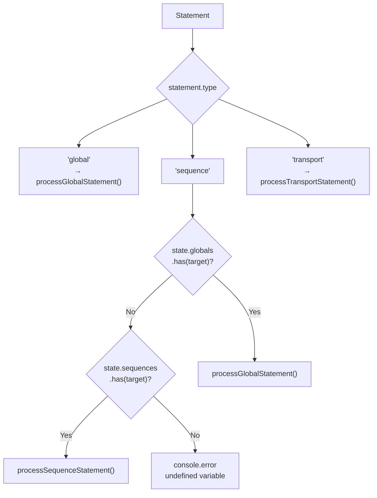
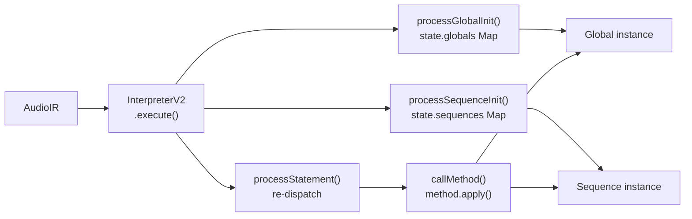

> **Note**: This page is a trace of the author's reading as of 2026-05-05. The code is the truth; this page is merely a snapshot of understanding at that point in time.

# I-2. AST Evaluation Model

In the previous chapter ([I-1. Text to AST](/en/pipeline/text-to-ast)), the `AudioIR` was constructed. From here, the subject is how that `AudioIR` is turned into "execution." Execution is handled by `InterpreterV2` and a set of modules called from within it.

## InterpreterV2 is a Thin Wrapper

The source of `InterpreterV2` carries an `@deprecated` marker and the description "thin wrapper around the interpreter modules." The actual important logic is distributed across `process-initialization.ts`, `process-statement.ts`, and `evaluate-method.ts`, while `InterpreterV2` remains as the entry point that bundles them and manages the lifecycle.

### Initializing state

The constructor of `InterpreterV2` creates an `InterpreterState`.

```typescript
// interpreter-v2.ts:26-37
    this.state = {
      audioEngine: new SuperColliderPlayer(),
      globals: new Map(),
      sequences: new Map(),
      currentGlobal: undefined,
      isBooted: false,
      // Initialize unidirectional toggle groups
      runGroup: new Set(),
      loopGroup: new Set(),
      muteGroup: new Set(),
    }
  }
```

Both `globals` and `sequences` are `Map`s, with the keys being DSL variable names (strings). `runGroup`, `loopGroup`, and `muteGroup` are `Set`s used for transport state management, which we will revisit later.

Let's also confirm the interface definition for `InterpreterState`.

```typescript
// interpreter/types.ts:12-23
export interface InterpreterState {
  globals: Map<string, Global>
  sequences: Map<string, Sequence>
  currentGlobal?: Global
  audioEngine: SuperColliderPlayer
  isBooted: boolean

  // Unidirectional toggle groups (DSL v3.0)
  runGroup: Set<string> // Sequences in RUN playback
  loopGroup: Set<string> // Sequences in LOOP playback
  muteGroup: Set<string> // Sequences with MUTE flag ON (persistent)
}
```

By keying instances of the `Global` and `Sequence` classes by variable name, the same object can be referenced again on re-evaluation.

### Execution Order in execute()

The `execute()` method takes an `AudioIR` and performs three actions in a fixed order.

```typescript
// interpreter-v2.ts:62-86
  async execute(ir: AudioIR, options?: { skipTransportCommands?: boolean }): Promise<void> {
    const skipTransport = options?.skipTransportCommands ?? false

    // Ensure SuperCollider is booted
    await this.ensureBooted()

    // Process global initialization
    if (ir.globalInit) {
      await processGlobalInit(ir.globalInit, this.state)
    }

    // Process sequence initializations
    for (const seqInit of ir.sequenceInits) {
      await processSequenceInit(seqInit, this.state)
    }

    // Process statements
    for (const statement of ir.statements) {
      // Skip transport commands if requested (e.g., on file save)
      if (skipTransport && statement.type === 'transport') {
        continue
      }
      await processStatement(statement, this.state)
    }
  }
```

To summarize the order:

1. `ensureBooted()` — confirms whether the SuperCollider server has been booted, and boots it if not
2. `processGlobalInit()` — processes `var global = init GLOBAL` (only if present)
3. The `processSequenceInit()` loop — processes `var seq1 = init global.seq` one by one
4. The `processStatement()` loop — runs tempo settings, playback, and transport commands in order

Initialization first, then execution statements — a natural structure. But pay attention to the `skipTransportCommands` option. It is used at times such as file save, to skip only `RUN()` / `LOOP()` / `MUTE()` while still applying configuration changes.

## Initialization: Instance Reuse and Map Identity

Both `processGlobalInit()` and `processSequenceInit()` are designed so that "if an entry of the same name already exists in the Map, it is reused without creating a new one."

### processGlobalInit()

```typescript
// process-initialization.ts:27-37
export async function processGlobalInit(init: GlobalInit, state: InterpreterState): Promise<void> {
  // Reuse existing global if it exists (for REPL persistence)
  let globalInstance = state.globals.get(init.variableName)

  if (!globalInstance) {
    globalInstance = new Global(state.audioEngine)
    state.globals.set(init.variableName, globalInstance)
  }

  state.currentGlobal = globalInstance
}
```

It looks up an existing instance via `state.globals.get(init.variableName)`. If found, it is used as-is; if not, a `new Global(...)` is created. The "for REPL persistence" comment is the key point: even if you re-evaluate the same block with Cmd+Enter, the same `Global` instance keeps being used.

### processSequenceInit()

The sequence initialization has the same structure but with one caveat at reuse time.

```typescript
// process-initialization.ts:56-92
export async function processSequenceInit(
  init: SequenceInit,
  state: InterpreterState,
): Promise<void> {
  let global: Global | undefined

  // If globalVariable is specified (new syntax: init global.seq)
  if (init.globalVariable) {
    global = state.globals.get(init.globalVariable)
    if (!global) {
      console.error(`Global instance not found: ${init.globalVariable}`)
      return
    }
  } else {
    // Legacy syntax: init GLOBAL.seq
    global = state.currentGlobal
    if (!global) {
      console.error('No global instance available for sequence initialization')
      return
    }
  }

  // Reuse existing sequence if it exists (for REPL persistence)
  let sequence = state.sequences.get(init.variableName)

  if (!sequence) {
    // Create sequence through the Global's factory method
    sequence = global.seq
    sequence.setName(init.variableName)
    state.sequences.set(init.variableName, sequence)
  } else {
    // Reset parameters to defaults when re-initializing
    // This prevents previous live changes (gain/pan) from persisting
    ;(sequence as any)._gainDb = 0 // Reset to 0 dB
    ;(sequence as any)._pan = 0 // Reset to center
  }
}
```

For new creation, `Sequence` is generated via the `global.seq` factory method, and `setName()` is used to set the name and complete registration. When reusing an existing instance, `_gainDb = 0` and `_pan = 0` are reset. This is by design, to prevent gain/pan changes made during a live session from unintentionally carrying over to the next evaluation.

## Statement Evaluation: processStatement() Dispatch

Once initialization is complete, each element of `statements` is passed to `processStatement()`. In [I-1](/en/pipeline/text-to-ast) we explained "the parser outputs all `<id>.method()` as `type: 'sequence'`." Resolving that decision correctly here is the role of the `'sequence'` case in `processStatement()`.

```typescript
// process-statement.ts:32-60
export async function processStatement(
  statement: Statement,
  state: InterpreterState,
): Promise<void> {
  switch (statement.type) {
    case 'global':
      await processGlobalStatement(statement, state)
      break
    case 'sequence':
      // Parser cannot distinguish between global and sequence at parse time
      // Determine the actual type here by checking state
      if (state.globals.has(statement.target)) {
        // It's actually a global statement
        await processGlobalStatement(statement as any, state)
      } else if (state.sequences.has(statement.target)) {
        // It's a sequence statement
        await processSequenceStatement(statement, state)
      } else {
        console.error(`Variable not found: ${statement.target}`)
      }
      break
    case 'transport':
      await processTransportStatement(statement, state)
      break
    default:
      // TypeScript should prevent this, but handle gracefully at runtime
      console.warn(`Unknown statement type: ${(statement as any).type}`)
  }
}
```

In the `'sequence'` case, `state.globals.has(statement.target)` is checked first. In other words, when code like `global.tempo(140)` arrives, the parser outputs `{ type: 'sequence', target: 'global', method: 'tempo', ... }`, but the interpreter checks "is the name `global` registered in `state.globals`?" and re-dispatches to `processGlobalStatement()`. Globals are checked before sequences as an implicit design: when a global and a sequence collide on the same name, the global wins.



## Method Calls: callMethod()

Both `processGlobalStatement()` and `processSequenceStatement()` delegate the actual method calls to `callMethod()`. Taking `processGlobalStatement()` as an example:

```typescript
// process-statement.ts:78-100
export async function processGlobalStatement(
  statement: GlobalStatement,
  state: InterpreterState,
): Promise<void> {
  const global = state.globals.get(statement.target)
  if (!global) {
    console.error(`Global instance not found: ${statement.target}`)
    return
  }

  // Start with the global object
  let result: any = global

  // Process the main method
  result = await callMethod(result, statement.method, statement.args)

  // Process any chained methods
  if (statement.chain) {
    for (const chainedCall of statement.chain) {
      result = await callMethod(result, chainedCall.method, chainedCall.args)
    }
  }
}
```

By repeatedly calling `callMethod()`, the chain is processed in order. Chains like `.audio(...).chop(...)` can be realized just by looping over the `statement.chain` array.

The body of `callMethod()` is simple.

```typescript
// evaluate-method.ts:23-38
export async function callMethod(obj: any, methodName: string, args: any[]): Promise<any> {
  const method = obj[methodName]
  if (!method || typeof method !== 'function') {
    console.error(`Method not found: ${methodName} on ${obj.constructor.name}`)
    return obj
  }

  // Process arguments
  const processedArgs = await processArguments(methodName, args)

  // Call the method
  const result = await method.apply(obj, processedArgs)

  // Return the result (usually 'this' for chaining)
  return result || obj
}
```

The method is dynamically obtained via `obj[methodName]` and called with `method.apply(obj, processedArgs)`. When the return value is falsy, `obj` itself is returned, so that the method chain does not break.

### processArguments(): Argument Conversion

Most arguments are passed through as-is, but a few special conversions are inserted.

```typescript
// evaluate-method.ts:61-84
export async function processArguments(methodName: string, args: any[]): Promise<any[]> {
  const processed: any[] = []

  for (const arg of args) {
    if (methodName === 'beat' && arg.numerator !== undefined) {
      // Handle meter: beat(4 by 4) -> beat(4, 4)
      processed.push(arg.numerator, arg.denominator)
    } else if (methodName === 'beat' && typeof arg === 'number') {
      // ERROR: beat() must use "n by m" syntax, not single number
      throw new Error(
        `beat() requires meter notation: beat(${arg} by 4) instead of beat(${arg})\n` +
          `This is essential for polymeter support where different time signatures create independent bar lengths.`,
      )
    } else if (methodName === 'play') {
      // Play arguments are passed as-is (already PlayElement[])
      processed.push(arg)
    } else {
      // Most arguments are passed through
      processed.push(arg)
    }
  }

  return processed
}
```

What is noteworthy is the handling of the `beat` method. The parser outputs `beat(4 by 4)` as the meter notation object `{ numerator: 4, denominator: 4 }`, but `processArguments()` expands it into the two arguments `[4, 4]`. Writing `beat(4)` and omitting `n by m` is designed to throw an error — an enforced notation that is essential for polymeter support.

## Transport Semantics

`RUN()`, `LOOP()`, and `MUTE()` are processed by `processTransportStatement()`. Their distinguishing design is that they are not toggles but **unidirectional overwrites**.

```typescript
// process-statement.ts:201-241
export async function processTransportStatement(
  statement: TransportStatement,
  state: InterpreterState,
): Promise<void> {
  const target = statement.target
  const command = statement.command
  const sequenceNames = statement.sequences ?? []

  // Handle reserved keywords (RUN, LOOP, MUTE) with unidirectional toggle
  // Empty arguments are allowed (e.g., RUN() clears the RUN group)
  if (
    target === '__RESERVED_KEYWORD__' &&
    (command === 'run' || command === 'loop' || command === 'mute')
  ) {
    await handleReservedKeywordCommand(command, sequenceNames, state)
    return
  }

  // Handle global commands (e.g., g.start() where g is a global variable)
  const global = state.globals.get(target)
  if (global) {
    await handleGlobalTransportCommand(global, command)
    // Clear transport groups when global.stop() is called
    // This ensures LOOP/RUN differential calculations work correctly after restart
    if (command === 'stop') {
      state.runGroup = new Set()
      state.loopGroup = new Set()
      state.muteGroup = new Set()
    }
    return
  }

  // Handle sequence commands (e.g., kick.run())
  const sequence = state.sequences.get(target)
  if (sequence) {
    await callMethod(sequence, command, [])
    return
  }

  console.error(`Transport target not found: ${target}`)
}
```

A command like `RUN(kick, snare)` is an overwrite that "sets the RUN group to kick and snare." The previous state is not considered at all. `LOOP` performs a differential computation (`calculateLoopDiff`) to start added sequences and stop removed ones. `MUTE` sets the mute flag of each sequence in a unidirectional way.

When `global.stop()` is called, `runGroup`, `loopGroup`, and `muteGroup` are all reset. This ensures that the post-restart state is computed correctly.

It is also notable that `target` becomes `'__RESERVED_KEYWORD__'` for `RUN()`, `LOOP()`, and `MUTE()`. This is a dummy target attached when `parseReservedKeyword()` outputs a transport command, a mechanism that allows the interpreter to distinguish them from references to globals or sequences.

## Binding Mechanism Summary

Let's organize what we have seen so far in a diagram.



A `Map` keyed by variable name (string) is the substance of the binding; there is no scope or closure-like complexity. Each re-evaluation just updates the same entry of the `Map`, and the REPL state is preserved.

## Related Terms

- [DSL](/en/glossary#dsl) — the domain-specific language defined by OrbitScore. The language whose AST the interpreter evaluates
- [init](/en/glossary#init) — the `init global` / `init sequenceName` syntax. Processed by the interpreter via `processGlobalInit()` / `processSequenceInit()`
- [global](/en/glossary#global) — the global scope identifier. Used as the key of the `state.globals` Map
- [RUN](/en/glossary#run) — the `:run` command. A transport operation dispatched by `processStatement()` to `handleRunCommand()`
- [LOOP](/en/glossary#loop) — the `:loop` command. A transport operation that involves a loop differential computation (`calculateLoopDiff`)
- [MUTE / UNMUTE](/en/glossary#mute--unmute) — the `:mute` / `:unmute` commands. Involves `Sequence` flag management
- [Unidirectional Toggle](/en/glossary#unidirectional-toggle-single-side-toggle) — the colon-prefixed transport command notation (`:command`)
- [Underscore Prefix Pattern](/en/glossary#underscore-prefix-pattern) — the v3.0 notation that disables a sequence with `_sequenceName`. Identified by `processSequenceInit()`

## Related ADRs

- [ADR-002 DSL v3 Pivot](/en/decisions/adr-002-dsl-v3-pivot) — the decision behind the syntax changes (underscore prefix, unidirectional toggle) introduced in v3.0

## Next Exploration Candidates

- The internal structure of the `Global` class — the delegation pattern of `TempoManager`, `AudioManager`, and `EffectsManager`
- The implementation of the `Sequence.seq` factory method — how `Global` produces `Sequence` instances
- Details of the differential computation (`calculateLoopDiff`) in `handleLoopCommand()`
- The flag management in `handleMuteCommand()` and how it integrates with the mute handling on the `Sequence` side
- Concrete scenarios where the `skipTransportCommands` option is used (file-save behavior)
- The handling of the `play` argument in `processArguments()` and the structure of `PlayElement`

## Sources

- `packages/engine/src/interpreter/interpreter-v2.ts:1-7` — the `@deprecated` marker and the thin-wrapper description
- `packages/engine/src/interpreter/interpreter-v2.ts:26-37` — `InterpreterState` initialization and the creation of each Map/Set
- `packages/engine/src/interpreter/interpreter-v2.ts:62-86` — execution order in `execute()`
- `packages/engine/src/interpreter/types.ts:12-23` — the `InterpreterState` interface definition
- `packages/engine/src/interpreter/process-initialization.ts:27-37` — Map reuse logic in `processGlobalInit()`
- `packages/engine/src/interpreter/process-initialization.ts:56-92` — reuse and `_gainDb` / `_pan` reset in `processSequenceInit()`
- `packages/engine/src/interpreter/process-statement.ts:32-60` — the switch in `processStatement()` and the global-first re-dispatch
- `packages/engine/src/interpreter/process-statement.ts:78-100` — chain processing in `processGlobalStatement()`
- `packages/engine/src/interpreter/process-statement.ts:201-241` — `processTransportStatement()` and the group reset on `global.stop()`
- `packages/engine/src/interpreter/evaluate-method.ts:23-38` — the `method.apply()` pattern in `callMethod()`
- `packages/engine/src/interpreter/evaluate-method.ts:61-84` — the beat / play special cases in `processArguments()`
