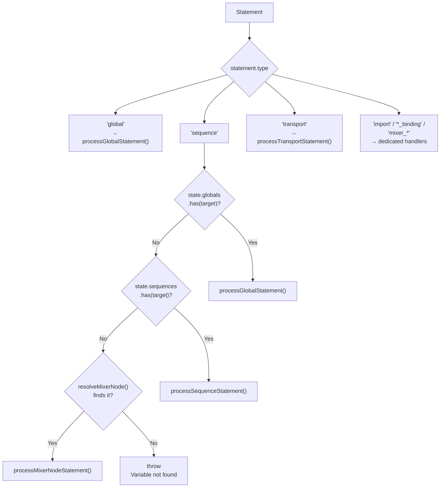
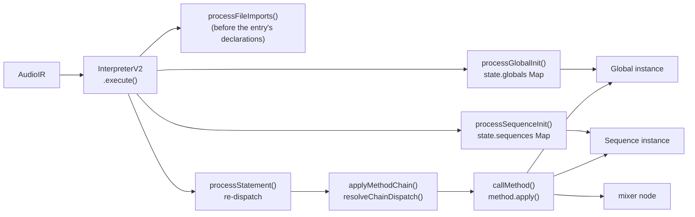

> **Note**: This page is a trace of the author's reading as of 2026-09-01. The code is the truth; this page is only a snapshot of understanding at that time.

# I-2. AST Evaluation Model

In the previous chapter ([I-1. Text to AST](/en/pipeline/text-to-ast)), the `AudioIR` was constructed. From here, the subject is how that `AudioIR` is turned into "execution." Execution is handled by `InterpreterV2` and a set of modules called from within it.

## Drift as of 2026-09

The first edition of this chapter was written against the 2026-05-05 snapshot (0a4b598). In the code as of 2026-09-01 (69dc968), the skeleton of this chapter — "a `Map` keyed by variable name is the substance of binding" and "the interpreter resolves, from state, the global/sequence question the parser left open" — is unchanged. What changed is the following.

- **`InterpreterState` gained `mixers` / `sessionLog?` / `engineT0` / `currentSourceFile?`**, and the type of `audioEngine` changed from `SuperColliderPlayer` to the contract surface `AudioEngineBackend` (`packages/engine/src/interpreter/types.ts:14-34`). The default implementation is `RustEnginePlayer` on the Rust daemon path (cutover #108; see [0-2](/en/orientation/architecture-overview))
- **`execute()` gained options** (`documentDirectory` / `source` / `sourceFile` / `evalSource`), now **processes file imports** before `globalInit`, and **sets documentDirectory on the Global** right after `globalInit` (#456 on 2026-07-17)
- **`processGlobalInit()` / `processSequenceInit()` check for collisions with the mixer namespace** (#517 S1)
- **The cases in `processStatement()` grew from 3 to 11**, resolution of `'sequence'` became a three-step "globals → sequences → mixer node," and a miss now **throws** instead of `console.error`
- **`processGlobalStatement()` / `processSequenceStatement()` centralized chain handling in `applyMethodChain()`**, where each hop lets `resolveChainDispatch()` decide "DSL method / plugin call / mixer routing" (#517 S2-S3)
- **`callMethod()` throws when the method is undefined** (the 2026-05 edition did `console.error` and returned `obj`). `processArguments()` throws a stage-explicit error when it receives a named argument (`name: value`) (SC.3.3)
- `processTransportStatement()` merely moved to lines 507-550; its content is the same

## InterpreterV2 is a Thin Wrapper

The source of `InterpreterV2` carries an `@deprecated` marker and the description "thin wrapper around the interpreter modules." The actual important logic is distributed across `process-initialization.ts`, `process-statement.ts`, and `evaluate-method.ts` (plus `process-file-import.ts`, added in #456), while `InterpreterV2` remains as the entry point that bundles them and manages the lifecycle.

### Initializing state

The constructor of `InterpreterV2` creates an `InterpreterState`.

```typescript
// packages/engine/src/interpreter/interpreter-v2.ts:48-64
  constructor(opts?: { audioEngine?: AudioEngineBackend }) {
    this.state = {
      audioEngine: opts?.audioEngine ?? createAudioEngine(),
      globals: new Map(),
      sequences: new Map(),
      mixers: createMixerRuntimeRegistry(),
      currentGlobal: undefined,
      isBooted: false,
      // Initialize unidirectional toggle groups
      runGroup: new Set(),
      loopGroup: new Set(),
      muteGroup: new Set(),
      // §L1: the rolling-buffer origin (§3 wall). The writer itself stays absent
      // until enableSessionLog() — so logging is inert in unit-test paths.
      engineT0: Date.now(),
    }
  }
```

Both `globals` and `sequences` are `Map`s, with the keys being DSL variable names (strings). `mixers` is the registry of mixer handles / nodes for the Signal Chain DSL, also keyed by name. `runGroup`, `loopGroup`, and `muteGroup` are `Set`s used for transport state management, which we will revisit later. `audioEngine` can be injected as an argument so tests can substitute it; when unspecified, `createAudioEngine()` chooses according to the env.

Let's also confirm the interface definition for `InterpreterState`.

```typescript
// packages/engine/src/interpreter/types.ts:14-34
export interface InterpreterState {
  globals: Map<string, Global>
  sequences: Map<string, Sequence>
  mixers: MixerRuntimeRegistry
  currentGlobal?: Global
  audioEngine: AudioEngineBackend
  isBooted: boolean

  // Unidirectional toggle groups (DSL v3.0)
  runGroup: Set<string> // Sequences in RUN playback
  loopGroup: Set<string> // Sequences in LOOP playback
  muteGroup: Set<string> // Sequences with MUTE flag ON (persistent)

  // §L1 (#229) session log — present ONLY when explicitly enabled at a real
  // entry point (CLI / REPL). Absent in unit-test paths, so logging is inert.
  sessionLog?: SessionLogWriter
  engineT0: number // epoch ms at interpreter construction = rolling-buffer origin (§3 wall)
  // The .orbs the current eval came from — read by the transport-hook closures
  // when start()/stop() fire synchronously within that eval (§3 sourceFile / §2 naming).
  currentSourceFile?: string | null
}
```

By keying instances of the `Global` and `Sequence` classes by variable name, the same object can be referenced again on re-evaluation.

### Execution Order in execute()

The `execute()` method takes an `AudioIR` and evaluation options. The options exist so that an evaluation from the editor / MCP can convey "which directory to resolve against" and "which source it came from."

```typescript
// packages/engine/src/interpreter/interpreter-v2.ts:133-146
  async execute(
    ir: AudioIR,
    options?: {
      skipTransportCommands?: boolean
      documentDirectory?: string
      /** §L1: the verbatim evaluated source (the `code` field). */
      source?: string
      /** §L1: the originating `.orbs` (drives `sourceFile` + filename). */
      sourceFile?: string | null
      /** §L1: who evaluated this (default `human`). */
      evalSource?: EvalSource
    },
  ): Promise<void> {
    const skipTransport = options?.skipTransportCommands ?? false
```

The body proceeds in a fixed order.

```typescript
// packages/engine/src/interpreter/interpreter-v2.ts:171-230 (file import の本体と session-log hook の設置を省略)
    // Ensure SuperCollider is booted
    await this.ensureBooted()

    // File imports (IM.2, #456): evaluated BEFORE the entry's own declarations, in
    // source order, depth-first. The cache/cycle context lives for this eval only.
    if (ir.fileImports?.length) {
      // ...
    }

    // Process global initialization
    if (ir.globalInit) {
      await processGlobalInit(ir.globalInit, this.state)
    }
    // ...
    // Set documentDirectory on global so audioPath() / audio() can resolve relative paths
    if (options?.documentDirectory && this.state.currentGlobal) {
      this.state.currentGlobal.setDocumentDirectory(options.documentDirectory)
    }

    // Process sequence initializations
    for (const seqInit of ir.sequenceInits) {
      await processSequenceInit(seqInit, this.state)
    }

    // Process statements
    for (const statement of ir.statements) {
      // Skip transport commands if requested (e.g., on file save)
      if (skipTransport && statement.type === 'transport') {
        continue
      }
      await processStatement(statement, this.state)
    }
  }
```

To summarize the order:

1. `ensureBooted()` — confirms whether the audio backend has been booted, and boots it if not (the comment still says "SuperCollider," but by default the Rust daemon is what boots)
2. `processFileImports()` — evaluates `import { ... } from "./x.orbs"` before the entry's own declarations (only if present)
3. `processGlobalInit()` — processes `var global = init GLOBAL` (only if present)
4. `setDocumentDirectory()` — sets it on the Global if the `documentDirectory` option is given
5. The `processSequenceInit()` loop — processes `var seq1 = init global.seq` one by one
6. The `processStatement()` loop — runs tempo settings, playback, and transport commands in order

Initialization first, then execution statements — a natural structure. But pay attention to the `skipTransportCommands` option. It is used at times such as file save, to skip only `RUN()` / `LOOP()` / `MUTE()` while still applying configuration changes.

## Initialization: Instance Reuse and Map Identity

Both `processGlobalInit()` and `processSequenceInit()` are designed so that "if an entry of the same name already exists in the Map, it is reused without creating a new one."

### processGlobalInit()

```typescript
// packages/engine/src/interpreter/process-initialization.ts:27-43
export async function processGlobalInit(init: GlobalInit, state: InterpreterState): Promise<void> {
  if (state.mixers.handles.has(init.variableName) || state.mixers.nodes.has(init.variableName)) {
    throw new Error(
      `Global name "${init.variableName}" conflicts with the existing mixer namespace.`,
    )
  }

  // Reuse existing global if it exists (for REPL persistence)
  let globalInstance = state.globals.get(init.variableName)

  if (!globalInstance) {
    globalInstance = new Global(state.audioEngine)
    state.globals.set(init.variableName, globalInstance)
  }

  state.currentGlobal = globalInstance
}
```

After first rejecting a collision with the mixer namespace, it looks up an existing instance via `state.globals.get(init.variableName)`. If found, it is used as-is; if not, a `new Global(...)` is created. The "for REPL persistence" comment is the key point: even if you re-evaluate the same block with Cmd+Enter, the same `Global` instance keeps being used.

### processSequenceInit()

The sequence initialization has the same structure but with one caveat at reuse time.

```typescript
// packages/engine/src/interpreter/process-initialization.ts:62-104
export async function processSequenceInit(
  init: SequenceInit,
  state: InterpreterState,
): Promise<void> {
  if (state.mixers.handles.has(init.variableName) || state.mixers.nodes.has(init.variableName)) {
    throw new Error(
      `Sequence name "${init.variableName}" conflicts with the existing mixer namespace.`,
    )
  }

  let global: Global | undefined

  // If globalVariable is specified (new syntax: init global.seq)
  if (init.globalVariable) {
    global = state.globals.get(init.globalVariable)
    if (!global) {
      console.error(`Global instance not found: ${init.globalVariable}`)
      return
    }
  } else {
    // Legacy syntax: init GLOBAL.seq
    global = state.currentGlobal
    if (!global) {
      console.error('No global instance available for sequence initialization')
      return
    }
  }

  // Reuse existing sequence if it exists (for REPL persistence)
  let sequence = state.sequences.get(init.variableName)

  if (!sequence) {
    // Create sequence through the Global's factory method
    sequence = global.seq
    sequence.setName(init.variableName)
    state.sequences.set(init.variableName, sequence)
  } else {
    // Reset parameters to defaults when re-initializing
    // This prevents previous live changes (gain/pan) from persisting
    ;(sequence as any)._gainDb = 0 // Reset to 0 dB
    ;(sequence as any)._pan = 0 // Reset to center
  }
}
```

For new creation, `Sequence` is generated via the `global.seq` factory method, and `setName()` is used to set the name and complete registration. When reusing an existing instance, `_gainDb = 0` and `_pan = 0` are reset. This is by design, to prevent gain/pan changes made during a live session from unintentionally carrying over to the next evaluation.

## Statement Evaluation: processStatement() Dispatch

Once initialization is complete, each element of `statements` is passed to `processStatement()`. In [I-1](/en/pipeline/text-to-ast) we explained "the parser outputs all `<id>.method()` as `type: 'sequence'`." Resolving that decision correctly here is the role of the `'sequence'` case in `processStatement()`.

```typescript
// packages/engine/src/interpreter/process-statement.ts:61-115
export async function processStatement(
  statement: Statement,
  state: InterpreterState,
): Promise<void> {
  switch (statement.type) {
    case 'global':
      await processGlobalStatement(statement, state)
      break
    case 'sequence':
      // Parser cannot distinguish between global and sequence at parse time
      // Determine the actual type here by checking state
      if (state.globals.has(statement.target)) {
        // It's actually a global statement
        await processGlobalStatement(statement as any, state)
      } else if (state.sequences.has(statement.target)) {
        // It's a sequence statement
        await processSequenceStatement(statement, state)
      } else {
        const node = resolveMixerNode(state.mixers, statement.target, state.currentGlobal)
        if (node) {
          await processMixerNodeStatement(statement, node, state)
        } else {
          throw new Error(`Variable not found: ${statement.target}`)
        }
      }
      break
    case 'transport':
      await processTransportStatement(statement, state)
      break
    case 'import':
      processImportStatement(statement, state)
      break
    case 'chord_binding':
      processArrayBinding(statement, state)
      break
    case 'pattern_binding':
      processPatternBinding(statement, state)
      break
    case 'mode_binding':
      processModeBinding(statement, state)
      break
    case 'mixer_handle':
      await processMixerHandleStatement(statement, state)
      break
    case 'mixer_init':
      registerMixerHandle(state, statement)
      break
    case 'mixer_node_decl':
      registerMixerNode(state, statement)
      break
    default:
      // TypeScript should prevent this, but handle gracefully at runtime
      console.warn(`Unknown statement type: ${(statement as any).type}`)
  }
}
```

In the `'sequence'` case, `state.globals.has(statement.target)` is checked first. In other words, when code like `global.tempo(140)` arrives, the parser outputs `{ type: 'sequence', target: 'global', method: 'tempo', ... }`, but the interpreter checks "is the name `global` registered in `state.globals`?" and re-dispatches to `processGlobalStatement()`. Globals are checked before sequences as an implicit design: when a global and a sequence collide on the same name, the global wins. If neither matches, a third step looks for a mixer node (a name declared with `var drums = mix.sum`, for example), and if that also misses, `Variable not found` is **thrown**. The REPL catches this exception, prints it to stderr as `[ERROR]`, and returns it as a diagnostic to the MCP `evaluate_orbitscore` tool ([I-3](/en/pipeline/selective-execution)).


```mermaid
flowchart TD
  stmt["Statement"]
  sw{"statement.type"}
  g["'global'\n→ processGlobalStatement()"]
  seq["'sequence'"]
  chkG{"state.globals\n.has(target)?"}
  chkS{"state.sequences\n.has(target)?"}
  chkM{"resolveMixerNode()\nfinds it?"}
  gStmt["processGlobalStatement()"]
  sStmt["processSequenceStatement()"]
  mStmt["processMixerNodeStatement()"]
  err["throw\nVariable not found"]
  trans["'transport'\n→ processTransportStatement()"]
  other["'import' / '*_binding' /\n'mixer_*'\n→ dedicated handlers"]

  stmt --> sw
  sw --> g
  sw --> seq
  sw --> trans
  sw --> other
  seq --> chkG
  chkG -- Yes --> gStmt
  chkG -- No --> chkS
  chkS -- Yes --> sStmt
  chkS -- No --> chkM
  chkM -- Yes --> mStmt
  chkM -- No --> err
```

## Method Calls: applyMethodChain() and callMethod()

Both `processGlobalStatement()` and `processSequenceStatement()`, once they have fetched the receiver, delegate to `applyMethodChain()`. Taking `processGlobalStatement()` as an example:

```typescript
// packages/engine/src/interpreter/process-statement.ts:394-411
export async function processGlobalStatement(
  statement: GlobalStatement,
  state: InterpreterState,
): Promise<void> {
  const global = state.globals.get(statement.target)
  if (!global) {
    throw new Error(`Variable not found: ${statement.target}`)
  }

  await applyMethodChain(
    global,
    statement.method,
    statement.args,
    state,
    statement.chain,
    statement.invocation ?? 'call',
  )
}
```

`applyMethodChain()` is the single place holding the loop "call the main method, then call each element of `chain` in turn." Every receiver kind (Global / Sequence / bus reference / mixer node) goes through the same loop, so chain semantics are defined in exactly one place.

```typescript
// packages/engine/src/interpreter/process-statement.ts:117-141
/**
 * Apply a statement's main call and then its chained calls to `receiver`,
 * threading each call's return value into the next (methods return `this` to
 * chain). Every receiver kind — global, sequence, bare bus reference, mixer node —
 * shares this loop so chain semantics stay defined in exactly one place.
 * Each hop also resolves dynamic chain vocabulary and selects DSL-method versus
 * plugin dispatch before threading the returned receiver onward.
 *
 * That includes which methods a receiver even accepts: {@link guardBusChain} runs
 * against the value about to be dispatched on, before each call. Enforcement
 * therefore travels with the value rather than with the handler that produced it,
 * so a handler added later inherits it instead of having to remember it.
 */
async function applyMethodChain(
  receiver: unknown,
  method: string,
  args: any[],
  state: InterpreterState,
  chain?: ReadonlyArray<{
    method: string
    args: any[]
    invocation?: 'bare' | 'call'
  }>,
  invocation: 'bare' | 'call' = 'call',
): Promise<any> {
```

At each hop, `resolveChainDispatch()` decides "is this name a DSL method, a plugin call, or mixer routing?" A point to note is that the `invocation` recorded by the parser takes on meaning at this stage. Writing a DSL method on a Global without parentheses triggers the following guard.

```typescript
// packages/engine/src/interpreter/process-statement.ts:148-167
    const dispatch = resolveChainDispatch(receiver, method, state, invocation)
    if (
      dispatch.kind === 'dsl-method' &&
      invocation === 'bare' &&
      receiver instanceof Global &&
      !GLOBAL_BARE_METHODS.has(method)
    ) {
      // Before #517 S3, a bare non-transport call on a Global reached
      // `handleGlobalTransportCommand`, whose `default` arm warned and never
      // invoked the method. S3 routes every bare first hop through the chain
      // dispatcher instead, so `global.midiLatency` (a dropped `(20)`) would call
      // `midiLatency(undefined)` and silently corrupt state — reproduced, along
      // with `global.key` crashing inside `name.match(...)`. Sequences keep bare
      // DSL methods (`kick.unmute`); only a Global needs the parentheses, since
      // its bare vocabulary is transport-only.
      throw new Error(
        `Global method "${method}" requires parentheses; write global.${method}(...). ` +
          `Only ${[...GLOBAL_BARE_METHODS].join(' / ')} may be written bare on a Global.`,
      )
    }
```

The comment preserves a real case in which a form with a dropped argument, such as `global.midiLatency`, went through as `midiLatency(undefined)` and silently corrupted state. The asymmetry is that the Sequence side keeps allowing bare forms like `kick.unmute`, while a Global restricts them to `start` / `stop` / `loop`.

A call judged to be a DSL method finally reaches `callMethod()`.

```typescript
// packages/engine/src/interpreter/evaluate-method.ts:23-35
export async function callMethod(obj: any, methodName: string, args: any[]): Promise<any> {
  const processedArgs = await processArguments(methodName, args)
  const method = obj[methodName]
  if (!method || typeof method !== 'function') {
    throw new Error(`Method not found: ${methodName} on ${obj?.constructor?.name ?? 'receiver'}`)
  }

  // Call the method
  const result = await method.apply(obj, processedArgs)

  // Return the result (usually 'this' for chaining)
  return result || obj
}
```

The method is dynamically obtained via `obj[methodName]` and called with `method.apply(obj, processedArgs)`. When the return value is falsy, `obj` itself is returned, so that the method chain does not break. If the method is not found, it throws — in the 2026-05 edition it did `console.error` and returned `obj`, leaving room for a failure to flow past silently, whereas in this edition it always surfaces as an exception.

### processArguments(): Argument Conversion

Most arguments are passed through as-is, but a few special conversions are inserted.

```typescript
// packages/engine/src/interpreter/evaluate-method.ts:58-107
export async function processArguments(methodName: string, args: any[]): Promise<any[]> {
  const processed: any[] = []

  for (const arg of args) {
    if (arg && typeof arg === 'object' && arg.type === 'named_arg') {
      // Plugin-name dispatch handles selectors before reaching this function.
      // Any named argument that arrives here belongs to a DSL method and must
      // receive an explicit staged error (SC.3.3).
      let stage: string
      switch (arg.name) {
        case 'format':
        case 'vendor':
          stage =
            `string-form ${methodName}() does not accept selectors; ` +
            `use the plugin-name method form Name(format: "vst3")`
          break
        case 'sidechain':
          stage = 'sidechain routing arrives in #409'
          break
        case 'outs':
          stage = 'multi-output routing arrives in #409'
          break
        default:
          stage = 'parameter values require the Rust param-set/enumeration protocol in S4'
      }
      throw new Error(
        `named argument "${arg.name}:" in ${methodName}() is not executable yet: ` +
          `${stage} (#517).`,
      )
    }
    if (methodName === 'beat' && arg.numerator !== undefined) {
      // Handle meter: beat(4 by 4) -> beat(4, 4)
      processed.push(arg.numerator, arg.denominator)
    } else if (methodName === 'beat' && typeof arg === 'number') {
      // ERROR: beat() must use "n by m" syntax, not single number
      throw new Error(
        `beat() requires meter notation: beat(${arg} by 4) instead of beat(${arg})\n` +
          `This is essential for polymeter support where different time signatures create independent bar lengths.`,
      )
    } else if (methodName === 'play') {
      // Play arguments are passed as-is (already PlayElement[])
      processed.push(arg)
    } else {
      // Most arguments are passed through
      processed.push(arg)
    }
  }

  return processed
}
```

What is noteworthy is the handling of the `beat` method. The parser outputs `beat(4 by 4)` as the meter notation object `{ numerator: 4, denominator: 4 }`, but `processArguments()` expands it into the two arguments `[4, 4]`. Writing `beat(4)` and omitting `n by m` is designed to throw an error — an enforced notation that is essential for polymeter support.

The leading `named_arg` branch exists for the named arguments of the Signal Chain DSL (SC.3): when a named argument that was not consumed by plugin-name dispatch reaches a DSL method, it throws an error stating explicitly "at which stage this becomes usable." Silently ignoring it is forbidden by SC.3.3.

## Transport Semantics

`RUN()`, `LOOP()`, and `MUTE()` are processed by `processTransportStatement()`. Their distinguishing design is that they are not toggles but **unidirectional overwrites**.

```typescript
// packages/engine/src/interpreter/process-statement.ts:507-550
export async function processTransportStatement(
  statement: TransportStatement,
  state: InterpreterState,
): Promise<void> {
  const target = statement.target
  const command = statement.command
  const sequenceNames = statement.sequences ?? []

  // Handle reserved keywords (RUN, LOOP, MUTE) with unidirectional toggle
  // Empty arguments are allowed (e.g., RUN() clears the RUN group)
  if (
    target === '__RESERVED_KEYWORD__' &&
    (command === 'run' || command === 'loop' || command === 'mute')
  ) {
    await handleReservedKeywordCommand(command, sequenceNames, state)
    return
  }

  // Handle global commands (e.g., g.start() where g is a global variable).
  // Note: §L1 session-log start/stop hooks live on Global.start()/stop() (the
  // boundary both `start` (transport-routed) and `stop` (method-routed) pass
  // through), not here — so they fire regardless of how the command is parsed.
  const global = state.globals.get(target)
  if (global) {
    await handleGlobalTransportCommand(global, command)
    // Clear transport groups when global.stop() is called
    // This ensures LOOP/RUN differential calculations work correctly after restart
    if (command === 'stop') {
      state.runGroup = new Set()
      state.loopGroup = new Set()
      state.muteGroup = new Set()
    }
    return
  }

  // Handle sequence commands (e.g., kick.run())
  const sequence = state.sequences.get(target)
  if (sequence) {
    await callMethod(sequence, command, [])
    return
  }

  console.error(`Transport target not found: ${target}`)
}
```

A command like `RUN(kick, snare)` is an overwrite that "sets the RUN group to kick and snare." The previous state is not considered at all. `LOOP` performs a differential computation (`calculateLoopDiff`) to start added sequences and stop removed ones. `MUTE` sets the mute flag of each sequence in a unidirectional way.

When `global.stop()` is called, `runGroup`, `loopGroup`, and `muteGroup` are all reset. This ensures that the post-restart state is computed correctly.

It is also notable that `target` becomes `'__RESERVED_KEYWORD__'` for `RUN()`, `LOOP()`, and `MUTE()`. This is a dummy target attached when `parseReservedKeyword()` outputs a transport command, a mechanism that allows the interpreter to distinguish them from references to globals or sequences.

## Binding Mechanism Summary

Let's organize what we have seen so far in a diagram.


```mermaid
flowchart LR
  ir["AudioIR"]
  exec["InterpreterV2\n.execute()"]
  imp["processFileImports()\n(before the entry's declarations)"]
  gInit["processGlobalInit()\nstate.globals Map"]
  sInit["processSequenceInit()\nstate.sequences Map"]
  stmt["processStatement()\nre-dispatch"]
  chain["applyMethodChain()\nresolveChainDispatch()"]
  cm["callMethod()\nmethod.apply()"]
  g["Global instance"]
  s["Sequence instance"]
  m["mixer node"]

  ir --> exec
  exec --> imp
  exec --> gInit
  exec --> sInit
  exec --> stmt
  gInit --> g
  sInit --> s
  stmt --> chain
  chain --> cm
  cm --> g
  cm --> s
  cm --> m
```

A `Map` keyed by variable name (string) (plus the mixer registry) is the substance of the binding; there is no scope or closure-like complexity. Each re-evaluation just updates the same entry of the `Map`, and the REPL state is preserved. Declarations brought in by a file import land in the same `Map`; that too is unchanged.

## Related Terms

- [DSL](/en/glossary#dsl) — the domain-specific language defined by OrbitScore. The language whose AST the interpreter evaluates
- [init](/en/glossary#init) — the `init global` / `init sequenceName` syntax. Processed by the interpreter via `processGlobalInit()` / `processSequenceInit()`
- [global](/en/glossary#global) — the global scope identifier. Used as the key of the `state.globals` Map
- [RUN](/en/glossary#run) — the `RUN()` command. A transport operation dispatched by `processTransportStatement()` to `handleRunCommand()`
- [LOOP](/en/glossary#loop) — the `LOOP()` command. A transport operation that involves a loop differential computation (`calculateLoopDiff`)
- [MUTE / UNMUTE](/en/glossary#mute--unmute) — the `MUTE()` command. Involves `Sequence` flag management
- [Unidirectional Toggle](/en/glossary#unidirectional-toggle-single-side-toggle) — the unidirectional-overwrite transport semantics
- [Underscore Prefix Pattern](/en/glossary#underscore-prefix-pattern) — the v3.0 notation that disables a sequence with `_sequenceName`

## Related ADRs

- [ADR-002 DSL v3 Pivot](/en/decisions/adr-002-dsl-v3-pivot) — the decision behind the syntax changes (underscore prefix, unidirectional toggle) introduced in v3.0

## Next Exploration Candidates

- The internal structure of the `Global` class — the delegation pattern to `TempoManager`, `AudioManager`, the mixer manager, and others
- The implementation of the `Sequence.seq` factory method — how `Global` produces `Sequence` instances
- The decision rules of `resolveChainDispatch()` — in what order DSL methods / plugin names / mixer routing are matched (`packages/engine/src/signal-chain/dispatch.ts`)
- `guardBusChain` in `applyMethodChain()` — the constraints on which methods each receiver kind accepts
- Cache / cycle detection in `processFileImports()` and the `finally` that restores the base directory on failure (IM.4 / IM.6)
- Details of the differential computation (`calculateLoopDiff`) in `handleLoopCommand()`
- The flag management in `handleMuteCommand()` and how it integrates with the mute handling on the `Sequence` side
- Concrete scenarios where the `skipTransportCommands` option is used (file-save behavior)
- How `processArrayBinding()` classifies `[ ... ]` as a chord or a rack (`classifyArrayBinding`)
- Session log (§L1) hook installation — how `installSessionHooks()` binds to `Global.start()/stop()`

## Sources

- `packages/engine/src/interpreter/interpreter-v2.ts:1-7` — the `@deprecated` marker and the thin-wrapper description
- `packages/engine/src/interpreter/interpreter-v2.ts:48-64` — `InterpreterState` initialization and `createAudioEngine()`
- `packages/engine/src/interpreter/interpreter-v2.ts:133-230` — `execute()` options and execution order (file import → globalInit → documentDirectory → sequenceInits → statements)
- `packages/engine/src/interpreter/types.ts:14-34` — the `InterpreterState` interface definition
- `packages/engine/src/interpreter/process-initialization.ts:27-43` — mixer-namespace check and Map reuse logic in `processGlobalInit()`
- `packages/engine/src/interpreter/process-initialization.ts:62-104` — reuse and `_gainDb` / `_pan` reset in `processSequenceInit()`
- `packages/engine/src/interpreter/process-statement.ts:61-115` — the switch in `processStatement()` and the globals → sequences → mixer node re-dispatch
- `packages/engine/src/interpreter/process-statement.ts:117-167` — design comment of `applyMethodChain()` and the bare-invocation guard for Globals
- `packages/engine/src/interpreter/process-statement.ts:394-446` — `processGlobalStatement()` / `processSequenceStatement()`
- `packages/engine/src/interpreter/process-statement.ts:507-550` — `processTransportStatement()` and the group reset on `global.stop()`
- `packages/engine/src/interpreter/evaluate-method.ts:23-35` — the `method.apply()` pattern and the throw in `callMethod()`
- `packages/engine/src/interpreter/evaluate-method.ts:58-107` — the named_arg / beat / play special cases in `processArguments()`
- `packages/engine/src/interpreter/process-file-import.ts` — `createImportContext()` / `processFileImports()` (#456)
- `docs/specs-v2/SIGNAL_CHAIN_DSL_SPEC_v1.md` §SC.3 — named arguments and the "never silently ignore" rule (SC.3.3)
- `docs/development/WORK_LOG.md` §6.265 (file import #456, 2026-07-17), §6.291-6.293 (Signal Chain S1-S3 #517, 2026-07-26)
