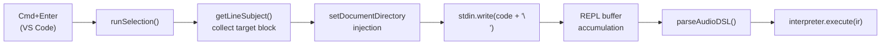
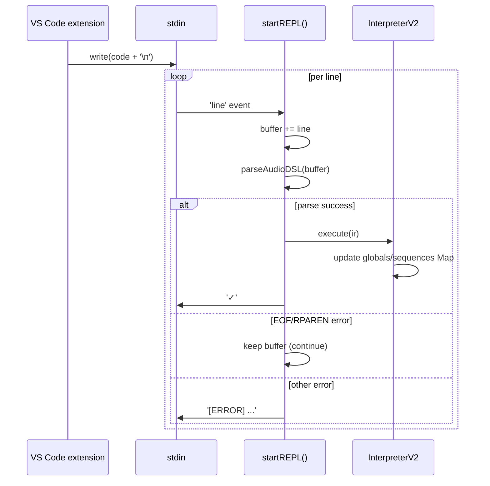

> **Note**: This page is a trace of the author's reading as of 2026-05-05. The code is the truth; this page is merely a snapshot of understanding at that point in time.

# I-3. Selective Execution

Executing only part of the code with Cmd+Enter — this is the central operation of OrbitScore. Equivalent to the "selective evaluation" of TidalCycles, this mechanism is realized across two processes: the VS Code extension and the engine. This chapter traces, from the keystroke to the completion of execution in the engine, how the code flows.

## The Big Picture



The VS Code extension side "decides what code to send," and the engine side "receives it and executes it" — a clear division of responsibility.

## Engine Boot: the repl Subcommand

First, let's confirm how the engine boots. `startEngine()` spawns a Node process with `'repl'` as an argument.

```typescript
// extension.ts:718-743
  // Build args
  const args = ['repl']
  if (audioDevice) {
    args.push('--audio-device', audioDevice)
  }
  if (debugMode) {
    args.push('--debug')
  }
  // ...
  // Spawn engine process
  engineProcess = child_process.spawn('node', [enginePath, ...args], {
    cwd: workspaceRoot,
    stdio: ['pipe', 'pipe', 'pipe'],
    env,
  })
```

The point is `stdio: ['pipe', 'pipe', 'pipe']`. Because stdin, stdout, and stderr are all pipe-connected, the extension can pump code in via `engineProcess.stdin.write(...)`. On receiving the `repl` subcommand, the engine calls `startREPLMode()`.

```typescript
// repl-mode.ts:27-39
export async function startREPLMode(options: REPLOptions = {}): Promise<void> {
  console.log('🎵 OrbitScore Audio Engine')
  console.log('✅ Initialized')

  // Create a global interpreter
  const globalInterpreter = new InterpreterV2()

  // Boot SuperCollider once at startup with optional audio device
  await globalInterpreter.boot(options.audioDevice)

  console.log('🎵 Live coding mode')
  await startREPL(globalInterpreter)
}
```

A single instance of `InterpreterV2` is created and lives throughout the boot. Because this instance holds the entire REPL session's state (the `globals` / `sequences` Maps), the previous state is preserved across each Cmd+Enter.

## On the VS Code Side: Text Collection in runSelection()

The function triggered by Cmd+Enter is `runSelection()`. Let's first look at the part that decides "what to send."

### When There is a Selection

If the selected text is non-empty, its content is used as-is.

```typescript
// extension.ts:953-955
  if (!selection.isEmpty) {
    text = editor.document.getText(selection)
    executionRange = new vscode.Range(selection.start, selection.end)
  } else {
```

### No Selection: Subject-based Block Collection

When there is no selection, the "subject" of the cursor line is identified, and all lines that have the same subject are collected from the entire document.

The function that determines the subject is `getLineSubject()`.

```typescript
// extension.ts:920-933
function getLineSubject(lineText: string): string | null {
  const trimmed = lineText.trim()
  if (!trimmed || trimmed.startsWith('//')) return null

  // var <name> = init ...
  const varMatch = trimmed.match(/^var\s+(\w+)\s*=/)
  if (varMatch) return varMatch[1]

  // <name>.method(...)
  const dotMatch = trimmed.match(/^(\w+)\./)
  if (dotMatch) return dotMatch[1]

  return null
}
```

For `var kick = init global.seq` it returns `'kick'`, and for `kick.audio("kick.wav")` it likewise returns `'kick'`. As a result, all lines related to a single variable are treated as one block. `null` is returned for blank lines, comment lines, and transport commands such as `RUN()`.

When a subject is found, the entire document is scanned to collect lines that have that subject. Furthermore, lines whose parentheses are unmatched (calls that span multiple lines) keep being included until the next line (see extension.ts:967-988).

When the subject is `null` — that is, a stand-alone command like `RUN(kick, snare)` — only the cursor line (until its parentheses close) is collected.

### setDocumentDirectory Injection

After the code to send is determined, the document's directory path is automatically injected. It is used to resolve relative paths in `audioPath()` and `audio()`.

```typescript
// extension.ts (excerpt with conditions simplified)
let codeToSend = trimmedText
const documentDir = path.dirname(editor.document.uri.fsPath)
const setDirCommand = `global.setDocumentDirectory("${documentDir.replace(/\\/g, '\\\\')}")`
const globalInitMatch = codeToSend.match(/(var\s+global\s*=\s*init\s+GLOBAL[^\n]*)/)
if (globalInitMatch) {
  // Block evaluation that initializes global: insert right after init
  const insertPos = globalInitMatch.index! + globalInitMatch[0].length
  codeToSend =
    codeToSend.slice(0, insertPos) + '\n' + setDirCommand + codeToSend.slice(insertPos)
  globalInitialized = true
} else if (globalInitialized) {
  // Session that already has a global: prepend at the head of the code
  codeToSend = setDirCommand + '\n' + codeToSend
}
```

Injection conditions:

1. Evaluation containing `var global = init GLOBAL` → inserted right after the init, and the `globalInitialized` flag is set
2. Any subsequent evaluation → prepended to the head of the code (also tracking `.orbs` file switches)
3. Evaluation in which `globalInitialized` is `false` and which does not contain an `init` line → not injected (to avoid an error from `global` being undefined)

The `globalInitialized` flag is bound to the engine process lifecycle and is reset at boot, restart, or activate.

There is no fallback to `process.cwd()` on the engine side (Issue #168). If documentDirectory is unset and a relative path is specified, an explicit error is raised.

### Writing to stdin

Once the code is determined, a single newline is appended and pushed into stdin.

```typescript
// extension.ts:1107-1108
  engineProcess.stdin?.write(codeToSend + '\n')
  flashLines()
```

`flashLines()` flashes the executed lines in the editor, providing visual feedback.

## On the Engine Side: REPL Buffer Accumulation and Execution

The code written to stdin is processed by `startREPL()` on the engine side.

```typescript
// repl-mode.ts:50-58
export async function startREPL(interpreter: InterpreterV2): Promise<void> {
  const rl = readline.createInterface({
    input: process.stdin,
    output: process.stdout,
    terminal: false,
  })

  let buffer = ''
  let emptyLineCount = 0
```

`readline.createInterface` reads stdin line by line. `terminal: false` indicates that this is not an interactive terminal (it is pipe input). The state is held in the `buffer` string and the `emptyLineCount` counter.

### The `'line'` Event That Receives Each Line

`rl.on('line', ...)` receives each line. The behavior splits between empty lines and others.

```typescript
// repl-mode.ts:60-127
  rl.on('line', async (line) => {
    if (process.env.ORBITSCORE_DEBUG) {
      console.log(`[DEBUG] Received line (length=${line.length}): ${JSON.stringify(line)}`)
      console.log(`[DEBUG] Buffer length before: ${buffer.length}`)
    }

    // If we receive an empty line, increment counter
    if (line.trim() === '') {
      emptyLineCount++
      buffer += '\n'

      if (process.env.ORBITSCORE_DEBUG) {
        console.log(`[DEBUG] Empty line detected, count=${emptyLineCount}`)
      }

      // If we get 2+ consecutive empty lines, treat buffer as complete and execute
      if (emptyLineCount >= 2 && buffer.trim()) {
        if (process.env.ORBITSCORE_DEBUG) {
          console.log(`[DEBUG] Forcing execution due to 2+ empty lines`)
        }
        await executeBuffer()
      }
      return
    }

    // Reset empty line counter and add line to buffer
    emptyLineCount = 0
    buffer += line + '\n'

    if (process.env.ORBITSCORE_DEBUG) {
      console.log(`[DEBUG] Buffer length after: ${buffer.length}`)
      console.log(`[DEBUG] Attempting to parse buffer...`)
    }

    // Try to parse and execute the buffer
    // If parsing fails due to incomplete input, keep buffering
    try {
      const ir = parseAudioDSL(buffer.trim())
      await interpreter.execute(ir)
      console.log('✓') // Success indicator
      buffer = '' // Reset buffer on success
      if (process.env.ORBITSCORE_DEBUG) {
        console.log(`[DEBUG] Parse success, buffer cleared`)
      }
    } catch (error: any) {
      if (process.env.ORBITSCORE_DEBUG) {
        console.log(`[DEBUG] Parse error: ${error.message}`)
      }
      // If error is about EOF or incomplete input, keep buffering
      if (
        error.message.includes('EOF') ||
        error.message.includes('Expected RPAREN') ||
        error.message.includes('Expected comma or closing parenthesis')
      ) {
        if (process.env.ORBITSCORE_DEBUG) {
          console.log(`[DEBUG] Incomplete input, continuing to buffer`)
        }
        // Continue buffering
        return
      }
      // For other errors, report and reset buffer
      console.error(`[ERROR] ${error.message}`)
      buffer = ''
      if (process.env.ORBITSCORE_DEBUG) {
        console.log(`[DEBUG] Fatal parse error, buffer cleared`)
      }
    }
  })
```

What is interesting here is the "try-parse loop" pattern. Each time a line is received, it tries to parse the entire buffer.

- **Success** → call `interpreter.execute(ir)`, output `✓`, clear the buffer
- **Failure (EOF / Expected RPAREN / Expected comma or closing parenthesis)** → keep the buffer and wait for the next line
- **Failure (other)** → output the error and clear the buffer

What is distinctive is that "is the input incomplete or not" is judged by the error message string. The `'EOF'` error refers to the `"Expected X but got EOF at line Y, column Z"` thrown by `ParserUtils.expect()` we saw in [I-1](/en/pipeline/text-to-ast). For multi-line calls (like `play(\n  1, 2, 3\n)`), this buffering continues until the closing parenthesis arrives.

### Forced Execution: Two Consecutive Empty Lines

When two or more consecutive empty lines arrive, `executeBuffer()` is called for forced execution.

```typescript
// repl-mode.ts:129-147
  async function executeBuffer() {
    const code = buffer.trim()
    if (!code) {
      buffer = ''
      emptyLineCount = 0
      return
    }

    try {
      const ir = parseAudioDSL(code)
      await interpreter.execute(ir)
      console.log('✓') // Success indicator
    } catch (error: any) {
      console.error(`[ERROR] ${error.message}`)
    }

    buffer = ''
    emptyLineCount = 0
  }
```

In both the `try-parse loop` and `executeBuffer()`, execution ultimately calls `interpreter.execute(ir)`.

### Keeping the Process Alive

At the tail of `startREPL()` there is code to prevent the process from terminating.

```typescript
// repl-mode.ts:149-156
  // Keep process alive indefinitely for interactive REPL
  // This is intentional: REPL mode is designed to run continuously,
  // listening for user input on stdin until the user terminates with Ctrl+C.
  // The readline interface will continue to emit 'line' events as long as
  // the process is alive. The shutdown handlers in shutdown.ts will handle
  // graceful termination of SuperCollider when the user exits.
  // Note: This promise never resolves, which is the expected behavior.
  await new Promise(() => {})
}
```

`new Promise(() => {})` is a Promise that never resolves. As a result, the process does not terminate, and readline keeps firing `'line'` events from stdin.

## State Preservation: Map Identity

The reason the state persists no matter how many times Cmd+Enter is pressed is that there is only one `InterpreterV2` instance. The `globalInterpreter` created in `startREPLMode()` is passed to `startREPL()`, and the same reference keeps being used afterward.

As explained in [I-2](/en/pipeline/evaluation), `globals` and `sequences` are `Map`s, with entries managed by variable name as the key. Each re-evaluation with the same variable name finds the existing instance via `Map.get()` and reuses it without creating a new one. Only the `_gainDb` / `_pan` of the sequence are reset; other parameters (such as the connected audio file and tempo) remain intact.



## Related Terms

- [subject-based block evaluation](/en/glossary#subject-based-block-evaluation) — the selective execution strategy that collects a block from the subject of the cursor line
- [setDocumentDirectory](/en/glossary#setdocumentdirectory) — the injection process that aligns the working directory with the document's path before execution
- [DSL](/en/glossary#dsl) — the domain-specific language defined by OrbitScore. Sent to the REPL and evaluated
- [flashLines()](/en/glossary#flashlines) — the VS Code extension's visual feedback function that briefly highlights the executed block

## Next Exploration Candidates

- An exhaustive look at cases where `getLineSubject()` returns null — handling of comments, blank lines, and multi-word lines
- Details of the parenthesis balance tracking logic (the `parenBalance` counter) and the handling of parentheses inside string literals
- Implementation details of `flashLines()` — the configuration items `flashCount` / `flashDuration` / `flashColor`
- How to use detailed logs via the `ORBITSCORE_DEBUG` environment variable
- The handling of the `setDocumentDirectory` method on the `Global` class side
- The stdout receiver on the extension and engine — how `✓` and error logs are surfaced in the status bar

## Sources

- `packages/vscode-extension/src/extension.ts:681-743` — process boot in `startEngine()` with `stdio: ['pipe','pipe','pipe']`
- `packages/vscode-extension/src/extension.ts:920-933` — regex matches in `getLineSubject()`
- `packages/vscode-extension/src/extension.ts:935-1109` — overall flow of `runSelection()`
- `packages/vscode-extension/src/extension.ts:953-955` — the path used when there is selected text
- `packages/vscode-extension/src/extension.ts:1085-1100` — `setDocumentDirectory` injection logic
- `packages/vscode-extension/src/extension.ts:1107-1108` — `stdin.write(codeToSend + '\n')` and `flashLines()`
- `packages/engine/src/cli/repl-mode.ts:27-39` — `startREPLMode()` and `InterpreterV2` instance creation
- `packages/engine/src/cli/repl-mode.ts:50-127` — `startREPL()` readline setup and the buffering loop
- `packages/engine/src/cli/repl-mode.ts:129-147` — forced execution in `executeBuffer()`
- `packages/engine/src/cli/repl-mode.ts:149-156` — keeping the process alive with `await new Promise(() => {})`
