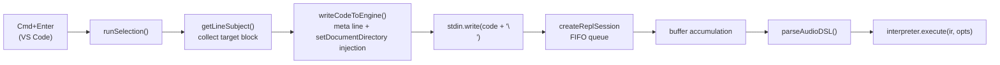
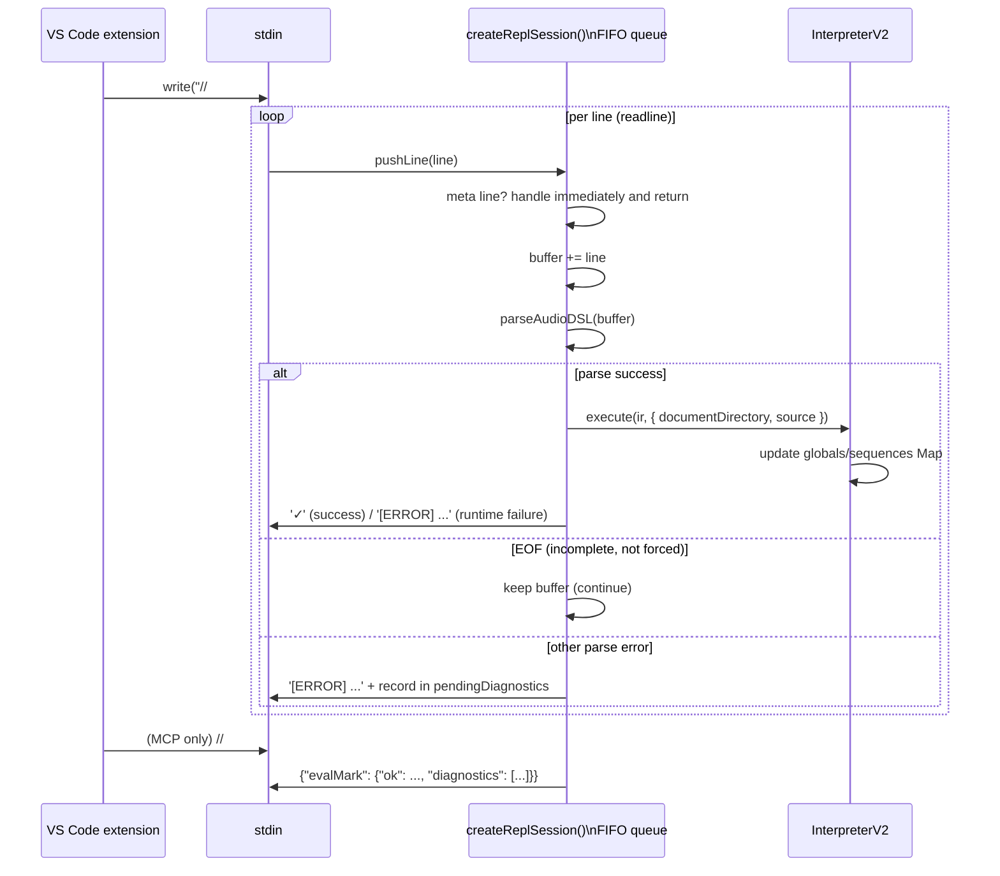

> **Note**: This page is a trace of the author's reading as of 2026-09-01. The code is the truth; this page is only a snapshot of understanding at that time.

# I-3. Selective Execution

Executing only part of the code with Cmd+Enter — this is the central operation of OrbitScore. Equivalent to the "selective evaluation" of TidalCycles, this mechanism is realized across two processes: the VS Code extension and the engine. This chapter traces, from the keystroke to the completion of execution in the engine, how the code flows.

## Drift as of 2026-09

The first edition of this chapter was written against the 2026-05-05 snapshot (0a4b598). In the code as of 2026-09-01 (69dc968), the skeleton — "the extension decides what code to send and writes it to stdin; the engine's readline buffers it and does parse → execute" — is the same, but much of the inside has been replaced.

- **Writing to stdin was centralized in `writeCodeToEngine()`**. The editor's `runSelection()` and the MCP `evaluate_orbitscore` tool go through the same function (`packages/vscode-extension/src/extension.ts:3000-3032`)
- **A `//#documentDirectory <path>` meta line is now prepended to the DSL** (#456 on 2026-07-17). Because `import` is evaluated before statements, the DSL-injected `global.setDocumentDirectory(...)` comes too late, so the directory is delivered ahead of time through an out-of-band meta line
- **REPL line handling was extracted into `createReplSession()` and serialized through a FIFO promise chain** (#476 on 2026-07-17). readline fires multiple lines from one chunk in the same tick, so a naive async handler let the shared buffer race
- **The "is the input incomplete" decision is now only `\bEOF\b` on parse errors** (#607 / #612 in 2026-08). The 2026-05 edition's `Expected RPAREN` match also treated "a genuine syntax error in the middle of a line" as incomplete and silenced the session
- **The meta-line vocabulary grew**: `//#selectAudioDevice` (#484), `//#savePluginState` (#562), `//#pluginUi` (#474), `//#evalMark` (#614). None of them is queued into the DSL buffer; each is processed immediately and answered with a one-line JSON carrying a correlation id on stdout
- **Evaluation results now return to the caller** (#614). Parse / runtime diagnostics accumulate in `pendingDiagnostics` and are returned together when `//#evalMark` is reached. The MCP `evaluate_orbitscore` waits for this before deciding `ok`
- **Spawning the engine now always sets `ORBITSCORE_ENGINE` explicitly** (#377, after the cutover). The default is the Rust daemon; the boot sequence of the `repl` subcommand is unchanged

## The Big Picture


```mermaid
flowchart LR
  key["Cmd+Enter\n(VS Code)"]
  rs["runSelection()"]
  sub["getLineSubject()\ncollect target block"]
  inj["writeCodeToEngine()\nmeta line + setDocumentDirectory injection"]
  stdin["stdin.write(code + '\\n')"]
  q["createReplSession\nFIFO queue"]
  buf["buffer accumulation"]
  parse["parseAudioDSL()"]
  exec["interpreter.execute(ir, opts)"]

  key --> rs
  rs --> sub
  sub --> inj
  inj --> stdin
  stdin --> q
  q --> buf
  buf --> parse
  parse --> exec
```

The VS Code extension side "decides what code to send," and the engine side "receives it and executes it" — a clear division of responsibility.

## Engine Boot: the repl Subcommand

First, let's confirm how the engine boots. `startEngine()` spawns a Node process with `'repl'` as an argument.

```typescript
// packages/vscode-extension/src/extension.ts:2112-2164 (env の組み立てを省略)
  // Build args
  const args = ['repl']
  if (audioDevice && audioDevice !== '__default__') {
    args.push('--audio-device', audioDevice)
  }
  if (effectiveDebugMode) {
    args.push('--debug')
  }
  // ...
  // Spawn engine process
  try {
    engineProcess = child_process.spawn('node', [enginePath, ...args], {
      cwd: workspaceRoot,
      stdio: ['pipe', 'pipe', 'pipe'],
      env,
    })
```

The point is `stdio: ['pipe', 'pipe', 'pipe']`. Because stdin, stdout, and stderr are all pipe-connected, the extension can pump code in via `engineProcess.stdin.write(...)`. The omitted part sets the backend kind explicitly on `env.ORBITSCORE_ENGINE` (see [0-2](/en/orientation/architecture-overview)). On receiving the `repl` subcommand, the engine calls `startREPLMode()`.

```typescript
// packages/engine/src/cli/repl-mode.ts:30-53
export async function startREPLMode(options: REPLOptions = {}): Promise<void> {
  console.log('🎵 OrbitScore Audio Engine')
  console.log('✅ Initialized')

  // Create a global interpreter
  const globalInterpreter = new InterpreterV2()
  // 🔴 #607: startREPLMode() は返らないので、戻り値経由では shutdown ハンドラに
  // 届かない。生成した時点で publish する（詳細は active-interpreter.ts）。
  setActiveInterpreter(globalInterpreter)

  // §L1 (#229): session-log は 2.0.0 では dormant（既定 off）。file-scoped ログが
  // 複数ファイルをまたぐライブセッションに合わない設計ミスマッチのため、session-scoped で
  // 再設計するまで明示 opt-in に退避（writer/API/ユニットは保持・resurrect 可）。
  // 詳細・redesign 北極星: docs/development/POST_2.0_ROADMAP_NOTES.md
  if (shouldEnableSessionLog()) {
    globalInterpreter.enableSessionLog({ cwd: process.cwd() })
  }

  // Boot the audio engine backend once at startup with optional audio device
  await globalInterpreter.boot(options.audioDevice)

  console.log('🎵 Live coding mode')
  await startREPL(globalInterpreter)
}
```

A single instance of `InterpreterV2` is created and lives for the whole run. Because this instance holds the entire REPL session's state (the `globals` / `sequences` Maps), the previous state is preserved across each Cmd+Enter. `setActiveInterpreter()` exists to publish the interpreter to the shutdown handlers, since this function never returns and cannot hand it over through a return value (#607).

## On the VS Code Side: Text Collection in runSelection()

The function triggered by Cmd+Enter is `runSelection()`. Let's first look at the part that decides "what to send."

### When There is a Selection

If the selected text is non-empty, its content is used as-is.

```typescript
// packages/vscode-extension/src/extension.ts:2735-2738
  if (!selection.isEmpty) {
    text = editor.document.getText(selection)
    executionRange = new vscode.Range(selection.start, selection.end)
  } else {
```

### No Selection: Subject-based Block Collection

When there is no selection, the "subject" of the cursor line is identified, and all lines that have the same subject are collected from the entire document.

The function that determines the subject is `getLineSubject()`.

```typescript
// packages/vscode-extension/src/extension.ts:2702-2715
function getLineSubject(lineText: string): string | null {
  const trimmed = lineText.trim()
  if (!trimmed || trimmed.startsWith('//')) return null

  // var <name> = init ...
  const varMatch = trimmed.match(/^var\s+(\w+)\s*=/)
  if (varMatch) return varMatch[1]

  // <name>.method(...)
  const dotMatch = trimmed.match(/^(\w+)\./)
  if (dotMatch) return dotMatch[1]

  return null
}
```

For `var kick = init global.seq` it returns `'kick'`, and for `kick.audio("kick.wav")` it likewise returns `'kick'`. As a result, all lines related to a single variable are treated as one block. `null` is returned for blank lines, comment lines, and transport commands such as `RUN()`.

When a subject is found, the entire document is scanned to collect lines that have that subject. Furthermore, lines whose parentheses are unmatched (calls that span multiple lines) keep being included until the next line (see extension.ts:2755-2769).

When the subject is `null` — that is, a stand-alone command like `RUN(kick, snare)` — only the cursor line (until its parentheses close) is collected (extension.ts:2786-2809).

### writeCodeToEngine(): Meta Line and setDocumentDirectory Injection

After the code to send is determined, `writeCodeToEngine()` tells the engine the document's directory path in two ways. It is used to resolve relative paths in `audioPath()` / `audio()` and as the base directory for `import` (IM.6).

```typescript
// packages/vscode-extension/src/extension.ts:3001-3033
function writeCodeToEngine(rawCode: string, documentDir: string | undefined): boolean {
  if (!engineProcess || !engineProcess.stdin || !engineProcess.stdin.writable) {
    // 呼び出し側ガード通過後に engine が死んだ稀な競合。黙って no-op すると
    // palette 実行では「実行したのに無反応」になるので、ここで必ず痕跡を残す。
    outputChannel?.appendLine('⚠️ Engine stdin is not writable — code was NOT sent (engine died?)')
    return false
  }
  let codeToSend = rawCode
  if (documentDir) {
    // I3 (#456): REPL メタ行で基準ディレクトリを帯域外で先渡しする。import 文（IM.2）は
    // どの statement よりも先に評価されるため、下の DSL 注入（statements として実行）では
    // 間に合わない — メタ行だけが import の基準（IM.6）を初回 eval から確定できる。
    // DSL 注入も残す（audio() 等の既存経路の実績を変えない・同値の冪等再設定）。
    codeToSend = `//#documentDirectory ${documentDir}\n` + codeToSend
    const setDirCommand = `global.setDocumentDirectory("${documentDir.replace(/\\/g, '\\\\')}")`
    const globalInitMatch = codeToSend.match(/(var\s+global\s*=\s*init\s+GLOBAL[^\n]*)/)
    if (globalInitMatch) {
      const insertPos = globalInitMatch.index! + globalInitMatch[0].length
      codeToSend =
        codeToSend.slice(0, insertPos) + '\n' + setDirCommand + codeToSend.slice(insertPos)
      globalInitialized = true
    } else if (globalInitialized) {
      codeToSend = setDirCommand + '\n' + codeToSend
    }
  }

  // Debug: log what we're sending if in debug mode (check status bar text for 🐛)
  if (statusBarItem?.text.includes('🐛')) {
    outputChannel?.appendLine(`📤 Sending: ${JSON.stringify(codeToSend)}`)
  }
  engineProcess.stdin.write(codeToSend + '\n')
  return true
}
```

The two ways, summarized:

1. **The meta line `//#documentDirectory <path>`** — always prepended. Being a `//` comment it is harmless as DSL (the tokenizer skips it), and the engine-side REPL only extracts the value
2. **The DSL injection `global.setDocumentDirectory(...)`** — conditional. If the evaluation contains `var global = init GLOBAL`, it is inserted right after the init and the `globalInitialized` flag is set; for any later evaluation it is prepended. It is not injected when `globalInitialized` is `false` and there is no `init` line (to avoid an error from `global` being undefined)

Why are two needed? Because `import` is evaluated before statements. The DSL injection runs as a statement, so at the moment `import` runs in the first evaluation, the base directory is not yet set. Only the meta line can deliver it ahead of time. The DSL injection is kept so that the proven behavior of existing paths such as `audio()` stays unchanged.

The `globalInitialized` flag is bound to the engine process lifecycle and is reset at boot, restart, and activate (extension.ts:110-112, 292, 2173).

There is no fallback to `process.cwd()` on the engine side (Issue #168). If documentDirectory is unset and a relative path is specified, an explicit error is raised.

### Sending and flash

`runSelection()` looks at the return value of `writeCodeToEngine()` and gives visual feedback only when the code was actually sent.

```typescript
// packages/vscode-extension/src/extension.ts:2874-2881
  if (!writeCodeToEngine(trimmedText, path.dirname(editor.document.uri.fsPath))) {
    return // stdin 不達（engine 死の競合）— 送れていないのに flash で「実行した」と見せない
  }
  // Scroll the executed range into view before flashing it: subject-block
  // auto-detection (no explicit selection) never reveals, so an agent-driven run
  // that lands on an off-screen line would otherwise flash outside the viewport.
  editor.revealRange(executionRange, vscode.TextEditorRevealType.InCenterIfOutsideViewport)
  flashLines()
```

`flashLines()` flashes the executed lines in the editor. In case an off-screen line is executed through the MCP `run_selection` tool, `revealRange` brings the range into the viewport before flashing.

The MCP `evaluate_orbitscore` also calls the same `writeCodeToEngine()`, but passes the first workspace folder as `documentDir` (since there is no active editor) (extension.ts:3040-3047).

## On the Engine Side: the REPL's FIFO Queue and Buffer

The code written to stdin is received by `startREPL()` on the engine side. In the 2026-05 edition all the logic lived inside `rl.on('line', async ...)`; in this edition it is extracted into `createReplSession()`.

```typescript
// packages/engine/src/cli/repl-mode.ts:519-539
export async function startREPL(interpreter: InterpreterV2): Promise<void> {
  // 🔴 #607: この関数も返らない。play/run/eval から REPL に入る経路でも publish する。
  setActiveInterpreter(interpreter)
  const rl = readline.createInterface({
    input: process.stdin,
    output: process.stdout,
    terminal: false,
  })

  const session = createReplSession(interpreter)
  rl.on('line', (line) => session.pushLine(line))

  // Keep process alive indefinitely for interactive REPL
  // This is intentional: REPL mode is designed to run continuously,
  // listening for user input on stdin until the user terminates with Ctrl+C.
  // The readline interface will continue to emit 'line' events as long as
  // the process is alive. The shutdown handlers in shutdown.ts will handle
  // graceful termination of the audio engine backend when the user exits.
  // Note: This promise never resolves, which is the expected behavior.
  await new Promise(() => {})
}
```

`readline.createInterface` reads stdin line by line. `terminal: false` indicates that this is not an interactive terminal (it is pipe input). Each line is simply handed to `session.pushLine(line)`; the `'line'` handler itself is synchronous. The trailing `new Promise(() => {})` is a Promise that never resolves, keeping the process alive so that readline keeps firing `'line'` events.

### Why serialization is needed

The design rationale of `createReplSession()` is condensed in its comment.

```typescript
// packages/engine/src/cli/repl-mode.ts:290-299
/**
 * REPL の行処理セッション（#476 で分離・単体テスト可能に）。
 *
 * 【直列化の根拠 — #476】readline は 1 チャンクの複数行を同 tick で 'line' 連発する。
 * async ハンドラは互いを待たないため、素朴な実装では共有 buffer が「実行中の execute が
 * 終わる前に後続行で伸びる → 累積 buffer の重複実行・完了時 clear との競合で行が失われる」
 * （遅い await = plugin ロードで顕在化し、エディタの複数行実行が silent に壊れる）。
 * `pushLine` は FIFO promise チェーンに積むだけで、1 行の処理（execute 完了と buffer
 * 更新まで）が終わってから次の行に進む。`idle()` はキュー drain を待つ（テスト用）。
 */
```

The extension sends a multi-line block in a single `stdin.write`. readline splits it into lines and fires `'line'` repeatedly in the same tick, so the 2026-05 edition's `async (line) => {...}` handler did not wait for its siblings, and a later line could grow `buffer` in the middle of `await interpreter.execute(ir)`. This surfaced with slow awaits such as plugin loading, and multi-line execution broke silently — that is the background of #476.

The session state is closed over in a closure.

```typescript
// packages/engine/src/cli/repl-mode.ts:300-309
export function createReplSession(interpreter: InterpreterV2): {
  pushLine: (line: string) => void
  idle: () => Promise<void>
} {
  let buffer = ''
  let emptyLineCount = 0
  // メタ行で受けた基準ディレクトリ（セッション内で最後の値が持続 — エディタ側は eval ごとに
  // 現在ファイルの dir を送るので、ファイル切替にも追従する）。
  let sessionDocumentDirectory: string | undefined
  let lineQueue: Promise<void> = Promise.resolve()
```

`pushLine()` only links the line onto the promise chain.

```typescript
// packages/engine/src/cli/repl-mode.ts:497-516
  return {
    pushLine(line: string): void {
      // handleLine は内部で全エラーを捕捉するが、防御としてチェーン自体も reject を握る
      // （1 行の異常で以後の入力が全停止しないように）。
      queuedLines++
      lineQueue = lineQueue
        .then(() => {
          queuedLines--
          return runWithStallReport(line)
        })
        .catch((e) => {
          // handleLine は既知エラーを内部で捕捉する。ここに来るのは想定外のみ —
          // 黙って握ると REPL が silent に劣化するため、必ず痕跡を残して続行する。
          console.error(`[ERROR] unexpected REPL queue failure: ${e?.message ?? e}`)
        })
    },
    idle(): Promise<void> {
      return lineQueue
    },
  }
```

`runWithStallReport()` wraps `handleLine()` and, while a single line's processing exceeds 60 seconds (a value matched to the daemon's `CHILD_READY_TIMEOUT`), repeatedly reports to stderr that "the queue is blocked" (repl-mode.ts:472-495). It does not abort — legitimately long operations such as attaching six instruments exist — so what changes is that "silently stuck" becomes "the fact that it is stuck shows up in `get_log`" (#607).

### Receiving Lines One at a Time: `handleLine()`

`handleLine()` first sorts out meta lines, then queues the rest into the DSL buffer. The tail of the DSL part is as follows.

```typescript
// packages/engine/src/cli/repl-mode.ts:457-470
    if (line.trim() === '') {
      emptyLineCount++
      buffer += '\n'
      // 2+ 連続空行 = バッファ確定・強制実行
      if (emptyLineCount >= 2 && buffer.trim()) {
        await executeCurrentBuffer(true)
        emptyLineCount = 0
      }
      return
    }
    emptyLineCount = 0
    buffer += line + '\n'
    await executeCurrentBuffer(false)
  }
```

Two or more consecutive empty lines force-execute the buffer (`clearOnIncomplete = true`); any other line is added to the buffer and then tentatively executed (`clearOnIncomplete = false`).

### try-parse and the "incomplete" decision

The body of execution is `executeCurrentBuffer()`. The key point is that parse and execute are in separate `try` blocks, and the reason is preserved in the comments.

```typescript
// packages/engine/src/cli/repl-mode.ts:333-384
  async function executeCurrentBuffer(clearOnIncomplete: boolean): Promise<void> {
    const code = buffer.trim()
    if (!code) {
      buffer = ''
      emptyLineCount = 0
      return
    }
    // 🔴 #612 レビュー: **「未完」判定はパース段のエラーにだけ適用する。**
    // 以前は parse と execute を 1 つの try で覆っていたため、`/\bEOF\b/` が
    // **実行時エラーの文言にも作用**していた。実行時エラーはユーザー由来の文字列
    // （ファイルパス・識別子・daemon のエラー echo）を含むので、たとえば
    // `kick.audio("takes/EOF.wav")` の ENOENT が「未完入力」と誤判定され、
    // **完結した行が silent に保留されてセッションが停止する** — #608 と同じ故障が
    // 別経路で再発する。パースが終わった時点で「入力が完結していない」possibility は消える。
    let ir: ReturnType<typeof parseAudioDSL>
    try {
      ir = parseAudioDSL(code)
    } catch (error: any) {
      // 不完全入力（複数行の途中）は buffering を続ける（強制実行時は除く）。
      //
      // 🔴 #607: 「未完」と判定してよいのは**パーサが入力の終端（EOF）に達した**場合だけ。
      // 旧判定は `Expected RPAREN` を文字列一致で「未完」に含めていたが、このメッセージは
      // `Expected RPAREN but got AT`（= 行の**途中**に不正トークンがある本物の構文エラー）
      // でも出る。構文エラーを「未完」として silent に保留すると、以後の全入力が未完
      // バッファへ合体して**セッション全体が沈黙のまま永久停止**する — 実機で
      // `[1,5,9]@v+10`（パーサ未対応のスタック @v）1 行がライブセッションを丸ごと
      // 止めた（2026-08-01）。トークンが尽きたのでなければ、待っても文は完結しない。
      if (!clearOnIncomplete && /\bEOF\b/.test(String(error.message ?? ''))) {
        return
      }
      console.error(`[ERROR] ${error.message}`)
      pendingDiagnostics.push({ kind: 'parse', message: String(error.message) })
      buffer = ''
      return
    }

    // ここから先は「入力は完結している」— 失敗しても保留せず必ず報告してバッファを捨てる。
    try {
      const metaDir = extractDocumentDirectoryMeta(code)
      if (metaDir) sessionDocumentDirectory = metaDir
      await interpreter.execute(ir, {
        source: code,
        evalSource: 'human',
        documentDirectory: sessionDocumentDirectory,
      }) // §L1
      console.log('✓') // Success indicator
    } catch (error: any) {
      console.error(`[ERROR] ${error.message}`)
      pendingDiagnostics.push({ kind: 'runtime', message: String(error.message) })
    }
    buffer = ''
  }
```

The flow, summarized:

- **Parse success** → update the base directory from the meta line, call `interpreter.execute(ir, {...})`, print `✓`, clear the buffer
- **Parse failure (message contains `EOF`, and not a forced execution)** → keep the buffer and wait for the next line
- **Parse failure (other)** → print `[ERROR]`, record it in `pendingDiagnostics` as `parse`, clear the buffer
- **Execute failure** → print `[ERROR]`, record it as `runtime`, clear the buffer (never held back)

The `EOF` error refers to the `"Expected X but got EOF at line Y, column Z"` thrown by `ParserUtils.expect()` that we saw in [I-1](/en/pipeline/text-to-ast). For multi-line calls (like `play(\n  1, 2, 3\n)`), this buffering continues until the closing parenthesis arrives.

What is interesting is the history behind narrowing the decision to `EOF` only. The 2026-05 edition also treated `Expected RPAREN` as incomplete, but that string also matches "a genuine syntax error in the middle of a line," such as `Expected RPAREN but got AT`. If a syntax error is held as incomplete, all subsequent input merges into the incomplete buffer and the session halts in silence — the comment records that a single line of `[1,5,9]@v+10` stopped an entire live session on a real machine (2026-08-01). Unless the tokens ran out, no amount of waiting will complete the statement.

By the same logic, the `EOF` decision must not apply to runtime errors. The ENOENT from `kick.audio("takes/EOF.wav")` being treated as incomplete is the failure scenario pointed out in the #612 review.

### Meta lines: the out-of-band channel

`extractDocumentDirectoryMeta()` is what pulls `//#documentDirectory` out of the DSL.

```typescript
// packages/engine/src/cli/repl-mode.ts:64-79
/**
 * REPL メタ行 `//#documentDirectory <path>`（I3, #456）: エディタ統合（VS Code 拡張）が
 * 「開いているファイルのディレクトリ」を eval 単位で伝えるための帯域外チャネル。DSL 注入
 * （`global.setDocumentDirectory(...)`）は statements として import より後に評価されるため、
 * import の基準ディレクトリ（IM.6）はこのメタ行でしか先渡しできない。`//` コメントなので
 * DSL としても無害（tokenizer が読み飛ばす）— 戻り値では code から取り除かず、値だけ抽出する。
 * 複数あれば最後の値が勝つ。
 */
export function extractDocumentDirectoryMeta(code: string): string | undefined {
  let dir: string | undefined
  for (const line of code.split('\n')) {
    const m = line.match(/^\s*\/\/#documentDirectory\s+(.+?)\s*$/)
    if (m) dir = m[1]
  }
  return dir
}
```

The other meta lines (`//#selectAudioDevice` / `//#savePluginState` / `//#pluginUi` / `//#evalMark`) are each handled at the top of `handleLine()` and never queued into the DSL buffer. All of them start with `//`, so even if one were evaluated as DSL the tokenizer would skip it as a comment — a fail-safe design.

### `//#evalMark`: returning the evaluation result

`//#evalMark <json>` is a submission boundary meaning "that is all the input; return the result." Because the REPL processes lines in FIFO order, by the time this marker is reached the evaluation of the preceding code is complete.

```typescript
// packages/engine/src/cli/repl-mode.ts:402-424
    if (EVAL_MARK_META_RE.test(line)) {
      // 🔴 マーカーは「投入は以上、結果を返せ」という**提出の境界**である。
      // 未完のままバッファに残った入力を放置すると「何も実行していないのに ok」を返して
      // しまう（#614 の実害そのもの）。空行2連と同じく強制実行してから報告する。
      if (buffer.trim()) {
        await executeCurrentBuffer(true)
        emptyLineCount = 0
      }
      // ここまでで先行コードの評価は完了している（FIFO）。溜まった診断を返して空にする。
      const requestId = recoverMetaRequestId(line)
      const diagnostics = pendingDiagnostics
      pendingDiagnostics = []
      if (requestId) {
        console.log(
          JSON.stringify({
            evalMark: { requestId, ok: diagnostics.length === 0, diagnostics },
          }),
        )
      } else {
        console.error('[ERROR] //#evalMark requires a non-empty string requestId')
      }
      return
    }
```

The MCP `evaluate_orbitscore` sends this marker right after writing the code and waits for the `{"evalMark": {...}}` line before deciding `ok` (extension.ts:3048-3075). Before #614 it returned `ok: true` as soon as the code "reached stdin," so an agent would move on even while `Variable not found: global` was being printed. The editor's `runSelection()` does not send this marker — a human reads the `[ERROR]` in the Output panel.

## State Preservation: Map Identity

The reason the state persists no matter how many times Cmd+Enter is pressed is that there is only one `InterpreterV2` instance. The `globalInterpreter` created in `startREPLMode()` is passed to `startREPL()`, captured in the closure of `createReplSession()`, and the same reference keeps being used afterward.

As explained in [I-2](/en/pipeline/evaluation), `globals` and `sequences` are `Map`s, with entries managed by variable name as the key. Each re-evaluation with the same variable name finds the existing instance via `Map.get()` and reuses it without creating a new one. Only the `_gainDb` / `_pan` of the sequence are reset; other parameters (such as the connected audio file and tempo) remain intact.


```mermaid
sequenceDiagram
  participant VSCode as VS Code extension
  participant stdin
  participant Q as createReplSession()\nFIFO queue
  participant Interp as InterpreterV2

  VSCode->>stdin: write("//#documentDirectory ...\n" + code + "\n")
  loop per line (readline)
    stdin->>Q: pushLine(line)
    Q->>Q: meta line? handle immediately and return
    Q->>Q: buffer += line
    Q->>Q: parseAudioDSL(buffer)
    alt parse success
      Q->>Interp: execute(ir, { documentDirectory, source })
      Interp->>Interp: update globals/sequences Map
      Q->>stdin: '✓' (success) / '[ERROR] ...' (runtime failure)
    else EOF (incomplete, not forced)
      Q->>Q: keep buffer (continue)
    else other parse error
      Q->>stdin: '[ERROR] ...' + record in pendingDiagnostics
    end
  end
  VSCode->>stdin: (MCP only) //#evalMark {"requestId": ...}
  Q->>stdin: {"evalMark": {"ok": ..., "diagnostics": [...]}}
```

## Related Terms

- [subject-based block evaluation](/en/glossary#subject-based-block-evaluation) — the selective execution strategy that collects a block from the subject of the cursor line
- [setDocumentDirectory](/en/glossary#setdocumentdirectory) — the injection process that aligns the working directory with the document's path before execution
- [DSL](/en/glossary#dsl) — the domain-specific language defined by OrbitScore. Sent to the REPL and evaluated
- [flashLines()](/en/glossary#flashlines) — the VS Code extension's visual feedback function that briefly highlights the executed block

## Next Exploration Candidates

- An exhaustive look at cases where `getLineSubject()` returns null — handling of comments, blank lines, and multi-word lines
- Details of the parenthesis balance tracking logic (the `parenBalance` counter) and the handling of parentheses inside string literals
- Implementation details of `flashLines()` — the configuration items `flashCount` / `flashDuration` / `flashColor` and the reason for whole-line painting (#388)
- The design of the meta-line bridges — how `DeviceSwitchBridge` / `PluginStateBridge` / `PluginUiBridge` / `EvalMarkBridge` correlate responses by requestId, and the drain on engine death
- The correspondence between the 60-second threshold of `runWithStallReport()` and the daemon's `CHILD_READY_TIMEOUT`
- The handling of the `setDocumentDirectory` method on the `Global` class side, and the base-directory restoration in the `finally` of `process-file-import.ts`
- The stdout receiver on the extension side — how `applyEngineStdoutChunk()` in `engine-lifecycle.ts` classifies `✓` / `[ERROR]` / playhead lines and rejects output from stale processes (#528)
- How to use detailed logs via the `ORBITSCORE_DEBUG` environment variable

## Sources

- `packages/vscode-extension/src/extension.ts:110-112` — declaration and purpose of the `globalInitialized` flag
- `packages/vscode-extension/src/extension.ts:2044-2198` — `startEngine()`: pre-check → env → process boot with `stdio: ['pipe','pipe','pipe']`
- `packages/vscode-extension/src/extension.ts:2701-2714` — regex matches in `getLineSubject()`
- `packages/vscode-extension/src/extension.ts:2716-2881` — overall flow of `runSelection()` (selection / subject block / standalone / flash)
- `packages/vscode-extension/src/extension.ts:2734-2737` — the path used when there is selected text
- `packages/vscode-extension/src/extension.ts:2883-2907` — design comment of `writeCodeToEngine()` (injection conditions and the meaning of the return value)
- `packages/vscode-extension/src/extension.ts:3000-3032` — `writeCodeToEngine()`: meta line + `setDocumentDirectory` injection and `stdin.write`
- `packages/vscode-extension/src/extension.ts:3040-3075` — `evaluateForAgent()`: MCP evaluate waits for the result via `//#evalMark`
- `packages/engine/src/cli/repl-mode.ts:30-53` — `startREPLMode()` and `InterpreterV2` instance creation
- `packages/engine/src/cli/repl-mode.ts:64-93` — `extractDocumentDirectoryMeta()` / `extractSelectAudioDeviceMeta()`
- `packages/engine/src/cli/repl-mode.ts:290-331` — design comment of `createReplSession()` and its closure state (including `pendingDiagnostics`)
- `packages/engine/src/cli/repl-mode.ts:333-384` — `executeCurrentBuffer()`: separation of parse / execute and the `EOF` decision
- `packages/engine/src/cli/repl-mode.ts:386-470` — `handleLine()`: meta-line dispatch and the DSL buffer
- `packages/engine/src/cli/repl-mode.ts:472-516` — `runWithStallReport()` and the FIFO chain in `pushLine()`
- `packages/engine/src/cli/repl-mode.ts:519-539` — `startREPL()`: readline → `pushLine` and `await new Promise(() => {})`
- `docs/development/WORK_LOG.md` §6.266 (meta line #456, 2026-07-17), §6.271 (FIFO serialization #476, 2026-07-17)
