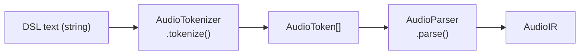
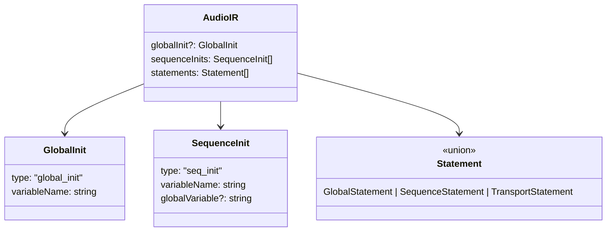

> **Note**: This page is a trace of the author's reading as of 2026-05-05. The code is the truth; this page is merely a snapshot of understanding at that point in time.

# I-1. Text to AST

The first gateway between DSL text and actual execution is "parsing." Rather than executing the text directly, it is first converted into structured data (an AST) and then evaluated. This chapter traces, with `parseAudioDSL()` as the entry point, how the two steps of lexical analysis and syntactic analysis collaborate.

## The Pipeline at a Glance

The processing from text to AST is broadly divided into two stages.



The entry point is the `parseAudioDSL()` function, a simple piece of code that just calls these two stages in order.

```typescript
// audio-parser.ts:88-93
export function parseAudioDSL(source: string): AudioIR {
  const tokenizer = new AudioTokenizer(source)
  const tokens = tokenizer.tokenize()
  const parser = new AudioParser(tokens)
  return parser.parse()
}
```

Two classes appear in sequence: `AudioTokenizer` and `AudioParser`. Let's look at the responsibilities of each.

## Lexical Analysis: AudioTokenizer

Lexical analysis is the process of slicing a sequence of characters into "meaningful chunks" — tokens. `AudioTokenizer` plays this role.

### Token Kinds

The DSL defines 18 token types.

```typescript
// types.ts:7-26
export type AudioTokenType =
  | 'VAR' // var keyword
  | 'INIT' // init keyword
  | 'BY' // by keyword (for meter)
  | 'GLOBAL' // GLOBAL constant
  | 'RUN' // RUN reserved keyword
  | 'LOOP' // LOOP reserved keyword
  | 'MUTE' // MUTE reserved keyword
  | 'IDENTIFIER' // variable names, method names
  | 'NUMBER' // numeric values
  | 'STRING' // string literals
  | 'DOT' // . (method call)
  | 'LPAREN' // (
  | 'RPAREN' // )
  | 'COMMA' // ,
  | 'EQUALS' // =
  | 'MINUS' // - (for negative numbers)
  | 'PERCENT' // % (for random range)
  | 'NEWLINE' // line break
  | 'EOF' // end of file
```

Keywords such as `VAR`, `INIT`, `GLOBAL`, `RUN`, `LOOP`, and `MUTE` are distinguished from `IDENTIFIER` (general identifier) and have dedicated types. `IDENTIFIER` is used for all non-reserved names, including variable names and method names.

Each token carries not only a type but also positional information from the source.

```typescript
// types.ts:28-33
export type AudioToken = {
  type: AudioTokenType
  value: string
  line: number
  column: number
}
```

The reason `line` and `column` are attached is to accurately report to the user "at what line and column the problem occurred" when a syntax error is later raised.

### Keyword Recognition

When `AudioTokenizer` reads through the characters and finds a string starting with a letter, it reads it as an identifier. It then checks whether it is a reserved keyword by looking it up in the `KEYWORDS` Set.

```typescript
// tokenizer.ts:17-27
  // Keywords that should be recognized
  private static readonly KEYWORDS = new Set([
    'var',
    'init',
    'by',
    'GLOBAL',
    'force',
    'RUN',
    'LOOP',
    'MUTE',
  ])
```

Set lookups are `O(1)`, so the speed does not change as the number of keywords grows. Reading the implementation reveals an unexpectedly simple mechanism.

### Single-Pass Scan

The `tokenize()` method reads the input string one character at a time and generates all tokens in a single pass.

```typescript
// tokenizer.ts:111-135
  public tokenize(): AudioToken[] {
    const tokens: AudioToken[] = []

    while (!this.isEOF()) {
      this.skipWhitespace()
      this.skipComment()

      if (this.isEOF()) break

      const line = this.line
      const column = this.column
      const char = this.peek()

      // Newline
      if (char === '\n') {
        tokens.push({ type: 'NEWLINE', value: '\n', line, column })
        this.advance()
        continue
      }

      // Numbers
      if (/[0-9]/.test(char)) {
        const num = this.readNumber()
        tokens.push({ type: 'NUMBER', value: num, line, column })
        continue
```

The point is that `const line = this.line / const column = this.column` is captured before each token is pushed. This reliably records the token's "start position." Also, `skipWhitespace()` and `skipComment()` are called at the start of each iteration to skip whitespace and `//` comments before the main processing.

Note that `NEWLINE` is preserved as a token rather than skipped. In the DSL, line breaks have meaning as statement separators, so they are kept so that the downstream parser can explicitly skip them via `skipNewlines()`.

## Syntactic Analysis: AudioParser and AudioIR

Once the token sequence is ready, the next step is syntactic analysis. `AudioParser.parse()` reads the token sequence and assembles it into an `AudioIR`.

### What is AudioIR

AudioIR (Audio Intermediate Representation) is the structure that holds the result of parsing the DSL text.

```typescript
// types.ts:36-40
export type AudioIR = {
  globalInit?: GlobalInit
  sequenceInits: SequenceInit[]
  statements: Statement[]
}
```

The meanings of the three fields, summarized:

| Field | Meaning | Example |
|---|---|---|
| `globalInit?` | The `var global = init GLOBAL` declaration (optional) | `{ type: 'global_init', variableName: 'global' }` |
| `sequenceInits[]` | An array of `var seq1 = init global.seq` declarations | `[{ type: 'seq_init', variableName: 'seq1', ... }]` |
| `statements[]` | Tempo settings, playback, transport commands, etc. | `[{ type: 'sequence', target: 'seq1', method: 'play', ... }]` |



### AudioParser is a Thin Wrapper

The `AudioParser` class itself is marked `@deprecated` and described as "a thin wrapper around the parser modules." The actual syntactic analysis is handled by the `StatementParser` class.

The processing of `parse()` is just to read the token sequence from the start, repeatedly call `StatementParser`, and dispatch the returned statement to the appropriate field of `globalInit` / `sequenceInits` / `statements` (see audio-parser.ts:51-82).

### StatementParser: Identifying Statements

Now let's look inside `StatementParser.parseStatement()`.

```typescript
// parse-statement.ts:25-47
  parseStatement(): { statement: any; newPos: number } {
    const token = ParserUtils.current(this.tokens, this.pos)

    // Variable declaration: var x = init GLOBAL
    if (token.type === 'VAR') {
      return this.parseVarDeclaration()
    }

    // Reserved keywords: RUN(), LOOP(), MUTE()
    if (token.type === 'RUN' || token.type === 'LOOP' || token.type === 'MUTE') {
      return this.parseReservedKeyword()
    }

    // Method calls: global.tempo(140) or seq1.play(0)
    if (token.type === 'IDENTIFIER') {
      return this.parseMethodCall()
    }

    // Skip unknown tokens
    const advanceResult = ParserUtils.advance(this.tokens, this.pos)
    this.pos = advanceResult.newPos
    return { statement: null, newPos: this.pos }
  }
```

Dispatch happens by the kind of the leading token. `VAR` means a variable declaration, `RUN` / `LOOP` / `MUTE` mean a transport command, and `IDENTIFIER` means a method call (a tempo setting or playback instruction).

### The Parser Does Not Distinguish global from sequence

What is interesting is that when parsing a statement of the form `<identifier>.method(args)`, **the parser always returns `type: 'sequence'`**.

```typescript
// parse-statement.ts:245-253
    // Note: We cannot determine if target is global or sequence at parse time
    // since variable names are arbitrary. Use 'sequence' type and let the interpreter
    // determine the actual type by checking state.globals and state.sequences.
    const result: any = {
      type: 'sequence',
      target,
      method,
      args: argsResult.args,
    }
```

As the comment in the code explains, at parse time there is no way to determine whether a variable name refers to a global or a sequence. Both `global.tempo(140)` and `seq1.play(0)` are, from the parser's perspective, the same pattern of `IDENTIFIER.IDENTIFIER(...)`. Determining which it belongs to is the interpreter's job, and is only known at runtime by referring to state (`state.globals` / `state.sequences`). The mechanism for this decision is covered in detail in [I-2. AST Evaluation Model](/en/pipeline/evaluation).

## Error Position Information: ParserUtils.expect()

The role of `ParserUtils.expect()` is to tell the user where the problem occurred when parsing fails.

```typescript
// parser-utils.ts:45-57
  static expect(
    tokens: AudioToken[],
    pos: number,
    type: AudioTokenType,
  ): { token: AudioToken; newPos: number } {
    const token = ParserUtils.current(tokens, pos)
    if (token.type !== type) {
      throw new Error(
        `Expected ${type} but got ${token.type} at line ${token.line}, column ${token.column}`,
      )
    }
    return ParserUtils.advance(tokens, pos)
  }
```

This is why `line` / `column` are embedded in `AudioToken`. When a syntax error occurs, a message like "Expected RPAREN but got EOF at line 3, column 12" is produced. The strings `'EOF'` and `'Expected RPAREN'` also play an important role in the downstream REPL buffering process. Details are covered in [I-3. Selective Execution](/en/pipeline/selective-execution).

## Summary: Separation of Responsibilities in the Pipeline

To summarize what we have seen in this chapter:

- `AudioTokenizer` — converts a string to `AudioToken[]`. Responsible for recording position information
- `AudioParser` / `StatementParser` — converts a token sequence to `AudioIR`. Identifies and dispatches statement kinds
- `AudioIR` — an intermediate representation with the three fields `globalInit`, `sequenceInits`, and `statements`
- The parser does not distinguish global from sequence — the interpreter decides at runtime

This intermediate representation is passed to the interpreter in the next chapter.

## Related Terms

- [DSL](/en/glossary#dsl) — the domain-specific language defined by OrbitScore. The target of parsing in this chapter
- [Single Source of Truth (SoT)](/en/glossary#sot-single-source-of-truth) — the principle that the DSL specification document (`INSTRUCTION_ORBITSCORE_DSL.md`) takes precedence over code
- [init](/en/glossary#init) — the `init global` / `init sequenceName` syntax. A DSL keyword for variable declarations
- [global](/en/glossary#global) — an identifier representing the global scope. The parser does not distinguish it but records it in the AST
- [Underscore Prefix Pattern](/en/glossary#underscore-prefix-pattern) — the toggle notation introduced in v3.0 (`_sequenceName`). Identified by the tokenizer
- [sequence (legacy keyword)](/en/glossary#sequence-legacy-keyword) — the `sequence` declaration keyword used in v1.0. Now unified to `init`

## Related ADRs

- [ADR-002 DSL v3 Pivot](/en/decisions/adr-002-dsl-v3-pivot) — the decision behind syntax changes from v1.0/v2.0 to v3.0. Background of the `sequence` → `init` migration

## Next Exploration Candidates

- Details of the regular expressions used inside `AudioTokenizer` (summarize the entire tokenize loop in tabular form)
- Numeric literal reading (`readNumber()`) and the special handling of `-Infinity` / `-inf`
- All branches of `parseVarDeclaration()` — the distinction between `init GLOBAL` and `init global.seq`
- The structure of method chaining (`.audio(...).chop(...)` etc.) via `parseMethodChain()`
- Argument analysis in `ExpressionParser` — the details of `beat(n by m)` and the random `r` / `rN%M` syntax
- Error recovery strategy — currently throws immediately on error; room to consider stack rewinding

## Sources

- `packages/engine/src/parser/types.ts:7-26` — the definition of all 18 `AudioTokenType` variants
- `packages/engine/src/parser/types.ts:28-33` — `AudioToken` (token with positional info)
- `packages/engine/src/parser/types.ts:36-40` — `AudioIR` (intermediate representation of parse results)
- `packages/engine/src/parser/types.ts:53` — `Statement` union type definition
- `packages/engine/src/parser/tokenizer.ts:11-27` — the `AudioTokenizer` class and `KEYWORDS` Set
- `packages/engine/src/parser/tokenizer.ts:111-135` — the start of the `tokenize()` main loop
- `packages/engine/src/parser/audio-parser.ts:51-83` — the loop and dispatch in `AudioParser.parse()`
- `packages/engine/src/parser/audio-parser.ts:88-93` — the `parseAudioDSL()` entry function
- `packages/engine/src/parser/parse-statement.ts:25-47` — `parseStatement()` dispatch
- `packages/engine/src/parser/parse-statement.ts:245-253` — design that always returns `type: 'sequence'`, with the explanatory comment
- `packages/engine/src/parser/parser-utils.ts:45-57` — error position reporting via `expect()`
