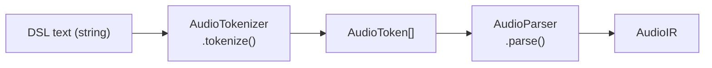
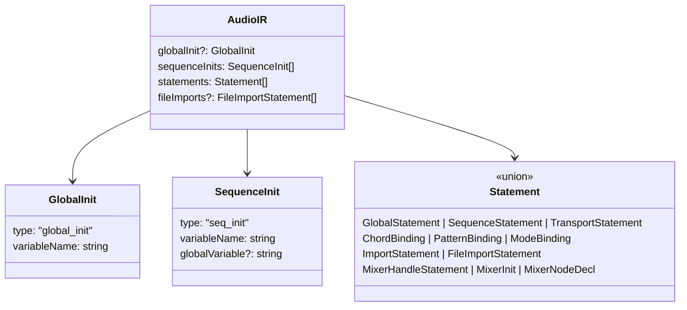

> **Note**: This page is a trace of the author's reading as of 2026-09-01, brought up to #668 PR-E4 (the public `KEYWORDS` and `dsl-surface.ts`) on 2026-09-04. The code is the truth; this page is only a snapshot of understanding at that time.

# I-1. Text to AST

The first gateway between DSL text and actual execution is "parsing." Rather than executing the text directly, it is first converted into structured data (an AST) and then evaluated. This chapter traces, with `parseAudioDSL()` as the entry point, how the two steps of lexical analysis and syntactic analysis collaborate.

## Drift as of 2026-09

The first edition of this chapter was written against the 2026-05-05 snapshot (0a4b598). Compared with the code as of 2026-09-01 (69dc968), the skeleton of the pipeline (tokenizer → `StatementParser` → `AudioIR`) is unchanged, but the vocabulary has grown considerably. Since this chapter reads that skeleton, the new vocabulary is only enumerated below, and each item is left to the exploration candidates at the end.

- **Token kinds grew from 19 to 32**: `ACCIDENTAL` / `CARET` / `TILDE` / `AT` / `PLUS` for the pitch DSL, `LBRACKET` / `RBRACKET` for stacks, `LBRACE` / `RBRACE` for legato, `UNDERSCORE` for ties, `IMPORT` / `ASTERISK` for `import`, and `COLON` for named arguments (`packages/engine/src/parser/types.ts:7-39`). The first edition's "18 kinds" was a miscount; the listing at the time already had 19
- **`KEYWORDS` gained `import`** (`packages/engine/src/parser/tokenizer.ts:17-28`). In #668 PR-E4 it also went from a private static to a public static typed `ReadonlySet<string>`, with a view exported from the module for cross-checking (`tokenizer.ts:288-289`)
- **`dsl-surface.ts` was added** (#668 PR-E4, `packages/engine/src/parser/dsl-surface.ts:1-35`). It is the canonical enumeration, as ids, of the 13 syntax surfaces that are not shaped like a method call; the parser never reads it, the E2E ratchet does
- **`AudioIR` gained `fileImports?`** (#456 on 2026-07-17, `types.ts:49-59`). `import { kick } from "./drums.orbs"` is held in a bucket separate from statements, and the interpreter processes it before `globalInit`
- **The `Statement` union grew from 3 to 11 members** (`types.ts:72-83`): `ChordBinding` / `PatternBinding` / `ModeBinding` (pitch-DSL bindings such as `var m7 = [...]`), `ImportStatement` / `FileImportStatement`, and `MixerHandleStatement` / `MixerInit` / `MixerNodeDecl` (Signal Chain DSL, #517 S1)
- **`parseStatement()` gained an `IMPORT` branch**, and `parseVarDeclaration()` now discriminates the kind of declaration by the first token of the right-hand side (`[`, `(`, `mode(`, `<id>.output|sum|aux`) (`parse-statement.ts:58-85`, `108-149`)
- **`AudioParser.parse()` enforces IM.1, "imports only in the file's head region"** (`audio-parser.ts:74-109`)
- **`GlobalStatement` / `SequenceStatement` / `MethodChain` gained `invocation?: 'bare' | 'call'`**, so the interpreter can tell `.drums` (no parentheses) from `.TALReverb4()` (with parentheses) (`types.ts:252-274`)
- **`collapseScopedRun()` was extracted into `parse-expression.ts`**. The rule that folds a pitch-scope chain onto a run of juxtaposed groups such as `(A)(B).root(X)` is shared by both the statement-level and the nested-level parse loops

```typescript
// packages/engine/src/parser/parse-expression.ts:71-78
export function collapseScopedRun(list: PlayElement[], runStart: number): void {
  const lastIdx = list.length - 1
  const last = list[lastIdx]
  if (last && typeof last === 'object' && last.type === 'scoped' && runStart < lastIdx) {
    const preceding = list.splice(runStart, lastIdx - runStart)
    last.groups = [...preceding, ...last.groups]
  }
}
```

## The Pipeline at a Glance

The processing from text to AST is broadly divided into two stages.


```mermaid
flowchart LR
  src["DSL text (string)"]
  tok["AudioTokenizer\n.tokenize()"]
  tokens["AudioToken[]"]
  parser["AudioParser\n.parse()"]
  ir["AudioIR"]

  src --> tok --> tokens --> parser --> ir
```

The entry point is the `parseAudioDSL()` function, a simple piece of code that just calls these two stages in order.

```typescript
// packages/engine/src/parser/audio-parser.ts:121-126
export function parseAudioDSL(source: string): AudioIR {
  const tokenizer = new AudioTokenizer(source)
  const tokens = tokenizer.tokenize()
  const parser = new AudioParser(tokens)
  return parser.parse()
}
```

Two classes appear in sequence: `AudioTokenizer` and `AudioParser`. Let's look at the responsibilities of each.

## Lexical Analysis: AudioTokenizer

Lexical analysis is the process of slicing a sequence of characters into "meaningful chunks" — tokens. `AudioTokenizer` plays this role.

### Token Kinds

The DSL defines 32 token types.

```typescript
// packages/engine/src/parser/types.ts:7-39
export type AudioTokenType =
  | 'VAR' // var keyword
  | 'INIT' // init keyword
  | 'BY' // by keyword (for meter)
  | 'GLOBAL' // GLOBAL constant
  | 'RUN' // RUN reserved keyword
  | 'LOOP' // LOOP reserved keyword
  | 'MUTE' // MUTE reserved keyword
  | 'IMPORT' // import keyword (e.g. `import chords`, §6)
  | 'IDENTIFIER' // variable names, method names
  | 'NUMBER' // numeric values
  | 'STRING' // string literals
  | 'DOT' // . (method call)
  | 'LPAREN' // (
  | 'RPAREN' // )
  | 'COMMA' // ,
  | 'EQUALS' // =
  | 'MINUS' // - (for negative numbers)
  | 'PLUS' // + (for octave shift / detune sign, e.g. 3^+1)
  | 'PERCENT' // % (for random range)
  | 'ASTERISK' // * (for x*n repetition §6.5 / `import * from` SC.2.2)
  | 'COLON' // : (named argument separator, SC.3)
  | 'ACCIDENTAL' // pitch alteration prefix: b, bb, #, ## (degree b/# notation)
  | 'CARET' // ^ (octave shift modifier, e.g. 3^+1)
  | 'TILDE' // ~ (detune modifier, e.g. b7~-0.25)
  | 'AT' // @ (expression modifier: @v velocity / @g articulation, §10.3 E5)
  | 'LBRACKET' // [ (stack — reserved, not yet supported in v1.1)
  | 'RBRACKET' // ] (stack — reserved, not yet supported in v1.1)
  | 'LBRACE' // { (legato group, §4/§5.4)
  | 'RBRACE' // } (legato group, §4/§5.4)
  | 'UNDERSCORE' // _ (tie token: §5.1 event tie / §5.2 voice-tie prefix)
  | 'NEWLINE' // line break
  | 'EOF' // end of file
```

Keywords such as `VAR`, `INIT`, `GLOBAL`, `RUN`, `LOOP`, `MUTE`, and `IMPORT` are distinguished from `IDENTIFIER` (general identifier) and have dedicated types. `IDENTIFIER` is used for all non-reserved names, including variable names and method names. The symbol tokens from `ACCIDENTAL` onward exist for the pitch DSL (`b3`, `3^+1`, `[1, 3, 5]`) and never appear in an audio sequence's `play()`.

Each token carries not only a type but also positional information from the source.

```typescript
// packages/engine/src/parser/types.ts:41-46
export type AudioToken = {
  type: AudioTokenType
  value: string
  line: number
  column: number
}
```

The reason `line` and `column` are attached is to accurately report to the user "at what line and column the problem occurred" when a syntax error is later raised.

### Keyword Recognition

When `AudioTokenizer` reads through the characters and finds a string starting with a letter, it reads it as an identifier. It then checks whether it is a reserved keyword by looking it up in the `KEYWORDS` Set.

```typescript
// packages/engine/src/parser/tokenizer.ts:17-28
  // Keywords that should be recognized
  static readonly KEYWORDS: ReadonlySet<string> = new Set([
    'var',
    'init',
    'by',
    'GLOBAL',
    'force',
    'RUN',
    'LOOP',
    'MUTE',
    'import',
  ])
```

Set lookups are `O(1)`, so the speed does not change as the number of keywords grows. Reading the implementation reveals an unexpectedly simple mechanism.

`KEYWORDS` was originally a private static. In #668 PR-E4 it became a public static typed `ReadonlySet<string>`, with a view exported at the end of the module for cross-checking.

```typescript
// packages/engine/src/parser/tokenizer.ts:288-289
/** パーサの構文表面と tokenizer の予約語を照合するための公開 view。 */
export const KEYWORDS = AudioTokenizer.KEYWORDS
```

Who reads it? `dsl-surface.ts`, placed in the same `parser/` directory. It enumerates, as ids, the **DSL surfaces that are not shaped like a method call** — `var g = init GLOBAL`, `RUN(x)`, `n by 4`, `1@v+10` and so on — and each id carries a comment naming which tokenizer / parse-statement branch it corresponds to.

```typescript
// packages/engine/src/parser/dsl-surface.ts:1-8
/**
 * パーサが受理する「メソッド呼び出しでない」DSL 表面。
 * tokenizer / parse-statement の分岐と 1:1 に保つ。
 */
export type DslSyntaxId =
  | 'var-init-global' // var g = init GLOBAL              tokenizer.ts:19-20, parse-statement.ts:62
  | 'var-init-seq' // var s = init global.seq          parse-statement.ts:385
  | 'import' // import { x } from "./a.orbs"     tokenizer.ts:27, parse-statement.ts:67
```

This list is not used when the parser runs. It is the canonical source for a real-device E2E ratchet that detects "a reserved word was added without mapping it to a syntax surface" and "a syntax surface was added without an E2E" (see [IV-3](/en/editor/mcp-and-gated-e2e) for the details). Seen from the parser side, it means one more promise: **when you add a branch, add a line here too**.

### Single-Pass Scan

The `tokenize()` method reads the input string one character at a time and generates all tokens in a single pass.

```typescript
// packages/engine/src/parser/tokenizer.ts:135-159
  public tokenize(): AudioToken[] {
    const tokens: AudioToken[] = []

    while (!this.isEOF()) {
      this.skipWhitespace()
      this.skipComment()

      if (this.isEOF()) break

      const line = this.line
      const column = this.column
      const char = this.peek()

      // Newline
      if (char === '\n') {
        tokens.push({ type: 'NEWLINE', value: '\n', line, column })
        this.advance()
        continue
      }

      // Numbers
      if (/[0-9]/.test(char)) {
        const num = this.readNumber()
        tokens.push({ type: 'NUMBER', value: num, line, column })
        continue
```

The point is that `const line = this.line / const column = this.column` is captured before each token is pushed. This reliably records the token's "start position." Also, `skipWhitespace()` and `skipComment()` are called at the start of each iteration to skip whitespace and `//` comments before the main processing.

Note that `NEWLINE` is preserved as a token rather than skipped. In the DSL, line breaks have meaning as statement separators, so they are kept so that the downstream parser can explicitly skip them via `skipNewlines()`.

## Syntactic Analysis: AudioParser and AudioIR

Once the token sequence is ready, the next step is syntactic analysis. `AudioParser.parse()` reads the token sequence and assembles it into an `AudioIR`.

### What is AudioIR

AudioIR (Audio Intermediate Representation) is the structure that holds the result of parsing the DSL text.

```typescript
// packages/engine/src/parser/types.ts:49-59
export type AudioIR = {
  globalInit?: GlobalInit
  sequenceInits: SequenceInit[]
  statements: Statement[]
  /**
   * ファイル import（IM.1-IM.2, #456）。評価順序の規範（imports が entry 自身の宣言より
   * 先・ソース記載順）を守るため statements とは別バケットで保持し、interpreter が
   * globalInit より前に処理する。ファイル先頭領域のみ（AudioParser.parse が検査）。
   */
  fileImports?: FileImportStatement[]
}
```

The meanings of the four fields, summarized:

| Field | Meaning | Example |
|---|---|---|
| `globalInit?` | The `var global = init GLOBAL` declaration (optional) | `{ type: 'global_init', variableName: 'global' }` |
| `sequenceInits[]` | An array of `var seq1 = init global.seq` declarations | `[{ type: 'seq_init', variableName: 'seq1', ... }]` |
| `statements[]` | Tempo settings, playback, transport commands, the various bindings, etc. | `[{ type: 'sequence', target: 'seq1', method: 'play', ... }]` |
| `fileImports?[]` | An array of `import { ... } from "./x.orbs"` (head region of the file only) | `[{ type: 'file_import', names: ['kick'], path: './drums.orbs' }]` |


```mermaid
classDiagram
  class AudioIR {
    globalInit?: GlobalInit
    sequenceInits: SequenceInit[]
    statements: Statement[]
    fileImports?: FileImportStatement[]
  }
  class GlobalInit {
    type: "global_init"
    variableName: string
  }
  class SequenceInit {
    type: "seq_init"
    variableName: string
    globalVariable?: string
  }
  class Statement {
    <<union>>
    GlobalStatement | SequenceStatement | TransportStatement
    ChordBinding | PatternBinding | ModeBinding
    ImportStatement | FileImportStatement
    MixerHandleStatement | MixerInit | MixerNodeDecl
  }
  AudioIR --> GlobalInit
  AudioIR --> SequenceInit
  AudioIR --> Statement
```

The full member list of the `Statement` union is as follows.

```typescript
// packages/engine/src/parser/types.ts:72-83
export type Statement =
  | GlobalStatement
  | SequenceStatement
  | TransportStatement
  | ChordBinding
  | PatternBinding
  | ModeBinding
  | ImportStatement
  | FileImportStatement
  | MixerHandleStatement
  | MixerInit
  | MixerNodeDecl
```

### AudioParser is a Thin Wrapper

The `AudioParser` class itself is marked `@deprecated` and described as "a thin wrapper around the parser modules." The actual syntactic analysis is handled by the `StatementParser` class.

The processing of `parse()` is to read the token sequence from the start, repeatedly call `StatementParser`, and dispatch the returned statement to the appropriate field among `globalInit` / `sequenceInits` / `fileImports` / `statements`. Exactly one rule check is built in: it upholds the invariant that **file imports may only appear in the head region of the file (before the first non-import statement)** (IM.1).

```typescript
// packages/engine/src/parser/audio-parser.ts:88-109
      if (stmtResult.statement) {
        // Handle different statement types
        if (stmtResult.statement.type === 'global_init') {
          result.globalInit = stmtResult.statement as GlobalInit
        } else if (stmtResult.statement.type === 'seq_init') {
          result.sequenceInits.push(stmtResult.statement as SequenceInit)
        } else if (stmtResult.statement.type === 'file_import') {
          if (seenNonImport) {
            throw new Error(
              `import "${(stmtResult.statement as FileImportStatement).path}": ` +
                `import statements must appear before any other statement (IM.1).`,
            )
          }
          result.fileImports!.push(stmtResult.statement as FileImportStatement)
        } else {
          result.statements.push(stmtResult.statement as Statement)
        }
        // import 文（stdlib / file の両方）だけが先頭領域を延長する — 不変条件はこの1行。
        if (stmtResult.statement.type !== 'import' && stmtResult.statement.type !== 'file_import') {
          seenNonImport = true
        }
      }
```

### StatementParser: Identifying Statements

Now let's look inside `StatementParser.parseStatement()`.

```typescript
// packages/engine/src/parser/parse-statement.ts:58-85
  parseStatement(): { statement: any; newPos: number } {
    const token = ParserUtils.current(this.tokens, this.pos)

    // Variable declaration: var x = init GLOBAL  /  var m7 = [...]
    if (token.type === 'VAR') {
      return this.parseVarDeclaration()
    }

    // Module import: import chords (§6)
    if (token.type === 'IMPORT') {
      return this.parseImport()
    }

    // Reserved keywords: RUN(), LOOP(), MUTE()
    if (token.type === 'RUN' || token.type === 'LOOP' || token.type === 'MUTE') {
      return this.parseReservedKeyword()
    }

    // Method calls: global.tempo(140) or seq1.play(0)
    if (token.type === 'IDENTIFIER') {
      return this.parseMethodCall()
    }

    // Skip unknown tokens
    const advanceResult = ParserUtils.advance(this.tokens, this.pos)
    this.pos = advanceResult.newPos
    return { statement: null, newPos: this.pos }
  }
```

Dispatch happens by the kind of the leading token. `VAR` means a variable declaration, `IMPORT` means an import statement (`import chords` / `import { ... } from "..."` / `import * from "..."`), `RUN` / `LOOP` / `MUTE` mean a transport command, and `IDENTIFIER` means a method call (a tempo setting or playback instruction).

Beyond `VAR`, `parseVarDeclaration()` decides the kind of declaration by looking at the first token of the right-hand side.

```typescript
// packages/engine/src/parser/parse-statement.ts:108-111
    // Type discriminant by the RHS opening token (§6 / §6.5, decision #48):
    //   `[ ... ]` → chord value (vertical), `( ... )` → pattern variable (horizontal),
    //   `init ...` → global / sequence initializer (below).
    const rhs = ParserUtils.current(this.tokens, this.pos)
```

`init ...` is the global / sequence initializer that is the subject of this chapter; `[ ... ]` is a chord (or rack) value, `( ... )` a pattern variable, `mode(...)` a user-defined pitch lattice, and `<id>.output|sum|aux` a mixer-node derivation. The bodies of these branches are left to the exploration candidates.

### The Parser Does Not Distinguish global from sequence

What is interesting is that when parsing a statement of the form `<identifier>.method(args)`, **the parser always returns `type: 'sequence'`**.

```typescript
// packages/engine/src/parser/parse-statement.ts:610-618
    // Note: We cannot determine if target is global or sequence at parse time
    // since variable names are arbitrary. Use 'sequence' type and let the interpreter
    // determine the actual type by checking state.globals and state.sequences.
    const result: any = {
      type: 'sequence',
      target,
      method,
      args: argsResult.args,
    }
```

As the comment in the code explains, at parse time there is no way to determine whether a variable name refers to a global or a sequence. Both `global.tempo(140)` and `seq1.play(0)` are, from the parser's perspective, the same pattern of `IDENTIFIER.IDENTIFIER(...)`. Determining which it belongs to is the interpreter's job, and is only known at runtime by referring to state (`state.globals` / `state.sequences`, and since #517 the mixer-node registry as well). The mechanism for this decision is covered in detail in [I-2. AST Evaluation Model](/en/pipeline/evaluation).

For the same reason, a statement carries an `invocation` field recording "was it called with parentheses." The parser records `seq.drums` (an output routing to the mixer) and `seq.TALReverb4()` (a plugin call) only as a difference in shape, leaving the resolution of meaning to the interpreter.

```typescript
// packages/engine/src/parser/types.ts:261-268
export type SequenceStatement = {
  type: 'sequence'
  target: string
  method: string
  args: any[]
  invocation?: 'bare' | 'call'
  chain?: MethodChain[]
}
```

## Error Position Information: ParserUtils.expect()

The role of `ParserUtils.expect()` is to tell the user where the problem occurred when parsing fails.

```typescript
// packages/engine/src/parser/parser-utils.ts:45-57
  static expect(
    tokens: AudioToken[],
    pos: number,
    type: AudioTokenType,
  ): { token: AudioToken; newPos: number } {
    const token = ParserUtils.current(tokens, pos)
    if (token.type !== type) {
      throw new Error(
        `Expected ${type} but got ${token.type} at line ${token.line}, column ${token.column}`,
      )
    }
    return ParserUtils.advance(tokens, pos)
  }
```

This is why `line` / `column` are embedded in `AudioToken`. When a syntax error occurs, a message like "Expected RPAREN but got EOF at line 3, column 12" is produced. The word `EOF` in it is the one and only cue the downstream REPL uses to decide "is the input still incomplete" (`Expected RPAREN` was dropped from that decision in #607, 2026-08). Details are covered in [I-3. Selective Execution](/en/pipeline/selective-execution).

## Summary: Separation of Responsibilities in the Pipeline

To summarize what we have seen in this chapter:

- `AudioTokenizer` — converts a string to `AudioToken[]`. Responsible for recording position information
- `AudioParser` / `StatementParser` — converts a token sequence to `AudioIR`. Identifies and dispatches statement kinds, and upholds the import placement rule (IM.1)
- `AudioIR` — an intermediate representation with the four fields `globalInit`, `sequenceInits`, `statements`, and `fileImports`
- The parser does not distinguish global from sequence — the interpreter decides at runtime. `invocation` follows the same idea, recording only the "shape"

This intermediate representation is passed to the interpreter in the next chapter.

## Related Terms

- [DSL](/en/glossary#dsl) — the domain-specific language defined by OrbitScore. The target of parsing in this chapter
- [Single Source of Truth (SoT)](/en/glossary#sot-single-source-of-truth) — the principle that the DSL specification document (`INSTRUCTION_ORBITSCORE_DSL.md`) takes precedence over code
- [init](/en/glossary#init) — the `init global` / `init sequenceName` syntax. A DSL keyword for variable declarations
- [global](/en/glossary#global) — an identifier representing the global scope. The parser does not distinguish it but records it in the AST
- [Underscore Prefix Pattern](/en/glossary#underscore-prefix-pattern) — the toggle notation introduced in v3.0 (`_sequenceName`). Identified by the tokenizer
- [sequence (legacy keyword)](/en/glossary#sequence-legacy-keyword) — the `sequence` declaration keyword used in v1.0. Unified to `init` in v3.0

## Related ADRs

- [ADR-002 DSL v3 Pivot](/en/decisions/adr-002-dsl-v3-pivot) — the decision behind syntax changes from v1.0/v2.0 to v3.0. Background of the `sequence` → `init` migration

## Next Exploration Candidates

- The reading rules of the symbol tokens in `AudioTokenizer` (`ACCIDENTAL` / `CARET` / `TILDE` / `AT` / `UNDERSCORE`) — how `b` is decided to be an identifier or an accidental (`tokenizer.ts:162-170`)
- Numeric literal reading (`readNumber()`) and the special handling of `-Infinity` / `-inf`
- All branches of `parseVarDeclaration()` — `init GLOBAL` / `init global.seq` / `init global.mixer` / `[ ... ]` / `( ... )` / `mode(...)` / `mix.output|sum|aux`
- The three forms of `parseImport()` (`import chords` / `import { a, b } from` / `import * from`) and the IM.1 check (`parse-statement.ts:253-320`)
- `ValueArray` / `ValueCall` / `ValueRef` — the context-neutral `[ ... ]` whose "chord or rack" classification the parser defers to the interpreter (`types.ts:136-174`)
- Method chaining (`.audio(...).chop(...)` etc.) via `parseMethodChain()` and how `invocation` is attached
- Argument analysis in `ExpressionParser` — `beat(n by m)`, the random `r` / `rN%M` syntax, and named arguments `name: value` (SC.3)
- Why `collapseScopedRun()` is called from three places (statement / nested / pattern binding) and the pitch-scope folding rule (§3)
- Error recovery strategy — throws immediately on error; room to consider stack rewinding

## Sources

- `packages/engine/src/parser/types.ts:7-39` — the definition of all 32 `AudioTokenType` variants
- `packages/engine/src/parser/types.ts:41-46` — `AudioToken` (token with positional info)
- `packages/engine/src/parser/types.ts:49-59` — `AudioIR` (including `fileImports`)
- `packages/engine/src/parser/types.ts:72-83` — `Statement` union type definition (11 members)
- `packages/engine/src/parser/types.ts:136-174` — `ValueRef` / `ValueCall` / `ValueArray` / `ValueExpression`
- `packages/engine/src/parser/types.ts:203-219` — `ImportStatement` / `FileImportStatement`
- `packages/engine/src/parser/types.ts:252-274` — `GlobalStatement` / `SequenceStatement` / `MethodChain` and `invocation`
- `packages/engine/src/parser/tokenizer.ts:11-32` — the `AudioTokenizer` class and `KEYWORDS` Set
- `packages/engine/src/parser/tokenizer.ts:288-289` — the `KEYWORDS` view exported for cross-checking (#668 PR-E4)
- `packages/engine/src/parser/dsl-surface.ts:1-35` — `DslSyntaxId` / `DSL_SYNTAX_SURFACE` (#668 PR-E4)
- `packages/engine/src/parser/tokenizer.ts:135-170` — the start of the `tokenize()` main loop and the accidental decision
- `packages/engine/src/parser/audio-parser.ts:68-115` — the loop, dispatch, and IM.1 check in `AudioParser.parse()`
- `packages/engine/src/parser/audio-parser.ts:121-126` — the `parseAudioDSL()` entry function
- `packages/engine/src/parser/parse-statement.ts:58-85` — `parseStatement()` dispatch
- `packages/engine/src/parser/parse-statement.ts:90-149` — RHS discrimination in `parseVarDeclaration()`
- `packages/engine/src/parser/parse-statement.ts:253-320` — `parseImport()` / `parseFileImport()` / `parseImportFromPath()`
- `packages/engine/src/parser/parse-statement.ts:610-618` — design that always returns `type: 'sequence'`, with the explanatory comment
- `packages/engine/src/parser/parse-expression.ts:62-78` — `collapseScopedRun()`
- `packages/engine/src/parser/parser-utils.ts:45-57` — error position reporting via `expect()`
- `docs/core/INSTRUCTION_ORBITSCORE_DSL.md` §IM.1-IM.6 — the import declaration specification
- `docs/archive/WORK_LOG_2026-07.md` §6.265 (file import parser + interpreter #456, 2026-07-17), §6.291 (Signal Chain mixer declarations #517 S1, 2026-07-26)
