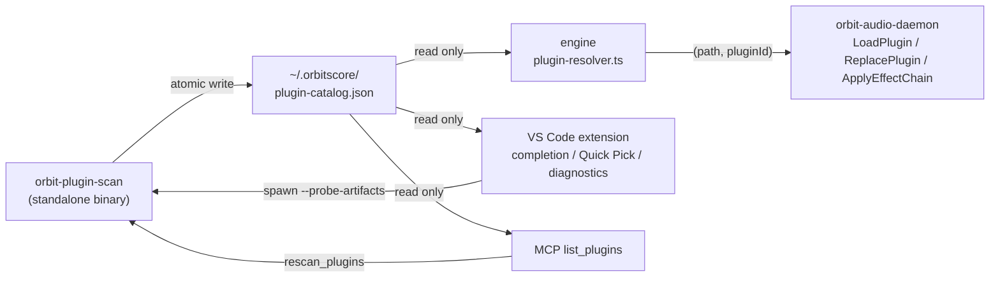
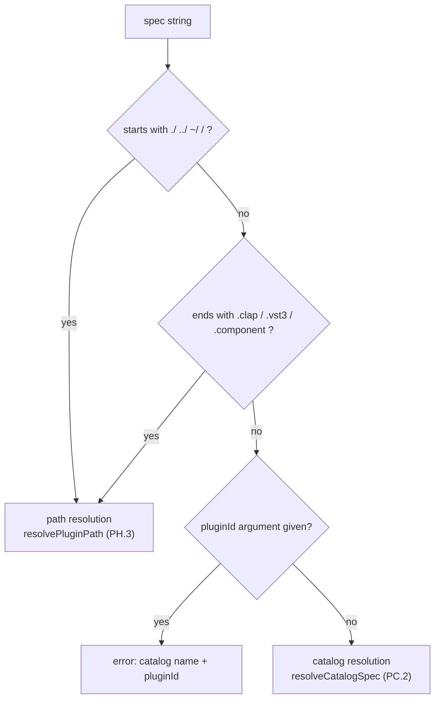

> **Note**: This page is a trace of the author's reading as of 2026-09-01. The code is the truth; this page is only a snapshot of understanding at that time.

# PH-3. The Plugin Catalog — Names, Completion, and Replacement

The `seq.instrument()` / `global.effect()` verbs we met in PH-1 originally required a
**full path** to the plugin. This chapter follows the four features that were stacked on top.

| Issue | What landed |
|---|---|
| [#463](https://github.com/signalcompose/orbitscore/issues/463) | The plugin catalog (scanner + `~/.orbitscore/plugin-catalog.json`), name-based references in the DSL, editor completion, MCP `list_plugins` / `rescan_plugins` |
| [#618](https://github.com/signalcompose/orbitscore/issues/618) | Replacing an instrument without restarting the engine (daemon mechanism + TS surface + real-device E2E) |
| [#625](https://github.com/signalcompose/orbitscore/issues/625) | Replacing and removing an effect insert (Stage 0–D) |
| [#638](https://github.com/signalcompose/orbitscore/issues/638) | The "Browse Plugins" Quick Pick and a diagnostic that reports a wrong name before evaluation |

The normative sources are the "Plugin Catalog" section (PC.1–PC.5) plus PH.2d / PH.3 / PH.4 of
`docs/core/INSTRUCTION_ORBITSCORE_DSL.md`, and SC.10 of
`docs/specs-v2/SIGNAL_CHAIN_DSL_SPEC_v1.md`. This chapter reads what the code does and quotes
the spec only where it is needed.



The diagram has one point: **only the scanner writes the catalog**; the engine, the extension,
and MCP just read the file. Why that division of labour was necessary comes out in the
crash-isolation story in §1.

## 1. What the catalog is — the scanner and the JSON shape

### 1.1 Why a standalone binary

The header comment of the scanner crate's Cargo.toml states the design reason directly.

```toml
# rust/crates/orbit-plugin-scan/Cargo.toml:1-7
# orbit-plugin-scan — プラグインカタログスキャナ（#463 C1）。
#
# CLAP/VST3 バンドルをスキャンし ~/.orbitscore/plugin-catalog.json を生成する。
# スキャン・probe はプラグインロードを伴い crash リスクがあるため、daemon 本体でなく
# 短命な独立バイナリに隔離する（#397 の crash isolation 原則）。
#
# 正本: docs/core/INSTRUCTION_ORBITSCORE_DSL.md「Plugin Catalog」節 PC.1
```

Reading a plugin's metadata sometimes means loading its shared library, and that carries the
risk of crashes and hangs. Doing it inside the daemon that is producing audio means a single scan
could stop the performance. Hence the crash-isolation principle in force since `#397`: cut it out
into a **short-lived separate process**. The crate's `description` even names the output file:
"Plugin catalog scanner: discovers CLAP/VST3 plugins and writes ~/.orbitscore/plugin-catalog.json (Issue #463)".

### 1.2 The shape of an entry

One catalog entry, and the top-level document, are defined on the Rust side like this.

```rust
// rust/crates/orbit-plugin-scan/src/lib.rs:29-50
/// カタログ 1 エントリ（PC.1 JSON スキーマ）。
#[derive(Debug, Clone, Serialize, Deserialize)]
#[serde(rename_all = "camelCase")]
pub struct CatalogEntry {
    pub name: String,
    pub vendor: String,
    pub format: Format,
    pub path: String,
    pub plugin_id: String,
    pub roles: Vec<String>,
}

/// トップレベルのカタログドキュメント（PC.1）。
#[derive(Debug, Clone, Serialize, Deserialize)]
#[serde(rename_all = "camelCase")]
pub struct Catalog {
    pub version: u32,
    pub scanned_at: String,
    pub plugins: Vec<CatalogEntry>,
    #[serde(default)]
    pub artifacts: Vec<CatalogArtifact>,
}
```

`plugins` is the `{ name, vendor, format, path, pluginId, roles }` of spec PC.1, and
**a bundle containing several plugins gets one entry per pluginId**. `artifacts` is the
"ledger of every bundle found" added by catalog v2 (#549 B1); it carries the probe state
(`staticSuccess` / `probePending` / `probeSucceeded` / `probeFailed`) and the failure reason.
The `#[serde(default)]` is there so that a v1-format file still reads. `version` is written as
`2` by `main.rs:64-69`.

Role detection differs per format. CLAP uses the feature tags, and the important point is that
when neither can be decided it **errs on the safe side and includes both**.

```rust
// rust/crates/orbit-plugin-scan/src/lib.rs:571-584
/// CLAP feature タグから role (instrument/effect) を判定する。
/// 両方一致・どちらも不一致の場合は両方入れる（安全側・PC.1 の role フィルタで絞り込む前提）。
fn roles_from_clap_features(features: &[String]) -> Vec<String> {
    let has_instrument = features.iter().any(|f| f == "instrument");
    let has_effect = features
        .iter()
        .any(|f| f == "audio-effect" || f == "audio_effect");

    match (has_instrument, has_effect) {
        (true, false) => vec![ROLE_INSTRUMENT.to_owned()],
        (false, true) => vec![ROLE_EFFECT.to_owned()],
        _ => vec![ROLE_INSTRUMENT.to_owned(), ROLE_EFFECT.to_owned()],
    }
}
```

The VST3 side, `roles_from_vst3_subcategories` (`lib.rs:922-940`), follows the same idea:
`Instrument` / `Synth` / `Generator` in `Sub Categories` means instrument, anything else means
effect, and no hint at all means both. Defaulting to "both when unsure" means the role filter
downstream (§2) only rejects the case where an instrument-only plugin is passed to `effect()`.

### 1.3 Where it looks — non-recursive, last wins

The scan targets are the four standard macOS directories plus `ORBIT_PLUGIN_PATH`
(`:`-separated).

```rust
// rust/crates/orbit-plugin-scan/src/lib.rs:187-198
/// スキャン対象ディレクトリのデフォルト（PC.1）。
/// `~` は `dirs_home` で解決する（HOME 環境変数が読めない場合はスキップ）。
fn default_scan_dirs(home: Option<&Path>) -> Vec<PathBuf> {
    let mut dirs = Vec::new();
    if let Some(home) = home {
        dirs.push(home.join("Library/Audio/Plug-Ins/CLAP"));
        dirs.push(home.join("Library/Audio/Plug-Ins/VST3"));
    }
    dirs.push(PathBuf::from("/Library/Audio/Plug-Ins/CLAP"));
    dirs.push(PathBuf::from("/Library/Audio/Plug-Ins/VST3"));
    dirs
}
```

Each directory is walked **at the top level only**; it never descends into subdirectories.
Spec PC.1's "each directory's immediate children only = non-recursive" is implemented as is.

```rust
// rust/crates/orbit-plugin-scan/src/lib.rs:228-253
/// 1 ディレクトリ直下（非再帰）を走査し、`.clap` / `.vst3` バンドル候補を列挙する。
/// ディレクトリが存在しない・読めない場合は空 Vec を返す（stderr warn のみ）。
pub fn list_bundle_candidates(dir: &Path) -> Vec<(PathBuf, Format)> {
    let entries = match fs::read_dir(dir) {
        Ok(entries) => entries,
        Err(error) => {
            // 存在しないデフォルトパスは珍しくない（プラグイン未インストール環境）ので debug 相当。
            tracing::debug!("[orbit-plugin-scan] ディレクトリを読めません: {dir:?}: {error}");
            return Vec::new();
        }
    };

    let mut found = Vec::new();
    for entry in entries.flatten() {
        let path = entry.path();
        let Some(extension) = path.extension().and_then(|e| e.to_str()) else {
            continue;
        };
        match extension.to_ascii_lowercase().as_str() {
            "clap" => found.push((path, Format::Clap)),
            "vst3" => found.push((path, Format::Vst3)),
            _ => {}
        }
    }
    found
}
```

`.component` (AU) is not picked up here, so spec PC.5's "AU is not scanned" is grounded in
this `match`.

When the same plugin exists in two places, dedup is **last wins**.

```rust
// rust/crates/orbit-plugin-scan/src/lib.rs:1037-1055
/// エントリ列を dedup する（後勝ち: 同キーの後続要素が前の要素を置き換える）。
pub fn dedup_entries(entries: Vec<CatalogEntry>) -> Vec<CatalogEntry> {
    let mut order: Vec<(u8, String, String)> = Vec::new();
    let mut map: std::collections::HashMap<(u8, String, String), CatalogEntry> =
        std::collections::HashMap::new();

    for entry in entries {
        let key = dedup_key(&entry);
        if !map.contains_key(&key) {
            order.push(key.clone());
        }
        map.insert(key, entry);
    }

    order
        .into_iter()
        .map(|key| map.remove(&key).expect("key was just inserted"))
        .collect()
}
```

A point to note here is that the dedup key is `(format, path, plugin_id)` — **not the name**
(`dedup_key` is at `lib.rs:1028-1035`). So if a plugin with the same name lives at two
different paths, **both** stay in the catalog. How spec PC.5's "multiple versions are not
distinguished — the last path found in scan order wins" relates to this implementation comes
back in the #623 story in §2.5.

### 1.4 The write is atomic

The file is written to a tmp path and then renamed — an atomic write. It is the minimum defence
so that readers (engine, extension) never pick up a half-written JSON.

```rust
// rust/crates/orbit-plugin-scan/src/lib.rs:1854-1866
/// カタログを JSON にシリアライズして `path` へ atomic write（tmp + rename）する。
pub fn write_catalog(catalog: &Catalog, path: &Path) -> io::Result<()> {
    if let Some(parent) = path.parent() {
        fs::create_dir_all(parent)?;
    }
    let json = serde_json::to_string_pretty(catalog)
        .map_err(|error| io::Error::new(io::ErrorKind::InvalidData, error))?;

    let tmp_path = path.with_extension("json.tmp");
    fs::write(&tmp_path, json)?;
    fs::rename(&tmp_path, path)?;
    Ok(())
}
```

### 1.5 Probing only on explicit request — from 23% to 99.1%

What is interesting is that the scanner behaves differently with and without the
`--probe-artifacts` flag.

```rust
// rust/crates/orbit-plugin-scan/src/main.rs:25-29
    // Native loading is opt-in. Unrelated/legacy argv remains ignored so unattended startup
    // cannot accidentally regress #463.
    let explicit_probe = first.as_deref() == Some(std::ffi::OsStr::new("--probe-artifacts"))
        || args.any(|arg| arg == std::ffi::OsStr::new("--probe-artifacts"));
    run_catalog_scan(explicit_probe)
```

There is history behind this opt-in. The C1 implementation of 2026-07-17 (WORK_LOG 6.269)
included a fallback that loaded VST3 plugins for real to read their metadata; a content-dependent
plugin then **popped a native dialog** during an unattended scan, and the fallback was removed.
As a result only VST3 bundles shipping a `moduleinfo.json` made it into the catalog, and the
measurement in `docs/research/PLUGIN_CATALOG_SCANNING.md` (2026-07-29) showed 79 entries out of
340 bundles — a **coverage of 23.2%**.

The conclusion of that research doc was that "the question is not whether to probe but **how
deep** to probe". The dialog appears at the component-initialisation layer; reading the factory
descriptor (class list, names, categories) never gets that far. So "no `moduleinfo.json`" was
re-expressed as "**not probed yet**" (`probePending`) rather than "unsupported", and a shallow
probe — one artifact per child process — runs only on an explicit rescan. This three-state model
(#549 B1, WORK_LOG 6.321) took the catalog from 80 to **339** entries, instruments from 9 to 72,
and coverage to **99.1%**.

Spec PC.1 pins the decision as a norm.

> **VST3 の native probe は明示スキャン時だけ行う**（規範）。コンテンツ依存プラグインが
> ネイティブダイアログを出し得るため（#463、実害確認 2026-07-17）、無人起動で
> moduleinfo 無し VST3 をロードしてはならない。

The fingerprint that keys the cache is `format + canonical bundle path + executable relative
path + size/mtime + Info.plist size/mtime + scanner schema version`, and it **deliberately
excludes** a content hash (the comment at `lib.rs:74-76` explains that hashing would reread
roughly 16.5 GiB on every explicit rescan). The comment on `SCANNER_SCHEMA_VERSION`
(`lib.rs:52-61`) explains that bumping it invalidates both positive and negative cache hits;
it is a number independent of the catalog's `version: 2`, and it must also be bumped when role
detection or the classes → entries projection changes.

## 2. Name-based references — deciding path vs. name, and the resolution order

### 2.1 The engine-side catalog reader

The engine only reads the catalog. `plugin-catalog.ts` (`:18-73`) holds nothing but types and
I/O; it reads `~/.orbitscore/plugin-catalog.json` through an in-memory cache keyed by mtime, so
a rescan is picked up without a process restart. The path resolves in the order "explicit
override > `ORBIT_PLUGIN_CATALOG` env var > default", and the env var is the injection point
the agreement test in §3 uses. When the file is missing it returns `undefined`, and the caller
turns that into a "please rescan" error.

### 2.2 The discriminator — why `looksLikePath()` is not reused

Spec PC.2's discriminator says:

> **判別規則**: spec が path-direct 形（`./` `../` `~/` `/` **開始**）または既知拡張子
> （`.clap` `.vst3` `.component`）で終わる → 従来どおり path 解決（PH.3）。
> それ以外 → **カタログ名として解決**

The implementation is almost 1:1.

```typescript
// packages/engine/src/core/global/plugin-resolver.ts:68-80
const PATH_DIRECT_PREFIXES = ['./', '../', '~/', '/']

/**
 * PC.2 discriminator: path-direct specs start with `./`/`../`/`~/`/`/` or end with a known
 * plugin extension; everything else is a catalog name. Deliberately does NOT reuse audio's
 * `looksLikePath()` ("contains `/`" = path) — a vendor-qualified catalog name like
 * `"TAL Software/TAL Reverb 4"` contains `/` but is not a path.
 */
export function isPluginPathSpec(spec: string): boolean {
  if (PATH_DIRECT_PREFIXES.some((prefix) => spec.startsWith(prefix))) return true
  const lower = spec.toLowerCase()
  return KNOWN_PLUGIN_EXTENSIONS.some((ext) => lower.endsWith(ext))
}
```

The audio side has a `looksLikePath()` that says "contains `/` = path", but using it would turn
the vendor-qualified `"TAL Software/TAL Reverb 4"` into a path. That is why this is a dedicated
check looking **only at the leading form and the trailing extension**. Conversely, a catalog name
that itself ends in `.clap` (say a display name of `"MyPlugin.clap"`) falls into path resolution;
that is a known limitation and the spec says to work around it with a path spec.



### 2.3 Normalisation and qualifiers

Names are compared after `trim → NFC → lowercase`. NFC is there because file names coming from
the macOS file system can be NFD (decomposed combining characters) and would otherwise fail to
match the NFC text typed in the editor.

```typescript
// packages/engine/src/core/global/plugin-resolver.ts:91-93
export function normalizeCatalogKey(value: string): string {
  return value.trim().normalize('NFC').toLowerCase()
}
```

A **format qualifier** like `"vst3/TAL Reverb 4"` and a **vendor qualifier** like
`"TAL Software/TAL Reverb 4"` are told apart by whether the text before the first `/` is a
known format name (`clap` / `vst3`).

```typescript
// packages/engine/src/core/global/plugin-resolver.ts:115-128
function catalogQualifier(spec: string): CatalogQualifier {
  const slashIndex = spec.indexOf('/')
  const qualifierKey =
    slashIndex === -1 ? undefined : normalizeCatalogKey(spec.slice(0, slashIndex))
  const formatKey =
    qualifierKey !== undefined && KNOWN_PLUGIN_FORMATS.includes(qualifierKey)
      ? qualifierKey
      : undefined
  return {
    qualifierKey,
    formatKey,
    vendorKey: formatKey === undefined ? qualifierKey : undefined,
  }
}
```

`resolveCatalogCandidates` (`plugin-resolver.ts:130-199`) narrows the candidates by that
qualifier and then checks, in this order: **not found → ambiguous vendor → wrong role → a format
v1 cannot host**. The order is worth remembering, because the diagnostic in §3.4 mirrors it
exactly.

```typescript
// packages/engine/src/core/global/plugin-resolver.ts:157-172
  if (candidates.length === 0) {
    throw new Error(
      `No plugin named "${spec}" found in the plugin catalog (${catalogPath}). ${RESCAN_HINT}`,
    )
  }

  if (vendorKey === undefined) {
    const distinctVendors = new Set(candidates.map((entry) => normalizeCatalogKey(entry.vendor)))
    if (distinctVendors.size > 1) {
      const listed = candidates.map((entry) => `"${entry.vendor}/${entry.name}" (${entry.format})`)
      throw new Error(
        `Plugin name "${spec}" is ambiguous across multiple vendors: ${listed.join(', ')}. ` +
          'Qualify it as "vendor/name" to disambiguate.',
      )
    }
  }
```

The same name from different vendors "lists the candidates and errors instead of silently
picking the first". The `RESCAN_HINT` on not-found is
`Run \`orbit-plugin-scan --probe-artifacts\` to (re)generate the plugin catalog, then retry.` —
the "actionable message including the rescan procedure" that spec PC.2 asks for.

```typescript
// packages/engine/src/core/global/plugin-resolver.ts:174-198
  const roleCandidates =
    role === undefined ? candidates : candidates.filter((entry) => entry.roles.includes(role))
  if (role !== undefined && roleCandidates.length === 0) {
    const foundRoles = [...new Set(candidates.flatMap((entry) => entry.roles))].join(', ') || 'none'
    throw new Error(
      `Plugin "${spec}" does not support the "${role}" role (catalog roles: ${foundRoles}).`,
    )
  }

  const accepted = acceptedFormatsForRole()
  const formatCandidates = roleCandidates.filter((entry) =>
    accepted.includes(entry.format.toLowerCase()),
  )
  if (formatCandidates.length === 0) {
    const foundFormats = [...new Set(roleCandidates.map((entry) => entry.format))].join(', ')
    throw new Error(
      `Plugin "${spec}" was found in the catalog only as [${foundFormats}], which ${role}() ` +
        `cannot host in v1 (accepts: ${accepted.join(', ')}).`,
    )
  }

  const chosen =
    formatCandidates.find((entry) => entry.format.toLowerCase() === 'clap') ?? formatCandidates[0]

  return { path: chosen.path, pluginId: chosen.pluginId, entries: candidates, entry: chosen }
```

The final `chosen` is spec PH.3 / PC.2's "**CLAP > VST3** when the same vendor has both
formats". `acceptedFormatsForRole()` returns `['clap', 'vst3']` regardless of role — at the time
of PH-1 effects were CLAP-only, but since VST3 effects (#445) both roles share the same set.

### 2.4 The resolution output is the pair `(path, pluginId)`

Resolution through the catalog returns not only the path but also the pluginId. The catalog has
one entry per pluginId, so once the name is fixed the pluginId is fixed too. That is why
**combining a catalog name with the second `pluginId` argument is an error**.

```typescript
// packages/engine/src/core/global/plugin-resolver.ts:238-260
export function resolvePluginSpec(
  spec: string,
  pluginIdArg: string | undefined,
  audioPaths: readonly string[],
  documentDirectory: string,
  role: PluginRole,
  catalogPathOverride?: string,
): ResolvedPluginSpec {
  if (isPluginPathSpec(spec)) {
    return {
      path: resolvePluginPath(spec, audioPaths, documentDirectory, role),
      pluginId: pluginIdArg,
    }
  }
  if (pluginIdArg !== undefined) {
    throw new Error(
      `A catalog plugin name ("${spec}") resolves its pluginId automatically; do not pass a ` +
        'second pluginId argument together with it (explicit pluginId is only for path specs).',
    )
  }
  const resolved = resolveCatalogSpec(spec, role, catalogPathOverride)
  return { path: resolved.path, pluginId: resolved.pluginId }
}
```

Looking at the calling instrument manager, you can see that extension validation only runs
**for path-direct specs**. A catalog name has no extension, so rejecting it here would be wrong.

```typescript
// packages/engine/src/core/global/plugin-instrument-manager.ts:53-91
  async instrument(
    seqName: string,
    spec: string,
    pluginId?: string,
    statePath?: string,
  ): Promise<void> {
    // 拡張子検証は path-direct spec にのみ適用する（#463 C2: カタログ名はここで弾かず、
    // resolvePluginSpec のカタログ解決に委ねる — effect-slot.ts の resolveEffectSpec と同型）。
    if (isPluginPathSpec(spec)) {
      validatePluginExtension(spec, 'instrument')
    }
    if (this.linkAudioManager.isEnabled()) {
      throw new Error('seq.instrument() cannot be used while LinkAudio is enabled in v1.')
    }

    const resolved = resolvePluginSpec(
      spec,
      pluginId,
      this.audioManager.getAudioPaths(),
      this.audioManager.getDocumentDirectory(),
      'instrument',
    )
    await this.slots.declare(
      seqName,
      {
        role: 'instrument',
        bus: undefined,
        normalizedName: normalizePluginInstanceName(spec),
        resolvedPath: resolved.path,
        pluginId: resolved.pluginId,
        // note 側 `resolveNoteTarget()` の port（`plugin:<seqName>`）と同じ規約。
        instance: `plugin:${seqName}`,
        // #540 P2: 保存済み state（音色）。相対パスは document directory 基準で解決する。
        statePath: statePath === undefined ? undefined : this.resolveStatePath(statePath),
      },
      () =>
        `Sequence '${seqName}' already has an instrument instance; replacing it requires the Rust engine backend.`,
    )
  }
```

Incidentally, auto-filling the pluginId exposed two defects that **only the catalog path
triggers** (WORK_LOG 6.362): the VST3 child does not use the pluginId and warned about it, and
the daemon's stderr was being `split` per chunk, so a line cut at a chunk boundary was classified
as ERROR. Both were invisible while the E2E bypassed the production path with full paths, and
both surfaced the moment the E2E was moved to catalog names taken from `list_plugins`.

### 2.5 v1 limits, and the #623 contradiction

Spec PC.5 discloses the limits as implementation facts.

> - 多バージョン共存（同名同 vendor 同 format の別バージョン）は区別しない —
>   スキャン順で最後に見つかった path が勝つ（バージョン規則は将来拡張）
> - ファイルシステム watch による自動 rescan なし・AU（`.component`）はスキャン対象外
>   （PH.3 の受理状況と整合してから追加）

However, as we saw in §1.3, the `dedup_entries` key includes the path, so **same-named plugins at
different paths both remain in the catalog**, and `resolveCatalogCandidates` picks the first CLAP
among them with `find`. WORK_LOG 6.363 filed this as a policy contradiction — "dedup is last-wins
(PC.5) but resolve is first-wins" — in
[#623](https://github.com/signalcompose/orbitscore/issues/623). The trigger was a real-device
incident: an old build had been left in `~/Library/Audio/Plug-Ins/CLAP/`, an artifact with no
`clap.state` was chosen as the first in catalog order, and **it only became visible when state
saving ran**. As mitigation the E2E setup checks that "the display name has exactly one catalog
candidate overall".

One more thing: the SC.3.2 rule that normalises a catalog name to alphanumerics and calls it as
a method (`kick.TALReverb4()`) was **retracted** in SC.10.9 by #628. The reasons: normalising a
real name changes how it looks, so it can no longer be searched by its original name, and
normalisation collides (different products map to the same identifier). Every name reference in
this chapter is the `"string"` form; read it with the three-way split of SC.10.1 norm 3 in mind,
where a capitalised call such as `Gain(db: -6)` is a **bundled standard plugin** from a vocabulary
separate from the catalog.

## 3. The editor side — completion, Browse Plugins, and pre-evaluation diagnostics

### 3.1 The extension does not import the engine

The extension has its own `plugin-catalog-reader.ts`, a separate implementation of the **same
JSON shape and the same mtime cache** as the engine side. Its header explains why.

```typescript
// packages/vscode-extension/src/plugin-catalog-reader.ts:1-15
/**
 * Plugin catalog reader for the VS Code extension (#463 C1b/C3).
 *
 * Deliberately independent from `packages/engine/src/core/global/plugin-catalog.ts`
 * (same JSON shape, same mtime-cache idea) rather than a cross-package import:
 * the extension and engine are separate build targets (engine ships as compiled
 * JS copied into `engine/dist/`, see `scripts/copy-daemon-bin.sh` / build:engine),
 * so this module reads the on-disk cache file directly instead of reaching into
 * engine source.
 *
 * Catalog file: `~/.orbitscore/plugin-catalog.json`, written by the
 * `orbit-plugin-scan` binary (rust/crates/orbit-plugin-scan). Consumers here
 * only read it — the extension's job is completion (C3) + MCP tools (PC.4) +
 * spawning a rescan (C1b), never writing the catalog itself.
 */
```

Spec PC.3's "completion reads only the cache file (no engine start required)" holds because of
this separation. Completion works as long as the file exists, even when no engine is running.

### 3.2 The Rescan command — spawning the scanner directly

Two commands are registered under `contributes.commands` in `package.json`.

```json
// packages/vscode-extension/package.json:110-121
      {
        "command": "orbitscore.rescanPlugins",
        "title": "OrbitScore: Rescan Plugin Catalog",
        "icon": "$(refresh)",
        "category": "OrbitScore"
      },
      {
        "command": "orbitscore.browsePlugins",
        "title": "OrbitScore: Browse Plugins",
        "icon": "$(library)",
        "category": "OrbitScore"
      },
```

`rescanPlugins` appears in the command palette and also in the `.orbs` right-click menu
(`editor/context`, `resourceExtname == .orbs`). The implementation, `runPluginScan()`, does not
go through the daemon: **the extension spawns the scanner binary directly**. The binary lookup
follows the same convention as the daemon lookup.

```typescript
// packages/vscode-extension/src/plugin-catalog-reader.ts:174-202
/**
 * Resolve the `orbit-plugin-scan` binary path. Candidate order mirrors
 * `resolveDaemonBinaryPath` in `packages/engine/src/audio/rust-engine/daemon-client.ts`:
 * explicit override → `ORBIT_PLUGIN_SCAN_PATH` env → monorepo release build
 * (dev workflow) → .vsix-bundled binary (scripts/copy-daemon-bin.sh).
 */
export function resolvePluginScanBinaryPath(explicitPath?: string): string {
  const searched: string[] = []
  const candidates: string[] = []
  if (explicitPath) candidates.push(explicitPath)
  const envPath = process.env.ORBIT_PLUGIN_SCAN_PATH
  if (envPath) candidates.push(envPath)

  // This compiled file sits at `<extension>/dist/plugin-catalog-reader.js` once
  // built (mirrors extension.ts's __dirname convention); monorepo root is 3
  // levels up: dist -> vscode-extension -> packages -> root.
  const monorepoRoot = path.resolve(__dirname, '../../../')
  candidates.push(path.join(monorepoRoot, 'rust/target/release/orbit-plugin-scan'))
  candidates.push(path.join(monorepoRoot, 'rust/target/debug/orbit-plugin-scan'))

  const platform = `${process.platform}-${process.arch}`
  candidates.push(path.join(__dirname, '../engine/bin', platform, 'orbit-plugin-scan'))

  for (const candidate of candidates) {
    searched.push(candidate)
    if (isExecutableFile(candidate)) return candidate
  }
  throw new PluginScanBinaryNotFoundError(searched)
}
```

The spawn always passes `--probe-artifacts`. In other words, **a rescan from the editor or MCP
is always an "explicit scan"**, and the shallow probe of §1.5 runs. `detached` is set so that the
probe children (and their helpers) can be killed as a whole process group.

```typescript
// packages/vscode-extension/src/plugin-catalog-reader.ts:259-266
    // `detached` makes the scanner its own process-group leader on Unix. A scanner supervises
    // native probe children (which can spawn helpers), so a parent timeout must kill the negative
    // process-group id rather than only the scanner PID or those descendants become orphans.
    const child = child_process.spawn(binaryPath, ['--probe-artifacts'], {
      detached: process.platform !== 'win32',
      stdio: ['ignore', 'pipe', 'pipe'],
    })
    activePluginScans.add(child)
```

The scanner emits **exactly one line of JSON** on stdout (`count` / `artifactCount` /
`cachePath` / `skipped` / `failures` / `summary`); the extension parses it and writes
`success / pending / failure`, the p50/p95/max durations, and timeout / crash counts to the
output channel. On success it calls `clearPluginCatalogCache()` so the next completion sees the
fresh catalog.

MCP's `list_plugins` / `rescan_plugins` share the same `loadPluginCatalog()` / `runPluginScan()`.

```typescript
// packages/vscode-extension/src/mcp-server.ts:1022-1032
  server.registerTool(
    'list_plugins',
    {
      title: 'List Plugins',
      description:
        'List the installed CLAP/VST3 plugin catalog (#463 PC.1) — name, vendor, format, ' +
        'and roles (effect/instrument) for each entry — so an agent can pick real ' +
        'plugin names when composing effect()/instrument() calls. Returns an error ' +
        '(with a rescan hint) if the catalog has not been scanned yet.',
    },
    async () => {
```

### 3.3 Completion — inside a rack, across lines

Completion context detection lives in `plugin-catalog-completion.ts`, written as pure functions
that never touch the vscode API. When #628 introduced the rack form (`effect([...])`, multi-line,
nested `layer([...])`), a single-line regex stopped firing, so it was replaced with a **bounded
backward scanner**.

```typescript
// packages/vscode-extension/src/plugin-catalog-completion.ts:44-45
/** ラック文脈で補完対象になる呼び出し。`layer` は構造なので role を決めない。 */
const RACK_CALL_WORDS = new Set(['effect', 'instrument', 'plugin', 'layer'])
```

```typescript
// packages/vscode-extension/src/plugin-catalog-completion.ts:68-87
export function detectRackArgContext(
  lines: readonly string[],
  line: number,
  character: number,
): PluginArgContext | null {
  const cursorLine = lines[line]
  if (cursorLine === undefined) return null

  const quote = findOpenQuote(cursorLine.slice(0, character))
  if (quote === null) return null

  const verb = resolveEnclosingVerb(lines, line, quote.quoteIndex)
  if (!verb) return null

  return {
    verb,
    typed: cursorLine.slice(quote.quoteIndex + 1, character),
    quoteStartChar: quote.quoteIndex + 1,
  }
}
```

Detection has two stages. First, is the cursor inside an unclosed `"` on the cursor line (a string
never spans lines)? Then walk outward through unclosed brackets and decide the role by whether
`effect(` or `instrument(` is reached. `plugin(` and `layer(` are pass-through points; the role is
decided further out. The walk is capped at `RACK_SCAN_MAX_LINES = 50` — unbounded, a document with
a forgotten closing bracket would have the whole file scanned on every keystroke.

Candidate filtering and label construction are in `filterCatalogEntries`.

```typescript
// packages/vscode-extension/src/plugin-catalog-completion.ts:166-205
export function filterCatalogEntries(
  entries: readonly PluginCatalogEntry[],
  verb: PluginVerb,
  typed: string,
): PluginCatalogCompletionCandidate[] {
  const needle = typed.trim().toLowerCase()
  const roleEntries = entries.filter((entry) => entry.roles.includes(verb))
  const formatsByVendorAndName = new Map<string, Set<string>>()
  for (const entry of roleEntries) {
    const key = vendorAndNameKey(entry)
    const formats = formatsByVendorAndName.get(key) ?? new Set<string>()
    formats.add(normalizeCatalogKey(entry.format))
    formatsByVendorAndName.set(key, formats)
  }

  const baseCandidates = roleEntries.map((entry) => {
    const hasFormatCollision = (formatsByVendorAndName.get(vendorAndNameKey(entry))?.size ?? 0) > 1
    return {
      entry,
      label: hasFormatCollision ? `${entry.format.toLowerCase()}/${entry.name}` : entry.name,
    }
  })
  const vendorsByLabel = new Map<string, Set<string>>()
  for (const { entry, label } of baseCandidates) {
    const vendors = vendorsByLabel.get(normalizeCatalogKey(label)) ?? new Set<string>()
    vendors.add(normalizeCatalogKey(entry.vendor))
    vendorsByLabel.set(normalizeCatalogKey(label), vendors)
  }

  return baseCandidates.flatMap(({ entry, label: baseLabel }) => {
    const label =
      (vendorsByLabel.get(normalizeCatalogKey(baseLabel))?.size ?? 0) > 1
        ? `${entry.vendor}/${entry.name}`
        : baseLabel
    if (needle === '') return [{ entry, label, insertText: label }]
    const qualified = `${entry.vendor}/${entry.name}`.toLowerCase()
    if (!label.toLowerCase().includes(needle) && !qualified.includes(needle)) return []
    return [{ entry, label, insertText: label }]
  })
}
```

Read it like this.

1. Filter by role (`instrument(` keeps entries whose roles include `instrument`).
2. If, **within the same vendor**, a name exists in both CLAP and VST3, the label becomes
   `clap/name` / `vst3/name`.
3. If the label still collides with another vendor, it becomes `vendor/name`.
4. Keep `label === insertText`. **What is shown must equal what is inserted** — that is spec
   PC.3's requirement, and the string produced here is passed as is to `resolveCatalogSpec` in §2.

Narrowing while typing is left to VS Code: the provider gives each item a `range` (from just
after the opening quote to the cursor). When there is no catalog it returns no candidates and
shows a one-time hint to rescan (the `pluginCatalogHintShown` flag prevents nagging).

```typescript
// packages/vscode-extension/src/extension.ts:3716-3726
        if (!pluginContext) return undefined

        const catalog = loadPluginCatalog()
        if (!catalog) {
          if (!pluginCatalogHintShown) {
            pluginCatalogHintShown = true
            vscode.window.showInformationMessage(
              'OrbitScore: no plugin catalog found. Run "OrbitScore: Rescan Plugin Catalog" to enable name completion.',
            )
          }
          return undefined
```

### 3.4 Browse Plugins — an entry point for searching 274 items (#638)

Completion assumes you remember a fragment of the name. According to WORK_LOG 6.412 the real
catalog has **342 entries** (effect **274** / instrument **74**, 130 of them from IK Multimedia
alone), and at that scale you need a separate entry point for "I am looking for something to
insert". That is the `OrbitScore: Browse Plugins` Quick Pick.

```typescript
// packages/vscode-extension/src/plugin-catalog-completion.ts:241-252
export function buildPluginPickItems(
  entries: readonly PluginCatalogEntry[],
  verb: PluginVerb,
): PluginPickItem[] {
  return filterCatalogEntries(entries, verb, '')
    .map(({ entry, label, insertText }) => ({
      label,
      description: `${entry.vendor} · ${entry.format.toUpperCase()}`,
      insertText,
    }))
    .sort((a, b) => a.label.localeCompare(b.label) || a.description.localeCompare(b.description))
}
```

The rows **reuse** `filterCatalogEntries`. The point of the design is that the string is
character-for-character what completion would have inserted, so the `format/name` /
`vendor/name` disambiguation survives selection from a list. `browsePlugins()`
(`extension.ts:2298-2362`) takes the role from the enclosing `effect(` / `instrument(` string
when the cursor is inside one and replaces the typed fragment; outside that context it asks which
kind to browse and inserts a quoted `"name"`.

### 3.5 Pre-evaluation diagnostics — a Warning, not an Error

`effect(["nonexistent name"])` looks fine until it is evaluated, because the catalog lookup
happens inside the engine at runtime. #638 moved it forward to **edit time**.

```typescript
// packages/vscode-extension/src/plugin-name-diagnostics.ts:8-20
 * 🔴 This module deliberately MIRRORS the engine's resolution rules
 * (`packages/engine/src/core/global/plugin-resolver.ts`) rather than importing
 * them: the extension ships as a standalone `.vsix` and must not depend on the
 * engine package at runtime. The duplication is pinned by an agreement test
 * (`tests/vscode-extension/plugin-name-diagnostics.spec.ts`) that drives BOTH
 * implementations over one corpus and asserts they accept and reject the same
 * specs — so a change to either side that drifts becomes a red test rather than
 * a silent divergence. This follows the existing precedent in
 * `tests/vscode-extension/dsl-method-catalog.spec.ts`.
 *
 * When #610 unifies diagnostics onto the engine parser, this module is the
 * thing that goes away.
 */
```

Here too the extension cannot import the engine, so it **mirrors** the discriminator
(`isPluginPathSpec` / `isStateFileSpec`) and the resolution order (not found → ambiguous vendor
→ wrong role → unhostable format). Duplicates drift, so
`describe('agreement with the engine resolver')` in
`tests/vscode-extension/plugin-name-diagnostics.spec.ts` drives one corpus (from
`['TAL Reverb 4', 'effect']` to `['Kontakt 8', 'instrument']`) **through both implementations
and asserts they accept and reject the same specs**. If either side changes alone the test goes
red — that is how drift is made detectable.

`findCatalogSpecSites`, which collects the catalog-name string literals in a document, tracks
context with a frame stack. `effect(` / `instrument(` open a catalog context, `plugin` / `layer`
/ `chain` inherit it, and **every other call closes it**. That last rule is what keeps the string
inside a standard plugin like `Gain(...)` (resolved from the language's own vocabulary, never
from the catalog) and the argument of `seq.audio("path")` out of the check.

```typescript
// packages/vscode-extension/src/plugin-name-diagnostics.ts:262-275
export function analyzeUnknownPluginNames(
  text: string,
  entries: readonly PluginCatalogEntry[] | undefined,
): DiagnosticIssue[] {
  if (entries === undefined || entries.length === 0) return []
  const issues: DiagnosticIssue[] = []
  for (const site of findCatalogSpecSites(text)) {
    const verdict = classifyCatalogSpec(entries, site.spec, site.role)
    const message = messageFor(site, verdict)
    if (message === undefined) continue
    issues.push({ line: site.line, startCol: site.startCol, endCol: site.endCol, message })
  }
  return issues
}
```

When there is no catalog, **nothing is reported**: "not scanned yet" is not evidence that a name is
wrong. And the severity is **Warning**, not Error.

```typescript
// packages/vscode-extension/src/extension.ts:4096-4112
  // these at evaluation time, but with 342 catalog entries a typo is the common
  // case and waiting until evaluation to learn about it is expensive.
  //
  // Severity is Warning, not Error, even though the engine throws: the
  // extension's catalog is a cached snapshot, so a name can be *correct* and
  // merely not scanned yet (a plugin installed since the last rescan). Warning
  // says "this looks wrong" without asserting a certainty the snapshot cannot
  // support; the message names the rescan command for exactly that case.
  for (const issue of analyzeUnknownPluginNames(text, loadPluginCatalog()?.plugins)) {
    diagnostics.push(
      new vscode.Diagnostic(
        new vscode.Range(issue.line, issue.startCol, issue.line, issue.endCol),
        issue.message,
        vscode.DiagnosticSeverity.Warning,
      ),
    )
  }
```

The engine really does throw, yet this is a Warning because the extension's catalog is a
**cached snapshot**. A name can be correct and simply not scanned yet.

As it happens, mutation testing showed that the tests for this diagnostic were "passing for the
wrong reason" (WORK_LOG 6.412). Killing the path-prefix check left `./local.clap` caught by the
extension check; killing the state-file check left `./tones/bass.vstpreset` caught by `./`; the
tests stayed green either way. When several exclusion rules exist, **an example that satisfies all
of them cannot distinguish any of them**, so the cases were rewritten one per rule, each saved only
by that rule (`./racks/my-chain` / `MyPlugin.clap` / `bass.vstpreset`).

## 4. Replacing an instrument (#618)

### 4.1 The failure model the spec demands

Spec PH.4 says this about re-declaring on the same sequence.

> 同一シーケンスの再宣言: 同一 path + pluginId + statePath は冪等（no-op・ライブ再評価の保護。
> **statePath もロード identity の一部** — 同じ plugin でも state が違えば別宣言・#540 P2）。
> 異なる path / pluginId / statePath は**後勝ちで差し替える**（SC.3.1 規範4）。差し替えは
> prepare → commit 型で、新インスタンスのロード成功まで旧インスタンスが鳴り続け、失敗時は
> 旧インスタンスが無傷で残る（= 失敗したら何も起きなかったのと同じ）。**差し替え要求の直前に**
> 旧インスタンスの state を自動保存してから要求を出す

The key to "on failure it is as if nothing happened" is that instrument slots form **a pool of N
identical slots plus `instance_index` (an indirection from name to slot)**. The daemon function's
comment states the mechanism in one line.

```rust
// rust/crates/orbit-audio-daemon/src/engine_wrap.rs:6010-6022
    /// #618: instrument plugin を目標 spec へ収束させる ensure 操作。
    ///
    /// 未割当/Empty は通常 load、同一 Active は no-op、異 spec Active は spare へ prepare して
    /// READY 後に `instance_index` を commit する。既存 `LoadPlugin` の Active-reject semantics は
    /// `load_outproc_plugin_impl` 側にそのまま残す。
    #[cfg(feature = "outproc-instrument")]
    pub fn replace_outproc_instrument_plugin(
        &self,
        path: PathBuf,
        plugin_id: Option<String>,
        instance: Option<String>,
        state: Option<PathBuf>,
    ) -> Result<ReplacedPluginSummary, WrapError> {
```

Commit is a rewrite of the `instance_index` map. Nothing on the old slot is touched before commit,
so "failure = nothing happened" holds structurally. After commit the old slot is returned to the
free list and reused by later declarations (a slot whose cleanup could not be confirmed is not
returned but quarantined, which reaches TS via `ReplacedPluginSummary.quarantined_slot`).

The interesting part of WORK_LOG 6.360 is that the original design's "send note-offs ahead of the
replacement" was investigated at the owner's prompting and **concluded to be unnecessary**. The old
child dies with its process on kill, so stuck notes cannot happen in principle; sending note-offs
first would, on a failed load of the new instance, produce "the old one is retained but the sound
is gone", breaking the failure model. The rule that came out of it: forced note-off is needed when
the **source** of the notes stops (MUTE / LOOP exclusion / `play()` replacement / stop), not when
the **destination** changes.

### 4.2 The TS surface — `failurePolicy` and `beforeReplace`

On the TS side replacement is opted into through the `replacement` option of `EffectChainMap`.

```typescript
// packages/engine/src/core/global/effect-slot.ts:221-235
  /** Opt-in for in-place daemon replacement. */
  readonly replacement?: {
    readonly beforeReplace: (key: K, oldSlot: PluginSlot) => Promise<void>
    readonly onQuarantinedSlot?: (key: K) => void
    /**
     * Registry handling after ReplacePlugin rejects.
     *
     * Instrument replacement can retain the old declaration after a definitive
     * daemon rejection. Effect replacement cannot know whether teardown already
     * happened, so every rejection forgets the declaration and makes the next
     * declaration use ReplacePlugin as an ensure operation.
     */
    readonly failurePolicy: 'retain-on-reject' | 'forget-and-ensure'
  }
}
```

Instruments use `'retain-on-reject'` (per the failure model of §4.1: on a definitive daemon
rejection the old declaration is kept). The catch block of `issueReplacement` shows how the
registry handling splits by policy.

```typescript
// packages/engine/src/core/global/effect-slot.ts:786-805
    try {
      result = await this.audioEngine.replacePlugin(
        resolvedPath,
        pluginId,
        role,
        ...(optionalArgs as [string?, string?, string?]),
      )
    } catch (error) {
      if (this.replacement!.failurePolicy === 'forget-and-ensure') {
        this.chains.delete(key)
        this.uncertainReplacements.set(key, {
          bus: role === 'effect' ? bus : undefined,
          forgottenSlot: existing ?? forgottenSlot,
        })
      } else if (!(error instanceof DaemonProtocolError)) {
        if (existing) this.chains.delete(key)
        this.uncertainReplacements.set(key, { bus: undefined })
      }
      throw error
    }
```

Even under `retain-on-reject`, a failure that is **not** a `DaemonProtocolError` (a transport
exception, i.e. it is unknown whether the daemon committed) forgets the declaration and marks the
key in `uncertainReplacements`, steering the next re-declaration to `ReplacePlugin` with ensure
semantics. The Critical in WORK_LOG 6.361 sits exactly here: if the TS `chains` forgets but the
engine's respawn-restore cache (`loadedPlugins`) still remembers the old A, then after a respawn
**what plays is A, not B**, with no error to notice. It was closed with the policy that "two ledgers
must make the same judgement about the same uncertainty".

`beforeReplace` is wired to `Global.prepareInstrumentReplacement` (`global.ts:1337-1378`), which
closes the plugin UI if open and, when a document directory exists, saves the old instance's state
under project.yaml before issuing the replacement request. The spec's "why the save point is just
before the **request** rather than just before commit" is that the daemon implements
prepare → commit → teardown as a single atomic call with no point to insert a save.

### 4.3 The E2E looks at "what is playing" by frequency

The #618 gated E2E (`#618 E1-E6`) replaces across formats, CLAP → VST3, and takes its oracle from
the **fundamental frequency** in addition to segment RMS. The trigger was Codex reporting a weakness
in the brief: the specified CLAP / VST3 oracles both produce `sin * 0.25` in steady state, so their
RMS is nearly identical and "RMS differs significantly" would be a false assertion (WORK_LOG 6.361).
Instead the VST3 side carries a +7 semitone state and the two are told apart by frequency.

```typescript
// tests/e2e/orbitstudio-mcp-gated.spec.ts:3428-3436
      const e4Hz = estimateFundamentalHz(capture, audioRange(segments.e4!))
      const e5Hz = estimateFundamentalHz(capture, audioRange(segments.e5!))
      expect(e1Hz, 'E1 CLAP baseline needs a measurable fundamental').toBeDefined()
      expect(e2Hz, 'E2 VST3 replacement needs a measurable fundamental').toBeDefined()
      expect(e4Hz, 'E4 surviving VST3 needs a measurable fundamental').toBeDefined()
      expect(e5Hz, 'E5 restored CLAP needs a measurable fundamental').toBeDefined()
      expect(Math.abs(e2Hz! - e1Hz!) / e1Hz!).toBeGreaterThan(0.25)
      expect(Math.abs(e4Hz! - e2Hz!) / e2Hz!).toBeLessThan(0.02)
      expect(Math.abs(e5Hz! - e1Hz!) / e1Hz!).toBeLessThan(0.02)
```

E2 (the sound changed), E4 (B keeps playing after a failure), and E5 (the tone loop brought A's
state back) cannot be distinguished by RMS and can only be proven by frequency. Every declaration
uses a **catalog name** taken from `list_plugins`; the only hard-coded full path is the failure
injection (a nonexistent path must reach the daemon's failure path, and a catalog name would be
rejected earlier by the TS resolution of §2).

## 5. Replacing and removing an effect insert (#625 → #628)

### 5.1 The instrument mechanism cannot be reused

The #625 design doc (`docs/archive/design/625-effect-replacement-design.md`) first confirms that the
instrument's spare-slot approach does not work for effects. An effect slot is **positionally fixed
by bus name**, and the render side's `InsertBusStage` holds the processor directly, so there is no
"name → slot" indirection. With nowhere to re-point, the adopted mechanism was an **in-place
rebuild of the same ChildSlot**.

```rust
// rust/crates/orbit-audio-daemon/src/engine_wrap.rs:5514-5522
    /// effect plugin を固定 slot 上で目標 spec へ収束させる ensure 操作。
    /// Active の異 spec だけを quiesce ack 後に同じ shm 上で建て直す。
    #[cfg(feature = "outproc-effect")]
    pub fn replace_outproc_effect_plugin(
        &self,
        path: PathBuf,
        plugin_id: Option<String>,
        bus: Option<String>,
        state: Option<PathBuf>,
```

The procedure drops `engaged=false` into a dry pass-through, waits for the RT thread to leave the
transport via the existing quiesce pair (stop/done) with an ack, detaches the supervisor and resets
the shm control, and attaches a new child to the same shm — with **no change to the RT code
(`orbit-audio-native`)**. A consequence is that the failure model differs from the instrument's:
a failure **before** teardown leaves the old insert intact, a failure **after** teardown degrades to
dry (never silence) plus forget-and-ensure — which is why the three effect managers pass
`failurePolicy: 'forget-and-ensure'`.

```typescript
// packages/engine/src/core/global.ts:164-188
    this.pluginEffectManager = new PluginEffectManager(
      audioEngine,
      this.audioManager,
      this.linkAudioManager,
      {
        beforeReplace: (_key, oldSlot) => this.prepareEffectReplacement('master', oldSlot),
        failurePolicy: 'forget-and-ensure',
      },
    )
    this.sequenceEffectManager = new SequenceEffectManager(
      audioEngine,
      this.audioManager,
      this.linkAudioManager,
      {
        beforeReplace: (sequenceName, oldSlot) =>
          this.prepareEffectReplacement(sequenceName, oldSlot),
        failurePolicy: 'forget-and-ensure',
      },
    )
    this.mixerManager = new MixerManager(
      audioEngine,
      this.audioManager,
      this.linkAudioManager,
      (receiverId, oldSlot) => this.prepareEffectReplacement(receiverId, oldSlot),
    )
```

All **four paths** — master / seq / sum / aux — go through the same hook. WORK_LOG 6.367 tells of a
mutation in which `SequenceEffectManager`'s `beforeReplace` passed `'master'` instead of
`sequenceName` and survived with every test green. The damage was that the seq's old state was
registered as `master/effect/<name>/0`, so re-declaring the old spec did not restore the tone (and
raised no error). The hook is called from four paths but only one path had an identity-checking
test — the lesson "the fact that it was called cannot detect a path mix-up" survives as tests with
four independent cases.

### 5.2 Stage 0–D, and what turned up along the way

| Stage | Content | WORK_LOG |
|---|---|---|
| 0 | Update the spec first (new PH.2d; two failure models in SC.5) | 6.365 |
| A | daemon: `replace_outproc_effect_plugin` (no RT change, quiesce ack) | 6.366 |
| B | wire `ReplacePlugin(role=effect)` + four TS paths + `failurePolicy` | 6.367 |
| C | `remove("name")` + wire `UnloadPlugin` | 6.368 |
| D | real-device gated E2E R-E1–R-E7 (audio oracle) | 6.369 |

In Stage A, after Codex's 8 mutations (all of the "delete" kind) came back red, main's 9 mutations
(argument mix-ups, disconnected wiring, ordering, call count, boundaries) found **5** defects and
the Fable audit **2** more. The defect class where same-typed `Arc<AtomicBool>` positional arguments
can be swapped and still type-check was closed not by adding tests but by **folding the arguments
into one named struct so the mix-up cannot be expressed**. Fable's B-1 (latch and clear form a
store-buffering pattern that `Release`/`Acquire` do not close → made `SeqCst`) has no test; the
design doc's failure-mode table says explicitly that "the detector for this row is a memory-ordering
specification, not a test". The practice is that the absence of a test is never passed over in
silence.

### 5.3 What the #628 rack change altered

This is where the most care is needed in this chapter. #625 was an in-place design premised on
"1 child = 1 plugin", but right after it, #628 turned effects into a **rack** (`effect([A, B, ...])`)
in which one rack child (`orbit-effect-rack-child` — crate description "Out-of-process serial
effect rack child hosting CLAP and macOS VST3 stages") holds the whole chain. The replacement
mechanism was unified onto `ApplyEffectChain`, and the protocol doc marks
`ReplacePlugin(role=effect)` and `UnloadPlugin` as "retired in #628", returning the explicit error
`superseded by ApplyEffectChain (#628)`.

```rust
// rust/crates/orbit-audio-daemon/src/engine_wrap.rs:5080-5088
    /// Apply one receiver's complete serial effect rack. Diff mode uses the live rack mailbox;
    /// rebuild mode (and an unhealthy Active slot) reuses the #625 quiesce/teardown path.
    #[cfg(feature = "outproc-effect")]
    pub fn apply_outproc_effect_chain(
        &self,
        bus: Option<String>,
        plan: crate::outproc_effect::EffectChainPlan,
        mode: crate::outproc_effect::ApplyEffectChainMode,
    ) -> Result<AppliedEffectChainSummary, WrapError> {
```

In `diff` mode the new stage list is prepared inside the child via a mailbox and swapped exactly
once at a block boundary. In other words, effect replacement was promoted to a **prepare-commit**
type as well, and #625's dry window disappeared. #625's quiesce/teardown path remains for `rebuild`
mode (when the daemon's registry is empty after a respawn) and for recovering an unhealthy Active
slot.

On the TS side `applyRack` is the main path.

```typescript
// packages/engine/src/core/global/effect-slot.ts:459-472
  private async applyRackBody(key: K, rack: RackSpec): Promise<void> {
    if (!this.audioEngine.applyEffectChain) {
      throw new Error('Effect rack hosting requires the Rust engine backend.')
    }
    const bus = this.effectBus?.(key)
    // A failed post-respawn replay means the fresh daemon has no rack registry. Reuse the
    // existing per-declaration active seam so an idempotent evaluation joins uncertain recovery.
    if (this.audioEngine.isPluginActive?.('effect', bus) === false) {
      this.rackChains.delete(key)
      this.uncertainRacks.add(key)
    }
    const previous = this.rackChains.get(key) ?? []
    const mode: EffectChainApplyRequest['mode'] = this.uncertainRacks.has(key) ? 'rebuild' : 'diff'
    const pairs = mode === 'rebuild' ? [] : lcsPairs(previous, rack)
```

Old and new arrays are matched by the **LCS (longest common subsequence)** of the name sequence
(SC.10.5); matched elements survive with their sound and state intact. Only unmatched old elements
go into `dropPrevious`, and `beforeReplace` is called for the catalog ones.

```typescript
// packages/engine/src/core/global/effect-slot.ts:639-641
    for (const previousIndex of [...dropPrevious].sort((a, b) => a - b)) {
      const old = previous[previousIndex]
      if (old?.kind === 'catalog') await this.replacement?.beforeReplace(key, old)
```

The effect-side `beforeReplace` is `prepareEffectReplacement`, whose job is to close the UI of the
disappearing insert. The state save itself is performed atomically by the daemon as
`save_dropped` in `ApplyEffectChain`, so unlike the instrument side TS does not call save.

```typescript
// packages/engine/src/core/global.ts:1380-1402
  /** Close a disappearing effect UI before ApplyEffectChain performs its atomic drop/save. */
  private async prepareEffectReplacement(receiverId: string, oldSlot: PluginSlot): Promise<void> {
    const session = this.pluginUiSessionForInstance(receiverId, oldSlot.instanceId)
    if (session) {
      const currentIndex = this.currentIndexForInstance(receiverId, oldSlot.instanceId)
      if (currentIndex === undefined) return
      try {
        await this.closePluginUi(receiverId, currentIndex)
      } catch (error) {
        const message = error instanceof Error ? error.message : String(error)
        if (!message.includes('timeout-without-save')) {
          this.openPluginUiSessions.delete(session.window)
          throw error
        }
        effectReplaceNotice(
          `Plugin UI for '${receiverId}' closed without a safepoint save; ApplyEffectChain will perform the required dropped-state save.`,
        )
      }
    }
    if (oldSlot.role !== 'effect') {
      throw new Error('Effect replacement received a non-effect slot.')
    }
  }
```

`effectReplaceNotice` is a tiny function, but its reason for existing matters. The extension pipes
the engine's stderr to the output channel prefixed with `ERROR:` without looking at the content, so
the moment a normally-continuing operation is reported via `console.warn` it is recorded as an
ERROR. In #625 this recurred for the **fourth time** and failed R-E4 ("recovery adds no ERROR
lines"), so the "continuing notice" was pinned to stdout as its single exit.

```typescript
// packages/engine/src/core/global/effect-replace-notice.ts:22-24
export function effectReplaceNotice(message: string): void {
  console.log(`[effect-replace] ⚠️ ${message}`)
}
```

### 5.4 Removal is "delete from the array" — `remove()` retracted

The `remove("name")` that landed in Stage C was **removed outright** by SC.10.3c in #628.

> **規範**: insert の削除は、**ラックの配列からその要素を消して再評価する**ことで行う。専用の削除メソッドは設けない。削除された insert の state は、アンロードの直前に自動保存される（SC.5）ので、書き戻せば復元される。

> **規範**: `remove("名前")` は**即時に撤去**する（未知メソッドとして拒否される）。移行用の
> 専用エラー文言は設けない。

The rationale: in the rack form, deleting from the array *is* removal and `remove()` duplicates
that role; and since the occurrence index `n` appeared on the DSL surface only as `remove`'s second
argument, retiring it removes that exposure too. The extension's completion table
(`dsl-method-catalog.ts`) seen in §3 has no `remove` either, and a test checks that it matches the
engine's vocabulary word for word.

SC.10.3b also states that the single-string form `effect("name")` is **fully equivalent** to
`effect(["name"])` and replaces the whole chain image. The `effect("name")` written in the §4 E2E and
in this chapter's Try it rests on that rule.

### 5.5 The E2E judges by audio, and its expectations flipped in #628

R-E1–R-E7 record the segments `dry → A → B → failure → recovered B → restored A → removed dry` in
one WAV and measure segment RMS after stopping. Both A (CLAP, state gain 0.25) and B (VST3, state
gain 0.5) are **non-unity** so that "B is passing audio correctly" and "B is loaded but never
applied (the `engaged` wiring is cut)" can be distinguished numerically.

Removal is `effect([])`.

```typescript
// tests/e2e/orbitstudio-mcp-gated.spec.ts:3722-3728
        // 空のラックを適用するのが「外す」の表現になった。
        const removeA = await activeClient.call('evaluate_orbitscore', {
          code: 'fx625.effect([])',
        })
        expect(removeA.isError, removeA.text).toBe(false)
        // チェーンが空になる場合は child が退場する（teardown）— ここは #625 と同じ。
        await waitUntil(
```

After removal, the routing `fx625.output("fx625out")` / `fx625.send("fx625send", 0.2)` re-evaluates
without error (R-E6), confirming the bus is not released.

R-E2 and R-E3 are where the expectations flipped in #628. R-E2 used to wait for "old PID gone, new
PID appeared" at the time of #625; with the rack, **the PID not changing** is the real-device proof
of "no respawn = the dry window is gone".

```typescript
// tests/e2e/orbitstudio-mcp-gated.spec.ts:3580-3593
        // ここは「旧 child が消えた」を待っていた。#628 のラック化では **1 child が
        // チェーン全体を持つ**ため、差し替えは同じ child の中で prepare-commit される。
        // **PID が変わらないことこそが「respawn していない = dry 窓が消えた」の実機証明**で、
        // 本 PR の中心的な成果そのもの（設計 §2.2）。
        const bChildPids = await effectChildPids(activeClient)
        expect(bChildPids.length, 'R-E2 must observe the effect child PID').toBeGreaterThan(0)
        expect(
          bChildPids[bChildPids.length - 1],
          'R-E2: 差し替えで child を作り直してはいけない（in-child 編集 = dry 窓なし）',
        ).toBe(aChildPids[aChildPids.length - 1])
        expect(
          processExists(aChildPids[aChildPids.length - 1]),
          'R-E2: 旧 child のプロセスは生き続けていなければならない',
        ).toBe(true)
```

R-E3 (replacement with a nonexistent path) asserted "dry — neither A nor B" under #625. Now that it
is prepare-commit, it pins by audio that **B keeps playing even after the failure**.

```typescript
// tests/e2e/orbitstudio-mcp-gated.spec.ts:3940-3955

      // 🔴 R-E3: #628 で**期待が反転した**。失敗後は **B のまま鳴り続ける**。
      //
      // #625（in-place 型）は解体してから建て直すので、失敗すると dry へ縮退した — 旧テストは
      // 「dry であって A でも B でもない」を主張していた。ラック化で編集は **prepare-commit**
      // になり、load を全部済ませてから 1 回だけ swap するので、**失敗すれば旧チェーンが
      // 無傷のまま**である（設計 §2.2）。これは縮退の回避であり、本 PR の中心的な成果。
      //
      // 実測でも failedDry と B が **0.08% 差**で一致した（0.049822 / 0.049780）。
      // B は非 unity（gain 0.5 系）なので、「B のまま」と「dry」は数値で区別できる —
      // この主張が意味を持つのはそのおかげ。
      expect(failedDryRms, 'R-E3 failure must not stop the audio').toBeGreaterThan(0.01)
      expect(
        relativeDelta(failedDryRms, bRms),
        `R-E3: 失敗しても B が鳴り続ける = prepare-commit の実機証明 (failedDry=${failedDryRms}, B=${bRms})`,
      ).toBeLessThanOrEqual(withinTolerance)
```

PH.2d of the core spec sets the #625-era description (1 insert, `remove()`, dry window) side by
side with the post-#628 essentials (last wins, LCS matching, delete from the array,
`enabled: false` as the identity element of the composition, racks are values). When reading it,
watch for the heading "the following is as of #625".

## 6. Try it — a minimal `.orbs`

> NOTE: unverified — needs confirmation (the steps in this section were not run on a real device
> in the environment this page was written in. The syntax follows spec PC.2 / SC.10 and the
> declarations in the gated E2E.)

1. Run `OrbitScore: Rescan Plugin Catalog` from the command palette and check the output channel
   for `✅ Plugin catalog rescanned: N plugins; ...` (on the first run this is where the catalog is
   created).
2. Type `drums.effect("` in a `.orbs` file and catalog-name candidates appear. If you cannot
   recall a name, pick from the list with `OrbitScore: Browse Plugins`.

```js
var global = init GLOBAL
global.tempo(120)
global.beat(4 by 4)
global.audioPath("./samples")
global.start()

var drums = init global.seq
drums.audio("kick.wav").chop(1)
drums.effect("TAL Reverb 4")            // カタログ名（vendor/format 修飾も可）
drums.play(1, 1, 1, 1)
LOOP(drums)
```

3. While it plays, evaluating `drums.effect("ValhallaRoom")` replaces the insert,
   `drums.effect(["TAL Reverb 4", Gain(db: -6)])` builds a rack, and `drums.effect([])` removes
   it. Just before a replacement the old insert's state is saved automatically under project.yaml,
   so re-declaring the original name brings the tone back (`get_log` shows
   `[plugin-state] restoring '<seq>/effect/<name>/0'`).
4. `drums.effect("nonexistent name")` shows a Warning before evaluation, and on evaluation stops
   with `No plugin named "..." found in the plugin catalog (...)`.

## Next exploration candidates

- The probe side of `orbit-plugin-scan` (`probe_artifact` / `scan_all_with_probes_and_cache`) — one-artifact-one-child supervision, the 20-second timeout, `PROBE_CONCURRENCY = 4`, and negative-cache self-healing (re-probing once the `unsupportedArch` evidence disappears)
- Static reading of VST3 `moduleinfo.json` (Steinberg's trailing-comma dialect and `strip_trailing_commas`)
- How `chosen` in `resolveCatalogCandidates` changes once the `#623` resolution policy (dedup last-wins vs. resolve first-wins) is implemented
- The daemon side of `ApplyEffectChain` (`EffectChainPlan` / mailbox / block-boundary swap) and the rack child internals — the connection to the PH-2 UI chapter (`ui_index_binding`)
- How the mirror in `plugin-name-diagnostics.ts` and its agreement test go away when `#610` unifies diagnostics onto the engine parser
- Extending completion, diagnostics, and LCS matching when `layer([...])` (parallel) lands together with PDC

## Sources

- `rust/crates/orbit-plugin-scan/Cargo.toml:1-7` — why the scanner is a standalone binary (crash isolation)
- `rust/crates/orbit-plugin-scan/src/lib.rs:29-50` — `CatalogEntry` / `Catalog` (PC.1 JSON schema)
- `rust/crates/orbit-plugin-scan/src/lib.rs:52-61` — `SCANNER_SCHEMA_VERSION` and cache-invalidation conditions
- `rust/crates/orbit-plugin-scan/src/lib.rs:1028-1035` — `dedup_key` (format, path, pluginId)
- `rust/crates/orbit-plugin-scan/src/lib.rs:187-198` — standard scan directories
- `rust/crates/orbit-plugin-scan/src/lib.rs:228-253` — non-recursive bundle enumeration
- `rust/crates/orbit-plugin-scan/src/lib.rs:571-584` — CLAP features → roles (both when unsure)
- `rust/crates/orbit-plugin-scan/src/lib.rs:922-940` — VST3 Sub Categories → roles
- `rust/crates/orbit-plugin-scan/src/lib.rs:1037-1055` — `dedup_entries` (last wins)
- `rust/crates/orbit-plugin-scan/src/lib.rs:1854-1866` — atomic write
- `rust/crates/orbit-plugin-scan/src/main.rs:25-29` / `:64-69` — `--probe-artifacts` opt-in and catalog version 2
- `packages/engine/src/core/global/plugin-catalog.ts:18-73` — engine-side reader (types, path resolution, mtime cache)
- `packages/engine/src/core/global/plugin-resolver.ts:68-80` — PC.2 discriminator `isPluginPathSpec`
- `packages/engine/src/core/global/plugin-resolver.ts:91-93` — `normalizeCatalogKey` (trim / NFC / lowercase)
- `packages/engine/src/core/global/plugin-resolver.ts:115-128` — format / vendor qualifier detection
- `packages/engine/src/core/global/plugin-resolver.ts:157-198` — checks in the order not-found → vendor ambiguity → role → format, and CLAP preference
- `packages/engine/src/core/global/plugin-resolver.ts:238-260` — `resolvePluginSpec` (catalog name + pluginId forbidden)
- `packages/engine/src/core/global/plugin-instrument-manager.ts:53-91` — extension validation only for path-direct specs
- `packages/engine/src/core/global/effect-slot.ts:221-235` — the `replacement` option and `failurePolicy`
- `packages/engine/src/core/global/effect-slot.ts:459-472` — `applyRackBody` (diff / rebuild and LCS)
- `packages/engine/src/core/global/effect-slot.ts:639-641` — `beforeReplace` for dropped catalog elements
- `packages/engine/src/core/global/effect-slot.ts:786-805` — registry handling on failure in `issueReplacement`
- `packages/engine/src/core/global.ts:164-188` — hook wiring for the four effect paths
- `packages/engine/src/core/global.ts:1337-1378` — `prepareInstrumentReplacement` (UI close → state save)
- `packages/engine/src/core/global.ts:1380-1402` — `prepareEffectReplacement` (UI close only)
- `packages/engine/src/core/global/effect-replace-notice.ts:1-24` — the single exit for "continuing" notices
- `rust/crates/orbit-audio-daemon/src/engine_wrap.rs:5080-5088` — `apply_outproc_effect_chain`
- `rust/crates/orbit-audio-daemon/src/engine_wrap.rs:5514-5522` — `replace_outproc_effect_plugin` (#625 in-place)
- `rust/crates/orbit-audio-daemon/src/engine_wrap.rs:6010-6022` — `replace_outproc_instrument_plugin` (#618 prepare-commit)
- `packages/vscode-extension/src/plugin-catalog-reader.ts:1-15` / `:174-202` / `:259-266` — extension-side reader, binary lookup, `--probe-artifacts` spawn
- `packages/vscode-extension/src/plugin-catalog-completion.ts:44-45` / `:68-87` / `:166-205` / `:241-252` — rack-context scanner, candidate filter, Quick Pick rows
- `packages/vscode-extension/src/plugin-name-diagnostics.ts:8-20` / `:262-275` — mirrored resolution rules and the agreement test
- `packages/vscode-extension/src/extension.ts:3716-3726` / `:4096-4112` — missing-catalog hint, Warning diagnostics
- `packages/vscode-extension/package.json:110-121` — the `Rescan Plugin Catalog` / `Browse Plugins` commands
- `packages/vscode-extension/src/mcp-server.ts:1022-1032` — MCP `list_plugins`
- `tests/vscode-extension/plugin-name-diagnostics.spec.ts:192-225` — agreement test with the engine resolver
- `tests/e2e/orbitstudio-mcp-gated.spec.ts:3428-3436` — #618 E1-E6 frequency oracle
- `tests/e2e/orbitstudio-mcp-gated.spec.ts:3580-3593` / `:3722-3728` / `:3940-3955` — #625 R-E2 / R-E6 / R-E3 (expectations flipped in #628)
- `docs/core/INSTRUCTION_ORBITSCORE_DSL.md` — PH.2d / PH.3 / PH.4 / PC.1–PC.5
- `docs/specs-v2/SIGNAL_CHAIN_DSL_SPEC_v1.md` — SC.3.2 / SC.10.3 / SC.10.3b / SC.10.3c / SC.10.5 / SC.10.9
- `docs/research/PLUGIN_CATALOG_SCANNING.md` — the 23.2% measurement and the basis of the three-state model
- `docs/archive/design/625-effect-replacement-design.md` — adopted mechanism, rejected options, 8 decisions, Stage 0–D
- `docs/research/ENGINE_DAEMON_PROTOCOL.md` — `ReplacePlugin` / `UnloadPlugin` (retired in #628) / `ApplyEffectChain`
- `docs/development/WORK_LOG.md` 6.268 / 6.269 / 6.278 / 6.279 (#463 C1–C3), 6.321 (#549 B1), 6.360–6.363 (#618), 6.364–6.369 (#625), 6.412 (#638)
- Issue [#463](https://github.com/signalcompose/orbitscore/issues/463) / [#549](https://github.com/signalcompose/orbitscore/issues/549) / [#618](https://github.com/signalcompose/orbitscore/issues/618) / [#623](https://github.com/signalcompose/orbitscore/issues/623) / [#625](https://github.com/signalcompose/orbitscore/issues/625) / [#628](https://github.com/signalcompose/orbitscore/issues/628) / [#638](https://github.com/signalcompose/orbitscore/issues/638)
