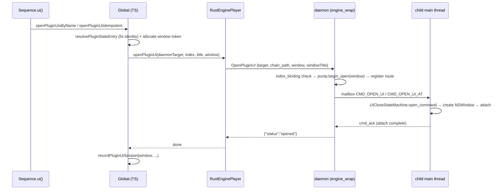
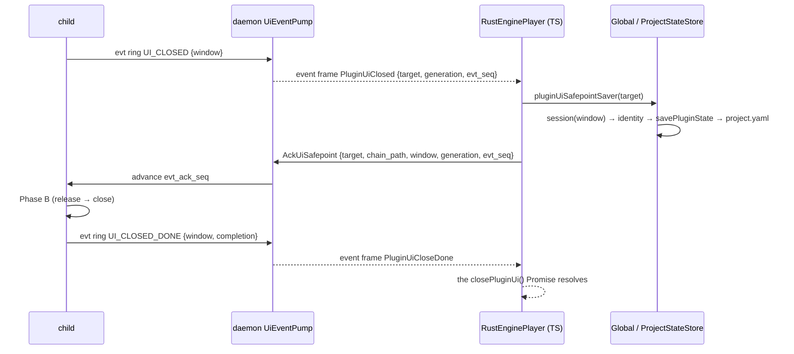

> **Note**: This page is a trace of the author's reading as of 2026-09-01. The code is the truth; this page is only a snapshot of understanding at that time.

# PH-2. Plugin UI Hosting — from seq.ui() to a Window

PH-1 gave the overall picture of CLAP / VST3 plugins hosted as sandboxed out-of-process (OOP)
children. This chapter follows the path by which that child **opens the plugin's native UI
(its editor window)**. From writing `cb.ui()` in the score, to the plugin view being embedded in
an `NSWindow` owned by the child process, to the sound being saved when the window closes — this
is the full length of that wiring.

Four issues are involved: [#474](https://github.com/signalcompose/orbitscore/issues/474)
(the UI open/close body itself, P0–P6), [#617](https://github.com/signalcompose/orbitscore/issues/617)
(the DSL surface `seq.ui()`), [#628](https://github.com/signalcompose/orbitscore/issues/628)
(the move to the name form that came with racks, and multi-window support on the child side), and
[#633](https://github.com/signalcompose/orbitscore/issues/633) (making the daemon-side UI pump
per-window). The normative specs are `docs/specs-v2/PLUGIN_UI_HOSTING_SPEC_v1.md` (UIH.n) and
PH.2c of the core spec; this chapter reads them side by side with the code.

## The DSL surface: `seq.ui([name][, open])`

Let us start from the surface the user touches. The example in core spec PH.2c is:

```js
var cb = init global.seq
cb.instrument("Kontakt 8.vst3")
cb.ui()                       // instrument の UI を開く（無引数 = instrument）
cb.ui("ValhallaRoom")         // 名前が一致する insert の UI（複数一致ならすべて開く）
cb.ui("ValhallaRoom", false)  // 閉じる

sum("strings").ui("Pro-Q 3")  // mixer bus の insert
aux("verb").ui("ValhallaRoom")
```

A point to note here is that **the first argument is a catalog-name string, not a numeric
index**. The initial #617 implementation (2026-08-26) addressed plugins by chain index, as in
`cb.ui(1)`, but #628 (2026-08-27) introduced rack-shaped effect chains (arrays and nested
`layer`), and the numeric form was withdrawn on the grounds that "a position cannot be addressed
by a one-dimensional index" (`SIGNAL_CHAIN_DSL_SPEC_v1.md` SC.10.10.1). Addressing by name is
**never ambiguous even when the same name appears more than once** — because it does not choose;
it opens all of them.

The implementation lives in `Sequence.ui()`.

```typescript
// packages/engine/src/core/sequence.ts:710-730
  async ui(catalogName?: string, open = true): Promise<this> {
    const name = this.stateManager.getName() || 'sequence'
    if (catalogName !== undefined && typeof catalogName !== 'string') {
      throw new Error(
        'ui() expects a catalog plugin name string; numeric indexes are not supported.',
      )
    }
    if (catalogName === undefined) {
      if (open) await this.global.openPluginUiIdempotent(name, 0)
      else await this.global.closePluginUi(name, 0)
    } else if (open) {
      // 🔴 冪等（#619 レビュー・F2b/R2）: ライブコーディングでは**ブロックの再評価が常態**で、
      // 楽譜に書いた `cb.ui()` は評価のたびに走る。冪等の規則（fast path + already-open の
      // catch・staleness 対策）は `openPluginUiIdempotent` の1箇所に集約してある。
      // MCP の `open_plugin_ui` は冪等にしない（明示操作なので二重 open は loud に落とす）。
      await this.global.openPluginUisByName(name, catalogName)
    } else {
      await this.global.closePluginUisByName(name, catalogName)
    }
    return this
  }
```

As you can see, `ui()` itself **creates no new path**. With no argument it targets index 0
(the instrument slot); with a name it simply delegates to `Global.openPluginUisByName`. The name
form enumerates every matching catalog element in the registered chain and calls the idempotent
open for each one.

```typescript
// packages/engine/src/core/global.ts:1129-1139
  async openPluginUisByName(receiverId: string, requestedName: string): Promise<void> {
    if (typeof requestedName !== 'string') {
      throw new Error(
        'ui() expects a catalog plugin name string; numeric indexes are not supported.',
      )
    }
    const normalized = normalizePluginInstanceName(requestedName)
    for (const index of this.catalogIndicesByName(receiverId, requestedName)) {
      await this.openPluginUiIdempotent(receiverId, index, normalized)
    }
  }
```

### Why only the DSL open is idempotent

In live coding, **re-evaluating a block of the score many times** is the norm. A line containing
`cb.ui()` runs on every evaluation, so if the second evaluation errored with "already open", a
perfectly legitimate action would turn red every time (the host-side error PH.2c describes as
"measured" is exactly `OPEN_UI requested while lifecycle is Open`). The DSL surface therefore goes
through `openPluginUiIdempotent`, which succeeds as a no-op when the UI is already open.

```typescript
// packages/engine/src/core/global.ts:1166-1174
  async openPluginUiIdempotent(
    receiverId: string,
    index: number,
    expectedName?: string,
  ): Promise<void> {
    if (this.hasOpenPluginUi(receiverId, index)) return
    const window = allocatePluginUiWindowToken()
    try {
      await this.openPluginUi(receiverId, index, expectedName, window)
```

By contrast, the MCP `open_plugin_ui` is an explicit "open it" command and is not idempotent; a
double open fails loudly. Close is not made idempotent on either surface (PH.2c). What
characterizes this design is that **the decision to vary semantics by path is placed in the TS
layer** while the same mechanism is shared underneath (design note #628 R9 rejects "implement the
idempotent open in the pump" because path-dependent semantics do not belong in a layer that has no
knowledge of the path).

## Why the UI lives in the child process

Before descending from the DSL, let us confirm the fundamental premise. **Why is the plugin UI
opened by the child process rather than by the daemon or the VS Code extension?**

The answer is a macOS constraint. The `NSApplication` runloop **must run on the process's first
thread (the main thread)**, and both VST3's `IPlugView` and CLAP's `clap_plugin_gui` carry the
rule "UI creation / destruction and state save / load happen on the main thread" (UIH.1 quotes the
primary sources). The plugin instance lives inside the child process, so only the child can open
its UI.

Before #474, however, the child ran its audio spin loop on the main thread. To open a UI, **audio
has to be moved to a dedicated thread and the main thread handed over to the Cocoa runloop**. That
is the "execution model change" of #474 P1 (2026-07-30), consolidated into the
`orbit-child-runtime` crate shared by the four children (`orbit-clap-effect-child` /
`orbit-clap-instrument-child` / `orbit-vst3-effect-child` / `orbit-vst3-instrument-child`) and
the `orbit-effect-rack-child` that #628 added.

```rust
// rust/crates/orbit-child-runtime/src/lib.rs:1-6
//! Shared execution model for the four out-of-process plugin children.
//!
//! On macOS the process main thread is given to an `NSApplication` runloop
//! (Accessory activation policy). A short main-runloop timer services the
//! command mailbox and process-liveness checks supplied by the child. Audio
//! processing runs on one dedicated user-interactive QoS thread.
```

The main-thread side brings up `NSApplication` with the **Accessory** policy (no Dock icon, but
windows and keyboard input are possible) and invokes a service callback periodically via
`NSTimer`.

```rust
// rust/crates/orbit-child-runtime/src/lib.rs:481-497
        let app = NSApplication::sharedApplication(mtm);
        if !app.setActivationPolicy(NSApplicationActivationPolicy::Accessory) {
            coordinator
                .stop_audio
                .store(true, std::sync::atomic::Ordering::Release);
            return Err(ChildRuntimeError::AccessoryPolicyRejected);
        }

        let timer = unsafe {
            NSTimer::timerWithTimeInterval_target_selector_userInfo_repeats(
                MAIN_TICK_INTERVAL.as_secs_f64(),
                &target,
                sel!(tick:),
                None,
                true,
            )
        };
```

```rust
// rust/crates/orbit-child-runtime/src/lib.rs:110-113
/// Main-runloop service interval. Mailbox commands and liveness changes are
/// control-plane work, so 20 ms avoids a busy main thread while remaining
/// responsive enough for UI commands.
pub const MAIN_TICK_INTERVAL: Duration = Duration::from_millis(20);
```

What does the child do on each 20 ms tick? Looking at `service_child_main`, it reads the command
mailbox (the `cmd_*` group of `SharedRegion` we saw in PH-1), dispatches `CMD_SAVE_STATE` to state
saving and `CMD_OPEN_UI` / `CMD_CLOSE_UI` to the UI service, and finally advances the UI state
machine by one tick.

```rust
// rust/crates/orbit-child-runtime/src/lib.rs:90-108
pub unsafe fn service_child_main<E: std::fmt::Display>(
    region: *mut orbit_audio_sandbox::SharedRegion,
    ui: &UiService,
    capture_state: impl FnOnce() -> Result<Vec<u8>, E>,
) -> bool {
    unsafe {
        orbit_audio_sandbox::service_command_mailbox(region, |kind, arg| match kind {
            orbit_audio_sandbox::CMD_SAVE_STATE => {
                Some(orbit_audio_sandbox::save_state_command(arg, capture_state))
            }
            orbit_audio_sandbox::CMD_OPEN_UI | orbit_audio_sandbox::CMD_CLOSE_UI => {
                Some(ui.handle_command(kind, arg))
            }
            _ => None,
        });
    }
    ui.tick(ui.now());
    false
}
```

The audio thread never looks at the mailbox or the event ring (UIH.2 rule 1). The CAP.5
assignment — "the audio thread does `process` only; everything else is main" — is reflected
directly in the code structure.

Incidentally, P1 had an incident where the real-machine latency gate regressed by roughly 118x
and the UIH.7 stop condition fired (WORK_LOG 6.335). The root cause: "`NSApplication.stop(None)`
called from an `NSTimer` callback does not make `-[NSApplication run]` return" — `stop` is a flag
meaning "exit once the current NSEvent finishes processing", and a timer firing is not an NSEvent,
so a headless Accessory child never reached the check point and teardown fell through the 2-second
reap timeout into SIGKILL. The fix was the standard Cocoa idiom of posting a dummy
`NSEventTypeApplicationDefined`. Unit tests were all green; only the real-machine gate caught it.

## The full wiring: DSL → TS → daemon → child

Now let us follow the whole path from the `cb.ui()` call to the window appearing.



### The TS layer: fixing the identity and the window token

`Global.openPluginUi` first resolves the **volatile position** `(receiver, index)` into the SC.5
instance identity (`instanceId`) and the daemon target. As UIH.5 stresses, "a positional address is
not a registry key": the index shifts on every block re-evaluation, so **the identity at open time
is fixed as the save target** and is never re-resolved for later close / save.

When sending to the daemon, a window title and a **window token** are attached.

```typescript
// packages/engine/src/core/global.ts:1244-1250
    try {
      await this.audioEngine.openPluginUi(
        resolved.daemonTarget,
        index,
        `OrbitScore — ${actualName} (${receiverId}:${index})`,
        window,
      )
```

The window token is a stable identifier for "one open window", introduced in #633 and allocated
by TS on every open.

```typescript
// packages/engine/src/audio/rust-engine/plugin-ui-window-token.ts:17-27
export function allocatePluginUiWindowToken(): number {
  if (nextCounter >= COUNTER_LIMIT) {
    throw new Error('plugin UI window token counter exhausted for this engine process')
  }
  const token = BOOT_NAMESPACE * COUNTER_LIMIT + nextCounter
  nextCounter += 1
  if (!Number.isSafeInteger(token)) {
    throw new Error('plugin UI window token exceeded the JSON safe-integer range')
  }
  return token
}
```

The upper part is a 32-bit random namespace that changes on every start and the lower 21 bits are
a monotone counter, so a token is never reused within one TS process. If only TS restarts while the
daemon survives, the collision probability is 1 / 2^32, and the daemon additionally refuses "reuse
of a token that is in use" loudly, so even a collision does not become a silent misattribution.

On a successful open, TS records one entry in its session ledger. The key is the window token.

```typescript
// packages/engine/src/core/global.ts:60-66
type PluginUiSession = {
  window: number
  receiverId: string
  instanceId: string
  indexAtOpen: number
  resolved: ResolvedPluginStateTarget
}
```

`indexAtOpen` is, as the name says, "the index at open time" and is for display and logging only.
It is not used for attribution (the reason for this distinction is covered in detail in the #633
section below).

### The wire: `OpenPluginUI` / `ClosePluginUI` / `AckUiSafepoint`

The TS → daemon wire simply adds three methods to the existing JSON request/response protocol; the
target vocabulary is the same `{role, bus?, instance?}` shape as `GetPluginState`.

```typescript
// packages/engine/src/audio/rust-engine/daemon-client.ts:630-643
  /** OPEN_UI の daemon 応答は view attach 完了後にだけ返る。 */
  async openPluginUi(
    target: PluginStateSaveTarget,
    index: number,
    windowTitle: string,
    window: number,
  ): Promise<void> {
    await this.request('OpenPluginUI', {
      target: this.wirePluginTarget(target),
      chain_path: this.pluginChainPath(target, index),
      window,
      windowTitle,
    })
  }
```

Note that `chain_path` and `window` travel as **separate fields**. The former is "which stage is
being pointed at right now" (destination); the latter is "which window this is about"
(attribution). This two-layer separation is the heart of #633.

### The daemon layer: `open_outproc_plugin_ui`

When the daemon's `engine_wrap.rs` receives `OpenPluginUI`, it (1) checks that the child is READY,
(2) for a rack child, checks `index_binding` (current index → token) for an existing binding,
(3) reserves the lifecycle as `Opening` via `UiEventPump::begin_open(window)`, (4) registers
`window → PluginUiTarget` in the route registry, and then (5) posts `CMD_OPEN_UI` (single-plugin
child) or `CMD_OPEN_UI_AT` (rack child, with a JSON argument `{"index", "title", "window"}`) to
the command mailbox. Every failure path rolls the reservation back.

`OPEN_UI` is a completion-type command that **acks when the view attach completes**; the daemon's
response `{"status": "opened"}` is not returned until "the window exists". This contrasts with
`CLOSE_UI` (acked on acceptance), described later.

### The child layer: `UiService` and `WindowShell`

On the child side, `CMD_OPEN_UI` is received by `UiService` in `orbit-child-runtime`. It pairs the
AppKit-independent state machine `UiCloseStateMachine` (next section but one) with `UiActions`,
an implementation of its `UiHostActions` trait in terms of AppKit / VST3 / CLAP. `open_ui` obtains
the size from the plugin's `begin_open` (for VST3: `createView("editor")` → `setFrame` →
`getSize`), creates an `NSWindow` via `WindowShell`, sets the title, and embeds the view into the
content view via `attach`. Calling VST3's `setFrame` before `attached` is a UIH.4 rule, grounded in
the SDK text saying "the plug-in could request a resize during attach".

The most important thing in the `WindowShell` delegate is that **`windowShouldClose` always
returns `NO`**.

```rust
// rust/crates/orbit-child-runtime/src/window.rs:36-42
        #[unsafe(method(windowShouldClose:))]
        fn window_should_close(&self, _sender: &NSWindow) -> bool {
            // The callback enters (or defers entry into) the close state machine. AppKit
            // never owns destruction: every callback path returns NO, and Phase B later
            // calls NSWindow::close directly.
            (self.ivars().close_callback)()
        }
```

Even when the close button is pressed, AppKit is not allowed to destroy the window. Instead, a
"close request" is handed to the state machine, and only after the save (the safepoint) completes
does the child itself call `close()`.

```rust
// rust/crates/orbit-child-runtime/src/window.rs:188-196
    /// Close without consulting `windowShouldClose`; Phase B already authorized destruction.
    pub fn close(&mut self) {
        let Some(window) = self.window.take() else {
            return;
        };
        window.setDelegate(None);
        window.close();
        self.delegate = None;
    }
```

Using `close()` rather than `performClose:` is also normative. With `performClose:`, AppKit would
consult `windowShouldClose` again; the machine is still `Closing`, so it would return `NO`, the
close would be cancelled, and the window would remain forever (WORK_LOG 6.344).

## The evt ring and `dirty_epoch` — sealing ordering with types

If all we needed was to "open" a UI, the host → child mailbox would suffice. The hard part is the
"close" side. Close requests can originate on the child (the close button, CLAP's `closed()`), so a
**lossless child → host event path** is required. That is the evt ring added to `SharedRegion` in
#474 P2.

```rust
// rust/crates/orbit-audio-sandbox/src/transport.rs:265-277
    // ── #474 P2: child → host の取りこぼし不可イベントリング（UIH.2a）。
    /// child -> host: 新規イベント投函時に単調増加。0 = 未発行。
    pub evt_seq: ReleaseAcquireSeq,
    /// child -> host: per-slot イベント種別（[`EVT_UI_CLOSED`] / [`EVT_UI_CLOSED_DONE`]）。
    pub evt_kind: [AtomicU32; EVT_SLOTS],
    /// child -> host: per-slot 固定長引数域（NUL 終端 UTF-8）。
    pub evt_arg: [[u8; EVT_ARG_BYTES]; EVT_SLOTS],
    /// host -> child: host 側処理が完結した最新の `evt_seq`。
    ///
    /// `s` は「`s` 以下の全イベントが完結済み」を意味するため、host は seq 順にのみ進める。
    pub evt_ack_seq: ReleaseAcquireSeq,
    /// child -> host: plugin dirty 通知の累積回数。respawn ではリセットしない。
    pub dirty_epoch: MonotoneEpoch,
```

Only two event kinds ride the ring: `UI_CLOSED` and `UI_CLOSED_DONE`. The slot count is 2, derived
from the occupancy bound "at most `UI_CLOSED` 1 + `UI_CLOSED_DONE` 1 = 2 can be in flight within one
close cycle" (a derivation entirely separate from the audio pipeline's `SLOTS`).

```rust
// rust/crates/orbit-audio-sandbox/src/transport.rs:79-87
/// child → host の取りこぼし不可イベント用 slot 数（UIH.2a）。
///
/// audio pipeline の [`SLOTS`] とは導出根拠が異なる。1 close cycle で同時に in-flight に
/// なりうる `UI_CLOSED` + `UI_CLOSED_DONE` の2件から固定される。
pub const EVT_SLOTS: usize = 2;

// spec (PLUGIN_UI_HOSTING_SPEC_v1.md) の 🔴 `EVT_SLOTS >= 2`(連続 seq が必ず別 slot を指す
// 不変条件)の床。鏡像元 `SLOTS` の const assert と同じ役目を evt 側でも compile-time に固定する。
const _: () = assert!(EVT_SLOTS >= 2);
```

### `ReleaseAcquireSeq`: an API that cannot be handed an Ordering

`evt_arg` is a non-atomic `[u8; N]`, so for the host to read correctly what the child wrote, a
Release / Acquire pair on both the publish and the read side is **mandatory** (without it, this is
a cross-process data race, i.e. UB). What is interesting is that this is **guarded by types, not by
tests**.

```rust
// rust/crates/orbit-audio-sandbox/src/transport.rs:359-378
    #[repr(transparent)]
    pub struct ReleaseAcquireSeq(AtomicU64);

    impl ReleaseAcquireSeq {
        /// 非 atomic payload を書き終えた後に seq を公開する。Release store 固定。
        pub fn publish(&self, seq: u64) {
            self.0.store(seq, Ordering::Release);
        }

        /// 対岸の [`Self::publish`] と synchronizes-with する読み。Acquire load 固定。
        pub fn read(&self) -> u64 {
            self.0.load(Ordering::Acquire)
        }

        /// このフィールドの唯一の書き手自身による読み。自分の store とは program order で
        /// 整合するため Relaxed で十分（対岸の payload とは同期しない点に注意）。
        pub fn load_own(&self) -> u64 {
            self.0.load(Ordering::Relaxed)
        }
    }
```

The inner `AtomicU64` is invisible outside the submodule, so a deviation such as
`evt_seq.store(seq, Ordering::Relaxed)` **does not compile**. According to WORK_LOG 6.337, the test
Codex initially wrote to "verify the Release / Acquire pair" was a tautology: mutating the publish
site to `Relaxed` left every test green. So the guard was moved from tests into the type (proven
with two mutations: `E0599: no method named 'store'` and `E0616: field '0' is private`).

There is one thing types cannot guard, though: the program order "finish writing the payload,
then call `publish`". The child-side publisher `EventRingChild::service` keeps that order while
checking the slot-reuse invariant (`evt_ack_seq >= s - EVT_SLOTS`) before publishing.

```rust
// rust/crates/orbit-audio-sandbox/src/transport.rs:512-538
    pub unsafe fn service(
        &mut self,
        region: *mut SharedRegion,
    ) -> Result<usize, EventRingChildError> {
        let mut published_count = 0;
        while let Some(event) = self.pending.front() {
            let previous = unsafe { (*region).evt_seq.load_own() };
            let seq = previous
                .checked_add(1)
                .ok_or(EventRingChildError::SequenceExhausted)?;
            let reusable_after = seq.saturating_sub(EVT_SLOTS as u64);
            let ack = unsafe { (*region).evt_ack_seq.read() };
            if ack < reusable_after {
                break;
            }

            let index = evt_slot_index(seq);
            unsafe {
                (*region).evt_kind[index].store(event.kind, Ordering::Relaxed);
                std::ptr::write(std::ptr::addr_of_mut!((*region).evt_arg[index]), event.arg);
                (*region).evt_seq.publish(seq);
            }
            self.pending.pop_front();
            published_count += 1;
        }
        Ok(published_count)
    }
```

What matters is that when the invariant is false, it `break`s and **returns with the head event
retained**. "Cannot publish" does not mean "drop"; it retries on the next main-runloop tick. If
`UI_CLOSED_DONE` were dropped, the completion check of MCP `close_plugin_ui` would never close
(UIH.2a).

The host-side `EventRingHost::poll` reads from `evt_ack_seq + 1` in seq order and advances the ack
only for events whose handler returned `true`. Skipping ahead is structurally impossible. The poll
is also guarded by a CAS gate: re-entering it from inside a handler fails loudly with `Err` instead
of deadlocking (a discipline ported from the mailbox side in WORK_LOG 6.340).

### `dirty_epoch` does not ride the ring

A plugin's "state changed" notification (VST3 `setDirty` / CLAP `mark_dirty`) is not an event but a
**level**. Only "has there been at least one since the last observation" carries meaning, and it
may coalesce. So it is carried not on the ring but as the monotone counter `dirty_epoch`.

This decision was owner-approved in the spec-first step of #474 P2 (WORK_LOG 6.336), and the
deciding factor was a latent contradiction inside the spec itself. UIH.2a policy 3 says "advancing
the ack = host-side processing has completed", but it never defined what "completion" means for
dirty; if it were the debounce completion, the ack for a subsequent `UI_CLOSED` would be coupled to
the debounce window. Taking dirty off the ring **removes the very need to define it**. As a side
effect, the `EVT_SLOTS` occupancy bound dropped from 3 to 2.

One more thing to note: `dirty_epoch` is **not reset on respawn**. The evt ring is reset, because
unprocessed events from the previous incarnation would cross wires, but `dirty_epoch` is a level
against which the host keeps `last_seen`; resetting it to 0 would silently drop dirty
notifications until the counter exceeds the host's `last_seen` (say, 42) again. Monotone and
non-reset, that failure class does not exist structurally.

## The close state machine — `Closed` is defined by a drain condition

The body of the close side is the `orbit-child-ui` crate. It is pure Rust with no dependency on
AppKit, VST3, or CLAP; every platform operation sits behind the `UiHostActions` trait. This split
was a decision of #474 P3a (2026-07-31), made so that most of the UIH.8 mutation-verification items
could be killed by unit tests.

There are three states, `Closed → Open → Closing → Closed`, and three entry paths for a close
request.

| Path | Origin | Entry method |
|---|---|---|
| ① the `NSWindow` close button | child | `window_should_close` (always returns `false`) |
| ② the `CLOSE_UI` command | host | `close_command` (acked on acceptance) |
| ③ CLAP `closed(was_destroyed)` | child (thread-safe → marshalled to main) | `clap_closed` |

All three paths converge on `begin_close`, whose **single reentry guard** guarantees "the
safepoint fires exactly once".

```rust
// rust/crates/orbit-child-ui/src/lib.rs:321-342
    fn begin_close(
        &mut self,
        now: Duration,
        was_destroyed: bool,
        actions: &mut impl UiHostActions,
    ) -> CloseRequestDisposition {
        // This state check is the single reentry guard shared by all three paths.
        if !matches!(self.state, MachineState::Open) {
            return CloseRequestDisposition::AlreadyClosing;
        }

        // The seam is non-blocking and does not reenter the machine, so the sequence can
        // be resolved before the transition instead of patching the state afterwards.
        // A `None` here just means the ring was full; `tick` retries it.
        let ui_closed_seq = actions.try_publish_event(UiEvent::UiClosed);
        self.state = MachineState::Closing(ClosingState {
            started_at: now,
            was_destroyed,
            ui_closed_seq,
        });
        CloseRequestDisposition::Started
    }
```

This is **Phase A** of UIH.4c. It publishes `UI_CLOSED`, transitions to `Closing`, and **returns
without waiting**. The reason it must not wait is in UIH.2a policies 1 and 2 — the child's main
thread is also the thread that processes the host's reply (the `SAVE_STATE` command), so blocking
here always deadlocks. The spec records that it actually did deadlock once.

### Phase B: once the seq of `UI_CLOSED` itself is acked

Phase B begins inside `tick` upon observing `evt_ack_seq >= ui_closed_seq` (the seq of the
`UI_CLOSED` this cycle published has been completed on the host side).

```rust
// rust/crates/orbit-child-ui/src/lib.rs:268-319
    pub fn tick(&mut self, now: Duration, actions: &mut impl UiHostActions) {
        if matches!(self.state, MachineState::Closed) {
            self.try_publish_close_events(actions);
            return;
        }

        let phase_b = match &mut self.state {
            MachineState::Closing(closing) => {
                if closing.ui_closed_seq.is_none() {
                    closing.ui_closed_seq = actions.try_publish_event(UiEvent::UiClosed);
                }

                let safepoint_completed = closing
                    .ui_closed_seq
                    .is_some_and(|ui_closed_seq| actions.event_ack_seq() >= ui_closed_seq);
                let timed_out = now.saturating_sub(closing.started_at) >= self.close_timeout;

                if safepoint_completed {
                    Some((
                        closing.was_destroyed,
                        CloseCompletion::SafepointCompleted,
                        false,
                    ))
                } else if timed_out {
                    Some((
                        closing.was_destroyed,
                        CloseCompletion::TimedOutWithoutSave,
                        closing.ui_closed_seq.is_none(),
                    ))
                } else {
                    None
                }
            }
            MachineState::Closed | MachineState::Open => None,
        };

        let Some((was_destroyed, completion, pending_ui_closed)) = phase_b else {
            return;
        };

        debug_assert!(
            self.pending_done.is_none(),
            "a prior UI_CLOSED_DONE must not be overwritten at the Phase B boundary"
        );
        // Phase B ordering is normative: plugin release precedes parent-window destroy.
        actions.release_plugin_ui(was_destroyed);
        actions.destroy_window();
        self.state = MachineState::Closed;
        self.pending_ui_closed = pending_ui_closed;
        self.pending_done = Some(completion);
        self.try_publish_close_events(actions);
    }
```

Three points to take from this.

1. **The trigger is reaching the seq of `UI_CLOSED` itself, not "the ack advanced".**
   `evt_ack_seq` is a single counter shared by all events, so it also advances on the ack of the
   previous cycle's `UI_CLOSED_DONE`. Starting the release on that would tear down the UI before the
   save had even run (= loss of the sound). WORK_LOG 6.342 records that Codex's first draft had an
   off-by-one, `ui_closed_seq.saturating_sub(1)`, which main caught while monitoring the
   implementation.
2. **On timeout (`UI_CLOSE_TIMEOUT` = 10 seconds) the close is completed without saving.** If the
   host stalls and no ack arrives, the machine does not linger in `Closing` indefinitely. In that
   case the completion reason is carried as `TimedOutWithoutSave` in the `UI_CLOSED_DONE` argument,
   so the host can tell the two apart.
3. **The release order is normative.** The plugin-side `release` (VST3 `removed()` / CLAP
   `hide()` → `destroy()`) is called before the parent window is destroyed. On the CLAP path with
   `was_destroyed=true`, `hide()` is not called on an already-destroyed GUI.

```rust
// rust/crates/orbit-child-runtime/src/ui_service.rs:22-23
/// Maximum time Phase B waits for the host to complete the `UI_CLOSED` safepoint.
pub const UI_CLOSE_TIMEOUT: Duration = Duration::from_secs(10);
```

### The meaning of `Closed` — the drain gate

Let us also look at the acceptance condition for `OPEN_UI`.

```rust
// rust/crates/orbit-child-ui/src/lib.rs:203-225
    /// Handle `OPEN_UI`.
    ///
    /// Acceptance is exactly the drain gate: state is `Closed` and the event backend
    /// reports pending count zero with equal ack/publish cursors.
    pub fn open_command(&mut self, actions: &mut impl UiHostActions) -> CommandAck {
        // Open と「開いていない拒否」（Closing / ring 未 drain）は detail を分ける。
        // 同じ文言に潰すと、TS 側の冪等 open が「開いていないのに成功扱い」へ倒れる
        // （PR #619 R4 で実際に起きた取り違え）。
        if matches!(self.state, MachineState::Open) {
            return CommandAck::new(false, ALREADY_OPEN_DETAIL);
        }
        if !matches!(self.state, MachineState::Closed) || !actions.is_event_ring_drained() {
            return CommandAck::new(false, CLOSING_IN_PROGRESS_DETAIL);
        }

        match actions.open_ui() {
            Ok(()) => {
                self.state = MachineState::Open;
                CommandAck::new(true, "")
            }
            Err(detail) => CommandAck::new(false, detail),
        }
    }
```

"The state machine is in `Closed`" alone does not permit a reopen. It additionally requires that
**the ring is drained (zero pending events and `evt_ack_seq == evt_seq`)**. This formulation was
fixed in the spec-first step of #474 P3 (WORK_LOG 6.341, 2026-07-31); before that, the spec said
"`OPEN_UI` during `Closed` is also a failure ack". Read literally, the initial state is also
`Closed`, so the UI could never be opened even once — with the drain condition, the initial state
(`0 == 0`, pending empty) trivially satisfies it, and the contradiction disappears.

And since only two kinds ride the ring, "drain complete" is equivalent to "the previous cycle's
`UI_CLOSED_DONE` has completed on the host". No individual seq needs to be recorded; the child can
decide this on its own by Acquire-reading `evt_ack_seq`. **Defining the meaning of `Closed` by the
drain condition** also brought the by-product that the `EVT_SLOTS = 2` occupancy derivation holds
without exception.

The reason `ALREADY_OPEN_DETAIL` and `CLOSING_IN_PROGRESS_DETAIL` are distinct strings is as the
comment says. The TS idempotent open treats only `already-open` as success and lets
`closing-in-progress` (cannot open yet = not open) fall through as a throw. Collapsing them into
one string would tip into "treated as success although not open" — the mix-up that actually
happened in PR #619 R4.

## Safepoint (b): closing the window saves the sound

So far the child side has reached "publish `UI_CLOSED` and wait for the ack". Who advances that
ack? The "host" in UIH is actually **two processes, the daemon and the engine (TS)**, and the
substance of saving (sidecar → atomic rename → `project.yaml` registration) lives in TS's
`ProjectStateStore`. Advancing the ack therefore spans daemon and TS.



The daemon's `UiEventPump::poll_step` reads the ring on every watchdog tick; when it finds
`UI_CLOSED`, it enqueues a `Safepoint` notification into a non-blocking sink and **returns
`false`** (= does not ack; stops at the ring head).

```rust
// rust/crates/orbit-audio-sandbox/src/transport.rs:1213-1225
/// [`UiEventPump::poll_step`] が daemon の非ブロッキング sink へ渡す固定通知。
#[derive(Debug, Clone, Copy, PartialEq, Eq)]
pub enum UiPumpNotification {
    Safepoint {
        generation: u64,
        evt_seq: u64,
        window: UiWindowKey,
    },
    CloseDone {
        completion: UiCloseCompletion,
        window: UiWindowKey,
    },
}
```

The notification reaches TS on the existing WebSocket event frame.

```rust
// rust/crates/orbit-audio-daemon/src/protocol.rs:79-81
pub const EVENT_PLUGIN_UI_CLOSED: &str = "PluginUiClosed";
pub const EVENT_PLUGIN_UI_CLOSE_DONE: &str = "PluginUiCloseDone";
pub const EVENT_PLUGIN_UI_CLOSED_BY_RESPAWN: &str = "PluginUiClosedByRespawn";
```

The TS-side receiver is `RustEnginePlayer.onPluginUiClosed`. It is the "engine-side conductor"
that landed in #474 P4b (2026-07-31); it creates no new save mechanism and merely invokes the
existing save flow from the event.

```typescript
// packages/engine/src/audio/rust-engine/rust-engine-player.ts:653-681
  private readonly onPluginUiClosed = (raw: unknown): void => {
    this.enqueuePluginUiEvent(async () => {
      const data = wireObject(raw, 'PluginUiClosed data')
      const target = pluginUiTargetFromEvent(data)
      const generation = eventNonNegativeInteger(data.generation, 'generation')
      const evtSeq = eventNonNegativeInteger(data.evt_seq, 'evt_seq')
      if (!this.pluginUiSafepointSaver) {
        throw new Error(
          `cannot save ${JSON.stringify(target)}: no project-state safepoint saver is registered`,
        )
      }
      try {
        await this.pluginUiSafepointSaver(target)
      } catch (error) {
        console.error(
          `[plugin-ui] safepoint save failed for ${JSON.stringify(target)}; ` +
            `AckUiSafepoint was not sent: ${error instanceof Error ? error.message : String(error)}`,
        )
        return
      }
      await this.daemon.ackUiSafepoint(
        pluginStateTarget(target),
        target.index,
        target.window ?? 0,
        generation,
        evtSeq,
      )
    })
  }
```

Two important design decisions are here.

- **If the save fails, no ack is sent.** It bails out with `return` and only logs loudly. The
  daemon does not advance `evt_ack_seq`, and the child's 10-second timeout becomes the escape
  route. This avoids creating a path where "it failed but looks like it succeeded".
- **`generation` / `evt_seq` are returned as received.** If the engine recomputed them, a close
  right after a respawn could ack the safepoint of a different incarnation. `generation` is the
  per-child generation number held by `UiEventPump`, incremented only by the respawn reset.

`enqueuePluginUiEvent` is a Promise chain that serializes UI events in the daemon's `evt_seq`
order, completing save and ack in order before moving on.

### Close completion is "DONE received", not "ack"

When does the caller of `closePluginUi` return? The daemon's `ClosePluginUI` response is
**Phase A acceptance only**.

```rust
// rust/crates/orbit-audio-daemon/src/session.rs:2206-2207
                    // This is explicitly Phase A acceptance, never close completion.
                    Ok(Ok(())) => ok(&id, json!({"status": "accepted"})),
```

TS separately waits for the `UI_CLOSED_DONE` event frame. Moreover, it registers the DONE waiter
**before sending `CLOSE_UI`**: the event pump and the command response run as independent tasks on
the daemon side, so DONE can overtake the ack.

```typescript
// packages/engine/src/audio/rust-engine/rust-engine-player.ts:883-897
    try {
      // Register the DONE waiter before issuing CLOSE_UI: the event pump and
      // command response use independent tasks, so DONE may race the ack.
      const accepted = this.daemon.acceptClosePluginUi(target, index, window)
      await Promise.race([accepted, done.then(() => undefined)])
    } catch (error) {
      if (pendingEntry) {
        this.pendingPluginUiCloses.delete(pendingEntry)
        clearTimeout(pendingEntry.timer)
      }
      throw error
    }
    // The daemon response above is Phase A acceptance only. This await is the
    // sole close-completion condition exposed to callers.
    return done
```

If the DONE `completion` was `timeout-without-save`, `Global.closePluginUi` acknowledges that the
window is gone, discards the session, and then **returns "the state was not saved" as an error**.
If the child disappeared through a respawn, `PluginUiClosedByRespawn` rejects the pending close,
and "save completed" is never falsely returned (main's mutation verification in WORK_LOG 6.348
found this hole and added a test).

```typescript
// packages/engine/src/audio/rust-engine/rust-engine-player.ts:331-332
const PLUGIN_UI_OPEN_TIMEOUT_MS = 30_000
const PLUGIN_UI_CLOSE_TIMEOUT_MS = 20_000
```

Open times out after 30 seconds and the DONE wait on close after 20 seconds. That they exceed the
child's `UI_CLOSE_TIMEOUT` (10 seconds) reads as leaving room for the timeout-path
`UI_CLOSED_DONE` to arrive, but I could not find a primary source stating the rationale for these
numbers.

> NOTE: unverified — needs confirmation (the rationale for choosing 20 s / 30 s)

## The per-window UI pump (#628 → #633) — the "unmeasured" hypothesis confirmed by measurement

Everything up to this point was, at the completion of #474 (2026-08-01), **one child = one
window**. `UiEventPump` held a single per-child `UiPumpState`, and `begin_open` loudly rejected
`lifecycle != Closed`.

What changed the situation was the rack work in #628. One rack child now runs N stages in series,
as in `seq.effect(["A", "A"])`, and SC.10.10.1 decreed that "`ui("name")` opens everything that
matches". The child side was made multi-window with indexed `UiService` (`new_indexed`) and the
shared event publisher `UiEventHub`, but **the daemon side stayed a single lifecycle** — an
asymmetry remained.

### A real bug: even the first close jams the ring

The record in WORK_LOG 6.387b (2026-08-28) is vivid. The child sends
`{"index":0,"completion":"safepoint-completed"}`, but the daemon's DONE arm **accepts only an exact
match** of `Some("safepoint-completed")`. Closing a rack child's UI produced a Protocol error even
on the first window, and the head of the event ring jammed permanently. On a real machine that
error flooded at 25 ms intervals and saturated the daemon.

This defect passed 699 green tests, clippy exit 0, and six red mutation kinds. The child-side
multiplexing was proven by unit tests, the daemon-side acceptance was proven by unit tests, and
**only the layer joining the two had been touched by nobody**. The record notes that this added one
more instance of CLAUDE.md's "what breaks is the wiring, and wiring is visible only in E2E".

### Two-layer separation of attribution and destination

Revision 1 of the fix design (`docs/archive/design/628-ui-pump-per-index-design.md`, drafted by Fable)
took "the index of an open UI is invariant" as an invariant and had TS automatically close, before
APPLY, the UI of any stage whose index would shift. The owner sent it back.

> 開いてるのを勝手に閉じたり開いたりするってこと？それなら受容できない。
> **開いてるものはユーザーが閉じるまでそのまま開いてるべきで、閉じてるものは
> ユーザーの違う操作で勝手に開いたりしたらダメ**ですよね？

From then on these two points (**C-A**: an open UI stays open until the user closes it / **C-B**:
a closed UI does not open on its own through some other user action) became design constraints.
The essence of the problem was "open windows were being addressed and attributed by position
(index)": as long as position is the key, the coexistence of chain editing and open UIs is either
"don't move it" (= auto-close = a C-A violation) or "follow it". Revision 2 therefore turned toward
**attributing by a stable identifier independent of position**.

| What | Keyed by |
|---|---|
| **Attribution** (event → session → save identity) | **window token**, immutable from open to close |
| **Destination** (command → stage) | **chain_path**, derived from the registered chain at issue time |

The daemon's `UiPumpState` thereby became a per-window map.

```rust
// rust/crates/orbit-audio-sandbox/src/transport.rs:1355-1374
#[derive(Debug, Default)]
struct UiPumpState {
    generation: u64,
    /// Engine へ通知済みで、`AckUiSafepoint` を待っている `UI_CLOSED`。
    pending_safepoint: Option<PendingSafepoint>,
    /// Window ごとの lifecycle と、遅着 ack を warn 付きで受理するための放棄水位。
    windows: BTreeMap<UiWindowKey, UiWindowState>,
}

#[derive(Debug, Clone, Copy, PartialEq, Eq)]
struct PendingSafepoint {
    window: UiWindowKey,
    evt_seq: u64,
}

#[derive(Debug)]
struct UiWindowState {
    lifecycle: UiLifecycle,
    abandoned_safepoint: Option<u64>,
}
```

Keeping `generation` per child is deliberate. There is one ring per child and a respawn rebuilds the
whole child, so "windows with different generations" cannot exist at the protocol level. Making it
per-window would create "N copies of one fact", i.e. the same kind of divergence-prone state that
caused this incident, the design note says. `pending_safepoint` also stays single, because
`poll_step` stops at the head on `UI_CLOSED` and so pending is structurally at most one.

The ack matching key became the triple `(generation, window, evt_seq)`; an ack claiming a different
window is rejected loudly. The event frame's `PluginUiTarget` also gained `window`.

```rust
// rust/crates/orbit-audio-daemon/src/engine_wrap.rs:9395-9408
/// WS event frame に載せる、解決済み plugin UI 宛先。
#[derive(Clone, Debug, Eq, PartialEq, serde::Serialize)]
pub struct PluginUiTarget {
    pub role: &'static str,
    #[serde(skip_serializing_if = "Option::is_none")]
    pub bus: Option<String>,
    #[serde(skip_serializing_if = "Option::is_none")]
    pub instance: Option<String>,
    /// Immutable open token used for event attribution. `index` below is the open-time position
    /// retained only for display/diagnostics and must never be used as an ownership key.
    #[serde(skip_serializing_if = "Option::is_none")]
    pub window: Option<u64>,
    pub index: u64,
}
```

`UiWindowKey` is `Option<u64>`, where `None` denotes non-indexed (instrument / legacy
single-plugin child). This lets the instrument path keep its observable behavior unchanged by
simply passing `None`.

### Checking the hypothesis marked "unmeasured" before implementing

The first row of the design note's §7 table rated the hypothesis "multiple closes × timeout
abandonment deadlocks the ring" as "confidence medium-to-high, assembled on paper, not measured".
The #633 brief turned this into a conditional: "before implementing, write the H2 reproduction
fixture and check whether it reproduces. If it does not, downgrade the gate to a defensive
implementation and note it in the design."

**The result was a reproduction** (WORK_LOG 6.413).

| Observation | Value |
|---|---|
| w1 `UI_CLOSED` | seq 1 (daemon ack stalled) |
| w2 `UI_CLOSED` | seq 2 |
| w1's DONE after timeout | cannot publish (seq 3 needs `evt_ack >= 1`) |
| ring state | `evt_seq=2 / evt_ack_seq=0` |
| daemon | repeats `Blocked { seq: 1 }` |

`EVT_SLOTS = 2` was derived from "two in flight per cycle", so when two windows enter their close
cycles at the same time, one of the DONEs cannot be published and the ring jams. Hence **the
close-cycle ordering gate is mandatory, not defensive**. That gate is the `open_cycle` of the
child-side `UiEventHub`.

```rust
// rust/crates/orbit-child-runtime/src/ui_service.rs:95-105
struct UiEventHubCore {
    region: *mut SharedRegion,
    event_ring: EventRingChild,
    queued_in_ring: Option<IndexedUiEvent>,
    pending: VecDeque<IndexedUiEvent>,
    published: Vec<(IndexedUiEvent, u64)>,
    /// `Some(window)` means this window's `UI_CLOSED` is published and no other window may
    /// publish until the matching DONE reaches the ring. The nested option preserves `None` as
    /// the legacy non-indexed window key.
    open_cycle: Option<UiWindowKey>,
}
```

Once a window's `UI_CLOSED` has been published, no other window may publish until that window's
DONE reaches the ring. The drain check is also performed over the whole hub, so while another
window's close cycle is in progress, `OPEN_UI` is rejected with `closing-in-progress`.

```rust
// rust/crates/orbit-child-runtime/src/ui_service.rs:197-203
    fn is_drained(&self) -> bool {
        self.open_cycle.is_none()
            && self.pending.is_empty()
            && self.queued_in_ring.is_none()
            && self.published.is_empty()
            && unsafe { self.event_ring.is_drained(self.region) }
    }
```

When a design carries "confidence" and "how to refute" columns, the work order can be written not
as "implement this" but as "check first, then implement according to the result" — the WORK_LOG
records this as the lesson.

## MCP and the REPL meta line — the E2E path

Finally, the paths from the editor (VS Code extension) and from MCP. #474 P4c (2026-08-01) added
the MCP tools `open_plugin_ui` / `close_plugin_ui` and the REPL meta line `//#pluginUi`. At design
time there were two lines, `//#openPluginUi` / `//#closePluginUi`, but the implementation merged
them into a single meta line whose JSON payload carries `action: 'open' | 'close'` (to carry
receiver names with spaces or symbols, the correlating `requestId`, and `expectedName` in one JSON
object).

The extension-side `PluginUiBridge` writes the meta line to the engine process's stdin and
correlates the `{"pluginUi": ...}` line that comes back on stdout by `requestId`.

```typescript
// packages/vscode-extension/src/plugin-ui-bridge.ts:90-98
      const fail = (error: Error): void => this.fail(input.requestId, error.message)
      try {
        const written = writeLine(`//#pluginUi ${JSON.stringify(input)}\n`, fail)
        if (written === false)
          this.fail(input.requestId, 'failed to write //#pluginUi to engine stdin')
      } catch (error) {
        this.fail(input.requestId, error instanceof Error ? error.message : String(error))
      }
    })
```

The stdout router in `extension.ts` picks up this result line by the `{"pluginUi"` prefix.

```typescript
// packages/vscode-extension/src/extension.ts:1500-1504
        } else if (trimmedLine.startsWith('{"pluginUi"')) {
          const parsed = isCurrent && pluginUiBridge.handleLine(rawLine)
          if (!parsed && isCurrent) {
            outputChannel?.appendLine(`⚠️ received a malformed //#pluginUi result line: ${rawLine}`)
          }
```

It has the same structure as `PluginStateBridge` (`//#savePluginState`) because the way the request
ID is carried is identical, and the engine's repl-mode shares one parser for both. The bridge
timeout is 35 seconds, longer than the engine-side 30 seconds for open / 20 seconds for close.

The MCP tool `open_plugin_ui` has a **misfire guard** called `expectedName`. If it does not match the
normalized name of the entity at `(receiver, index)`, the tool returns a loud error without sending
to the daemon, and the error text lists the currently valid indices (with role and normalized
name). If the index has shifted and a different plugin's UI were opened, the wrong plugin's sound
would be saved.

### The E2E oracle is `close_plugin_ui`

How does the real-machine E2E assert "the window opened"? The UI display is a visual side effect
that cannot be observed directly. So the gated E2E uses **`close_plugin_ui` as the oracle**. A
close fails with `no plugin UI opened via open_plugin_ui is recorded` when there is no session in
`openPluginUiSessions`, so if "open via DSL → close via MCP succeeds" passes, that proves the DSL
call really reached `Global.openPluginUi` and registered a session. Asserting on the return value
of `open_plugin_ui` would only say "the request was accepted".

E2E-1 of #633 inserts the same plugin twice, opens two windows with `ui("name")`, **closes the
second one first**, and then closes the first.

```typescript
// tests/e2e/orbitstudio-mcp-gated.spec.ts:2010-2032
      // Close the SECOND insert first. Under the old single-slot pump the
      // second open never happened, so this close has nothing to settle.
      const closeSecond = await activeClient.call('close_plugin_ui', {
        receiver: 'uiRackSeq',
        index: 2,
        expectedName: name,
      })
      expect(
        closeSecond.isError,
        `E2E-1 the second insert must have its own open window. ${closeSecond.text}`,
      ).toBe(false)
      await sleep(2000)

      // 完了条件 1: closing one window must not disturb the other's lifecycle.
      const closeFirst = await activeClient.call('close_plugin_ui', {
        receiver: 'uiRackSeq',
        index: 1,
        expectedName: name,
      })
      expect(
        closeFirst.isError,
        `E2E-1 closing the second window must leave the first open. ${closeFirst.text}`,
      ).toBe(false)
```

E2E-2 opens B's UI in `[A, B]`, drops A so that B shifts from index 2 to 1, and confirms that it
**can be closed at the new index**. One test thereby proves both the survival required by owner
principle C-A and that attribution follows the instance rather than the position.

Note that the #474 P6 design planned a second, independent path that confirms the window's
existence via `CGWindowListCopyWindowInfo`, but the P3b-2 real-machine verification found that it
requires Screen Recording permission (`CGPreflightScreenCaptureAccess`) and that TCC does not
propagate in an SSH session (WORK_LOG 6.344). This circumstance can be read as part of why the
primary oracle of the gated E2E is the close.

> NOTE: unverified — needs confirmation (a direct record of how the CGWindowList path was left out of the gated E2E)

## Failure modes

The failure modes readable from UIH.7 and the implementation, together with their escape routes.

| Failure | Behavior |
|---|---|
| The plugin has no UI / CLAP does not support embedded | `OPEN_UI` returns loudly as a `cmd_result` failure. No fallback to floating (UIH.4a) |
| `OPEN_UI` during `Closing` / with the ring not drained | Failure ack `closing-in-progress`. The DSL idempotent layer does not treat it as success either |
| `OPEN_UI` while already `Open` | The child says `already-open`; the daemon says `OPEN_UI requested while lifecycle is Open`. The DSL idempotent layer treats only this as a no-op success |
| `CLOSE_UI` during `Closing` / `Closed` | A **successful ack** with `already-closing` (without it the host would wait forever) |
| The host stalls and `evt_ack_seq` does not advance | The child completes the close without saving after 10 seconds and publishes a DONE with `timeout-without-save` |
| The TS save fails | No `AckUiSafepoint` is sent. It falls into the timeout path above, and the close caller receives an error |
| The child crashes during `Closing` → respawn | The host aborts the in-flight procedure; the registry is unchanged. `PluginUiClosedByRespawn` discards the TS session ledger immediately and rejects pending closes. The window is **not reopened automatically** (UIH.6) |
| The daemon cannot parse an indexed DONE arg | The real bug before #633. The ring head jammed permanently and errors flooded at 25 ms intervals |
| Two simultaneous closes where one DONE cannot be published | Prevented by the `UiEventHub.open_cycle` ordering gate (confirmed mandatory by measurement in #633) |
| `expectedName` mismatch | Not sent to the daemon; loud error plus the list of valid indices |

## Try it: open and close a UI with a minimal `.orbs`

The following is a minimal procedure assembled from PH.2c and the structure of the gated E2E. At
the time of writing, the author has not run it on a real machine to confirm it.

> NOTE: unverified — needs confirmation (the procedure below has not been run on a real machine)

```
var global = init GLOBAL
global.tempo(100)
global.beat(4 by 4)
global.start()

var cb = init global.seq
cb.instrument("Surge XT.clap")   // 手元のカタログにある UI 付き instrument 名に置き換える
cb.ui()                          // instrument の UI を開く（再評価しても no-op で成功する）
cb.ui(undefined, false)          // 閉じる → 保存セーフポイントが発火する
```

Re-evaluating only the `cb.ui()` line several times via `run_selection` and confirming that the
second and later evaluations do not error is the idempotency check. To confirm from MCP, check that
`close_plugin_ui({ receiver: "cb", index: 0 })` returns `completion: "safepoint-completed"` and that
`get_log` contains no `timeout-without-save`. The ERROR count comes from `get_log`'s fixed
500-line window, so the CLAUDE.md discipline is to compare before/after with `<=`.

To open an effect's UI by name, write `cb.ui("<CLAP effect name>")` after
`cb.effect(["<CLAP effect name>"])`. According to the E2E-2 comment, the VST3 test fixture returns
null from `IEditController::createView("editor")` when headless, so the target whose UI is opened
must be CLAP.

## Next exploration candidates

- `handle_ui_at` in `orbit-effect-rack-child` and the `set_index` / defensive close at APPLY commit
  (how the UI of a dropped stage is folded up and how `pending_stage_drops` keeps ticking until the
  close cycle completes)
- The `PluginUiEndpoint` implementations for VST3 and CLAP respectively (the `IPlugFrame::resizeView`
  → `onSize` callback, the main-thread marshalling of CLAP `request_resize`, and why `set_scale` is
  not called on cocoa)
- `UiEventPump::reset_after_child_exit` and `outproc_respawn_guard.rs` — the path that folds up all
  windows on respawn and delivers `ClosedByRespawn`, and the increment point of `generation`
- The save → close ordering in TS `Global` before `prepareInstrumentReplacement` / `applyRack` (the
  implementation of the C-A exception "disappearance of the target")
- Where the consumer of `dirty_epoch` (the #577 PR-C debounce checkpoint) actually calls
  `observe_dirty_epoch` — at the time of writing it still carries `#[allow(dead_code)]`
- The editor path that opens a UI from a plugin name via Cmd+Click (SC.10.10 rule 2; PH.2c notes it
  is to be implemented in #633)

## Sources

- `packages/engine/src/core/sequence.ts:674-694` — `Sequence.ui()` (no argument = instrument, name form, numeric rejection)
- `packages/engine/src/core/global.ts:60-66` — `PluginUiSession` (keyed by window token; `indexAtOpen` is display-only)
- `packages/engine/src/core/global.ts:1129-1139` — `openPluginUisByName` (enumerating every matching catalog element)
- `packages/engine/src/core/global.ts:1166-1174` — `openPluginUiIdempotent` (the DSL-surface idempotent open)
- `packages/engine/src/core/global.ts:1244-1250` — the window-title convention and token emission in `openPluginUi`
- `packages/engine/src/audio/rust-engine/plugin-ui-window-token.ts:17-27` — `allocatePluginUiWindowToken`
- `packages/engine/src/audio/rust-engine/daemon-client.ts:620-633` — the `OpenPluginUI` wire (`chain_path` and `window` are separate fields)
- `packages/engine/src/audio/rust-engine/rust-engine-player.ts:331-332` — open / close timeout constants
- `packages/engine/src/audio/rust-engine/rust-engine-player.ts:622-650` — `onPluginUiClosed` (no ack when the save fails)
- `packages/engine/src/audio/rust-engine/rust-engine-player.ts:852-866` — the DONE wait in `closePluginUi` (acceptance ≠ completion)
- `packages/vscode-extension/src/plugin-ui-bridge.ts:90-98` — writing the `//#pluginUi` meta line
- `packages/vscode-extension/src/extension.ts:1496-1500` — routing of `{"pluginUi"` result lines
- `packages/vscode-extension/src/mcp-server.ts:937-1000` — the `open_plugin_ui` / `close_plugin_ui` tool definitions
- `rust/crates/orbit-child-runtime/src/lib.rs:1-6` — the execution model (main = NSApplication runloop / audio = dedicated thread)
- `rust/crates/orbit-child-runtime/src/lib.rs:90-108` — `service_child_main` (mailbox dispatch + `ui.tick`)
- `rust/crates/orbit-child-runtime/src/lib.rs:110-113` — `MAIN_TICK_INTERVAL = 20 ms`
- `rust/crates/orbit-child-runtime/src/lib.rs:481-497` — the Accessory policy and `NSTimer`
- `rust/crates/orbit-child-runtime/src/window.rs:36-42` — `windowShouldClose` always returns `NO`
- `rust/crates/orbit-child-runtime/src/window.rs:188-196` — `WindowShell::close` (`performClose:` forbidden)
- `rust/crates/orbit-child-runtime/src/ui_service.rs:22-23` — `UI_CLOSE_TIMEOUT = 10 s`
- `rust/crates/orbit-child-runtime/src/ui_service.rs:95-105` — `UiEventHubCore.open_cycle` (close-cycle ordering gate)
- `rust/crates/orbit-child-runtime/src/ui_service.rs:197-203` — hub-wide drain check
- `rust/crates/orbit-child-ui/src/lib.rs:203-225` — `open_command` (drain gate; separated details)
- `rust/crates/orbit-child-ui/src/lib.rs:268-319` — `tick` (the Phase B trigger and release order)
- `rust/crates/orbit-child-ui/src/lib.rs:321-342` — `begin_close` (the reentry guard where three paths converge)
- `rust/crates/orbit-audio-sandbox/src/transport.rs:79-87` — `EVT_SLOTS = 2` and the const assert
- `rust/crates/orbit-audio-sandbox/src/transport.rs:265-277` — the evt ring and `dirty_epoch` fields of `SharedRegion`
- `rust/crates/orbit-audio-sandbox/src/transport.rs:359-378` — `ReleaseAcquireSeq` (ordering fixed by the type)
- `rust/crates/orbit-audio-sandbox/src/transport.rs:512-538` — `EventRingChild::service` (slot-reuse invariant; retain and retry)
- `rust/crates/orbit-audio-sandbox/src/transport.rs:1213-1225` — `UiPumpNotification`
- `rust/crates/orbit-audio-sandbox/src/transport.rs:1355-1374` — the per-window `UiPumpState`
- `rust/crates/orbit-audio-daemon/src/protocol.rs:79-81` — UI event frame names
- `rust/crates/orbit-audio-daemon/src/session.rs:2015-2016` — `ClosePluginUI` is Phase A acceptance only
- `rust/crates/orbit-audio-daemon/src/engine_wrap.rs:6470-6560` — `open_outproc_plugin_ui` (binding check → `begin_open` → route → mailbox)
- `rust/crates/orbit-audio-daemon/src/engine_wrap.rs:8802-8815` — `PluginUiTarget` (`window` = attribution, `index` = display-only)
- `tests/e2e/orbitstudio-mcp-gated.spec.ts:1767-1789` — #633 E2E-1 (using close as the oracle)
- [`docs/specs-v2/PLUGIN_UI_HOSTING_SPEC_v1.md`](https://github.com/signalcompose/orbitscore/blob/main/docs/specs-v2/PLUGIN_UI_HOSTING_SPEC_v1.md) UIH.0–UIH.8 — the normative spec
- [`docs/specs-v2/PLUGIN_UI_IMPLEMENTATION_DESIGN_474.md`](https://github.com/signalcompose/orbitscore/blob/main/docs/specs-v2/PLUGIN_UI_IMPLEMENTATION_DESIGN_474.md) — the #474 P0–P6 implementation design and owner decisions Q1–Q8
- [`docs/archive/design/628-ui-pump-per-index-design.md`](https://github.com/signalcompose/orbitscore/blob/main/docs/archive/design/628-ui-pump-per-index-design.md) — the per-window pump design (C-A / C-B, two-layer separation, rejected alternatives)
- [`docs/core/INSTRUCTION_ORBITSCORE_DSL.md`](https://github.com/signalcompose/orbitscore/blob/main/docs/core/INSTRUCTION_ORBITSCORE_DSL.md) PH.2c — the DSL rules for `seq.ui([name][, open])`
- [`docs/archive/WORK_LOG_2026-07.md`](https://github.com/signalcompose/orbitscore/blob/main/docs/archive/WORK_LOG_2026-07.md) 6.335–6.347 (#474 P0–P4b)
- [`docs/archive/WORK_LOG_2026-08.md`](https://github.com/signalcompose/orbitscore/blob/main/docs/archive/WORK_LOG_2026-08.md) 6.348 (#474 P4c), 6.358 (#617), 6.387b / 6.387c (the #628 defect and design), 6.413 / 6.414 (#633)
- Issue [#474](https://github.com/signalcompose/orbitscore/issues/474) — plugin UI open/close
- Issue [#617](https://github.com/signalcompose/orbitscore/issues/617) — the DSL surface `seq.ui()`
- Issue [#628](https://github.com/signalcompose/orbitscore/issues/628) — rack-shaped effect chains
- Issue [#633](https://github.com/signalcompose/orbitscore/issues/633) — making the UI pump per-window
