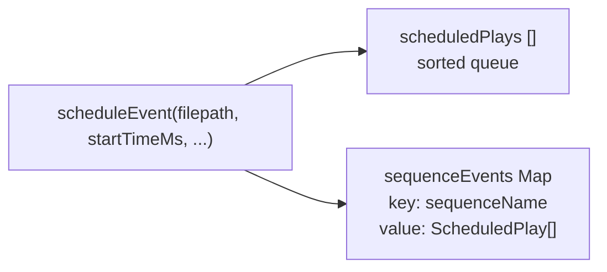
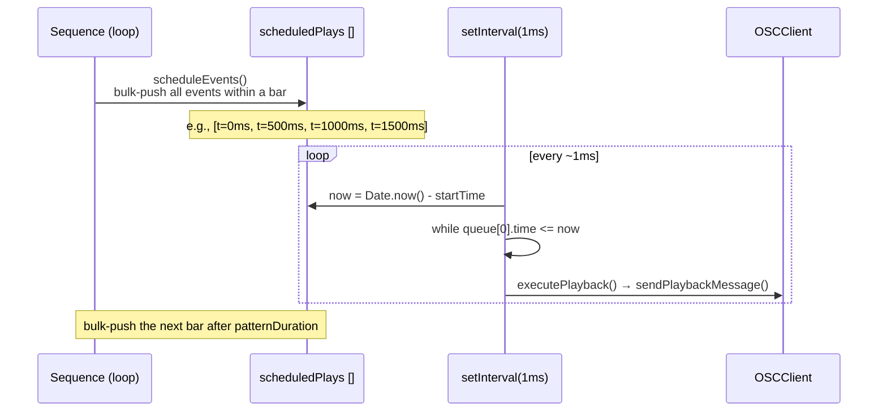
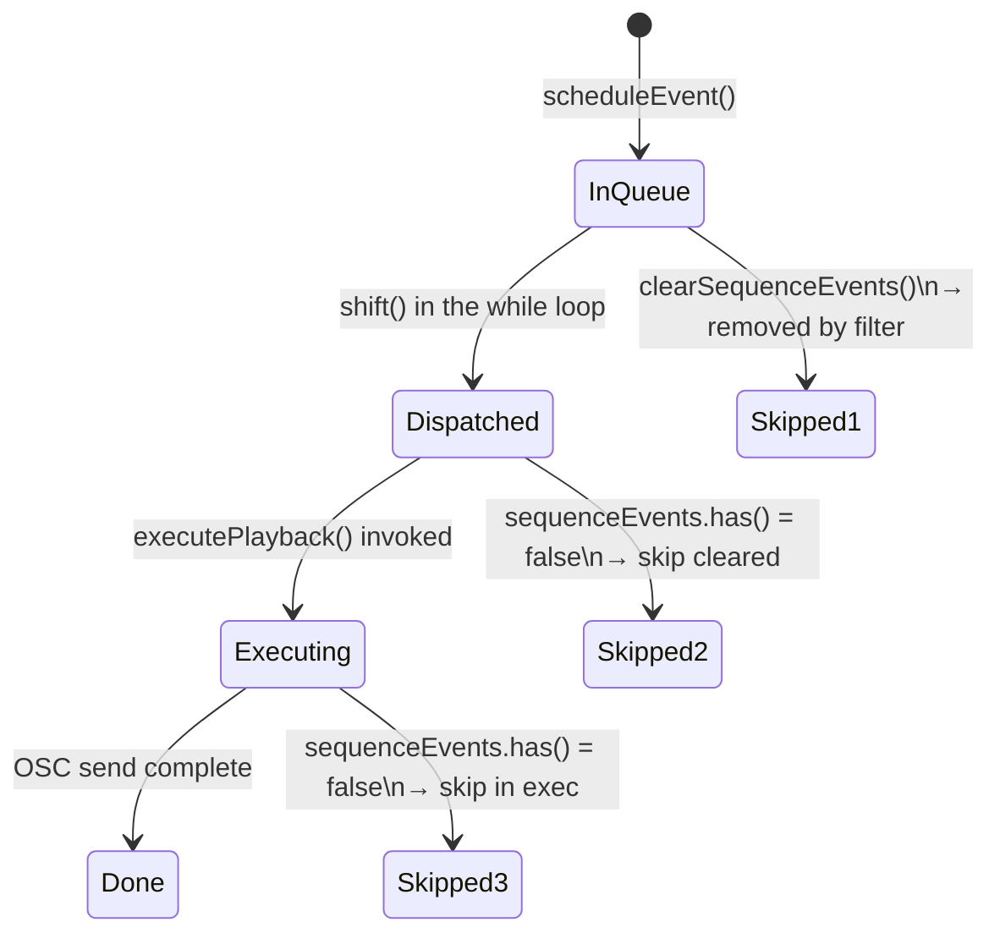
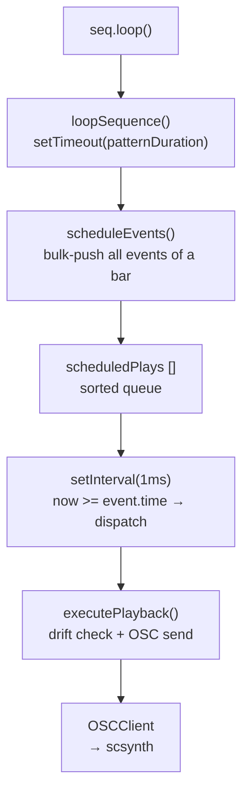

> **Note**: This page is a trace of the author's reading as of 2026-05-05. The code is the truth; this page is merely a snapshot of understanding at that point in time.

# II-3. Event Queue and Look-Ahead

How does OrbitScore produce sound at "accurate timing"? Node.js's event loop is by no means a precise real-time environment. This chapter unpacks the **look-ahead scheduling** scheme that OrbitScore adopts, and the implementation of `EventScheduler` that sits at its core.

## The Problem: Uncertainty of JavaScript Timers

Calling `setTimeout(fn, 100)` does not guarantee that fn runs exactly 100 ms later. When Node.js's event loop is busy with other work, it may actually run 105 ms or 110 ms later. When this **jitter** accumulates, musical timing breaks down.

The strategy OrbitScore takes is a look-ahead approach: **schedule events a little ahead of time, rather than right before producing sound**.

## ScheduledPlay: An Element of the Queue

Each element of the event queue is represented by a type called `ScheduledPlay`.

```typescript
// packages/engine/src/audio/supercollider/types.ts:10-21
export interface ScheduledPlay {
  time: number
  filepath: string
  options: {
    gainDb?: number // Gain in dB (-60 to +12, default 0)
    pan?: number // Pan position (-100 to +100, default 0)
    startPos?: number // Start position in seconds
    duration?: number // Duration in seconds
    rate?: number // Playback rate (1.0 = normal, 2.0 = double speed, 0.5 = half speed)
  }
  sequenceName: string
}
```

`time` is a relative time (ms) with the scheduler's start time as 0. It represents the time at which the OSC message should be sent.

## scheduleEvent: Pushing to the Queue

The function that pushes a new event onto the queue is `scheduleEvent()`.

```typescript
// packages/engine/src/audio/supercollider/event-scheduler.ts:24-48
  scheduleEvent(
    filepath: string,
    startTimeMs: number,
    gainDb = 0,
    pan = 0,
    sequenceName = '',
  ): void {
    const play: ScheduledPlay = {
      time: startTimeMs,
      filepath,
      options: { gainDb, pan },
      sequenceName,
    }

    this.scheduledPlays.push(play)
    this.scheduledPlays.sort((a, b) => a.time - b.time)

    // Track sequence events
    if (sequenceName) {
      if (!this.sequenceEvents.has(sequenceName)) {
        this.sequenceEvents.set(sequenceName, [])
      }
      this.sequenceEvents.get(sequenceName)!.push(play)
    }
  }
```

The line worth noting is `this.scheduledPlays.sort((a, b) => a.time - b.time)`. **It sorts every time you push.** This is `O(n log n)`, but since the number of events on the queue is realistically small (on the order of tens per second), it does not become a performance issue. By keeping the queue sorted, the dispatch loop discussed later can be written as the simple form `while (queue[0].time <= now)`.

Events are registered in both `scheduledPlays` (the sorted queue) and `sequenceEvents` (the per-sequence Map). The reason for this dual management is explained later in "the clearing mechanism."



## start(): The 1ms Polling Loop

When the scheduler starts, `setInterval(callback, 1)` is launched. Every 1 ms it checks the queue and dispatches events whose time has come.

```typescript
// packages/engine/src/audio/supercollider/event-scheduler.ts:143-177
  start(): void {
    if (this.isRunning) {
      return
    }

    this.isRunning = true
    this.startTime = Date.now()

    console.log('✅ Global starting')

    this.scheduledPlays.sort((a, b) => a.time - b.time)

    this.intervalId = setInterval(() => {
      const now = Date.now() - this.startTime

      while (this.scheduledPlays.length > 0 && this.scheduledPlays[0].time <= now) {
        const play = this.scheduledPlays.shift()!

        // Skip if this sequence's events have been cleared
        // (sequenceEvents.has() returns false if clearSequenceEvents() was called)
        if (play.sequenceName && !this.sequenceEvents.has(play.sequenceName)) {
          console.log(
            `🔧 [skip cleared] ${play.sequenceName}: skipping event at ${play.time}ms (cleared)`,
          )
          continue
        }

        // Execute playback asynchronously but handle errors
        this.executePlayback(play.filepath, play.options, play.sequenceName, play.time).catch(
          (error) => {
            console.error(`❌ Playback error for ${play.sequenceName}:`, error)
          },
        )
      }
    }, 1)
  }
```

The scheduler's start time is recorded as `startTime = Date.now()`, and from then on time is computed as the relative time `now = Date.now() - startTime`. As a result, `ScheduledPlay.time` is also handled in the same relative coordinate system.

The `while` loop, as long as `scheduledPlays[0].time <= now` is true, takes events from the front and executes them. A structure that allows multiple events to be processed together in one interval.

## Realizing Look-Ahead: Pre-Scheduling

"1 ms polling" alone does not solve the jitter problem. Node.js's `setInterval(1)` can in practice run with intervals longer than 1 ms.

OrbitScore's mitigation is the look-ahead approach of **pushing OSC messages onto the queue in advance**.

Push all events for one bar onto the queue in bulk at the start of the loop (`scheduleEvents()` registers all events within the bar in one go)
→ The polling loop only has to check the queue
→ Even if the polling loop itself has a delay of a few ms, the events are already on the queue.

Let's confirm the points of this approach in a sequence diagram.



In this design, the act of "scheduling (bulk push)" and the act of "executing (polling dispatch)" are separated. No matter how delayed the Sequence's loop timer is, the events within the bar are already lined up in the queue, so the dispatch timing is unaffected.

## clearSequenceEvents: The Meaning of Dual Management

When you stop a sequence, or when you evaluate a new pattern with `Cmd+Enter`, you need to cancel the events remaining on the existing queue. `clearSequenceEvents()` plays this role.

```typescript
// packages/engine/src/audio/supercollider/event-scheduler.ts:204-226
  clearSequenceEvents(sequenceName: string): void {
    const beforeCount = this.scheduledPlays.length

    // Log events that will be cleared
    const eventsToRemove = this.scheduledPlays.filter((play) => play.sequenceName === sequenceName)
    if (eventsToRemove.length > 0) {
      console.log(
        `🔧 [clearEvents] ${sequenceName}: removing events at times: ${eventsToRemove.map((e) => e.time).join(', ')}ms`,
      )
    }

    this.scheduledPlays = this.scheduledPlays.filter((play) => play.sequenceName !== sequenceName)
    const afterCount = this.scheduledPlays.length
    const cleared = beforeCount - afterCount
    console.log(
      `🔧 [clearEvents] ${sequenceName}: cleared ${cleared} events (${beforeCount} → ${afterCount})`,
    )
    if (cleared > 0) {
      console.log(`⏹ ${sequenceName} (stopped)`)
    }
    // Delete from Map so that any events still in scheduledPlays will be skipped
    this.sequenceEvents.delete(sequenceName)
  }
```

It removes the events for that sequence from `scheduledPlays` via filter, and also `delete`s from the `sequenceEvents` Map.

Why is the deletion from the Map necessary? Here lies the reason for the dual management. If `clearSequenceEvents()` is called while an asynchronous `executePlayback()` is awaiting execution, that event has already been `shift()`ed off `scheduledPlays`, so filter cannot remove it. To skip such "already dequeued but still executing" events, the secondary check `sequenceEvents.has(sequenceName)` is placed both inside the `start()` while loop and inside `executePlayback()`.



## executePlayback: Drift Check and OSC Sending

The actual OSC send is done by `executePlayback()`. Another protective mechanism works here.

```typescript
// packages/engine/src/audio/supercollider/event-scheduler.ts:240-273
  private async executePlayback(
    filepath: string,
    options: PlaybackOptions,
    sequenceName: string,
    scheduledTime: number,
  ): Promise<void> {
    // Only perform checks if sequenceName is provided (non-empty)
    if (sequenceName) {
      const now = Date.now() - this.startTime
      const drift = now - scheduledTime

      // Double-check: Skip if sequence was cleared while waiting in async queue
      if (!this.sequenceEvents.has(sequenceName)) {
        console.log(
          `🔧 [skip in exec] ${sequenceName}: skipping event at ${scheduledTime}ms (cleared during async wait)`,
        )
        return
      }

      // Skip events with excessive drift (> 1000ms)
      // These are likely old events that should have been cleared
      if (drift > 1000) {
        console.log(
          `🔧 [skip drift] ${sequenceName}: skipping event at ${scheduledTime}ms (drift: ${drift}ms > 1000ms)`,
        )
        return
      }
    }

    this.logPlaybackDebugInfo(sequenceName, scheduledTime)
    const { bufnum } = await this.bufferManager.loadBuffer(filepath)
    const amplitude = this.convertGainToAmplitude(options.gainDb)
    await this.sendPlaybackMessage(bufnum, amplitude, options)
  }
```

Two important points.

1. **Events with drift > 1000 ms are skipped**: events that are more than 1 second behind their scheduled time are judged "too old" and skipped. This is a safety valve to prevent a flood of old events from playing back when the system wakes from sleep or under heavy load.

2. **Secondary check after sequence clearing**: `clearSequenceEvents()` may be called while asynchronously waiting on `loadBuffer()`. By rechecking `sequenceEvents.has()`, events deleted in the meantime are skipped.

## Gain Conversion: dB → amplitude

The volume passed to OSC is in amplitude (0.0–1.0+) format. Since the gain specified in DSL is in dB, it is converted by `convertGainToAmplitude()`.

```typescript
// packages/engine/src/audio/supercollider/event-scheduler.ts:294-302
  private convertGainToAmplitude(gainDb: number | undefined): number {
    if (gainDb === undefined) {
      return 1.0 // 0 dB default
    }
    if (gainDb === -Infinity) {
      return 0.0 // Complete silence
    }
    return Math.pow(10, gainDb / 20)
  }
```

$$
\text{amplitude} = 10^{\text{gainDb} / 20}
$$

`gainDb = 0` gives `amplitude = 1.0` (unity), `gainDb = -20` gives `amplitude = 0.1` (one-tenth), and `gainDb = -Infinity` gives `amplitude = 0.0` (silence).

## stop / stopAll: Timer Cleanup

`stop()` halts the interval; `stopAll()` additionally empties the queue.

```typescript
// packages/engine/src/audio/supercollider/event-scheduler.ts:183-199
  stop(): void {
    if (this.intervalId) {
      clearInterval(this.intervalId)
      this.intervalId = null
    }
    this.isRunning = false
    console.log('✅ Global stopped')
  }

  stopAll(): void {
    this.stop()
    this.scheduledPlays = []
    this.sequenceEvents.clear()
  }
```

`stop()` only halts the timer and does not clear `scheduledPlays`. `stopAll()` clears both. `TransportControl.stop()` stops all sequences and then calls `globalScheduler.stopAll()`.

## Summary: The Full Picture of Look-Ahead

OrbitScore's event queue runs with the following division of responsibilities.



There are two key design decisions.

- **bulk push** (look-ahead): pre-pushing all events within a bar so that fluctuations in dispatch timing do not affect the sound
- **1 ms polling**: `setInterval(1)` is not exact, but it only "finds events already on the queue, even if late," so its impact on timing precision is small

> NOTE: unverified — the actual firing interval of `setInterval(1)` (the precision of Node.js's libuv timers) and measured drift values for actual OSC sending have not been confirmed in the code. As noted in architecture-overview.md's "Next exploration candidates," empirical measurement of precision needs to be checked separately.

## Related Terms

- [scsynth](/en/glossary#scsynth) — SuperCollider's audio server binary. The final destination that receives events via OSC
- [OSC (Open Sound Control)](/en/glossary#osc-open-sound-control) — the communication protocol between engine and scsynth. The messages that `executePlayback()` sends
- [orbitPlayBuf](/en/glossary#orbitplaybuf) — the name of OrbitScore's dedicated SynthDef. The buffer-playback Synth specified in OSC messages
- [SynthDef (SC)](/en/glossary#synthdef-sc) — SuperCollider's audio processing definition. `orbitPlayBuf` is one example
- [Buffer (SC)](/en/glossary#buffer-sc) — the audio data area loaded into scsynth. Stored in events as `bufnumLeft` / `bufnumRight`
- [chop](/en/glossary#chop) — the method that divides an audio file equally. The basis for `scheduleSliceEvent()` to compute slice positions

## Next Exploration Candidates

- The actual firing interval of `setInterval(1)` (the libuv timer's minimum resolution is OS-dependent, around 4–15 ms)
- The setting of look-ahead width in `scheduleEvents()` (currently only the next bar; comparison with reading 2 bars ahead)
- The combination of `scheduleSliceEvent()` and the `chop()` modifier — details of slice position and rate calculation
- The basis for the `drift > 1000ms` threshold — how many ms of drift could be expected after waking from sleep
- The latency difference between cache-hit and cache-miss for the buffer cache (`bufferManager.loadBuffer()`)

## Sources

- `packages/engine/src/audio/supercollider/event-scheduler.ts:9-14` — `EventScheduler` field definitions (the dual management of `scheduledPlays` and `sequenceEvents`)
- `packages/engine/src/audio/supercollider/event-scheduler.ts:24-48` — `scheduleEvent()`: push + sort + sequenceEvents registration
- `packages/engine/src/audio/supercollider/event-scheduler.ts:143-177` — `start()`: `setInterval(1)` and the dispatch loop
- `packages/engine/src/audio/supercollider/event-scheduler.ts:183-199` — `stop()` / `stopAll()`
- `packages/engine/src/audio/supercollider/event-scheduler.ts:204-226` — `clearSequenceEvents()`: two-stage clearing via filter + Map.delete
- `packages/engine/src/audio/supercollider/event-scheduler.ts:240-273` — `executePlayback()`: drift check and secondary cleared check
- `packages/engine/src/audio/supercollider/event-scheduler.ts:294-302` — `convertGainToAmplitude()`: dB → amplitude conversion
- `packages/engine/src/audio/supercollider/types.ts:10-21` — `ScheduledPlay` type definition
- `packages/engine/src/core/sequence/scheduling/event-scheduler.ts:48-105` — `scheduleEvents()`: bulk push of events within a bar
- `sites/dev/orientation/architecture-overview.md` — sequence diagram (the full play() → sound flow, the relationship between EventScheduler's setInterval and OSC sending)
