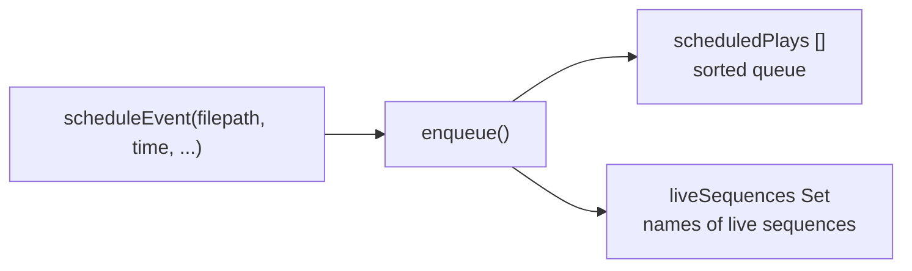
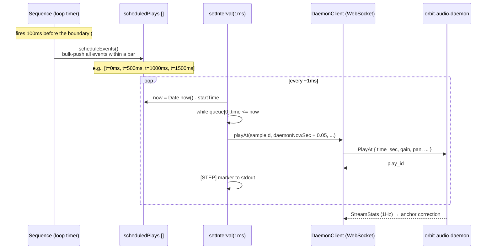
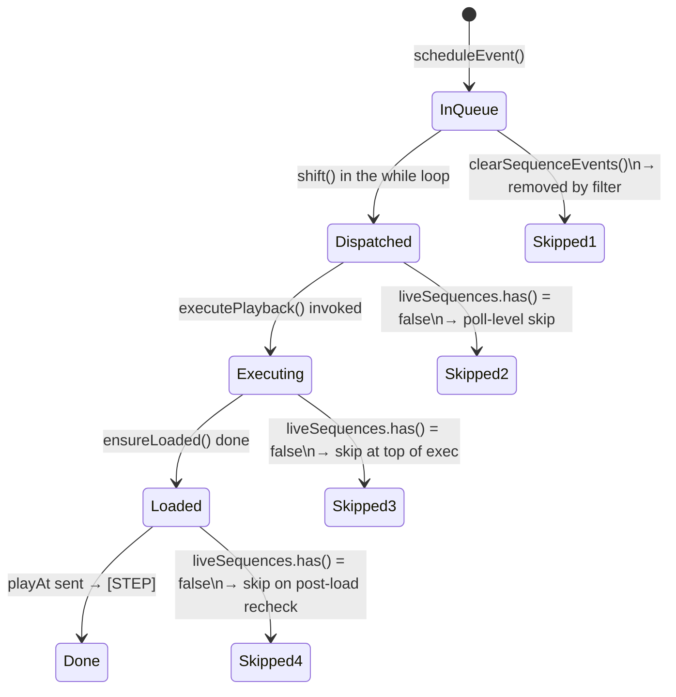
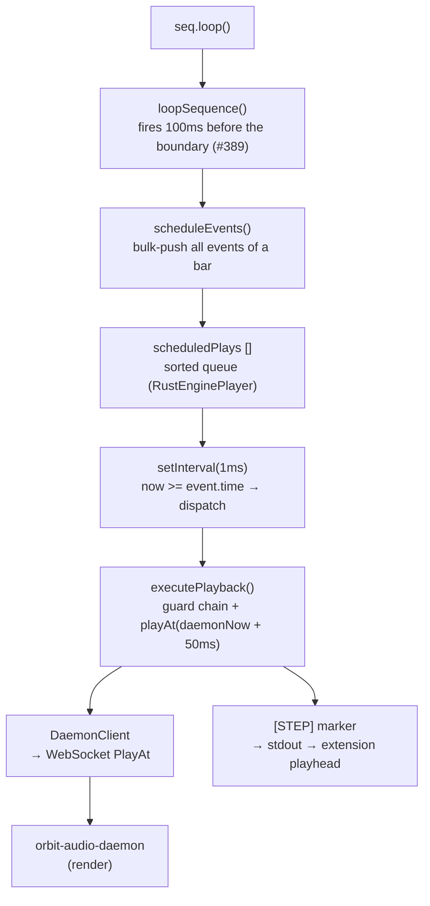

> **Note**: This page is a trace of the author's reading as of 2026-09-01. The code is the truth; this page is only a snapshot of understanding at that time.

# II-3. Event Queue and Look-Ahead

How does OrbitScore produce sound at "accurate timing"? Node.js's event loop is by no means a precise real-time environment. This chapter unpacks the **look-ahead scheduling** scheme that OrbitScore adopts, and the implementation of the event queue that sits at its core.

## Drift as of 2026-09: The Default Backend Is the Rust Daemon

The 2026-05-05 version of this chapter read the SuperCollider path's `EventScheduler` (`packages/engine/src/audio/supercollider/event-scheduler.ts`) as "the implementation of the event queue." Since cutover #108 on 2026-07-03 (WORK_LOG 6.179), **the default audio backend is the Rust daemon (`orbit-audio-daemon`)**, and the queue lives in `RustEnginePlayer` (`packages/engine/src/audio/rust-engine/rust-engine-player.ts`). The SC path is preserved and becomes available when you opt out with `ORBITSCORE_ENGINE=sc`.

`createAudioEngine()` is what selects the backend.

```typescript
// packages/engine/src/audio/create-audio-engine.ts:17-22
export function createAudioEngine(env: NodeJS.ProcessEnv = process.env): AudioEngineBackend {
  const raw = env[ENGINE_ENV_VAR]
  if (resolveEngineKind(raw) === 'supercollider') {
    console.log(`🎛️ [engine] using SuperCollider backend (opt-out via ORBITSCORE_ENGINE=${raw})`)
    return new SuperColliderPlayer()
  }
```

Both backends satisfy the same contract, `AudioEngineBackend`. This interface extends `Scheduler`, and it is the `Scheduler` side that defines the "event queue" surface (`scheduleEvent` / `start` / `stop` / `clearSequenceEvents` and so on).

```typescript
// packages/engine/src/audio/engine-backend.ts:26-27
export interface AudioEngineBackend extends Scheduler {
  boot(outputDevice?: string): Promise<void>
```

```typescript
// packages/engine/src/core/global/types.ts:10-63 (scheduleEvent 以降のシグネチャ詳細を // ... で省略)
// Common scheduler interface
export interface Scheduler {
  isRunning: boolean
  startTime: number // Timestamp when scheduler started
  sequenceTimeouts?: Record<string, NodeJS.Timeout> // For tracking sequence timeouts
  start(): void
  stop(): void
  stopAll(): void
  clearSequenceEvents(name: string): void
  reinitializeSequenceTracking(name: string): void
  // ...
  scheduleStepMarker?(time: number, sequenceName: string, argPath: string, gainDb: number): void
  // ...
```

What matters is the design policy that **musical timing stays on the TS side** (the header comment of rust-engine-player.ts, the Epic #105 principle). `RustEnginePlayer` is an independent, *lean* implementation that mirrors the SC `EventScheduler`'s "1 ms polling + sorted queue" model; the only difference is that on firing it sends `PlayAt` to the daemon over WebSocket. Therefore the skeleton of the 2026-05 explanation (bulk push / 1 ms polling / two-stage clearing / drift guard) is still alive. This chapter is **rewritten with the Rust path as the main line, and keeps the SC path only in outline as the "historical / opt-out path."**

Let's also sort out "where" the look-ahead lives. The Rust path has three stages of look-ahead:

| Stage | Location | Width | Role |
|---|---|---|---|
| 1 | `scheduleEvents()` (sequence layer) | 1 bar | Bulk-push all events within a bar onto the queue (same as the 2026-05 version) |
| 2 | `LOOP_TIMER_LEAD_MS` (loop-sequence.ts, #389) | 100 ms | Fire the loop timer 100 ms before the boundary so the bar head is enqueued as "future" (covered in [II-2](/en/scheduling/polymeter)) |
| 3 | `DEFAULT_LOOKAHEAD_SEC` (rust-engine-player.ts) | 50 ms | At poll firing, send `PlayAt{time_sec = daemonNow + 0.05}` so the daemon's render cursor is reliably overtaken |

In addition, #390 (2026-07-07) added `[STEP]` markers (live playhead) to the dispatch path, and #654 (2026-08-30) wired the same marker on the MIDI side. This chapter covers those too.

## The Problem: Uncertainty of JavaScript Timers

Calling `setTimeout(fn, 100)` does not guarantee that fn runs exactly 100 ms later. When Node.js's event loop is busy with other work, it may actually run 105 ms or 110 ms later. When this **jitter** accumulates, musical timing breaks down.

The strategy OrbitScore takes is a look-ahead approach: **schedule events a little ahead of time, rather than right before producing sound**.

## ScheduledPlay: An Element of the Queue

Each element of the event queue is represented by a type called `ScheduledPlay`. The Rust path's version is flatter than the SC version: there is no nested `options`, and the chop slice information is grouped into `slice`.

```typescript
// packages/engine/src/audio/rust-engine/rust-engine-player.ts:169-200
/** lean scheduler が保持する 1 発音イベント。SC `ScheduledPlay` の daemon 版。 */
export interface ScheduledPlay {
  /** 再生開始時刻（`startTime` からの相対 ms）。 */
  time: number
  filepath: string
  /** dB ゲイン（`scheduleEvent` の gainDb）。発火時に linear amplitude へ変換。 */
  gainDb: number
  /** DSL pan（-100..100）。発火時に daemon の [-1,1] へ変換。 */
  pan: number
  sequenceName: string
  /** chop slice 情報。未指定なら全体再生。発火時に load 済み尺から領域を計算する。 */
  slice?: SliceSpec
  /** LinkAudio ルーティング先チャンネル名。非空の時のみ daemon の PlayAt へ転送する。 */
  outputChannel?: string
  /**
   * per-sequence insert bus 名（`seq.effect()`・PH.2b・#434 S3）。非空の時のみ daemon の
   * PlayAt へ転送する。`outputChannel` と同時に立つことはない（LinkAudio と plugin
   * hosting は v1 で排他）。
   */
  insertBus?: string
  /**
   * #390 live playhead: 由来する play() 引数のドット結合インデックス（"2"、ネストは
   * 後段で "1.0"）。dispatch 成功時に `[STEP]` marker を stdout へ出すためだけの
   * observational フィールド。timing / 音響には一切影響しない。
   */
  argPath?: string
  /**
   * #390: 休符 (0) スロットの marker-only イベント。daemon への dispatch は行わず、
   * 発火タイミングで `[STEP]` だけを出す（filepath は空文字）。
   */
  markerOnly?: boolean
}
```

`time` is a relative time (ms) with the scheduler's start time as 0. It represents "the time at which `PlayAt` should be sent to the daemon." `gainDb` is kept in dB and converted to amplitude at firing. `outputChannel` (LinkAudio) and `insertBus` (`seq.effect()`) are routing tags, and `argPath` / `markerOnly` are for the #390 live playhead.

### Whether a slice is queued at all is decided by the chop value

Why is `slice` optional? The answer is a branch in the sequence layer. Depending on the chop declaration, the method being called changes entirely.

```typescript
// packages/engine/src/core/sequence/scheduling/event-scheduler.ts:127-154
      // Schedule event (argPath = #390 live playhead marker, observational only)
      if (chopDivisions && chopDivisions > 1) {
        const eventDuration = event.duration && event.duration > 0 ? event.duration : undefined
        scheduler.scheduleSliceEvent(
          resolvedFilePath,
          startTimeMs,
          event.sliceNumber,
          chopDivisions,
          eventDuration,
          finalGainDb,
          eventPan,
          sequenceName,
          outputChannel,
          event.argPath,
          insertBus,
        )
      } else {
        scheduler.scheduleEvent(
          resolvedFilePath,
          startTimeMs,
          finalGainDb,
          eventPan,
          sequenceName,
          outputChannel,
          event.argPath,
          insertBus,
        )
      }
```

The condition is `chopDivisions > 1`. Writing no `chop()` at all, or `chop(1)`, goes through `scheduleEvent`; only `chop(n > 1)` goes through `scheduleSliceEvent`.

What deserves attention here is the difference in arguments. `scheduleSliceEvent` passes `event.duration` as `eventDuration`, but `scheduleEvent` receives neither a duration nor a rate. Since the slot length never reaches it, **there is simply no room to change the playback speed to fit the slot**. As a result, on the non-chop path the file sounds at its natural length and natural pitch, rings past the slot, and overlaps the next trigger.

This distinction is stated in the spec as well (`docs/core/INSTRUCTION_ORBITSCORE_DSL.md` §3 "Slice-to-Slot Fitting"). Because that section of the spec described only the behavior with chop, on 2026-08-31 two sessions independently misread it as "audio is always fitted into the slot" (#665).

For reference, the SC path's `ScheduledPlay` looks like this. Inside the nested `options` it holds `startPos` / `duration` / `rate` (for chop) flat.

```typescript
// packages/engine/src/audio/supercollider/types.ts:10-25
export interface ScheduledPlay {
  time: number
  filepath: string
  options: {
    gainDb?: number // Gain in dB (-60 to +12, default 0)
    pan?: number // Pan position (-100 to +100, default 0)
    startPos?: number // Start position in seconds
    duration?: number // Duration in seconds
    rate?: number // Playback rate (1.0 = normal, 2.0 = double speed, 0.5 = half speed)
    // LinkAudio dispatch: when set, route to LinkAudio plugin via channel id
    // (set by Sequence layer only when Global.linkAudio() is enabled). Absent
    // means hardware bus routing via the existing orbitPlayBuf SynthDef.
    outputChannel?: string
  }
  sequenceName: string
}
```

## scheduleEvent and enqueue: Pushing to the Queue

`scheduleEvent()` pushes a new event onto the queue, and the Rust version delegates to an internal `enqueue()`.

```typescript
// packages/engine/src/audio/rust-engine/rust-engine-player.ts:1438-1454
  scheduleEvent(
    filepath: string,
    time: number,
    gainDb = 0,
    pan = 0,
    sequenceName = '',
    outputChannel?: string,
    argPath?: string,
    insertBus?: string,
  ): void {
    // outputChannel の feature-gap signal は `registerLinkAudioChannel`（`sequence.output()` 経由）が
    // authoritative に出す（A4-2b-2b で egress 配線済み）。scheduleEvent は channel を tag するだけで、
    // 「egress is not wired」の旧 warn は stale なので出さない（egress 有効な daemon では誤誘導になる）。
    // pan は daemon PlayAt で実装済み（#304・equal-power = SC Pan2 一致）。発火時に
    // executePlayback が DSL の -100..100 を daemon の [-1,1] へ変換して送る。
    this.enqueue({ time, filepath, gainDb, pan, sequenceName, outputChannel, argPath, insertBus })
  }
```

```typescript
// packages/engine/src/audio/rust-engine/rust-engine-player.ts:1593-1599
  private enqueue(play: ScheduledPlay): void {
    this.scheduledPlays.push(play)
    this.scheduledPlays.sort((a, b) => a.time - b.time)
    if (play.sequenceName) {
      this.liveSequences.add(play.sequenceName)
    }
  }
```

The line worth noting is `this.scheduledPlays.sort((a, b) => a.time - b.time)`. **It sorts every time you push.** This is `O(n log n)`, but since the number of events on the queue is realistically small (on the order of tens per second), it does not become a performance issue. By keeping the queue sorted, the dispatch loop discussed later can be written as the simple form `while (queue[0].time <= now)`.

What the 2026-05 version called "dual management" has been simplified in the Rust version to **a `Set<string>` called `liveSequences`**. The SC version kept even the arrays of events in `sequenceEvents: Map<string, ScheduledPlay[]>`, but the only thing actually used is the boolean "is this sequence name alive," so a Set was enough.


```mermaid
flowchart LR
  SE["scheduleEvent(filepath, time, ...)"] --> EQ["enqueue()"]
  EQ --> SP["scheduledPlays []\nsorted queue"]
  EQ --> SET["liveSequences Set\nnames of live sequences"]
```

## start(): The 1ms Polling Loop

When the scheduler starts, `setInterval(callback, POLL_INTERVAL_MS)` is launched. The constants are grouped near the top of the file.

```typescript
// packages/engine/src/audio/rust-engine/rust-engine-player.ts:330-335
const DEFAULT_LOOKAHEAD_SEC = 0.05
const PLUGIN_UI_OPEN_TIMEOUT_MS = 30_000
const PLUGIN_UI_CLOSE_TIMEOUT_MS = 20_000
const POLL_INTERVAL_MS = 1
/** SC EventScheduler と同じく、過大 drift のイベントは古い残骸として skip する閾値。 */
const MAX_DRIFT_MS = 1000
```

Every 1 ms it checks the queue and dispatches events whose time has come.

```typescript
// packages/engine/src/audio/rust-engine/rust-engine-player.ts:1506-1523
  start(): void {
    if (this.isRunning) return
    this.isRunning = true
    this.startTime = Date.now()
    this.scheduledPlays.sort((a, b) => a.time - b.time)

    this.intervalId = setInterval(() => {
      const now = Date.now() - this.startTime
      while (this.scheduledPlays.length > 0 && this.scheduledPlays[0].time <= now) {
        const play = this.scheduledPlays.shift()!
        // clear 済みシーケンスのイベントは skip（poll-level チェック）。
        if (play.sequenceName && !this.liveSequences.has(play.sequenceName)) {
          continue
        }
        this.executePlayback(play).catch((err) => this.onPlaybackError(play, err))
      }
    }, POLL_INTERVAL_MS)
  }
```

The scheduler's start time is recorded as `startTime = Date.now()`, and from then on time is computed as the relative time `now = Date.now() - startTime`. As a result, `ScheduledPlay.time` is also handled in the same relative coordinate system.

The `while` loop, as long as `scheduledPlays[0].time <= now` is true, takes events from the front and executes them. A structure that allows multiple events to be processed together in one interval. The only differences from the SC version (`event-scheduler.ts:355-390`) are the absence of `console.log('✅ Global starting')` and of the log on skip.

## Realizing Look-Ahead: Three Stages

"1 ms polling" alone does not solve the jitter problem. Node.js's `setInterval(1)` can in practice run with intervals longer than 1 ms. OrbitScore's mitigation is a layering of "push it in advance," and on the Rust path there are three stages.

### Stage 1: Per-Bar Bulk Push (Sequence Layer)

The events of one bar are pushed onto the queue in bulk by `scheduleEvents()` at the start of the loop. This function lives in the sequence layer (`packages/engine/src/core/sequence/scheduling/event-scheduler.ts`) and does not depend on the backend.

```typescript
// packages/engine/src/core/sequence/scheduling/event-scheduler.ts:113-169 (gain/pan の計算と scheduleSliceEvent / scheduleEvent の引数列を // ... で省略)
  // Schedule events for current iteration
  const loopOffset = loopIteration * patternDuration

  for (const event of timedEvents) {
    if (event.sliceNumber > 0) {
      // 0 is silence
      const startTimeMs = baseTime + event.startTime + loopOffset

      // ...
    } else if (event.sliceNumber === 0 && event.argPath !== undefined) {
      // 0 is silence — no audio dispatch, but the live playhead still steps
      // through the rest slot (#390 owner request 2026-07-07): the sequence is
      // processing the silence, so the highlight should land on it. gainDb
      // carries the slot's mute/master gain so muted sequences skip markers
      // exactly like they skip notes.
      scheduler.scheduleStepMarker?.(
        baseTime + event.startTime + loopOffset,
        sequenceName,
        event.argPath,
        calculateEventGain(gainDb, gainRandom, masterGainDb, isMuted),
      )
    }
  }
}
```

`startTimeMs = baseTime + event.startTime + loopOffset` is where `TimedEvent.startTime` (bar-relative ms) from [II-1](/en/scheduling/time-representation) is converted into the scheduler's absolute relative time. Rest slots with `sliceNumber === 0` produce no sound, but since #390 they push a **marker-only event** via `scheduleStepMarker?.()` (because of `?.`, the SC version, which lacks `scheduleStepMarker`, does nothing).

→ The polling loop only has to check the queue
→ Even if the polling loop itself has a delay of a few ms, the events are already on the queue

### Stage 2: Lead Firing of the Loop Timer (#389)

"When" the bulk push happens also matters. If a timer is aimed exactly at the bar boundary, then because `setTimeout` never fires early, the bar-head event is already in the past at the moment it is enqueued and sounds late via immediate dispatch. #389 (2026-07-07) made the loop timer fire `LOOP_TIMER_LEAD_MS` (100 ms) before the boundary, pushing the next bar as "future." See `armDelay()` in [II-2](/en/scheduling/polymeter) for details. As the comment at the top of that file says, "the daemon has its own lookahead": these 100 ms are for absorbing event-loop lag, and the look-ahead on the audio path is the job of stage 3.

### Stage 3: Constant Lookahead to the Daemon (50 ms)

When the poll detects an event, the Rust version sends not "play now" but a `PlayAt` that says **"play at now + 50 ms on the daemon's transport clock."** This contrasts with the SC version, which sent `/s_new` immediately on poll detection (fire-now). The reason is written in the header comment.

```typescript
// packages/engine/src/audio/rust-engine/rust-engine-player.ts:16-21
 *  - **timing モデル = poll-and-fire-now + 定数 lookahead**。SC は fire-now（poll 検出で
 *    即 `/s_new`）。daemon は自前 transport clock（boot で 0 開始）上の `PlayAt{time_sec}`
 *    で schedule-ahead。poll 発火時に `playAt(daemonNowSec + lookahead)` を送ることで
 *    **相対 timing（quantize/polymeter）を保存**しつつ daemon render cursor を確実に
 *    上回らせ onset clip を避ける（絶対 latency は定数シフト＝音楽的に無影響）。lookahead は
 *    実機計測で確定する（A0 受け入れ基準）。
```

The point is "absolute latency is a constant shift = musically irrelevant." Every event is delayed uniformly by 50 ms, so the relative relationships of polymeter and quantize are preserved.

This scheme brings a new problem: "mapping TS's `Date.now()` to the daemon's transport clock." The daemon reports its own `now_sec` in a 1 Hz `StreamStats`, and the TS side accumulates those as anchors. With #389 mechanism B, the single anchor was replaced by a **least-squares fit over the last 30 samples** (`ANCHOR_WINDOW`, `fitAnchorSamples()`). `daemonNowSec()`, called on the dispatch hot path, evaluates that fit in O(1).

```typescript
// packages/engine/src/audio/rust-engine/rust-engine-player.ts:1755-1761
  private daemonNowSec(): number {
    const fit = this.anchorFit
    if (fit) {
      return fit.intercept + fit.slope * ((Date.now() - fit.t0Ms) / 1000)
    }
    return this.clockAnchor.daemonSec + (Date.now() - this.clockAnchor.tsMs) / 1000
  }
```

While there is no fit (right after boot or right after a respawn), it falls back to "latest anchor + elapsed time."

Let's confirm the whole picture in a sequence diagram.


```mermaid
sequenceDiagram
  participant SEQ as Sequence (loop timer)
  participant QUEUE as scheduledPlays []
  participant POLL as setInterval(1ms)
  participant DC as DaemonClient (WebSocket)
  participant D as orbit-audio-daemon

  Note over SEQ: fires 100ms before the boundary (#389)
  SEQ->>QUEUE: scheduleEvents()<br/>bulk-push all events within a bar
  Note over QUEUE: e.g., [t=0ms, t=500ms, t=1000ms, t=1500ms]

  loop every ~1ms
    POLL->>QUEUE: now = Date.now() - startTime
    POLL->>POLL: while queue[0].time <= now
    POLL->>DC: playAt(sampleId, daemonNowSec + 0.05, ...)
    DC->>D: PlayAt { time_sec, gain, pan, ... }
    D-->>DC: play_id
    POLL->>POLL: [STEP] marker to stdout
  end

  D-->>DC: StreamStats (1Hz) → anchor correction
```

In this design, the act of "scheduling (bulk push)," the act of "executing (polling dispatch)," and the act of "sounding (the daemon's render)" are separated. Even if the Sequence's loop timer is somewhat late, the events within the bar are already lined up in the queue; and even if the poll is somewhat late, it is absorbed within the daemon's 50 ms of slack.

## clearSequenceEvents: Two-Stage Skipping

When you stop a sequence, or when you evaluate a new pattern with `Cmd+Enter`, you need to cancel the events remaining on the existing queue. `clearSequenceEvents()` plays this role. The Rust version became very short.

```typescript
// packages/engine/src/audio/rust-engine/rust-engine-player.ts:1570-1578
  clearSequenceEvents(sequenceName: string): void {
    this.scheduledPlays = this.scheduledPlays.filter((p) => p.sequenceName !== sequenceName)
    // 集合から消すことで、まだ queue に残るイベントも poll/exec 時に skip される。
    this.liveSequences.delete(sequenceName)
  }

  reinitializeSequenceTracking(sequenceName: string): void {
    this.liveSequences.add(sequenceName)
  }
```

It removes the events for that sequence from `scheduledPlays` via filter, and also `delete`s from `liveSequences`.

Why is the deletion from the Set necessary? If `clearSequenceEvents()` is called while an asynchronous `executePlayback()` is awaiting execution, that event has already been `shift()`ed off `scheduledPlays`, so filter cannot remove it. To skip such "already dequeued but still executing" events, the secondary check `liveSequences.has(sequenceName)` is placed both inside the `start()` while loop and inside `executePlayback()` (twice, in fact — before and after the `ensureLoaded()` await). `reinitializeSequenceTracking()` is the function that puts the name back into the Set on unmute, and is called from the unmute branch in [II-2](/en/scheduling/polymeter).


```mermaid
stateDiagram-v2
  [*] --> InQueue: scheduleEvent()
  InQueue --> Dispatched: shift() in the while loop
  Dispatched --> Executing: executePlayback() invoked
  Executing --> Loaded: ensureLoaded() done
  Loaded --> Done: playAt sent → [STEP]

  InQueue --> Skipped1: clearSequenceEvents()\n→ removed by filter
  Dispatched --> Skipped2: liveSequences.has() = false\n→ poll-level skip
  Executing --> Skipped3: liveSequences.has() = false\n→ skip at top of exec
  Loaded --> Skipped4: liveSequences.has() = false\n→ skip on post-load recheck
```

The SC version's `clearSequenceEvents()` (`event-scheduler.ts:440-462`) has the same structure and additionally prints the list of removed event times and counts via `console.log`. Since the Rust version dropped those logs, the SC version is worth reading as a source of debugging information.

## executePlayback: The Guard Chain and Sending PlayAt

What actually sends to the daemon is `executePlayback()`. Several protective mechanisms are lined up in series here. The respawn-related comment at the top of the function is long, so the quote starts from the guards themselves.

```typescript
// packages/engine/src/audio/rust-engine/rust-engine-player.ts:1625-1669
    if (this.respawning || !this.daemon.isRunning()) return
    if (play.sequenceName) {
      // poll 検出から executePlayback 実行までの microtask gap で clear された場合の skip。
      if (!this.liveSequences.has(play.sequenceName)) return
      const drift = Date.now() - this.startTime - play.time
      if (drift > MAX_DRIFT_MS) return
    }

    const amplitude = gainDbToAmplitude(play.gainDb)
    if (amplitude <= 0) return // 無音はロード前にスキップ（音響的に同一）。

    // #390: 休符 (0) スロットの marker-only イベント。daemon dispatch は行わず
    // marker だけ出して終わる（上の amplitude ガードを通過している = mute されて
    // いないシーケンスのみ。音イベントとの一貫性）。filepath は空なので
    // ensureLoaded より前に抜けること。
    if (play.markerOnly) {
      this.emitStepMarker(play)
      return
    }

    const sampleId = await this.ensureLoaded(play.filepath)
    // ロード（async round-trip）中に clear された場合の再チェック（mute/stop への応答性）。
    if (play.sequenceName && !this.liveSequences.has(play.sequenceName)) return
    // 音響パラメータ（amplitude/pan/slice 領域）は本番発火と検証ハーネス（#311）で共有する
    // 変換に集約する。slice 領域は ensureLoaded 後の尺（this.durations）を使う（lazy load）。
    const { gain, pan, offsetSec, durationSec, rate } = this.toDaemonParams(play)
    // daemonNowSec と wallMs は送信「前」に同一瞬間で採取する（onDispatch の lead/drift 計測が
    // coherent になるよう。playAt の await 後だと round-trip 分ずれる）。
    const wallMs = Date.now()
    const daemonNowSec = this.daemonNowSec()
    const timeSec = daemonNowSec + this.lookaheadSec
    const { playId } = await this.daemon.playAt(
      sampleId,
      timeSec,
      gain,
      pan,
      offsetSec,
      durationSec,
      rate,
      play.outputChannel,
      play.insertBus,
    )
    // #390 live playhead: emitted only after a successful dispatch (emission-only
    // — no timing / semantics change).
    this.emitStepMarker(play)
```

Let's read them in order.

1. **Drop while respawning / disconnected**: while the daemon has crashed and is restarting (the recovery floor of #300), the dispatch itself is discarded, to avoid sending "several seconds ahead" to the new daemon with a stale clock anchor and desyncing.
2. **Secondary check after sequence clearing**: the skip for the case where the sequence was cleared in the microtask gap between poll detection and the `executePlayback()` run.
3. **Events with drift > 1000 ms (`MAX_DRIFT_MS`) are skipped**: events more than one second behind their scheduled time are judged "too old" and discarded. This is a safety valve against a flood of old events after waking from sleep, and pairs with the catch-up path of `armDelay()` in [II-2](/en/scheduling/polymeter).
4. **Skip when amplitude ≤ 0**: muted sequences arrive with a gain of `-Infinity`, so they exit before loading the sample.
5. **If marker-only, print `[STEP]` and finish**: rest slots. Placing this after the amplitude guard means that while muted, markers are suppressed just like notes.
6. **Re-check `liveSequences` after `ensureLoaded()`**: loading is a WebSocket round trip, and the sequence may have been stopped / muted in the meantime.
7. **`playAt()` with `daemonNowSec + lookaheadSec` as `time_sec`**: the stage-3 look-ahead. `wallMs` and `daemonNowSec` are sampled at the same instant before sending so that the lead/drift of `onDispatch` (the measurement hook) stays coherent.
8. **`emitStepMarker()` after success**: if the send fails, no marker is printed.

`daemon.playAt()` is a thin wrapper in `DaemonClient` that sends a JSON `PlayAt` request over WebSocket.

```typescript
// packages/engine/src/audio/rust-engine/daemon-client.ts:414-424
  async playAt(
    sampleId: string,
    timeSec: number,
    gain: number,
    pan = 0,
    offsetSec = 0,
    durationSec = 0,
    rate = 1,
    channel?: string,
    bus?: string,
  ): Promise<{ playId: string }> {
```

## `[STEP]` Markers: Live Playhead (#390 / #654)

`emitStepMarker()` prints to stdout a machine-readable line for the live playhead, with which the editor extension highlights the `play()` arguments.

```typescript
// packages/engine/src/audio/rust-engine/rust-engine-player.ts:1601-1617
  /**
   * #390 live playhead: machine-readable step marker for the editor extension.
   * The epoch ms is the event's GRID time (startTime + play.time — the same
   * base the drift check uses), NOT "now": dispatch runs lookahead-early, so
   * the extension delays the decoration until this timestamp. Actual audio
   * lands ~lookaheadSec (50ms) after the grid time — a uniform constant shift
   * across all sequences, so the playhead stays mutually consistent. Rounded
   * because play.time can be fractional (bar subdivision) and the marker
   * grammar keeps integers.
   */
  private emitStepMarker(play: ScheduledPlay): void {
    if (play.sequenceName && play.argPath !== undefined) {
      console.log(
        `[STEP] ${play.sequenceName} ${play.argPath} ${Math.round(this.startTime + play.time)}`,
      )
    }
  }
```

The design point is that the timestamp is the **grid time** (`startTime + play.time`), not "now." Dispatch runs early by the lookahead, so the extension delays the decoration until this timestamp. `argPath` is the `TimedEvent.argPath` seen in [II-1](/en/scheduling/time-representation), threaded through `scheduleEvents()` → `scheduleEvent()` → `ScheduledPlay`.

The story of #654 (2026-08-30, WORK_LOG 6.421) is interesting. #390 had been wired only on the audio path, so the playhead never moved at all for `instrument()` / `midi()` sequences. The fix was to add a `scheduleStepMarker()` to `MidiScheduler` that enqueues a marker with the same grammar.

```typescript
// packages/engine/src/midi/midi-scheduler.ts:171-176
  scheduleStepMarker(time: number, owner: string, argPath: string): void {
    const atEpochMs = Math.round(time)
    this.enqueue(time, owner, () => {
      console.log(`[STEP] ${owner} ${argPath} ${atEpochMs}`)
    })
  }
```

Both the audio side and the MIDI side stamp the "grid time," so the playheads of different layers can be compared — that is the judgement recorded in the WORK_LOG. Note that `[STEP]` lines are filtered out of the output channel in normal mode, so observing them on a real machine requires starting with `debug: true` (WORK_LOG 6.421).

## Gain Conversion: dB → amplitude

The volume passed to the daemon is in linear amplitude. Since the gain specified in the DSL is in dB, a conversion is needed. The 2026-05 version quoted `convertGainToAmplitude()` inside the SC `EventScheduler`, but that function no longer exists; it has been consolidated into **`gainDbToAmplitude()`, shared by both backends**.

```typescript
// packages/engine/src/audio/audio-gain-utils.ts:1-16
/**
 * 音声バックエンド共通のゲイン変換ユーティリティ。
 *
 * dB → linear amplitude の単一情報源。SuperCollider 経路（EventScheduler）と
 * Rust daemon 経路（RustEnginePlayer）の両方がこれを使う。
 */

/**
 * dB ゲインを linear amplitude へ変換する。`amplitude = 10^(dB/20)`。
 * 既定（undefined）= 0 dB = 1.0、`-Infinity` = 完全無音 = 0.0。
 */
export function gainDbToAmplitude(gainDb: number | undefined): number {
  if (gainDb === undefined) return 1.0
  if (gainDb === -Infinity) return 0.0
  return Math.pow(10, gainDb / 20)
}
```

$$
\text{amplitude} = 10^{\text{gainDb} / 20}
$$

`gainDb = 0` gives `amplitude = 1.0` (unity), `gainDb = -20` gives `amplitude = 0.1` (one-tenth), and `gainDb = -Infinity` gives `amplitude = 0.0` (silence).

Note that only the sequence gain is converted here. The master gain (`global.gain()`) is, since #643 (2026-08-29), **no longer folded into the event**; instead the daemon's mixer applies it once as a `SetGlobalGain` ramp (there is a long comment in `calculateEventGain()` in `event-scheduler.ts`). Only when `masterGainDb === -Infinity` does the event side also return `-Infinity`, to avoid leakage until the ramp reaches 0.

## stop / stopAll: Timer Cleanup

`stop()` halts the interval; `stopAll()` additionally empties the queue and stops the daemon-side voices too.

```typescript
// packages/engine/src/audio/rust-engine/rust-engine-player.ts:1525-1552
  stop(): void {
    if (this.intervalId) {
      clearInterval(this.intervalId)
      this.intervalId = null
    }
    this.isRunning = false
  }

  stopAll(): void {
    this.stop()
    this.scheduledPlays = []
    this.liveSequences.clear()
    this.warned = freshWarned()
    // daemon 側の in-flight voice（varispeed の rate<1.0 で長尺化した slice 含む）も即時
    // hard-stop する（#319）。stopAll は同期契約なので fire-and-forget。失敗（接続喪失）は
    // supervisor 任せで静かに drop する。teardown(quit)/respawn 中は対象が無い/置換されるので
    // skip する（quit は daemon.quit() が、respawn は新 daemon が空であることが各々始末する）。
    if (!this.disposed && !this.respawning && this.daemon.isRunning()) {
      void this.daemon.stopAll().catch((err) => this.warnUnlessDisconnected('stopAll()', err))
      void this.daemon
        .pluginAllNotesOff()
        .then(({ released, stale, failed }) => {
          if (released > 0 || stale > 0 || failed > 0) {
            console.log(
              `[rust-engine] plugin all-notes-off: released=${released} stale=${stale} failed=${failed}`,
            )
          }
        })
```

`stop()` only halts the timer and does not clear `scheduledPlays`. `stopAll()` clears both and furthermore sends `StopAll` to the daemon to cut voices that are still sounding (such as slices lengthened by rate < 1.0). `TransportControl.stop()` stops all sequences and then calls `globalScheduler.stopAll()` ([II-4](/en/scheduling/transport)).

The SC version's `stopAll()` (`event-scheduler.ts:395-435`) instead frees the LinkAudio keepalive synths and resets channel allocation.

## The SC Path (Historical / Opt-Out) in Outline

The `SuperColliderPlayer` selected by `ORBITSCORE_ENGINE=sc` holds an `EventScheduler` internally. This is what the 2026-05 version of this chapter read. The structure is the same as the Rust version; the differences are:

- The queue element is the `ScheduledPlay` with nested `options` (above)
- "Live sequences" are managed by `sequenceEvents: Map<string, ScheduledPlay[]>` (a Map, not a Set)
- Dispatch is fire-now: `/s_new` is sent via OSC immediately on poll detection (`sendPlaybackMessage()`, `event-scheduler.ts:537-605`). There is nothing corresponding to the daemon-side lookahead
- It does not implement `scheduleStepMarker`, so no `[STEP]` is printed (the reason it is optional in the `Scheduler` type)
- It handles LinkAudio (`outputChannel`) including channel registration (`resolveLinkAudioChannel()` and below, `event-scheduler.ts:96-172`)
- It prints `console.log` on every clear and skip

Reading `start()` (`event-scheduler.ts:355-390`), `clearSequenceEvents()` (`440-462`), and `executePlayback()` (`476-509`) side by side with the Rust version makes it clear what was dropped to make it "lean."

## Summary: The Full Picture of Look-Ahead

OrbitScore's event queue runs with the following division of responsibilities.


```mermaid
flowchart TB
  DSL["seq.loop()"] --> LS["loopSequence()\nfires 100ms before the boundary (#389)"]
  LS --> SE["scheduleEvents()\nbulk-push all events of a bar"]
  SE --> QUEUE["scheduledPlays []\nsorted queue (RustEnginePlayer)"]
  QUEUE --> POLL["setInterval(1ms)\nnow >= event.time → dispatch"]
  POLL --> EP["executePlayback()\nguard chain + playAt(daemonNow + 50ms)"]
  EP --> DC["DaemonClient\n→ WebSocket PlayAt"]
  DC --> D["orbit-audio-daemon\n(render)"]
  EP --> STEP["[STEP] marker\n→ stdout → extension playhead"]
```

There are three key design decisions.

- **bulk push** (look-ahead stage 1): pre-pushing all events within a bar so that fluctuations in dispatch timing do not affect the sound
- **1 ms polling**: `setInterval(1)` is not exact, but it only "finds events already on the queue, even if late," so its impact on timing precision is small. The lead firing of #389 also closed the hole where "only the bar head ends up in the past"
- **Forwarding to the daemon with a constant lookahead** (stage 3): in exchange for shifting absolute latency by 50 ms, the daemon's render cursor is reliably overtaken while relative timing is preserved

> NOTE: unverified — the actual firing interval of `setInterval(1)` (the precision of Node.js's libuv timers) has not been confirmed in the code. End-to-end precision, however, has measurements in WORK_LOG 6.198: in a 150-second capture after the #389 fix, mean|dev| = 0.52 ms / max|dev| = 2.0 ms (120 bpm, quarter-note LOOP).

## Related Terms

- [scsynth](/en/glossary#scsynth) — SuperCollider's audio server binary. Receives events via OSC on the `ORBITSCORE_ENGINE=sc` opt-out path
- [OSC (Open Sound Control)](/en/glossary#osc-open-sound-control) — the communication protocol between engine and scsynth on the SC path. On the Rust path it is replaced by WebSocket + JSON (`PlayAt`)
- [orbitPlayBuf](/en/glossary#orbitplaybuf) — the SynthDef name on the SC path. There is no counterpart on the Rust path; the daemon renders samples directly
- [chop](/en/glossary#chop) — the method that divides an audio file equally. `scheduleSliceEvent()` pushes the `slice` info and `resolveSliceRegion()` computes the region at firing

## Next Exploration Candidates

- The actual firing interval of `setInterval(1)` (the libuv timer's minimum resolution is OS-dependent, around 4–15 ms), and how much margin `DEFAULT_LOOKAHEAD_SEC` = 50 ms leaves over that upper bound
- The rejection condition of the least-squares fit in `fitAnchorSamples()` (`slope` outside [0.95, 1.05]) and the precision difference of the single-anchor fallback when there is no fit
- Why `scheduleEventsFromTime()` (resuming mid-way on unmute) pushes two bars, "the current iteration + the next iteration"
- The basis for the `drift > MAX_DRIFT_MS` threshold — how many ms of drift could be expected after waking from sleep
- The single-flight of `ensureLoaded()` (serializing concurrent loads of the same filepath) and how much the pre-load via `loadBuffer()` shortens first-hit latency
- How dispatches dropped during a daemon respawn (#300) become "as if they never happened" after recovery (the tolerated audible gap)
- How to read the real-machine lead/drift measurement harness (the A0 acceptance criterion) built on the `onDispatch` measurement hook

## Sources

- `packages/engine/src/audio/create-audio-engine.ts:17-22` — `createAudioEngine()`: backend selection via `ORBITSCORE_ENGINE` (default Rust)
- `packages/engine/src/audio/engine-backend.ts:26-27` — `AudioEngineBackend extends Scheduler`
- `packages/engine/src/core/global/types.ts:10-63` — the `Scheduler` interface (the event-queue contract surface; `scheduleStepMarker?` is optional)
- `packages/engine/src/audio/rust-engine/rust-engine-player.ts:1-40` — header comment: the timing model (poll-and-fire-now + constant lookahead) and TS↔daemon clock mapping
- `packages/engine/src/audio/rust-engine/rust-engine-player.ts:169-200` — the Rust `ScheduledPlay`
- `packages/engine/src/audio/rust-engine/rust-engine-player.ts:330-335` — `DEFAULT_LOOKAHEAD_SEC` / `POLL_INTERVAL_MS` / `MAX_DRIFT_MS`
- `packages/engine/src/audio/rust-engine/rust-engine-player.ts:1399-1415` — `scheduleEvent()`
- `packages/engine/src/audio/rust-engine/rust-engine-player.ts:1467-1513` — `start()` / `stop()` / `stopAll()`
- `packages/engine/src/audio/rust-engine/rust-engine-player.ts:1515-1523` — `clearSequenceEvents()` / `reinitializeSequenceTracking()`
- `packages/engine/src/audio/rust-engine/rust-engine-player.ts:1538-1544` — `enqueue()`: push + sort + liveSequences registration
- `packages/engine/src/audio/rust-engine/rust-engine-player.ts:1546-1562` — `emitStepMarker()`: `[STEP]` stamps the grid time
- `packages/engine/src/audio/rust-engine/rust-engine-player.ts:1564-1625` — `executePlayback()`: the guard chain and `playAt(daemonNowSec + lookahead)`
- `packages/engine/src/audio/rust-engine/rust-engine-player.ts:1700-1706` — `daemonNowSec()`: O(1) evaluation of the anchor fit
- `packages/engine/src/audio/rust-engine/daemon-client.ts:414-445` — `DaemonClient.playAt()`: assembling the `PlayAt` request
- `packages/engine/src/audio/audio-gain-utils.ts:1-16` — `gainDbToAmplitude()`: dB → amplitude shared by both backends
- `packages/engine/src/core/sequence/scheduling/event-scheduler.ts:70-153` — `scheduleEvents()`: bulk push of events within a bar and marker-only push for rests
- `packages/engine/src/core/sequence/scheduling/event-scheduler.ts:111-138` — the `chopDivisions > 1` branch between `scheduleSliceEvent` and `scheduleEvent` (#665)
- `packages/engine/src/core/sequence/scheduling/event-scheduler.ts:30-65` — `calculateEventGain()`: master gain is not folded into the event (#643)
- `packages/engine/src/core/sequence/playback/loop-sequence.ts:3-14` — `LOOP_TIMER_LEAD_MS` (look-ahead stage 2)
- `packages/engine/src/midi/midi-scheduler.ts:157-176` — the MIDI-side `scheduleStepMarker()` (#654)
- `packages/engine/src/audio/supercollider/event-scheduler.ts:355-390` — the SC `start()` (historical / opt-out path)
- `packages/engine/src/audio/supercollider/event-scheduler.ts:440-462` — the SC `clearSequenceEvents()`
- `packages/engine/src/audio/supercollider/event-scheduler.ts:476-509` — the SC `executePlayback()` (fire-now)
- `packages/engine/src/audio/supercollider/types.ts:10-25` — the SC `ScheduledPlay`
- `docs/archive/WORK_LOG_2026-07.md` 6.179 — cutover #108 (2026-07-03)
- `docs/archive/WORK_LOG_2026-07.md` 6.194 / 6.198 — the #390 `[STEP]` marker / the two mechanisms and measurements of #389 timing jitter
- `docs/archive/WORK_LOG_2026-08.md` 6.421 — the #654 MIDI-side playhead
- Issue [#108](https://github.com/signalcompose/orbitscore/issues/108) / [#389](https://github.com/signalcompose/orbitscore/issues/389) / [#390](https://github.com/signalcompose/orbitscore/issues/390) / [#654](https://github.com/signalcompose/orbitscore/issues/654)
- `sites/dev/orientation/architecture-overview.md` — sequence diagram (the full play() → sound flow)
