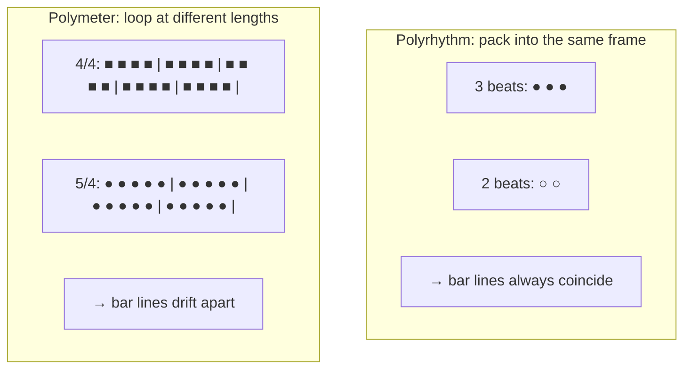
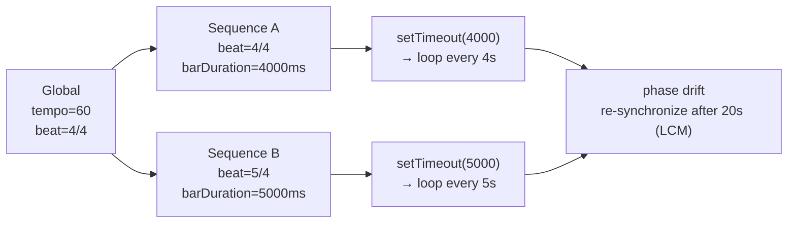

> **Note**: This page is a trace of the author's reading as of 2026-05-05. The code is the truth; this page is merely a snapshot of understanding at that point in time.

# II-2. Polymeter / Polyrhythm

One of OrbitScore's distinctive features is **polymeter**. Multiple sequences loop with different time signatures, and the gradually shifting phase becomes something to enjoy as sound. This chapter looks at the mathematical meaning of polymeter and how OrbitScore implements it.

## The Difference Between Polymeter and Polyrhythm

Let's start by sorting out the terminology.

**Polyrhythm** is fitting multiple different "beat divisions" into the same span of time. For example, in a "3 against 2" polyrhythm, while one voice marks a group of three beats, another voice marks a group of two. Both **align at the same end of the bar**.

**Polymeter** is when multiple voices each have bars of different lengths and loop at their own speeds. For example, when a sequence looping in 4/4 and a sequence looping in 5/4 are placed side by side, the bar boundaries gradually drift apart. **They re-align only much later**.

What OrbitScore realizes is the latter, **polymeter**.



## The Math of Phase: LCM and Re-Synchronization

If we place 4/4 and 5/4 side by side at tempo = 60, after how many seconds do they re-align in phase?

$$
\text{barDuration}_{4/4} = \frac{60000}{60} \times \frac{4}{4} \times 4 = 4000 \text{ ms}
$$

$$
\text{barDuration}_{5/4} = \frac{60000}{60} \times \frac{5}{4} \times 4 = 5000 \text{ ms}
$$

Re-synchronization happens at the least common multiple (LCM) of both bar durations.

$$
\text{LCM}(4000, 5000) = 20000 \text{ ms} = 20 \text{ seconds}
$$

The 4/4 sequence loops 5 bars and the 5/4 sequence loops 4 bars; after 20 seconds they begin again from the same position.

**However, an important caveat**: this LCM calculation **does not exist in OrbitScore's code**. It is an **emergent property**: each sequence independently runs its own loop, and they happen to synchronize again after 20 seconds. Reading the implementation makes this elegance clear.

## Implementation: Independent barDuration per Sequence

The core of polymeter lies in the mechanism that **a `Sequence` can override and set its own `Meter`**. The implementation is in the `calculateEventTiming()` method of `core/sequence/parameters/tempo-manager.ts`.

```typescript
// packages/engine/src/core/sequence/parameters/tempo-manager.ts:86-102
  calculateEventTiming(
    elements: PlayElement[],
    globalTempo: number,
    globalBeat: Meter,
  ): TimedEvent[] {
    const tempo = this._tempo || globalTempo
    const meter = this._beat || globalBeat

    // これにより、シーケンスごとに異なる拍子で1小節の長さを変えられる（ポリメーター）
    // 例: global.beat(4 by 4) = 2000ms, seq.beat(5 by 4) = 2500ms, seq.beat(9 by 8) = 2250ms
    const barDuration = this.calculateBarDuration(tempo, meter)

    // Apply length multiplier to bar duration (stretches each event)
    const effectiveBarDuration = barDuration * (this._length || 1)

    return calculateEventTiming(elements, effectiveBarDuration)
  }
```

The line worth noting is `const meter = this._beat || globalBeat`.

- The sequence has called `beat()` → `this._beat` is set → its own Meter is used
- The sequence has not called `beat()` → `this._beat` is `undefined` → `globalBeat` is used

Thanks to this fallback, the natural behavior emerges that "only sequences that set a beat have their own barDuration; sequences that haven't follow the global time signature."

Similarly, `calculatePatternDuration()` returns the entire pattern length using the same logic.

```typescript
// packages/engine/src/core/sequence/parameters/tempo-manager.ts:73-81
  calculatePatternDuration(globalTempo: number, globalBeat: Meter): number {
    const tempo = this._tempo || globalTempo
    const meter = this._beat || globalBeat
    const barDuration = this.calculateBarDuration(tempo, meter)

    // length() multiplies the duration of each event, not the number of bars
    // So the pattern duration is: 1 bar × length multiplier
    return barDuration * (this._length || 1)
  }
```

## Notation in the DSL

In the DSL it is written as follows.

```js
global.tempo(60)
global.beat(4 by 4)        // global: 4 sec/bar

var kick = init global.seq
kick.beat(4 by 4)          // kick: same as global, 4 sec/bar

var snare = init global.seq
snare.beat(5 by 4)         // snare: 5 sec/bar (longer than global)
```

Here, kick's pattern returns every 4 seconds, and snare's pattern returns every 5 seconds. After 20 seconds the phases align again.

## How the Loop Works and the Accumulation of Phase Shifts

Each sequence runs its loop with a function called `loopSequence()`. Its core is a self-recursive chain using `setTimeout`.

```typescript
// packages/engine/src/core/sequence/playback/loop-sequence.ts:76-129 (the inside of the mute->unmute branch is omitted with // ...)
  const scheduleNextIteration = () => {
    loopTimer = setTimeout(() => {
      const isMuted = getIsMutedFn()
      const isLooping = getIsLoopingFn()

      if (!isLooping) {
        return // Stop the loop
      }

      // Save the duration that this setTimeout was based on
      // (the setTimeout interval matched this value)
      const previousDuration = patternDuration

      // Recalculate pattern duration for the NEXT cycle
      // (may have changed due to tempo/beat/length changes)
      patternDuration = getPatternDurationFn()

      // Detect mute -> unmute transition
      if (wasMuted && !isMuted) {
        // ...
      } else if (!isMuted) {
        // Advance by the PREVIOUS duration (matches the setTimeout interval)
        // This keeps the bar boundary aligned with when the callback actually fired
        nextScheduleTime += previousDuration
        // Clear old scheduled events for this sequence before scheduling new ones
        clearSequenceEventsFn(sequenceName)
        scheduleEventsFn(scheduler, 0, nextScheduleTime)
      }

      // Update previous mute state for next iteration
      wasMuted = isMuted

      // Schedule next iteration with current pattern duration
      scheduleNextIteration()
    }, patternDuration)
    // Update stateManager with current timer ID so stop() can cancel it
    setLoopTimerFn?.(loopTimer)
  }
```

Because the wait time of `setTimeout` is set to `patternDuration`, the loop runs at a different interval per sequence. A 4/4 sequence schedules the next bar's events every 4000ms, and a 5/4 sequence every 5000ms. These asynchronous timers run independently, naturally producing the phase drift.

A point of interest is that `patternDuration = getPatternDurationFn()` is recalculated on every loop. This realizes the dynamic behavior of **changing tempo or time signature during playback being reflected from the next loop**.

## Phase-Shift Simulation

Let's see the phase relationship of 4/4 and 5/4 running concurrently at tempo = 60 over the first 20 seconds.

```mermaid
gantt
  title Phase of 4/4 and 5/4 (tempo = 60)
  dateFormat  X
  axisFormat  %ss

  section 4/4 (4 sec/bar)
  Bar 1    :0, 4000
  Bar 2    :4000, 8000
  Bar 3    :8000, 12000
  Bar 4    :12000, 16000
  Bar 5    :16000, 20000

  section 5/4 (5 sec/bar)
  Bar 1    :0, 5000
  Bar 2    :5000, 10000
  Bar 3    :10000, 15000
  Bar 4    :15000, 20000
```



Looking at the vertical boundaries, we can see that bar lines coincide only at 0 seconds and 20 seconds. At every other moment, the two sequences are in a "shifted" relationship to each other.

## Current Implementation Status and Future Specification

BEAT_METER_SPECIFICATION.md defines two phases.

**Phase 1 (current)**: no restriction on the denominator. Any positive number is accepted and computed mathematically correctly.

**Phase 2 (future)**: restrict the denominator to `1, 2, 4, 8, 16, 32, 64, 128` (powers of 2). To preserve the music-theoretic framework and ensure consistency with MIDI.

In the current implementation, `TempoManager.setBeat()` accepts any denominator.

```typescript
// packages/engine/src/core/sequence/parameters/tempo-manager.ts:28-30
  setBeat(numerator: number, denominator: number): void {
    this._beat = { numerator, denominator }
  }
```

There is no validation of the denominator; even a music-theoretically non-standard time signature like `beat(7 by 6)` works in computation.

## Implementation Difference from Polyrhythm

Let's reaffirm the implementation difference from polyrhythm here.

If OrbitScore wanted to realize polyrhythm, it would need to "pack different numbers of events into the same barDuration." But the current `calculateEventTiming()` divides barDuration evenly to place events.

```typescript
// packages/engine/src/timing/calculation/calculate-event-timing.ts:34-35
  // Calculate duration for each element at this level
  const elementDuration = barDuration / elements.length
```

For example, `seq.play(1, 2, 3)` divides barDuration into 3, and `seq.play(1, 2, 3, 4)` into 4. This is the consistent rule of **each sequence dividing its own barDuration evenly**.

Therefore "two patterns with different beat counts" in OrbitScore reduces naturally to differing barDurations = polymeter. Polyrhythm in the strict sense (different divisions within the same bar frame) is not directly realized in the current design.

## Summary

OrbitScore's polymeter, when read in the implementation, has a strikingly simple structure.



The simple design that "each sequence computes its own barDuration and runs its loop with a setTimeout of that length" produces the musically rich behavior of polymeter. Re-synchronization via LCM is not implemented intentionally; it is an emergent property arising from independent timers.

## Related Terms

- [DSL](/en/glossary#dsl) — the domain-specific language defined by OrbitScore. The `beat(n by m)` syntax specifies the time signature per sequence
- [chop](/en/glossary#chop) — the method that divides an audio file equally. The chop count becomes the unit of subdivision of barDuration
- [play pattern](/en/glossary#play-pattern) — the sample trigger sequence. In polymeter, each sequence has a pattern of independent length

## Next Exploration Candidates

- Why a self-recursive chain of `setTimeout` is used rather than `setInterval` (handling `patternDuration` changes mid-loop)
- The accuracy of the drift correction logic of `nextScheduleTime += previousDuration` (impact on cumulative error)
- LCM calculation when three or more sequences have different time signatures (e.g., 3/4, 4/4, 5/4 → LCM = 60 seconds)
- Predicting parser modifications when Phase 2 denominator validation is implemented (`validDenominators` check in `parse-expression.ts`)
- Seamless resume logic without phase reset on mute / unmute (`scheduleEventsFromTimeFn` and `reinitializeSequenceTracking`)

## Sources

- `packages/engine/src/core/sequence/parameters/tempo-manager.ts:86-102` — `calculateEventTiming()`: the core logic of falling back from a sequence's own meter to `globalBeat`
- `packages/engine/src/core/sequence/parameters/tempo-manager.ts:73-81` — `calculatePatternDuration()`: pattern length calculation (including length modifier)
- `packages/engine/src/core/sequence/parameters/tempo-manager.ts:64-68` — `calculateBarDuration()`: tempo + meter → ms conversion formula
- `packages/engine/src/core/sequence/parameters/tempo-manager.ts:28-30` — `setBeat()`: currently no denominator validation
- `packages/engine/src/core/sequence/playback/loop-sequence.ts:76-129` — `scheduleNextIteration()`: setTimeout chain loop and dynamic recalculation of patternDuration
- `packages/engine/src/timing/calculation/calculate-event-timing.ts:34-35` — even subdivision via `barDuration / elements.length`
- `packages/engine/src/core/global/types.ts:5-8` — the `Meter` interface
- [BEAT_METER_SPECIFICATION.md](https://github.com/signalcompose/orbitscore/blob/main/docs/development/BEAT_METER_SPECIFICATION.md) — Phase 1/2 specification, future denominator restriction plan, and the polymeter example proven at ICMC (4/4 vs 5/4)
