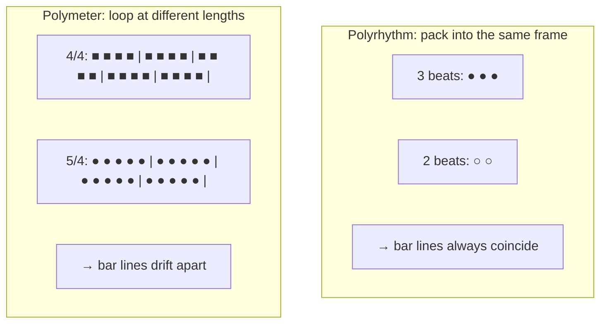
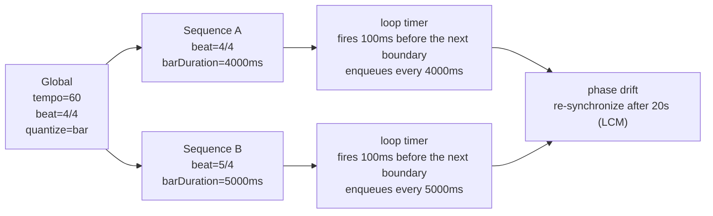

> **Note**: This page is a trace of the author's reading as of 2026-09-01. The code is the truth; this page is only a snapshot of understanding at that time.

# II-2. Polymeter / Polyrhythm

One of OrbitScore's distinctive features is **polymeter**. Multiple sequences loop with different time signatures, and the gradually shifting phase becomes something to enjoy as sound. This chapter looks at the mathematical meaning of polymeter and how OrbitScore implements it.

## Re-verification Notes of 2026-09-01

This chapter was originally written on 2026-05-05 (0a4b598) and re-checked against the code at 2026-09-01 (69dc968). The core of polymeter (the per-`Sequence` `_beat || globalBeat` fallback and the independent loop timer per sequence) has not changed. What changed substantially is **how the loop timer is re-armed**:

- With #389 on 2026-07-07, the naive re-arm of `setTimeout(patternDuration)` was replaced by a scheme that **fires 100 ms before the boundary, with a delay computed back from the absolute grid** (`LOOP_TIMER_LEAD_MS`). The "accuracy of the drift correction of `nextScheduleTime += previousDuration`" that the 2026-05 version listed under "next exploration candidates" is exactly the problem this fix addressed
- Launch quantize (`global.quantize()` / `seq.quantize()`, #212 / PR #215) makes the first bar of `seq.loop()` start aligned to the **global bar boundary**. This matters for polymeter, so this chapter covers it too
- A #390 (live playhead) comment was added at the tail of `calculateEventTiming()`, shifting line numbers

## The Difference Between Polymeter and Polyrhythm

Let's start by sorting out the terminology.

**Polyrhythm** is fitting multiple different "beat divisions" into the same span of time. For example, in a "3 against 2" polyrhythm, while one voice marks a group of three beats, another voice marks a group of two. Both **align at the same end of the bar**.

**Polymeter** is when multiple voices each have bars of different lengths and loop at their own speeds. For example, when a sequence looping in 4/4 and a sequence looping in 5/4 are placed side by side, the bar boundaries gradually drift apart. **They re-align only much later**.

What OrbitScore realizes is the latter, **polymeter**.


```mermaid
flowchart TB
  subgraph PR["Polyrhythm: pack into the same frame"]
    direction LR
    P3["3 beats: ● ● ●"]
    P2["2 beats: ○ ○"]
    PNote["→ bar lines always coincide"]
  end
  subgraph PM["Polymeter: loop at different lengths"]
    direction LR
    M4["4/4: ■ ■ ■ ■ | ■ ■ ■ ■ | ■ ■ ■ ■ | ■ ■ ■ ■ | ■ ■ ■ ■ |"]
    M5["5/4: ● ● ● ● ● | ● ● ● ● ● | ● ● ● ● ● | ● ● ● ● ● |"]
    PMNote["→ bar lines drift apart"]
  end
```

## The Math of Phase: LCM and Re-Synchronization

If we place 4/4 and 5/4 side by side at tempo = 60, after how many seconds do they re-align in phase?

$$
\text{barDuration}_{4/4} = \frac{60000}{60} \times \frac{4}{4} \times 4 = 4000 \text{ ms}
$$

$$
\text{barDuration}_{5/4} = \frac{60000}{60} \times \frac{5}{4} \times 4 = 5000 \text{ ms}
$$

Re-synchronization happens at the least common multiple (LCM) of both bar durations.

$$
\text{LCM}(4000, 5000) = 20000 \text{ ms} = 20 \text{ seconds}
$$

The 4/4 sequence loops 5 bars and the 5/4 sequence loops 4 bars; after 20 seconds they begin again from the same position.

**However, an important caveat**: this LCM calculation **does not exist in OrbitScore's code**. It is an **emergent property**: each sequence independently runs its own loop, and they happen to synchronize again after 20 seconds. Reading the implementation makes this elegance clear.

## Implementation: Independent barDuration per Sequence

The core of polymeter lies in the mechanism that **a `Sequence` can override and set its own `Meter`**. The implementation is in the `calculateEventTiming()` method of `core/sequence/parameters/tempo-manager.ts`.

```typescript
// packages/engine/src/core/sequence/parameters/tempo-manager.ts:86-105
  calculateEventTiming(
    elements: PlayElement[],
    globalTempo: number,
    globalBeat: Meter,
  ): TimedEvent[] {
    const tempo = this._tempo || globalTempo
    const meter = this._beat || globalBeat

    // これにより、シーケンスごとに異なる拍子で1小節の長さを変えられる（ポリメーター）
    // 例: global.beat(4 by 4) = 2000ms, seq.beat(5 by 4) = 2500ms, seq.beat(9 by 8) = 2250ms
    const barDuration = this.calculateBarDuration(tempo, meter)

    // Apply length multiplier to bar duration (stretches each event)
    const effectiveBarDuration = barDuration * (this._length || 1)

    // #390 live playhead: each event carries its full argPath ("1.0" for
    // nested slots) — tagged inside the timing walk itself (see
    // calculateEventTiming's argPathPrefix). Observational only.
    return calculateEventTiming(elements, effectiveBarDuration)
  }
```

The line worth noting is `const meter = this._beat || globalBeat`.

- The sequence has called `beat()` → `this._beat` is set → its own Meter is used
- The sequence has not called `beat()` → `this._beat` is `undefined` → `globalBeat` is used

Thanks to this fallback, the natural behavior emerges that "only sequences that set a beat have their own barDuration; sequences that haven't follow the global time signature."

Similarly, `calculatePatternDuration()` returns the entire pattern length using the same logic.

```typescript
// packages/engine/src/core/sequence/parameters/tempo-manager.ts:73-81
  calculatePatternDuration(globalTempo: number, globalBeat: Meter): number {
    const tempo = this._tempo || globalTempo
    const meter = this._beat || globalBeat
    const barDuration = this.calculateBarDuration(tempo, meter)

    // length() multiplies the duration of each event, not the number of bars
    // So the pattern duration is: 1 bar × length multiplier
    return barDuration * (this._length || 1)
  }
```

## Notation in the DSL

In the DSL it is written as follows.

```js
global.tempo(60)
global.beat(4 by 4)        // グローバル: 4秒/小節

var kick = init global.seq
kick.beat(4 by 4)          // キック: グローバルと同じ 4秒/小節

var snare = init global.seq
snare.beat(5 by 4)         // スネア: 5秒/小節（グローバルより長い）
```

Here, kick's pattern returns every 4 seconds, and snare's pattern returns every 5 seconds. After 20 seconds the phases align again.

## How the Loop Works: A setTimeout Chain Anchored to the Grid

Each sequence runs its loop with a function called `loopSequence()`. Its core is a self-recursive chain using `setTimeout`. However, since #389 on 2026-07-07, the way "how many ms from now the next setTimeout is armed" is decided has changed substantially. Let's start with the constant at the top of the file and its explanation.

```typescript
// packages/engine/src/core/sequence/playback/loop-sequence.ts:3-14
/**
 * How far BEFORE a bar boundary the loop timer fires (#389 mechanism A).
 *
 * setTimeout never fires early, so a timer aimed exactly AT the boundary
 * fires late by the event-loop's current lag — and the bar-head event it
 * enqueues (time = boundary) is already in the past, dispatching immediately
 * and audibly late. Firing with this lead keeps every enqueued event in the
 * future, so the scheduler's 1ms poll releases it ON the grid. The lead also
 * absorbs ordinary callback jitter; it only needs to cover event-loop lag,
 * not the audio path (the daemon has its own lookahead).
 */
export const LOOP_TIMER_LEAD_MS = 100
```

The key property is that "`setTimeout` never fires early." If you aim a timer exactly at the bar boundary, it always fires **late** by the event loop's lag, and the bar-head event it enqueues at that moment (`time = boundary`) is already in the past. Past events are dispatched immediately by the polling loop, so there was a structural problem where only the bar head was audibly late. In the measurements of WORK_LOG 6.198, this lateness accumulated monotonically by about +0.19 ms per bar.

So #389 made the timer fire **100 ms before** the boundary, enqueueing the next bar's events as "future." The delay computation is consolidated in `armDelay()`.

```typescript
// packages/engine/src/core/sequence/playback/loop-sequence.ts:145-155
  const armDelay = (boundary: number): number => {
    const leadMs = Math.min(LOOP_TIMER_LEAD_MS, patternDuration / 2)
    const raw = boundary + patternDuration - leadMs - (Date.now() - scheduler.startTime)
    if (raw < -patternDuration && Date.now() - lastLagLogMs > 5000) {
      lastLagLogMs = Date.now()
      console.warn(
        `⚠️ ${sequenceName}: loop timer lagged ${Math.round(-raw)}ms behind the grid (system stall?) — catching up; stale bars may be skipped`,
      )
    }
    return Math.max(0, raw)
  }
```

The essence is the formula `raw = (next boundary) − lead − (current relative time)`. `boundary` is "the base time of the bar just enqueued," `boundary + patternDuration` is the next boundary, and the remaining time until `leadMs` before it is **recomputed from `Date.now()` every time**, so a late callback does not carry its lateness into the next delay (the anchor to the absolute grid). `Math.min(LOOP_TIMER_LEAD_MS, patternDuration / 2)` is a guard against the degenerate case where an extremely short pattern (under 100 ms) would always yield a delay of 0. `Math.max(0, raw)` is the catch-up path after a large stall due to OS sleep or GC; in that case the loop re-fires immediately bar by bar, and stale bars are dropped by the scheduler-side drift guard (covered in [II-3](/en/scheduling/event-queue)).

`scheduleNextIteration()` is what recurses using that `armDelay()`.

```typescript
// packages/engine/src/core/sequence/playback/loop-sequence.ts:157-218 (mute->unmute 分岐の内部を // ... で省略)
  const scheduleNextIteration = (delayMs: number) => {
    loopTimer = setTimeout(() => {
      const isMuted = getIsMutedFn()
      const isLooping = getIsLoopingFn()

      if (!isLooping) {
        return // Stop the loop
      }

      // Save the duration that this setTimeout was based on
      // (the setTimeout interval matched this value)
      const previousDuration = patternDuration

      // Recalculate pattern duration for the NEXT cycle
      // (may have changed due to tempo/beat/length changes)
      patternDuration = getPatternDurationFn()

      // Detect mute -> unmute transition
      if (wasMuted && !isMuted) {
        // ...
      } else if (!isMuted) {
        // Advance by the PREVIOUS duration (matches the setTimeout interval)
        // This keeps the bar boundary aligned with when the callback actually fired
        nextScheduleTime += previousDuration
        // Clear old scheduled events for this sequence before scheduling new ones
        clearSequenceEventsFn(sequenceName)
        safeSchedule(() => scheduleEventsFn(scheduler, 0, nextScheduleTime))
      }

      // Update previous mute state for next iteration
      wasMuted = isMuted

      // Re-arm anchored to the absolute grid (#389 mechanism A): the delay is
      // recomputed from the NEXT boundary minus now, so a late callback does
      // not push every subsequent one later (the old fixed-patternDuration
      // re-arm accumulated ~+0.2ms/bar forever). While muted there is nothing
      // scheduled and nextScheduleTime is deliberately stale (the unmute
      // branch re-baselines it), so a plain idle wait avoids a negative-delay
      // hot loop.
      if (isMuted) {
        scheduleNextIteration(patternDuration)
      } else {
        scheduleNextIteration(armDelay(nextScheduleTime))
      }
    }, delayMs)
    // Update stateManager with current timer ID so stop() can cancel it
    setLoopTimerFn?.(loopTimer)
  }
```

What matters from the polymeter perspective is that `nextScheduleTime += previousDuration` advances the bar's base time by **each sequence's own `patternDuration`**. A 4/4 sequence enqueues the next bar's events every 4000 ms, and a 5/4 sequence every 5000 ms. These independent timers running side by side naturally produce the phase drift.

`patternDuration = getPatternDurationFn()` is recalculated on every loop. This realizes the dynamic behavior of **changing tempo or time signature during playback being reflected from the next loop**. `previousDuration` is saved separately so that the base time advances by "the length this setTimeout was armed with"; the changed length takes effect from the next `armDelay()`.

One more thing that did not exist in the 2026-05 version is the `safeSchedule()` wrapper. An exception or rejection inside `setTimeout` is awaited by nobody, so left alone it becomes a process crash (from Node 22 on, an unhandled rejection is fatal). It is a guard that keeps the loop alive (with the last good schedule) while logging, for cases such as a rejected degree introduced by swapping `play()` mid-loop.

## Quantize and Polymeter: Only the First Bar Aligns Globally

With launch quantize (`global.quantize("bar")` is the default), the **start time of the first bar** of `seq.loop()` is aligned not to the sequence's own meter but to the **bar boundary formed by the global `tempo()` × `beat()`**. `loopSequence()` receives it via the `startTime` option.

```typescript
// packages/engine/src/core/sequence/playback/loop-sequence.ts:84-104
  // Quantized start: if startTime is in the future, the first iteration is
  // scheduled at startTime and the first wait is reduced from one full
  // patternDuration to (patternDuration - leadIn) so subsequent boundaries
  // stay on startTime + n × patternDuration.
  const effectiveStart =
    startTime !== undefined && startTime > currentTime ? startTime : currentTime
  const leadInMs = effectiveStart - currentTime

  if (leadInMs > 0) {
    console.log(
      `🔄 ${sequenceName} (loop queued, +${Math.round(leadInMs)}ms to next quantize boundary)`,
    )
  } else {
    console.log(`🔄 ${sequenceName} (loop started)`)
  }

  // Track next scheduled time (cumulative, to avoid drift)
  let nextScheduleTime = effectiveStart

  // Schedule first iteration at the quantized start
  scheduleEventsFn(scheduler, 0, nextScheduleTime)
```

It is `Sequence.loop()` that passes `startTime`, the result of `nextQuantizedTime()` (computed from the global tempo and beat).

```typescript
// packages/engine/src/core/sequence.ts:1747-1755
    // Quantize the loop start to the next bar boundary on the master grid so
    // newly-started LOOPs slot in cleanly with whatever is already running.
    const startTime = this.nextQuantizedTime(currentTime)

    const result = loopSequence({
      sequenceName: this.stateManager.getName(),
      scheduler,
      currentTime,
      startTime,
```

In other words, the polymeter explanation "4/4 and 5/4 align after 20 seconds" holds when **both sequences departed from the same global bar boundary**. The core spec (INSTRUCTION_ORBITSCORE_DSL.md §5) states this explicitly: "even with a per-seq meter override such as `seq.beat(5 by 4)`, the global bar boundary is the reference for launch," and an option to align to the sequence's own bar boundary is a post-1.1 consideration. Once the departure points are aligned, each sequence proceeds independently with its own `patternDuration`, so the phase drift and the LCM re-synchronization are as described in the 2026-05 version.

## Phase-Shift Simulation

Let's see the phase relationship of 4/4 and 5/4 running concurrently at tempo = 60 over the first 20 seconds.


```mermaid
gantt
  title Phase of 4/4 and 5/4 (tempo = 60)
  dateFormat  X
  axisFormat  %ss

  section 4/4 (4 sec/bar)
  Bar 1    :0, 4000
  Bar 2    :4000, 8000
  Bar 3    :8000, 12000
  Bar 4    :12000, 16000
  Bar 5    :16000, 20000

  section 5/4 (5 sec/bar)
  Bar 1    :0, 5000
  Bar 2    :5000, 10000
  Bar 3    :10000, 15000
  Bar 4    :15000, 20000
```

Looking at the vertical boundaries, we can see that bar lines coincide only at 0 seconds and 20 seconds. At every other moment, the two sequences are in a "shifted" relationship to each other.

## Implementation Status and the Phases of BEAT_METER_SPECIFICATION

BEAT_METER_SPECIFICATION.md defines two phases.

**Phase 1 (the implementation as of 2026-09-01)**: no restriction on the denominator. Any positive number is accepted and computed mathematically correctly.

**Phase 2 (not implemented)**: restrict the denominator to `1, 2, 4, 8, 16, 32, 64, 128` (powers of 2). To preserve the music-theoretic framework and ensure consistency with MIDI.

As of 2026-09-01, `TempoManager.setBeat()` accepts any denominator.

```typescript
// packages/engine/src/core/sequence/parameters/tempo-manager.ts:28-30
  setBeat(numerator: number, denominator: number): void {
    this._beat = { numerator, denominator }
  }
```

There is no validation of the denominator; even a music-theoretically non-standard time signature like `beat(7 by 6)` works in computation.

## Implementation Difference from Polyrhythm

Let's reaffirm the implementation difference from polyrhythm here.

If OrbitScore wanted to realize polyrhythm, it would need to "pack different numbers of events into the same barDuration." But `calculateEventTiming()` divides barDuration evenly to place events.

```typescript
// packages/engine/src/timing/calculation/calculate-event-timing.ts:104-105
  // Calculate duration for each element at this level
  const elementDuration = barDuration / elements.length
```

For example, `seq.play(1, 2, 3)` divides barDuration into 3, and `seq.play(1, 2, 3, 4)` into 4. This is the consistent rule of **each sequence dividing its own barDuration evenly**.

Therefore "two patterns with different beat counts" in OrbitScore reduces naturally to differing barDurations = polymeter. Polyrhythm in the strict sense (different divisions within the same bar frame) is not directly realized in the design as of 2026-09-01. That said, with nesting such as `seq.play([1, 2, 3], [1, 2])` you can split a bar in two and then divide the first half into 3 and the second half into 2, so a notation close to "3 against 2 within a bar" is possible (nesting further subdivides the parent slot's `elementDuration` evenly).

## Summary

OrbitScore's polymeter, when read in the implementation, has a strikingly simple structure.


```mermaid
flowchart LR
  G["Global\ntempo=60\nbeat=4/4\nquantize=bar"] --> S1["Sequence A\nbeat=4/4\nbarDuration=4000ms"]
  G --> S2["Sequence B\nbeat=5/4\nbarDuration=5000ms"]
  S1 --> L1["loop timer\nfires 100ms before the next boundary\nenqueues every 4000ms"]
  S2 --> L2["loop timer\nfires 100ms before the next boundary\nenqueues every 5000ms"]
  L1 --> PHASE["phase drift\nre-synchronize after 20s (LCM)"]
  L2 --> PHASE
```

The simple design that "each sequence computes its own barDuration, advances its base time by that length, and runs its loop with a setTimeout anchored to the grid" produces the musically rich behavior of polymeter. Re-synchronization via LCM is not implemented intentionally; it is an emergent property arising from independent timers. Launch quantize only aligns the departure point to the global bar boundary and does not touch the independence afterwards.

## Related Terms

- [DSL](/en/glossary#dsl) — the domain-specific language defined by OrbitScore. The `beat(n by m)` syntax specifies the time signature per sequence
- [chop](/en/glossary#chop) — the method that divides an audio file equally. The chop count becomes the unit of subdivision of barDuration
- [play pattern](/en/glossary#play-pattern) — the sample trigger sequence. In polymeter, each sequence has a pattern of independent length

## Next Exploration Candidates

- Why a self-recursive chain of `setTimeout` is used rather than `setInterval` (handling `patternDuration` changes mid-loop), and how the grid anchoring of #389 reinforced it
- LCM calculation when three or more sequences have different time signatures (e.g., 3/4, 4/4, 5/4 → LCM = 60 seconds)
- Predicting parser modifications when Phase 2 denominator validation is implemented (`validDenominators` check in `parse-expression.ts`)
- Seamless resume logic without phase reset on mute / unmute (`scheduleEventsFromTimeFn` and `reinitializeSequenceTracking`)
- How many bars get dropped after waking from sleep, given the combination of the catch-up path via `Math.max(0, raw)` in `armDelay()` and the scheduler-side `MAX_DRIFT_MS` (1000 ms) guard
- Where the LCM re-synchronization point moves if `seq.quantize("off")` lets a polymeter sequence depart independently of the global boundary
- The kinds of exceptions `safeSchedule()` swallows while keeping the loop alive (such as the §2.1 degree rejection) and how they appear in the log

## Sources

- `packages/engine/src/core/sequence/parameters/tempo-manager.ts:86-105` — `calculateEventTiming()`: the core logic of falling back from a sequence's own meter to `globalBeat`
- `packages/engine/src/core/sequence/parameters/tempo-manager.ts:73-81` — `calculatePatternDuration()`: pattern length calculation (including length modifier)
- `packages/engine/src/core/sequence/parameters/tempo-manager.ts:64-68` — `calculateBarDuration()`: tempo + meter → ms conversion formula
- `packages/engine/src/core/sequence/parameters/tempo-manager.ts:28-30` — `setBeat()`: no denominator validation
- `packages/engine/src/core/sequence/playback/loop-sequence.ts:3-14` — `LOOP_TIMER_LEAD_MS` (100 ms) and the explanation of #389 mechanism A
- `packages/engine/src/core/sequence/playback/loop-sequence.ts:84-104` — handling of the quantized start (`startTime` option)
- `packages/engine/src/core/sequence/playback/loop-sequence.ts:145-155` — `armDelay()`: re-arm delay computed back from the absolute grid
- `packages/engine/src/core/sequence/playback/loop-sequence.ts:157-218` — `scheduleNextIteration()`: setTimeout chain loop and dynamic recalculation of patternDuration
- `packages/engine/src/core/sequence.ts:1747-1755` — `Sequence.loop()`: passing the result of `nextQuantizedTime()` as `startTime`
- `packages/engine/src/core/global/quantize-manager.ts:56-73` — `nextQuantizedTime()`: computing the next boundary from the global tempo/beat
- `packages/engine/src/timing/calculation/calculate-event-timing.ts:104-105` — even subdivision via `barDuration / elements.length`
- `packages/engine/src/core/global/types.ts:5-8` — the `Meter` interface
- `docs/core/INSTRUCTION_ORBITSCORE_DSL.md` §5 "Launch Quantize" — "behavior under polymeter" (the global bar boundary is the launch reference)
- `docs/archive/WORK_LOG_2026-07.md` 6.198 — measurements for #389 (+0.19 ms/bar accumulation before the fix, mean|dev| 0.52 ms after)
- Issue [#389](https://github.com/signalcompose/orbitscore/issues/389) — sawtooth timing jitter (the background of grid anchoring)
- Issue [#212](https://github.com/signalcompose/orbitscore/issues/212) / PR [#215](https://github.com/signalcompose/orbitscore/pull/215) — launch quantize
- [BEAT_METER_SPECIFICATION.md](https://github.com/signalcompose/orbitscore/blob/main/docs/development/BEAT_METER_SPECIFICATION.md) — Phase 1/2 specification, future denominator restriction plan, and the polymeter example proven at ICMC (4/4 vs 5/4)
