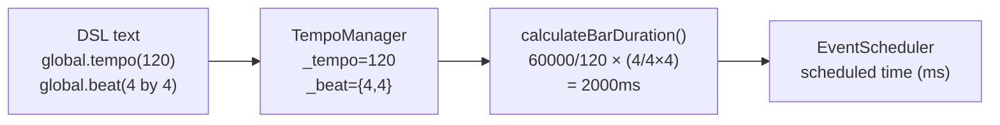
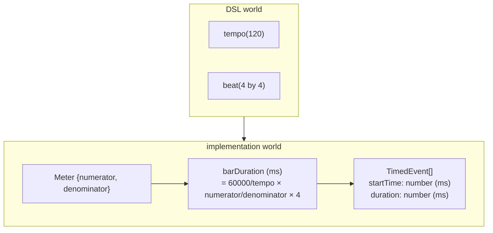

> **Note**: This page is a trace of the author's reading as of 2026-05-05. The code is the truth; this page is merely a snapshot of understanding at that point in time.

# II-1. Time Representation

OrbitScore operates by answering the question "when should sound be produced." To produce that answer, the concepts of **tempo, beat, and bar** must be converted into a computable form. This chapter follows the implementation to see how DSL descriptions like `global.tempo(120)` and `global.beat(4 by 4)` are converted internally into time (ms).

## Basic Units of Time

OrbitScore's time representation has three conceptual units.

| Concept | Description | Unit |
|---|---|---|
| **tempo** | the number of quarter notes per minute (BPM) | bpm |
| **beat / meter** | the composition of beats per bar (numerator / denominator) | — |
| **bar duration** | the actual length of a bar in real time | ms |

The world the DSL user sees is described in tempo and beat, but the world the scheduler handles is entirely **floating-point numbers in ms**.

## The Meter Type: Numeric Representation of Time Signature

Time signature information is represented by an interface called `Meter`.

```typescript
// packages/engine/src/core/global/types.ts:5-8
export interface Meter {
  numerator: number
  denominator: number
}
```

It holds `numerator` and `denominator` as integers. For example, a 4/4 time signature is `{ numerator: 4, denominator: 4 }`, and 5/4 is `{ numerator: 5, denominator: 4 }`.

What is worth noting is that the `Meter` type is purely a "structured container for the DSL's `beat(n1 by n2)`," and **OrbitScore does not use a rational number type**. There is no dedicated `Fraction` or `Rational` class; numerator and denominator are kept as integers, and they are immediately converted to floating-point ms.

> NOTE: unverified — whether there is a plan in a future version to introduce a rational-number library has not been confirmed in the docs. BEAT_METER_SPECIFICATION.md presents all calculation examples as floats, suggesting the current design does not use a rational type.

## Tempo Management on Global

The tempo and beat of the `Global` class are delegated to `TempoManager`.

```typescript
// packages/engine/src/core/global/tempo-manager.ts:1-36
/**
 * Tempo and meter management for Global class
 */

import { Meter } from './types'

export class TempoManager {
  private _tempo: number = 120
  private _beat: Meter = { numerator: 4, denominator: 4 }

  // Note: tick and key have been removed
  // - tick: MIDI resolution, not needed for audio implementation
  // - key: Will be added when MIDI support is implemented

  // Property accessors with method chaining
  tempo(value?: number): number | this {
    if (value === undefined) {
      return this._tempo
    }
    this._tempo = value
    return this
  }

  beat(numerator: number, denominator: number): this {
    this._beat = { numerator, denominator }
    return this
  }

  // Get current state
  getState() {
    return {
      tempo: this._tempo,
      beat: this._beat,
    }
  }
}
```

The default values are `tempo = 120` and `beat = 4/4`. The `tempo()` and `beat()` methods return `this` to enable **method chaining**.

## The bar duration Calculation Formula

Once tempo and meter are determined, the length of one bar (bar duration) can be calculated in ms. The calculation logic is implemented in the `TempoManager` of `Sequence`.

```typescript
// packages/engine/src/core/sequence/parameters/tempo-manager.ts:64-68
  private calculateBarDuration(tempo: number, meter: Meter): number {
    // 1小節の長さ = 4分音符の長さ × (分子 / 分母 × 4)
    const quarterNoteDuration = 60000 / tempo
    return quarterNoteDuration * ((meter.numerator / meter.denominator) * 4)
  }
```

Expressed mathematically, this formula is:

$$
\text{quarterNote} = \frac{60000}{\text{tempo}} \text{ (ms)}
$$

$$
\text{barDuration} = \text{quarterNote} \times \frac{\text{numerator}}{\text{denominator}} \times 4 \text{ (ms)}
$$

Let's get a feel for it with concrete examples.

### Calculation Examples

**Example 1: tempo = 60, beat = 4/4**

```
quarterNote = 60000 / 60 = 1000ms
barDuration = 1000 × (4 / 4 × 4) = 4000ms
→ 1 beat = 1 second, 1 bar = 4 seconds
```

**Example 2: tempo = 60, beat = 5/4**

```
quarterNote = 60000 / 60 = 1000ms
barDuration = 1000 × (5 / 4 × 4) = 5000ms
→ 1 beat = 1 second, 1 bar = 5 seconds
```

**Example 3: tempo = 120, beat = 7/8**

```
quarterNote = 60000 / 120 = 500ms
barDuration = 500 × (7 / 8 × 4) = 500 × 3.5 = 1750ms
→ 1 beat (eighth note) = 250ms, 1 bar = 1.75 seconds
```

The `× 4` in the formula means "the reference is the quarter note." If the denominator is 4, divide by quarter notes; if the denominator is 8, divide by eighth notes — the formula directly encodes the musical meaning of time signatures.

## Generalized Calculation Flow



From DSL to EventScheduler, time is never converted into units like "beat count" or "tick count." It flows consistently as **floating-point numbers in ms**.

## Bar Offset: Conversion to Absolute Time

Once bar duration is determined, the start time of the n-th bar can be calculated by the following function.

```typescript
// packages/engine/src/timing/calculation/convert-to-absolute-timing.ts:18-29
export function convertToAbsoluteTiming(
  events: TimedEvent[],
  barNumber: number,
  barDuration: number,
): TimedEvent[] {
  const barOffset = barNumber * barDuration

  return events.map((event) => ({
    ...event,
    startTime: event.startTime + barOffset,
  }))
}
```

It just adds `barOffset = barNumber × barDuration` to each event's `startTime`. Simple, but this is the bridge from "relative time within a bar" to "absolute time used by the scheduler."

## TimedEvent: The Scheduler's Basic Unit

The intermediate result of the timing calculation is represented by a type called `TimedEvent`.

```typescript
// packages/engine/src/timing/calculation/types.ts:8-13
export interface TimedEvent {
  sliceNumber: number // 0 for silence, 1-n for slice
  startTime: number // Start time in milliseconds relative to bar start
  duration: number // Duration in milliseconds
  depth: number // Nesting depth (for debugging)
}
```

Both `startTime` and `duration` are in ms. `sliceNumber` indicates "which audio slice to play," and `0` means a rest. `depth` is a debugging field for nested patterns (such as the nesting structure of `seq.play(1, [2, 3], 4)`).

## Debugging Aid: formatTiming

There is a helper function that converts a `TimedEvent[]` into a human-readable string.

```typescript
// packages/engine/src/timing/calculation/format-timing.ts:17-38
export function formatTiming(events: TimedEvent[], bpm: number = 120): string {
  const lines: string[] = []
  const beatDuration = 60000 / bpm // ms per beat

  for (const event of events) {
    const startBeat = event.startTime / beatDuration
    const durationBeats = event.duration / beatDuration
    const indent = '  '.repeat(event.depth)

    if (event.sliceNumber === 0) {
      lines.push(
        `${indent}[silence] @ beat ${startBeat.toFixed(2)} for ${durationBeats.toFixed(2)} beats`,
      )
    } else {
      lines.push(
        `${indent}Slice ${event.sliceNumber} @ beat ${startBeat.toFixed(2)} for ${durationBeats.toFixed(2)} beats`,
      )
    }
  }

  return lines.join('\n')
}
```

This function reverse-converts ms to beat counts for display. What is worth noting is the design that **internally everything is computed in ms, only the debug display is converted back to beat counts**. Calculation precision is kept in ms, and beat-count display is used purely for readability.

## Summary

In one sentence, OrbitScore's time representation is: "the DSL describes things in musical units (tempo, beat), and the implementation converts everything to ms internally."



The core of the conversion is the two-line formula in `calculateBarDuration()`. Understanding this formula also lets you answer the question of why polymeter, covered in the next chapter, can be realized so naturally.

## Related Terms

- [DSL](/en/glossary#dsl) — the domain-specific language defined by OrbitScore. The `tempo()` / `beat()` syntax is the starting point for the time representation in this chapter
- [chop](/en/glossary#chop) — the method that divides an audio file equally. Directly tied to the `duration` field of `TimedEvent`
- [play pattern](/en/glossary#play-pattern) — the sample trigger sequence. The target that the scheduler converts into ms and arranges

## Next Exploration Candidates

- How the inverse conversion (ms → beat count) in `formatTiming()` handles floating-point error (the impact of `.toFixed(2)`)
- The numerical precision impact of computing `numerator / denominator × 4` in this order in `calculateBarDuration()` (how things would change if integer arithmetic were done first before floating point)
- If the Phase 2 proposal in BEAT_METER_SPECIFICATION.md (restricting denominators to powers of 2) is implemented, the cost of validation on the parser side and the impact on the scheduler
- The mechanism by which the `length()` modifier multiplies into `effectiveBarDuration` via the `_length` field (`tempo-manager.ts:99`)

## Sources

- `packages/engine/src/core/global/types.ts:5-8` — definition of the `Meter` interface (integer fields `numerator`, `denominator`)
- `packages/engine/src/core/global/tempo-manager.ts:1-36` — `TempoManager`: default `_tempo` 120, default `_beat` 4/4
- `packages/engine/src/core/sequence/parameters/tempo-manager.ts:64-68` — `calculateBarDuration()`: bar duration formula
- `packages/engine/src/core/sequence/parameters/tempo-manager.ts:73-101` — `calculatePatternDuration()` / `calculateEventTiming()`: application of the length modifier
- `packages/engine/src/timing/calculation/types.ts:8-13` — the `TimedEvent` interface (`startTime`, `duration` in ms)
- `packages/engine/src/timing/calculation/convert-to-absolute-timing.ts:18-29` — `convertToAbsoluteTiming()`: offset calculation by `barNumber × barDuration`
- `packages/engine/src/timing/calculation/format-timing.ts:17-38` — `formatTiming()`: ms → beat count inverse conversion (for debugging)
- [BEAT_METER_SPECIFICATION.md](https://github.com/signalcompose/orbitscore/blob/main/docs/development/BEAT_METER_SPECIFICATION.md) — bar-length formula specification and future denominator restriction proposal
