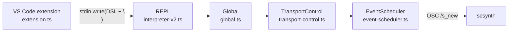
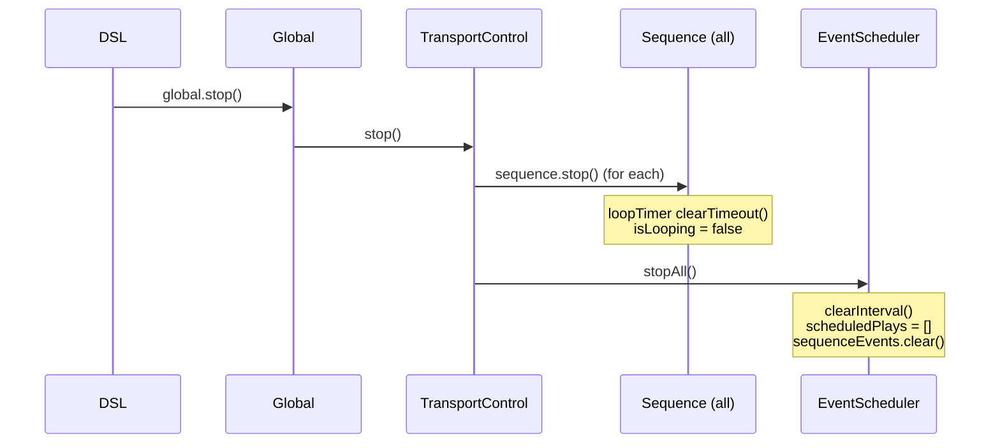
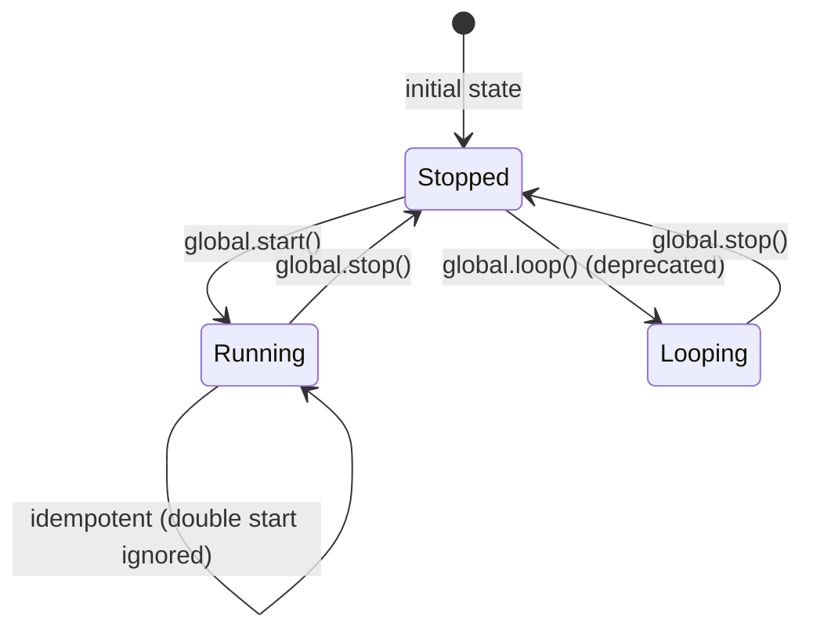
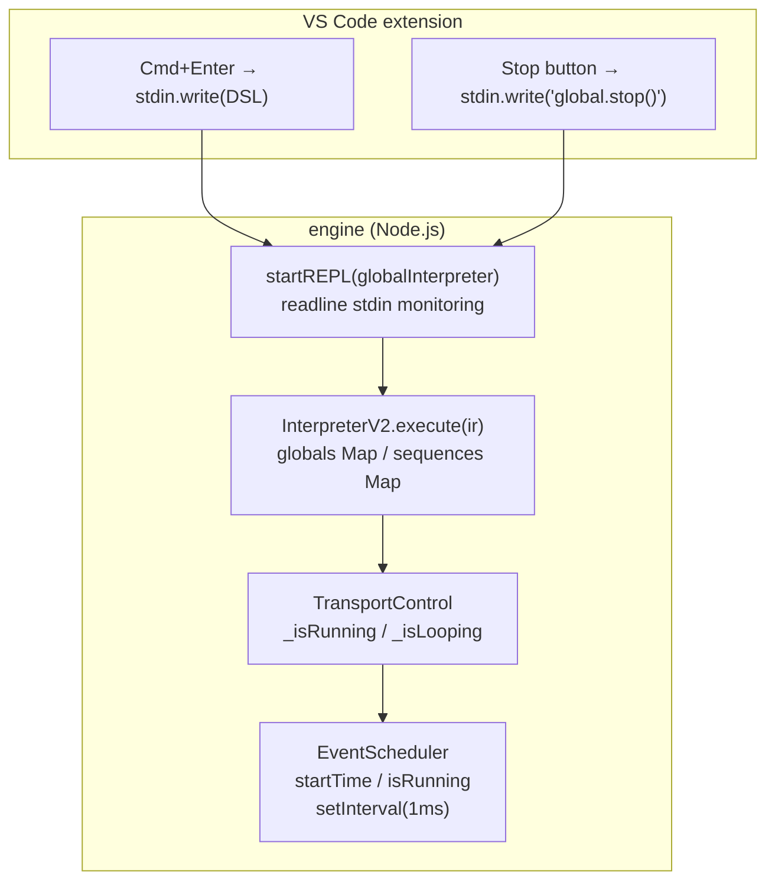

> **Note**: This page is a trace of the author's reading as of 2026-05-05. The code is the truth; this page is merely a snapshot of understanding at that point in time.

# II-4. Transport

When the user writes `global.start()`, what happens inside OrbitScore? And when only part of the code is re-evaluated with `Cmd+Enter`, what becomes of the previous sequence state? This chapter looks at the playback control (transport) mechanism and its interaction with selective execution (partial evaluation).

## The Big Picture of Transport

The responsibilities of transport in OrbitScore are distributed across **three layers**.

| Layer | Class | Responsibility |
|---|---|---|
| VS Code extension | `extension.ts` | Accepting user actions (Cmd+Enter / stop button), sending DSL text to stdin |
| engine / REPL | `InterpreterV2` | Interpreting and executing the DSL, managing the state of `Global` / `Sequence` objects |
| scheduler | `EventScheduler` | Starting/stopping `setInterval(1ms)`, managing the event queue |

These three working in concert realize the operations of "produce sound / stop sound."



## global.start(): Booting the Scheduler

When `global.start()` is called from DSL, the following call chain begins.

First, `Global.start()` delegates to `TransportControl.start()`.

```typescript
// packages/engine/src/core/global.ts:144-148
  start(): this {
    this.transportControl.start()
    this.effectsManager.setRunningState(true)
    return this
  }
```

Next, `TransportControl.start()` calls `globalScheduler.start()`.

```typescript
// packages/engine/src/core/global/transport-control.ts:19-32
  start(): this {
    // If already running, do nothing (idempotent)
    if (this._isRunning) {
      return this
    }

    this._isRunning = true

    // Start the global scheduler (will restart if needed)
    this.globalScheduler.start()
    console.log('✅ Global starting')

    return this
  }
```

The important point here is **idempotence**. If `_isRunning` is already `true`, nothing happens. As a result, calling `global.start()` multiple times is safe. Even if you repeatedly evaluate the same block with `Cmd+Enter`, there is no concern of the scheduler being double-started.

Eventually, `EventScheduler.start()` starts `setInterval(1)` and records the playback start time as `startTime = Date.now()`.

## global.stop(): Cascading Stop

`global.stop()` cascades in the reverse direction.

```typescript
// packages/engine/src/core/global/transport-control.ts:43-59
  stop(): this {
    // Stop all sequences first
    for (const [, sequence] of this.sequences.entries()) {
      sequence.stop()
    }

    // Stop the scheduler
    this.globalScheduler.stopAll()

    // Stop transport
    if (this._isRunning) {
      this._isRunning = false
      this._isLooping = false
      console.log('✅ Global stopped')
    }
    return this
  }
```

What is worth noting is the order of **stopping the sequences first, then stopping the scheduler**. Each sequence's `stop()` cancels its loop timer; then `globalScheduler.stopAll()` empties the event queue and stops `setInterval`. In the reverse order, even if the scheduler is stopped first, sequence loop timers might survive and try to push new events.



## InterpreterV2: A Stateful Interpreter

`InterpreterV2` **is held as a single instance** throughout the REPL session.

```typescript
// packages/engine/src/cli/repl-mode.ts:27-39
export async function startREPLMode(options: REPLOptions = {}): Promise<void> {
  console.log('🎵 OrbitScore Audio Engine')
  console.log('✅ Initialized')

  // Create a global interpreter
  const globalInterpreter = new InterpreterV2()

  // Boot SuperCollider once at startup with optional audio device
  await globalInterpreter.boot(options.audioDevice)

  console.log('🎵 Live coding mode')
  await startREPL(globalInterpreter)
}
```

`globalInterpreter` is created exactly once inside `startREPLMode()` and is then used throughout the REPL loop. This is important: it means that the `state` (the globals Map and sequences Map) held by `InterpreterV2` **accumulates across the entire REPL session**.

```typescript
// packages/engine/src/interpreter/interpreter-v2.ts:25-37
  constructor() {
    this.state = {
      audioEngine: new SuperColliderPlayer(),
      globals: new Map(),
      sequences: new Map(),
      currentGlobal: undefined,
      isBooted: false,
      // Initialize unidirectional toggle groups
      runGroup: new Set(),
      loopGroup: new Set(),
      muteGroup: new Set(),
    }
  }
```

`globals` and `sequences` are `Map<string, Global>` / `Map<string, Sequence>`. Once an object is created, it accumulates in the map and is reused in subsequent evaluations.

## Selective Execution: Partial Evaluation and State Carryover

When `Cmd+Enter` is pressed, the VS Code extension writes only the text of the block at the cursor (or the selection) to stdin.

```
engineProcess.stdin?.write(codeToSend + '\n')
```

> The above code is the stdin send site in `extension.ts` (for details, see [Architecture Overview](../orientation/architecture-overview.md)).

The engine's REPL evaluates the received text via `parseAudioDSL()` → `interpreter.execute()`. The important point is that, since `globalInterpreter` is the same instance, **the `Global` and `Sequence` objects created in the previous evaluation are still alive**.

For example, consider the following scenario.

**Evaluation 1**: Cmd+Enter on a block containing `global.start()`

→ The scheduler starts; a Global is registered in the `globals` Map. `EventScheduler.isRunning = true`.

**Evaluation 2**: Cmd+Enter on a block containing `kick.beat(5 by 4)`

→ The beat of the `kick` Sequence in the `sequences` Map is updated. The scheduler keeps running. The new barDuration is reflected from the next loop iteration.

In this way, selective execution is an operation that "updates parameters while running," not "stop and restart."

## execute(): the skipTransportCommands Option

`InterpreterV2.execute()` has an option called `skipTransportCommands`.

```typescript
// packages/engine/src/interpreter/interpreter-v2.ts:62-86
  async execute(ir: AudioIR, options?: { skipTransportCommands?: boolean }): Promise<void> {
    const skipTransport = options?.skipTransportCommands ?? false

    // Ensure SuperCollider is booted
    await this.ensureBooted()

    // Process global initialization
    if (ir.globalInit) {
      await processGlobalInit(ir.globalInit, this.state)
    }

    // Process sequence initializations
    for (const seqInit of ir.sequenceInits) {
      await processSequenceInit(seqInit, this.state)
    }

    // Process statements
    for (const statement of ir.statements) {
      // Skip transport commands if requested (e.g., on file save)
      if (skipTransport && statement.type === 'transport') {
        continue
      }
      await processStatement(statement, this.state)
    }
  }
```

When `skipTransportCommands: true` is passed, statements with `statement.type === 'transport'` are skipped. According to the comment, it is intended for use "on file save." If there is a feature that auto-re-evaluates on every file save, this is a guard to prevent `global.start()` or `global.stop()` from being executed by mistake.

> NOTE: unverified — which event of the VS Code extension (such as onSave) actually invokes `skipTransportCommands` has not been verified by examining `extension.ts`. The comment says "on file save," but verification on the caller side is needed.

## Managing Playback Position: The Role of startTime

In OrbitScore, "playback position" is held as the **scheduler's start time (`startTime`)**.

```typescript
// packages/engine/src/audio/supercollider/event-scheduler.ts:143-149 (the first half of start(); the setInterval loop is covered in event-queue.md)
  start(): void {
    if (this.isRunning) {
      return
    }

    this.isRunning = true
    this.startTime = Date.now()
    // ...
```

All `ScheduledPlay.time` values are **relative times (ms)** based on this `startTime`. The polling loop also converts to relative time as `now = Date.now() - this.startTime` for comparison.

The important point is that `startTime` is not reset even when `stop()` is called.

```typescript
// packages/engine/src/audio/supercollider/event-scheduler.ts:183-190
  stop(): void {
    if (this.intervalId) {
      clearInterval(this.intervalId)
      this.intervalId = null
    }
    this.isRunning = false
    console.log('✅ Global stopped')
  }
```

Only `isRunning = false` and `clearInterval` are done; `startTime` is not changed. This is intentional: when `start()` is called again after `stop()`, `startTime` is overwritten with a new `Date.now()`, and a fresh timeline begins. In other words, no matter how many seconds pass between stop → start, playback runs again on a "new timeline starting from 0."

## Transport State Transitions

The transport state is represented by two flags: `isRunning` and `isLooping`.



`loop()` is now deprecated; the recommended way is to control sequence loops individually with `seq.loop()`.

## Sequence start / stop

The sequence side also has `run()`, `loop()`, and `stop()`. They run independently of the global transport.

- `seq.run()` → plays the pattern once and stops (one-shot)
- `seq.loop()` → loops continuously via a `setTimeout` chain
- `seq.stop()` → cancels the loop timer and empties the queue with `clearSequenceEvents()`

If global stops, the polling of `EventScheduler` halts and no sound is produced, but each sequence's loop timer itself keeps running. When `global.start()` is called again, each sequence will produce sound at its next iteration.

## Summary: Transport Layer Diagram



OrbitScore's transport runs on the simple input model of "feed DSL text into stdin," with the interpreter accumulating state and the scheduler managing time. Selective execution is a "update without stopping" paradigm, and state carryover is realized by the objects held in the interpreter's `Map` continuing to live.

## Related Terms

- [global](/en/glossary#global) — the receiver of `global.start()` / `global.stop()`. The singleton holding TransportControl
- [RUN](/en/glossary#run) — the unidirectional-toggle transport command. `processTransportStatement()` dispatches it to `handleRunCommand()`
- [LOOP](/en/glossary#loop) — the unidirectional-toggle loop command. Differential computation (`calculateLoopDiff`) controls starting and stopping of sequences
- [MUTE / UNMUTE](/en/glossary#mute--unmute) — the unidirectional-toggle mute command. Managed by the `muteGroup` Set
- [Unidirectional Toggle](/en/glossary#unidirectional-toggle-single-side-toggle) — the semantics that "completely replace the current group" of `RUN()` / `LOOP()` / `MUTE()`
- [init](/en/glossary#init) — the syntax `var seq = init global.seq` that registers a Sequence with InterpreterV2
- [scsynth](/en/glossary#scsynth) — the audio server to which EventScheduler sends `/s_new` via OSC
- [OSC (Open Sound Control)](/en/glossary#osc-open-sound-control) — the protocol used for extension → engine → scsynth communication
- [subject-based block evaluation](/en/glossary#subject-based-block-evaluation) — the cursor-line subject-based block collection scheme used by selective execution

## Related ADRs

- [ADR-001 Choosing SuperCollider as the Implementation Base](/en/decisions/adr-001-supercollider) — background on the design decision of EventScheduler connecting to scsynth
- [ADR-002 DSL v3 Pivot](/en/decisions/adr-002-dsl-v3-pivot) — the background of DSL v3.0 introducing the `RUN()` / `LOOP()` / `MUTE()` unidirectional toggle

## Next Exploration Candidates

- Tracing in extension.ts which event actually invokes `skipTransportCommands`
- The behavior of `global.start()` after `global.stop()` becoming a new startTime, and how this affects each sequence's loop timer (cumulative `nextScheduleTime`)
- Since `InterpreterV2.state.globals` / `state.sequences` are Maps, the behavior on redeclaration of variables of the same name (overwrite or new addition) — verification in process-initialization.ts
- The background of `global.loop()` becoming deprecated, and the intent of the migration to per-sequence `seq.loop()` control
- Idempotence of boot: the `isBooted` flag prevents double boot, but where is re-boot when scsynth dies handled?

## Sources

- `packages/engine/src/core/global.ts:144-148` — `Global.start()`: delegation to TransportControl and effectsManager
- `packages/engine/src/core/global.ts:159-163` — `Global.stop()`: delegation to TransportControl
- `packages/engine/src/core/global/transport-control.ts:19-32` — `TransportControl.start()`: idempotence guard
- `packages/engine/src/core/global/transport-control.ts:43-59` — `TransportControl.stop()`: order of sequence stop → scheduler stop
- `packages/engine/src/audio/supercollider/event-scheduler.ts:143-149` — `EventScheduler.start()`: recording `startTime = Date.now()`
- `packages/engine/src/audio/supercollider/event-scheduler.ts:183-190` — `EventScheduler.stop()`: stopping only the interval while preserving `startTime`
- `packages/engine/src/audio/supercollider/event-scheduler.ts:195-199` — `EventScheduler.stopAll()`: stop + queue clear
- `packages/engine/src/interpreter/interpreter-v2.ts:25-37` — `InterpreterV2` constructor: initialization of `globals` / `sequences` Maps
- `packages/engine/src/interpreter/interpreter-v2.ts:62-86` — `InterpreterV2.execute()`: the `skipTransportCommands` option
- `packages/engine/src/cli/repl-mode.ts:27-39` — `startREPLMode()`: creating a single `globalInterpreter` instance and handing it to the REPL
- `packages/engine/src/cli/repl-mode.ts:50-157` — `startREPL()`: readline stdin monitoring and the buffer accumulation logic
- `sites/dev/orientation/architecture-overview.md` — extension's stdin send (`extension.ts:1107`) and the engine's overall architecture
