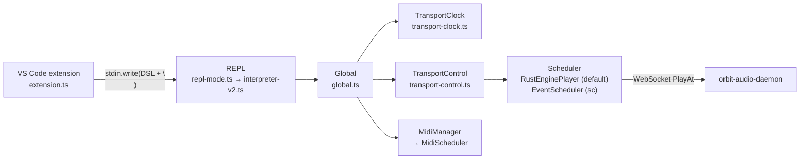
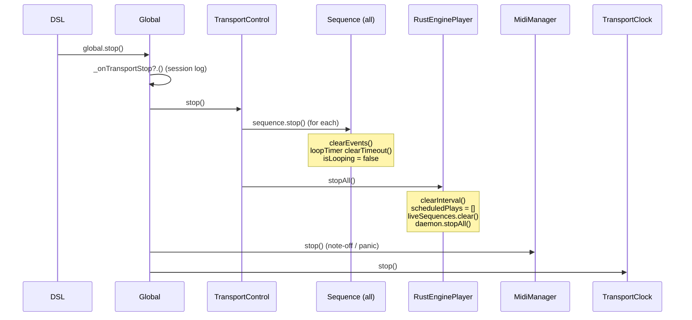
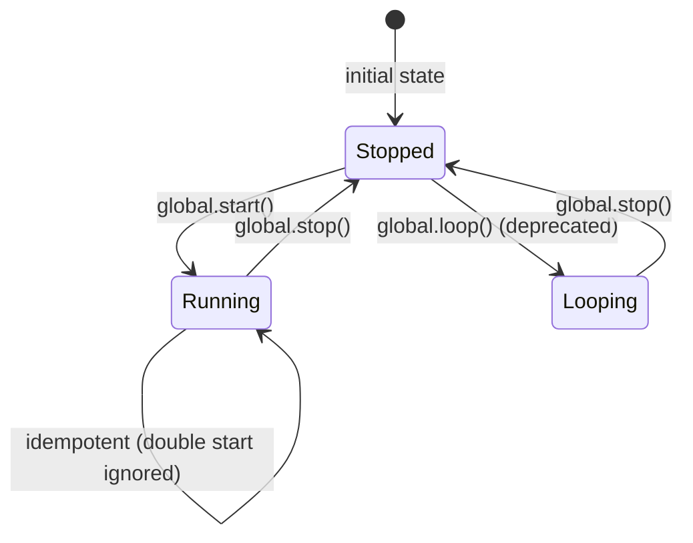
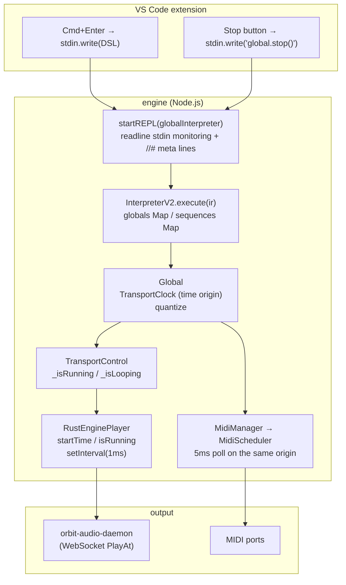

> **Note**: This page is a trace of the author's reading as of 2026-09-01. The code is the truth; this page is only a snapshot of understanding at that time.

# II-4. Transport

When the user writes `global.start()`, what happens inside OrbitScore? And when only part of the code is re-evaluated with `Cmd+Enter`, what becomes of the previous sequence state? This chapter looks at the playback control (transport) mechanism and its interaction with selective execution (partial evaluation).

## Drift as of 2026-09: TransportClock, the Rust Daemon, and Launch Quantize

The 2026-05-05 version of this chapter read transport as the three-stage chain "`Global.start()` → `TransportControl.start()` → the SC `EventScheduler.start()`." In the code at 2026-09-01 (69dc968), the following has changed:

- **The default audio backend is the Rust daemon** (cutover #108, 2026-07-03). The `globalScheduler` whose `start()` `Global` calls is of type `AudioEngineBackend`: by default a `RustEnginePlayer`, and a `SuperColliderPlayer` (holding an `EventScheduler` inside) only with `ORBITSCORE_ENGINE=sc`. The shape of the chain is the same; the class at the end was swapped
- **`TransportClock` became the sole owner of the time origin.** So that the audio scheduler and the MIDI scheduler share the same `Date.now()` origin, `Global.start()` stamps `transportClock.start()` **before** `transportControl.start()`
- **`Global.start()` / `stop()` grew**: starting/stopping the MIDI manager, the session-log hooks (§L1, dormant in 2.0.0), re-asserting Link tempo (#283), and an automatic plugin-state snapshot on stop were added
- **Launch quantize** (`global.quantize()` / `seq.quantize()`, #212 / PR #215): starting `seq.loop()` and swapping `play()` during LOOP wait, by default, until the next global bar boundary. `global.start()` itself does not wait
- **The caller of `skipTransportCommands`**: the 2026-05 version left this unverified; as of 2026-09-01 no call passing this option as `true` was found in non-test code under `packages/` (the REPL passes only `source` / `evalSource` / `documentDirectory`). It is reasonable to read it as an unused guard left on the interpreter side
- **`[STEP]` markers** (#390 / #654) were added to the transport's observation surface ([II-3](/en/scheduling/event-queue))

## The Big Picture of Transport

The responsibilities of transport in OrbitScore are distributed across **four layers**.

| Layer | Class | Responsibility |
|---|---|---|
| VS Code extension | `extension.ts` | Accepting user actions (Cmd+Enter / stop button), sending DSL text to stdin |
| engine / REPL | `InterpreterV2` | Interpreting and executing the DSL, managing the state of `Global` / `Sequence` objects |
| Global | `TransportClock` + `TransportControl` + `MidiManager` | Fixing the time origin, stopping all sequences at once, starting/stopping the MIDI scheduler |
| scheduler | `RustEnginePlayer` (default) / `EventScheduler` (SC) | Starting/stopping `setInterval(1ms)`, managing the event queue |

These working in concert realize the operations of "produce sound / stop sound."


```mermaid
flowchart LR
  EXT["VS Code extension\nextension.ts"] -->|"stdin.write(DSL + \\n)"| REPL["REPL\nrepl-mode.ts → interpreter-v2.ts"]
  REPL --> GLOBAL["Global\nglobal.ts"]
  GLOBAL --> CLK["TransportClock\ntransport-clock.ts"]
  GLOBAL --> TC["TransportControl\ntransport-control.ts"]
  GLOBAL --> MIDI["MidiManager\n→ MidiScheduler"]
  TC --> SCHED["Scheduler\nRustEnginePlayer (default)\nEventScheduler (sc)"]
  SCHED -->|"WebSocket PlayAt"| D["orbit-audio-daemon"]
```

## global.start(): Stamp the Time Origin, Then Boot the Scheduler

When `global.start()` is called from the DSL, the following call chain begins. First, `Global.start()`.

```typescript
// packages/engine/src/core/global.ts:654-677
  // Transport control
  start(): this {
    // §L1: only open a NEW session on an actual stopped→running transition —
    // transportClock.start() is idempotent, so a redundant start() while running
    // must not open a second (orphaned) log file.
    const wasRunning = this.transportClock.running
    // Stamp the shared clock origin FIRST so the audio scheduler (started by
    // transportControl) and the MIDI scheduler share the same Date.now() base.
    this.transportClock.start()
    this.transportControl.start()
    this.effectsManager.setRunningState(true)
    this.midiManager.start()
    if (!wasRunning) {
      // §L1: best-effort — a log-open failure must never break playback.
      try {
        this._onTransportStart?.()
      } catch (e) {
        console.warn(`⚠️  session-log: start hook failed (playback continues): ${e}`)
      }
    }
    // #283: re-assert Link tempo leadership once the transport is running.
    this.pushLinkTempoIfLeading()
    return this
  }
```

The order matters. **First `transportClock.start()`** stamps the shared time origin, and only then are `transportControl.start()` (the audio scheduler) and `midiManager.start()` (the MIDI scheduler) started. That both use the same `Date.now()` as their base is guaranteed by this order.

`TransportClock` is a very small class.

```typescript
// packages/engine/src/core/global/transport-clock.ts:20-44
export class TransportClock {
  /** Epoch ms (`Date.now()`) when the transport last started; 0 before start. */
  private _startTime = 0
  private _running = false

  /** Begin the transport, stamping the shared origin. Idempotent while running. */
  start(): void {
    if (this._running) return
    this._startTime = Date.now()
    this._running = true
  }

  /** Stop the transport. The origin is retained for inspection until restart. */
  stop(): void {
    this._running = false
  }

  get startTime(): number {
    return this._startTime
  }

  get running(): boolean {
    return this._running
  }
}
```

According to the comment at the top of the file, the MIDI path goes through this class rather than reading `startTime` / `isRunning` directly off the audio engine so that **a MIDI-only session never has to touch SuperCollider (or the daemon)**. MIDI sequences are handed a `Scheduler`-typed adapter called `MidiTransportScheduler`, which only reads `startTime` / `isRunning` from `TransportClock` and no-ops every audio method (`packages/engine/src/core/global/midi-transport-scheduler.ts`).

Next, `TransportControl.start()` calls `globalScheduler.start()`. This part is unchanged from the 2026-05 version.

```typescript
// packages/engine/src/core/global/transport-control.ts:19-32
  start(): this {
    // If already running, do nothing (idempotent)
    if (this._isRunning) {
      return this
    }

    this._isRunning = true

    // Start the global scheduler (will restart if needed)
    this.globalScheduler.start()
    console.log('✅ Global starting')

    return this
  }
```

The important point here is **idempotence**. If `_isRunning` is already `true`, nothing happens. As a result, calling `global.start()` multiple times is safe. Even if you repeatedly evaluate the same block with `Cmd+Enter`, there is no concern of the scheduler being double-started. `Global.start()` likewise looks at `wasRunning` so that the session log is not opened twice.

Eventually, `RustEnginePlayer.start()` starts `setInterval(1)` and records the playback start time as `startTime = Date.now()`.

```typescript
// packages/engine/src/audio/rust-engine/rust-engine-player.ts:1467-1471
  start(): void {
    if (this.isRunning) return
    this.isRunning = true
    this.startTime = Date.now()
    this.scheduledPlays.sort((a, b) => a.time - b.time)
```

Note that `TransportClock.startTime` and `RustEnginePlayer.startTime` call `Date.now()` separately. Since they are called back to back within the same synchronous stack they are identical for practical purposes, but they are not strictly the same value.

> NOTE: unverified — how many ms the two `Date.now()` calls actually differ by (it should be 0–1 ms within the same tick) has not been measured.

## global.stop(): Cascading Stop

`global.stop()` cascades in the reverse direction. This too has grown by the session log and the auto-snapshot.

```typescript
// packages/engine/src/core/global.ts:688-718 (プラグイン状態の auto-snapshot ブロックを // ... で省略)
  stop(options?: { autoSnapshot?: boolean }): this {
    // §L1: write the stop record BEFORE the clock clears, only if actually
    // running, and never let a log-write error block the note-offs below (a
    // throw here would otherwise leave MIDI notes hanging — music unstoppable).
    if (this.transportClock.running) {
      try {
        this._onTransportStop?.()
      } catch (e) {
        console.warn(`⚠️  session-log: stop hook failed (playback continues): ${e}`)
      }
      // ...
    }
    this.transportControl.stop()
    this.effectsManager.setRunningState(false)
    this.midiManager.stop()
    this.transportClock.stop()
    return this
  }
```

The phrase "music unstoppable" in the comment is memorable. The design decision that an exception in the stop hook must not block the note-offs below it (stopping the MIDI manager) shows up as the try/catch. `transportClock.stop()` comes **last** so that the stop record can read the transport time.

`TransportControl.stop()` handles stopping all sequences and the scheduler.

```typescript
// packages/engine/src/core/global/transport-control.ts:43-59
  stop(): this {
    // Stop all sequences first
    for (const [, sequence] of this.sequences.entries()) {
      sequence.stop()
    }

    // Stop the scheduler
    this.globalScheduler.stopAll()

    // Stop transport
    if (this._isRunning) {
      this._isRunning = false
      this._isLooping = false
      console.log('✅ Global stopped')
    }
    return this
  }
```

What is worth noting is the order of **stopping the sequences first, then stopping the scheduler**. Each sequence's `stop()` cancels its loop timer; then `globalScheduler.stopAll()` empties the event queue and stops `setInterval` (on the Rust path it also sends `StopAll` to the daemon to cut voices that are still sounding). In the reverse order, even if the scheduler were stopped first, sequence loop timers might survive and try to push new events.


```mermaid
sequenceDiagram
  participant USER as DSL
  participant G as Global
  participant TC as TransportControl
  participant SEQ as Sequence (all)
  participant SCHED as RustEnginePlayer
  participant MIDI as MidiManager
  participant CLK as TransportClock

  USER->>G: global.stop()
  G->>G: _onTransportStop?.() (session log)
  G->>TC: stop()
  TC->>SEQ: sequence.stop() (for each)
  Note over SEQ: clearEvents()<br/>loopTimer clearTimeout()<br/>isLooping = false
  TC->>SCHED: stopAll()
  Note over SCHED: clearInterval()<br/>scheduledPlays = []<br/>liveSequences.clear()<br/>daemon.stopAll()
  G->>MIDI: stop() (note-off / panic)
  G->>CLK: stop()
```

## InterpreterV2: A Stateful Interpreter

`InterpreterV2` **is held as a single instance** throughout the REPL session.

```typescript
// packages/engine/src/cli/repl-mode.ts:30-53
export async function startREPLMode(options: REPLOptions = {}): Promise<void> {
  console.log('🎵 OrbitScore Audio Engine')
  console.log('✅ Initialized')

  // Create a global interpreter
  const globalInterpreter = new InterpreterV2()
  // 🔴 #607: startREPLMode() は返らないので、戻り値経由では shutdown ハンドラに
  // 届かない。生成した時点で publish する（詳細は active-interpreter.ts）。
  setActiveInterpreter(globalInterpreter)

  // §L1 (#229): session-log は 2.0.0 では dormant（既定 off）。file-scoped ログが
  // 複数ファイルをまたぐライブセッションに合わない設計ミスマッチのため、session-scoped で
  // 再設計するまで明示 opt-in に退避（writer/API/ユニットは保持・resurrect 可）。
  // 詳細・redesign 北極星: docs/development/POST_2.0_ROADMAP_NOTES.md
  if (shouldEnableSessionLog()) {
    globalInterpreter.enableSessionLog({ cwd: process.cwd() })
  }

  // Boot the audio engine backend once at startup with optional audio device
  await globalInterpreter.boot(options.audioDevice)

  console.log('🎵 Live coding mode')
  await startREPL(globalInterpreter)
}
```

`globalInterpreter` is created exactly once inside `startREPLMode()` and is then used throughout the REPL loop. Compared with the 2026-05 version, `setActiveInterpreter()` (added by #607 for graceful shutdown) and the session-log opt-in are inserted, but the "create one and reuse it" structure is the same. This is important: it means that the `state` (the globals Map and sequences Map) held by `InterpreterV2` **accumulates across the entire REPL session**.

```typescript
// packages/engine/src/interpreter/interpreter-v2.ts:48-64
  constructor(opts?: { audioEngine?: AudioEngineBackend }) {
    this.state = {
      audioEngine: opts?.audioEngine ?? createAudioEngine(),
      globals: new Map(),
      sequences: new Map(),
      mixers: createMixerRuntimeRegistry(),
      currentGlobal: undefined,
      isBooted: false,
      // Initialize unidirectional toggle groups
      runGroup: new Set(),
      loopGroup: new Set(),
      muteGroup: new Set(),
      // §L1: the rolling-buffer origin (§3 wall). The writer itself stays absent
      // until enableSessionLog() — so logging is inert in unit-test paths.
      engineT0: Date.now(),
    }
  }
```

In the 2026-05 version this was hard-coded as `audioEngine: new SuperColliderPlayer()`; now it is `createAudioEngine()` (which selects Rust / SC via env) or the `opts.audioEngine` injected for tests. `globals` and `sequences` are `Map<string, Global>` / `Map<string, Sequence>`; once an object is created, it accumulates in the map and is reused in subsequent evaluations. `mixers` (the #643 mixer DSL) and `engineT0` (the wall-clock origin of the session log) are new.

## Selective Execution: Partial Evaluation and State Carryover

When `Cmd+Enter` is pressed, the VS Code extension writes only the text of the block at the cursor (or the selection) to stdin.

```typescript
// packages/vscode-extension/src/extension.ts:3031-3031
  engineProcess.stdin.write(codeToSend + '\n')
```

The engine's REPL evaluates the received text via `parseAudioDSL()` → `interpreter.execute()`.

```typescript
// packages/engine/src/cli/repl-mode.ts:370-378
    try {
      const metaDir = extractDocumentDirectoryMeta(code)
      if (metaDir) sessionDocumentDirectory = metaDir
      await interpreter.execute(ir, {
        source: code,
        evalSource: 'human',
        documentDirectory: sessionDocumentDirectory,
      }) // §L1
      console.log('✓') // Success indicator
```

The extension prepends a meta line `//#documentDirectory <path>` (#456) to every eval, and the REPL passes it as `documentDirectory`. It is an out-of-band channel for fixing the base directory of `import` before the statements. The REPL processes other meta lines such as `//#selectAudioDevice` (#484) and `//#evalMark` (#614) by the same mechanism.

The important point is that, since `globalInterpreter` is the same instance, **the `Global` and `Sequence` objects created in the previous evaluation are still alive**.

For example, consider the following scenario.

**Evaluation 1**: Cmd+Enter on a block containing `global.start()`

→ The origin is stamped on `TransportClock`, the scheduler starts, and a Global is registered in the `globals` Map. `RustEnginePlayer.isRunning = true`

**Evaluation 2**: Cmd+Enter on a block containing `kick.beat(5 by 4)`

→ The beat of the `kick` Sequence in the `sequences` Map is updated. The scheduler keeps running. The new barDuration is reflected from the next loop iteration (`getPatternDurationFn()` in [II-2](/en/scheduling/polymeter))

In this way, selective execution is an operation that "updates parameters while running," not "stop and restart."

## execute(): the skipTransportCommands Option

`InterpreterV2.execute()` has an option called `skipTransportCommands`. The options type grew with §L1 and import (#456), but the parts relevant to transport are only the head and the tail.

```typescript
// packages/engine/src/interpreter/interpreter-v2.ts:133-230 (§L1 の記録・import・global/sequence init を // ... で省略)
  async execute(
    ir: AudioIR,
    options?: {
      skipTransportCommands?: boolean
      documentDirectory?: string
      /** §L1: the verbatim evaluated source (the `code` field). */
      source?: string
      /** §L1: the originating `.orbs` (drives `sourceFile` + filename). */
      sourceFile?: string | null
      /** §L1: who evaluated this (default `human`). */
      evalSource?: EvalSource
    },
  ): Promise<void> {
    const skipTransport = options?.skipTransportCommands ?? false

    // ...

    // Process statements
    for (const statement of ir.statements) {
      // Skip transport commands if requested (e.g., on file save)
      if (skipTransport && statement.type === 'transport') {
        continue
      }
      await processStatement(statement, this.state)
    }
  }
```

When `skipTransportCommands: true` is passed, statements with `statement.type === 'transport'` (`RUN()` / `LOOP()` / `MUTE()` and so on) are skipped. According to the comment, it is intended for use "on file save." However, as of 2026-09-01, no caller passing this option was found in the non-test code of `packages/engine` / `packages/vscode-extension` / `packages/mcp-server`. The REPL's `execute()` call (quoted above) does not pass it either. It is reasonable to read it as a leftover guard from an "auto re-evaluate on save" feature, and the 2026-05 unverified marker is resolved in this form.

## Launch Quantize: LOOP Enters on the Global Bar Boundary

An element of transport that did not exist in the 2026-05 version is **launch quantize**. `global.quantize()` has `"bar"` as its default and makes the start of `LOOP()` and the swap of `play()` during LOOP wait until the next boundary.

```typescript
// packages/engine/src/core/global.ts:555-573
  /**
   * Set the global launch-quantize value.
   *
   * Controls when LOOP() starts and when LOOP-time play() updates take
   * effect, by waiting until the next quantized boundary derived from the
   * global tempo and meter. RUN() (one-shot) is unaffected and stays
   * immediate. Sequences may override this with `seq.quantize("...")`.
   *
   * Accepted values: "off" | "beat" | "bar" | "2bar" | "4bar" | "8bar".
   * Default: "bar".
   */
  quantize(value: QuantizeValue): this {
    this.quantizeManager.setQuantize(value)
    return this
  }

  getQuantize(): QuantizeValue {
    return this.quantizeManager.getQuantize()
  }
```

The boundary computation is the pure function `nextQuantizedTime()`. `currentTime` is the relative ms since scheduler start, and it "rounds up" to the next boundary.

```typescript
// packages/engine/src/core/global/quantize-manager.ts:56-73
/**
 * Compute the next quantized boundary at or after `currentTime` (ms since
 * scheduler start). Returns `currentTime` unchanged when quantize is 'off' or
 * the duration is 0.
 */
export function nextQuantizedTime(
  currentTime: number,
  value: QuantizeValue,
  tempo: number,
  beat: Meter,
): number {
  const durationMs = quantizeDurationMs(value, tempo, beat)
  if (durationMs <= 0) return currentTime
  if (currentTime <= 0) return durationMs

  const boundaries = Math.ceil(currentTime / durationMs)
  return boundaries * durationMs
}
```

`Sequence.loop()` passes this result as the `startTime` of `loopSequence()` (quoted in [II-2](/en/scheduling/polymeter)). `RUN()` is unaffected by quantize and is always immediate, and `global.start()` itself does not wait (core spec §5). The grid is always the **global** `tempo()` × `beat()`, so a 5/4 sequence also enters on the 4/4 global bar boundary.

Interestingly, `nextQuantizedTime()` is also used by the session log. `Global.getQuantizedEffectPosition()` returns the `"bar:beat"` position at which a quantized operation evaluated now would take effect, and it is recorded as the `effect` field of an eval containing LOOP (`recordEval` in `interpreter-v2.ts`).

## Managing Playback Position: startTime and bar:beat

In OrbitScore, "playback position" is held as **the transport's start time**. In the 2026-05 version that was the SC `EventScheduler.startTime`; as of 2026-09-01 the authority is `TransportClock.startTime`, and each scheduler's `startTime` is its own origin stamped (almost) simultaneously with it.

`Global` has functions that convert elapsed ms into `"bar:beat"` (added for the §L1 session log).

```typescript
// packages/engine/src/core/global.ts:726-729
  getTransportPosition(): string | null {
    if (!this.transportClock.running) return null
    return this.msToBarBeat(Date.now() - this.transportClock.startTime)
  }
```

```typescript
// packages/engine/src/core/global.ts:762-767
    const { tempo, beat } = params
    const beatUnitMs = ((60_000 / tempo) * 4) / beat.denominator // one meter-beat
    const totalBeatUnits = Math.max(0, elapsedMs) / beatUnitMs
    const bar = Math.floor(totalBeatUnits / beat.numerator) + 1
    const beatInBar = (totalBeatUnits % beat.numerator) + 1
    return `${bar}:${beatInBar.toFixed(3)}`
```

"One beat" here is `beatUnitMs = quarter note × 4 / denominator`, that is, **the note value of the meter's denominator**. This unit differs from quantize's `"beat"`, which is fixed to a quarter note, so in a meter such as 7/8 the two diverge (see also the "duplicated formula" section in [II-1](/en/scheduling/time-representation)).

All `ScheduledPlay.time` values are **relative times (ms)** based on the scheduler's `startTime`. The polling loop also converts to relative time as `now = Date.now() - this.startTime` for comparison.

The important point is that `startTime` is not reset even when `stop()` is called.

```typescript
// packages/engine/src/audio/rust-engine/rust-engine-player.ts:1486-1492
  stop(): void {
    if (this.intervalId) {
      clearInterval(this.intervalId)
      this.intervalId = null
    }
    this.isRunning = false
  }
```

Only `isRunning = false` and `clearInterval` are done; `startTime` is not changed (`TransportClock.stop()` likewise retains the origin — the comment says "retained for inspection until restart"). When `start()` is called again after `stop()`, `startTime` is overwritten with a new `Date.now()`, and a fresh timeline begins. In other words, no matter how many seconds pass between stop → start, playback runs again on a "new timeline starting from 0."

## Transport State Transitions

The transport state is represented by `TransportControl`'s `_isRunning` / `_isLooping` and by `TransportClock.running`.


```mermaid
stateDiagram-v2
  [*] --> Stopped: initial state

  Stopped --> Running: global.start()
  Running --> Stopped: global.stop()

  Stopped --> Looping: global.loop() (deprecated)
  Looping --> Stopped: global.stop()

  Running --> Running: idempotent (double start ignored)
```

`loop()` remains deprecated; the recommended way is to control sequence loops individually with `seq.loop()` / `LOOP()`.

```typescript
// packages/engine/src/core/global.ts:679-686
  /**
   * @deprecated Not needed. Use LOOP(seq) for sequences instead.
   */
  loop(): this {
    this.transportControl.loop()
    this.effectsManager.setRunningState(true)
    return this
  }
```

## Sequence start / stop

The sequence side also has `run()`, `loop()`, and `stop()`. From the DSL they are invoked via the unidirectional-toggle `RUN()` / `LOOP()` / `MUTE()`, and direct method calls are treated as `@internal`.

- `seq.run()` → plays the pattern once and stops (one-shot). Unaffected by quantize
- `seq.loop()` → loops continuously via a `setTimeout` chain, starting from the next boundary found by `nextQuantizedTime()`
- `seq.stop()` → clears events and cancels the loop timer

```typescript
// packages/engine/src/core/sequence.ts:1774-1799
  stop(): this {
    const sequenceName = this.stateManager.getName()
    const wasLooping = this.stateManager.isLooping()

    // Clear scheduled events (MIDI: also releases sounding notes, §7-2)
    this.clearEvents(sequenceName)

    // Clear loop timer (only exists if loop() was called, not run())
    // Note: run() sets loopTimer to undefined, so this check prevents redundant clearInterval
    const loopTimer = this.stateManager.getLoopTimer()
    if (loopTimer) {
      clearTimeout(loopTimer)
      this.stateManager.setLoopTimer(undefined)
    }

    // Clear state
    this.stateManager.setPlaying(false)
    this.stateManager.setLooping(false)

    // Log stop message for loop sequences
    if (wasLooping) {
      console.log(`⏹ ${sequenceName} (loop stopped)`)
    }

    return this
  }
```

Here one statement of the 2026-05 version needs correcting. The 2026-05 version wrote that "even if global stops, each sequence's loop timer keeps running, and when `global.start()` is called again each sequence produces sound at its next iteration," but `TransportControl.stop()` **calls `stop()` on every sequence first**, so the loop timers are `clearTimeout`ed there. To make sequences sound again after `global.stop()` → `global.start()`, `LOOP()` / `RUN()` must be re-evaluated. `transport-control.ts:43-59` was the same code as of 2026-05, so this is not drift but a misreading in the original.

## Summary: Transport Layer Diagram


```mermaid
flowchart TB
  subgraph EXT["VS Code extension"]
    CMD["Cmd+Enter → stdin.write(DSL)"]
    STOP["Stop button → stdin.write('global.stop()')"]
  end

  subgraph ENGINE["engine (Node.js)"]
    REPL["startREPL(globalInterpreter)\nreadline stdin monitoring + //# meta lines"]
    INTERP["InterpreterV2.execute(ir)\nglobals Map / sequences Map"]
    G["Global\nTransportClock (time origin)\nquantize"]
    TC["TransportControl\n_isRunning / _isLooping"]
    SCHED["RustEnginePlayer\nstartTime / isRunning\nsetInterval(1ms)"]
    MIDI["MidiManager → MidiScheduler\n5ms poll on the same origin"]
  end

  subgraph OUT["output"]
    D["orbit-audio-daemon\n(WebSocket PlayAt)"]
    M["MIDI ports"]
  end

  CMD --> REPL
  STOP --> REPL
  REPL --> INTERP
  INTERP --> G
  G --> TC
  G --> MIDI
  TC --> SCHED
  SCHED --> D
  MIDI --> M
```

OrbitScore's transport runs on the simple input model of "feed DSL text into stdin," with the interpreter accumulating state, `TransportClock` managing the time origin in one place, and the audio and MIDI schedulers advancing time on that shared origin. Selective execution is an "update without stopping" paradigm, and state carryover is realized by the objects held in the interpreter's `Map` continuing to live. Launch quantize is the mechanism that aligns just the LOOP start and the `play()` swap, among those "update without stopping" operations, to the global bar boundary.

## Related Terms

- [global](/en/glossary#global) — the receiver of `global.start()` / `global.stop()` / `global.quantize()`. Holds TransportClock and TransportControl
- [RUN](/en/glossary#run) — the unidirectional-toggle transport command. One-shot, unaffected by quantize
- [LOOP](/en/glossary#loop) — the unidirectional-toggle loop command. Differential computation (`calculateLoopDiff`) controls starting and stopping of sequences; the start enters on the next quantize boundary
- [MUTE / UNMUTE](/en/glossary#mute--unmute) — the unidirectional-toggle mute command. Managed by the `muteGroup` Set
- [Unidirectional Toggle](/en/glossary#unidirectional-toggle-single-side-toggle) — the semantics that "completely replace the current group" of `RUN()` / `LOOP()` / `MUTE()`
- [init](/en/glossary#init) — the syntax `var seq = init global.seq` that registers a Sequence with InterpreterV2
- [scsynth](/en/glossary#scsynth) — the destination to which EventScheduler sends `/s_new` via OSC on the `ORBITSCORE_ENGINE=sc` opt-out path
- [OSC (Open Sound Control)](/en/glossary#osc-open-sound-control) — the engine → scsynth protocol on the SC path. WebSocket + JSON on the Rust path
- [subject-based block evaluation](/en/glossary#subject-based-block-evaluation) — the cursor-line subject-based block collection scheme used by selective execution

## Related ADRs

- [ADR-001 Choosing SuperCollider as the Implementation Base](/en/decisions/adr-001-supercollider) — background on the SC path's design decision (no longer the default since cutover #108)
- [ADR-002 DSL v3 Pivot](/en/decisions/adr-002-dsl-v3-pivot) — the background of DSL v3.0 introducing the `RUN()` / `LOOP()` / `MUTE()` unidirectional toggle

## Next Exploration Candidates

- Whether there truly is no caller passing `skipTransportCommands` (tracing the onSave history of vscode-extension with git log), and whether it can be removed if so
- The effect of `TransportClock.startTime` and `RustEnginePlayer.startTime` / `MidiScheduler`'s origin being separate `Date.now()` calls (should be negligible within the same tick)
- Since `InterpreterV2.state.globals` / `state.sequences` are Maps, the behavior on redeclaration of variables of the same name (overwrite or new addition) — verification in process-initialization.ts
- The background of `global.loop()` becoming deprecated, and the intent of the migration to per-sequence `seq.loop()` control
- Idempotence of boot: the `isBooted` flag prevents double boot, but how does the respawn (#300) when the daemon dies relate to `isBooted`?
- The design mismatch (file-scoped vs session-scoped) that made the session log (§L1) dormant, and the redesign direction in `POST_2.0_ROADMAP_NOTES.md`
- The failure mode of `Global.stop()`'s auto-snapshot (saving plugin state) being fire-and-forget
- The path by which a `play()` swap during LOOP waits until the quantize boundary (`deferToNextCycle` in `seamlessParameterUpdate`)

## Sources

- `packages/engine/src/core/global.ts:555-573` — `Global.quantize()` / `getQuantize()`: the launch-quantize setting surface
- `packages/engine/src/core/global.ts:654-677` — `Global.start()`: the order TransportClock → TransportControl → MidiManager, the session-log hook, Link tempo
- `packages/engine/src/core/global.ts:679-686` — `Global.loop()` (deprecated)
- `packages/engine/src/core/global.ts:688-718` — `Global.stop()`: stop record → auto-snapshot → cascading stop → clock stop
- `packages/engine/src/core/global.ts:726-729` — `getTransportPosition()`: the current position as `"bar:beat"`
- `packages/engine/src/core/global.ts:762-767` — `msToBarBeat()`: elapsed ms → bar:beat (one beat = the denominator's note value)
- `packages/engine/src/core/global/transport-clock.ts:20-44` — `TransportClock`: the shared time origin
- `packages/engine/src/core/global/transport-control.ts:19-32` — `TransportControl.start()`: idempotence guard
- `packages/engine/src/core/global/transport-control.ts:43-59` — `TransportControl.stop()`: order of sequence stop → scheduler stop
- `packages/engine/src/core/global/midi-transport-scheduler.ts:21-49` — `MidiTransportScheduler`: the `Scheduler` adapter for MIDI sequences
- `packages/engine/src/core/global/quantize-manager.ts:56-73` — `nextQuantizedTime()`: the next quantize boundary
- `packages/engine/src/audio/rust-engine/rust-engine-player.ts:1467-1471` — `RustEnginePlayer.start()`: recording `startTime = Date.now()`
- `packages/engine/src/audio/rust-engine/rust-engine-player.ts:1486-1492` — `RustEnginePlayer.stop()`: stopping only the interval while preserving `startTime`
- `packages/engine/src/audio/supercollider/event-scheduler.ts:355-361` — the SC `EventScheduler.start()` (opt-out path)
- `packages/engine/src/interpreter/interpreter-v2.ts:48-64` — `InterpreterV2` constructor: `createAudioEngine()` and initialization of the `globals` / `sequences` Maps
- `packages/engine/src/interpreter/interpreter-v2.ts:133-230` — `InterpreterV2.execute()`: the `skipTransportCommands` option
- `packages/engine/src/cli/repl-mode.ts:30-53` — `startREPLMode()`: creating a single `globalInterpreter` instance and handing it to the REPL
- `packages/engine/src/cli/repl-mode.ts:370-378` — the REPL's `interpreter.execute()` call (the options it passes)
- `packages/engine/src/core/sequence.ts:1774-1799` — `Sequence.stop()`: clearing events and cancelling the loop timer
- `packages/vscode-extension/src/extension.ts:3030-3030` — the extension's stdin send
- `docs/core/INSTRUCTION_ORBITSCORE_DSL.md` §5 "Transport Commands" — the launch-quantize specification and that `global.start()` does not wait
- Issue [#212](https://github.com/signalcompose/orbitscore/issues/212) / PR [#215](https://github.com/signalcompose/orbitscore/pull/215) — launch quantize
- Issue [#108](https://github.com/signalcompose/orbitscore/issues/108) — cutover (default backend to Rust)
- `sites/dev/orientation/architecture-overview.md` — the engine's overall architecture
