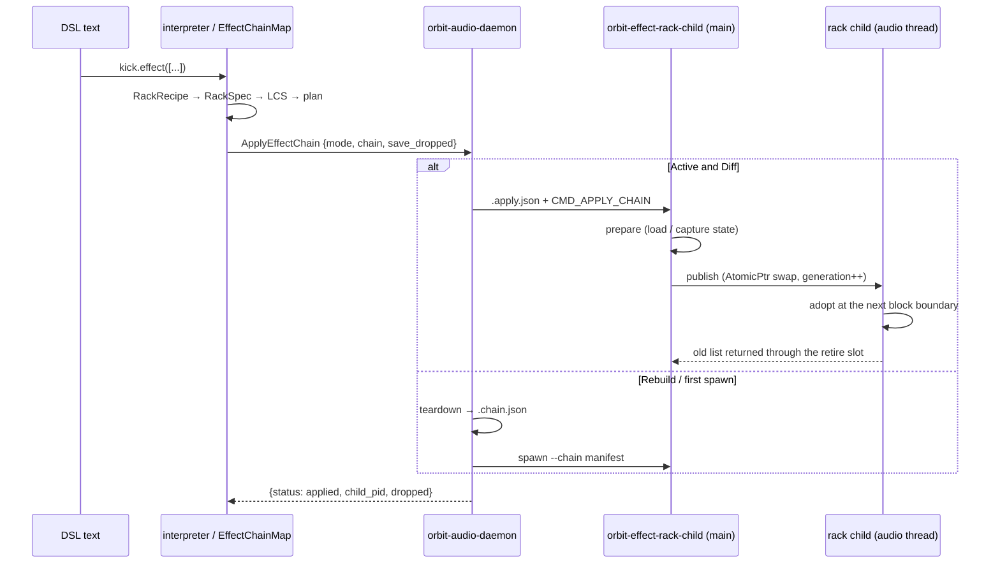

> **Note**: This page is a trace of the author's reading as of 2026-09-01. The code is the truth; this page is only a snapshot of understanding at that time.

# SC-1. Racks — Writing a Chain as a Value (SC.10)

A "rack" is the notation that writes a sequence of effects as an **array value**, as in
`kick.effect(["TAL Reverb 4", Gain(db: -6)])`. It was designed under Issue
[#628](https://github.com/signalcompose/orbitscore/issues/628), and the specification lives in
**SC.10** of `docs/specs-v2/SIGNAL_CHAIN_DSL_SPEC_v1.md` (established 2026-08-27). This chapter
follows the wiring from DSL text to a TypeScript recipe, from the recipe to a single daemon
command, and from that command to N plugin stages running serially inside one child process.

Before reading on, it helps to have gone through [RE-3 Per-Sequence Insert Bus](/en/rust-engine/insert-bus)
(how `seq.effect()` acquires a bus) and [RE-2 OOP Children](/en/rust-engine/oop-children)
(the shm transport and the watchdog), so that "bus", "child" and "mailbox" in this chapter
immediately point at something concrete.

## Why "racks" — Placing the DAW insert chain as an isomorph

The starting point of #628 was the owner's observation that "deletion, bypass and chaining are
not three decisions but one model". The design memo `docs/archive/design/628-effect-chain-model.md`
takes Bitwig and Live as its reference DAWs and confirms that a DAW slot is designed with
**four states** (empty slot / active / bypass / deactivated), not two ("present / absent").

Before #628, OrbitScore looked like this (from the measured table in §1 of that memo):

| | Before #628 |
|---|---|
| Inserts per receiver | **1** |
| Daemon hosting | **1 bus = 1 child**, and a child took exactly one `--plugin` |
| Deletion | `remove("name")` (#625) |
| Preserving the sound | State auto-saved right before a replacement or deletion, restored by re-declaring the same spec |

In other words, the **mechanism** equivalent to Bitwig's deactivate (unload, but keep the sound)
already existed since #625; what was missing was the **vocabulary**. The rack notation supplies
that vocabulary in the shape of one value, an array. Of the three options in §5 of the memo for
realizing multiple inserts, option **B, "one child hosts N plugins"** (Bitwig's "Together"
mode), was chosen, because the number of shm round trips then does not grow with the number of
stages.

## Where racks live in the two-layer semantics

SC.1 splits DSL statements into a **declaration layer** (commutative, last-write-wins) and a
**signal layer** (relative order = connection order).

| Layer | Belongs here | Meaning of order |
|----|----|----|
| **Declaration layer** | audio / chop / play / instrument-role plugin calls / mixer declarations | **Commutative**. Re-declaring the same item is last-write-wins |
| **Signal layer** | effect-role plugin calls / **gain** / **pan** / **sends** / **destinations (`output`)** | **Only the relative order within this layer** becomes the connection order |

🔴 **gain, pan and destinations are signal-layer elements** (revised 2026-09-04, #611). This
table used to place all three in the declaration layer. Once sound exists, **where you write an
element is where it sits in the signal**. So there is no fixed "fader" stage: write `gain`
before an effect and it is the level going into that effect; write it after and it is the level
coming out.

A rack is a way to write part of the signal layer as one value. The element order of the array
is the connection order, and a single `effect()` declaration carries the **complete image of
the chain**. The topology is **pattern (play) → instrument → line (effects, gain, pan, sends
and outputs in written order)**, and what the user controls by ordering is the **whole line**.
A rack bundles part of it under a name.

## The DSL shape (SC.10.1 / SC.10.3b / SC.10.4)

The full form shown by the spec is as follows (from SC.10.1):

```js
kick.effect([
  "FabFilter Pro-C 2",
  plugin("FabFilter Pro-Q 3", enabled: false),
  layer([
    [],
    ["ValhallaRoom", Gain(db: -10)],
  ]),
  "FabFilter Pro-L 2",
])
```

| Word | Meaning |
|----|----|
| `[...]` | **Serial chain**. Sugar for `chain([...])` |
| `"name"` | **Catalog plugin** (the default). Sugar for `plugin("name")` |
| `layer([...])` | **Parallel**. The same word for effect / instrument (v1 reserves the notation only, SC.10.11) |
| `plugin("name", ...)` | The full form when arguments are needed |
| `Gain(db: n)` | **Standard plugin** (a capitalized call, SC.10.8) |

A point to note here is SC.10.1 norm (3): "**the three categories are distinguished by
syntax**". `"string"` = catalog, a **capitalized** call such as `Gain(...)` = standard plugin,
a **lowercase** call such as `layer(...)` = structure. The category is decided before any name
is matched, so a third-party "Gain" never collides with the standard `Gain` (writing `"Gain"`
always reaches the catalog side).

Two more norms matter when reading the implementation.

- **SC.10.3b, the single-string form is a "complete image"**: `receiver.effect("name")` is
  exactly equivalent to `receiver.effect(["name"])`. Evaluating `effect("B")` after
  `effect([A1, A2])` unloads A1 and A2, and the chain becomes `[B]`.
- **SC.10.4, a rack is a value (a recipe)**: `var glue = [...]` **only binds a recipe** and
  starts no plugin. Applying the same rack to several receivers shares no instances, and
  rewriting the binding changes nothing on receivers already applied "until their statement is
  re-evaluated".

## The TS model: `RackRecipe` and syntactic three-category classification

The implementation is in `packages/engine/src/signal-chain/rack.ts`. Let us look at the types first.

```typescript
// packages/engine/src/signal-chain/rack.ts:12-34
export interface CatalogRackRecipe {
  readonly kind: 'catalog'
  readonly spec: string
  readonly pluginId?: string
  readonly enabled: boolean
  readonly format?: string
  readonly vendor?: string
}

export interface StandardRackRecipe {
  readonly kind: 'standard'
  readonly name: 'Gain'
  readonly params: Readonly<Record<string, number>>
  readonly enabled: boolean
}

export interface LayerRackRecipe {
  readonly kind: 'layer'
  readonly source: ValueCall
}

export type RackRecipeElement = CatalogRackRecipe | StandardRackRecipe | LayerRackRecipe
export type RackRecipe = readonly RackRecipeElement[]
```

`RackRecipe` is a **readonly array** of elements, and an element is one of three kinds:
`catalog` / `standard` / `layer`. The fact that `StandardRackRecipe.name` is the literal type
`'Gain'` shows, in the shape of the type, that v1 ships exactly one standard plugin.
`LayerRackRecipe` merely carries the whole `source: ValueCall`, and in v1 it errors at
application time (see below).

### Classifying a call — capitalized or lowercase

`resolveCall` decides which category a call (`ValueCall`) falls into.

```typescript
// packages/engine/src/signal-chain/rack.ts:148-171
function resolveCall(call: ValueCall, env: RackBindingEnvironment): RackRecipe {
  if (/^[A-Z]/.test(call.name)) return [resolveStandardCall(call)]
  switch (call.name) {
    case 'plugin':
      return [resolvePluginCall(call)]
    case 'chain': {
      const positional = positionalArgs(call)
      if (namedArgs(call).length > 0 || positional.length !== 1 || !isValueArray(positional[0])) {
        throw new Error('chain() requires exactly one array argument.')
      }
      return resolveRackValue(positional[0], env)
    }
    case 'layer':
      return [{ kind: 'layer', source: structuredClone(call) }]
    case 'gain':
      throw new Error(
        'unknown rack word "gain"; the standard gain plugin is capitalized: Gain(db: -6)',
      )
    default:
      throw new Error(
        `unknown rack word "${call.name}"; rack structure words are plugin(), chain(), and layer().`,
      )
  }
}
```

The very first line, `/^[A-Z]/.test(call.name)`, is SC.10.1 norm (3) itself. A capitalized
name is decided to be a "standard plugin" before the name is even looked at, and handed to
`resolveStandardCall`. Writing lowercase `gain` yields a dedicated message steering you to
`Gain(db: -6)`, and any other unknown lowercase word is rejected with "rack structure words are
plugin(), chain(), and layer()".

Standard-plugin resolution is static and **never consults the catalog** (SC.10.8 norm (4)).

```typescript
// packages/engine/src/signal-chain/rack.ts:124-146
function resolveStandardCall(call: ValueCall): StandardRackRecipe {
  if (call.name !== 'Gain') {
    throw new Error(
      `no standard plugin named "${call.name}"; catalog plugins are written as strings: effect("${call.name}")`,
    )
  }
  if (positionalArgs(call).length > 0) {
    throw new Error('Gain() accepts named arguments only, for example Gain(db: -6).')
  }
  const allowed = new Set(['db', 'enabled'])
  const unsupported = namedArgs(call).find((arg) => !allowed.has(arg.name))
  if (unsupported) throw new Error(`Gain() has no parameter named "${unsupported.name}".`)
  const db = oneNamedValue(call, 'db') ?? 0
  if (typeof db !== 'number' || !Number.isFinite(db)) {
    throw new Error('Gain() db: must be a finite number.')
  }
  return {
    kind: 'standard',
    name: 'Gain',
    params: { db },
    enabled: expectBoolean(call, 'enabled', true),
  }
}
```

Omitting `db` gives `0` (pass-through), and non-finite numbers are rejected. The only named
arguments accepted are `db` and `enabled`; anything else stops with "no parameter named". The
`params: { db }` received here travels through the wire unchanged and reaches the CLAP param
`db` (see "the dB contract" below).

### Recursive value resolution — strings, variables, calls, arrays

`resolveRackValue` flattens array elements recursively.

```typescript
// packages/engine/src/signal-chain/rack.ts:173-203
export function resolveRackValue(value: ValueExpression, env: RackBindingEnvironment): RackRecipe {
  if (typeof value === 'string') {
    return [{ kind: 'catalog', spec: value, enabled: true }]
  }
  if (isValueRef(value)) {
    if (value.octaveShift !== 0) {
      throw new Error(`rack variable "${value.name}" cannot use a chord octave shift (^N).`)
    }
    const rack = env.getRack(value.name)
    if (rack) return cloneRack(rack)
    if (env.getBinding(value.name)?.kind === 'chord') {
      throw new Error(`"${value.name}" is a chord variable, not a rack variable.`)
    }
    if (value.type === 'value_ref' && /^[A-Z]/.test(value.name)) {
      throw new Error(
        `rack variable "${value.name}" not found; did you mean \`${value.name}(...)\`?`,
      )
    }
    throw new Error(`rack variable "${value.name}" not found.`)
  }
  if (isValueCall(value)) return resolveCall(value, env)
  if (isValueArray(value)) {
    if ((value.octaveShift ?? 0) !== 0) {
      throw new Error('rack arrays cannot use a chord octave shift (^N).')
    }
    return value.elements.flatMap((element) => resolveRackValue(element, env))
  }
  throw new Error(
    `rack elements must be catalog strings, rack variables, calls, or arrays; got ${JSON.stringify(value)}.`,
  )
}
```

Three things are worth noticing.

1. **A string becomes a catalog element as is** (`enabled: true` by default).
2. **A variable reference** (`value_ref`) is looked up through `env.getRack(name)`, and if
   found, a **copy** is returned via `cloneRack`. Passing a chord variable, or an undefined
   capitalized name (forgetting the parentheses on `Gain`), each has its own message.
3. **Arrays are flattened with `flatMap`**. `["A", ["B", "C"]]` is the same serial chain as
   `["A", "B", "C"]`; a nested `[...]` never changes meaning (SC.10.1 norm (1)).

### Is `var x = [...]` a chord or a rack?

The parser keeps `[...]` as a context-neutral `ValueArray`, and the interpreter classifies it
as chord or rack (design doc §4 decision 13: `[m7]` and `[glue]` cannot be told apart
syntactically).

```typescript
// packages/engine/src/parser/types.ts:151-159
/**
 * Context-neutral `[ ... ]` value. The interpreter classifies it as a chord or rack after
 * resolving identifier bindings; nested arrays remain arrays until that classification.
 */
export type ValueArray = {
  type: 'value_array'
  elements: ValueExpression[]
  octaveShift?: number
}
```

The interpreter-side branch looks like this.

```typescript
// packages/engine/src/interpreter/process-statement.ts:333-343
/** Process `var NAME = [ ... ]` (§6): bind the evaluated chord value. */
function processArrayBinding(statement: ChordBinding, state: InterpreterState): void {
  const global = requireGlobal(state, `array "${statement.variableName}"`)
  if (!global) return
  const classified = classifyArrayBinding(statement.value, global)
  if (classified.kind === 'chord') {
    global.defineChord(statement.variableName, classified.voices)
  } else {
    global.defineRack(statement.variableName, classified.rack)
  }
}
```

`classifyArrayBinding` decides "rack" when the array contains a string, a call or an array, or
when it is empty. An identifier-only array (`[m7]` / `[glue]`) is decided by the kind of the
binding, and mixing chord variables and rack variables in one array is an explicit error
(`rack.ts:231-249`).

```typescript
// packages/engine/src/signal-chain/rack.ts:223-230
/** Runtime classification for `var x = [...]`; identifier kinds are consulted here, not in the parser. */
export function classifyArrayBinding(
  value: ValueArray,
  env: RackBindingEnvironment,
): { kind: 'chord'; voices: StackElement[] } | { kind: 'rack'; rack: RackRecipe } {
  if (value.elements.some(containsRackSyntax) || value.elements.length === 0) {
    return { kind: 'rack', rack: resolveRackValue(value, env) }
  }
```

A value classified as a rack goes to `Global.defineRack` and is stored via `structuredClone`.
`getRack` also returns a **copy**, so SC.10.4 norms (2)(3) — "a value, not a reference" — are
enforced by the data layout.

```typescript
// packages/engine/src/core/global.ts:352-366
  /** Bind a rack recipe by value; later rebinding never mutates an already-applied receiver. */
  defineRack(name: string, rack: RackRecipe): this {
    if (this.rackRegistry.has(name) || this.chordRegistry.has(name)) {
      console.warn(`⚠️  value namespace: "${name}" redefined (last-write-wins).`)
    }
    this.chordRegistry.delete(name)
    this.rackRegistry.set(name, structuredClone(rack) as RackRecipe)
    return this
  }

  /** A fresh recipe copy prevents two receivers from sharing mutable rack instances. */
  getRack(name: string): RackRecipe | undefined {
    const rack = this.rackRegistry.get(name)
    return rack === undefined ? undefined : (structuredClone(rack) as RackRecipe)
  }
```

### `effect()` arguments → recipe

An `effect()` call is intercepted in `process-statement.ts`, its arguments are converted into a
recipe, and only then is the receiver's method invoked.

```typescript
// packages/engine/src/interpreter/process-statement.ts:263-266
    if (method === 'effect') {
      if (!valueGlobal) throw new Error('effect() rack resolution requires an initialized global.')
      return callMethod(receiver, method, [effectArgumentsToRack(args, valueGlobal)])
    }
```

```typescript
// packages/engine/src/signal-chain/rack.ts:252-277
export function effectArgumentsToRack(
  args: readonly unknown[],
  env: RackBindingEnvironment,
): RackRecipe {
  if (args.length === 0) throw new Error('effect() requires a catalog plugin or rack value.')
  const first = args[0]
  if (typeof first === 'string') {
    if (args.length > 2 || (args[1] !== undefined && typeof args[1] !== 'string')) {
      throw new Error(
        'effect("...") accepts only an optional pluginId string as its second argument.',
      )
    }
    return [
      {
        kind: 'catalog',
        spec: first,
        enabled: true,
        ...(typeof args[1] === 'string' ? { pluginId: args[1] } : {}),
      },
    ]
  }
  if (args.length !== 1 || (!isValueArray(first) && !isValueRef(first) && !isValueCall(first))) {
    throw new Error('effect() expects one rack array, rack variable, or rack value call.')
  }
  return resolveRackValue(first, env)
}
```

The single-string form becomes a **recipe of length 1**. SC.10.3b's requirement that "the single
form and the array form follow the same rule" holds because the syntactic difference is erased
here. The second `pluginId` string argument is kept for compatibility.

Incidentally, the "method-form catalog call" withdrawn by SC.10.9 (`kick.TALReverb4()`) survives
in `dispatch.ts` **for diagnostics only**. `normalizeCatalogName` from `resolve.ts` is used only
here, and when a matching catalog name is found it throws a message steering you to the string
form.

```typescript
// packages/engine/src/signal-chain/dispatch.ts:42-53
  // Catalog lookup is diagnostic-only. Method-form catalog declarations were withdrawn by SC.10.9.
  const catalog = loadPluginCatalog()
  const matchingEntry = catalog?.plugins.find(
    (entry) => normalizeCatalogName(entry.name) === methodName,
  )
  if (matchingEntry) {
    throw new Error(
      `Catalog plugins are written as strings (SC.10.9): use effect(${JSON.stringify(
        matchingEntry.name,
      )})`,
    )
  }
```

## All four managers go through the same desugaring

The receivers that accept `effect()` are master (`PluginEffectManager`), per-sequence
(`SequenceEffectManager`), and sum and aux (`MixerManager`) — four in all, what the comment
calls "4 manager (master / seq / sum / aux)". Every one of them passes through two functions in
`effect-slot.ts`.

```typescript
// packages/engine/src/core/global/effect-slot.ts:290-302
/**
 * 単発の文字列形 `effect("X")` を **1 要素のラック**へ脱糖する（SC.10.3b）。
 *
 * 単発形は「完全な像」なので `effect([X])` と等価であり、**特殊経路を作らずに同じラック機構へ
 * 流し込む**のが設計の意図。4 manager（master / seq / sum / aux）が同じ脱糖を必要とするので、
 * ここに 1 本だけ置く — このモジュールは「manager に複製されていたロジックを一本化する」
 * ために作られたので、**新しい複製をそこへ足さない**。
 */
export function toRackRecipe(value: string | RackRecipe, pluginId?: string): RackRecipe {
  return typeof value === 'string'
    ? [{ kind: 'catalog', spec: value, pluginId, enabled: true }]
    : value
}
```

`toRackRecipe` only desugars a string into a one-element rack, but as the comment says, the
intent is "four managers need the same desugaring, so put it in exactly one place". Next,
`resolveEffectRack` performs path resolution for catalog elements (`resolveEffectSpec`) and
converts a `RackRecipe` (the interpreter's classified recipe) into a `RackSpec` (a resolved
declaration).

```typescript
// packages/engine/src/core/global/effect-slot.ts:132-143
/** Resolve the interpreter's category-classified recipe immediately before applying a rack. */
export function resolveEffectRack(
  recipe: RackRecipe,
  deps: { audioManager: AudioManager; linkAudioManager: LinkAudioManager },
  linkAudioErrorMessage: string,
): RackSpec {
  if (recipe.some((element) => element.kind === 'layer')) {
    throw new Error(
      'layer() (parallel racks) is staged behind PDC (SC.10.11); v1 supports serial chains only',
    )
  }
  return recipe.map((element): RackElementSpec => {
```

Note that `layer` is rejected here. The message "layer() (parallel racks) is staged behind PDC
(SC.10.11); v1 supports serial chains only" implements the SC.10.11 staging as is: accept the
notation, make application an explicit error. The map body (`effect-slot.ts:143-171`) returns a
copy of `params` for a standard element, and for a catalog element folds `format:` / `vendor:`
into the `"format/name"` shape, passes it to `resolveEffectSpec`, and returns a
`CatalogElementSpec` carrying `normalizedName` and `resolvedPath`.

Here is how the per-sequence manager calls those two functions. Acquiring the bus, and the
condition under which it is returned to the free list on failure, are the same as the
`SequenceEffectManager` in [RE-3](/en/rust-engine/insert-bus).

```typescript
// packages/engine/src/core/global/sequence-effect-manager.ts:107-122
  async effect(
    sequenceName: string,
    value: string | RackRecipe,
    pluginId?: string,
  ): Promise<string> {
    const recipe = toRackRecipe(value, pluginId)
    if (this.linkAudioManager.isEnabled()) {
      throw new Error(
        `Sequence '${sequenceName}': seq.effect() cannot be used while LinkAudio is enabled in v1.`,
      )
    }
    const rack = resolveEffectRack(
      recipe,
      { audioManager: this.audioManager, linkAudioManager: this.linkAudioManager },
      `Sequence '${sequenceName}': seq.effect() cannot be used while LinkAudio is enabled in v1.`,
    )
```

## Re-evaluation = diff: LCS and fixed occurrences

Summarizing the SC.10.5 norms: (1) last-write-wins; (2) old and new arrays are matched by the
**LCS (longest common subsequence) of the name sequence**, and matched elements stay alive; (3)
**the occurrence number is fixed to the instance** and is never recounted from the text; (4)
when the LCS is not unique, the earlier match wins; (5) reordering same-named plugins cannot be
expressed. The implementation is `EffectChainMap.applyRackBody`.

### LCS tokens carry their category

```typescript
// packages/engine/src/core/global/effect-slot.ts:248-252
function elementToken(element: ChainElement | RackElementSpec): string {
  return element.kind === 'catalog'
    ? `catalog:${element.normalizedName}`
    : `standard:${element.name}`
}
```

The LCS table itself is a plain DP (`effect-slot.ts:255-271`); extracting the pairs looks like this.

```typescript
// packages/engine/src/core/global/effect-slot.ts:272-288
  const pairs: Array<{ previousIndex: number; nextIndex: number }> = []
  let i = 0
  let j = 0
  while (i < oldTokens.length && j < nextTokens.length) {
    if (oldTokens[i] === nextTokens[j]) {
      pairs.push({ previousIndex: i, nextIndex: j })
      i += 1
      j += 1
    } else if (lengths[i + 1]![j]! > lengths[i]![j + 1]!) {
      i += 1
    } else {
      // Tie: advance the new side, preserving the earlier old candidate for a later match.
      j += 1
    }
  }
  return pairs
}
```

Because tokens are prefixed with `catalog:` / `standard:`, the standard `Gain` and the catalog
`"Gain"` can never be paired by the LCS (design doc §4 decision 9). On a tie, the new side
advances so that "the earlier old element is kept for a later match" — this is the
implementation of SC.10.5 norm (4).

Whether an LCS-paired element is **kept** or **replaced** is decided, for a catalog element, by
three fields: resolved path, pluginId, and declaredStatePath.

```typescript
// packages/engine/src/core/global/effect-slot.ts:304-319
/**
 * カタログ要素の**同一性**（LCS で対応づいた要素を keep するか replace するかの判定）。
 *
 * 比較する 3 フィールドは `RackElementSpec`（未解決の宣言）と `ChainElement`（登記済み）で
 * 構造的に同じなので、**1 本にまとめてある** — 2 つに分けると、フィールドを足したとき
 * 片方だけ直して食い違う。
 */
function sameCatalogIdentity(old: ChainElement, other: RackElementSpec | ChainElement): boolean {
  return (
    old.kind === 'catalog' &&
    other.kind === 'catalog' &&
    old.resolvedPath === other.resolvedPath &&
    old.pluginId === other.pluginId &&
    old.declaredStatePath === other.declaredStatePath
  )
}
```

### diff or rebuild, and the occurrence

```typescript
// packages/engine/src/core/global/effect-slot.ts:459-472
  private async applyRackBody(key: K, rack: RackSpec): Promise<void> {
    if (!this.audioEngine.applyEffectChain) {
      throw new Error('Effect rack hosting requires the Rust engine backend.')
    }
    const bus = this.effectBus?.(key)
    // A failed post-respawn replay means the fresh daemon has no rack registry. Reuse the
    // existing per-declaration active seam so an idempotent evaluation joins uncertain recovery.
    if (this.audioEngine.isPluginActive?.('effect', bus) === false) {
      this.rackChains.delete(key)
      this.uncertainRacks.add(key)
    }
    const previous = this.rackChains.get(key) ?? []
    const mode: EffectChainApplyRequest['mode'] = this.uncertainRacks.has(key) ? 'rebuild' : 'diff'
    const pairs = mode === 'rebuild' ? [] : lcsPairs(previous, rack)
```

`mode` is normally `'diff'`; only a key whose previous application ended with "the daemon-side
registry is unknown" gets `'rebuild'` (no LCS, every stage loaded). A key for which
`isPluginActive` returns `false` after a respawn enters `uncertainRacks` through the same path.

Let us look at how occurrences are allocated.

```typescript
// packages/engine/src/core/global/effect-slot.ts:496-516
    // Every LCS-corresponding element survives as the same identity, including an in-place
    // catalog spec replacement. Unmatched dropped identities are free for deterministic reuse.
    for (const nextIndex of rack.keys()) {
      const previousIndex = previousForNew.get(nextIndex)
      const old = previousIndex === undefined ? undefined : previous[previousIndex]
      if (old) reserve(old.normalizedName, old.occurrence)
    }

    const next: ChainElement[] = []
    for (const [nextIndex, spec] of rack.entries()) {
      const previousIndex = previousForNew.get(nextIndex)
      const old = previousIndex === undefined ? undefined : previous[previousIndex]
      const sameSpec =
        old !== undefined && (old.kind === 'standard' || sameCatalogIdentity(old, spec))
      const occurrence =
        old && (sameSpec || previousIndex !== undefined)
          ? old.occurrence
          : allocate(spec.kind === 'catalog' ? spec.normalizedName : spec.name)
      if (old) reserve(old.normalizedName, occurrence)
      const normalizedName = spec.kind === 'catalog' ? spec.normalizedName : spec.name
      const instanceId = old?.instanceId ?? `${receiver}/${normalizedName}#${occurrence + 1}`
```

The `(normalizedName, occurrence)` of every LCS-paired old element is reserved first, and a new
element receives "the smallest value not currently alive". `instanceId` is
`${receiver}/${normalizedName}#${occurrence + 1}`, inherited from the old element when there is
one. The background note in SC.10.5 — "removing the first `A` from `[A, B, A]` leaves the
surviving `A` with its own state" — holds because of this reservation order. State file names
are built from `[receiver, role, normalizedName, occurrence]`, so previously saved state stays
readable.

### Building and issuing the plan

```typescript
// packages/engine/src/core/global/effect-slot.ts:586-600
    const operations: EffectChainPlanStage[] = []
    for (const [nextIndex, element] of next.entries()) {
      const previousIndex = previousForNew.get(nextIndex)
      const old = previousIndex === undefined ? undefined : previous[previousIndex]
      const keep =
        old !== undefined && (old.kind === 'standard' || sameCatalogIdentity(old, element))
      if (keep) {
        operations.push({
          op: 'keep',
          prev_index: previousIndex!,
          enabled: element.enabled,
          ...(element.kind === 'standard' ? { params: element.params } : {}),
        })
        continue
      }
```

An element that can be kept becomes `op: 'keep'` with `prev_index` (the index in the
**pre-application** chain) and `enabled`; a standard plugin additionally carries `params`. So
re-evaluating after changing `Gain(db: -6)` to `Gain(db: -3)` is a parameter update on a keep
op, not a reload.

```typescript
// packages/engine/src/core/global/effect-slot.ts:644-669
    const request: EffectChainApplyRequest = {
      ...(bus === undefined ? {} : { bus }),
      mode,
      chain: operations,
      saveDropped: [...saveByPrevious.entries()].map(([prev_index, saved]) => ({
        prev_index,
        path: saved.absolutePath,
      })),
    }
    let result: Awaited<ReturnType<NonNullable<AudioEngine['applyEffectChain']>>>
    try {
      // Deliberately no empty-diff early return: this command is also the daemon health check.
      result = await this.audioEngine.applyEffectChain(request)
    } catch (error) {
      if (!isEffectChainRegistryIntact(error)) {
        this.rackChains.delete(key)
        this.uncertainRacks.add(key)
      }
      if (error instanceof DaemonProtocolError) {
        throw rackApplyProtocolError(error, rack)
      }
      throw error
    }

    this.rackChains.set(key, next)
    this.uncertainRacks.delete(key)
```

The comment "Deliberately no empty-diff early return" is load-bearing. Even when every element
is kept and the diff is empty, `ApplyEffectChain` is **always issued**. This keeps TS from
short-circuiting the daemon-side path that inspects an "Active slot whose child is dead" and
routes it to a rebuild (design doc §2.3, the resolution of #626). On failure,
`isEffectChainRegistryIntact` separates "definitive rejection (registry retained)" from
"unknown (forget the registry and rebuild next time)".

## The wire: the shape of `ApplyEffectChain`

The request type TS sends to the daemon is as follows.

```typescript
// packages/engine/src/audio/types.ts:22-52
export type EffectChainStageConfig =
  | {
      kind: 'catalog'
      path: string
      plugin_id?: string
      state?: string
      enabled: boolean
    }
  | {
      kind: 'standard'
      name: string
      params: Readonly<Record<string, number>>
      enabled: boolean
    }

export type EffectChainPlanStage =
  | { op: 'keep'; prev_index: number; enabled: boolean; params?: Readonly<Record<string, number>> }
  | ({ op: 'load' } & EffectChainStageConfig)

export interface EffectChainApplyRequest {
  bus?: string
  mode: 'diff' | 'rebuild'
  chain: readonly EffectChainPlanStage[]
  saveDropped: readonly { prev_index: number; path: string }[]
}

export interface EffectChainApplyResult {
  status: 'applied'
  childPid: number | null
  dropped: Array<{ prevIndex: number; path: string; bytesWritten: number }>
}
```

The daemon client sends the JSON-RPC `ApplyEffectChain` with `role: 'effect'` and `save_dropped`.

```typescript
// packages/engine/src/audio/rust-engine/daemon-client.ts:548-555
  async applyEffectChain(request: EffectChainApplyRequest): Promise<EffectChainApplyResult> {
    const result = await this.request('ApplyEffectChain', {
      role: 'effect',
      ...(request.bus ? { bus: request.bus } : {}),
      mode: request.mode,
      chain: request.chain,
      save_dropped: request.saveDropped,
    })
```

`RustEnginePlayer` keeps its own ledger `loadedEffectRacks` of "resolved stage lists", and after a
respawn re-issues a plan that loads every stage with `mode: 'rebuild'`.

```typescript
// packages/engine/src/audio/rust-engine/rust-engine-player.ts:1380-1390
  private async reloadEffectRacksAfterRespawn(): Promise<void> {
    for (const { bus, chain } of this.loadedEffectRacks.values()) {
      const key = RustEnginePlayer.pluginKey('effect', bus)
      try {
        await this.daemon.applyEffectChain({
          ...(bus === undefined ? {} : { bus }),
          mode: 'rebuild',
          chain: chain.map((stage) => ({ op: 'load' as const, ...stage })),
          saveDropped: [],
        })
        this.pluginActiveByKey.delete(key)
```

### The daemon-side types live in one shared crate

The wire element types used by the daemon (`outproc_effect.rs`) and the child
(`orbit-effect-rack-child`) are defined exactly once, in the `rack_wire` module of
`orbit-audio-sandbox`.

```rust
// rust/crates/orbit-audio-sandbox/src/rack_wire.rs:46-68
pub enum StageSpec {
    /// カタログのプラグイン。実ファイルを指す。
    Catalog {
        path: PathBuf,
        #[serde(default)]
        plugin_id: Option<String>,
        #[serde(default)]
        state: Option<PathBuf>,
        #[serde(default = "enabled_by_default")]
        enabled: bool,
    },
    /// 標準プラグイン。**記号で運び、実パス解決は child が自分の exe の隣で行う**
    /// （インストールレイアウトの知識を daemon / TS に置かない・SC.10.8 規範 2）。
    Standard {
        name: String,
        #[serde(default)]
        params: BTreeMap<String, f64>,
        #[serde(default = "enabled_by_default")]
        enabled: bool,
    },
    /// 並列ブランチ。**v1 は予約のみ**で、child は BAD_ARG で拒否する（SC.10.11）。
    Layer { branches: serde_json::Value },
}
```

```rust
// rust/crates/orbit-audio-sandbox/src/rack_wire.rs:109-124
pub enum PlanStage {
    /// 旧チェーンの要素をそのまま生かす。`prev_index` は**適用前**チェーンの index なので
    /// シフトの曖昧さが無い。`params` は standard 要素のパラメータ更新にのみ有効。
    Keep {
        prev_index: usize,
        #[serde(default = "enabled_by_default")]
        enabled: bool,
        #[serde(default)]
        params: BTreeMap<String, f64>,
    },
    /// 新規ロード。
    Load {
        #[serde(flatten)]
        stage: StageSpec,
    },
}
```

What is interesting is that this sharing was not there from the start. According to the module
comment of `rack_wire.rs`, the first version had the daemon and the child each holding an
identical type independently, and the hardware gate produced **the same serde defect twice**:
"`unknown field enabled` (daemon side) → immediately after fixing that, `unknown field kind`
(child side)". Unit tests were green on both sides; only the real payload crossing the wire
failed.

The outer container does differ per route, however. The TS → daemon JSON-RPC calls the element
array **`chain`**, while the daemon → child `.apply.json` calls it **`stages`**.

```rust
// rust/crates/orbit-audio-daemon/src/outproc_effect.rs:94-111
/// TS → daemon の `ApplyEffectChain` が運ぶ plan。
///
/// 🔴 **`orbit_audio_sandbox::rack_wire::ApplyPlan` とは別型**である。**ワイヤが違う**:
///
/// | 経路 | 要素配列のフィールド名 | 契約 |
/// |---|---|---|
/// | TS → daemon（JSON-RPC） | **`chain`** | `docs/research/ENGINE_DAEMON_PROTOCOL.md` に明記・変えられない |
/// | daemon → child（`.apply.json`） | **`stages`** | 内部・`rack_wire::ApplyPlan` が持つ |
///
/// 要素の型（`EffectChainPlanStage` / `SaveDroppedStage`）は共有しているので、
/// **2 回出た serde 欠陥のクラスは塞がっている**。外側の容器だけが経路ごとに違う。
#[derive(Debug, Clone, serde::Serialize, serde::Deserialize, PartialEq)]
#[serde(deny_unknown_fields)]
pub struct EffectChainPlan {
    pub chain: Vec<EffectChainPlanStage>,
    #[serde(default)]
    pub save_dropped: Vec<SaveDroppedStage>,
}
```

### Which route does the daemon apply through?

`apply_outproc_effect_chain` in `engine_wrap.rs` picks one of three routes from the slot state and
the mode.

```rust
// rust/crates/orbit-audio-daemon/src/engine_wrap.rs:5504-5512
    /// Apply one receiver's complete serial effect rack. Diff mode uses the live rack mailbox;
    /// rebuild mode (and an unhealthy Active slot) reuses the #625 quiesce/teardown path.
    #[cfg(feature = "outproc-effect")]
    pub fn apply_outproc_effect_chain(
        &self,
        bus: Option<String>,
        plan: crate::outproc_effect::EffectChainPlan,
        mode: crate::outproc_effect::ApplyEffectChainMode,
    ) -> Result<AppliedEffectChainSummary, WrapError> {
```

```rust
// rust/crates/orbit-audio-daemon/src/engine_wrap.rs:5575-5597
        let mut route = {
            let slot = lock_child_slot_recovering(&child_slot, "effect chain route inspection");
            let registry_is_intact = effect_chain_registry_is_intact(&slot, &stats);
            match &*slot {
                ChildSlot::Active {
                    mailbox,
                    ui_index_binding: Some(index_binding),
                    ..
                } if mode == crate::outproc_effect::ApplyEffectChainMode::Diff
                    && registry_is_intact =>
                {
                    ApplyRoute::Mailbox {
                        mailbox: mailbox.clone(),
                        index_binding: index_binding.clone(),
                    }
                }
                ChildSlot::Active { mailbox, .. } => {
                    ApplyRoute::Rebuild(registry_is_intact.then(|| mailbox.clone()))
                }
                ChildSlot::Empty(_) if desired.is_empty() && previous.is_empty() => {
                    ApplyRoute::Empty
                }
                ChildSlot::Empty(_) => ApplyRoute::Rebuild(None),
```

| Slot state | mode | Route |
|---|---|---|
| `Active` and registry intact | `Diff` | **Mailbox** — write `.apply.json` for the live child and send `CMD_APPLY_CHAIN` |
| `Active` (unhealthy, or `Rebuild`) | either | **Rebuild** — go through the #625 teardown and spawn again with a `--chain` manifest |
| `Empty`, both old and new empty | — | **Empty** — do nothing |
| `Empty` | — | **Rebuild** — first spawn |

The plan is written as `.apply.json` next to the shm path (the manifest for the first spawn,
`.chain.json`, goes to the same place via `write_chain_manifest`).

```rust
// rust/crates/orbit-audio-daemon/src/outproc_effect.rs:174-184
pub(crate) fn write_apply_plan(shm_path: &Path, plan: &EffectChainPlan) -> io::Result<PathBuf> {
    let path = apply_plan_path(shm_path);
    let bytes = serde_json::to_vec(&ApplyPlanManifest {
        version: 1,
        stages: &plan.chain,
        save_dropped: &plan.save_dropped,
    })
    .map_err(io::Error::other)?;
    std::fs::write(&path, bytes)?;
    Ok(path)
}
```

The rack child is spawned with three arguments: `--shm` / `--chain` / `--sample-rate`. Unlike the
old child, which started with `--plugin <absolute path>`, the manifest is a temporary file, so
`pgrep -f` cannot find it. That is why the `tracing::info!` right after
(`outproc_effect.rs:670-674`) announces the child's own PID, and the E2E PID oracle reads it from
`get_log`. The comment records the trap that writing it with `eprintln!` would classify it as
ERROR and make the E2E fail itself.

```rust
// rust/crates/orbit-audio-daemon/src/outproc_effect.rs:646-660
pub fn spawn_effect_child(
    child_exe: &Path,
    shm_path: &Path,
    chain_manifest: &Path,
    sample_rate: u32,
) -> io::Result<Child> {
    let mut cmd = Command::new(child_exe);
    cmd.arg("--shm")
        .arg(shm_path)
        .arg("--chain")
        .arg(chain_manifest)
        .arg("--sample-rate")
        .arg(sample_rate.to_string())
        .stderr(Stdio::inherit());
    let child = cmd.spawn()?;
```

The default path of the child executable is `orbit-effect-rack-child` in the same directory as the daemon.

```rust
// rust/crates/orbit-audio-daemon/src/outproc_effect.rs:450-458
/// daemon 実行ファイルと同一ディレクトリの format 対応 child を既定パスとする
/// （spike の sibling-of-exe を踏襲・設計 §4.5）。インストール時は daemon と child が並んで置かれる前提。
fn default_rack_child_exe() -> Result<PathBuf, String> {
    let exe = std::env::current_exe().map_err(|e| format!("current_exe: {e}"))?;
    let dir = exe
        .parent()
        .ok_or_else(|| "current_exe has no parent directory".to_string())?;
    Ok(dir.join("orbit-effect-rack-child"))
}
```

The whole flow, as a diagram:



## The rack child: one process runs N stages serially

The crate's module comment states the design in four lines.

```rust
// rust/crates/orbit-effect-rack-child/src/lib.rs:1-6
//! Serial effect-rack core for `orbit-effect-rack-child` (#628).
//!
//! The main thread owns plugin construction, state, and UI endpoints. The audio thread sees only
//! stable audio-stage cells through a generation-tagged `AtomicPtr<StageList>`. A replacement is
//! prepared completely and published once; the audio thread adopts it only at a block boundary
//! and returns the old list through the retire slot for main-thread destruction.
```

### The audio thread: `process_block`

```rust
// rust/crates/orbit-effect-rack-child/src/lib.rs:394-425
    /// Process one whole block through the list captured at the block boundary.
    pub fn process_block(&mut self, block: &mut [f32], active_stage: &AtomicU32) -> usize {
        self.adopt_at_block_boundary();
        if self.current.apply_params_once {
            for entry in &self.current.entries {
                if !entry.params.is_empty() {
                    let stage = unsafe { &mut *(*entry.audio).0.get() };
                    // 🔴 ここは audio スレッド。**確保・ロック・syscall は禁止**なので
                    // `eprintln!` を呼んではいけない（フォーマット確保 + stderr ロック +
                    // write syscall がオーディオコールバック内で走る）。失敗は atomic の
                    // カウンタに積むだけにして、**実際のログ出力は main スレッド**が行う。
                    if stage.apply_params(&entry.params).is_err() {
                        self.param_apply_errors.fetch_add(1, Ordering::Relaxed);
                    }
                }
            }
            self.current.apply_params_once = false;
        }

        let mut errors = 0;
        for (index, entry) in self.current.entries.iter().enumerate() {
            active_stage.store(index as u32, Ordering::Relaxed);
            if !entry.enabled {
                continue;
            }
            let stage = unsafe { &mut *(*entry.audio).0.get() };
            if !stage.process_block(block) {
                errors += 1;
            }
        }
        errors
    }
```

A stage whose `enabled` is `false` is skipped with `continue`. This is the serial-side
implementation of SC.10.2, "disabling makes the element the identity of its composition" — the
signal is passed to the next stage unchanged, while the plugin stays loaded and its state is
preserved. The one line `active_stage.store(index)` right before each stage is processed is the
observation point that lets the watchdog report "which stage crashed" (design doc §2.3,
mitigation (b)).

The comment explains why `eprintln!` is never called from the audio thread: allocation, locks
and syscalls are forbidden there, so failures are accumulated in an atomic counter and the main
thread reads and reports them.

### Replacement is one swap of a generation-tagged pointer

```rust
// rust/crates/orbit-effect-rack-child/src/lib.rs:356-392
    fn adopt_at_block_boundary(&mut self) {
        let generation = self.exchange.generation.load(Ordering::Acquire);
        if generation == self.observed_generation {
            return;
        }
        // This is the only read/exchange of the pending pointer, and it occurs before traversal.
        let next = self
            .exchange
            .pending
            .swap(ptr::null_mut(), Ordering::AcqRel);
        if next.is_null() {
            return;
        }
        let next = unsafe { Box::from_raw(next) };
        let mut previous = std::mem::replace(&mut self.current, next);
        // Stamp the generation this thread just adopted into the box it is about to hand back.
        // `previous` is still exclusively owned here, so a plain field write is enough — and it
        // rides the retire CAS's Release instead of needing an ordering rule of its own.
        previous.retired_at_generation = generation;
        let previous = Box::into_raw(previous);
        #[cfg(test)]
        self.exchange.wait_at_adopt_interlock();
        if self
            .exchange
            .retired
            .compare_exchange(
                ptr::null_mut(),
                previous,
                Ordering::Release,
                Ordering::Relaxed,
            )
            .is_err()
        {
            panic!("rack retire slot was not collected before the next swap");
        }
        self.observed_generation = generation;
    }
```

`adopt_at_block_boundary` looks at `generation` at the start of a block; if it changed, it swaps
`pending` exactly once to adopt the new list, and hands the old list back through `retired`
with a CAS. The old list is destroyed by the main thread, so plugin deactivation / drop never
runs on the audio thread.

The comment also explains why `retired_at_generation` of `StageList` lives **inside** the list.
Putting it in a separate atomic would make "store before the CAS" an ordering that only
convention can hold, which no test can detect (a concrete instance of CLAUDE.md's "enforce
invariants through data layout").

```rust
// rust/crates/orbit-effect-rack-child/src/lib.rs:202-217
struct StageList {
    entries: Vec<StageEntry>,
    apply_params_once: bool,
    /// The generation the audio thread adopted when it stopped using this list, written by the
    /// audio thread while it still exclusively owns the box and read by main after the retire
    /// pointer publication hands the box over.
    ///
    /// 🔴 This lives *in the retired list* rather than in a separate atomic on purpose. A separate
    /// atomic would only be correct if its store were ordered before the retire CAS, and that
    /// ordering is a convention no test can hold down — moving the store after the CAS left every
    /// test green. Carrying the value inside the object the CAS publishes makes the ordering a
    /// property of the pointer hand-off instead of a rule someone has to remember.
    retired_at_generation: u64,
    #[cfg(test)]
    drop_threads: Option<Arc<std::sync::Mutex<Vec<std::thread::ThreadId>>>>,
}
```

### The main thread: `RackController::apply` is prepare-commit

```rust
// rust/crates/orbit-effect-rack-child/src/lib.rs:629-648
    pub fn apply(
        &mut self,
        plan: &ApplyPlan,
        factory: &mut impl StageFactory,
    ) -> Result<(), ApplyFailure> {
        if plan.version != 1 {
            return Err(ApplyFailure {
                kind: ApplyFailureKind::BadArgument,
                failed_index: None,
                detail: format!("unsupported chain plan version {}", plan.version),
            });
        }
        self.collect_retired();
        if self.exchange.has_pending() || !self.pending_stage_drops.is_empty() {
            return Err(ApplyFailure {
                kind: ApplyFailureKind::Busy,
                failed_index: None,
                detail: "previous chain swap has not reached a block boundary".into(),
            });
        }
```

If the previous swap has not yet reached a block boundary, the call is rejected with `Busy`.
After that, every fallible operation — state capture for `save_dropped`, preparing each op
(`resolve_params` for `Keep`, `factory.load` for `Load`), building the `StageEntry` list — is
completed before a single `publish` commits.

```rust
// rust/crates/orbit-effect-rack-child/src/lib.rs:773-781
        // Commit is exactly one pointer publication after every fallible prepare operation.
        // Root 1 fix: every stage this apply drops below is tagged with *this* publish's
        // generation, so `collect_retired` can tell whether the audio thread has actually
        // adopted the list that no longer references them.
        let publish_generation = self.exchange.publish(next_list).map_err(|_| ApplyFailure {
            kind: ApplyFailureKind::Busy,
            failed_index: None,
            detail: "chain publish slot is busy".into(),
        })?;
```

This structure implements the SC.5 note: "From #628 on, every edit of an effect chain is of
type (i) prepare-commit. The old chain keeps sounding during the edit, and on failure the old
chain remains intact. There is no dry window for replacement." Type (ii) in-place (teardown, dry
pass-through) remains only on three paths: "chain → empty", stream stop, and crash respawn.

## The standard plugin `Gain` and the dB contract

Summarizing the SC.10.8 norms: (1) first-party effects **carry no DSP in the engine and are
shipped as standard plugins**, (2) the format is CLAP, (3) they are bundled with the app, (4)
they resolve as language vocabulary without consulting the catalog, (5) they have no UI, (6)
they have no state file. `Gain` is the first of them.

### The crate `orbit-std-gain`

```rust
// rust/crates/orbit-std-gain/src/lib.rs:17-22
//! ## 🔴 DSL との契約
//!
//! **CLAP param 名 = DSL の名前付き引数名**（SC.10.8 規範 5-6）。`Gain(db: -6)` と書いたときの
//! `db` が、そのまま CLAP param `db` へ写る。両端とも 1st-party なのでこの契約が成立する。
//! 破ると DSL から値が届かなくなるが、**型エラーにはならず無言で効かなくなる**ため、
//! [`tests::param_name_matches_the_dsl_argument`] が名前そのものを固定している。
```

```rust
// rust/crates/orbit-std-gain/src/lib.rs:44-64
/// CLAP プラグイン ID。daemon / TS はこの ID ではなく**記号名**でこのプラグインを指すが
/// （`{kind:"standard", name:"Gain"}`）、bundle の Info.plist と揃える必要がある。
pub const PLUGIN_ID: &str = "com.signalcompose.orbit-std-gain";

/// DSL 表面の名前。`Gain(db: -6)` の `Gain`、および同梱ファイル名 `std-plugins/Gain.clap`。
pub const PLUGIN_NAME: &str = "Gain";

/// 🔴 `db` パラメータの CLAP 名。**DSL の名前付き引数名と一字一句一致していなければならない。**
pub const PARAM_DB_NAME: &[u8] = b"db";

/// `db` パラメータの CLAP id。
pub const PARAM_DB_ID: u32 = 0;

/// `db` の下限。この値以下は完全な無音として扱う（-96 dB ≒ 16bit の量子化下限）。
pub const DB_MIN: f64 = -96.0;

/// `db` の上限。ライブ中の事故を防ぐため +24 dB で頭打ちにする。
pub const DB_MAX: f64 = 24.0;

/// `db` の既定値。`Gain()` と引数なしで書いたときの値 = 素通し。
pub const DB_DEFAULT: f64 = 0.0;
```

`PARAM_DB_NAME = b"db"` is the substance of the contract with the DSL. The `db` in
`Gain(db: -6)` is followed **by name**: TS's `params: { db }` → `params` on the wire → the
child's `resolve_params` → matching against the CLAP param name. The contract holds because both
ends are first-party.

The dB → linear conversion is as follows.

```rust
// rust/crates/orbit-std-gain/src/lib.rs:66-86
/// dB 値を線形ゲイン係数へ変換する。
///
/// `DB_MIN` 以下は **完全な 0.0**（-96 dB の残響が残らないように）。範囲外は飽和させる。
pub fn db_to_linear(db: f64) -> f32 {
    if !db.is_finite() {
        return 1.0;
    }
    let clamped = clamp_db(db);
    if clamped <= DB_MIN {
        return 0.0;
    }
    10f64.powf(clamped / 20.0) as f32
}

/// dB 値を受理範囲へ丸める。NaN は既定値へ倒す（RT スレッドで判断を残さないため）。
pub fn clamp_db(db: f64) -> f64 {
    if db.is_nan() {
        return DB_DEFAULT;
    }
    db.clamp(DB_MIN, DB_MAX)
}
```

$g = 10^{\,\mathrm{db}/20}$, so $-6\,\mathrm{dB}$ gives $g \approx 0.5012$. Anything at or below
the floor of $-96\,\mathrm{dB}$ becomes **exactly 0.0** (so that no faint residue leaks out of
a stage that was meant to be silenced). NaN falls back to the default, and non-finite values
are squashed before the multiply.

Declaring neither the `gui` nor the `state` extension is decided in the two lines of `declare_extensions`.

```rust
// rust/crates/orbit-std-gain/src/lib.rs:99-104
    fn declare_extensions(builder: &mut PluginExtensions<Self>, _shared: Option<&StdGainShared>) {
        // 🔴 `gui` も `state` も宣言しない — 標準プラグインは UI も state も持たない（SC.10.8）。
        builder
            .register::<PluginAudioPorts>()
            .register::<PluginParams>();
    }
```

This is the basis for the daemon-side rule that "UI open / state save on a standard element is
an explicit error". `desired_chain` rejects a `save_dropped` entry that points at a standard
element with "standard plugins have no UI/state; parameters live in the DSL (SC.10.8)".

### The child resolves the symbol `Gain` next to itself

The wire carries `{kind: "standard", name: "Gain", params: {db: -6}}` **as a symbol**, and
resolution to a real file is done by the child (design doc §4 decision 6).

```rust
// rust/crates/orbit-effect-rack-child/src/lib.rs:85-102
/// Resolve a standard plugin beside the child executable, with the documented env override.
pub fn resolve_standard_plugin_path(
    executable: &Path,
    env_override: Option<&Path>,
    name: &str,
) -> Result<PathBuf, String> {
    if name.is_empty() || name.contains('/') || name.contains('\\') {
        return Err(format!("invalid standard plugin name {name:?}"));
    }
    let directory = match env_override {
        Some(directory) => directory.to_path_buf(),
        None => executable
            .parent()
            .ok_or_else(|| format!("executable has no parent: {}", executable.display()))?
            .join("std-plugins"),
    };
    Ok(directory.join(format!("{name}.clap")))
}
```

```rust
// rust/crates/orbit-effect-rack-child/src/macos.rs:360-367
            StageSpec::Standard { name, params, .. } => {
                let path = resolve_standard_plugin_path(
                    &self.executable,
                    self.standard_dir.as_deref(),
                    name,
                )?;
                self.load_clap(&path, None, None, params, true, index)
            }
```

The default is `std-plugins/<name>.clap` next to the child executable; tests and CI override it
with `ORBIT_STD_PLUGIN_DIR`. A standard plugin is handed to `load_clap` with a `true` flag, and
from then on is treated as "one stage, the same as a catalog plugin".

### Keeping the contract honest in CI

Breaking this contract produces **no type error — the value just silently stops arriving**, so a
test pins the name itself.

```rust
// rust/crates/orbit-std-gain/tests/contract.rs:130-138
    // 🔴 リテラルで固定する。`PARAM_DB_NAME` と比べるだけだと、定数を書き換えた瞬間に
    // **両辺が一緒に動いてテストが緑のまま通る**（変異検証で実際に素通りした）。
    assert_eq!(
        info.name, b"db",
        "🔴 CLAP param 名が DSL の引数名と食い違っている。\
         DSL で Gain(db: n) と書いても値が届かなくなる（SC.10.8 規範 5-6）"
    );
    // 定数と実際に公開される名前が一致していること（配線の検査）。
    assert_eq!(info.name, PARAM_DB_NAME, "定数と公開名がずれている");
```

According to WORK_LOG 6.386, the test originally compared against the `PARAM_DB_NAME` constant,
which made it a tautology — "rewrite the constant and both sides move together, staying green"
— and mutation testing walked straight through it. Adding the comparison against the literal
`b"db"` is that fix. Because `contract.rs` instantiates the plugin in-process
(`load_from_clack`), it also runs under `cargo test --workspace` on ubuntu.

On the hardware side, `release.yml` (macos-14) builds the bundle, runs the rack child's
`#[ignore]` tests, and then verifies that `std-plugins/Gain.clap` is present inside the packaged
`.vsix`.

```yaml
# .github/workflows/release.yml:92-98
          # 標準プラグイン（#628 / SC.10.8）。cdylib をビルドして .clap bundle に組む。
          bash rust/crates/orbit-std-gain/bundle-macos.sh --release

      - name: Test rack child against the bundled Gain.clap
        # `--lib` is load-bearing: `--ignored` must not pick up future gated integration tests
        # that require a real audio device (#629).
        run: ORBIT_STD_PLUGIN_DIR="$PWD/rust/target/release/std-plugins" cargo test --release -p orbit-effect-rack-child --lib --manifest-path rust/Cargo.toml -- --ignored
```

```yaml
# .github/workflows/release.yml:191-200
          # 標準プラグイン（#628 / SC.10.8）: child は自分の実行ファイルの隣の
          # `std-plugins/<name>.clap` を見て解決する。同梱が落ちると DSL の
          # `Gain(db: …)` が実行時に「解決できない」で落ちるだけで、
          # **ビルドもテストも緑のまま**すり抜ける。ここで loud に止める。
          for STD_PLUGIN in Gain; do
            STD_BUNDLE="$VSIX_CHECK/extension/engine/bin/darwin-arm64/std-plugins/$STD_PLUGIN.clap"
            STD_EXE="$STD_BUNDLE/Contents/MacOS/$STD_PLUGIN"
            if [ ! -d "$STD_BUNDLE" ]; then
              echo "::error::standard plugin $STD_PLUGIN.clap missing from packaged .vsix at engine/bin/darwin-arm64/std-plugins/ — DSL racks using $STD_PLUGIN(...) would fail to resolve at runtime" >&2
              exit 1
```

That the bundled name maps one-to-one onto the DSL surface is also written in the header of
`bundle-macos.sh`. The plugin name is not typed by hand but read from the constants in `lib.rs`.

```sh
# rust/crates/orbit-std-gain/bundle-macos.sh:1-14
#!/bin/bash
# bundle-macos.sh — orbit-std-gain の cdylib をビルドし、macOS の .clap bundle に組む。
#
# 使い方: ./bundle-macos.sh [--release] [--out <dir>]
#
# 既定の出力先:
#   rust/target/<profile>/std-plugins/Gain.clap
#
# `--out <dir>` を渡すと <dir>/Gain.clap へ組む（アプリ同梱時に child 実行ファイルの隣の
# `std-plugins/` を指すために使う — SC.10.8 規範 2 の解決規約）。
#
# 🔴 bundle 名 `Gain.clap` は DSL 表面 `Gain(db: …)` と 1 対 1 で対応する。child は
#    `std-plugins/<name>.clap` で解決するため、**名前を変えると解決が無言で外れる**。

```

The pre-merge gate in `CLAUDE.md` requires `bundle-macos.sh` and
`cargo test -p orbit-effect-rack-child --lib -- --ignored` to be run "unconditionally" for the same
reason: every job in `rust-ci.yml` runs on ubuntu, where these three macOS-only tests do not even exist.

### The E2E numeric design is concentrated in one constant

The gated E2E (`ORBIT_GATED_ORBITSTUDIO=1`) builds a three-stage chain of two catalog plugins
(×0.8 and ×0.63) plus `Gain(db: -6)`, and distinguishes "all stages" from "one stage removed" by
RMS ratios in the captured WAV.

```typescript
// tests/e2e/rack-chain-gain-expectations.ts:1-34
const catalogA = 0.8
const catalogB = 0.63
const standardDb = -6
const standardUnityDb = 0
const standardLinear = 10 ** (standardDb / 20)

/**
 * #628 gated rack E2E のゲイン入力と期待比率の唯一の正本。
 *
 * full と各 leave-one-out の予測値は、15% の RMS 許容に対して少なくとも
 * 25% 離れるように選んでいる。この表を E2E と純 unit が共有することで、
 * 数値設計が崩れたまま実機ゲートまで進むことを防ぐ。
 */
export const RACK_CHAIN_GAIN_EXPECTATIONS = {
  stages: {
    catalogA,
    catalogB,
    standardDb,
    standardUnityDb,
    standardLinear,
  },
  ratios: {
    full: catalogA * catalogB * standardLinear,
    withoutCatalogA: catalogB * standardLinear,
    withoutCatalogB: catalogA * standardLinear,
    withoutStandard: catalogA * catalogB,
  },
  audible: {
    busDryRms: 0.104,
    floorRms: 0.002,
    minimumFloorMultiple: 5,
  },
  minimumSeparation: 0.25,
} as const
```

A pure unit test that runs under `npm test` guards that every leave-one-out pair is at least 25%
apart and that the full product stays at least 5× above the audible floor.

```typescript
// tests/e2e/rack-chain-gain-expectations.spec.ts:5-29
describe('R28 rack-chain gain expectations', () => {
  it('keeps every leave-one-out product mutually and fully separated by at least 25%', () => {
    const { minimumSeparation, ratios } = RACK_CHAIN_GAIN_EXPECTATIONS
    const products = Object.entries(ratios)

    for (let leftIndex = 0; leftIndex < products.length; leftIndex += 1) {
      for (let rightIndex = leftIndex + 1; rightIndex < products.length; rightIndex += 1) {
        const [leftName, left] = products[leftIndex]!
        const [rightName, right] = products[rightIndex]!
        const separation = Math.max(left, right) / Math.min(left, right) - 1
        expect(
          separation,
          `${leftName} and ${rightName} must remain at least ${minimumSeparation * 100}% apart`,
        ).toBeGreaterThanOrEqual(minimumSeparation)
      }
    }
  })

  it('keeps the full-chain signal at least five times above the audible floor', () => {
    const { audible, ratios } = RACK_CHAIN_GAIN_EXPECTATIONS
    expect(
      ratios.full * audible.busDryRms,
      'full-chain RMS must retain the designed audible-floor margin',
    ).toBeGreaterThanOrEqual(audible.floorRms * audible.minimumFloorMultiple)
  })
```

WORK_LOG 6.397 records the actual output showing that the design draft's `Gain(db: -20)` turns
this unit test red (the full product drops below the audible floor). The arrangement is that
`npm test` protects the numeric design before any hardware run. The statement that builds the
rack on the gated side is below; it runs the SC.10.4 shape — a `var` binding followed by
`effect(variable)` — on real hardware as is.

```typescript
// tests/e2e/orbitstudio-mcp-gated.spec.ts:4351-4358
        await activeClient.call('evaluate_orbitscore', {
          code: [
            `var rack628 = [${JSON.stringify(catalog.clapEffectName)}, ${JSON.stringify(
              catalog.vst3EffectName,
            )}, Gain(db: ${stages.standardDb})]`,
            'fx628.effect(rack628)',
          ].join('\n'),
        })
```

## Live-coding semantics, summarized

Let us rearrange the wiring above from the performer's side.

| Operation | What happens | Basis |
|---|---|---|
| Re-evaluate the same array | An all-keep plan is **always issued**. With a healthy child the sound does not change; with an unhealthy one the daemon routes to a rebuild | `effect-slot.ts:655`, design doc §2.3 |
| Add one element | Existing elements are kept by the LCS; only the new one is `load`ed. Old elements' state and reverb tails are not cut | SC.10.5 (2) |
| Remove an element from the array | The dropped element's state is captured before the swap; writing it back restores it | SC.10.3, `save_dropped` in `apply` |
| `plugin("X", enabled: false)` / `Gain(db: n, enabled: false)` | Only `enabled` on the keep op changes. The child `continue`s past it. The load is retained | SC.10.2, `process_block` |
| `Gain(db: -6)` → `Gain(db: -3)` | `params` update on the keep op. No reload | `effect-slot.ts:593-598` |
| The single form `effect("X")` | Replaces the **complete image** as a rack of length 1 | SC.10.3b, `toRackRecipe` |
| Rewrite `var glue = [...]` | Only the recipe is replaced. Applied receivers stay unchanged until re-evaluated | SC.10.4, `defineRack` |
| Apply `layer([...])` | `resolveEffectRack` raises an explicit error (waiting on PDC) | SC.10.11 |
| `remove("X")` | Rejected as an unknown method (removed) | SC.10.3c, T25 |

As for the failure model, every edit path is prepare-commit (old chain intact), and on the TS
side `rackApplyProtocolError` tells the two cases apart by wording: "the previous chain is kept"
versus "the daemon registry is uncertain; the next evaluation will rebuild the chain".

## Try it: build a three-stage rack and edit it by diff

Based on the example in the user manual (`docs/user/ja/USER_MANUAL.md`), here is a minimal
`.orbs`. Read `"TAL Reverb 4"` as any effect name present in your local catalog.

```js
var global = init global
global.tempo(120)

var kick = init global.seq
kick.audio("kick.wav").chop(4).play(1, 3)

// 1. 2 段のラックを値として束縛し、kick に適用する
var glue = ["TAL Reverb 4", Gain(db: -6)]
kick.effect(glue)
kick.loop
```

After evaluating it, observe "the full length of the wiring" with the following steps (the same
path as the pre-merge gate in CLAUDE.md).

1. Start OrbitStudio with `ORBITSCORE_MCP_PORT=39123` and confirm the engine is up with `get_engine_state`
2. Evaluate the score above with `evaluate_orbitscore`. **`ok` alone proves nothing**, so check
   with `get_log` that no ERROR lines were added and that exactly one
   `[orbit-effect-rack] child spawned pid=...` line appeared
3. Looking at the child with `ps`, there should be **exactly one process**
   `orbit-effect-rack-child --shm ... --chain ...chain.json --sample-rate ...` (one child even for two stages)
4. Evaluate the next block to try diff editing:

```js
// 2. Gain だけ書き換える → keep op の params 更新（再ロードなし・child PID 不変）
kick.effect(["TAL Reverb 4", Gain(db: -12)])

// 3. Gain を素通しにする → enabled だけ変わる（ロード維持）
kick.effect(["TAL Reverb 4", Gain(db: -12, enabled: false)])

// 4. リバーブを配列から消す → state が states/ に保存されてから swap
kick.effect([Gain(db: -12)])
```

WORK_LOG 6.396 preserves the manifest from evaluating `kick.effect(["CLAP Test Effect", Gain(db: -6)])`
on real hardware:

```json
{"version":1,"stages":[
  {"kind":"catalog","path":".../CLAPTestEffect.clap",
   "plugin_id":"com.signalcompose.clap-test-effect","state":null,"enabled":true},
  {"kind":"standard","name":"Gain","params":{"db":-6.0},"enabled":true}]}
```

> NOTE: unverified — needs confirmation: the environment this chapter was written in (a Linux
> sandbox) cannot launch OrbitStudio or the rack child (macOS-only), so the author did not run
> the four steps above in this session. The expected observations at each step (one child, an
> unchanged PID, a save into `states/`) are based on the assertions of the gated E2E
> `#628 R28` and the measurements in WORK_LOG 6.396 / 6.401.

When running by hand, treat **`stop_engine` → confirm the process is gone → quit the app** as one
unit. WORK_LOG 6.396 records a `LOOP` left running with the sound going on.

## Next exploration candidates

- The failure path of `RackController::apply`: where the already-built new instances are
  destroyed when a `PreparedStage::Load` fails midway (past the `?` at `lib.rs:731-742`), and
  how TS handles a `Busy` rejection (its relation to `APPLY_CHAIN_MAILBOX_TIMEOUT` = 60 s)
- The conditions of `effect_chain_registry_is_intact` (`engine_wrap.rs:5153`) — what identifies
  an "unhealthy Active slot" (`current_child_pid` / `measurement_invalid` / `CMD_RESULT_CHILD_EXITED`)
- The asynchronous registration `save_dropped` → `registerSavedState` (`effect-slot.ts:670-680`)
  and the shape of the `states/` entries in `project.yaml`
- PDC for implementing `layer([...])` (#634 / #635) — the decision gate in §5.3 of the design doc `628-plan-reset.md`
- The path by which the name form `ui("name")` (SC.10.10.1) maps to `chain_path`, and the
  implementation that opens every match
- Why `EffectChainMap`'s per-key serialization queue (`enqueue`) is shared between the rack path
  and the old `declare()` path (#527 review Important 1)
- Racks on the instrument side (SC.10.6): the v1 restriction in `instrumentArguments` to a single
  element, and the forced note-off that becomes necessary when `layer` is unlocked

## Sources

- `docs/specs-v2/SIGNAL_CHAIN_DSL_SPEC_v1.md:36-47` — SC.1 two-layer semantics (declaration layer / signal layer)
- `docs/specs-v2/SIGNAL_CHAIN_DSL_SPEC_v1.md:151-170` — SC.5 live-coding semantics and the note on failure models (i)/(ii)
- `docs/specs-v2/SIGNAL_CHAIN_DSL_SPEC_v1.md:198-415` — SC.10 racks (shape, disabling, deletion, values, LCS, standard plugins, v1 staging)
- `docs/archive/design/628-effect-chain-model.md:17-31,53-69,188-232` — DAW research (four states, mechanism B) and the settled model
- `docs/archive/design/628-rack-chain-implementation-design.md:127-291,751-774` — adopted mechanism, rejected options, the 20 decisions
- `docs/archive/design/628-plan-reset.md:57-120` — early detection ahead of the hardware gate (the pure unit for the gain constants)
- `packages/engine/src/signal-chain/rack.ts:12-34,124-203,223-277` — `RackRecipe` types, three-category resolution, chord/rack classification, desugaring `effect()` arguments
- `packages/engine/src/signal-chain/dispatch.ts:42-53` — diagnostic-only matching of the withdrawn method form (SC.10.9)
- `packages/engine/src/parser/types.ts:144-159` — `ValueCall` / `ValueArray` AST
- `packages/engine/src/interpreter/process-statement.ts:257-273,333-343` — interpreter branches for `effect()` / `var x = [...]`
- `packages/engine/src/core/global.ts:352-366` — `defineRack` / `getRack` (value semantics)
- `packages/engine/src/core/global/effect-slot.ts:132-172,248-319,455-681` — `resolveEffectRack`, LCS, `applyRackBody`
- `packages/engine/src/core/global/sequence-effect-manager.ts:106-160` — the per-sequence manager's `effect()`
- `packages/engine/src/core/global/plugin-effect-manager.ts:49-61` — the master manager's `effect()`
- `packages/engine/src/audio/types.ts:22-52` — `EffectChainApplyRequest` / `EffectChainApplyResult`
- `packages/engine/src/audio/rust-engine/daemon-client.ts:538-576` — sending `ApplyEffectChain` and validating the response
- `packages/engine/src/audio/rust-engine/rust-engine-player.ts:1170-1214,1341-1364` — the `loadedEffectRacks` ledger and the rebuild after respawn
- `rust/crates/orbit-audio-sandbox/src/rack_wire.rs:1-142` — the single definition of the wire types and the record of the serde defect caused by duplication
- `rust/crates/orbit-audio-daemon/src/outproc_effect.rs:55-138,163-184,450-458,641-676` — `ChainStageConfig` / `EffectChainPlan`, manifest writing, child spawn
- `rust/crates/orbit-audio-daemon/src/engine_wrap.rs:5080-5180` — route selection in `apply_outproc_effect_chain`
- `rust/crates/orbit-effect-rack-child/src/lib.rs:1-6,85-102,196-217,330-426,491-824` — rack child core (stage list, generation swap, `RackController::apply`)
- `rust/crates/orbit-effect-rack-child/src/macos.rs:345-372` — stage loading (host selected by extension, standard plugins from `std-plugins/`)
- `rust/crates/orbit-std-gain/src/lib.rs:1-104,269-309` — the standard `Gain`'s contract, conversion, and process
- `rust/crates/orbit-std-gain/tests/contract.rs:114-145,159-215` — contract tests pinning the param name and processing a real buffer
- `rust/crates/orbit-std-gain/bundle-macos.sh:1-45` — assembling the `.clap` bundle
- `scripts/copy-daemon-bin.sh:131-132` — bundling `std-plugins/Gain.clap`
- `.github/workflows/release.yml:86-98,191-200` — the real Gain test and the bundling gate inside the `.vsix`
- `tests/e2e/rack-chain-gain-expectations.ts:1-34` / `tests/e2e/rack-chain-gain-expectations.spec.ts:1-30` — the E2E numeric design and its pure unit
- `tests/e2e/orbitstudio-mcp-gated.spec.ts:4081-4111` — the full-rack segment of the `#628 R28` hardware block
- `tests/core/rack-chain.spec.ts:105-414` — T3–T23 (LCS, occurrence, keep updates, uncertain recovery)
- `tests/interpreter/rack-value-resolution.spec.ts:62-188` — T1–T19 (array classification, three categories, layer rejection)
- `tests/interpreter/signal-chain-dispatch.spec.ts:170-184,581-611` — T24 (method-form diagnostic), T25 (`remove()` removal)
- `docs/archive/WORK_LOG_2026-08.md:1726-1876,2379-2509,2582-2736,3046-3075` — 6.379 / 6.386–6.389 / 6.396–6.397 (establishment, Gain, rack child, daemon wiring, DSL, hardware)
- `docs/user/ja/USER_MANUAL.md:599-615` — the user-facing description of the rack notation
- Issue [#628](https://github.com/signalcompose/orbitscore/issues/628) — rack-form chains (the unified model for deletion, bypass, multiple inserts)
- Issue [#625](https://github.com/signalcompose/orbitscore/issues/625) — the replacement/deletion mechanism this builds on
- Issue [#626](https://github.com/signalcompose/orbitscore/issues/626) — silent unrecoverability after watchdog give-up (the effect side is resolved by the rack's ensure semantics)
- PR [#639](https://github.com/signalcompose/orbitscore/pull/639) — the implementation PR for #628 (referenced by WORK_LOG 6.396 / 6.397)
