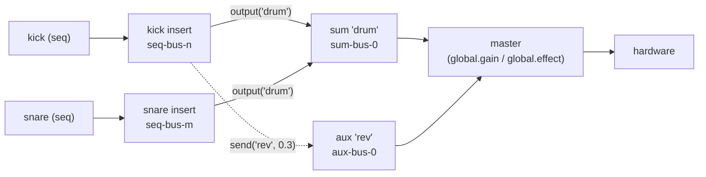

> **Note**: This page is a trace of the author's reading as of 2026-09-01. The code is the truth; this page is only a snapshot of understanding at that time.

# SC-2. The Mixer and the Audio Line — sum / aux / send / output / master gain

This chapter follows OrbitScore's "mixer". Declare buses with `global.sum()` / `global.aux()`,
route sound into them with `seq.output()` / `seq.send()`, and pull the master down with
`global.gain()` — operations you would do without thinking on a DAW's mixer view. We read how
they are wired from the TS DSL layer down to the Rust daemon's render callback, from both the
specification (core spec MX.1–MX.5) and the implementation.

Four issues are in scope. [#453](https://github.com/signalcompose/orbitscore/issues/453) /
[#459](https://github.com/signalcompose/orbitscore/issues/459) fixed the mixer DSL
specification; [#643](https://github.com/signalcompose/orbitscore/issues/643) moved instrument
sequences onto the mixer as sources and rewired the master fader; and
[#649](https://github.com/signalcompose/orbitscore/issues/649) is the audio-line design that
"does not create a fader stage". As of 2026-08-30, #649 is **design only** with no
implementation, so this chapter separates "what has been decided" from "what is still open".

The per-sequence insert bus itself (`seq.effect()`) is covered by
[RE-3](/en/rust-engine/insert-bus), so this chapter concentrates on what lies **beyond** the
insert bus — how buses merge and how they exit to the master. For the capture E2E machinery,
see [RE-4](/en/rust-engine/capture-verification).

## The routing model — a source points at its destination

Let me start with the picture the specification draws. Core spec MX.1 defines the model in a
single paragraph (author's translation):

> The graph consists of the serial path **source (seq) → optional per-seq insert (PH.2b) → sum
> (group bus) → master** and the parallel tap **send → aux (return bus) → master**. An edge is
> always **the source pointing at its destination**. The reconciliation key is the name (same
> name = same node; re-evaluation rebinds).
>
> — `docs/core/INSTRUCTION_ORBITSCORE_DSL.md` MX.1

As a diagram:



The point to note is the direction: **the edge is the source pointing at its destination**. The
sum bus does not enumerate "my members are kick and snare"; instead kick and snare each declare
`output("drum")`. This maps directly onto the shape of `SetBusRouting` we will see later (a seq
bus carries its own output target and send targets).

The DSL samples from the spec, quoted verbatim from its Markdown:

```js
// docs/core/INSTRUCTION_ORBITSCORE_DSL.md:1681-1685
global.sum("drum")                    // group bus 宣言（冪等）
kick.output("drum")                   // メンバーシップ = 行き先指定
snare.output("drum")
sum("drum").effect("GlueComp.clap")   // group bus 自身の insert（v1 は 1 基・PH.2b と同規則）
sum("drum").remove("GlueComp")        // 外す（差し替え・削除は PH.2d）
```

```js
// docs/core/INSTRUCTION_ORBITSCORE_DSL.md:1733-1735
global.aux("rev")                     // return bus 宣言
aux("rev").effect("Reverb.clap")      // return の insert（v1 必須要素）
kick.send("rev", 0.3)                 // send（copy・原音は継続して master/sum へ）
```

As v1 constraints, MX.5 states **no PDC (plugin latency compensation), no sum nesting, sends
fixed post-fader, and mutual exclusion with LinkAudio**. "Fixed post-fader" is the item #649 is
set to overturn, so we return to it in the second half.

## The DSL entry point: `global.sum()` / `global.aux()` → `MixerManager`

On the TS side the controller is `MixerManager` in
`packages/engine/src/core/global/mixer-manager.ts`. `Global.sum(name)` / `Global.aux(name)`
(`global.ts:481-489`) are thin entries that delegate to `this.mixerManager.sum(name)` /
`.aux(name)`; the substance is in `declareBus` (`mixer-manager.ts:251-283`). After an
empty-name check, three steps line up: reserving the bus name, the LinkAudio exclusion, and
acquisition from the pool.

```typescript
// packages/engine/src/core/global/mixer-manager.ts:263-283
    if (name === 'master') {
      throw new Error(
        `global.${kind}("master") is reserved: "master" names the output endpoint, not a ` +
          `${kind} bus. Choose a different name for this ${kind} bus.`,
      )
    }
    if (this.linkAudioManager.isEnabled()) {
      throw new Error(`global.${kind}() cannot be used while LinkAudio is enabled in v1.`)
    }

    const state = this.kinds[kind]
    let bus = state.buses.get(name)
    if (bus === undefined) {
      bus = state.pool.acquire(name)
      state.buses.set(name, bus)
      if (this.kindsWithBus(name).length > 1) {
        console.warn(MixerManager.ambiguousMessage(name))
      }
    }
    return this.makeHandle(kind, name, bus)
  }
```

The comment explains why `"master"` is rejected as a reserved word. `SetBusRouting`, which we
see later, interprets `output: "master"` as the reserved word meaning "clear the output to a
sum and return to master", so a sum bus with that name would silently shadow it. The Signal
Chain node-declaration form `var master = mix.sum` reaches this same `sum()`, so guarding here
in one place covers both forms.

Note the idempotence as well. If `state.buses.get(name)` already exists, the same bus is returned
without touching the pool. The spec's "same name = same node; re-evaluation rebinds" is realised
directly by a `Map` keyed on the name.

### The bus-name contract: TS and Rust share the prefix

The names acquired from the pool are `sum-bus-0` … `sum-bus-3` / `aux-bus-0` … `aux-bus-3`. The
prefix and the cap are constants on the TS side, and the comment states explicitly that they
must match the Rust side.

```typescript
// packages/engine/src/core/global/mixer-manager.ts:16-29
/**
 * `sum-bus-<n>` / `aux-bus-<n>` default pool prefixes. Must match
 * `DEFAULT_SUM_BUS_POOL_PREFIX` / `DEFAULT_AUX_BUS_POOL_PREFIX` in
 * `rust/crates/orbit-audio-daemon/src/engine_wrap.rs` (MX.4, #459/#453 M3) — changing
 * one requires changing the other.
 */
export const SUM_BUS_PREFIX = 'sum-bus-'
export const AUX_BUS_PREFIX = 'aux-bus-'

/**
 * v1 cap: at most 4 sum buses and 4 aux buses concurrently declared. Must match
 * `DEFAULT_SUM_BUS_POOL_SIZE` / `DEFAULT_AUX_BUS_POOL_SIZE` in `engine_wrap.rs`.
 */
export const MIXER_BUS_POOL_SIZE = 4
```

The corresponding Rust constants live in the daemon's `engine_wrap.rs`.

```rust
// rust/crates/orbit-audio-daemon/src/engine_wrap.rs:1963-1976
/// `sum-bus-<n>` 既定プールの名前 prefix。TS 側 `seq.output(sum)` が同じ規則で名前を組み立てる
/// （M3 で配線予定）。
#[cfg(feature = "outproc-effect")]
pub const DEFAULT_SUM_BUS_POOL_PREFIX: &str = "sum-bus-";
/// `aux-bus-<n>` 既定プールの名前 prefix。TS 側 `seq.send(aux, gain)` が同じ規則で名前を組み立てる
/// （M3 で配線予定）。
#[cfg(feature = "outproc-effect")]
pub const DEFAULT_AUX_BUS_POOL_PREFIX: &str = "aux-bus-";
/// `ORBIT_SUM_BUS_POOL` の既定サイズ（未設定時）。
#[cfg(feature = "outproc-effect")]
const DEFAULT_SUM_BUS_POOL_SIZE: usize = 4;
/// `ORBIT_AUX_BUS_POOL` の既定サイズ（未設定時）。
#[cfg(feature = "outproc-effect")]
const DEFAULT_AUX_BUS_POOL_SIZE: usize = 4;
```

In other words, when you write `global.sum("drum")`, the name `"drum"` never reaches the daemon.
TS binds `"drum" → "sum-bus-0"` and always addresses the daemon by a pool name such as
`sum-bus-0`. On its side the daemon pre-allocates, at startup, as many inactive stages as
`ORBIT_SUM_BUS_POOL` / `ORBIT_AUX_BUS_POOL` (default 4) say and waits — the same mechanism as the
insert bus's `ORBIT_EFFECT_BUS_POOL` (see [RE-3](/en/rust-engine/insert-bus)).

What is interesting is that the daemon holds the "kind" of a bus not by parsing the prefix string
but as an enum fixed at construction time, `BusKind { Insert, Sum, Aux }`
(`engine_wrap.rs:1950-1961`). Its doc comment explains that the value is held explicitly "so that
`SetBusRouting` validation does not depend on prefix string comparison". This `BusKind` is the
basis of the `SetBusRouting` validation we see later (output targets must be sum; send targets
must be aux). Separating the naming rule from the kind check means the validation logic survives a
prefix change.

## The three branches of `seq.output()`, and `seq.send()`

Next, the entry point on the sequence side, where a sequence "points at its destination".
`Sequence.output()` takes **three branches** depending on whether the argument is a sum name, a
numeric render bus, or a LinkAudio channel name. The resolution order is fixed by the spec (#598
§4.4), and the code is laid out in that order.

```typescript
// packages/engine/src/core/sequence.ts:350-375
  output(channelName: string | number): this {
    const name = this.stateManager.getName() || 'sequence'
    const destinationName = typeof channelName === 'number' ? String(channelName) : channelName
    if (!destinationName || !destinationName.trim()) {
      throw new Error(`Sequence '${name}': output(channelName) requires a non-empty channel name.`)
    }

    // Resolution order is normative (#598 §4.4): an existing sum named "1" must still win over
    // numeric render-bus interpretation. This lookup therefore deliberately precedes the number
    // branch below.
    const sumBus = this.global.resolveSumBus(destinationName)
    if (sumBus) {
      if (this.isMidi()) {
        throw new Error(
          `Sequence '${name}': output("${destinationName}") cannot target a mixer bus. ` +
            `MIDI is sent to an external device and therefore has no mixer output destination.`,
        )
      }
      // §4.4.1: live 宛先の宣言は render bus をクリアする（stale な offline 宛先を残さない）。
      this._renderBus = undefined
      this._insertBus = this._insertBus ?? this.global.ensureSequenceInsertBus(name)
      this._sumOutputBus = sumBus
      this.syncBusRouting()
      this.syncInstrumentSourceRouting()
      return this
    }
```

In the sum branch, look at `this._insertBus ?? this.global.ensureSequenceInsertBus(name)`. Even a
sequence that never declared `seq.effect()` gets a **pass-through insert bus with no plugin
loaded** the moment it calls `output(sum)`. To the daemon the source of a routing is always a
"seq bus", so without one there is no subject for `SetBusRouting`. The doc comment on
`SequenceEffectManager.ensureBus()` (`sequence-effect-manager.ts:89-97`) explains this with the
analogy of "a DAW-style track with no insert plugin but still a routable channel". The body is
short: return from the `Map` if present, otherwise acquire from the pool.

```typescript
// packages/engine/src/core/global/sequence-effect-manager.ts:98-104
  ensureBus(sequenceName: string): string {
    const existing = this.buses.get(sequenceName)
    if (existing) return existing
    const bus = this.pool.acquire(sequenceName)
    this.buses.set(sequenceName, bus)
    return bus
  }
```

The other two branches (numeric render bus at `sequence.ts:377-401`, LinkAudio channel at
`403-432`) received instrument-specific guards in #643 PR-2. For an instrument, `output(1)`
throws "offline render bus is not supported for instrument sequences" and `output("Kick Ch")`
throws "LinkAudio is not wired for instrument sequences". This avoids the silent failure of
"the destination is recorded but the sound does not follow" (the three-branch table in the
design document §12; the midi side is left untouched because changing it would be a breaking
change).

A MIDI sequence throws in the sum branch (`isMidi()` → throw). The "three articles" the #643
design document records in the owner's words — **the mixer bus specification is identical for
audio and instrument; only midi is unrelated to the mixer; the only exception is when LinkAudio is
the output** — appear here directly as the split in the guards.

`send()` has the same shape. An undeclared aux is an error, `amount` must be finite, repeated
calls fan out, and the same aux name overwrites.

```typescript
// packages/engine/src/core/sequence.ts:454-481
  send(auxName: string, amount: number): this {
    const name = this.stateManager.getName() || 'sequence'
    if (!auxName || !auxName.trim()) {
      throw new Error(`Sequence '${name}': send(auxName, amount) requires a non-empty aux name.`)
    }
    if (this.isMidi()) {
      throw new Error(
        `Sequence '${name}': send() cannot target a mixer bus. ` +
          `MIDI is sent to an external device and therefore has no mixer output destination.`,
      )
    }
    const auxBus = this.global.resolveAuxBus(auxName)
    if (!auxBus) {
      throw new Error(
        `Sequence '${name}': send("${auxName}", ...) references an undeclared aux bus. ` +
          `Call global.aux("${auxName}") first.`,
      )
    }
    if (!Number.isFinite(amount)) {
      throw new Error(`Sequence '${name}': send("${auxName}", ${amount}) gain must be finite.`)
    }

    this._insertBus = this._insertBus ?? this.global.ensureSequenceInsertBus(name)
    this._auxSends.set(auxBus, amount)
    this.syncBusRouting()
    this.syncInstrumentSourceRouting()
    return this
  }
```

Keep in mind that `_auxSends` is a `Map<string, number>` keyed by the **pool name (`aux-bus-n`)**.
This Map is one piece of evidence behind the #649 design's finding that "each method updates a
completely independent slice".

## Delivering the routing to the daemon: `SetBusRouting`

`syncBusRouting()` (`sequence.ts:543-570`), called at the end of `output()` / `send()`, is
fire-and-forget and puts **the output plus all sends together every time** on `SetBusRouting`, as
`this.global.setBusRouting(bus, this._sumOutputBus, buildRoutingSends(this._auxSends))`. Sending
the full state rather than a diff keeps re-sends idempotent. On failure it raises
`_busRoutingStale`; a `DaemonProtocolError` (a definitive rejection by the daemon) is reported via
`console.error` as "routing was NOT applied", anything else via `console.warn` as "will
re-sync". The awaitable variant called from Signal Chain syntax is `pushBusRouting()`
(`522-535`), which builds the same arguments.

`RustEnginePlayer.setBusRouting` (`rust-engine-player.ts:949-969`) keeps an intent-first cache
`busRoutings`: on transport loss the intent stays and `reapplyBusRoutingAfterRespawn` re-sends it
after a respawn; only a definitive `DaemonProtocolError` rejection rolls the cache back. A
respawned daemon starts with its routing atomics at their defaults, so without this replay every
sum / aux routing would silently degrade to plain per-sequence output.

Reading the daemon's `set_bus_routing` validation, the rules are: "the output target must be a
later stage and `BusKind::Sum`", "a send target must be a later stage and `BusKind::Aux`", and
"if even one check fails, nothing is applied".

```rust
// rust/crates/orbit-audio-daemon/src/engine_wrap.rs:5797-5817
        // 1. output target を検証（反映はまだしない・部分適用を避ける）。
        let resolved_output = match output {
            Some("master") => Some(1),
            Some(name) => {
                let target_index = *control.bus_index.get(name).ok_or_else(|| {
                    WrapError::OutProcEffect(format!("SetBusRouting output: unknown bus '{name}'"))
                })?;
                if target_index <= seq_index {
                    return Err(WrapError::OutProcEffect(format!(
                        "SetBusRouting output '{name}' (index {target_index}) must be a later stage than '{seq_bus}' (index {seq_index})"
                    )));
                }
                if control.bus_kinds.get(name) != Some(&BusKind::Sum) {
                    return Err(WrapError::OutProcEffect(format!(
                        "SetBusRouting output '{name}' must be a sum bus"
                    )));
                }
                Some(target_index + 2)
            }
            None => None,
        };
```

`Some("master") => Some(1)` is the receiving end of the `"master"` we saw reserved on the TS side.
The `target_index + 2` encoding packs three states — "0 = unchanged / 1 = Master / 2 and up =
bus index" — into one atomic, which the native side's `routing_override` reads.

### The render side: the post-loop merges in topological order

How does the native render callback consume the routing the daemon wrote into the atomics? The
place is the second half of `render_engine_with_insert_buses_and_source_outputs` in
`output.rs`, the so-called **post-loop**.

```rust
// rust/crates/orbit-audio-native/src/output.rs:935-961
    let feeds = collect_source_feeds(sources, rendered_units, &bus_positions, bs);
    engine.render_multi_feeds(hw, &mut targets, &feeds);
    drop(targets);

    // post-loop: 配列順（= トポロジカル順・MX.4）で is_render_target な stage を処理する。
    // stage i の output_target/send は必ず i より後ろを指す（構築時 validate_bus_topology で
    // 検証済み）ので、`split_at_mut(i + 1)` で「i を含む左」と「i より後ろの右」に安全に分割できる
    // （sum のネスト・循環は構造的に発生しない）。
    for i in 0..buses.len() {
        if !render_targets[i] {
            continue;
        }
        if active_flags[i] {
            if let Some(processor) = buses[i].processor.as_mut() {
                processor.process(&mut buses[i].buffer[..bs]);
            }
        }

        let (left, right) = buses.split_at_mut(i + 1);
        let src_stage = &left[i];

        match effective_targets[i] {
            BusTarget::Master => {
                for (dst, s) in hw.iter_mut().zip(&src_stage.buffer[..bs]) {
                    *dst += *s;
                }
            }
```

Read it like this.

1. In `engine.render_multi_feeds(hw, &mut targets, &feeds)` the scheduler mixes events into each
   bus buffer (`targets`) and into `hw`, adds the feeds (instrument output), and applies the
   **master gain ramp once to every buffer** (the core-side implementation is in the next section)
2. The post-loop walks the stages in array order (= topological order, MX.4), runs
   `processor.process` if there is an insert, and adds into `hw` (Master) or a later bus
   (`Bus(j)`) according to `effective_targets[i]`
3. The continuation of the excerpt (`output.rs:962-985`) adds into `Bus(j)` and then adds
   gain-scaled copies for `sends` and the runtime send overrides (fan-out is not event
   duplication but "copy-add at the bus processing stage", exactly as MX.4 prescribes)

`split_at_mut(i + 1)` can split left and right because `validate_bus_topology` verified at
construction that "stage i's destination is always later than i". Here is the implementation-side
backing for the spec's guarantee that sum nesting and cycles cannot occur **structurally** (MX.2
"nesting is not supported in v1").

## Making an instrument a mixer source (#643)

The routing so far was originally for audio sequences (`audio()` / `chop()`). Until #643 PR-1 on
2026-08-29, the sound of an instrument (`seq.instrument()`) was **added directly into the master
buffer** by the daemon's `CompositePostProcessor`, outside the bus graph. What the design document
(`docs/design/643-mixer-foundation-design.md`) records as the "origin" is that, because of this,
all three of `effect()` / `output()` / `send()` threw on note sequences.

PR-1's answer was to make the instrument a **premaster contributor**. The foundation (core /
native) does not know what an instrument is; it holds only the abstraction "something that hands
back N blocks when rendered".

```rust
// rust/crates/orbit-audio-native/src/output.rs:269-282
/// A callback-owned source which renders one or more interleaved output units.
pub trait BlockSource: Send {
    fn render(&mut self, frames: usize, transport: &BlockTransport) -> usize;
    fn output(&self, unit: usize) -> &[f32];
}

/// Destination of one source output unit.
#[derive(Debug, Clone, Copy, PartialEq, Eq, Default)]
pub enum SourceDest {
    #[default]
    Master,
    Bus(usize),
    Link(usize),
}
```

`SourceDest` having the three values `Master / Bus / Link` corresponds to the design's owner
decision "fix the address model as `(instance, unit)` now". `SourceSlot.dests` is a
`Vec<SourceDestCell>`, so each unit can have its own destination. As of 2026-09-01, however, TS
issues `unit` fixed at 0 (see below).

Feed collection is done by `collect_source_feeds` (`output.rs:772-801`), which maps each unit's
`SourceDest` to the core's `FeedDest`. Only the mapping is quoted here.

```rust
// rust/crates/orbit-audio-native/src/output.rs:787-797
            let dest = match slot.dests[unit].load() {
                SourceDest::Master => FeedDest::Hardware,
                SourceDest::Bus(index) => bus_positions
                    .get(index)
                    .copied()
                    .flatten()
                    .map_or(FeedDest::Hardware, FeedDest::Channel),
                // Link source routing is wired in PR-3. Until then it is a total hardware fallback.
                SourceDest::Link(_) => FeedDest::Hardware,
            };
            feeds.push((output, dest));
```

As the comment on `SourceDest::Link(_) => FeedDest::Hardware` says, the actual instrument →
LinkAudio wiring is left for PR-3. The reason the LinkAudio branch of `output()` on the TS side
rejected instruments is to seal off this fallback's "silently goes to hardware" as a silent
failure.

Looking at the core's `render_multi_feeds` (`scheduler.rs:375-460`), the order is zero-fill →
event mixing → feed addition (`422-441`: `*dst += *sample` into `hardware_out` for
`FeedDest::Hardware`, or into the bus buffer for `Channel(i)`) → gain ramp. The gain ramp part is
quoted.

```rust
// rust/crates/orbit-audio-core/src/scheduler.rs:443-456
        // master gain ramp を **1 回だけ**進め（next_gain_frame）、全バッファに同じ per-frame
        // gain を適用する（バッファごとに進めると ramp が多重に進み desync するため frame ループは 1 つ）。
        for frame in 0..frames_to_render {
            let g = self.next_gain_frame();
            let base = frame * output_channels;
            for ch in 0..output_channels {
                hardware_out[base + ch] *= g;
            }
            for (_, buf) in channels.iter_mut() {
                for ch in 0..output_channels {
                    buf[base + ch] *= g;
                }
            }
        }
```

Design document §5.1 marks this position as "★ feed addition loop (new, ~10 lines)" and concludes
"**this makes the existing defect of `global.gain` not affecting instruments disappear** (position
fix only; no separate treatment needed)". The native unit test
`global_gain_scales_instrument_contribution` (`output.rs:2017`) sets `set_global_gain(0.5, 0.0)`,
pushes a `SourceDest::Master` feed through, and pins the output at 0.5× (WORK_LOG 6.405 keeps the
actual red → green output).

### The TS side: the `SetSourceRouting` choke point

PR-2 (the TS side) concentrated into one place the path that issues
`SetSourceRouting { source: "plugin:<name>", unit: 0, target: <bus> }` the moment an instrument
sequence holds an insert bus. Whether the order is `instrument()` → `effect()` or the reverse, it
passes through here.

```typescript
// packages/engine/src/core/sequence.ts:730-757
  private ensureInstrumentSourceRouting(): Promise<void> {
    if (!this.isInstrument() || !this._insertBus) return Promise.resolve()
    const bus = this._insertBus
    if (this._instrumentSourceRoutingBus === bus) {
      return this._instrumentSourceRoutingPromise ?? Promise.resolve()
    }
    if (!this.audioEngine.setSourceRouting) {
      return Promise.reject(new Error('Instrument mixer routing requires the Rust engine backend.'))
    }

    const name = this.stateManager.getName() || 'sequence'
    this._instrumentSourceRoutingBus = bus
    const pending = this.audioEngine
      .setSourceRouting(`plugin:${name}`, 0, bus)
      .catch((error) => {
        if (this._instrumentSourceRoutingBus === bus) {
          this._instrumentSourceRoutingBus = undefined
        }
        throw error
      })
      .finally(() => {
        if (this._instrumentSourceRoutingPromise === pending) {
          this._instrumentSourceRoutingPromise = undefined
        }
      })
    this._instrumentSourceRoutingPromise = pending
    return pending
  }
```

The pair `_instrumentSourceRoutingBus` and `_instrumentSourceRoutingPromise` prevents "double
issue to the same bus" while letting a failure clear the marker so it can be retried.
`syncInstrumentSourceRouting()`, called at the end of `output()` / `send()`, is an adapter that
wraps this Promise fire-and-forget.

E2E-4 (below) shows the whole path working on the real machine: when an instrument holds
`output("sum643")` and `send("aux643", 0.5)` at the same time, the captured RMS is about 1.5× dry
(1.0 via sum + 0.5 via aux).

## The master fader `global.gain()` — a wiring read three times over

The most substantial part of this chapter is the master gain. Across WORK_LOG 6.404 → 6.405 →
6.408 → 6.410 → 6.415 → 6.420, **the understanding was rewritten three times between the same
day (2026-08-29) and the next**. Let me follow it in order.

### (1) The old implementation: TS folded it into every event

Before #643 PR-2 fixed it, `global.gain()` **added `masterGainDb` into the gain of each audio
event** (`sequenceGainDb + masterGainDb` in `event-scheduler.ts`). The instrument's note path had
no such folding, so **the master had no effect on instruments at all**. On top of that, the Rust
side had had `set_global_gain` (with a gain ramp) from the start, and **TS had never called it**
(WORK_LOG 6.408).

### (2) #643 PR-2: rewire to the daemon's master gain

The fixed `Global.gain()` converts dB to linear amplitude and passes it to `setGlobalGain`.

```typescript
// packages/engine/src/core/global.ts:601-613
  gain(valueDb?: number): number | this {
    const result = this.effectsManager.gain(valueDb)
    if (typeof result === 'number') {
      return result
    }
    // 線形 amplitude へ変換して daemon へ。fire-and-forget（DSL 表面を async にしない）。
    void this.audioEngine
      .setGlobalGain?.(gainDbToAmplitude(this.effectsManager.getMasterGainDb()))
      ?.catch((error) => {
        console.warn(`⚠️  global.gain(): failed to apply master gain to the mixer: ${error}`)
      })
    return this
  }
```

The contract on the `AudioEngine` side is the single line
`setGlobalGain?(amplitude: number, rampSec?: number): Promise<void>` (`engine-backend.ts:46`); it
is optional, so nothing happens on the SC backend. The essential point of
`RustEnginePlayer.setGlobalGain` is "record the intent first, regardless of the daemon's state".

```typescript
// packages/engine/src/audio/rust-engine/rust-engine-player.ts:1247-1259
  async setGlobalGain(amplitude: number, rampSec = 0): Promise<void> {
    // 🔴 daemon の状態に関わらず**先に intent を記録する**。未接続時に捨てると、
    // 接続後に復元する手がかりが消える（`Global.gain()` を再評価する経路は存在しない）。
    this.globalGainIntent = { amplitude, rampSec }
    if (!this.daemon.isRunning()) {
      // daemon 未接続時は送らない。**intent は上で記録済み**なので、respawn 後に
      // `reapplyGlobalGainAfterRespawn()` が再送する。
      // （旧コメントは「次の起動時に global.gain() が再評価される」と書いていたが、
      //   そのような経路は存在しなかった — #648 レビューで指摘）
      return
    }
    await this.daemon.setGlobalGain(amplitude, rampSec)
  }
```

The intent is kept for respawn. The daemon is a new process starting at `global_gain = 1.0`, so
without a re-send "-6dB in the DSL but actually unity" would happen with no error and no log. This
regression was found in the review of PR #648 (WORK_LOG 6.410, the first Critical) and added as
`reapplyGlobalGainAfterRespawn()`, the mirror image of `reapplyBusRoutingAfterRespawn`.

The event-side folding was removed, but `-Infinity` (complete silence) alone remains. The comment
on `calculateEventGain` (`event-scheduler.ts:30-65`) states that the old implementation returned
`sequenceGainDb + masterGainDb` and that **the order relative to the insert has not changed**
(next section), and then gives the reason for keeping it:

```typescript
// packages/engine/src/core/sequence/scheduling/event-scheduler.ts:56-65
  // `masterGainDb === -Infinity`（完全無音）だけは残す — daemon 側の gain が 0.0 になるまでの
  // ramp 中に音が漏れるのを避けるため、発音側でも落とす。
  if (isMuted) {
    return -Infinity
  } else if (sequenceGainDb === -Infinity || masterGainDb === -Infinity) {
    return -Infinity
  } else {
    return sequenceGainDb
  }
}
```

### (3) The 6.410 correction: master gain is still before the insert

The first draft of PR #648 wrote in six places that "the problem of master being applied before
entering the bus is also resolved", but the Fable audit pointed at the spec's known constraint
and flagged it as wrong (author's translation):

> The master gain ramp is applied **before** the per-sequence insert (the reverse of a DAW's
> "fader after insert"; no effect when the master is at unity).
>
> — `docs/core/INSTRUCTION_ORBITSCORE_DSL.md` PH.2b, known v1 constraints

Re-reading the post-loop above, the order is indeed `render_multi_feeds` (gain ramp) →
`processor.process` (insert), and #643 did not change it. "Put the fader after the insert" is
carried over as the subject of #649.

### (4) 6.415: the capture E2E caught "it has no effect" on the real machine

Here is the climax of the chapter. During the real-machine verification for #633 (WORK_LOG
6.415, 2026-08-29), measuring the RMS of the capture WAV in 0.25-second windows over the interval
where `global.gain(-6)` was evaluated gave **a flat 0.0886** (0.044 if it had worked). With probes
on both ends, TS sent `amp=0.5011872` and the daemon received
`SetGlobalGain received value=0.5011872`. **Send and receive are normal, and yet the sound does
not change.**

As its hypothesis at the time, 6.415 wrote "because the post-loop's `BusTarget::Master` adds
directly into the `hw` that already had gain applied, sound merging from a stage into the master
passes the master gain by", and the same explanation went into the #649 issue.

But the #649 design v3 the following day (WORK_LOG 6.420) **corrects that explanation itself**
(author's translation):

> What I wrote in the issue — "because the post-loop adds the stages after the gain" — **does not
> explain E2E-1** (E2E-1's instrument does not pass through a bus; it is added via
> `FeedDest::Hardware` before the gain loop). **It came to light because Fable honestly wrote
> "not fully identified".**
>
> — `docs/archive/WORK_LOG_2026-08.md` 6.420

Indeed, E2E-1's DSL declares neither sum nor aux, so the instrument's feed goes from
`render_engine_with_source_outputs` (`output.rs:1078`) into `render_multi_feeds` and is added to
`hw` **before** the gain loop. As far as the core code quoted above goes, the same `g` is applied
to `hw` and to every `channels` buffer, so a static reading alone cannot explain a "bypass". The
#649 design document §13 frames it as "**the static wiring is complete**; therefore the defect is
not a static miswire but a dynamic event", and rather than filling the cause with a hypothesis it
builds the **B-0 measurement ladder** first (add a `global_gain` getter to core and expose it in
`get_engine_state` → bisect with probe 0.5 / 1.0 → take TS out and drive the daemon protocol
directly).

> NOTE: unverified — needs confirmation: whether E2E-1 is green or red on the real machine at
> `69dc968` (2026-09-01) is something the author has not run and confirmed. Since the #649 design
> document §13 is built on the premise "E2E-1 red + probe", the author reads it as red as of
> 2026-08-30.

### Why the unit tests could not see it

Quoting the table from WORK_LOG 6.415:

| Means | Caught the master-gain defect? |
|---|---|
| Mutation verification, 35 cases (80+ minutes) | No |
| Unit tests, 2149 cases | No |
| Capture E2E on the same path a user takes | **Only this** |

The native unit test `global_gain_scales_instrument_contribution` is green. That is, if you call
`render_block_with_sources` **in isolation**, the gain is applied correctly. That it still has no
effect on the real machine means the defect is not in a "part" but in the "wiring" — somewhere in
the production stream's start-up order, the timing at which the instrument child attaches, or the
order in which several consumers touch the same state. The design document warns of exactly this:
"merely making E2E-1 green under the new model could leave other consumers of the old path
broken".

One more point 6.415 leaves as a caveat matters too. This defect is **not an error case**. Every
layer returned success and not a single ERROR line was written. Logs are the device for "noticing
when something breaks"; the only thing that catches "looks correct but the summation is wrong" is
the capture E2E.

## How the capture E2E measures

`captureInstrumentScenario` in `tests/e2e/orbitstudio-mcp-gated.spec.ts` drives the real
OrbitStudio via MCP and measures the RMS of the daemon's capture WAV per segment. A segment's RMS
is the root of the mean of the squared RMS of each window inside it, with a guard (default 0.15
seconds) trimmed from both ends of the segment to exclude transitions.

```typescript
// tests/e2e/orbitstudio-mcp-gated.spec.ts:593-598
    const rms = (name: string, guardSec = 0.15): number => {
      const selected = windows(name, guardSec)
      return Math.sqrt(
        selected.reduce((sum, window) => sum + window.rms * window.rms, 0) / selected.length,
      )
    }
```

E2E-1 takes one segment at `global.gain(0)`, evaluates `global.gain(-6)`, takes another, and
requires the ratio to fall within 0.45–0.55 ($10^{-6/20} \approx 0.501$).

```typescript
// tests/e2e/orbitstudio-mcp-gated.spec.ts:1429-1463
  it.skipIf(!appAvailable)(
    '#643 E2E-1 applies global.gain(-6) to a playing instrument at about half the 0 dB RMS',
    async () => {
      const catalog = requireCatalogFixtures()
      const result = await captureInstrumentScenario(
        'global-gain',
        [
          'var global = init GLOBAL',
          'global.key("C")',
          'global.tempo(120)',
          'global.beat(4 by 4)',
          'global.gain(0)',
          'global.start()',
          'var gain643 = init global.seq',
          `gain643.instrument(${JSON.stringify(catalog.clapSynthName)})`,
          'gain643.gate(1)',
          'gain643.play(1, 1, 1, 1)',
          'LOOP(gain643)',
        ],
        async ({ captureSegment, evaluate }) => {
          await captureSegment('unity')
          await evaluate('global.gain(-6)')
          await captureSegment('half')
        },
      )
      // 🔴 `global.gain()` は **dB**（`gain(valueDb?)`・-60..+12 にクランプ）。線形値ではない。
      // 0 dB -> -6 dB で amplitude は 10^(-6/20) ≈ 0.501 = 約半分。
      const unity = result.rms('unity')
      const half = result.rms('half')
      expect(unity, 'E2E-1 unity instrument must be audible').toBeGreaterThan(0.05)
      expect(half / unity, `E2E-1 half/unity RMS ratio (${half}/${unity})`).toBeGreaterThan(0.45)
      expect(half / unity, `E2E-1 half/unity RMS ratio (${half}/${unity})`).toBeLessThan(0.55)
    },
    TEST_TIMEOUT_MS,
  )
```

E2E-4 is the sum + aux path. It switches between dry (no bus) and an instrument holding
`output("sum643")` + `send("aux643", 0.5)`, and checks that the ratio falls within 1.35–1.65
(theoretical 1.5) (`1585-1592`). The DSL part is quoted.

```typescript
// tests/e2e/orbitstudio-mcp-gated.spec.ts:1556-1575
        [
          'var global = init GLOBAL',
          'global.key("C")',
          'global.tempo(120)',
          'global.beat(4 by 4)',
          'global.sum("sum643")',
          'global.aux("aux643")',
          'global.start()',
          'var routeDry643 = init global.seq',
          `routeDry643.instrument(${JSON.stringify(catalog.clapSynthName)})`,
          'routeDry643.gate(1)',
          'routeDry643.play(1, 1, 1, 1)',
          'var routeWet643 = init global.seq',
          `routeWet643.instrument(${JSON.stringify(catalog.clapSynthName)})`,
          'routeWet643.output("sum643")',
          'routeWet643.send("aux643", 0.5)',
          'routeWet643.gate(1)',
          'routeWet643.play(1, 1, 1, 1)',
          'LOOP(routeDry643)',
        ],
```

Passing `ORBIT_KEEP_CAPTURES=<dir>` keeps the capture WAV out of tmpRoot's clean-up. As the
harness comment says, what made it possible to reach the defect in 6.415 was not "one number
inside a window" but looking at the RMS of the kept WAV over time.

## The audio-line design (#649) — decided, and still open

#649 (`docs/design/649-audio-line-design.md`) is the design that reworks from the root the
"position of the fader" exposed by 6.415. **As of 2026-08-30 it is design only, with no
implementation.** The author confirmed that grepping `packages/engine/src` / `rust/crates` at
`69dc968` for `_lineOrder` / `evalBegin` / `gain_override` finds nothing.

### Owner decisions (not to be reopened)

| Item | Decision |
|---|---|
| Principle | **In the audio line, the order of the method chain is deterministic** (§7.6) |
| Boundary | Everything after "the point where sound is born" (up to `audio()` / `instrument()` / `play()`) is the audio line (§1) |
| Fader | No "fader stage" is created. `gain` is one element on the chain (§2.1) |
| pre / post | No flag. `send` before `gain` is pre-fader, after it is post-fader (§2.2) |
| `seq.send()` method form | **Abolished** (breaking change, owner approved). send is a chain element only (§7.2) |
| `output` | Not a terminal. Nothing after it receives sound as a consequence of position; the engine throws no error (§7.3) |
| Evaluation granularity | Follow the existing "all lines of a subject" evaluation. No new rule (§7.4) |
| Rack | The `effect([...])` rack notation stays. `Gain` is **outside** the rack (§7.5) |
| bus / master | `sum("drum").effect([...])` / `global.effect([...])` are treated with the same standing (§2.3) |

Abolishing `seq.send()` means the `send()` method we read in this chapter will go away. At
`69dc968`, however, `send()` works, and E2E-4 uses it.

### Facts implementation design v3 established "by reading the implementation"

Design document §15 records that v1 and v2 were "rules invented without reading the
implementation" and were corrected by the owner all three times. v3 established three facts from
the implementation.

1. **There are three evaluation paths** (editor with selection / without selection = all lines
   of the subject / MCP), and all converge on `writeCodeToEngine`
2. **The engine holds no document.** Evaluation means writing text to stdin, so "re-read the
   source on every re-evaluation" is physically impossible
3. `gain()` / `send()` / `output()` / `effect()` update **completely independent slices**. The
   `_auxSends` / `_sumOutputBus` / `_insertBus` we saw in this chapter are those slices, and the
   call order is lost the moment `process-statement.ts` runs `dispatchCall`

From there, the v3 design adds exactly one permutation `_lineOrder` (values stay in the existing
slices), creates evaluation-batch boundaries by injecting `//#evalBegin` / `//#evalEnd`, and
implements gain / pan as native stage scalars outside the rack (no additional child process).

### Open (to be decided before implementation)

| Item | Status |
|---|---|
| The set of elements that ride the audio line (classification of `mute` / `defaultGain` / `quantize`, etc.) | §8 Q1, open |
| One PR or staged | §8 Q2, after measuring the size |
| Default position when a standalone statement creates an element for the first time (channel-strip order recommended) | §10.4, one owner confirmation |
| Direction of movement in the cursor rule | §14 #2, confidence "medium" |
| Interference between `//#evalBegin/End` and the existing meta-line handling | §14 #3, confidence "medium-high" |
| The cause of E2E-1 being red | After measuring in §13 B-0 (unidentified) |

The design's completion conditions (§5) are all measured by capture. "Placing `send` before
versus after `effect` changes the AUX sound", "placing `gain` after `effect` leaves the
reverb ratio unchanged" — the verification of this design sits on the extension of the E2E-1 /
E2E-4 we read in this chapter.

## Try it: sum / aux / send / master gain in a minimal setup

Below is a minimal `.orbs` that passes through the whole path read in this chapter (written by
the author; E2E-4's DSL rewritten for audio sequences).

```
var global = init GLOBAL
global.tempo(120)
global.beat(4 by 4)
global.sum("drum")
global.aux("rev")
global.start()

var kick = init global.seq
kick.audio("kick.wav")
kick.output("drum")
kick.send("rev", 0.5)
kick.play(1, 1, 1, 1)

var hat = init global.seq
hat.audio("hat.wav")
hat.output("drum")
hat.play(1, 1, 1, 1)

LOOP(kick, hat)
```

The expected wiring is as follows.

1. `global.sum("drum")` → `MixerManager.declareBus('sum', 'drum')` → `sum-bus-0`
2. `global.aux("rev")` → `aux-bus-0`
3. `kick.output("drum")` → `ensureSequenceInsertBus('kick')` acquires `seq-bus-0` as a
   pass-through → `SetBusRouting(seq-bus-0, output=sum-bus-0, sends=[])`
4. `kick.send("rev", 0.5)` → `SetBusRouting(seq-bus-0, output=sum-bus-0, sends=[(aux-bus-0, 0.5)])`
   (full-state re-send)
5. `hat.output("drum")` → `seq-bus-1` → `SetBusRouting(seq-bus-1, output=sum-bus-0, sends=[])`
6. Render callback: events are mixed into the `seq-bus-0` / `seq-bus-1` buffers, the post-loop
   adds them into `sum-bus-0`, a 0.5× copy of `seq-bus-0` is added into `aux-bus-0`, and finally
   `sum-bus-0` and `aux-bus-0` merge into `hw`

Evaluating `global.gain(-6)` here delivers `SetGlobalGain(value=0.5011872)` to the daemon, and the
core's gain ramp is applied to `hw` and every bus buffer. How this path behaves on the real
machine for audio sequences is something the author did not measure while writing this chapter.

Two cautions. `SetBusRouting` is exclusive to the daemon's `outproc-effect` feature, so a build
without the feature returns `UNSUPPORTED` and `syncBusRouting` prints "routing was NOT applied"
via `console.error`. And in a session that declared `global.linkAudio()`, `global.sum()` /
`global.aux()` themselves throw (v1 mutual exclusion, PH.5).

## Next exploration candidates

- **Identify the dynamic event that makes E2E-1 red** — follow the record of actually running the
  B-0 measurement ladder of #649 §13 (expose a `global_gain` getter in `get_engine_state`, probe
  bisection, driving the daemon protocol directly)
- **The `SetBusRouting` `routing_override` encoding (0 / 1 / index+2) and the band split of
  `SourceDestCell`** — how the two kinds of atomic routing are decoded on the native side
  (`output.rs:286-330`)
- **`validate_bus_topology` and the construction order of the bus array** — how the insert → sum →
  aux order is fixed in `build_effect_bus_stages` (around `engine_wrap.rs:2050-2130`)
- **The three respawn re-application siblings** (`reapplyBusRoutingAfterRespawn` /
  `reapplySourceRoutingAfterRespawn` / `reapplyGlobalGainAfterRespawn`): their call order and
  independence on failure
- **The mixer's exit (#611)** — "which bus goes to which device channel", which #643 design §1.5
  admits is "undesigned". Why what lies beyond `SourceDest::Master` is fixed at stereo
- **Re-reading after #649 lands** — how `_lineOrder` / `//#evalBegin` / native stage scalars
  replace this chapter's `_auxSends` / `syncBusRouting`

## Sources

- `docs/core/INSTRUCTION_ORBITSCORE_DSL.md:1616-1706` — Mixer / Routing (MX.1–MX.5) normative text
- `docs/core/INSTRUCTION_ORBITSCORE_DSL.md:1247-1249` — known constraint: master gain ramp applied before the insert
- `docs/design/643-mixer-foundation-design.md` — #643 design (owner's three articles, responsibility boundary, feed injection point §5.1, `output()` three branches §12)
- `docs/design/649-audio-line-design.md` — #649 audio-line design (§7 decisions, §8 open items, §9–§14 implementation design v3)
- `docs/archive/WORK_LOG_2026-08.md` 6.404 / 6.405 / 6.408 / 6.410 / 6.415 / 6.420 — #643 design → PR-1 → PR-2 → review correction → real-machine discovery → #649 design v3
- `packages/engine/src/core/global/mixer-manager.ts:16-29` — `SUM_BUS_PREFIX` / `AUX_BUS_PREFIX` / `MIXER_BUS_POOL_SIZE`
- `packages/engine/src/core/global/mixer-manager.ts:251-283` — `declareBus` (`"master"` reserved, LinkAudio exclusion, pool acquisition)
- `packages/engine/src/core/global.ts:481-489` — `Global.sum()` / `Global.aux()`
- `packages/engine/src/core/global.ts:601-613` — `Global.gain()` → `setGlobalGain`
- `packages/engine/src/core/global/sequence-effect-manager.ts:89-104` — `ensureBus()` (pass-through insert)
- `packages/engine/src/core/sequence.ts:350-432` — the three branches of `Sequence.output()`
- `packages/engine/src/core/sequence.ts:454-481` — `Sequence.send()`
- `packages/engine/src/core/sequence.ts:522-570` — `pushBusRouting` / `syncBusRouting`
- `packages/engine/src/core/sequence.ts:724-757` — `ensureInstrumentSourceRouting` (`SetSourceRouting` choke point)
- `packages/engine/src/core/sequence/scheduling/event-scheduler.ts:30-65` — `calculateEventGain` (folding removed, `-Infinity` kept)
- `packages/engine/src/audio/engine-backend.ts:45-46` — `setGlobalGain` contract
- `packages/engine/src/audio/rust-engine/rust-engine-player.ts:949-969` — `setBusRouting` (intent-first cache)
- `packages/engine/src/audio/rust-engine/rust-engine-player.ts:1023-1035` — `reapplyGlobalGainAfterRespawn`
- `packages/engine/src/audio/rust-engine/rust-engine-player.ts:1247-1259` — `setGlobalGain` (intent recording)
- `rust/crates/orbit-audio-daemon/src/engine_wrap.rs:1950-1976` — `BusKind` / sum and aux pool prefixes and default sizes
- `rust/crates/orbit-audio-daemon/src/engine_wrap.rs:5776-5845` — `set_bus_routing` validation
- `rust/crates/orbit-audio-daemon/src/session.rs:2214-2236` — `SetGlobalGain` handler
- `rust/crates/orbit-audio-native/src/output.rs:269-282` — `BlockSource` / `SourceDest`
- `rust/crates/orbit-audio-native/src/output.rs:772-801` — `collect_source_feeds`
- `rust/crates/orbit-audio-native/src/output.rs:935-986` — the `render_multi_feeds` call and the post-loop
- `rust/crates/orbit-audio-native/src/output.rs:1078-1094` — the no-bus path `render_engine_with_source_outputs`
- `rust/crates/orbit-audio-native/src/output.rs:2017-2060` — unit test `global_gain_scales_instrument_contribution`
- `rust/crates/orbit-audio-core/src/scheduler.rs:375-460` — `render_multi_feeds` (feed addition and gain ramp)
- `tests/e2e/orbitstudio-mcp-gated.spec.ts:503-603` — `captureInstrumentScenario` / `rms()`
- `tests/e2e/orbitstudio-mcp-gated.spec.ts:1432-1466` — E2E-1 (`global.gain(-6)`)
- `tests/e2e/orbitstudio-mcp-gated.spec.ts:1553-1595` — E2E-4 (`output(sum)` + `send(aux, 0.5)`)
- Issue [#453](https://github.com/signalcompose/orbitscore/issues/453) / [#459](https://github.com/signalcompose/orbitscore/issues/459) — mixer DSL (sum / aux / send)
- Issue [#643](https://github.com/signalcompose/orbitscore/issues/643) / PR [#648](https://github.com/signalcompose/orbitscore/pull/648) — mixer foundation, instrument as source, master fader wiring
- Issue [#649](https://github.com/signalcompose/orbitscore/issues/649) — audio-line design
- Issue [#611](https://github.com/signalcompose/orbitscore/issues/611) — design of the mixer's exit (multi-out)
