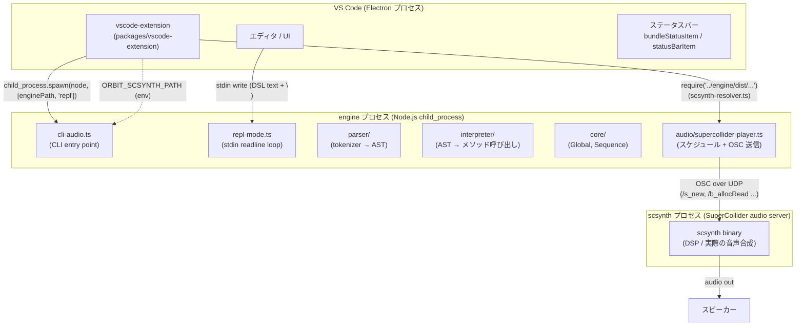
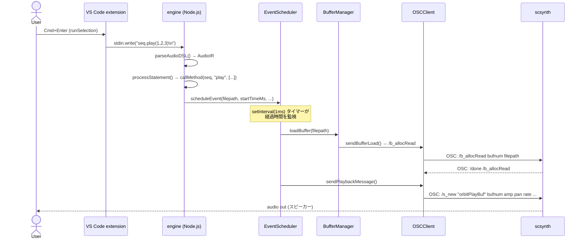

> **Note**: 本ページは 2026-05-05 時点での著者の reading の足跡です。code が真実、本ページはその時点の理解の snapshot に過ぎません。

# 0-2. アーキテクチャ全景

`.osc` ファイルに `seq.play(1, 2, 3)` と書いて `Cmd+Enter` を押す。数秒後に音が出る。その間に何が起きているか — それが本章の問いだ。

答えは 3 つのプロセスにまたがる。**VS Code extension** (UI 層)、**engine** (Node.js DSL ランタイム)、**scsynth** (SuperCollider オーディオサーバー) だ。それぞれが独立したプロセスとして動き、明確な境界で責務を分担している。

## 3 層の全体像



### 各層の責務

| 層 | プロセス | 言語 | 責務 |
|---|---|---|---|
| **VS Code extension** | Extension Host (Node.js、Renderer から fork) | TypeScript | ユーザー入力受付、engine spawn/kill、scsynth パス解決、ステータス表示 |
| **engine** | Node.js | TypeScript | DSL パース、AST 解釈、イベントスケジュール、OSC メッセージ生成 |
| **scsynth** | C++ ネイティブ | C++ | DSP 処理、バッファ読み込み、実際の音声出力 |

## 各層の詳細

### VS Code extension 層

`packages/vscode-extension/src/extension.ts` が activation のエントリポイントだ。`activate()` で行うことは大きく 3 つ:

1. **ステータスバー登録**: `statusBarItem` (エンジン状態) と `bundleStatusItem` (scsynth 解決状態) を作り、常時表示する
2. **コマンド登録**: `orbitscore.toggleEngine`、`orbitscore.runSelection`、`orbitscore.stopEngine` 等
3. **言語機能**: CompletionProvider と HoverProvider を `orbitscore` 言語 ID に束縛

engine の起動は `startEngine()` 関数が担う。重要な点は、engine を spawn する前に必ず scsynth パスの解決を先行させることだ:

```typescript
// extension.ts:692-696
const scResolution = resolveScsynthForUI()
if (!scResolution) {
  void maybeShowBundleNotice()
  return
}
```

解決に失敗した場合は engine を spawn しない。engine 起動後に boot 失敗する場合と比べ、エラー通知が 1 回で済む。

engine プロセス本体は `child_process.spawn` で Node.js を起動する:

```typescript
// extension.ts:739-743
engineProcess = child_process.spawn('node', [enginePath, ...args], {
  cwd: workspaceRoot,
  stdio: ['pipe', 'pipe', 'pipe'],
  env,
})
```

`stdio: ['pipe', 'pipe', 'pipe']` の意味: stdin / stdout / stderr がすべてパイプになっている。DSL テキストは **stdin に書き込む** ことで engine に渡る。

```typescript
// extension.ts:1107
engineProcess.stdin?.write(codeToSend + '\n')
```

これが「`Cmd+Enter` を押すと音が出る」フローの最初の一歩だ。

### engine 層

engine のエントリポイントは `packages/engine/src/cli-audio.ts`。`repl` コマンドで起動すると `startREPLMode()` が呼ばれる:

```typescript
// cli/repl-mode.ts:27-38
export async function startREPLMode(options: REPLOptions = {}): Promise<void> {
  const globalInterpreter = new InterpreterV2()
  await globalInterpreter.boot(options.audioDevice)
  await startREPL(globalInterpreter)
}
```

`boot()` の中では `SuperColliderPlayer.boot()` が呼ばれ、scsynth プロセスが起動する (詳細は後述)。

REPL ループは readline で stdin を監視し、受信した行を DSL テキストとして解釈する。実際の処理は 2 段階:

1. **parse**: `parseAudioDSL(text)` → `AudioIR` (AST 相当の中間表現)
2. **execute**: `interpreter.execute(ir)` → メソッド呼び出し → スケジュール登録

`AudioIR` の型は `packages/engine/src/parser/types.ts` に定義されており、3 つのフィールドを持つ:

```typescript
// parser/types.ts:36-40
export type AudioIR = {
  globalInit?: GlobalInit
  sequenceInits: SequenceInit[]
  statements: Statement[]
}
```

`statements` 配列の各要素は `GlobalStatement`、`SequenceStatement`、`TransportStatement` のいずれかだ。`processStatement()` がこれをルーティングし、対象オブジェクト (Global / Sequence) の対応するメソッドを `callMethod()` 経由で呼び出す。

```typescript
// interpreter/evaluate-method.ts:23-38
export async function callMethod(obj: any, methodName: string, args: any[]): Promise<any> {
  const method = obj[methodName]
  // ...
  const processedArgs = await processArguments(methodName, args)
  const result = await method.apply(obj, processedArgs)
  return result || obj
}
```

`play()` メソッドが呼ばれると、最終的に `EventScheduler.scheduleEvent()` が実行され、再生イベントがタイムスタンプ付きでキューに積まれる。

### audio / scsynth 層

`SuperColliderPlayer` は engine 内部における audio 層の境界面だ。内部は 4 つのクラスに分割されている:

```
SuperColliderPlayer
├── OSCClient       ← supercolliderjs 経由で scsynth と通信
├── BufferManager   ← 音声ファイルのバッファ管理 (bufnum ↔ filepath)
├── EventScheduler  ← タイムライン管理 + OSC 送信タイミング制御
└── SynthDefLoader  ← SynthDef の読み込み (orbitPlayBuf 等)
```

scsynth との通信は **OSC (Open Sound Control) over UDP** だ。具体的なメッセージは `EventScheduler.sendPlaybackMessage()` が送出する:

```typescript
// audio/supercollider/event-scheduler.ts:317-335
await this.oscClient.sendMessage([
  '/s_new',
  'orbitPlayBuf',
  -1,
  0,
  0,
  'bufnum', bufnum,
  'amp', amplitude,
  'pan', pan,
  'rate', rate,
  'startPos', startPos,
  'duration', duration,
  // ...
])
```

`/s_new` は SuperCollider Server Command Reference に定義された標準 OSC コマンドで、SynthDef `orbitPlayBuf` のインスタンスを生成して即時再生する。

`EventScheduler.start()` はタイマー (setInterval 1ms) を起動し、経過時間とイベントキューを突き合わせて再生タイミングを制御する:

```typescript
// audio/supercollider/event-scheduler.ts:155-177
this.intervalId = setInterval(() => {
  const now = Date.now() - this.startTime
  while (this.scheduledPlays.length > 0 && this.scheduledPlays[0].time <= now) {
    const play = this.scheduledPlays.shift()!
    this.executePlayback(play.filepath, play.options, play.sequenceName, play.time).catch(...)
  }
}, 1)
```

## scsynth は別プロセス

実装上で特に気になるのは、**scsynth は extension に bundle 同梱されている** という事実だ。

```
packages/vscode-extension/
└── engine/           ← build 時に engine/dist/ をコピー
    ├── dist/         ← engine の compiled JS
    └── scsynth/      ← バンドルされた scsynth バイナリ
        └── Contents/Resources/scsynth
```

`scsynth-resolver.ts` はこのバンドルパスを最後の候補として試みる (strict mode):

```typescript
// audio/supercollider/scsynth-resolver.ts:91-98
return (
  tryCandidate(opts.explicit, 'explicit') ??
  tryCandidate(process.env[ENV_VAR], 'env') ??
  tryCandidate(bundleCandidatePath(), 'bundle') ??
  (() => { throw new ScsynthNotFoundError(searched) })()
)
```

優先順位は `explicit > env (ORBIT_SCSYNTH_PATH) > bundle`。SC.app や Spotlight への暗黙 fallback は意図的に持たない (Issue #136、PR #155 で確定した strict mode の方針)。

`OSCClient.boot()` が `supercolliderjs` ライブラリ経由で scsynth を起動すると、scsynth は **engine から見ると child process** として動く。ただし通信は stdin/stdout ではなく OSC over UDP だ (scsynth は default で UDP listener、TCP は `-t <port>` 起動オプション指定時のみ)。

```typescript
// audio/supercollider/osc-client.ts:46-48
// @ts-expect-error - supercolliderjs types are incomplete
this.server = await sc.server.boot(bootOptions)
```

`supercolliderjs` が scsynth のライフサイクル管理 (spawn / kill / `/status` 経由の alive 判定) を担い、engine はその上で OSC メッセージを送受信する。

## 「play() → 音」の data flow

以上を踏まえ、`seq.play(1, 2, 3)` を `Cmd+Enter` で評価した場合の全体 flow を sequence diagram で示す。



注目したいのは 2 点:

1. **extension は DSL を解釈しない**: テキストをそのまま stdin に流す。解釈は engine が担う
2. **engine は音を鳴らさない**: OSC メッセージを生成するだけ。音声 DSP は scsynth が担う

この責務分離があるため、将来 engine を差し替えても scsynth 側は変わらず、scsynth を別バイナリに差し替えても engine 側の parser / interpreter は変わらない。

## 後続章へのナビゲーション

本章は「全体像を把握する」ための浅い first pass だ。各層の詳細は対応する章で扱う。

| 関心領域 | 参照先 |
|---|---|
| DSL テキストがどう token 列に変換され、AST が組まれるか | [I-1. テキスト → AST](/pipeline/text-to-ast) |
| `seq.play()` が具体的にどう timing 計算されてキューに積まれるか | [II-3. event queue と look-ahead](/scheduling/event-queue) |
| `/s_new` から scsynth が音を出すまでの SC サーバーコマンド体系 | [III-1. SuperCollider との通信](/audio/supercollider) |
| extension の activation、IntelliSense、flash ビジュアルフィードバック | [IV-1. VS Code 拡張アーキテクチャ](/editor/vscode-architecture) |

## 次の深掘り候補

- **scsynth バンドル戦略**: なぜ SC.app fallback を持たないか。strict mode の判断経緯 (Issue #136) の詳細読解
- **supercolliderjs の内部**: `sc.server.boot()` が内部でどう scsynth を spawn しているか。supercolliderjs のソース追跡
- **engine ↔ extension 間の型境界**: `resolveScsynthForUI()` が engine の compiled JS を `require()` する構造。build artifact 依存の管理方針
- **setInterval(1ms) の精度**: Node.js の `setInterval` は 1ms を保証しない。実際の drift 特性と timing 精度の影響
- **OSC メッセージのバッファリング**: `sendMessage` は毎回 UDP を送出するか。`supercolliderjs` の内部バッファリング戦略
- **SynthDef `orbitPlayBuf` の実体**: engine 側から `/s_new` で呼ばれる SynthDef の定義はどこにあり、scsynth にどうロードされるか

## Sources

- `packages/vscode-extension/src/extension.ts:19-97` — `activate()` の全体構造、ステータスバー 2 本の登録
- `packages/vscode-extension/src/extension.ts:113-129` — `resolveScsynthForUI()`: engine の compiled JS を runtime require する境界
- `packages/vscode-extension/src/extension.ts:681-759` — `startEngine()`: pre-check → spawn → stdin/stdout pipe 設定
- `packages/vscode-extension/src/extension.ts:735-736` — `ORBIT_SCSYNTH_PATH` env 経由で解決済みパスを engine に渡す
- `packages/vscode-extension/src/extension.ts:1085-1108` — `runSelection()`: `stdin.write(codeToSend + '\n')` による DSL 送信
- `packages/vscode-extension/package.json:36-38` — `activationEvents: ["onStartupFinished", "onLanguage:orbitscore"]`
- `packages/engine/src/cli-audio.ts:1-39` — CLI entry point、`InterpreterV2` の生成と `executeCommand()` の呼び出し
- `packages/engine/src/cli/repl-mode.ts:27-38` — `startREPLMode()`: interpreter 生成 → boot → REPL 開始の 3 ステップ
- `packages/engine/src/cli/repl-mode.ts:50-108` — `startREPL()`: readline stdin 監視と buffer 蓄積ロジック
- `packages/engine/src/cli/execute-command.ts:50-60` — `executeCommand()`: play / repl / eval / test のコマンドルーティング
- `packages/engine/src/interpreter/interpreter-v2.ts:22-47` — `InterpreterV2` constructor: `SuperColliderPlayer` の生成と state 初期化
- `packages/engine/src/interpreter/interpreter-v2.ts:62-90` — `execute()`: globalInit → sequenceInits → statements の順序処理
- `packages/engine/src/interpreter/process-statement.ts:32-56` — `processStatement()`: Statement type に応じた dispatch
- `packages/engine/src/interpreter/evaluate-method.ts:23-38` — `callMethod()`: obj のメソッドを apply で呼び出す
- `packages/engine/src/parser/types.ts:36-60` — `AudioIR`、`GlobalInit`、`SequenceInit`、`Statement` の型定義
- `packages/engine/src/audio/supercollider-player.ts:16-50` — `SuperColliderPlayer` constructor と `boot()`: 4 依存クラスの組み立てと scsynth 解決
- `packages/engine/src/audio/supercollider/event-scheduler.ts:143-177` — `start()`: setInterval 1ms タイマーによるイベントディスパッチ
- `packages/engine/src/audio/supercollider/event-scheduler.ts:240-273` — `executePlayback()`: drift チェック → bufferManager.loadBuffer → sendPlaybackMessage
- `packages/engine/src/audio/supercollider/event-scheduler.ts:307-335` — `sendPlaybackMessage()`: `/s_new orbitPlayBuf` OSC メッセージの実体
- `packages/engine/src/audio/supercollider/osc-client.ts:21-49` — `OSCClient.boot()`: `sc.server.boot(bootOptions)` による scsynth 起動
- `packages/engine/src/audio/supercollider/osc-client.ts:55-60` — `sendMessage()`: `this.server.send.msg(message)` による OSC 送信
- `packages/engine/src/audio/supercollider/scsynth-resolver.ts:22-99` — `ScsynthResolution` 型、`ScsynthNotFoundError`、`resolveScsynthPath()` の strict mode 実装
- `packages/engine/src/audio/supercollider/scsynth-resolver.ts:57-59` — `bundleCandidatePath()`: `__dirname` 相対でバンドルパスを計算
- `packages/engine/package.json:1-31` — `@orbitscore/engine` の依存: `supercolliderjs`, `ws`, `wavefile`, `uuid`
- PR [#155](https://github.com/signalcompose/orbitscore/pull/155) — scsynth strict mode 採用の経緯 (SC.app / Spotlight fallback の廃止)
- Issue [#136](https://github.com/signalcompose/orbitscore/issues/136) — "SC 不要で動く" 要件と strict mode 方針の策定
- [SuperCollider Server Command Reference](https://doc.sccode.org/Reference/Server-Command-Reference.html) — `/s_new`、`/b_allocRead`、`/done` の仕様
