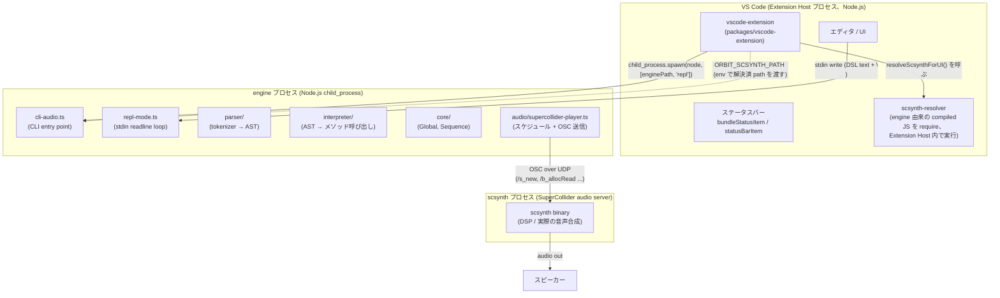
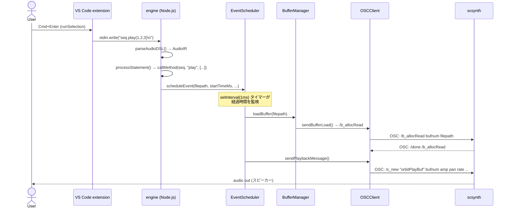

> **Note**: 本ページは 2026-05-05 時点での著者の reading の足跡です。code が真実、本ページはその時点の理解の snapshot に過ぎません。

# 0-2. アーキテクチャ全景

`.osc` ファイルに `seq.play(1, 2, 3)` と書いて `Cmd+Enter` を押すと、数秒後に音が出ます。その間に何が起きているのでしょう。それが本章の問いです。

答えはひとつのプロセスの中ではなく、**3 つのプロセスにまたがって** います。**VS Code extension** (UI 層)、**engine** (Node.js DSL ランタイム)、**scsynth** (SuperCollider オーディオサーバー) の 3 つです。それぞれが独立したプロセスとして動き、明確な境界で責務を分担しています。

## 3 層の全体像

まず、全体像から見ていきましょう。次の図は 3 つのプロセスとその間の通信方法を示したものです。



> **図の読み方**: `RESOLVER` は engine の compiled JS だが、 require する側 (Extension Host プロセス) で実行されるため Extension Host subgraph 内に置いている。engine プロセスとは独立して動く点が重要。engine プロセスへの「侵入」 ではなく、engine の build artifact (compiled JS) を読み込む code-level の依存。

### 各層の責務

3 つの層がそれぞれ何を担当しているかを表にまとめます。

| 層 | プロセス | 言語 | 責務 |
|---|---|---|---|
| **VS Code extension** | Extension Host (Node.js、Renderer から fork) | TypeScript | ユーザー入力の受付、engine の spawn / kill、scsynth パスの解決、ステータス表示 |
| **engine** | Node.js | TypeScript | DSL のパース、AST の解釈、イベントのスケジュール、OSC メッセージの生成 |
| **scsynth** | C++ ネイティブ | C++ | DSP 処理、バッファ読み込み、実際の音声出力 |

責務がきれいに分かれているのが分かります。**入力** は extension が受け、**意味** は engine が解釈し、**音** は scsynth が作る、という分業です。

## 各層の詳細

ここからは 1 層ずつ、もう少し近づいて見ていきましょう。

### VS Code extension 層

`packages/vscode-extension/src/extension.ts` が activation のエントリポイントです。`activate()` 関数が VS Code から呼ばれたとき、大きく次の 3 つのことをやっています。

1. **ステータスバーの登録**: `statusBarItem` (engine の状態) と `bundleStatusItem` (scsynth 解決状態) という 2 本のアイコンを用意し、常に表示する
2. **コマンドの登録**: `orbitscore.toggleEngine`、`orbitscore.runSelection`、`orbitscore.stopEngine` といったコマンドを VS Code に教える
3. **言語機能の登録**: CompletionProvider と HoverProvider を `orbitscore` 言語 ID に束縛する (補完とホバーが効くようになります)

engine の起動は `startEngine()` 関数が担います。ここで気をつけたいのは、**engine を spawn する前に必ず scsynth パスの解決を先行させる** という点です。

```typescript
// extension.ts:692-696
const scResolution = resolveScsynthForUI()
if (!scResolution) {
  void maybeShowBundleNotice()
  return
}
```

scsynth が見つからないなら、そもそも engine を起動しません。理由はシンプルで、engine 起動後に boot 失敗するよりも、起動前に止めたほうがエラー通知が 1 回で済むからです。

engine プロセス本体は `child_process.spawn` で Node.js を起動します。

```typescript
// extension.ts:739-743
engineProcess = child_process.spawn('node', [enginePath, ...args], {
  cwd: workspaceRoot,
  stdio: ['pipe', 'pipe', 'pipe'],
  env,
})
```

`stdio: ['pipe', 'pipe', 'pipe']` は何かと言うと、stdin / stdout / stderr の 3 本がすべてパイプとして親プロセス (extension) から触れる、という意味です。これによって DSL テキストを **stdin に書き込む** ことで engine に渡せます。

```typescript
// extension.ts:1107
engineProcess.stdin?.write(codeToSend + '\n')
```

これが「`Cmd+Enter` を押すと音が出る」フローの最初の一歩、つまり **DSL テキストを engine に届ける** という最初の動作になります。

### engine 層

engine のエントリポイントは `packages/engine/src/cli-audio.ts` です。`repl` というコマンドで起動すると `startREPLMode()` が呼ばれ、interpreter を作って boot するという 3 ステップが走ります。

```typescript
// cli/repl-mode.ts:27-38
export async function startREPLMode(options: REPLOptions = {}): Promise<void> {
  console.log('🎵 OrbitScore Audio Engine')
  console.log('✅ Initialized')

  // Create a global interpreter
  const globalInterpreter = new InterpreterV2()

  // Boot SuperCollider once at startup with optional audio device
  await globalInterpreter.boot(options.audioDevice)

  console.log('🎵 Live coding mode')
  await startREPL(globalInterpreter)
}
```

`boot()` の中では `SuperColliderPlayer.boot()` が呼ばれて、scsynth プロセスが起動します (この詳細は次の audio 層のところで見ます)。

REPL ループは readline で stdin を監視していて、受信した行を DSL テキストとして解釈します。実際の処理は 2 段階です。

1. **parse**: `parseAudioDSL(text)` がテキストを `AudioIR` (AST 相当の中間表現) に変換する
2. **execute**: `interpreter.execute(ir)` が IR を辿って必要なメソッドを呼び出す

`AudioIR` の型は `packages/engine/src/parser/types.ts` で定義されていて、3 つのフィールドを持ちます。

```typescript
// parser/types.ts:36-40
export type AudioIR = {
  globalInit?: GlobalInit
  sequenceInits: SequenceInit[]
  statements: Statement[]
}
```

`statements` 配列の各要素は `GlobalStatement`、`SequenceStatement`、`TransportStatement` のいずれかです。`processStatement()` がこれを type に応じて振り分け、対象オブジェクト (Global / Sequence) の対応するメソッドを `callMethod()` 経由で呼び出します。

```typescript
// interpreter/evaluate-method.ts:23-38
export async function callMethod(obj: any, methodName: string, args: any[]): Promise<any> {
  const method = obj[methodName]
  if (!method || typeof method !== 'function') {
    console.error(`Method not found: ${methodName} on ${obj.constructor.name}`)
    return obj
  }

  // Process arguments
  const processedArgs = await processArguments(methodName, args)

  // Call the method
  const result = await method.apply(obj, processedArgs)

  // Return the result (usually 'this' for chaining)
  return result || obj
}
```

たとえば `seq.play()` が呼ばれると、最終的に `EventScheduler.scheduleEvent()` が実行され、再生イベントがタイムスタンプ付きで内部キューに積まれます。

### audio / scsynth 層

`SuperColliderPlayer` は engine の中における audio 層の境界面です。中身は 4 つのクラスに分かれていて、それぞれ違う仕事をしています。

```
SuperColliderPlayer
├── OSCClient       ← supercolliderjs 経由で scsynth と通信する
├── BufferManager   ← 音声ファイルのバッファ管理 (bufnum ↔ filepath の対応)
├── EventScheduler  ← タイムライン管理と OSC 送信タイミング制御
└── SynthDefLoader  ← SynthDef (orbitPlayBuf 等) の読み込み
```

scsynth との通信は **OSC (Open Sound Control) over UDP** で行います。具体的なメッセージは `EventScheduler.sendPlaybackMessage()` が送出します。

```typescript
// audio/supercollider/event-scheduler.ts:317-335
await this.oscClient.sendMessage([
  '/s_new',
  'orbitPlayBuf',
  -1,
  0,
  0,
  'bufnum',
  bufnum,
  'amp',
  amplitude,
  'pan',
  pan,
  'rate',
  rate,
  'startPos',
  startPos,
  'duration',
  duration,
])
```

`/s_new` は SuperCollider Server Command Reference に定義された標準 OSC コマンドで、SynthDef `orbitPlayBuf` のインスタンスを生成して即時再生します。

`EventScheduler.start()` は 1ms 周期のタイマー (setInterval) を起動して、経過時間とイベントキューを突き合わせて再生タイミングをコントロールします。

```typescript
// audio/supercollider/event-scheduler.ts:155-177
this.intervalId = setInterval(() => {
  const now = Date.now() - this.startTime

  while (this.scheduledPlays.length > 0 && this.scheduledPlays[0].time <= now) {
    const play = this.scheduledPlays.shift()!

    // Skip if this sequence's events have been cleared
    // (sequenceEvents.has() returns false if clearSequenceEvents() was called)
    if (play.sequenceName && !this.sequenceEvents.has(play.sequenceName)) {
      console.log(
        `🔧 [skip cleared] ${play.sequenceName}: skipping event at ${play.time}ms (cleared)`,
      )
      continue
    }

    // Execute playback asynchronously but handle errors
    this.executePlayback(play.filepath, play.options, play.sequenceName, play.time).catch(
      (error) => {
        console.error(`❌ Playback error for ${play.sequenceName}:`, error)
      },
    )
  }
}, 1)
```

## scsynth は別プロセス

実装を読んでいて面白いのは、**scsynth が extension に bundle 同梱されている** という事実です。

```
packages/vscode-extension/
└── engine/           ← build 時に engine/dist/ をコピー
    ├── dist/         ← engine の compiled JS
    └── scsynth/      ← バンドルされた scsynth バイナリ
        └── Contents/Resources/scsynth
```

`scsynth-resolver.ts` はこのバンドルパスを最後の候補として試みます。ここでの設計が strict mode と呼ばれるものです。

```typescript
// audio/supercollider/scsynth-resolver.ts:91-98
return (
  tryCandidate(opts.explicit, 'explicit') ??
  tryCandidate(process.env[ENV_VAR], 'env') ??
  tryCandidate(bundleCandidatePath(), 'bundle') ??
  (() => { throw new ScsynthNotFoundError(searched) })()
)
```

優先順位は `explicit > env (ORBIT_SCSYNTH_PATH) > bundle` です。ここで意図的なのは、**SC.app や Spotlight への暗黙 fallback を持たない** という点です (Issue #136、PR #155 で確定した方針)。SC.app fallback があると bundle 抽出失敗を SC.app が肩代わりしてしまい、production の不具合を隠蔽するリスクがあるためです。

`OSCClient.boot()` が `supercolliderjs` ライブラリ経由で scsynth を起動すると、scsynth は **engine から見ると child process** として動きます。ただし通信は stdin/stdout ではなく OSC over UDP です (scsynth は default で UDP listener、TCP は `-t <port>` 起動オプション指定時のみ)。

```typescript
// audio/supercollider/osc-client.ts:46-48
// @ts-expect-error - supercolliderjs types are incomplete
this.server = await sc.server.boot(bootOptions)
```

`supercolliderjs` が scsynth のライフサイクル管理 (spawn / kill / `/status` 経由の alive 判定) を担い、engine はその上で OSC メッセージを送受信する、という形です。

## 「play() → 音」の data flow

ここまでの話を踏まえて、`seq.play(1, 2, 3)` を `Cmd+Enter` で評価したときの全体 flow を sequence diagram で見てみましょう。



この図で注目したいのは 2 点です。

1. **extension は DSL を解釈しません**: テキストをそのまま stdin に流すだけで、解釈は engine が担います
2. **engine は音を鳴らしません**: OSC メッセージを生成するだけで、音声 DSP は scsynth が担います

この責務分離があるおかげで、将来 engine を差し替えても scsynth 側は変わらず、scsynth を別バイナリに差し替えても engine 側の parser / interpreter は変わらない、という構造的な強さが生まれています。

## 後続章へのナビゲーション

本章は「全体像を把握する」ための浅い first pass でした。各層の詳細はこれから対応する章で扱っていきます。

| 関心領域 | 参照先 |
|---|---|
| DSL テキストがどう token 列に変換され、AST が組まれるか | [I-1. テキスト → AST](/pipeline/text-to-ast) |
| `seq.play()` が具体的にどう timing 計算されてキューに積まれるか | [II-3. event queue と look-ahead](/scheduling/event-queue) |
| `/s_new` から scsynth が音を出すまでの SC サーバーコマンド体系 | [III-1. SuperCollider との通信](/audio/supercollider) |
| extension の activation、IntelliSense、flash ビジュアルフィードバック | [IV-1. VS Code 拡張アーキテクチャ](/editor/vscode-architecture) |

## 関連用語

本章で扱う用語は [Glossary](/glossary) を参照。主要な用語:

- [scsynth](/glossary#scsynth) — SuperCollider のオーディオサーバーバイナリ
- [OSC (Open Sound Control)](/glossary#osc-open-sound-control) — engine と scsynth の通信プロトコル
- [SynthDef (SC)](/glossary#synthdef-sc) — orbitPlayBuf など音声処理定義
- [Extension Host](/glossary#extension-host) — VS Code 拡張が動く Node.js プロセス
- [orbitPlayBuf](/glossary#orbitplaybuf) — OrbitScore 専用 SynthDef の名前
- [strict mode (scsynth resolver)](/glossary#strict-mode-scsynth-resolver) — SC.app fallback を持たない fail-loud 設計
- [StatusBarItem](/glossary#statusbaritem) — engine 状態・scsynth 解決状態を表示するステータスバー

## 関連 ADR

- [ADR-001 SuperCollider ベース実装の選択](/decisions/adr-001-supercollider) — なぜ scsynth を audio バックエンドに選んだか
- [ADR-003 scsynth bundle strict mode](/decisions/adr-003-scsynth-bundle) — strict mode の意思決定と bundle 構成

## 次の深掘り候補

ここから先、もう一段深く読みたい話題は次のとおりです。それぞれ独立した issue として起票して別章で扱う想定です。

- **scsynth バンドル戦略**: なぜ SC.app fallback を持たないのか。strict mode の判断経緯 (Issue #136) を当時の議論ごと辿る
- **supercolliderjs の内部**: `sc.server.boot()` がどう scsynth を spawn しているのか。supercolliderjs のソース追跡
- **engine ↔ extension 間の型境界**: `resolveScsynthForUI()` が engine の compiled JS を `require()` する構造。build artifact 依存をどう管理しているか、type 境界 (engine 側 export と extension 側 import) はどう揃えているか
- **setInterval(1ms) の精度**: Node.js の `setInterval` は 1ms を保証しません。実際の drift 特性と timing 精度への影響
- **OSC メッセージのバッファリング**: `sendMessage` は毎回 UDP を送出しているのか、それとも `supercolliderjs` 内部でバッファリングしているのか
- **SynthDef `orbitPlayBuf` の実体**: engine から `/s_new` で呼ばれている SynthDef の定義はどこにあって、scsynth にどうロードされているのか

## Sources

- `packages/vscode-extension/src/extension.ts:19-97` — `activate()` の全体構造、ステータスバー 2 本の登録
- `packages/vscode-extension/src/extension.ts:113-129` — `resolveScsynthForUI()`: engine の compiled JS を runtime require する境界
- `packages/vscode-extension/src/extension.ts:681-759` — `startEngine()`: pre-check → spawn → stdin/stdout pipe 設定
- `packages/vscode-extension/src/extension.ts:735-736` — `ORBIT_SCSYNTH_PATH` env 経由で解決済みパスを engine に渡す
- `packages/vscode-extension/src/extension.ts:1085-1108` — `runSelection()`: `stdin.write(codeToSend + '\n')` による DSL 送信
- `packages/vscode-extension/package.json:36-38` — `activationEvents: ["onStartupFinished", "onLanguage:orbitscore"]`
- `packages/engine/src/cli-audio.ts:1-39` — CLI entry point、`InterpreterV2` の生成と `executeCommand()` の呼び出し
- `packages/engine/src/cli/repl-mode.ts:27-38` — `startREPLMode()`: interpreter 生成 → boot → REPL 開始の 3 ステップ
- `packages/engine/src/cli/repl-mode.ts:50-108` — `startREPL()`: readline stdin 監視と buffer 蓄積ロジック
- `packages/engine/src/cli/execute-command.ts:50-60` — `executeCommand()`: play / repl / eval / test のコマンドルーティング
- `packages/engine/src/interpreter/interpreter-v2.ts:22-47` — `InterpreterV2` constructor: `SuperColliderPlayer` の生成と state 初期化
- `packages/engine/src/interpreter/interpreter-v2.ts:62-90` — `execute()`: globalInit → sequenceInits → statements の順序処理
- `packages/engine/src/interpreter/process-statement.ts:32-56` — `processStatement()`: Statement type に応じた dispatch
- `packages/engine/src/interpreter/evaluate-method.ts:23-38` — `callMethod()`: obj のメソッドを apply で呼び出す
- `packages/engine/src/parser/types.ts:36-60` — `AudioIR`、`GlobalInit`、`SequenceInit`、`Statement` の型定義
- `packages/engine/src/audio/supercollider-player.ts:16-50` — `SuperColliderPlayer` constructor と `boot()`: 4 依存クラスの組み立てと scsynth 解決
- `packages/engine/src/audio/supercollider/event-scheduler.ts:143-177` — `start()`: setInterval 1ms タイマーによるイベントディスパッチ
- `packages/engine/src/audio/supercollider/event-scheduler.ts:240-273` — `executePlayback()`: drift チェック → bufferManager.loadBuffer → sendPlaybackMessage
- `packages/engine/src/audio/supercollider/event-scheduler.ts:307-335` — `sendPlaybackMessage()`: `/s_new orbitPlayBuf` OSC メッセージの実体
- `packages/engine/src/audio/supercollider/osc-client.ts:21-49` — `OSCClient.boot()`: `sc.server.boot(bootOptions)` による scsynth 起動
- `packages/engine/src/audio/supercollider/osc-client.ts:55-60` — `sendMessage()`: `this.server.send.msg(message)` による OSC 送信
- `packages/engine/src/audio/supercollider/scsynth-resolver.ts:22-99` — `ScsynthResolution` 型、`ScsynthNotFoundError`、`resolveScsynthPath()` の strict mode 実装
- `packages/engine/src/audio/supercollider/scsynth-resolver.ts:57-59` — `bundleCandidatePath()`: `__dirname` 相対でバンドルパスを計算
- `packages/engine/package.json:1-31` — `@orbitscore/engine` の依存: `supercolliderjs`, `ws`, `wavefile`, `uuid`
- PR [#155](https://github.com/signalcompose/orbitscore/pull/155) — scsynth strict mode 採用の経緯 (SC.app / Spotlight fallback の廃止)
- Issue [#136](https://github.com/signalcompose/orbitscore/issues/136) — "SC 不要で動く" 要件と strict mode 方針の策定
- [SuperCollider Server Command Reference](https://doc.sccode.org/Reference/Server-Command-Reference.html) — `/s_new`、`/b_allocRead`、`/done` の仕様
