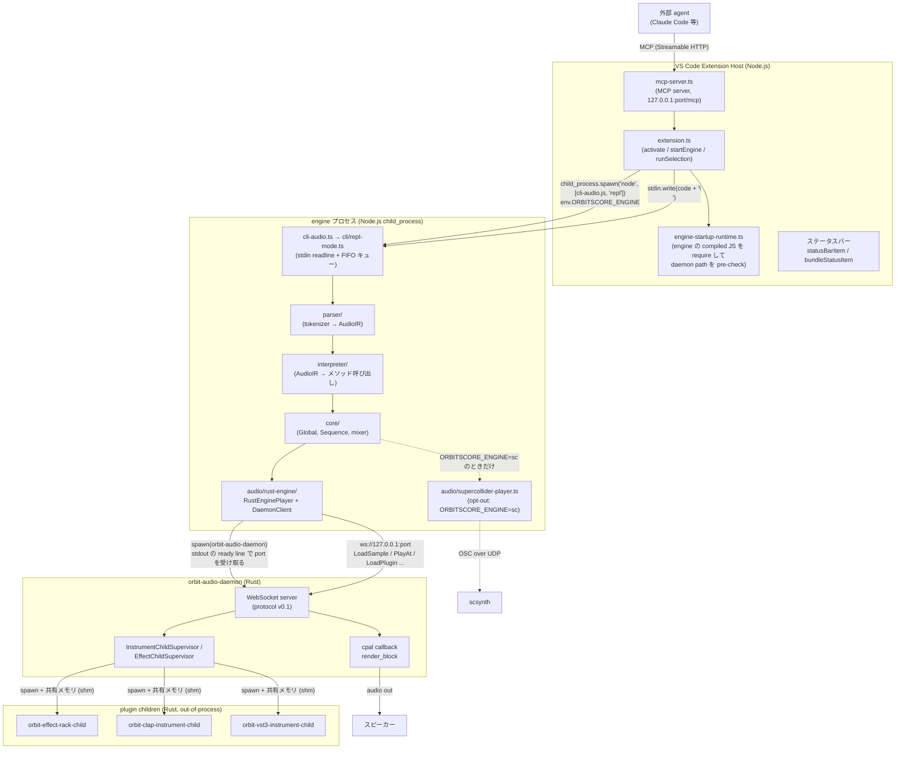
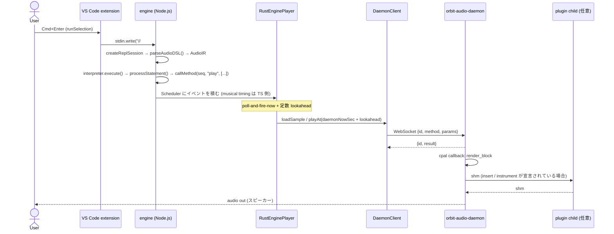

> **Note**: 本ページは 2026-09-01 時点での著者の reading の足跡です。code が真実、本ページはその時点の理解の snapshot に過ぎません。

# 0-2. アーキテクチャ全景

`.orbs` ファイルに `seq.play(1, 2, 3)` と書いて `Cmd+Enter` を押すと、少しあとに音が出ます。その間に何が起きているのでしょう。それが本章の問いです。

答えはひとつのプロセスの中には収まりません。**VS Code の Extension Host**、**engine** (Node.js の DSL ランタイム)、**orbit-audio-daemon** (Rust のオーディオデーモン)、そして daemon がさらに起動する **plugin child** (out-of-process のプラグインホスト) という、少なくとも 4 種類のプロセスにまたがっています。SuperCollider (scsynth) はこの絵の中からは外れていて、`ORBITSCORE_ENGINE=sc` で明示的に選んだときだけ登場する opt-out 経路になっています。

## 2026-05 版からの drift

本章の 2026-05-05 版は「extension / engine / scsynth の 3 プロセス」という絵で書かれていました。2026-07-03 の cutover #108 (WORK_LOG 6.179) で既定の音声バックエンドが Rust daemon に切り替わり、その絵は既定経路としては成り立たなくなっています。以下は 2026-09-01 時点のコードに合わせて全面的に書き直したものです。SC 経路そのものは `packages/engine/src/audio/supercollider/` に残っているので、Part III の SuperCollider 章は「opt-out 経路の歴史的読解」として読んでください。

ちなみに、コードのコメントは同じ cutover を `#108` と `#369` の両方の番号で参照しています (`engine-backend.ts` は `#108`、`extension.ts` や `copy-daemon-bin.sh` は `#369`)。

> NOTE: unverified — needs confirmation: #108 が Issue、#369 が PR という対応関係は WORK_LOG 6.179 の見出し (`cutover #108`) から推測したもので、#369 側は一次情報で未確認です。

## 4 層の全体像

まず、全体像から見ていきましょう。次の図はプロセスの境界と、境界をまたぐ通信手段を示したものです。


```mermaid
graph TD
  subgraph "VS Code Extension Host (Node.js)"
    EXT["extension.ts\n(activate / startEngine / runSelection)"]
    MCP["mcp-server.ts\n(MCP server, 127.0.0.1:port/mcp)"]
    RESOLVER["engine-startup-runtime.ts\n(engine の compiled JS を require して\ndaemon path を pre-check)"]
    STATUS["ステータスバー\nstatusBarItem / bundleStatusItem"]
  end

  subgraph "engine プロセス (Node.js child_process)"
    CLI["cli-audio.ts → cli/repl-mode.ts\n(stdin readline + FIFO キュー)"]
    PARSER["parser/\n(tokenizer → AudioIR)"]
    INTERP["interpreter/\n(AudioIR → メソッド呼び出し)"]
    CORE["core/\n(Global, Sequence, mixer)"]
    PLAYER["audio/rust-engine/\nRustEnginePlayer + DaemonClient"]
    SC["audio/supercollider-player.ts\n(opt-out: ORBITSCORE_ENGINE=sc)"]
  end

  subgraph "orbit-audio-daemon (Rust)"
    WS["WebSocket server\n(protocol v0.1)"]
    RENDER["cpal callback\nrender_block"]
    SUP["InstrumentChildSupervisor /\nEffectChildSupervisor"]
  end

  subgraph "plugin children (Rust, out-of-process)"
    CHILD1["orbit-effect-rack-child"]
    CHILD2["orbit-clap-instrument-child"]
    CHILD3["orbit-vst3-instrument-child"]
  end

  AGENT["外部 agent\n(Claude Code 等)"] -->|"MCP (Streamable HTTP)"| MCP
  MCP --> EXT
  EXT -->|"child_process.spawn('node', [cli-audio.js, 'repl'])\nenv.ORBITSCORE_ENGINE"| CLI
  EXT -->|"stdin.write(code + '\\n')"| CLI
  EXT --> RESOLVER
  CLI --> PARSER --> INTERP --> CORE --> PLAYER
  CORE -.->|"ORBITSCORE_ENGINE=sc のときだけ"| SC
  PLAYER -->|"spawn(orbit-audio-daemon)\nstdout の ready line で port を受け取る"| WS
  PLAYER -->|"ws://127.0.0.1:port\nLoadSample / PlayAt / LoadPlugin ..."| WS
  WS --> RENDER
  WS --> SUP
  SUP -->|"spawn + 共有メモリ (shm)"| CHILD1
  SUP -->|"spawn + 共有メモリ (shm)"| CHILD2
  SUP -->|"spawn + 共有メモリ (shm)"| CHILD3
  RENDER -->|"audio out"| DAC["スピーカー"]
  SC -.->|"OSC over UDP"| SCSYNTH["scsynth"]
```

> **図の読み方**: `RESOLVER` は engine の build artifact (compiled JS) を Extension Host 側が `require()` して実行するものなので、engine プロセスではなく Extension Host の subgraph に置いています。engine プロセスの中に「侵入」するのではなく、同じ resolver 関数を両側で走らせて結果を一致させる、という code-level の依存です。

### 各層の責務

| 層 | プロセス | 言語 | 責務 |
|---|---|---|---|
| **VS Code extension** | Extension Host (Node.js) | TypeScript | ユーザー入力の受付、engine の spawn / kill、daemon バイナリの pre-check、ステータス表示、MCP サーバーのホスト |
| **engine** | Node.js (`cli-audio.js repl`) | TypeScript | DSL のパース、AudioIR の解釈、musical timing の計算 (スケジューラ)、daemon へのコマンド送信 |
| **orbit-audio-daemon** | ネイティブ (Rust) | Rust | WebSocket でコマンドを受け、cpal の realtime callback で音をレンダリング、plugin child の監督 |
| **plugin child** | ネイティブ (Rust、daemon の子) | Rust | CLAP / VST3 プラグインの実体を隔離プロセスでホスト。共有メモリで daemon と音声をやり取り |
| (opt-out) **scsynth** | ネイティブ (C++) | C++ | `ORBITSCORE_ENGINE=sc` のときだけ daemon の代わりに DSP を担う |

**入力** は extension が受け、**意味** は engine が解釈し、**音** は daemon が作り、**信頼できないコード (3rd-party plugin)** は child に隔離する、という分業です。

## VS Code extension 層

`packages/vscode-extension/src/extension.ts` の `activate()` がエントリポイントです (2026-09-01 時点で 4,000 行を超える大きなファイルなので、本章では境界に関わる部分だけを拾います)。`activate()` は次のことをやっています。

1. **Output channel と log ring の設定**: `outputChannel.appendLine` を差し替えて、MCP の `get_log` ツールが読めるリングバッファに流し込む
2. **ステータスバーの登録**: `statusBarItem` (engine の状態) と `bundleStatusItem` (バックエンドバイナリの解決状態) の 2 本
3. **コマンドの登録**: `orbitscore.toggleEngine`、`orbitscore.runSelection`、`orbitscore.stopEngine`、`orbitscore.registerMcpServer` など
4. **言語機能の登録**: 補完・ホバー・診断 (DiagnosticCollection)
5. **MCP サーバーの起動 (任意)**: `ORBITSCORE_MCP_PORT` env または `orbitscore.mcpServer.port` 設定が非ゼロのときだけ

### engine の起動: pre-check → env → spawn

engine の起動は `startEngine()` が担います。最初にやるのは「どのバックエンドを使うか」の決定で、`orbitscore.engine` 設定を engine 側の `resolveEngineKind` (compiled JS を runtime require) で正規化します。

```typescript
// packages/vscode-extension/src/extension.ts:2053-2056
  // engine kind (#377): scsynth is only relevant under the 'sc' kind. Under
  // 'rust' (default since cutover #369), skip the scsynth pre-check entirely —
  // the native daemon doesn't need scsynth to be resolvable.
  const engineKind = getConfiguredEngineKind()
```

ここで気をつけたいのは、**engine を spawn する前にバックエンドのバイナリ解決を先行させる** という点です。既定の `rust` kind では daemon バイナリを pre-check します。

```typescript
// packages/vscode-extension/src/extension.ts:2078-2087
    const daemonResolution = resolveDaemonForUI()
    if (!daemonResolution) {
      outputChannel?.appendLine(
        '❌ orbit-audio-daemon not found — engine cannot start with the rust backend.',
      )
      vscode.window.showErrorMessage(
        '⚠️ orbit-audio-daemon not found. Reinstall the extension, build it via `cd rust && cargo build --release`, or set ORBIT_AUDIO_DAEMON_PATH to a custom binary.',
      )
      return false
    }
```

daemon が見つからないなら、そもそも engine を起動しません。理由はコメントにあるとおりで、engine を起動してから内部で daemon spawn に失敗すると「Engine started」の成功トーストが先に出てから失敗ログが追いかけてくる偽成功 UX になるからです。

`resolveDaemonForUI()` の実体は `engine-startup-runtime.ts` にあり、engine の compiled JS から `resolveDaemonBinaryPath` を借りてきます。

```typescript
// packages/vscode-extension/src/engine-startup-runtime.ts:14-20
export function resolveDaemonBinaryForExtension(): EngineBinaryResolution {
  // eslint-disable-next-line @typescript-eslint/no-require-imports, @typescript-eslint/no-var-requires
  const daemonModule = require('../engine/dist/audio/rust-engine/daemon-client') as {
    resolveDaemonBinaryPath: (explicitPath?: string) => EngineBinaryResolution
  }
  return daemonModule.resolveDaemonBinaryPath()
}
```

面白いのは、解決した path を env で engine に渡さないことです。spawn される engine CLI 自身が同じ `resolveDaemonBinaryPath()` を実行するので結果は決定的に一致し、再注入する理由がない、とコメントに明記されています (extension.ts:2075-2077)。

バックエンドの種別は `ORBITSCORE_ENGINE` env で **必ず明示的に** engine に伝えます。

```typescript
// packages/vscode-extension/src/extension.ts:2142-2155
  if (engineKind === 'rust') {
    env.ORBITSCORE_ENGINE = 'rust'
    outputChannel?.appendLine('🦀 Audio backend: rust (orbit-audio-daemon, native, default)')
  } else {
    env.ORBITSCORE_ENGINE = 'sc'

    // Pass scsynth path to engine via env. pre-check で解決済 (scResolution.path) を
    // そのまま engine に渡すことで resolver の二重 fs.statSync を avoid + pre-check と
    // engine 内部での resolution 結果ズレ (タイミング差) のリスクを排除。
    // scResolution is guaranteed non-null here: the 'sc' branch above returns
    // early when resolution fails.
    env.ORBIT_SCSYNTH_PATH = scResolution!.path
    outputChannel?.appendLine(`🔧 scsynth (${scResolution!.source}): ${scResolution!.path}`)
  }
```

そして engine プロセス本体は `child_process.spawn` で Node.js を起動します。

```typescript
// packages/vscode-extension/src/extension.ts:2157-2163
  // Spawn engine process
  try {
    engineProcess = child_process.spawn('node', [enginePath, ...args], {
      cwd: workspaceRoot,
      stdio: ['pipe', 'pipe', 'pipe'],
      env,
    })
```

`stdio: ['pipe', 'pipe', 'pipe']` は、stdin / stdout / stderr の 3 本すべてを親プロセス (extension) から触れるパイプにする、という意味です。DSL テキストは **stdin に書き込む** ことで engine に渡します。

```typescript
// packages/vscode-extension/src/extension.ts:3030-3031
  engineProcess.stdin.write(codeToSend + '\n')
  return true
```

これが「`Cmd+Enter` を押すと音が出る」フローの最初の一歩、つまり **DSL テキストを engine に届ける** 動作です。書き込みの前に `//#documentDirectory` メタ行と `global.setDocumentDirectory(...)` を注入する仕組みは [I-3. selective execution](/pipeline/selective-execution) で扱います。

### MCP サーバー: extension が agent の入口になる

2026-07-07 の #388 (WORK_LOG 6.188-6.192) から、extension は MCP (Model Context Protocol) サーバーを Extension Host の中でホストするようになりました。外部の agent (Claude Code 等) が `evaluate_orbitscore` / `start_engine` / `get_log` といったツールで、エディタのユーザーと同じ動線を通って OrbitScore を操作できます。

```typescript
// packages/vscode-extension/src/mcp-server.ts:9-18
/**
 * OrbitScore MCP control server — the "Agent Bridge" of WCTM_SYSTEM_SPEC §3.
 *
 * Hosts an MCP server (Streamable HTTP) inside the extension host so an external
 * agent (e.g. Claude Code via `.mcp.json`) can drive OrbitScore operations for
 * E2E testing. The same tool surface is intended for reuse by the WCTM
 * performance runtime (pi harness — spec §4.2 "Bridge は harness-neutral").
 *
 * Only started when `orbitscore.mcpServer.port` is a nonzero port (see
 * extension.ts activate()). Binds 127.0.0.1 only.
```

起動条件は `activate()` の中にあります。env が設定より優先されるのは、Extension Development Host を CLI から立ち上げるときに設定ファイルを触らずに済ませるためです。

```typescript
// packages/vscode-extension/src/extension.ts:451-456
  const envMcpPort = Number(process.env.ORBITSCORE_MCP_PORT)
  const mcpPort =
    Number.isInteger(envMcpPort) && envMcpPort > 0
      ? envMcpPort
      : vscode.workspace.getConfiguration('orbitscore').get<number>('mcpServer.port', 0)
  if (mcpPort && mcpPort > 0) {
```

サーバーは loopback にしか bind しません。

```typescript
// packages/vscode-extension/src/mcp-server.ts:1343-1347
  await new Promise<void>((resolve, reject) => {
    httpServer.once('error', reject)
    httpServer.listen(port, '127.0.0.1', () => resolve())
  })
  log(`OrbitScore MCP server listening on http://127.0.0.1:${port}/mcp`)
```

MCP ツールの `evaluate_orbitscore` は、エディタの `runSelection()` と同じ `writeCodeToEngine()` を通って engine の stdin に書きます (extension.ts:3040-3047)。つまり **agent 用の裏口は存在せず**、ユーザーと同じ配線を通ります。これは CLAUDE.md が E2E の前提として強調している点でもあります。

## engine 層

engine のエントリポイントは `packages/engine/src/cli-audio.ts` で、`repl` サブコマンドを受けると `startREPLMode()` が呼ばれます。

```typescript
// packages/engine/src/cli/repl-mode.ts:30-53
export async function startREPLMode(options: REPLOptions = {}): Promise<void> {
  console.log('🎵 OrbitScore Audio Engine')
  console.log('✅ Initialized')

  // Create a global interpreter
  const globalInterpreter = new InterpreterV2()
  // 🔴 #607: startREPLMode() は返らないので、戻り値経由では shutdown ハンドラに
  // 届かない。生成した時点で publish する（詳細は active-interpreter.ts）。
  setActiveInterpreter(globalInterpreter)

  // §L1 (#229): session-log は 2.0.0 では dormant（既定 off）。file-scoped ログが
  // 複数ファイルをまたぐライブセッションに合わない設計ミスマッチのため、session-scoped で
  // 再設計するまで明示 opt-in に退避（writer/API/ユニットは保持・resurrect 可）。
  // 詳細・redesign 北極星: docs/development/POST_2.0_ROADMAP_NOTES.md
  if (shouldEnableSessionLog()) {
    globalInterpreter.enableSessionLog({ cwd: process.cwd() })
  }

  // Boot the audio engine backend once at startup with optional audio device
  await globalInterpreter.boot(options.audioDevice)

  console.log('🎵 Live coding mode')
  await startREPL(globalInterpreter)
}
```

`InterpreterV2` を 1 つ作り、`boot()` して、REPL に入る。この 3 ステップは 2026-05 版と変わっていません。変わったのは `boot()` の先です。`InterpreterV2` のコンストラクターは音声バックエンドを `createAudioEngine()` に選ばせます。

```typescript
// packages/engine/src/interpreter/interpreter-v2.ts:48-64
  constructor(opts?: { audioEngine?: AudioEngineBackend }) {
    this.state = {
      audioEngine: opts?.audioEngine ?? createAudioEngine(),
      globals: new Map(),
      sequences: new Map(),
      mixers: createMixerRuntimeRegistry(),
      currentGlobal: undefined,
      isBooted: false,
      // Initialize unidirectional toggle groups
      runGroup: new Set(),
      loopGroup: new Set(),
      muteGroup: new Set(),
      // §L1: the rolling-buffer origin (§3 wall). The writer itself stays absent
      // until enableSessionLog() — so logging is inert in unit-test paths.
      engineT0: Date.now(),
    }
  }
```

### バックエンドの選択: `createAudioEngine()`

`createAudioEngine()` は env を見て `RustEnginePlayer` か `SuperColliderPlayer` を返します。既定は Rust です。

```typescript
// packages/engine/src/audio/create-audio-engine.ts:17-36
export function createAudioEngine(env: NodeJS.ProcessEnv = process.env): AudioEngineBackend {
  const raw = env[ENGINE_ENV_VAR]
  if (resolveEngineKind(raw) === 'supercollider') {
    console.log(`🎛️ [engine] using SuperCollider backend (opt-out via ORBITSCORE_ENGINE=${raw})`)
    return new SuperColliderPlayer()
  }
  // 既定は Rust。ただし raw が「未設定/空」でも 'rust' でもない未認識値のときは、
  // SC のつもりの typo（例: ORBITSCORE_ENGINE=scc）が黙って Rust 起動に落ちるのを
  // warn で observable にする（未設定と誤入力を区別する）。
  const normalized = raw?.trim().toLowerCase() ?? ''
  if (normalized !== '' && normalized !== 'rust') {
    console.warn(
      `⚠️  [engine] ORBITSCORE_ENGINE=${JSON.stringify(raw)} は未認識 — ` +
        `'rust' / 'sc' / 'supercollider' を想定。既定の Rust にフォールバック`,
    )
  }
  const source = normalized === '' ? 'default since cutover #108' : `ORBITSCORE_ENGINE=${raw}`
  console.log(`🦀 [engine] using rust orbit-audio-daemon backend (${source})`)
  return new RustEnginePlayer()
}
```

`resolveEngineKind()` は 2 値しか返さず、`sc` / `supercollider` 以外はすべて `rust` に倒します。

```typescript
// packages/engine/src/audio/engine-backend.ts:65-68
export function resolveEngineKind(raw: string | undefined): EngineKind {
  const v = raw?.trim().toLowerCase()
  return v === 'sc' || v === 'supercollider' ? 'supercollider' : 'rust'
}
```

両バックエンドが満たす契約が `AudioEngineBackend` インターフェースで、`Scheduler` (musical timing) に `boot` / `quit` / デバイス操作 / plugin 操作を足したものです (engine-backend.ts:26-50)。interpreter と `Global` はこの契約面だけを見るので、**DSL の意味論はバックエンドの差し替えに影響されない** という構造になっています。

### parse → execute

REPL が受け取ったテキストの処理は 2 段階です。

1. **parse**: `parseAudioDSL(text)` がテキストを `AudioIR` に変換する
2. **execute**: `interpreter.execute(ir, options)` が IR を辿って必要なメソッドを呼び出す

`AudioIR` の型は `packages/engine/src/parser/types.ts` にあり、2026-07-17 の #456 で `fileImports` が加わっています。

```typescript
// packages/engine/src/parser/types.ts:49-59
export type AudioIR = {
  globalInit?: GlobalInit
  sequenceInits: SequenceInit[]
  statements: Statement[]
  /**
   * ファイル import（IM.1-IM.2, #456）。評価順序の規範（imports が entry 自身の宣言より
   * 先・ソース記載順）を守るため statements とは別バケットで保持し、interpreter が
   * globalInit より前に処理する。ファイル先頭領域のみ（AudioParser.parse が検査）。
   */
  fileImports?: FileImportStatement[]
}
```

`statements` の各要素は `processStatement()` が type に応じて振り分け、対象オブジェクト (Global / Sequence / mixer node) のメソッドを最終的に `callMethod()` 経由で呼び出します。

```typescript
// packages/engine/src/interpreter/evaluate-method.ts:23-35
export async function callMethod(obj: any, methodName: string, args: any[]): Promise<any> {
  const processedArgs = await processArguments(methodName, args)
  const method = obj[methodName]
  if (!method || typeof method !== 'function') {
    throw new Error(`Method not found: ${methodName} on ${obj?.constructor?.name ?? 'receiver'}`)
  }

  // Call the method
  const result = await method.apply(obj, processedArgs)

  // Return the result (usually 'this' for chaining)
  return result || obj
}
```

たとえば `seq.play()` が呼ばれると、最終的に `RustEnginePlayer` の内部スケジューラに再生イベントがタイムスタンプ付きで積まれます。パースと評価の詳細は [I-1](/pipeline/text-to-ast) と [I-2](/pipeline/evaluation) で扱います。

## orbit-audio-daemon 層

`RustEnginePlayer` が engine 側の境界面です。`boot()` は `DaemonClient.start()` を呼び、そのあとで transport clock の anchor を確立します。

```typescript
// packages/engine/src/audio/rust-engine/rust-engine-player.ts:548-555
  async boot(outputDevice?: string): Promise<void> {
    await this.daemon.start({
      daemonPath: this.daemonPath,
      wsUrlOverride: this.wsUrlOverride,
      audioDevice: outputDevice,
    })
    await this.establishSession()
  }
```

`DaemonClient.start()` は「spawn → stdout の ready line を読む → WebSocket 接続 → handshake 受信」の順に進みます。

```typescript
// packages/engine/src/audio/rust-engine/daemon-client.ts:294-332 (handshake の timeout 設定を省略)
  private async doStart(options: DaemonClientOptions): Promise<void> {
    // 新しい起動サイクルでは crash 検出を再 arm する（前回 quit の意図的 close を引きずらない）。
    this.intentionalClose = false
    const startupTimeoutMs = options.startupTimeoutMs ?? DEFAULT_STARTUP_TIMEOUT_MS
    const connectTimeoutMs = options.connectTimeoutMs ?? DEFAULT_CONNECT_TIMEOUT_MS
    const handshakeTimeoutMs = options.handshakeTimeoutMs ?? DEFAULT_HANDSHAKE_TIMEOUT_MS

    // spawn/connect/handshake のいずれかが throw した場合、this.child / this.ws が
    // dangling になるのを防ぐため try/catch で包み、失敗時は明示的に cleanup する。
    // quit() は this.running===false なら no-op なので手動回収が必要。
    try {
      const wsUrl =
        options.wsUrlOverride ??
        (await this.spawnDaemon(options.daemonPath, startupTimeoutMs, options.audioDevice))
      // ...
      await this.connectWebSocket(wsUrl, connectTimeoutMs)
      await handshakePromise
      this.running = true
```

daemon は engine から見ると **child process** です。ただし通信は stdin/stdout ではなく WebSocket で、stdout は起動時の ready line (port 番号を含む 1 行 JSON) を受け取るためだけに使います。

```typescript
// packages/engine/src/audio/rust-engine/daemon-client.ts:869-879
  private async spawnDaemon(
    explicitPath: string | undefined,
    timeoutMs: number,
    audioDevice: string | undefined,
  ): Promise<string> {
    const binary = this.resolveDaemonBinary(explicitPath)
    // `--audio-device <name>` は daemon 起動時のみ honor される（#484 D1・ランタイム切替は D2）。
    // 名前が不一致でも daemon は起動を落とさず stderr に警告して host 既定へ縮退する。
    const args = audioDevice ? ['--audio-device', audioDevice] : []
    const child = spawn(binary, args, { stdio: ['ignore', 'pipe', 'pipe'] })
    this.child = child
```

```typescript
// packages/engine/src/audio/rust-engine/daemon-client.ts:943-957
      // 現行 daemon は stdout の先頭行に ready JSON のみを書き、log は stderr に
      // 分離している (docs/research/ENGINE_DAEMON_PROTOCOL.md)。しかし将来の daemon
      // 実装で log banner 等が stdout に混入しても壊れないよう、JSON parse できる
      // 行が出るまで読み続ける防御的実装にする。
      const skippedLines: string[] = []
      reader.on('line', (line) => {
        if (settled) return
        let parsed: StartupReadyLine | StartupErrorLine
        try {
          parsed = JSON.parse(line) as StartupReadyLine | StartupErrorLine
        } catch {
          // JSON として読めない行は log とみなしてスキップし次の行を待つ。
          skippedLines.push(line)
          return
        }
```

daemon 側でこの ready line を書くコード (`main.rs` の `run()`) と、`{id, method, params}` 形式の wire protocol は [RE-1. daemon アーキテクチャ概観](/rust-engine/) が扱っているので、ここでは繰り返しません。

### daemon バイナリの解決

daemon バイナリの探索順は `resolveDaemonBinaryPath()` にあり、explicit → env (`ORBIT_AUDIO_DAEMON_PATH`) → monorepo release → monorepo debug → extension bundle の順です。

```typescript
// packages/engine/src/audio/rust-engine/daemon-client.ts:221-257 (monorepo 候補と bundle の説明コメントを省略)
export function resolveDaemonBinaryPath(explicitPath?: string): DaemonBinaryResolution {
  const searched: string[] = []
  const candidates: DaemonBinaryResolution[] = []
  if (explicitPath) candidates.push({ path: explicitPath, source: 'explicit' })
  const envPath = process.env.ORBIT_AUDIO_DAEMON_PATH
  if (envPath) candidates.push({ path: envPath, source: 'env' })
  // ...
  const platform = `${process.platform}-${process.arch}`
  candidates.push({
    path: path.join(__dirname, '../../../bin', platform, 'orbit-audio-daemon'),
    source: 'extension-bundle',
  })

  for (const c of candidates) {
    searched.push(c.path)
    if (isExecutableFile(c.path)) return c
  }
  throw new DaemonNotFoundError(searched)
}
```

scsynth resolver と同じく、候補が尽きたら例外を投げる **fail-loud** の作りです。候補は「存在する」だけでは足りず、実行ビットの立った通常ファイルであることを要求します (`.vsix` 展開でパーミッションが落ちた bundle を pre-check 段階で弾くため、daemon-client.ts:102-107)。

最後の候補 `extension-bundle` が指す `<extension>/engine/bin/<platform>/` に daemon を置くのが `scripts/copy-daemon-bin.sh` で、`npm run build` の `build:copy-engine` から呼ばれます。

```bash
# scripts/copy-daemon-bin.sh:121-132
copy_binary "orbit-audio-daemon"
# #628: rack effect child。daemon は `outproc_effect.rs` で自分の隣の
# `orbit-effect-rack-child` を探す。**これが無いと effect 宣言そのものが起動に失敗する。**
copy_binary "orbit-effect-rack-child"
copy_binary "orbit-clap-effect-child"
copy_binary "orbit-clap-instrument-child"
copy_binary "orbit-vst3-effect-child"
copy_binary "orbit-vst3-instrument-child"
copy_binary "orbit-plugin-scan"

# 標準プラグイン（SC.10.8）。`Gain` が初号で、以後ここへ足していく。
copy_std_plugin_bundle "Gain.clap"
```

daemon 本体だけでなく、後述の plugin child と標準プラグイン `Gain.clap` も同じディレクトリに並べて同梱されます。2026-09-01 時点で対象は darwin-arm64 のみです (copy-daemon-bin.sh:11-17)。

## plugin child 層

daemon はプラグイン (CLAP / VST3) の実体を自分のプロセスに載せません。effect と instrument はそれぞれ別のバイナリを **out-of-process (OOP)** の子プロセスとして spawn し、共有メモリで音声をやり取りします。spawn され得る child の一覧は daemon crate の定数として 1 箇所に明示されています。

```rust
// rust/crates/orbit-audio-daemon/src/lib.rs:84-93
pub const SPAWNABLE_CHILD_BINARIES: &[&str] = &[
    // effect: #628 以降は rack child 1 本がチェーン全体を持つ（format で分岐しない）。
    "orbit-effect-rack-child",
    // effect（退役予定・#628 で到達不能になったが、退役 PR まで配布は続ける）。
    "orbit-clap-effect-child",
    "orbit-vst3-effect-child",
    // instrument: format ごとに child が分かれる（1 instrument = 1 child）。
    "orbit-clap-instrument-child",
    "orbit-vst3-instrument-child",
];
```

child バイナリは daemon 実行ファイルの **隣** から探します。インストールレイアウトの知識を daemon や TS に持たせず、「並べて置く」だけで配線が成立するようにしてあります。

```rust
// rust/crates/orbit-audio-daemon/src/outproc_effect.rs:450-458
/// daemon 実行ファイルと同一ディレクトリの format 対応 child を既定パスとする
/// （spike の sibling-of-exe を踏襲・設計 §4.5）。インストール時は daemon と child が並んで置かれる前提。
fn default_rack_child_exe() -> Result<PathBuf, String> {
    let exe = std::env::current_exe().map_err(|e| format!("current_exe: {e}"))?;
    let dir = exe
        .parent()
        .ok_or_else(|| "current_exe has no parent directory".to_string())?;
    Ok(dir.join("orbit-effect-rack-child"))
}
```

なぜ隔離するのかというと、3rd-party plugin は信頼できないコードなので、crash しても daemon (音の心臓部) を道連れにしないためです。shm transport の構造、READY handshake、watchdog / respawn、親プロセスの死活監視 (`ParentWatch`) は [RE-2. OOP children と shm transport](/rust-engine/oop-children) が、DSL 面 (`seq.effect()` / `seq.instrument()`) は [PH-1. Plugin Hosting 概観](/plugin-hosting/) と [RE-3. per-sequence insert bus](/rust-engine/insert-bus) が扱います。

## SuperCollider は opt-out 経路

`ORBITSCORE_ENGINE=sc` を指定すると、`createAudioEngine()` が `SuperColliderPlayer` を返し、extension も `ORBIT_SCSYNTH_PATH` を env で渡す `sc` 分岐に入ります (前掲の extension.ts:2142-2155)。scsynth の解決 (`scsynth-resolver.ts` の strict mode)、OSC over UDP、`orbitPlayBuf` SynthDef といった仕組みはコードとして残っていて、[III-1](/audio/supercollider)、[III-2](/audio/audio-file-playback)、[III-3](/audio/scsynth-bundle) の各章がそれを読んでいます。ただし、既定経路ではないことを念頭に読んでください。

`AudioEngineBackend` の契約に SC 側が実装していない optional メソッド (`selectAudioDevice` など) があるように、機能面でも Rust 経路が先行しています (engine-backend.ts:32-33)。

## 「play() → 音」の data flow

ここまでの話を踏まえて、`seq.play(1, 2, 3)` を `Cmd+Enter` で評価したときの流れを sequence diagram で見てみましょう。


```mermaid
sequenceDiagram
  actor User
  participant EXT as VS Code extension
  participant ENGINE as engine (Node.js)
  participant PLAYER as RustEnginePlayer
  participant CLIENT as DaemonClient
  participant DAEMON as orbit-audio-daemon
  participant CHILD as plugin child (任意)

  User->>EXT: Cmd+Enter (runSelection)
  EXT->>ENGINE: stdin.write("//#documentDirectory ...\nseq.play(1,2,3)\n")

  ENGINE->>ENGINE: createReplSession → parseAudioDSL() → AudioIR
  ENGINE->>ENGINE: interpreter.execute() → processStatement() → callMethod(seq, "play", [...])

  ENGINE->>PLAYER: Scheduler にイベントを積む (musical timing は TS 側)
  Note over PLAYER: poll-and-fire-now + 定数 lookahead

  PLAYER->>CLIENT: loadSample / playAt(daemonNowSec + lookahead)
  CLIENT->>DAEMON: WebSocket {id, method, params}
  DAEMON-->>CLIENT: {id, result}
  DAEMON->>DAEMON: cpal callback: render_block
  DAEMON->>CHILD: shm (insert / instrument が宣言されている場合)
  CHILD-->>DAEMON: shm
  DAEMON-->>User: audio out (スピーカー)
```

`RustEnginePlayer` の timing モデルはファイル冒頭のコメントに凝縮されています。

```typescript
// packages/engine/src/audio/rust-engine/rust-engine-player.ts:11-21
 *  - **musical timing は TS 側に残す**（Epic #105 原則）。本クラスは EventScheduler の
 *    1ms poll モデルを mirror した *lean* scheduler を持ち、発火時に daemon へ
 *    `loadSample`+`playAt` する。SC の EventScheduler は LinkAudio/bufnum/`/s_new` 結合が
 *    重いので再利用せず、独立実装にして SC 経路への波及を断つ。
 *
 *  - **timing モデル = poll-and-fire-now + 定数 lookahead**。SC は fire-now（poll 検出で
 *    即 `/s_new`）。daemon は自前 transport clock（boot で 0 開始）上の `PlayAt{time_sec}`
 *    で schedule-ahead。poll 発火時に `playAt(daemonNowSec + lookahead)` を送ることで
 *    **相対 timing（quantize/polymeter）を保存**しつつ daemon render cursor を確実に
 *    上回らせ onset clip を避ける（絶対 latency は定数シフト＝音楽的に無影響）。lookahead は
 *    実機計測で確定する（A0 受け入れ基準）。
```

この図で注目したいのは 3 点です。

1. **extension は DSL を解釈しません**: メタ行を足してテキストを stdin に流すだけで、解釈は engine が担います
2. **engine は音を鳴らしません**: musical timing を計算して daemon にコマンドを送るだけで、DSP は daemon が担います
3. **daemon は 3rd-party のコードを自分では実行しません**: plugin は child に隔離され、shm で音声だけを受け渡します

この責務分離のおかげで、SC から Rust への cutover が「`createAudioEngine()` の既定を変える」だけで済み、parser / interpreter は変更されませんでした。

## バージョンの目印

コードを読むときに混乱しがちな「どのバージョンの話か」を整理しておきます。

```typescript
// packages/engine/src/version.ts:14-17
export const ENGINE_VERSION = '2.0.0'

/** DSL spec version (PITCH_DSL_SPEC) — a separate axis from the product version. */
export const DSL_VERSION = '1.1'
```

- **engine (製品) バージョン**: `2.0.0` — MIDI 出力 + Pitch DSL + session log を含む WCTM milestone
- **DSL spec バージョン**: `1.1` — `PITCH_DSL_SPEC_v1.1` の軸 (製品バージョンとは別)
- **VS Code 拡張の package version**: `2.1.0` (`packages/vscode-extension/package.json`)
- **daemon protocol**: `v0.1` (`packages/engine/src/audio/rust-engine/index.ts:4`)

なお CLAUDE.md や glossary に出てくる「DSL v3.0」は構文世代 (`sequence` → `init` の pivot、[ADR-002](/decisions/adr-002-dsl-v3-pivot)) を指す呼び名で、`DSL_VERSION = '1.1'` (pitch DSL の spec 版) とは軸が違います。

## 後続章へのナビゲーション

本章は「全体像を把握する」ための浅い first pass でした。各層の詳細は対応する章で扱います。

| 関心領域 | 参照先 |
|---|---|
| DSL テキストがどう token 列に変換され、AudioIR が組まれるか | [I-1. テキスト → AST](/pipeline/text-to-ast) |
| AudioIR がどう Global / Sequence のメソッド呼び出しに変わるか | [I-2. AST 評価モデル](/pipeline/evaluation) |
| `Cmd+Enter` から REPL の FIFO キューまでの配線 | [I-3. selective execution](/pipeline/selective-execution) |
| `seq.play()` がどう timing 計算されてキューに積まれるか | [II-3. event queue と look-ahead](/scheduling/event-queue) |
| daemon の wire protocol、boot、cpal callback | [RE-1. daemon アーキテクチャ概観](/rust-engine/) |
| plugin child と shm transport | [RE-2. OOP children と shm transport](/rust-engine/oop-children) |
| `seq.effect()` の per-sequence insert bus | [RE-3. per-sequence insert bus](/rust-engine/insert-bus) |
| capture WAV による客観検証 | [RE-4. capture seam と客観検証](/rust-engine/capture-verification) |
| CLAP / VST3 hosting の DSL 面 | [PH-1. Plugin Hosting 概観](/plugin-hosting/) |
| (opt-out) scsynth との OSC 通信 | [III-1. SuperCollider との通信](/audio/supercollider) |
| extension の activation、IntelliSense、flash | [IV-1. VS Code 拡張アーキテクチャ](/editor/vscode-architecture) |

## 関連用語

本章で扱う用語は [Glossary](/glossary) を参照。主要な用語:

- [Extension Host](/glossary#extension-host) — VS Code 拡張が動く Node.js プロセス
- [StatusBarItem](/glossary#statusbaritem) — engine 状態・バックエンド解決状態を表示するステータスバー
- [scsynth](/glossary#scsynth) — SuperCollider のオーディオサーバー (opt-out 経路)
- [OSC (Open Sound Control)](/glossary#osc-open-sound-control) — SC 経路で engine と scsynth が使う通信プロトコル
- [strict mode (scsynth resolver)](/glossary#strict-mode-scsynth-resolver) — fail-loud の resolver 設計。daemon resolver も同じ方針

## 関連 ADR

- [ADR-001 SuperCollider ベース実装の選択](/decisions/adr-001-supercollider) — SC を audio バックエンドに選んだ当時の判断。cutover #108 以降は歴史的読解
- [ADR-003 scsynth bundle strict mode](/decisions/adr-003-scsynth-bundle) — strict mode の意思決定。daemon resolver の fail-loud 方針の源流

## 次の深掘り候補

ここから先、もう一段深く読みたい話題は次のとおりです。それぞれ独立した issue として起票して別章で扱う想定です。

- **cutover #108 の判断経緯**: WORK_LOG 6.179 / 6.181 が引いている SC parity の証明 (offline oracle + gated real-daemon timing) を当時の議論ごと辿る
- **`AudioEngineBackend` の契約面**: optional メソッドの一覧と、SC 側が実装していないものを表にする
- **`RustEnginePlayer` のクロックマッピング**: `StreamStats` (1Hz) で anchor を補正する仕組みと lookahead の実測値
- **`DaemonClient` の recovery**: daemon crash 検出 → respawn → `establishSession()` の再実行の流れ (#389)
- **MCP ツール面の全体像**: `mcp-server.ts` に登録されている 26 個の `registerTool` の分類 (engine 操作 / editor 操作 / 観測)
- **extension ↔ engine 間の型境界**: `engine-startup-runtime.ts` と `resolveScsynthForUI()` が engine の compiled JS を `require()` する構造の管理方法
- **daemon の graceful shutdown ギャップ (#448)**: SIGTERM ハンドラ不在と `ParentWatch` による child 側防御

## Sources

- `packages/vscode-extension/src/extension.ts:286-404` — `activate()`: log ring、ステータスバー 2 本、コマンド登録
- `packages/vscode-extension/src/extension.ts:445-470` — MCP サーバーの起動条件 (`ORBITSCORE_MCP_PORT` > 設定) とハンドラ束
- `packages/vscode-extension/src/extension.ts:653-710` — `getConfiguredEngineKind()` / `resolveScsynthForUI()` / `resolveDaemonForUI()`: engine の compiled JS を runtime require する境界
- `packages/vscode-extension/src/extension.ts:2044-2198` — `startEngine()`: kind 判定 → pre-check → env → spawn
- `packages/vscode-extension/src/extension.ts:3000-3032` — `writeCodeToEngine()`: メタ行 + `setDocumentDirectory` 注入と `stdin.write`
- `packages/vscode-extension/src/extension.ts:3040-3047` — `evaluateForAgent()`: MCP evaluate が `writeCodeToEngine` を共有する
- `packages/vscode-extension/src/engine-startup-runtime.ts:14-20` — `resolveDaemonBinaryForExtension()`
- `packages/vscode-extension/src/mcp-server.ts:9-28` — MCP サーバーの設計コメント (Agent Bridge、127.0.0.1 bind)
- `packages/vscode-extension/src/mcp-server.ts:1177-1347` — `startOrbitScoreMcpServer()`: Streamable HTTP、DNS rebinding 対策、listen
- `packages/engine/src/cli-audio.ts:1-41` — CLI entry point
- `packages/engine/src/cli/execute-command.ts:105-113` — `repl` サブコマンドのルーティング
- `packages/engine/src/cli/repl-mode.ts:30-53` — `startREPLMode()`: interpreter 生成 → boot → REPL 開始
- `packages/engine/src/interpreter/interpreter-v2.ts:48-64` — `InterpreterV2` constructor: `createAudioEngine()` と state 初期化
- `packages/engine/src/audio/create-audio-engine.ts:17-36` — バックエンド選択 (既定 Rust、`sc` で opt-out)
- `packages/engine/src/audio/engine-backend.ts:26-68` — `AudioEngineBackend` 契約と `resolveEngineKind()`
- `packages/engine/src/parser/types.ts:49-59` — `AudioIR` (`fileImports` 含む)
- `packages/engine/src/interpreter/evaluate-method.ts:23-35` — `callMethod()`
- `packages/engine/src/audio/rust-engine/rust-engine-player.ts:1-39` — Rust backend adapter の設計コメント (timing モデル、クロックマッピング、feature gap)
- `packages/engine/src/audio/rust-engine/rust-engine-player.ts:548-555` — `boot()`
- `packages/engine/src/audio/rust-engine/daemon-client.ts:1-13` — DaemonClient の 5 ステップ (spawn → ready line → ws → request/response → events)
- `packages/engine/src/audio/rust-engine/daemon-client.ts:221-257` — `resolveDaemonBinaryPath()`: 探索順と fail-loud
- `packages/engine/src/audio/rust-engine/daemon-client.ts:294-342` — `doStart()`: spawn / connect / handshake
- `packages/engine/src/audio/rust-engine/daemon-client.ts:869-997` — `spawnDaemon()`: stderr ルーティングと ready line 読み取り
- `packages/engine/src/audio/rust-engine/index.ts:1-8` — protocol v0.1、cutover #108 の注記
- `packages/engine/src/version.ts:14-17` — `ENGINE_VERSION` / `DSL_VERSION`
- `rust/crates/orbit-audio-daemon/src/lib.rs:84-93` — `SPAWNABLE_CHILD_BINARIES`
- `rust/crates/orbit-audio-daemon/src/outproc_effect.rs:450-458` — sibling-of-exe による child 解決
- `scripts/copy-daemon-bin.sh:1-47,121-132` — daemon / child / 標準プラグインの同梱方針
- `package.json:9-11` — `build:copy-engine` が `copy-daemon-bin.sh` を呼ぶ
- `docs/research/ENGINE_DAEMON_PROTOCOL.md` — wire protocol の正本
- `docs/development/WORK_LOG.md` §6.179 (cutover #108, 2026-07-03)、§6.185 (daemon 同梱 #306, 2026-07-03)、§6.188-6.192 (MCP サーバー #388, 2026-07-07)
