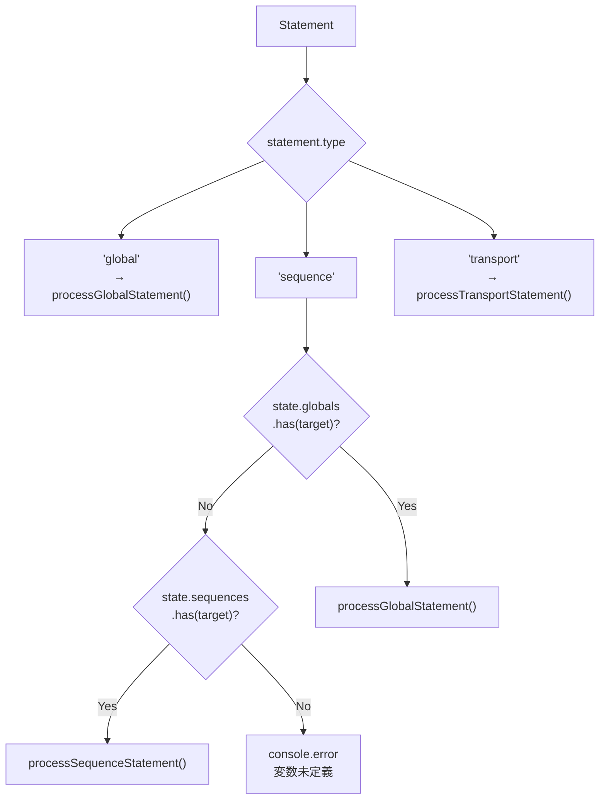
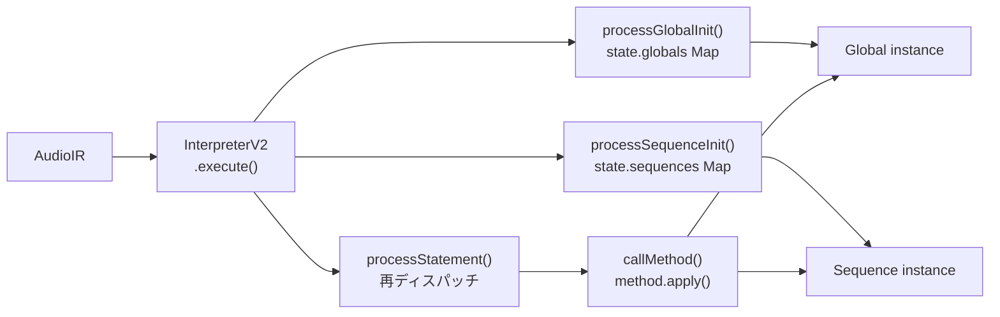

> **Note**: 本ページは 2026-05-05 時点での著者の reading の足跡です。code が真実、本ページはその時点の理解の snapshot に過ぎません。

# I-2. AST 評価モデル

前章 ([I-1. テキスト → AST](/pipeline/text-to-ast)) で `AudioIR` が作られました。ここからは、その `AudioIR` をどう「実行」に変えるかが主題です。実行を担うのが `InterpreterV2` と、その内部で呼ばれる複数のモジュール群です。

## InterpreterV2 は薄いラッパー

`InterpreterV2` のソースには `@deprecated` マークと「thin wrapper around the interpreter modules」という説明が付いています。実際の重要なロジックは `process-initialization.ts`、`process-statement.ts`、`evaluate-method.ts` に分散しており、`InterpreterV2` はそれらを束ねてライフサイクルを管理する入口として残っています。

### state の初期化

`InterpreterV2` のコンストラクターでは `InterpreterState` を生成します。

```typescript
// interpreter-v2.ts:26-37
    this.state = {
      audioEngine: new SuperColliderPlayer(),
      globals: new Map(),
      sequences: new Map(),
      currentGlobal: undefined,
      isBooted: false,
      // Initialize unidirectional toggle groups
      runGroup: new Set(),
      loopGroup: new Set(),
      muteGroup: new Set(),
    }
  }
```

`globals` と `sequences` はどちらも `Map` で、キーは DSL 変数名 (文字列) です。`runGroup`、`loopGroup`、`muteGroup` はトランスポートの状態管理に使う `Set` で、これについては後述します。

`InterpreterState` のインターフェース定義も確認しておきましょう。

```typescript
// interpreter/types.ts:12-23
export interface InterpreterState {
  globals: Map<string, Global>
  sequences: Map<string, Sequence>
  currentGlobal?: Global
  audioEngine: SuperColliderPlayer
  isBooted: boolean

  // Unidirectional toggle groups (DSL v3.0)
  runGroup: Set<string> // Sequences in RUN playback
  loopGroup: Set<string> // Sequences in LOOP playback
  muteGroup: Set<string> // Sequences with MUTE flag ON (persistent)
}
```

`Global` クラスと `Sequence` クラスのインスタンスを変数名をキーとして格納することで、再評価時に同じオブジェクトを参照できます。

### execute() の実行順序

`execute()` メソッドは `AudioIR` を受け取り、決まった順序で 3 つの処理を行います。

```typescript
// interpreter-v2.ts:62-86
  async execute(ir: AudioIR, options?: { skipTransportCommands?: boolean }): Promise<void> {
    const skipTransport = options?.skipTransportCommands ?? false

    // Ensure SuperCollider is booted
    await this.ensureBooted()

    // Process global initialization
    if (ir.globalInit) {
      await processGlobalInit(ir.globalInit, this.state)
    }

    // Process sequence initializations
    for (const seqInit of ir.sequenceInits) {
      await processSequenceInit(seqInit, this.state)
    }

    // Process statements
    for (const statement of ir.statements) {
      // Skip transport commands if requested (e.g., on file save)
      if (skipTransport && statement.type === 'transport') {
        continue
      }
      await processStatement(statement, this.state)
    }
  }
```

順序をまとめると:

1. `ensureBooted()` — SuperCollider サーバーが起動済みか確認し、未起動なら起動
2. `processGlobalInit()` — `var global = init GLOBAL` の処理 (存在する場合のみ)
3. `processSequenceInit()` のループ — `var seq1 = init global.seq` を 1 つずつ処理
4. `processStatement()` のループ — テンポ設定・再生・トランスポートコマンドを順に実行

初期化が先で、実行文が後という構造は自然ですが、`skipTransportCommands` オプションに注目してください。これはファイル保存時などに使われ、`RUN()`/`LOOP()`/`MUTE()` だけをスキップして設定変更だけ反映させるために使います。

## 初期化: インスタンスの再利用と Map の同一性

`processGlobalInit()` と `processSequenceInit()` はいずれも「すでに Map に同じ名前のエントリがあれば新しく作らず再利用する」設計になっています。

### processGlobalInit()

```typescript
// process-initialization.ts:27-37
export async function processGlobalInit(init: GlobalInit, state: InterpreterState): Promise<void> {
  // Reuse existing global if it exists (for REPL persistence)
  let globalInstance = state.globals.get(init.variableName)

  if (!globalInstance) {
    globalInstance = new Global(state.audioEngine)
    state.globals.set(init.variableName, globalInstance)
  }

  state.currentGlobal = globalInstance
}
```

`state.globals.get(init.variableName)` で既存のインスタンスを探します。見つかればそれをそのまま使い、見つからなければ `new Global(...)` します。コメントにある「for REPL persistence」がポイントで、Cmd+Enter で同じブロックを再評価しても同じ `Global` インスタンスが使われ続けます。

### processSequenceInit()

Sequence の初期化も同じ構造ですが、再利用時にひとつ注意点があります。

```typescript
// process-initialization.ts:56-92
export async function processSequenceInit(
  init: SequenceInit,
  state: InterpreterState,
): Promise<void> {
  let global: Global | undefined

  // If globalVariable is specified (new syntax: init global.seq)
  if (init.globalVariable) {
    global = state.globals.get(init.globalVariable)
    if (!global) {
      console.error(`Global instance not found: ${init.globalVariable}`)
      return
    }
  } else {
    // Legacy syntax: init GLOBAL.seq
    global = state.currentGlobal
    if (!global) {
      console.error('No global instance available for sequence initialization')
      return
    }
  }

  // Reuse existing sequence if it exists (for REPL persistence)
  let sequence = state.sequences.get(init.variableName)

  if (!sequence) {
    // Create sequence through the Global's factory method
    sequence = global.seq
    sequence.setName(init.variableName)
    state.sequences.set(init.variableName, sequence)
  } else {
    // Reset parameters to defaults when re-initializing
    // This prevents previous live changes (gain/pan) from persisting
    ;(sequence as any)._gainDb = 0 // Reset to 0 dB
    ;(sequence as any)._pan = 0 // Reset to center
  }
}
```

新規作成の場合は `global.seq` ファクトリメソッドで `Sequence` を生成し、`setName()` で名前と登録を済ませます。既存のインスタンスを再利用する場合は `_gainDb = 0`、`_pan = 0` にリセットします。これは「ライブ中に変更した gain/pan が意図せず次の評価に引き継がれないようにする」ための設計です。

## 文の評価: processStatement() のディスパッチ

初期化が終わると、`statements` の各要素が `processStatement()` に渡されます。[I-1](/pipeline/text-to-ast) で「パーサーはすべての `<id>.method()` を `type: 'sequence'` として出力する」と説明しました。その判断をここで正しく解決するのが `processStatement()` の `'sequence'` ケースです。

```typescript
// process-statement.ts:32-60
export async function processStatement(
  statement: Statement,
  state: InterpreterState,
): Promise<void> {
  switch (statement.type) {
    case 'global':
      await processGlobalStatement(statement, state)
      break
    case 'sequence':
      // Parser cannot distinguish between global and sequence at parse time
      // Determine the actual type here by checking state
      if (state.globals.has(statement.target)) {
        // It's actually a global statement
        await processGlobalStatement(statement as any, state)
      } else if (state.sequences.has(statement.target)) {
        // It's a sequence statement
        await processSequenceStatement(statement, state)
      } else {
        console.error(`Variable not found: ${statement.target}`)
      }
      break
    case 'transport':
      await processTransportStatement(statement, state)
      break
    default:
      // TypeScript should prevent this, but handle gracefully at runtime
      console.warn(`Unknown statement type: ${(statement as any).type}`)
  }
}
```

`'sequence'` ケースでは `state.globals.has(statement.target)` を先にチェックします。つまり、`global.tempo(140)` というコードが来たとき、パーサーは `{ type: 'sequence', target: 'global', method: 'tempo', ... }` と出力しますが、インタープリターは「`global` という名前が `state.globals` に登録されているか」を確認して `processGlobalStatement()` に振り直します。`global` より `sequences` を先にチェックしないのは、同名の global と sequence が衝突した場合に global を優先するという暗黙の設計です。



## メソッド呼び出し: callMethod()

`processGlobalStatement()` も `processSequenceStatement()` も、実際のメソッド呼び出しは `callMethod()` に委譲しています。`processGlobalStatement()` を例に見ると:

```typescript
// process-statement.ts:78-100
export async function processGlobalStatement(
  statement: GlobalStatement,
  state: InterpreterState,
): Promise<void> {
  const global = state.globals.get(statement.target)
  if (!global) {
    console.error(`Global instance not found: ${statement.target}`)
    return
  }

  // Start with the global object
  let result: any = global

  // Process the main method
  result = await callMethod(result, statement.method, statement.args)

  // Process any chained methods
  if (statement.chain) {
    for (const chainedCall of statement.chain) {
      result = await callMethod(result, chainedCall.method, chainedCall.args)
    }
  }
}
```

`callMethod()` を繰り返し呼んでチェーンを順に処理します。`.audio(...).chop(...)` のような連鎖も `statement.chain` 配列をループするだけで実現できます。

`callMethod()` 本体はシンプルです。

```typescript
// evaluate-method.ts:23-38
export async function callMethod(obj: any, methodName: string, args: any[]): Promise<any> {
  const method = obj[methodName]
  if (!method || typeof method !== 'function') {
    console.error(`Method not found: ${methodName} on ${obj.constructor.name}`)
    return obj
  }

  // Process arguments
  const processedArgs = await processArguments(methodName, args)

  // Call the method
  const result = await method.apply(obj, processedArgs)

  // Return the result (usually 'this' for chaining)
  return result || obj
}
```

`obj[methodName]` でメソッドを動的に取得し、`method.apply(obj, processedArgs)` で呼び出します。戻り値が falsy な場合は `obj` 自身を返すことで、メソッドチェーンが途切れないようにしています。

### processArguments(): 引数の変換

引数の多くはそのまま渡されますが、いくつか特別な変換が入ります。

```typescript
// evaluate-method.ts:61-84
export async function processArguments(methodName: string, args: any[]): Promise<any[]> {
  const processed: any[] = []

  for (const arg of args) {
    if (methodName === 'beat' && arg.numerator !== undefined) {
      // Handle meter: beat(4 by 4) -> beat(4, 4)
      processed.push(arg.numerator, arg.denominator)
    } else if (methodName === 'beat' && typeof arg === 'number') {
      // ERROR: beat() must use "n by m" syntax, not single number
      throw new Error(
        `beat() requires meter notation: beat(${arg} by 4) instead of beat(${arg})\n` +
          `This is essential for polymeter support where different time signatures create independent bar lengths.`,
      )
    } else if (methodName === 'play') {
      // Play arguments are passed as-is (already PlayElement[])
      processed.push(arg)
    } else {
      // Most arguments are passed through
      processed.push(arg)
    }
  }

  return processed
}
```

特筆すべきは `beat` メソッドの処理です。パーサーは `beat(4 by 4)` をメーター表記オブジェクト `{ numerator: 4, denominator: 4 }` として出力しますが、`processArguments()` がそれを `[4, 4]` という 2 つの引数に展開します。`beat(4)` のように `n by m` を省略して書くとエラーを投げる設計になっていて、ポリメーターのサポートに不可欠な表記の強制があります。

## トランスポートの意味論

`RUN()`, `LOOP()`, `MUTE()` は `processTransportStatement()` が処理します。これらはトグルではなく、**単方向の上書き (unidirectional)** という設計が特徴です。

```typescript
// process-statement.ts:201-241
export async function processTransportStatement(
  statement: TransportStatement,
  state: InterpreterState,
): Promise<void> {
  const target = statement.target
  const command = statement.command
  const sequenceNames = statement.sequences ?? []

  // Handle reserved keywords (RUN, LOOP, MUTE) with unidirectional toggle
  // Empty arguments are allowed (e.g., RUN() clears the RUN group)
  if (
    target === '__RESERVED_KEYWORD__' &&
    (command === 'run' || command === 'loop' || command === 'mute')
  ) {
    await handleReservedKeywordCommand(command, sequenceNames, state)
    return
  }

  // Handle global commands (e.g., g.start() where g is a global variable)
  const global = state.globals.get(target)
  if (global) {
    await handleGlobalTransportCommand(global, command)
    // Clear transport groups when global.stop() is called
    // This ensures LOOP/RUN differential calculations work correctly after restart
    if (command === 'stop') {
      state.runGroup = new Set()
      state.loopGroup = new Set()
      state.muteGroup = new Set()
    }
    return
  }

  // Handle sequence commands (e.g., kick.run())
  const sequence = state.sequences.get(target)
  if (sequence) {
    await callMethod(sequence, command, [])
    return
  }

  console.error(`Transport target not found: ${target}`)
}
```

`RUN(kick, snare)` という命令は「RUN グループを kick と snare に設定する」という上書きです。前の状態は一切考慮されません。`LOOP` は差分計算 (`calculateLoopDiff`) を行って追加された sequence を起動し、削除された sequence を停止します。`MUTE` は各 sequence の mute フラグを単方向にセットします。

`global.stop()` が呼ばれると `runGroup`、`loopGroup`、`muteGroup` がすべてリセットされます。これにより、再起動後の状態が正しく計算されます。

なお、`RUN()`, `LOOP()`, `MUTE()` で `target` が `'__RESERVED_KEYWORD__'` になっている点も目立ちます。これは `parseReservedKeyword()` がトランスポートコマンドを出力する際に付けるダミーターゲットで、インタープリターがグローバル/シーケンスへの参照と区別できるようにするための仕組みです。

## バインディングの仕組みまとめ

ここまでの内容を図で整理します。



変数名 (文字列) をキーとした `Map` がバインディングの実体で、スコープや closure のような複雑な仕組みは持ちません。再評価のたびに `Map` の同じエントリを更新するだけで REPL の状態が保たれます。

## 次の深掘り候補

- `Global` クラスの内部構造 — `TempoManager`, `AudioManager`, `EffectsManager` の委譲パターン
- `Sequence.seq` ファクトリメソッドの実装 — `Global` がどのように `Sequence` を生成するか
- `handleLoopCommand()` の差分計算 (`calculateLoopDiff`) の詳細
- `handleMuteCommand()` のフラグ管理と `Sequence` 側の mute 処理の連携
- `skipTransportCommands` オプションが使われる具体的なシナリオ (ファイル保存時の挙動)
- `processArguments()` の `play` 引数処理と `PlayElement` の構造

## Sources

- `packages/engine/src/interpreter/interpreter-v2.ts:1-7` — `@deprecated` マークと thin wrapper の説明
- `packages/engine/src/interpreter/interpreter-v2.ts:26-37` — `InterpreterState` の初期化と各 Map/Set の生成
- `packages/engine/src/interpreter/interpreter-v2.ts:62-86` — `execute()` の実行順序
- `packages/engine/src/interpreter/types.ts:12-23` — `InterpreterState` インターフェース定義
- `packages/engine/src/interpreter/process-initialization.ts:27-37` — `processGlobalInit()` の Map 再利用ロジック
- `packages/engine/src/interpreter/process-initialization.ts:56-92` — `processSequenceInit()` の再利用と _gainDb/_pan リセット
- `packages/engine/src/interpreter/process-statement.ts:32-60` — `processStatement()` の switch と global-first 再ディスパッチ
- `packages/engine/src/interpreter/process-statement.ts:78-100` — `processGlobalStatement()` のチェーン処理
- `packages/engine/src/interpreter/process-statement.ts:201-241` — `processTransportStatement()` と global.stop() 時のグループリセット
- `packages/engine/src/interpreter/evaluate-method.ts:23-38` — `callMethod()` の `method.apply()` パターン
- `packages/engine/src/interpreter/evaluate-method.ts:61-84` — `processArguments()` の beat/play 特殊ケース
