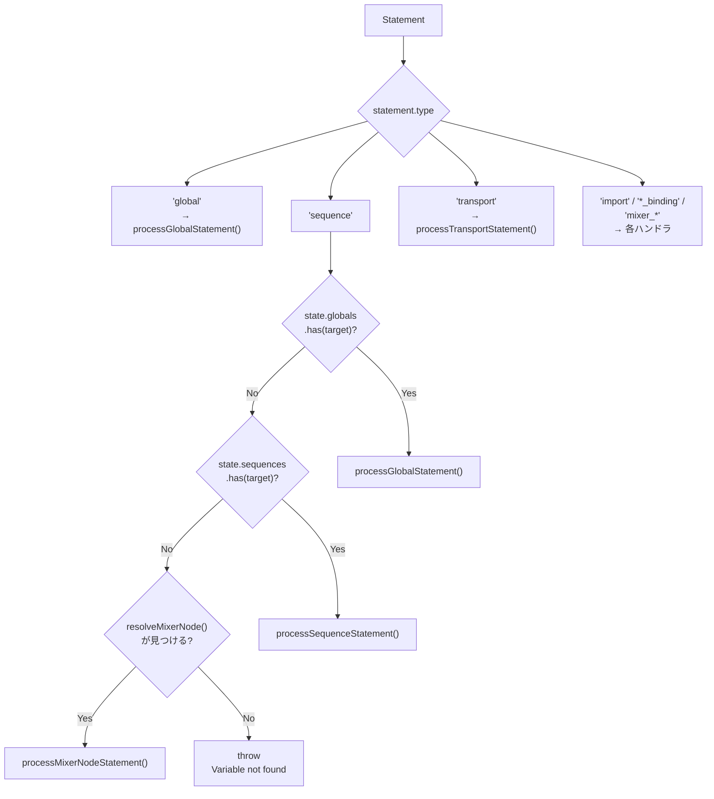
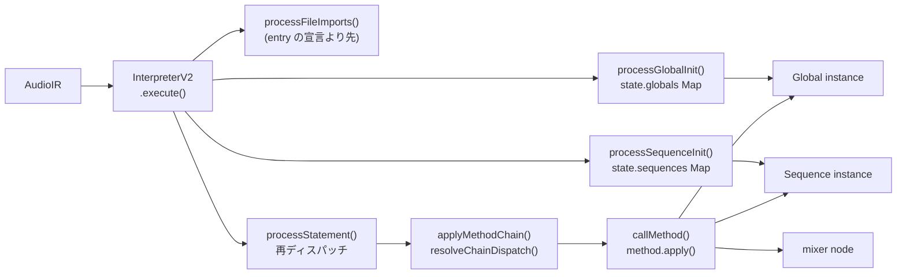

> **Note**: 本ページは 2026-09-01 時点での著者の reading の足跡です。code が真実、本ページはその時点の理解の snapshot に過ぎません。

# I-2. AST 評価モデル

前章 ([I-1. テキスト → AST](/pipeline/text-to-ast)) で `AudioIR` が作られました。ここからは、その `AudioIR` をどう「実行」に変えるかが主題です。実行を担うのが `InterpreterV2` と、その内部で呼ばれる複数のモジュール群です。

## 2026-09 時点の drift

本章の初版は 2026-05-05 の snapshot (0a4b598) に対して書かれました。2026-09-01 (69dc968) のコードでは、「変数名をキーにした `Map` がバインディングの実体」「パーサーが決めなかった global/sequence を interpreter が state で解決する」という本章の骨格は変わっていません。変わったのは次の点です。

- **`InterpreterState` に `mixers` / `sessionLog?` / `engineT0` / `currentSourceFile?` が加わり**、`audioEngine` の型が `SuperColliderPlayer` から契約面 `AudioEngineBackend` に変わった (`packages/engine/src/interpreter/types.ts:14-34`)。既定の実装は Rust daemon 経路の `RustEnginePlayer` です (cutover #108、[0-2](/orientation/architecture-overview) 参照)
- **`execute()` のオプションが増え** (`documentDirectory` / `source` / `sourceFile` / `evalSource`)、`globalInit` より前に **file import を処理** し、`globalInit` の直後に **documentDirectory を Global に設定** するようになった (2026-07-17 の #456)
- **`processGlobalInit()` / `processSequenceInit()` がミキサー名前空間との衝突を検査する** (#517 S1)
- **`processStatement()` の case が 3 → 11 に増え**、`'sequence'` の解決順が「globals → sequences → mixer node」の 3 段になり、見つからないときは `console.error` ではなく **throw** するようになった
- **`processGlobalStatement()` / `processSequenceStatement()` がチェーン処理を `applyMethodChain()` に集約し**、各ホップで `resolveChainDispatch()` が「DSL メソッドか / プラグイン呼び出しか / ミキサールーティングか」を判定するようになった (#517 S2-S3)
- **`callMethod()` はメソッド未定義で throw する** (2026-05 版では `console.error` して `obj` を返していた)。`processArguments()` は名前付き引数 (`name: value`) を受けると段階を明示したエラーを投げます (SC.3.3)
- `processTransportStatement()` は 507-550 行に移動しただけで内容は同じです

## InterpreterV2 は薄いラッパー

`InterpreterV2` のソースには `@deprecated` マークと「thin wrapper around the interpreter modules」という説明が付いています。実際の重要なロジックは `process-initialization.ts`、`process-statement.ts`、`evaluate-method.ts` (と #456 で加わった `process-file-import.ts`) に分散しており、`InterpreterV2` はそれらを束ねてライフサイクルを管理する入口として残っています。

### state の初期化

`InterpreterV2` のコンストラクターでは `InterpreterState` を生成します。

```typescript
// packages/engine/src/interpreter/interpreter-v2.ts:48-64
  constructor(opts?: { audioEngine?: AudioEngineBackend }) {
    this.state = {
      audioEngine: opts?.audioEngine ?? createAudioEngine(),
      globals: new Map(),
      sequences: new Map(),
      mixers: createMixerRuntimeRegistry(),
      currentGlobal: undefined,
      isBooted: false,
      // Initialize unidirectional toggle groups
      runGroup: new Set(),
      loopGroup: new Set(),
      muteGroup: new Set(),
      // §L1: the rolling-buffer origin (§3 wall). The writer itself stays absent
      // until enableSessionLog() — so logging is inert in unit-test paths.
      engineT0: Date.now(),
    }
  }
```

`globals` と `sequences` はどちらも `Map` で、キーは DSL 変数名 (文字列) です。`mixers` は Signal Chain DSL のミキサーハンドル / ノードの registry で、これも名前をキーにします。`runGroup`、`loopGroup`、`muteGroup` はトランスポートの状態管理に使う `Set` で、これについては後述します。`audioEngine` はテストで差し込めるように引数で受け取れ、未指定なら `createAudioEngine()` が env に従って選びます。

`InterpreterState` のインターフェース定義も確認しておきましょう。

```typescript
// packages/engine/src/interpreter/types.ts:14-34
export interface InterpreterState {
  globals: Map<string, Global>
  sequences: Map<string, Sequence>
  mixers: MixerRuntimeRegistry
  currentGlobal?: Global
  audioEngine: AudioEngineBackend
  isBooted: boolean

  // Unidirectional toggle groups (DSL v3.0)
  runGroup: Set<string> // Sequences in RUN playback
  loopGroup: Set<string> // Sequences in LOOP playback
  muteGroup: Set<string> // Sequences with MUTE flag ON (persistent)

  // §L1 (#229) session log — present ONLY when explicitly enabled at a real
  // entry point (CLI / REPL). Absent in unit-test paths, so logging is inert.
  sessionLog?: SessionLogWriter
  engineT0: number // epoch ms at interpreter construction = rolling-buffer origin (§3 wall)
  // The .orbs the current eval came from — read by the transport-hook closures
  // when start()/stop() fire synchronously within that eval (§3 sourceFile / §2 naming).
  currentSourceFile?: string | null
}
```

`Global` クラスと `Sequence` クラスのインスタンスを変数名をキーとして格納することで、再評価時に同じオブジェクトを参照できます。

### execute() の実行順序

`execute()` メソッドは `AudioIR` と評価オプションを受け取ります。オプションはエディタ / MCP からの評価で「どのディレクトリ基準か」「どのソースから来たか」を伝えるためのものです。

```typescript
// packages/engine/src/interpreter/interpreter-v2.ts:133-146
  async execute(
    ir: AudioIR,
    options?: {
      skipTransportCommands?: boolean
      documentDirectory?: string
      /** §L1: the verbatim evaluated source (the `code` field). */
      source?: string
      /** §L1: the originating `.orbs` (drives `sourceFile` + filename). */
      sourceFile?: string | null
      /** §L1: who evaluated this (default `human`). */
      evalSource?: EvalSource
    },
  ): Promise<void> {
    const skipTransport = options?.skipTransportCommands ?? false
```

本体は決まった順序で処理を進めます。

```typescript
// packages/engine/src/interpreter/interpreter-v2.ts:171-230 (file import の本体と session-log hook の設置を省略)
    // Ensure SuperCollider is booted
    await this.ensureBooted()

    // File imports (IM.2, #456): evaluated BEFORE the entry's own declarations, in
    // source order, depth-first. The cache/cycle context lives for this eval only.
    if (ir.fileImports?.length) {
      // ...
    }

    // Process global initialization
    if (ir.globalInit) {
      await processGlobalInit(ir.globalInit, this.state)
    }
    // ...
    // Set documentDirectory on global so audioPath() / audio() can resolve relative paths
    if (options?.documentDirectory && this.state.currentGlobal) {
      this.state.currentGlobal.setDocumentDirectory(options.documentDirectory)
    }

    // Process sequence initializations
    for (const seqInit of ir.sequenceInits) {
      await processSequenceInit(seqInit, this.state)
    }

    // Process statements
    for (const statement of ir.statements) {
      // Skip transport commands if requested (e.g., on file save)
      if (skipTransport && statement.type === 'transport') {
        continue
      }
      await processStatement(statement, this.state)
    }
  }
```

順序をまとめると:

1. `ensureBooted()` — 音声バックエンドが起動済みか確認し、未起動なら起動 (コメントは「SuperCollider」のままですが、既定では Rust daemon が起動します)
2. `processFileImports()` — `import { ... } from "./x.orbs"` を entry 自身の宣言より先に評価 (存在する場合のみ)
3. `processGlobalInit()` — `var global = init GLOBAL` の処理 (存在する場合のみ)
4. `setDocumentDirectory()` — `documentDirectory` オプションがあれば Global に設定
5. `processSequenceInit()` のループ — `var seq1 = init global.seq` を 1 つずつ処理
6. `processStatement()` のループ — テンポ設定・再生・トランスポートコマンドを順に実行

初期化が先で、実行文が後という構造は自然ですが、`skipTransportCommands` オプションに注目してください。これはファイル保存時などに使われ、`RUN()`/`LOOP()`/`MUTE()` だけをスキップして設定変更だけ反映させるために使います。

## 初期化: インスタンスの再利用と Map の同一性

`processGlobalInit()` と `processSequenceInit()` はいずれも「すでに Map に同じ名前のエントリがあれば新しく作らず再利用する」設計になっています。

### processGlobalInit()

```typescript
// packages/engine/src/interpreter/process-initialization.ts:27-43
export async function processGlobalInit(init: GlobalInit, state: InterpreterState): Promise<void> {
  if (state.mixers.handles.has(init.variableName) || state.mixers.nodes.has(init.variableName)) {
    throw new Error(
      `Global name "${init.variableName}" conflicts with the existing mixer namespace.`,
    )
  }

  // Reuse existing global if it exists (for REPL persistence)
  let globalInstance = state.globals.get(init.variableName)

  if (!globalInstance) {
    globalInstance = new Global(state.audioEngine)
    state.globals.set(init.variableName, globalInstance)
  }

  state.currentGlobal = globalInstance
}
```

最初にミキサー名前空間との衝突を弾いてから、`state.globals.get(init.variableName)` で既存のインスタンスを探します。見つかればそれをそのまま使い、見つからなければ `new Global(...)` します。コメントにある「for REPL persistence」がポイントで、Cmd+Enter で同じブロックを再評価しても同じ `Global` インスタンスが使われ続けます。

### processSequenceInit()

Sequence の初期化も同じ構造ですが、再利用時にひとつ注意点があります。

```typescript
// packages/engine/src/interpreter/process-initialization.ts:62-104
export async function processSequenceInit(
  init: SequenceInit,
  state: InterpreterState,
): Promise<void> {
  if (state.mixers.handles.has(init.variableName) || state.mixers.nodes.has(init.variableName)) {
    throw new Error(
      `Sequence name "${init.variableName}" conflicts with the existing mixer namespace.`,
    )
  }

  let global: Global | undefined

  // If globalVariable is specified (new syntax: init global.seq)
  if (init.globalVariable) {
    global = state.globals.get(init.globalVariable)
    if (!global) {
      console.error(`Global instance not found: ${init.globalVariable}`)
      return
    }
  } else {
    // Legacy syntax: init GLOBAL.seq
    global = state.currentGlobal
    if (!global) {
      console.error('No global instance available for sequence initialization')
      return
    }
  }

  // Reuse existing sequence if it exists (for REPL persistence)
  let sequence = state.sequences.get(init.variableName)

  if (!sequence) {
    // Create sequence through the Global's factory method
    sequence = global.seq
    sequence.setName(init.variableName)
    state.sequences.set(init.variableName, sequence)
  } else {
    // Reset parameters to defaults when re-initializing
    // This prevents previous live changes (gain/pan) from persisting
    ;(sequence as any)._gainDb = 0 // Reset to 0 dB
    ;(sequence as any)._pan = 0 // Reset to center
  }
}
```

新規作成の場合は `global.seq` ファクトリメソッドで `Sequence` を生成し、`setName()` で名前と登録を済ませます。既存のインスタンスを再利用する場合は `_gainDb = 0`、`_pan = 0` にリセットします。これは「ライブ中に変更した gain/pan が意図せず次の評価に引き継がれないようにする」ための設計です。

## 文の評価: processStatement() のディスパッチ

初期化が終わると、`statements` の各要素が `processStatement()` に渡されます。[I-1](/pipeline/text-to-ast) で「パーサーはすべての `<id>.method()` を `type: 'sequence'` として出力する」と説明しました。その判断をここで正しく解決するのが `processStatement()` の `'sequence'` ケースです。

```typescript
// packages/engine/src/interpreter/process-statement.ts:61-115
export async function processStatement(
  statement: Statement,
  state: InterpreterState,
): Promise<void> {
  switch (statement.type) {
    case 'global':
      await processGlobalStatement(statement, state)
      break
    case 'sequence':
      // Parser cannot distinguish between global and sequence at parse time
      // Determine the actual type here by checking state
      if (state.globals.has(statement.target)) {
        // It's actually a global statement
        await processGlobalStatement(statement as any, state)
      } else if (state.sequences.has(statement.target)) {
        // It's a sequence statement
        await processSequenceStatement(statement, state)
      } else {
        const node = resolveMixerNode(state.mixers, statement.target, state.currentGlobal)
        if (node) {
          await processMixerNodeStatement(statement, node, state)
        } else {
          throw new Error(`Variable not found: ${statement.target}`)
        }
      }
      break
    case 'transport':
      await processTransportStatement(statement, state)
      break
    case 'import':
      processImportStatement(statement, state)
      break
    case 'chord_binding':
      processArrayBinding(statement, state)
      break
    case 'pattern_binding':
      processPatternBinding(statement, state)
      break
    case 'mode_binding':
      processModeBinding(statement, state)
      break
    case 'mixer_handle':
      await processMixerHandleStatement(statement, state)
      break
    case 'mixer_init':
      registerMixerHandle(state, statement)
      break
    case 'mixer_node_decl':
      registerMixerNode(state, statement)
      break
    default:
      // TypeScript should prevent this, but handle gracefully at runtime
      console.warn(`Unknown statement type: ${(statement as any).type}`)
  }
}
```

`'sequence'` ケースでは `state.globals.has(statement.target)` を先にチェックします。つまり、`global.tempo(140)` というコードが来たとき、パーサーは `{ type: 'sequence', target: 'global', method: 'tempo', ... }` と出力しますが、インタープリターは「`global` という名前が `state.globals` に登録されているか」を確認して `processGlobalStatement()` に振り直します。`global` より `sequences` を先にチェックしないのは、同名の global と sequence が衝突した場合に global を優先するという暗黙の設計です。どちらにも無ければ 3 段目としてミキサーノード (`var drums = mix.sum` で宣言した名前など) を探し、それも無ければ `Variable not found` を **throw** します。この例外は REPL 側が捕まえて `[ERROR]` として stderr に出し、MCP の `evaluate_orbitscore` には診断として返ります ([I-3](/pipeline/selective-execution))。


```mermaid
flowchart TD
  stmt["Statement"]
  sw{"statement.type"}
  g["'global'\n→ processGlobalStatement()"]
  seq["'sequence'"]
  chkG{"state.globals\n.has(target)?"}
  chkS{"state.sequences\n.has(target)?"}
  chkM{"resolveMixerNode()\nが見つける?"}
  gStmt["processGlobalStatement()"]
  sStmt["processSequenceStatement()"]
  mStmt["processMixerNodeStatement()"]
  err["throw\nVariable not found"]
  trans["'transport'\n→ processTransportStatement()"]
  other["'import' / '*_binding' /\n'mixer_*'\n→ 各ハンドラ"]

  stmt --> sw
  sw --> g
  sw --> seq
  sw --> trans
  sw --> other
  seq --> chkG
  chkG -- Yes --> gStmt
  chkG -- No --> chkS
  chkS -- Yes --> sStmt
  chkS -- No --> chkM
  chkM -- Yes --> mStmt
  chkM -- No --> err
```

## メソッド呼び出し: applyMethodChain() と callMethod()

`processGlobalStatement()` も `processSequenceStatement()` も、レシーバーを取り出したあとは `applyMethodChain()` に処理を委ねます。`processGlobalStatement()` を例に見ると:

```typescript
// packages/engine/src/interpreter/process-statement.ts:394-411
export async function processGlobalStatement(
  statement: GlobalStatement,
  state: InterpreterState,
): Promise<void> {
  const global = state.globals.get(statement.target)
  if (!global) {
    throw new Error(`Variable not found: ${statement.target}`)
  }

  await applyMethodChain(
    global,
    statement.method,
    statement.args,
    state,
    statement.chain,
    statement.invocation ?? 'call',
  )
}
```

`applyMethodChain()` は「主メソッドを呼び、続けて `chain` の各要素を呼ぶ」というループを 1 箇所に集約したものです。レシーバーの種類 (Global / Sequence / バス参照 / ミキサーノード) に関わらず同じループを通るので、チェーンの意味論が 1 箇所で定義されます。

```typescript
// packages/engine/src/interpreter/process-statement.ts:117-141
/**
 * Apply a statement's main call and then its chained calls to `receiver`,
 * threading each call's return value into the next (methods return `this` to
 * chain). Every receiver kind — global, sequence, bare bus reference, mixer node —
 * shares this loop so chain semantics stay defined in exactly one place.
 * Each hop also resolves dynamic chain vocabulary and selects DSL-method versus
 * plugin dispatch before threading the returned receiver onward.
 *
 * That includes which methods a receiver even accepts: {@link guardBusChain} runs
 * against the value about to be dispatched on, before each call. Enforcement
 * therefore travels with the value rather than with the handler that produced it,
 * so a handler added later inherits it instead of having to remember it.
 */
async function applyMethodChain(
  receiver: unknown,
  method: string,
  args: any[],
  state: InterpreterState,
  chain?: ReadonlyArray<{
    method: string
    args: any[]
    invocation?: 'bare' | 'call'
  }>,
  invocation: 'bare' | 'call' = 'call',
): Promise<any> {
```

各ホップでは `resolveChainDispatch()` が「この名前は DSL メソッドか、プラグイン呼び出しか、ミキサールーティングか」を判定します。ここで気をつけたいのは、パーサーが記録した `invocation` がこの段階で意味を持つことです。Global に対して括弧なしで DSL メソッドを書くと、次のガードが働きます。

```typescript
// packages/engine/src/interpreter/process-statement.ts:148-167
    const dispatch = resolveChainDispatch(receiver, method, state, invocation)
    if (
      dispatch.kind === 'dsl-method' &&
      invocation === 'bare' &&
      receiver instanceof Global &&
      !GLOBAL_BARE_METHODS.has(method)
    ) {
      // Before #517 S3, a bare non-transport call on a Global reached
      // `handleGlobalTransportCommand`, whose `default` arm warned and never
      // invoked the method. S3 routes every bare first hop through the chain
      // dispatcher instead, so `global.midiLatency` (a dropped `(20)`) would call
      // `midiLatency(undefined)` and silently corrupt state — reproduced, along
      // with `global.key` crashing inside `name.match(...)`. Sequences keep bare
      // DSL methods (`kick.unmute`); only a Global needs the parentheses, since
      // its bare vocabulary is transport-only.
      throw new Error(
        `Global method "${method}" requires parentheses; write global.${method}(...). ` +
          `Only ${[...GLOBAL_BARE_METHODS].join(' / ')} may be written bare on a Global.`,
      )
    }
```

`global.midiLatency` のように引数を落とした書き方が `midiLatency(undefined)` として通ってしまい、状態を黙って壊した実例がコメントに残っています。Sequence 側は `kick.unmute` のような括弧なしを許し、Global だけ `start` / `stop` / `loop` に限定する、という非対称です。

DSL メソッドと判定された呼び出しは、最終的に `callMethod()` に到達します。

```typescript
// packages/engine/src/interpreter/evaluate-method.ts:23-35
export async function callMethod(obj: any, methodName: string, args: any[]): Promise<any> {
  const processedArgs = await processArguments(methodName, args)
  const method = obj[methodName]
  if (!method || typeof method !== 'function') {
    throw new Error(`Method not found: ${methodName} on ${obj?.constructor?.name ?? 'receiver'}`)
  }

  // Call the method
  const result = await method.apply(obj, processedArgs)

  // Return the result (usually 'this' for chaining)
  return result || obj
}
```

`obj[methodName]` でメソッドを動的に取得し、`method.apply(obj, processedArgs)` で呼び出します。戻り値が falsy な場合は `obj` 自身を返すことで、メソッドチェーンが途切れないようにしています。メソッドが見つからなければ throw します — 2026-05 版では `console.error` して `obj` を返していたので、失敗が黙って流れる余地がありましたが、この版では必ず例外として表面化します。

### processArguments(): 引数の変換

引数の多くはそのまま渡されますが、いくつか特別な変換が入ります。

```typescript
// packages/engine/src/interpreter/evaluate-method.ts:58-107
export async function processArguments(methodName: string, args: any[]): Promise<any[]> {
  const processed: any[] = []

  for (const arg of args) {
    if (arg && typeof arg === 'object' && arg.type === 'named_arg') {
      // Plugin-name dispatch handles selectors before reaching this function.
      // Any named argument that arrives here belongs to a DSL method and must
      // receive an explicit staged error (SC.3.3).
      let stage: string
      switch (arg.name) {
        case 'format':
        case 'vendor':
          stage =
            `string-form ${methodName}() does not accept selectors; ` +
            `use the plugin-name method form Name(format: "vst3")`
          break
        case 'sidechain':
          stage = 'sidechain routing arrives in #409'
          break
        case 'outs':
          stage = 'multi-output routing arrives in #409'
          break
        default:
          stage = 'parameter values require the Rust param-set/enumeration protocol in S4'
      }
      throw new Error(
        `named argument "${arg.name}:" in ${methodName}() is not executable yet: ` +
          `${stage} (#517).`,
      )
    }
    if (methodName === 'beat' && arg.numerator !== undefined) {
      // Handle meter: beat(4 by 4) -> beat(4, 4)
      processed.push(arg.numerator, arg.denominator)
    } else if (methodName === 'beat' && typeof arg === 'number') {
      // ERROR: beat() must use "n by m" syntax, not single number
      throw new Error(
        `beat() requires meter notation: beat(${arg} by 4) instead of beat(${arg})\n` +
          `This is essential for polymeter support where different time signatures create independent bar lengths.`,
      )
    } else if (methodName === 'play') {
      // Play arguments are passed as-is (already PlayElement[])
      processed.push(arg)
    } else {
      // Most arguments are passed through
      processed.push(arg)
    }
  }

  return processed
}
```

特筆すべきは `beat` メソッドの処理です。パーサーは `beat(4 by 4)` をメーター表記オブジェクト `{ numerator: 4, denominator: 4 }` として出力しますが、`processArguments()` がそれを `[4, 4]` という 2 つの引数に展開します。`beat(4)` のように `n by m` を省略して書くとエラーを投げる設計になっていて、ポリメーターのサポートに不可欠な表記の強制があります。

先頭の `named_arg` の分岐は Signal Chain DSL (SC.3) の名前付き引数のためのもので、プラグイン名ディスパッチで消費されなかった名前付き引数が DSL メソッドに届いた場合、「どの段階で使えるようになるか」を明示したエラーを投げます。黙って無視することを SC.3.3 が禁じているためです。

## トランスポートの意味論

`RUN()`, `LOOP()`, `MUTE()` は `processTransportStatement()` が処理します。これらはトグルではなく、**単方向の上書き (unidirectional)** という設計が特徴です。

```typescript
// packages/engine/src/interpreter/process-statement.ts:507-550
export async function processTransportStatement(
  statement: TransportStatement,
  state: InterpreterState,
): Promise<void> {
  const target = statement.target
  const command = statement.command
  const sequenceNames = statement.sequences ?? []

  // Handle reserved keywords (RUN, LOOP, MUTE) with unidirectional toggle
  // Empty arguments are allowed (e.g., RUN() clears the RUN group)
  if (
    target === '__RESERVED_KEYWORD__' &&
    (command === 'run' || command === 'loop' || command === 'mute')
  ) {
    await handleReservedKeywordCommand(command, sequenceNames, state)
    return
  }

  // Handle global commands (e.g., g.start() where g is a global variable).
  // Note: §L1 session-log start/stop hooks live on Global.start()/stop() (the
  // boundary both `start` (transport-routed) and `stop` (method-routed) pass
  // through), not here — so they fire regardless of how the command is parsed.
  const global = state.globals.get(target)
  if (global) {
    await handleGlobalTransportCommand(global, command)
    // Clear transport groups when global.stop() is called
    // This ensures LOOP/RUN differential calculations work correctly after restart
    if (command === 'stop') {
      state.runGroup = new Set()
      state.loopGroup = new Set()
      state.muteGroup = new Set()
    }
    return
  }

  // Handle sequence commands (e.g., kick.run())
  const sequence = state.sequences.get(target)
  if (sequence) {
    await callMethod(sequence, command, [])
    return
  }

  console.error(`Transport target not found: ${target}`)
}
```

`RUN(kick, snare)` という命令は「RUN グループを kick と snare に設定する」という上書きです。前の状態は一切考慮されません。`LOOP` は差分計算 (`calculateLoopDiff`) を行って追加された sequence を起動し、削除された sequence を停止します。`MUTE` は各 sequence の mute フラグを単方向にセットします。

`global.stop()` が呼ばれると `runGroup`、`loopGroup`、`muteGroup` がすべてリセットされます。これにより、再起動後の状態が正しく計算されます。

なお、`RUN()`, `LOOP()`, `MUTE()` で `target` が `'__RESERVED_KEYWORD__'` になっている点も目立ちます。これは `parseReservedKeyword()` がトランスポートコマンドを出力する際に付けるダミーターゲットで、インタープリターがグローバル/シーケンスへの参照と区別できるようにするための仕組みです。

## バインディングの仕組みまとめ

ここまでの内容を図で整理します。


```mermaid
flowchart LR
  ir["AudioIR"]
  exec["InterpreterV2\n.execute()"]
  imp["processFileImports()\n(entry の宣言より先)"]
  gInit["processGlobalInit()\nstate.globals Map"]
  sInit["processSequenceInit()\nstate.sequences Map"]
  stmt["processStatement()\n再ディスパッチ"]
  chain["applyMethodChain()\nresolveChainDispatch()"]
  cm["callMethod()\nmethod.apply()"]
  g["Global instance"]
  s["Sequence instance"]
  m["mixer node"]

  ir --> exec
  exec --> imp
  exec --> gInit
  exec --> sInit
  exec --> stmt
  gInit --> g
  sInit --> s
  stmt --> chain
  chain --> cm
  cm --> g
  cm --> s
  cm --> m
```

変数名 (文字列) をキーとした `Map` (と mixer registry) がバインディングの実体で、スコープや closure のような複雑な仕組みは持ちません。再評価のたびに `Map` の同じエントリを更新するだけで REPL の状態が保たれます。file import で取り込んだ宣言も、同じ `Map` に載る点は変わりません。

## 関連用語

- [DSL](/glossary#dsl) — OrbitScore が定義するドメイン固有言語。インタープリターが AST を評価する言語
- [init](/glossary#init) — `init global` / `init sequenceName` 構文。インタープリターが `processGlobalInit()` / `processSequenceInit()` で処理する
- [global](/glossary#global) — グローバルスコープ識別子。`state.globals` Map のキーとして使われる
- [RUN](/glossary#run) — `RUN()` コマンド。`processTransportStatement()` が `handleRunCommand()` にディスパッチするトランスポート操作
- [LOOP](/glossary#loop) — `LOOP()` コマンド。ループ差分計算 (`calculateLoopDiff`) を伴うトランスポート操作
- [MUTE / UNMUTE](/glossary#mute--unmute) — `MUTE()` コマンド。`Sequence` のフラグ管理を伴う
- [片記号方式](/glossary#片記号方式) — 単方向上書きのトランスポート意味論
- [アンダースコアプレフィックスパターン](/glossary#アンダースコアプレフィックスパターン) — `_sequenceName` でシーケンスを無効化する v3.0 記法

## 関連 ADR

- [ADR-002 DSL v3 Pivot](/decisions/adr-002-dsl-v3-pivot) — v3.0 で導入された構文変更 (アンダースコアプレフィックス、片記号方式) の意思決定

## 次の深掘り候補

- `Global` クラスの内部構造 — `TempoManager`, `AudioManager`, mixer manager 等への委譲パターン
- `Sequence.seq` ファクトリメソッドの実装 — `Global` がどのように `Sequence` を生成するか
- `resolveChainDispatch()` の判定規則 — DSL メソッド / プラグイン名 / ミキサールーティングをどの順で照合するか (`packages/engine/src/signal-chain/dispatch.ts`)
- `applyMethodChain()` の `guardBusChain` — レシーバーの種類ごとに許されるメソッドの制約
- `processFileImports()` の cache / cycle 検出と、失敗時に基準ディレクトリを復元する `finally` (IM.4 / IM.6)
- `handleLoopCommand()` の差分計算 (`calculateLoopDiff`) の詳細
- `handleMuteCommand()` のフラグ管理と `Sequence` 側の mute 処理の連携
- `skipTransportCommands` オプションが使われる具体的なシナリオ (ファイル保存時の挙動)
- `processArrayBinding()` が `[ ... ]` を chord と rack のどちらに分類するか (`classifyArrayBinding`)
- session log (§L1) の hook 設置 — `installSessionHooks()` が `Global.start()/stop()` に結び付く仕組み

## Sources

- `packages/engine/src/interpreter/interpreter-v2.ts:1-7` — `@deprecated` マークと thin wrapper の説明
- `packages/engine/src/interpreter/interpreter-v2.ts:48-64` — `InterpreterState` の初期化と `createAudioEngine()`
- `packages/engine/src/interpreter/interpreter-v2.ts:133-230` — `execute()` のオプションと実行順序 (file import → globalInit → documentDirectory → sequenceInits → statements)
- `packages/engine/src/interpreter/types.ts:14-34` — `InterpreterState` インターフェース定義
- `packages/engine/src/interpreter/process-initialization.ts:27-43` — `processGlobalInit()` のミキサー名前空間検査と Map 再利用ロジック
- `packages/engine/src/interpreter/process-initialization.ts:62-104` — `processSequenceInit()` の再利用と _gainDb/_pan リセット
- `packages/engine/src/interpreter/process-statement.ts:61-115` — `processStatement()` の switch と globals → sequences → mixer node の再ディスパッチ
- `packages/engine/src/interpreter/process-statement.ts:117-167` — `applyMethodChain()` の設計コメントと Global の bare 呼び出しガード
- `packages/engine/src/interpreter/process-statement.ts:394-446` — `processGlobalStatement()` / `processSequenceStatement()`
- `packages/engine/src/interpreter/process-statement.ts:507-550` — `processTransportStatement()` と global.stop() 時のグループリセット
- `packages/engine/src/interpreter/evaluate-method.ts:23-35` — `callMethod()` の `method.apply()` パターンと throw
- `packages/engine/src/interpreter/evaluate-method.ts:58-107` — `processArguments()` の named_arg / beat / play 特殊ケース
- `packages/engine/src/interpreter/process-file-import.ts` — `createImportContext()` / `processFileImports()` (#456)
- `docs/specs-v2/SIGNAL_CHAIN_DSL_SPEC_v1.md` §SC.3 — 名前付き引数と「黙って無視しない」規則 (SC.3.3)
- `docs/development/WORK_LOG.md` §6.265 (file import #456, 2026-07-17)、§6.291-6.293 (Signal Chain S1-S3 #517, 2026-07-26)
