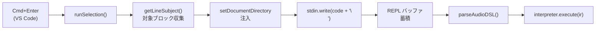
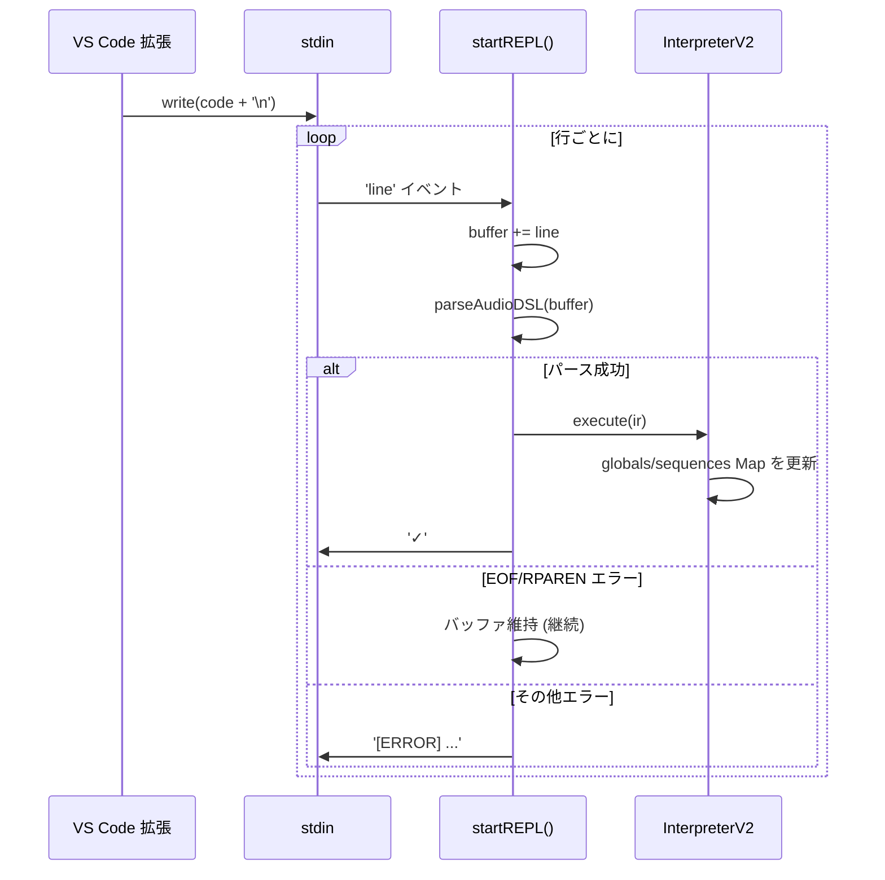

> **Note**: 本ページは 2026-05-05 時点での著者の reading の足跡です。code が真実、本ページはその時点の理解の snapshot に過ぎません。

# I-3. selective execution

Cmd+Enter でコードの一部だけを実行する — これが OrbitScore の中心的な操作です。TidalCycles の「選択評価」に相当するこの仕組みは、VS Code 拡張とエンジンの 2 プロセスにまたがって実現されています。この章では、キー操作からエンジンでの実行完了まで、どのようにコードが流れるかを追います。

## 全体の流れ



VS Code 拡張側が「送るコードを決める」、エンジン側が「受け取って実行する」という役割分担です。

## エンジン起動: repl サブコマンド

まず、エンジンがどう起動しているかを確認しておきましょう。`startEngine()` では引数に `'repl'` を指定して Node プロセスを spawn します。

```typescript
// extension.ts:718-743
  // Build args
  const args = ['repl']
  if (audioDevice) {
    args.push('--audio-device', audioDevice)
  }
  if (debugMode) {
    args.push('--debug')
  }
  // ...
  // Spawn engine process
  engineProcess = child_process.spawn('node', [enginePath, ...args], {
    cwd: workspaceRoot,
    stdio: ['pipe', 'pipe', 'pipe'],
    env,
  })
```

`stdio: ['pipe', 'pipe', 'pipe']` がポイントです。stdin、stdout、stderr がすべてパイプで接続されるため、拡張側から `engineProcess.stdin.write(...)` でコードを流し込めます。`repl` サブコマンドを受けたエンジンは `startREPLMode()` を呼び出します。

```typescript
// repl-mode.ts:27-39
export async function startREPLMode(options: REPLOptions = {}): Promise<void> {
  console.log('🎵 OrbitScore Audio Engine')
  console.log('✅ Initialized')

  // Create a global interpreter
  const globalInterpreter = new InterpreterV2()

  // Boot SuperCollider once at startup with optional audio device
  await globalInterpreter.boot(options.audioDevice)

  console.log('🎵 Live coding mode')
  await startREPL(globalInterpreter)
}
```

`InterpreterV2` のインスタンスが 1 つ作成され、起動中ずっと生き続けます。このインスタンスが REPL セッション全体の状態 (`globals` / `sequences` の Map) を保持することで、Cmd+Enter のたびに前回の状態が維持されます。

## VS Code 側: runSelection() のテキスト収集

Cmd+Enter で起動するのが `runSelection()` 関数です。まず「何を送るか」を決める部分を見ます。

### 選択範囲がある場合

選択テキストが空でなければシンプルにその内容を使います。

```typescript
// extension.ts:953-955
  if (!selection.isEmpty) {
    text = editor.document.getText(selection)
    executionRange = new vscode.Range(selection.start, selection.end)
  } else {
```

### 選択なし: subject ベースのブロック収集

選択がない場合、カーソル行の「主語 (subject)」を判定して、ドキュメント全体から同じ subject を持つ行をすべて集めます。

subject を判定する関数が `getLineSubject()` です。

```typescript
// extension.ts:920-933
function getLineSubject(lineText: string): string | null {
  const trimmed = lineText.trim()
  if (!trimmed || trimmed.startsWith('//')) return null

  // var <name> = init ...
  const varMatch = trimmed.match(/^var\s+(\w+)\s*=/)
  if (varMatch) return varMatch[1]

  // <name>.method(...)
  const dotMatch = trimmed.match(/^(\w+)\./)
  if (dotMatch) return dotMatch[1]

  return null
}
```

`var kick = init global.seq` なら `'kick'` を返し、`kick.audio("kick.wav")` なら同じく `'kick'` を返します。これにより、1 変数に関連するすべての行が 1 つのブロックとして扱われます。`null` が返るのは空行・コメント行・トランスポートコマンド (`RUN()` など) です。

subject が見つかった場合は、ドキュメント全体をスキャンしてその subject を持つ行を収集します。さらに、括弧の対応が取れていない行 (複数行にまたがる呼び出し) は次の行まで取り込み続ける仕組みになっています (extension.ts:967-988 参照)。

subject が `null` の場合 — つまり `RUN(kick, snare)` のようなスタンドアロンコマンド — は、カーソル行だけ (括弧が閉じるまで) を収集します。

### setDocumentDirectory の注入

送るコードが確定したあと、もう 1 つ処理があります。グローバルブロックを評価するとき、ドキュメントのディレクトリパスを自動注入します。

```typescript
// extension.ts:1085-1100
  // Inject setDocumentDirectory when evaluating global block
  let codeToSend = trimmedText
  if (
    !selection.isEmpty ||
    getLineSubject(editor.document.lineAt(selection.active.line).text) === 'global'
  ) {
    // Check if the code contains global init — inject setDocumentDirectory after it
    const documentDir = path.dirname(editor.document.uri.fsPath)
    const setDirCommand = `global.setDocumentDirectory("${documentDir.replace(/\\/g, '\\\\')}")`
    const globalInitMatch = codeToSend.match(/(var\s+global\s*=\s*init\s+GLOBAL[^\n]*)/)
    if (globalInitMatch) {
      const insertPos = globalInitMatch.index! + globalInitMatch[0].length
      codeToSend =
        codeToSend.slice(0, insertPos) + '\n' + setDirCommand + codeToSend.slice(insertPos)
    }
  }
```

`var global = init GLOBAL` という行が見つかったら、その直後に `global.setDocumentDirectory("...")` を挿入します。DSL で相対パスのオーディオファイルを指定した場合に、エンジン側が正しいベースディレクトリを知るための仕掛けです。

### stdin への書き込み

コードが決まったら、改行を 1 つ付けて stdin に流し込みます。

```typescript
// extension.ts:1107-1108
  engineProcess.stdin?.write(codeToSend + '\n')
  flashLines()
```

`flashLines()` でエディタの実行行をフラッシュ (点滅) させて、視覚フィードバックを出します。

## エンジン側: REPL バッファの蓄積と実行

stdin に書き込まれたコードは、エンジン側の `startREPL()` で処理されます。

```typescript
// repl-mode.ts:50-58
export async function startREPL(interpreter: InterpreterV2): Promise<void> {
  const rl = readline.createInterface({
    input: process.stdin,
    output: process.stdout,
    terminal: false,
  })

  let buffer = ''
  let emptyLineCount = 0
```

`readline.createInterface` は stdin を行単位で読みます。`terminal: false` は対話端末ではない (パイプ入力) ことを示します。`buffer` 文字列と `emptyLineCount` カウンターが状態を持ちます。

### 1 行ずつ受け取る `'line'` イベント

`rl.on('line', ...)` が各行を受け取ります。空行とそれ以外で動作が分かれます。

```typescript
// repl-mode.ts:60-127
  rl.on('line', async (line) => {
    if (process.env.ORBITSCORE_DEBUG) {
      console.log(`[DEBUG] Received line (length=${line.length}): ${JSON.stringify(line)}`)
      console.log(`[DEBUG] Buffer length before: ${buffer.length}`)
    }

    // If we receive an empty line, increment counter
    if (line.trim() === '') {
      emptyLineCount++
      buffer += '\n'

      if (process.env.ORBITSCORE_DEBUG) {
        console.log(`[DEBUG] Empty line detected, count=${emptyLineCount}`)
      }

      // If we get 2+ consecutive empty lines, treat buffer as complete and execute
      if (emptyLineCount >= 2 && buffer.trim()) {
        if (process.env.ORBITSCORE_DEBUG) {
          console.log(`[DEBUG] Forcing execution due to 2+ empty lines`)
        }
        await executeBuffer()
      }
      return
    }

    // Reset empty line counter and add line to buffer
    emptyLineCount = 0
    buffer += line + '\n'

    if (process.env.ORBITSCORE_DEBUG) {
      console.log(`[DEBUG] Buffer length after: ${buffer.length}`)
      console.log(`[DEBUG] Attempting to parse buffer...`)
    }

    // Try to parse and execute the buffer
    // If parsing fails due to incomplete input, keep buffering
    try {
      const ir = parseAudioDSL(buffer.trim())
      await interpreter.execute(ir)
      console.log('✓') // Success indicator
      buffer = '' // Reset buffer on success
      if (process.env.ORBITSCORE_DEBUG) {
        console.log(`[DEBUG] Parse success, buffer cleared`)
      }
    } catch (error: any) {
      if (process.env.ORBITSCORE_DEBUG) {
        console.log(`[DEBUG] Parse error: ${error.message}`)
      }
      // If error is about EOF or incomplete input, keep buffering
      if (
        error.message.includes('EOF') ||
        error.message.includes('Expected RPAREN') ||
        error.message.includes('Expected comma or closing parenthesis')
      ) {
        if (process.env.ORBITSCORE_DEBUG) {
          console.log(`[DEBUG] Incomplete input, continuing to buffer`)
        }
        // Continue buffering
        return
      }
      // For other errors, report and reset buffer
      console.error(`[ERROR] ${error.message}`)
      buffer = ''
      if (process.env.ORBITSCORE_DEBUG) {
        console.log(`[DEBUG] Fatal parse error, buffer cleared`)
      }
    }
  })
```

ここで面白いのは「try-parse ループ」のパターンです。行を受け取るたびにバッファ全体をパースしようとします。

- **成功** → `interpreter.execute(ir)` を呼んで `✓` を出力、バッファをクリア
- **失敗 (EOF / Expected RPAREN / Expected comma or closing parenthesis)** → バッファを維持して次の行を待つ
- **失敗 (その他)** → エラーを出力してバッファをクリア

パースエラーのメッセージ文字列で「不完全な入力か否か」を判断しているのが特徴的です。`'EOF'` というエラーは [I-1](/pipeline/text-to-ast) で見た `ParserUtils.expect()` が投げる `"Expected X but got EOF at line Y, column Z"` を指しています。複数行にまたがる呼び出し (`play(\n  1, 2, 3\n)` のような) では、閉じ括弧が来るまでこのバッファリングが続きます。

### 強制実行: 2 連続空行

連続する空行が 2 つ以上来ると `executeBuffer()` を呼んで強制実行します。

```typescript
// repl-mode.ts:129-147
  async function executeBuffer() {
    const code = buffer.trim()
    if (!code) {
      buffer = ''
      emptyLineCount = 0
      return
    }

    try {
      const ir = parseAudioDSL(code)
      await interpreter.execute(ir)
      console.log('✓') // Success indicator
    } catch (error: any) {
      console.error(`[ERROR] ${error.message}`)
    }

    buffer = ''
    emptyLineCount = 0
  }
```

`try-parse ループ` と `executeBuffer()` の両方で最終的に `interpreter.execute(ir)` を呼ぶことで実行されます。

### プロセスを生かし続ける

`startREPL()` の末尾には、プロセスを終了させないためのコードがあります。

```typescript
// repl-mode.ts:149-156
  // Keep process alive indefinitely for interactive REPL
  // This is intentional: REPL mode is designed to run continuously,
  // listening for user input on stdin until the user terminates with Ctrl+C.
  // The readline interface will continue to emit 'line' events as long as
  // the process is alive. The shutdown handlers in shutdown.ts will handle
  // graceful termination of SuperCollider when the user exits.
  // Note: This promise never resolves, which is the expected behavior.
  await new Promise(() => {})
}
```

`new Promise(() => {})` は永遠に解決しない Promise です。これによってプロセスが終了せず、readline が stdin の `'line'` イベントを発火し続けます。

## 状態の保持: Map の同一性

Cmd+Enter を何度押しても状態が保たれる理由は、`InterpreterV2` のインスタンスが 1 つだからです。`startREPLMode()` で作られた `globalInterpreter` が `startREPL()` に渡され、以後はずっと同じ参照を使い続けます。

[I-2](/pipeline/evaluation) で説明したとおり、`globals` と `sequences` は `Map` で、エントリは変数名をキーとして管理されます。同じ変数名で再評価するたびに `Map.get()` で既存のインスタンスが見つかり、新規作成せずに再利用されます。シーケンスの `_gainDb`/`_pan` だけリセットされ、それ以外のパラメータ (接続済みのオーディオファイル、テンポ等) はそのまま残ります。



## 関連用語

- [subject ベースブロック評価](/glossary#subject-ベースブロック評価) — カーソル行の subject を起点としてブロックを収集する選択実行戦略
- [setDocumentDirectory](/glossary#setdocumentdirectory) — 実行前に作業ディレクトリをドキュメントのパスに合わせる注入処理
- [DSL](/glossary#dsl) — OrbitScore が定義するドメイン固有言語。REPL に送信されて評価される
- [flashLines()](/glossary#flashlines) — 実行ブロックを一時的にハイライトする VS Code 拡張の視覚フィードバック関数

## 次の深掘り候補

- `getLineSubject()` が null を返すケースの網羅 — コメント、空行、マルチワード行の扱い
- 括弧バランス追跡ロジックの詳細 (`parenBalance` カウンター) と文字列リテラル内の括弧の扱い
- `flashLines()` の実装詳細 — `flashCount`/`flashDuration`/`flashColor` 設定項目
- `ORBITSCORE_DEBUG` 環境変数による詳細ログの活用方法
- `setDocumentDirectory` メソッドの `Global` クラス側での処理
- 拡張とエンジンの stdout 受け取り側 — `✓` やエラーログをステータスバーに表示する仕組み

## Sources

- `packages/vscode-extension/src/extension.ts:681-743` — `startEngine()` と `stdio: ['pipe','pipe','pipe']` のプロセス起動
- `packages/vscode-extension/src/extension.ts:920-933` — `getLineSubject()` の正規表現マッチ
- `packages/vscode-extension/src/extension.ts:935-1109` — `runSelection()` の全体フロー
- `packages/vscode-extension/src/extension.ts:953-955` — 選択テキストがある場合のパス
- `packages/vscode-extension/src/extension.ts:1085-1100` — `setDocumentDirectory` 注入ロジック
- `packages/vscode-extension/src/extension.ts:1107-1108` — `stdin.write(codeToSend + '\n')` と `flashLines()`
- `packages/engine/src/cli/repl-mode.ts:27-39` — `startREPLMode()` と `InterpreterV2` インスタンス生成
- `packages/engine/src/cli/repl-mode.ts:50-127` — `startREPL()` の readline セットアップとバッファリングループ
- `packages/engine/src/cli/repl-mode.ts:129-147` — `executeBuffer()` の強制実行
- `packages/engine/src/cli/repl-mode.ts:149-156` — `await new Promise(() => {})` でプロセスを生存させる
