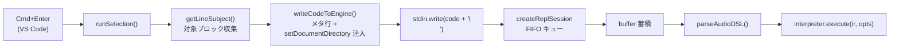
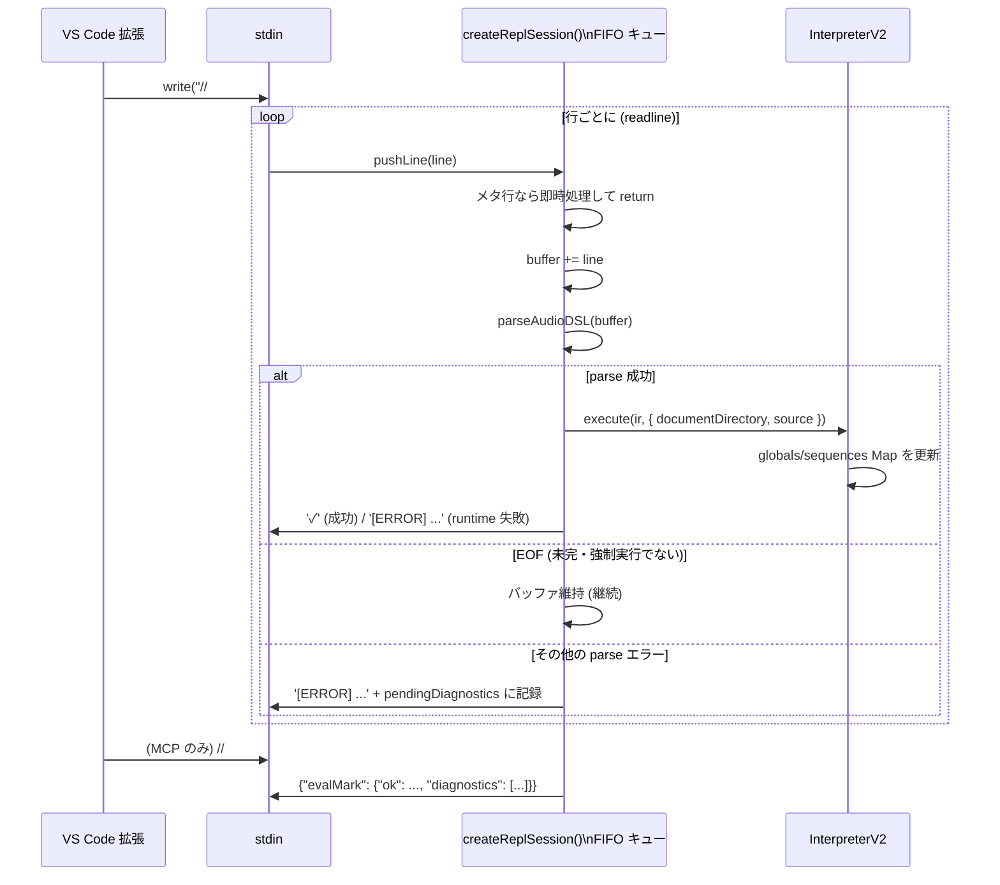

> **Note**: 本ページは 2026-09-01 時点での著者の reading の足跡です。code が真実、本ページはその時点の理解の snapshot に過ぎません。

# I-3. selective execution

Cmd+Enter でコードの一部だけを実行する — これが OrbitScore の中心的な操作です。TidalCycles の「選択評価」に相当するこの仕組みは、VS Code 拡張とエンジンの 2 プロセスにまたがって実現されています。この章では、キー操作からエンジンでの実行完了まで、どのようにコードが流れるかを追います。

## 2026-09 時点の drift

本章の初版は 2026-05-05 の snapshot (0a4b598) に対して書かれました。2026-09-01 (69dc968) のコードでは「拡張が送るコードを決め、stdin に書き、エンジンの readline がバッファして parse → execute する」という骨格は同じですが、中身はかなり入れ替わっています。

- **stdin への書き込みは `writeCodeToEngine()` に集約された**。エディタの `runSelection()` と MCP の `evaluate_orbitscore` が同じ関数を通ります (`packages/vscode-extension/src/extension.ts:3000-3032`)
- **`//#documentDirectory <path>` メタ行を DSL の前に付ける** ようになった (2026-07-17 の #456)。`import` は statements より先に評価されるため、DSL として注入する `global.setDocumentDirectory(...)` では間に合わず、帯域外のメタ行で先渡しします
- **REPL の行処理が `createReplSession()` に切り出され、FIFO の promise チェーンで直列化された** (2026-07-17 の #476)。readline は 1 チャンクの複数行を同 tick で連発するため、素朴な async ハンドラでは共有バッファが競合していました
- **「未完の入力か」の判定は parse エラーの `\bEOF\b` だけ** になった (2026-08 の #607 / #612)。2026-05 版の `Expected RPAREN` 一致は「行の途中の本物の構文エラー」まで未完扱いにしてセッションを沈黙させていました
- **メタ行の語彙が増えた**: `//#selectAudioDevice` (#484)、`//#savePluginState` (#562)、`//#pluginUi` (#474)、`//#evalMark` (#614)。いずれも DSL バッファには積まず、即時処理して相関 ID 付きの 1 行 JSON を stdout に返します
- **評価結果が呼び出し元に返る** ようになった (#614)。parse / runtime の診断を `pendingDiagnostics` に溜め、`//#evalMark` の到達時にまとめて返します。MCP の `evaluate_orbitscore` はこれを待ってから `ok` を決めます
- **engine の spawn は `ORBITSCORE_ENGINE` env を必ず明示する** ようになった (cutover 後の #377)。既定は Rust daemon で、`repl` サブコマンドの起動シーケンスは変わりません

## 全体の流れ


```mermaid
flowchart LR
  key["Cmd+Enter\n(VS Code)"]
  rs["runSelection()"]
  sub["getLineSubject()\n対象ブロック収集"]
  inj["writeCodeToEngine()\nメタ行 + setDocumentDirectory 注入"]
  stdin["stdin.write(code + '\\n')"]
  q["createReplSession\nFIFO キュー"]
  buf["buffer 蓄積"]
  parse["parseAudioDSL()"]
  exec["interpreter.execute(ir, opts)"]

  key --> rs
  rs --> sub
  sub --> inj
  inj --> stdin
  stdin --> q
  q --> buf
  buf --> parse
  parse --> exec
```

VS Code 拡張側が「送るコードを決める」、エンジン側が「受け取って実行する」という役割分担です。

## エンジン起動: repl サブコマンド

まず、エンジンがどう起動しているかを確認しておきましょう。`startEngine()` では引数に `'repl'` を指定して Node プロセスを spawn します。

```typescript
// packages/vscode-extension/src/extension.ts:2112-2164 (env の組み立てを省略)
  // Build args
  const args = ['repl']
  if (audioDevice && audioDevice !== '__default__') {
    args.push('--audio-device', audioDevice)
  }
  if (effectiveDebugMode) {
    args.push('--debug')
  }
  // ...
  // Spawn engine process
  try {
    engineProcess = child_process.spawn('node', [enginePath, ...args], {
      cwd: workspaceRoot,
      stdio: ['pipe', 'pipe', 'pipe'],
      env,
    })
```

`stdio: ['pipe', 'pipe', 'pipe']` がポイントです。stdin、stdout、stderr がすべてパイプで接続されるため、拡張側から `engineProcess.stdin.write(...)` でコードを流し込めます。省略した部分では `env.ORBITSCORE_ENGINE` にバックエンド種別を明示しています ([0-2](/orientation/architecture-overview) 参照)。`repl` サブコマンドを受けたエンジンは `startREPLMode()` を呼び出します。

```typescript
// packages/engine/src/cli/repl-mode.ts:30-53
export async function startREPLMode(options: REPLOptions = {}): Promise<void> {
  console.log('🎵 OrbitScore Audio Engine')
  console.log('✅ Initialized')

  // Create a global interpreter
  const globalInterpreter = new InterpreterV2()
  // 🔴 #607: startREPLMode() は返らないので、戻り値経由では shutdown ハンドラに
  // 届かない。生成した時点で publish する（詳細は active-interpreter.ts）。
  setActiveInterpreter(globalInterpreter)

  // §L1 (#229): session-log は 2.0.0 では dormant（既定 off）。file-scoped ログが
  // 複数ファイルをまたぐライブセッションに合わない設計ミスマッチのため、session-scoped で
  // 再設計するまで明示 opt-in に退避（writer/API/ユニットは保持・resurrect 可）。
  // 詳細・redesign 北極星: docs/development/POST_2.0_ROADMAP_NOTES.md
  if (shouldEnableSessionLog()) {
    globalInterpreter.enableSessionLog({ cwd: process.cwd() })
  }

  // Boot the audio engine backend once at startup with optional audio device
  await globalInterpreter.boot(options.audioDevice)

  console.log('🎵 Live coding mode')
  await startREPL(globalInterpreter)
}
```

`InterpreterV2` のインスタンスが 1 つ作成され、起動中ずっと生き続けます。このインスタンスが REPL セッション全体の状態 (`globals` / `sequences` の Map) を保持することで、Cmd+Enter のたびに前回の状態が維持されます。`setActiveInterpreter()` は、この関数が返らないために戻り値で渡せない interpreter を shutdown ハンドラへ公開するための仕組みです (#607)。

## VS Code 側: runSelection() のテキスト収集

Cmd+Enter で起動するのが `runSelection()` 関数です。まず「何を送るか」を決める部分を見ます。

### 選択範囲がある場合

選択テキストが空でなければシンプルにその内容を使います。

```typescript
// packages/vscode-extension/src/extension.ts:2735-2738
  if (!selection.isEmpty) {
    text = editor.document.getText(selection)
    executionRange = new vscode.Range(selection.start, selection.end)
  } else {
```

### 選択なし: subject ベースのブロック収集

選択がない場合、カーソル行の「主語 (subject)」を判定して、ドキュメント全体から同じ subject を持つ行をすべて集めます。

subject を判定する関数が `getLineSubject()` です。

```typescript
// packages/vscode-extension/src/extension.ts:2702-2715
function getLineSubject(lineText: string): string | null {
  const trimmed = lineText.trim()
  if (!trimmed || trimmed.startsWith('//')) return null

  // var <name> = init ...
  const varMatch = trimmed.match(/^var\s+(\w+)\s*=/)
  if (varMatch) return varMatch[1]

  // <name>.method(...)
  const dotMatch = trimmed.match(/^(\w+)\./)
  if (dotMatch) return dotMatch[1]

  return null
}
```

`var kick = init global.seq` なら `'kick'` を返し、`kick.audio("kick.wav")` なら同じく `'kick'` を返します。これにより、1 変数に関連するすべての行が 1 つのブロックとして扱われます。`null` が返るのは空行・コメント行・トランスポートコマンド (`RUN()` など) です。

subject が見つかった場合は、ドキュメント全体をスキャンしてその subject を持つ行を収集します。さらに、括弧の対応が取れていない行 (複数行にまたがる呼び出し) は次の行まで取り込み続ける仕組みになっています (extension.ts:2755-2769 参照)。

subject が `null` の場合 — つまり `RUN(kick, snare)` のようなスタンドアロンコマンド — は、カーソル行だけ (括弧が閉じるまで) を収集します (extension.ts:2786-2809)。

### writeCodeToEngine(): メタ行と setDocumentDirectory の注入

送るコードが確定したあと、`writeCodeToEngine()` がドキュメントのディレクトリパスを 2 通りの方法で engine に伝えます。`audioPath()` / `audio()` の相対パス解決、そして `import` の基準ディレクトリ (IM.6) に使われます。

```typescript
// packages/vscode-extension/src/extension.ts:3001-3033
function writeCodeToEngine(rawCode: string, documentDir: string | undefined): boolean {
  if (!engineProcess || !engineProcess.stdin || !engineProcess.stdin.writable) {
    // 呼び出し側ガード通過後に engine が死んだ稀な競合。黙って no-op すると
    // palette 実行では「実行したのに無反応」になるので、ここで必ず痕跡を残す。
    outputChannel?.appendLine('⚠️ Engine stdin is not writable — code was NOT sent (engine died?)')
    return false
  }
  let codeToSend = rawCode
  if (documentDir) {
    // I3 (#456): REPL メタ行で基準ディレクトリを帯域外で先渡しする。import 文（IM.2）は
    // どの statement よりも先に評価されるため、下の DSL 注入（statements として実行）では
    // 間に合わない — メタ行だけが import の基準（IM.6）を初回 eval から確定できる。
    // DSL 注入も残す（audio() 等の既存経路の実績を変えない・同値の冪等再設定）。
    codeToSend = `//#documentDirectory ${documentDir}\n` + codeToSend
    const setDirCommand = `global.setDocumentDirectory("${documentDir.replace(/\\/g, '\\\\')}")`
    const globalInitMatch = codeToSend.match(/(var\s+global\s*=\s*init\s+GLOBAL[^\n]*)/)
    if (globalInitMatch) {
      const insertPos = globalInitMatch.index! + globalInitMatch[0].length
      codeToSend =
        codeToSend.slice(0, insertPos) + '\n' + setDirCommand + codeToSend.slice(insertPos)
      globalInitialized = true
    } else if (globalInitialized) {
      codeToSend = setDirCommand + '\n' + codeToSend
    }
  }

  // Debug: log what we're sending if in debug mode (check status bar text for 🐛)
  if (statusBarItem?.text.includes('🐛')) {
    outputChannel?.appendLine(`📤 Sending: ${JSON.stringify(codeToSend)}`)
  }
  engineProcess.stdin.write(codeToSend + '\n')
  return true
}
```

2 通りの伝え方を整理すると:

1. **メタ行 `//#documentDirectory <path>`** — 常に先頭に付く。`//` コメントなので DSL としては無害 (tokenizer が読み飛ばす) で、engine 側の REPL が値だけ抜き出す
2. **DSL 注入 `global.setDocumentDirectory(...)`** — 条件付き。`var global = init GLOBAL` を含む評価なら init の直後に挿入して `globalInitialized` フラグを立て、それ以降の評価なら先頭に prepend する。`globalInitialized` が `false` で `init` 行も無い評価には注入しない (`global` 未定義のためエラー回避)

なぜ 2 つ要るのかというと、`import` が statements より先に評価されるからです。DSL 注入は statement として実行されるので、初回の評価で `import` が動く時点ではまだ基準ディレクトリが設定されていません。メタ行だけがそれを先渡しできます。DSL 注入を残しているのは、`audio()` などの既存経路の実績を変えないためです。

`globalInitialized` フラグは engine プロセスのライフサイクルにバインドされ、起動・再起動・activate のタイミングでリセットされます (extension.ts:110-112, 292, 2173)。

`process.cwd()` へのフォールバックは engine 側に存在しません (Issue #168)。documentDirectory が未設定で相対パスが指定された場合は明示エラーになります。

### 送信と flash

`runSelection()` は `writeCodeToEngine()` の戻り値を見て、送れたときだけ視覚フィードバックを出します。

```typescript
// packages/vscode-extension/src/extension.ts:2874-2881
  if (!writeCodeToEngine(trimmedText, path.dirname(editor.document.uri.fsPath))) {
    return // stdin 不達（engine 死の競合）— 送れていないのに flash で「実行した」と見せない
  }
  // Scroll the executed range into view before flashing it: subject-block
  // auto-detection (no explicit selection) never reveals, so an agent-driven run
  // that lands on an off-screen line would otherwise flash outside the viewport.
  editor.revealRange(executionRange, vscode.TextEditorRevealType.InCenterIfOutsideViewport)
  flashLines()
```

`flashLines()` でエディタの実行行をフラッシュ (点滅) させます。MCP の `run_selection` 経由で画面外の行が実行される場合に備えて、flash の前に `revealRange` で範囲を表示域に入れます。

MCP の `evaluate_orbitscore` も同じ `writeCodeToEngine()` を呼びますが、`documentDir` には (アクティブエディタが無いので) ワークスペースの先頭フォルダを渡します (extension.ts:3040-3047)。

## エンジン側: REPL の FIFO キューとバッファ

stdin に書き込まれたコードは、エンジン側の `startREPL()` が受けます。2026-05 版では `rl.on('line', async ...)` の中に全ロジックがありましたが、この版では `createReplSession()` に切り出されています。

```typescript
// packages/engine/src/cli/repl-mode.ts:519-539
export async function startREPL(interpreter: InterpreterV2): Promise<void> {
  // 🔴 #607: この関数も返らない。play/run/eval から REPL に入る経路でも publish する。
  setActiveInterpreter(interpreter)
  const rl = readline.createInterface({
    input: process.stdin,
    output: process.stdout,
    terminal: false,
  })

  const session = createReplSession(interpreter)
  rl.on('line', (line) => session.pushLine(line))

  // Keep process alive indefinitely for interactive REPL
  // This is intentional: REPL mode is designed to run continuously,
  // listening for user input on stdin until the user terminates with Ctrl+C.
  // The readline interface will continue to emit 'line' events as long as
  // the process is alive. The shutdown handlers in shutdown.ts will handle
  // graceful termination of the audio engine backend when the user exits.
  // Note: This promise never resolves, which is the expected behavior.
  await new Promise(() => {})
}
```

`readline.createInterface` は stdin を行単位で読みます。`terminal: false` は対話端末ではない (パイプ入力) ことを示します。各行は `session.pushLine(line)` に渡すだけで、`'line'` ハンドラ自体は同期的です。末尾の `new Promise(() => {})` は永遠に解決しない Promise で、プロセスが終了せず readline が `'line'` イベントを発火し続けるようにしています。

### なぜ直列化が要るのか

`createReplSession()` の設計理由はコメントに凝縮されています。

```typescript
// packages/engine/src/cli/repl-mode.ts:290-299
/**
 * REPL の行処理セッション（#476 で分離・単体テスト可能に）。
 *
 * 【直列化の根拠 — #476】readline は 1 チャンクの複数行を同 tick で 'line' 連発する。
 * async ハンドラは互いを待たないため、素朴な実装では共有 buffer が「実行中の execute が
 * 終わる前に後続行で伸びる → 累積 buffer の重複実行・完了時 clear との競合で行が失われる」
 * （遅い await = plugin ロードで顕在化し、エディタの複数行実行が silent に壊れる）。
 * `pushLine` は FIFO promise チェーンに積むだけで、1 行の処理（execute 完了と buffer
 * 更新まで）が終わってから次の行に進む。`idle()` はキュー drain を待つ（テスト用）。
 */
```

拡張は複数行のブロックを 1 回の `stdin.write` で送ります。readline はそれを行に割って同じ tick で `'line'` を連発するので、2026-05 版の `async (line) => {...}` ハンドラは互いを待たず、`await interpreter.execute(ir)` の途中で後続行が `buffer` を伸ばしてしまう競合がありました。プラグインのロードのような遅い await で顕在化し、複数行実行が黙って壊れていた、というのが #476 の背景です。

セッションの状態は closure に閉じています。

```typescript
// packages/engine/src/cli/repl-mode.ts:300-309
export function createReplSession(interpreter: InterpreterV2): {
  pushLine: (line: string) => void
  idle: () => Promise<void>
} {
  let buffer = ''
  let emptyLineCount = 0
  // メタ行で受けた基準ディレクトリ（セッション内で最後の値が持続 — エディタ側は eval ごとに
  // 現在ファイルの dir を送るので、ファイル切替にも追従する）。
  let sessionDocumentDirectory: string | undefined
  let lineQueue: Promise<void> = Promise.resolve()
```

`pushLine()` は行を promise チェーンに繋ぐだけです。

```typescript
// packages/engine/src/cli/repl-mode.ts:497-516
  return {
    pushLine(line: string): void {
      // handleLine は内部で全エラーを捕捉するが、防御としてチェーン自体も reject を握る
      // （1 行の異常で以後の入力が全停止しないように）。
      queuedLines++
      lineQueue = lineQueue
        .then(() => {
          queuedLines--
          return runWithStallReport(line)
        })
        .catch((e) => {
          // handleLine は既知エラーを内部で捕捉する。ここに来るのは想定外のみ —
          // 黙って握ると REPL が silent に劣化するため、必ず痕跡を残して続行する。
          console.error(`[ERROR] unexpected REPL queue failure: ${e?.message ?? e}`)
        })
    },
    idle(): Promise<void> {
      return lineQueue
    },
  }
```

`runWithStallReport()` は `handleLine()` を包み、1 行の処理が 60 秒 (daemon の `CHILD_READY_TIMEOUT` に合わせた値) を超えて終わらないあいだ、stderr に「キューが詰まっている」と繰り返し報告します (repl-mode.ts:472-495)。打ち切りはしません — instrument を 6 本 attach するような正当に長い処理があるためで、変わるのは「沈黙して詰まる」が「詰まっている事実が `get_log` に出る」になることです (#607)。

### 1 行ずつ受け取る `handleLine()`

`handleLine()` は先にメタ行を振り分け、残りを DSL バッファに積みます。DSL 部分の末尾は次のとおりです。

```typescript
// packages/engine/src/cli/repl-mode.ts:457-470
    if (line.trim() === '') {
      emptyLineCount++
      buffer += '\n'
      // 2+ 連続空行 = バッファ確定・強制実行
      if (emptyLineCount >= 2 && buffer.trim()) {
        await executeCurrentBuffer(true)
        emptyLineCount = 0
      }
      return
    }
    emptyLineCount = 0
    buffer += line + '\n'
    await executeCurrentBuffer(false)
  }
```

空行が 2 つ以上続くとバッファを強制実行し (`clearOnIncomplete = true`)、それ以外の行はバッファに足してから試しに実行します (`clearOnIncomplete = false`)。

### try-parse と「未完」の判定

実行の本体が `executeCurrentBuffer()` です。parse と execute を別々の `try` に分けているのが要点で、その理由もコメントに残っています。

```typescript
// packages/engine/src/cli/repl-mode.ts:333-384
  async function executeCurrentBuffer(clearOnIncomplete: boolean): Promise<void> {
    const code = buffer.trim()
    if (!code) {
      buffer = ''
      emptyLineCount = 0
      return
    }
    // 🔴 #612 レビュー: **「未完」判定はパース段のエラーにだけ適用する。**
    // 以前は parse と execute を 1 つの try で覆っていたため、`/\bEOF\b/` が
    // **実行時エラーの文言にも作用**していた。実行時エラーはユーザー由来の文字列
    // （ファイルパス・識別子・daemon のエラー echo）を含むので、たとえば
    // `kick.audio("takes/EOF.wav")` の ENOENT が「未完入力」と誤判定され、
    // **完結した行が silent に保留されてセッションが停止する** — #608 と同じ故障が
    // 別経路で再発する。パースが終わった時点で「入力が完結していない」possibility は消える。
    let ir: ReturnType<typeof parseAudioDSL>
    try {
      ir = parseAudioDSL(code)
    } catch (error: any) {
      // 不完全入力（複数行の途中）は buffering を続ける（強制実行時は除く）。
      //
      // 🔴 #607: 「未完」と判定してよいのは**パーサが入力の終端（EOF）に達した**場合だけ。
      // 旧判定は `Expected RPAREN` を文字列一致で「未完」に含めていたが、このメッセージは
      // `Expected RPAREN but got AT`（= 行の**途中**に不正トークンがある本物の構文エラー）
      // でも出る。構文エラーを「未完」として silent に保留すると、以後の全入力が未完
      // バッファへ合体して**セッション全体が沈黙のまま永久停止**する — 実機で
      // `[1,5,9]@v+10`（パーサ未対応のスタック @v）1 行がライブセッションを丸ごと
      // 止めた（2026-08-01）。トークンが尽きたのでなければ、待っても文は完結しない。
      if (!clearOnIncomplete && /\bEOF\b/.test(String(error.message ?? ''))) {
        return
      }
      console.error(`[ERROR] ${error.message}`)
      pendingDiagnostics.push({ kind: 'parse', message: String(error.message) })
      buffer = ''
      return
    }

    // ここから先は「入力は完結している」— 失敗しても保留せず必ず報告してバッファを捨てる。
    try {
      const metaDir = extractDocumentDirectoryMeta(code)
      if (metaDir) sessionDocumentDirectory = metaDir
      await interpreter.execute(ir, {
        source: code,
        evalSource: 'human',
        documentDirectory: sessionDocumentDirectory,
      }) // §L1
      console.log('✓') // Success indicator
    } catch (error: any) {
      console.error(`[ERROR] ${error.message}`)
      pendingDiagnostics.push({ kind: 'runtime', message: String(error.message) })
    }
    buffer = ''
  }
```

流れを整理すると:

- **parse 成功** → メタ行から基準ディレクトリを更新し、`interpreter.execute(ir, {...})` を呼んで `✓` を出力、バッファをクリア
- **parse 失敗 (メッセージに `EOF` を含み、強制実行でない)** → バッファを維持して次の行を待つ
- **parse 失敗 (その他)** → `[ERROR]` を出力し、`pendingDiagnostics` に `parse` として記録、バッファをクリア
- **execute 失敗** → `[ERROR]` を出力し、`runtime` として記録、バッファをクリア (保留はしない)

`EOF` というエラーは [I-1](/pipeline/text-to-ast) で見た `ParserUtils.expect()` が投げる `"Expected X but got EOF at line Y, column Z"` を指しています。複数行にまたがる呼び出し (`play(\n  1, 2, 3\n)` のような) では、閉じ括弧が来るまでこのバッファリングが続きます。

面白いのは、判定を `EOF` だけに絞った経緯です。2026-05 版は `Expected RPAREN` も未完扱いにしていましたが、それは `Expected RPAREN but got AT` のような「行の途中の本物の構文エラー」にもマッチします。構文エラーを未完として保留すると、以後の入力がすべて未完バッファに合体し、セッションが沈黙したまま止まる — 実機で 1 行の `[1,5,9]@v+10` がライブセッションを丸ごと止めた、とコメントが記録しています (2026-08-01)。トークンが尽きたのでなければ、待っても文は完結しません。

同じ理屈で、`EOF` の判定を実行時エラーに効かせてはいけません。`kick.audio("takes/EOF.wav")` の ENOENT が未完扱いになる、というのが #612 のレビューで指摘された故障シナリオです。

### メタ行: 帯域外チャネル

`//#documentDirectory` を DSL の中から抜き出すのが `extractDocumentDirectoryMeta()` です。

```typescript
// packages/engine/src/cli/repl-mode.ts:64-79
/**
 * REPL メタ行 `//#documentDirectory <path>`（I3, #456）: エディタ統合（VS Code 拡張）が
 * 「開いているファイルのディレクトリ」を eval 単位で伝えるための帯域外チャネル。DSL 注入
 * （`global.setDocumentDirectory(...)`）は statements として import より後に評価されるため、
 * import の基準ディレクトリ（IM.6）はこのメタ行でしか先渡しできない。`//` コメントなので
 * DSL としても無害（tokenizer が読み飛ばす）— 戻り値では code から取り除かず、値だけ抽出する。
 * 複数あれば最後の値が勝つ。
 */
export function extractDocumentDirectoryMeta(code: string): string | undefined {
  let dir: string | undefined
  for (const line of code.split('\n')) {
    const m = line.match(/^\s*\/\/#documentDirectory\s+(.+?)\s*$/)
    if (m) dir = m[1]
  }
  return dir
}
```

ほかのメタ行 (`//#selectAudioDevice` / `//#savePluginState` / `//#pluginUi` / `//#evalMark`) は `handleLine()` の先頭で個別に処理され、DSL バッファには積まれません。どれも `//` で始まるので、万一 DSL として評価されても tokenizer がコメントとして読み飛ばす、という安全側の設計です。

### `//#evalMark`: 評価結果を返す

`//#evalMark <json>` は「投入は以上、結果を返せ」という提出の境界です。REPL は行を FIFO で処理するので、このマーカーに到達した時点で先行コードの評価は完了しています。

```typescript
// packages/engine/src/cli/repl-mode.ts:402-424
    if (EVAL_MARK_META_RE.test(line)) {
      // 🔴 マーカーは「投入は以上、結果を返せ」という**提出の境界**である。
      // 未完のままバッファに残った入力を放置すると「何も実行していないのに ok」を返して
      // しまう（#614 の実害そのもの）。空行2連と同じく強制実行してから報告する。
      if (buffer.trim()) {
        await executeCurrentBuffer(true)
        emptyLineCount = 0
      }
      // ここまでで先行コードの評価は完了している（FIFO）。溜まった診断を返して空にする。
      const requestId = recoverMetaRequestId(line)
      const diagnostics = pendingDiagnostics
      pendingDiagnostics = []
      if (requestId) {
        console.log(
          JSON.stringify({
            evalMark: { requestId, ok: diagnostics.length === 0, diagnostics },
          }),
        )
      } else {
        console.error('[ERROR] //#evalMark requires a non-empty string requestId')
      }
      return
    }
```

MCP の `evaluate_orbitscore` はコードを書いた直後にこのマーカーを送り、`{"evalMark": {...}}` の行を待ってから `ok` を決めます (extension.ts:3048-3075)。#614 より前の版は「stdin へ届いた」時点で `ok: true` を返していたため、`Variable not found: global` が出ていても agent は先へ進んでしまっていました。エディタの `runSelection()` はこのマーカーを送りません — 人間は Output パネルの `[ERROR]` を見るからです。

## 状態の保持: Map の同一性

Cmd+Enter を何度押しても状態が保たれる理由は、`InterpreterV2` のインスタンスが 1 つだからです。`startREPLMode()` で作られた `globalInterpreter` が `startREPL()` に渡され、`createReplSession()` の closure に閉じ込められて、以後はずっと同じ参照を使い続けます。

[I-2](/pipeline/evaluation) で説明したとおり、`globals` と `sequences` は `Map` で、エントリは変数名をキーとして管理されます。同じ変数名で再評価するたびに `Map.get()` で既存のインスタンスが見つかり、新規作成せずに再利用されます。シーケンスの `_gainDb`/`_pan` だけリセットされ、それ以外のパラメータ (接続済みのオーディオファイル、テンポ等) はそのまま残ります。


```mermaid
sequenceDiagram
  participant VSCode as VS Code 拡張
  participant stdin
  participant Q as createReplSession()\nFIFO キュー
  participant Interp as InterpreterV2

  VSCode->>stdin: write("//#documentDirectory ...\n" + code + "\n")
  loop 行ごとに (readline)
    stdin->>Q: pushLine(line)
    Q->>Q: メタ行なら即時処理して return
    Q->>Q: buffer += line
    Q->>Q: parseAudioDSL(buffer)
    alt parse 成功
      Q->>Interp: execute(ir, { documentDirectory, source })
      Interp->>Interp: globals/sequences Map を更新
      Q->>stdin: '✓' (成功) / '[ERROR] ...' (runtime 失敗)
    else EOF (未完・強制実行でない)
      Q->>Q: バッファ維持 (継続)
    else その他の parse エラー
      Q->>stdin: '[ERROR] ...' + pendingDiagnostics に記録
    end
  end
  VSCode->>stdin: (MCP のみ) //#evalMark {"requestId": ...}
  Q->>stdin: {"evalMark": {"ok": ..., "diagnostics": [...]}}
```

## 関連用語

- [subject ベースブロック評価](/glossary#subject-ベースブロック評価) — カーソル行の subject を起点としてブロックを収集する選択実行戦略
- [setDocumentDirectory](/glossary#setdocumentdirectory) — 実行前に作業ディレクトリをドキュメントのパスに合わせる注入処理
- [DSL](/glossary#dsl) — OrbitScore が定義するドメイン固有言語。REPL に送信されて評価される
- [flashLines()](/glossary#flashlines) — 実行ブロックを一時的にハイライトする VS Code 拡張の視覚フィードバック関数

## 次の深掘り候補

- `getLineSubject()` が null を返すケースの網羅 — コメント、空行、マルチワード行の扱い
- 括弧バランス追跡ロジックの詳細 (`parenBalance` カウンター) と文字列リテラル内の括弧の扱い
- `flashLines()` の実装詳細 — `flashCount`/`flashDuration`/`flashColor` 設定項目と whole-line 描画の理由 (#388)
- メタ行ブリッジの設計 — `DeviceSwitchBridge` / `PluginStateBridge` / `PluginUiBridge` / `EvalMarkBridge` が requestId で応答を相関させる仕組みと、engine 死亡時の drain
- `runWithStallReport()` の閾値 60 秒と daemon の `CHILD_READY_TIMEOUT` の対応関係
- `setDocumentDirectory` メソッドの `Global` クラス側での処理と、`process-file-import.ts` の `finally` による基準ディレクトリ復元
- 拡張の stdout 受け取り側 — `engine-lifecycle.ts` の `applyEngineStdoutChunk()` が `✓` / `[ERROR]` / playhead 行をどう分類し、stale なプロセスの出力を弾くか (#528)
- `ORBITSCORE_DEBUG` 環境変数による詳細ログの活用方法

## Sources

- `packages/vscode-extension/src/extension.ts:110-112` — `globalInitialized` フラグの宣言と用途
- `packages/vscode-extension/src/extension.ts:2044-2198` — `startEngine()`: pre-check → env → `stdio: ['pipe','pipe','pipe']` のプロセス起動
- `packages/vscode-extension/src/extension.ts:2701-2714` — `getLineSubject()` の正規表現マッチ
- `packages/vscode-extension/src/extension.ts:2716-2881` — `runSelection()` の全体フロー (選択 / subject ブロック / standalone / flash)
- `packages/vscode-extension/src/extension.ts:2734-2737` — 選択テキストがある場合のパス
- `packages/vscode-extension/src/extension.ts:2883-2907` — `writeCodeToEngine()` の設計コメント (注入条件と戻り値の意味)
- `packages/vscode-extension/src/extension.ts:3000-3032` — `writeCodeToEngine()`: メタ行 + `setDocumentDirectory` 注入と `stdin.write`
- `packages/vscode-extension/src/extension.ts:3040-3075` — `evaluateForAgent()`: MCP evaluate が `//#evalMark` で結果を待つ
- `packages/engine/src/cli/repl-mode.ts:30-53` — `startREPLMode()` と `InterpreterV2` インスタンス生成
- `packages/engine/src/cli/repl-mode.ts:64-93` — `extractDocumentDirectoryMeta()` / `extractSelectAudioDeviceMeta()`
- `packages/engine/src/cli/repl-mode.ts:290-331` — `createReplSession()` の設計コメントと closure 状態 (`pendingDiagnostics` 含む)
- `packages/engine/src/cli/repl-mode.ts:333-384` — `executeCurrentBuffer()`: parse / execute の分離と `EOF` 判定
- `packages/engine/src/cli/repl-mode.ts:386-470` — `handleLine()`: メタ行の振り分けと DSL バッファ
- `packages/engine/src/cli/repl-mode.ts:472-516` — `runWithStallReport()` と `pushLine()` の FIFO チェーン
- `packages/engine/src/cli/repl-mode.ts:519-539` — `startREPL()`: readline → `pushLine` と `await new Promise(() => {})`
- `docs/archive/WORK_LOG_2026-07.md` §6.266 (メタ行 #456, 2026-07-17)、§6.271 (FIFO 直列化 #476, 2026-07-17)
