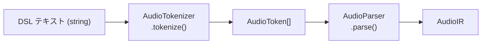
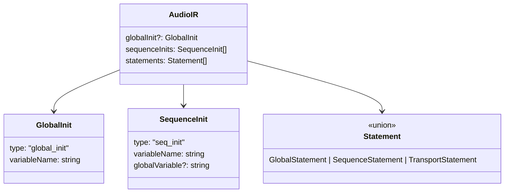

> **Note**: 本ページは 2026-05-05 時点での著者の reading の足跡です。code が真実、本ページはその時点の理解の snapshot に過ぎません。

# I-1. テキスト → AST

DSL のテキストが実際に実行されるまでの最初の関門が「パース」です。テキストをそのまま実行するのではなく、いったん構造化されたデータ (AST) に変換してから評価します。この章では、`parseAudioDSL()` という関数を入口として、字句解析と構文解析の 2 ステップがどう連携するかを追っていきます。

## パイプラインの全体像

テキストから AST まで、処理は大きく 2 段階に分かれています。



入口になるのは `parseAudioDSL()` 関数で、この 2 段階を順に呼び出すだけのシンプルな作りになっています。

```typescript
// audio-parser.ts:88-93
export function parseAudioDSL(source: string): AudioIR {
  const tokenizer = new AudioTokenizer(source)
  const tokens = tokenizer.tokenize()
  const parser = new AudioParser(tokens)
  return parser.parse()
}
```

`AudioTokenizer` と `AudioParser` という 2 つのクラスが順番に登場します。それぞれの責務を見ていきましょう。

## 字句解析: AudioTokenizer

字句解析 (Lexical Analysis) とは、文字の並びを「意味のあるかたまり」= トークン (Token) に切り分ける処理です。`AudioTokenizer` がこの役割を担います。

### トークンの種類

DSL では 18 種類のトークンタイプが定義されています。

```typescript
// types.ts:7-26
export type AudioTokenType =
  | 'VAR' // var keyword
  | 'INIT' // init keyword
  | 'BY' // by keyword (for meter)
  | 'GLOBAL' // GLOBAL constant
  | 'RUN' // RUN reserved keyword
  | 'LOOP' // LOOP reserved keyword
  | 'MUTE' // MUTE reserved keyword
  | 'IDENTIFIER' // variable names, method names
  | 'NUMBER' // numeric values
  | 'STRING' // string literals
  | 'DOT' // . (method call)
  | 'LPAREN' // (
  | 'RPAREN' // )
  | 'COMMA' // ,
  | 'EQUALS' // =
  | 'MINUS' // - (for negative numbers)
  | 'PERCENT' // % (for random range)
  | 'NEWLINE' // line break
  | 'EOF' // end of file
```

`VAR` `INIT` `GLOBAL` `RUN` `LOOP` `MUTE` のようなキーワードは `IDENTIFIER` (一般識別子) と区別して専用のタイプを持ちます。`IDENTIFIER` は変数名やメソッド名など、予約語以外の名前すべてに使われます。

各トークンは型だけでなく、ソース上の位置情報も持ちます。

```typescript
// types.ts:28-33
export type AudioToken = {
  type: AudioTokenType
  value: string
  line: number
  column: number
}
```

`line` と `column` が付いているのは、後で構文エラーが発生したときに「ソースの何行何列目で問題が起きたか」をユーザーに正確に伝えるためです。

### キーワード認識

`AudioTokenizer` が文字を読み進めるとき、英字から始まる文字列を見つけると識別子として読み取ります。そのあと、それが予約キーワードかどうかを `KEYWORDS` Set で照合します。

```typescript
// tokenizer.ts:17-27
  // Keywords that should be recognized
  private static readonly KEYWORDS = new Set([
    'var',
    'init',
    'by',
    'GLOBAL',
    'force',
    'RUN',
    'LOOP',
    'MUTE',
  ])
```

Set を使ったルックアップは `O(1)` なので、キーワードの数が増えても速度は変わりません。実装を読むと、意外とシンプルな仕組みで動いていることがわかります。

### シングルパススキャン

`tokenize()` メソッドは入力文字列をひとつずつ読み進めながら、一度のパスで全トークンを生成します (シングルパス)。

```typescript
// tokenizer.ts:111-129
  public tokenize(): AudioToken[] {
    const tokens: AudioToken[] = []

    while (!this.isEOF()) {
      this.skipWhitespace()
      this.skipComment()

      if (this.isEOF()) break

      const line = this.line
      const column = this.column
      const char = this.peek()

      // Newline
      if (char === '\n') {
        tokens.push({ type: 'NEWLINE', value: '\n', line, column })
        this.advance()
        continue
      }

      // Numbers
      if (/[0-9]/.test(char)) {
        const num = this.readNumber()
        tokens.push({ type: 'NUMBER', value: num, line, column })
        continue
```

ポイントは、各トークンを push する前に `const line = this.line / const column = this.column` を先に取っておいている点です。トークンの「開始位置」を確実に記録しています。また、`skipWhitespace()` と `skipComment()` が行のはじめに呼ばれ、空白と `//` コメントをスキップしてから本処理に入ります。

ちなみに `NEWLINE` はスキップせずトークンとして残すのが特徴です。DSL では改行が文のセパレータとして意味を持つため、後続のパーサーが `skipNewlines()` で明示的に読み飛ばせるよう残してあります。

## 構文解析: AudioParser と AudioIR

トークン列ができたら、次は構文解析 (Syntactic Analysis) です。`AudioParser.parse()` がトークン列を読んで `AudioIR` に組み上げます。

### AudioIR とは

AudioIR (Audio Intermediate Representation) は、DSL テキストをパースした結果を格納する構造体です。

```typescript
// types.ts:36-40
export type AudioIR = {
  globalInit?: GlobalInit
  sequenceInits: SequenceInit[]
  statements: Statement[]
}
```

3 つのフィールドの意味を整理すると:

| フィールド | 意味 | 例 |
|---|---|---|
| `globalInit?` | `var global = init GLOBAL` 宣言 (省略可) | `{ type: 'global_init', variableName: 'global' }` |
| `sequenceInits[]` | `var seq1 = init global.seq` 宣言の配列 | `[{ type: 'seq_init', variableName: 'seq1', ... }]` |
| `statements[]` | テンポ設定・再生・transport コマンドなど | `[{ type: 'sequence', target: 'seq1', method: 'play', ... }]` |



### AudioParser は薄いラッパー

`AudioParser` クラス自体は `@deprecated` マークが付いていて、「parser モジュール群への薄いラッパー」と説明されています。実際の構文解析は `StatementParser` クラスが担います。

`parse()` の処理は、トークン列を先頭から読みながら `StatementParser` を繰り返し呼び出し、戻ってきた statement を `globalInit` / `sequenceInits` / `statements` の適切なフィールドに振り分けるだけです (audio-parser.ts:51-82 参照)。

### StatementParser: 文を識別する

では、`StatementParser.parseStatement()` の中を見てみましょう。

```typescript
// parse-statement.ts:25-47
  parseStatement(): { statement: any; newPos: number } {
    const token = ParserUtils.current(this.tokens, this.pos)

    // Variable declaration: var x = init GLOBAL
    if (token.type === 'VAR') {
      return this.parseVarDeclaration()
    }

    // Reserved keywords: RUN(), LOOP(), MUTE()
    if (token.type === 'RUN' || token.type === 'LOOP' || token.type === 'MUTE') {
      return this.parseReservedKeyword()
    }

    // Method calls: global.tempo(140) or seq1.play(0)
    if (token.type === 'IDENTIFIER') {
      return this.parseMethodCall()
    }

    // Skip unknown tokens
    const advanceResult = ParserUtils.advance(this.tokens, this.pos)
    this.pos = advanceResult.newPos
    return { statement: null, newPos: this.pos }
  }
```

先頭トークンの種類によってディスパッチしています。`VAR` なら変数宣言、`RUN`/`LOOP`/`MUTE` ならトランスポートコマンド、`IDENTIFIER` ならメソッド呼び出し (テンポ設定や再生命令) です。

### パーサーは global/sequence を区別しない

面白いのは、`<識別子>.メソッド(引数)` という形の文を解析したとき、**パーサーは常に `type: 'sequence'` を返す** という設計です。

```typescript
// parse-statement.ts:245-253
    // Note: We cannot determine if target is global or sequence at parse time
    // since variable names are arbitrary. Use 'sequence' type and let the interpreter
    // determine the actual type by checking state.globals and state.sequences.
    const result: any = {
      type: 'sequence',
      target,
      method,
      args: argsResult.args,
    }
```

コードのコメントにも書かれているとおり、パース時点では変数名が global なのか sequence なのかを判別する手段がありません。`global.tempo(140)` も `seq1.play(0)` も、パーサーにとってはどちらも `IDENTIFIER.IDENTIFIER(...)` という同じパターンです。どちらに属するかを判断するのはインタープリターの仕事で、実行時に状態 (`state.globals` / `state.sequences`) を参照して初めてわかります。この判断の仕組みは [I-2. AST 評価モデル](/pipeline/evaluation) で詳しく扱います。

## エラー位置情報: ParserUtils.expect()

パースに失敗したとき、どこで問題が起きたかをユーザーに伝えるのが `ParserUtils.expect()` の役割です。

```typescript
// parser-utils.ts:45-57
  static expect(
    tokens: AudioToken[],
    pos: number,
    type: AudioTokenType,
  ): { token: AudioToken; newPos: number } {
    const token = ParserUtils.current(tokens, pos)
    if (token.type !== type) {
      throw new Error(
        `Expected ${type} but got ${token.type} at line ${token.line}, column ${token.column}`,
      )
    }
    return ParserUtils.advance(tokens, pos)
  }
```

`AudioToken` に `line` / `column` が埋め込まれていたのはこのためです。構文エラーが発生すると「Expected RPAREN but got EOF at line 3, column 12」のようなメッセージが生成されます。この `'EOF'` や `'Expected RPAREN'` という文字列は、後段の REPL バッファリング処理でも重要な役割を果たします。詳しくは [I-3. selective execution](/pipeline/selective-execution) で扱います。

## まとめ: パイプラインの責務分離

この章で見てきたことを整理すると:

- `AudioTokenizer` — 文字列 → `AudioToken[]` への変換。位置情報の記録を担う
- `AudioParser` / `StatementParser` — トークン列 → `AudioIR` への変換。文の種類を識別して振り分ける
- `AudioIR` — `globalInit`, `sequenceInits`, `statements` の 3 フィールドを持つ中間表現
- パーサーは global/sequence を区別しない — 実行時にインタープリターが判断する

この中間表現が次章のインタープリターに渡されます。

## 次の深掘り候補

- `AudioTokenizer` が内部で使う正規表現の詳細 (tokenize ループ全体を表形式でまとめる)
- 数値リテラルの読み取り (`readNumber()`) と `-Infinity` / `-inf` の特殊ケース処理
- `parseVarDeclaration()` の全分岐 — `init GLOBAL` と `init global.seq` の区別
- `parseMethodChain()` によるメソッドチェーン (.audio(...).chop(...) など) の構造
- `ExpressionParser` の引数解析 — `beat(n by m)` や乱数 `r` / `rN%M` 構文の詳細
- エラーリカバリー戦略 — 現在はエラー即スロー、stack 巻き戻しの検討余地

## Sources

- `packages/engine/src/parser/types.ts:7-26` — `AudioTokenType` 全 18 種の定義
- `packages/engine/src/parser/types.ts:28-33` — `AudioToken` (位置情報付きトークン)
- `packages/engine/src/parser/types.ts:36-40` — `AudioIR` (パース結果の中間表現)
- `packages/engine/src/parser/types.ts:53` — `Statement` union 型定義
- `packages/engine/src/parser/tokenizer.ts:11-27` — `AudioTokenizer` クラスと `KEYWORDS` Set
- `packages/engine/src/parser/tokenizer.ts:111-135` — `tokenize()` メインループ冒頭
- `packages/engine/src/parser/audio-parser.ts:51-83` — `AudioParser.parse()` のループと振り分け
- `packages/engine/src/parser/audio-parser.ts:88-93` — `parseAudioDSL()` エントリ関数
- `packages/engine/src/parser/parse-statement.ts:25-47` — `parseStatement()` ディスパッチ
- `packages/engine/src/parser/parse-statement.ts:245-253` — 常に `type: 'sequence'` を返す設計とその理由コメント
- `packages/engine/src/parser/parser-utils.ts:45-57` — `expect()` によるエラー位置報告
