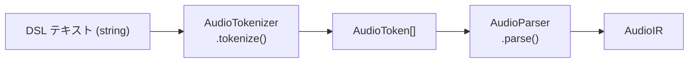
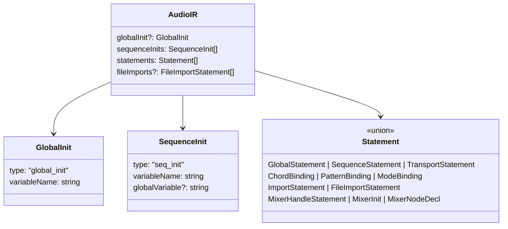

> **Note**: 本ページは 2026-09-01 時点での著者の reading の足跡です。code が真実、本ページはその時点の理解の snapshot に過ぎません。

# I-1. テキスト → AST

DSL のテキストが実際に実行されるまでの最初の関門が「パース」です。テキストをそのまま実行するのではなく、いったん構造化されたデータ (AST) に変換してから評価します。この章では、`parseAudioDSL()` という関数を入口として、字句解析と構文解析の 2 ステップがどう連携するかを追っていきます。

## 2026-09 時点の drift

本章の初版は 2026-05-05 の snapshot (0a4b598) に対して書かれました。2026-09-01 (69dc968) のコードと突き合わせると、パイプラインの骨格 (tokenizer → `StatementParser` → `AudioIR`) は変わっていませんが、語彙がかなり増えています。本章はその骨格を読む章なので、増えた語彙は以下に列挙するにとどめ、それぞれの深掘りは末尾の候補に回します。

- **トークンの種類が 19 → 32 に増加**: pitch DSL 用の `ACCIDENTAL` / `CARET` / `TILDE` / `AT` / `PLUS`、スタック用の `LBRACKET` / `RBRACKET`、レガート用の `LBRACE` / `RBRACE`、タイ用の `UNDERSCORE`、`import` 用の `IMPORT` / `ASTERISK`、名前付き引数用の `COLON` (`packages/engine/src/parser/types.ts:7-39`)。初版が「18 種類」と書いていたのは数え間違いで、当時の列挙も 19 個ありました
- **`KEYWORDS` に `import` が加わった** (`packages/engine/src/parser/tokenizer.ts:17-28`)
- **`AudioIR` に `fileImports?` が加わった** (2026-07-17 の #456、`types.ts:49-59`)。`import { kick } from "./drums.orbs"` を statements とは別バケットで持ち、interpreter が `globalInit` より前に処理します
- **`Statement` union が 3 → 11 メンバーに増えた** (`types.ts:72-83`)。`ChordBinding` / `PatternBinding` / `ModeBinding` (pitch DSL の `var m7 = [...]` 等)、`ImportStatement` / `FileImportStatement`、`MixerHandleStatement` / `MixerInit` / `MixerNodeDecl` (Signal Chain DSL、#517 S1)
- **`parseStatement()` に `IMPORT` の分岐が加わり**、`parseVarDeclaration()` は右辺の先頭トークン (`[`、`(`、`mode(`、`<id>.output|sum|aux`) で宣言の種類を判別するようになった (`parse-statement.ts:58-85`, `108-149`)
- **`AudioParser.parse()` が IM.1 の「import はファイル先頭領域のみ」を検査する** (`audio-parser.ts:74-109`)
- **`GlobalStatement` / `SequenceStatement` / `MethodChain` に `invocation?: 'bare' | 'call'`** が加わり、`.drums` (括弧なし) と `.TALReverb4()` (括弧あり) を interpreter が区別できるようになった (`types.ts:252-274`)
- **`collapseScopedRun()` が `parse-expression.ts` に切り出された**。`(A)(B).root(X)` のような並置グループに pitch scope チェーンを畳み込む規則を、statement レベルと nested レベルの両方のループが共有します

```typescript
// packages/engine/src/parser/parse-expression.ts:71-78
export function collapseScopedRun(list: PlayElement[], runStart: number): void {
  const lastIdx = list.length - 1
  const last = list[lastIdx]
  if (last && typeof last === 'object' && last.type === 'scoped' && runStart < lastIdx) {
    const preceding = list.splice(runStart, lastIdx - runStart)
    last.groups = [...preceding, ...last.groups]
  }
}
```

## パイプラインの全体像

テキストから AST まで、処理は大きく 2 段階に分かれています。


```mermaid
flowchart LR
  src["DSL テキスト (string)"]
  tok["AudioTokenizer\n.tokenize()"]
  tokens["AudioToken[]"]
  parser["AudioParser\n.parse()"]
  ir["AudioIR"]

  src --> tok --> tokens --> parser --> ir
```

入口になるのは `parseAudioDSL()` 関数で、この 2 段階を順に呼び出すだけのシンプルな作りになっています。

```typescript
// packages/engine/src/parser/audio-parser.ts:121-126
export function parseAudioDSL(source: string): AudioIR {
  const tokenizer = new AudioTokenizer(source)
  const tokens = tokenizer.tokenize()
  const parser = new AudioParser(tokens)
  return parser.parse()
}
```

`AudioTokenizer` と `AudioParser` という 2 つのクラスが順番に登場します。それぞれの責務を見ていきましょう。

## 字句解析: AudioTokenizer

字句解析 (Lexical Analysis) とは、文字の並びを「意味のあるかたまり」= トークン (Token) に切り分ける処理です。`AudioTokenizer` がこの役割を担います。

### トークンの種類

DSL では 32 種類のトークンタイプが定義されています。

```typescript
// packages/engine/src/parser/types.ts:7-39
export type AudioTokenType =
  | 'VAR' // var keyword
  | 'INIT' // init keyword
  | 'BY' // by keyword (for meter)
  | 'GLOBAL' // GLOBAL constant
  | 'RUN' // RUN reserved keyword
  | 'LOOP' // LOOP reserved keyword
  | 'MUTE' // MUTE reserved keyword
  | 'IMPORT' // import keyword (e.g. `import chords`, §6)
  | 'IDENTIFIER' // variable names, method names
  | 'NUMBER' // numeric values
  | 'STRING' // string literals
  | 'DOT' // . (method call)
  | 'LPAREN' // (
  | 'RPAREN' // )
  | 'COMMA' // ,
  | 'EQUALS' // =
  | 'MINUS' // - (for negative numbers)
  | 'PLUS' // + (for octave shift / detune sign, e.g. 3^+1)
  | 'PERCENT' // % (for random range)
  | 'ASTERISK' // * (for x*n repetition §6.5 / `import * from` SC.2.2)
  | 'COLON' // : (named argument separator, SC.3)
  | 'ACCIDENTAL' // pitch alteration prefix: b, bb, #, ## (degree b/# notation)
  | 'CARET' // ^ (octave shift modifier, e.g. 3^+1)
  | 'TILDE' // ~ (detune modifier, e.g. b7~-0.25)
  | 'AT' // @ (expression modifier: @v velocity / @g articulation, §10.3 E5)
  | 'LBRACKET' // [ (stack — reserved, not yet supported in v1.1)
  | 'RBRACKET' // ] (stack — reserved, not yet supported in v1.1)
  | 'LBRACE' // { (legato group, §4/§5.4)
  | 'RBRACE' // } (legato group, §4/§5.4)
  | 'UNDERSCORE' // _ (tie token: §5.1 event tie / §5.2 voice-tie prefix)
  | 'NEWLINE' // line break
  | 'EOF' // end of file
```

`VAR` `INIT` `GLOBAL` `RUN` `LOOP` `MUTE` `IMPORT` のようなキーワードは `IDENTIFIER` (一般識別子) と区別して専用のタイプを持ちます。`IDENTIFIER` は変数名やメソッド名など、予約語以外の名前すべてに使われます。`ACCIDENTAL` 以降の記号系トークンは pitch DSL (`b3`、`3^+1`、`[1, 3, 5]`) のためのもので、audio シーケンスの `play()` には現れません。

各トークンは型だけでなく、ソース上の位置情報も持ちます。

```typescript
// packages/engine/src/parser/types.ts:41-46
export type AudioToken = {
  type: AudioTokenType
  value: string
  line: number
  column: number
}
```

`line` と `column` が付いているのは、後で構文エラーが発生したときに「ソースの何行何列目で問題が起きたか」をユーザーに正確に伝えるためです。

### キーワード認識

`AudioTokenizer` が文字を読み進めるとき、英字から始まる文字列を見つけると識別子として読み取ります。そのあと、それが予約キーワードかどうかを `KEYWORDS` Set で照合します。

```typescript
// packages/engine/src/parser/tokenizer.ts:17-28
  // Keywords that should be recognized
  static readonly KEYWORDS: ReadonlySet<string> = new Set([
    'var',
    'init',
    'by',
    'GLOBAL',
    'force',
    'RUN',
    'LOOP',
    'MUTE',
    'import',
  ])
```

Set を使ったルックアップは `O(1)` なので、キーワードの数が増えても速度は変わりません。実装を読むと、意外とシンプルな仕組みで動いていることがわかります。

この `KEYWORDS` は、ファイル末尾で名前付き export としても公開されています。

```typescript
// packages/engine/src/parser/tokenizer.ts:288-289
/** パーサの構文表面と tokenizer の予約語を照合するための公開 view。 */
export const KEYWORDS = AudioTokenizer.KEYWORDS
```

読み取り専用の view を外に出しているのは、テスト側から予約語の一覧を突き合わせるためです（#668 PR-E4）。「予約語を足したのに、それを受理する構文が DSL 表面の正本に無い」という状態を検査 A-3 が落とします。詳しくは [IV-3](/editor/mcp-and-gated-e2e) の「メソッド名では測れない構文表面」節を参照してください。

### シングルパススキャン

`tokenize()` メソッドは入力文字列をひとつずつ読み進めながら、一度のパスで全トークンを生成します (シングルパス)。

```typescript
// packages/engine/src/parser/tokenizer.ts:135-159
  public tokenize(): AudioToken[] {
    const tokens: AudioToken[] = []

    while (!this.isEOF()) {
      this.skipWhitespace()
      this.skipComment()

      if (this.isEOF()) break

      const line = this.line
      const column = this.column
      const char = this.peek()

      // Newline
      if (char === '\n') {
        tokens.push({ type: 'NEWLINE', value: '\n', line, column })
        this.advance()
        continue
      }

      // Numbers
      if (/[0-9]/.test(char)) {
        const num = this.readNumber()
        tokens.push({ type: 'NUMBER', value: num, line, column })
        continue
```

ポイントは、各トークンを push する前に `const line = this.line / const column = this.column` を先に取っておいている点です。トークンの「開始位置」を確実に記録しています。また、`skipWhitespace()` と `skipComment()` が行のはじめに呼ばれ、空白と `//` コメントをスキップしてから本処理に入ります。

ちなみに `NEWLINE` はスキップせずトークンとして残すのが特徴です。DSL では改行が文のセパレータとして意味を持つため、後続のパーサーが `skipNewlines()` で明示的に読み飛ばせるよう残してあります。

## 構文解析: AudioParser と AudioIR

トークン列ができたら、次は構文解析 (Syntactic Analysis) です。`AudioParser.parse()` がトークン列を読んで `AudioIR` に組み上げます。

### AudioIR とは

AudioIR (Audio Intermediate Representation) は、DSL テキストをパースした結果を格納する構造体です。

```typescript
// packages/engine/src/parser/types.ts:49-59
export type AudioIR = {
  globalInit?: GlobalInit
  sequenceInits: SequenceInit[]
  statements: Statement[]
  /**
   * ファイル import（IM.1-IM.2, #456）。評価順序の規範（imports が entry 自身の宣言より
   * 先・ソース記載順）を守るため statements とは別バケットで保持し、interpreter が
   * globalInit より前に処理する。ファイル先頭領域のみ（AudioParser.parse が検査）。
   */
  fileImports?: FileImportStatement[]
}
```

4 つのフィールドの意味を整理すると:

| フィールド | 意味 | 例 |
|---|---|---|
| `globalInit?` | `var global = init GLOBAL` 宣言 (省略可) | `{ type: 'global_init', variableName: 'global' }` |
| `sequenceInits[]` | `var seq1 = init global.seq` 宣言の配列 | `[{ type: 'seq_init', variableName: 'seq1', ... }]` |
| `statements[]` | テンポ設定・再生・transport コマンド・各種 binding など | `[{ type: 'sequence', target: 'seq1', method: 'play', ... }]` |
| `fileImports?[]` | `import { ... } from "./x.orbs"` の配列 (ファイル先頭領域のみ) | `[{ type: 'file_import', names: ['kick'], path: './drums.orbs' }]` |


```mermaid
classDiagram
  class AudioIR {
    globalInit?: GlobalInit
    sequenceInits: SequenceInit[]
    statements: Statement[]
    fileImports?: FileImportStatement[]
  }
  class GlobalInit {
    type: "global_init"
    variableName: string
  }
  class SequenceInit {
    type: "seq_init"
    variableName: string
    globalVariable?: string
  }
  class Statement {
    <<union>>
    GlobalStatement | SequenceStatement | TransportStatement
    ChordBinding | PatternBinding | ModeBinding
    ImportStatement | FileImportStatement
    MixerHandleStatement | MixerInit | MixerNodeDecl
  }
  AudioIR --> GlobalInit
  AudioIR --> SequenceInit
  AudioIR --> Statement
```

`Statement` union の全メンバーは次のとおりです。

```typescript
// packages/engine/src/parser/types.ts:72-83
export type Statement =
  | GlobalStatement
  | SequenceStatement
  | TransportStatement
  | ChordBinding
  | PatternBinding
  | ModeBinding
  | ImportStatement
  | FileImportStatement
  | MixerHandleStatement
  | MixerInit
  | MixerNodeDecl
```

### AudioParser は薄いラッパー

`AudioParser` クラス自体は `@deprecated` マークが付いていて、「parser モジュール群への薄いラッパー」と説明されています。実際の構文解析は `StatementParser` クラスが担います。

`parse()` の処理は、トークン列を先頭から読みながら `StatementParser` を繰り返し呼び出し、戻ってきた statement を `globalInit` / `sequenceInits` / `fileImports` / `statements` の適切なフィールドに振り分けることです。ひとつだけ規則の検査が入っていて、**file import はファイル先頭領域 (最初の非 import 文より前) にしか置けない** (IM.1) という不変条件をここで守っています。

```typescript
// packages/engine/src/parser/audio-parser.ts:88-109
      if (stmtResult.statement) {
        // Handle different statement types
        if (stmtResult.statement.type === 'global_init') {
          result.globalInit = stmtResult.statement as GlobalInit
        } else if (stmtResult.statement.type === 'seq_init') {
          result.sequenceInits.push(stmtResult.statement as SequenceInit)
        } else if (stmtResult.statement.type === 'file_import') {
          if (seenNonImport) {
            throw new Error(
              `import "${(stmtResult.statement as FileImportStatement).path}": ` +
                `import statements must appear before any other statement (IM.1).`,
            )
          }
          result.fileImports!.push(stmtResult.statement as FileImportStatement)
        } else {
          result.statements.push(stmtResult.statement as Statement)
        }
        // import 文（stdlib / file の両方）だけが先頭領域を延長する — 不変条件はこの1行。
        if (stmtResult.statement.type !== 'import' && stmtResult.statement.type !== 'file_import') {
          seenNonImport = true
        }
      }
```

### StatementParser: 文を識別する

では、`StatementParser.parseStatement()` の中を見てみましょう。

```typescript
// packages/engine/src/parser/parse-statement.ts:58-85
  parseStatement(): { statement: any; newPos: number } {
    const token = ParserUtils.current(this.tokens, this.pos)

    // Variable declaration: var x = init GLOBAL  /  var m7 = [...]
    if (token.type === 'VAR') {
      return this.parseVarDeclaration()
    }

    // Module import: import chords (§6)
    if (token.type === 'IMPORT') {
      return this.parseImport()
    }

    // Reserved keywords: RUN(), LOOP(), MUTE()
    if (token.type === 'RUN' || token.type === 'LOOP' || token.type === 'MUTE') {
      return this.parseReservedKeyword()
    }

    // Method calls: global.tempo(140) or seq1.play(0)
    if (token.type === 'IDENTIFIER') {
      return this.parseMethodCall()
    }

    // Skip unknown tokens
    const advanceResult = ParserUtils.advance(this.tokens, this.pos)
    this.pos = advanceResult.newPos
    return { statement: null, newPos: this.pos }
  }
```

先頭トークンの種類によってディスパッチしています。`VAR` なら変数宣言、`IMPORT` なら import 文 (`import chords` / `import { ... } from "..."` / `import * from "..."`)、`RUN`/`LOOP`/`MUTE` ならトランスポートコマンド、`IDENTIFIER` ならメソッド呼び出し (テンポ設定や再生命令) です。

`VAR` の先、`parseVarDeclaration()` は右辺の先頭トークンを見て宣言の種類を決めます。

```typescript
// packages/engine/src/parser/parse-statement.ts:108-111
    // Type discriminant by the RHS opening token (§6 / §6.5, decision #48):
    //   `[ ... ]` → chord value (vertical), `( ... )` → pattern variable (horizontal),
    //   `init ...` → global / sequence initializer (below).
    const rhs = ParserUtils.current(this.tokens, this.pos)
```

`init ...` が本章の主題である global / sequence の初期化で、`[ ... ]` は chord (または rack) 値、`( ... )` はパターン変数、`mode(...)` はユーザー定義の pitch lattice、`<id>.output|sum|aux` はミキサーノードの派生です。この分岐の中身は深掘り候補に回します。

### パーサーは global/sequence を区別しない

面白いのは、`<識別子>.メソッド(引数)` という形の文を解析したとき、**パーサーは常に `type: 'sequence'` を返す** という設計です。

```typescript
// packages/engine/src/parser/parse-statement.ts:610-618
    // Note: We cannot determine if target is global or sequence at parse time
    // since variable names are arbitrary. Use 'sequence' type and let the interpreter
    // determine the actual type by checking state.globals and state.sequences.
    const result: any = {
      type: 'sequence',
      target,
      method,
      args: argsResult.args,
    }
```

コードのコメントにも書かれているとおり、パース時点では変数名が global なのか sequence なのかを判別する手段がありません。`global.tempo(140)` も `seq1.play(0)` も、パーサーにとってはどちらも `IDENTIFIER.IDENTIFIER(...)` という同じパターンです。どちらに属するかを判断するのはインタープリターの仕事で、実行時に状態 (`state.globals` / `state.sequences`、そして #517 以降は mixer node の registry) を参照して初めてわかります。この判断の仕組みは [I-2. AST 評価モデル](/pipeline/evaluation) で詳しく扱います。

同じ理由で、statement には「括弧付きで呼ばれたか」を表す `invocation` が付きます。`seq.drums` (ミキサーへの出力ルーティング) と `seq.TALReverb4()` (プラグイン呼び出し) を、パーサーは形の違いとして記録するだけで、意味の解決は interpreter に委ねます。

```typescript
// packages/engine/src/parser/types.ts:261-268
export type SequenceStatement = {
  type: 'sequence'
  target: string
  method: string
  args: any[]
  invocation?: 'bare' | 'call'
  chain?: MethodChain[]
}
```

## エラー位置情報: ParserUtils.expect()

パースに失敗したとき、どこで問題が起きたかをユーザーに伝えるのが `ParserUtils.expect()` の役割です。

```typescript
// packages/engine/src/parser/parser-utils.ts:45-57
  static expect(
    tokens: AudioToken[],
    pos: number,
    type: AudioTokenType,
  ): { token: AudioToken; newPos: number } {
    const token = ParserUtils.current(tokens, pos)
    if (token.type !== type) {
      throw new Error(
        `Expected ${type} but got ${token.type} at line ${token.line}, column ${token.column}`,
      )
    }
    return ParserUtils.advance(tokens, pos)
  }
```

`AudioToken` に `line` / `column` が埋め込まれていたのはこのためです。構文エラーが発生すると「Expected RPAREN but got EOF at line 3, column 12」のようなメッセージが生成されます。この中の `EOF` という語は、後段の REPL が「入力がまだ途中か」を判定する唯一の手がかりになっています (2026-08 の #607 で `Expected RPAREN` は判定から外されました)。詳しくは [I-3. selective execution](/pipeline/selective-execution) で扱います。

## まとめ: パイプラインの責務分離

この章で見てきたことを整理すると:

- `AudioTokenizer` — 文字列 → `AudioToken[]` への変換。位置情報の記録を担う
- `AudioParser` / `StatementParser` — トークン列 → `AudioIR` への変換。文の種類を識別して振り分け、import の位置規則 (IM.1) を守る
- `AudioIR` — `globalInit`, `sequenceInits`, `statements`, `fileImports` の 4 フィールドを持つ中間表現
- パーサーは global/sequence を区別しない — 実行時にインタープリターが判断する。`invocation` も同じ発想で「形」だけを記録する

この中間表現が次章のインタープリターに渡されます。

## 関連用語

- [DSL](/glossary#dsl) — OrbitScore が定義するドメイン固有言語。本章のパーサーがテキストを解析する対象
- [Single Source of Truth (SoT)](/glossary#single-source-of-truth-sot) — DSL 仕様ドキュメント (`INSTRUCTION_ORBITSCORE_DSL.md`) がコードより優先される原則
- [init](/glossary#init) — `init global` / `init sequenceName` 構文。変数宣言を表す DSL キーワード
- [global](/glossary#global) — グローバルスコープを表す識別子。パーサーはこれを区別しないが AST に記録する
- [アンダースコアプレフィックスパターン](/glossary#アンダースコアプレフィックスパターン) — v3.0 で導入されたトグル記法 (`_sequenceName`)。トークナイザーが識別する
- [sequence 旧キーワード](/glossary#sequence-旧キーワード) — v1.0 で使われた `sequence` 宣言キーワード。v3.0 で `init` に統一

## 関連 ADR

- [ADR-002 DSL v3 Pivot](/decisions/adr-002-dsl-v3-pivot) — v1.0/v2.0 から v3.0 への構文変更の意思決定。`sequence` → `init` 移行の背景

## 次の深掘り候補

- `AudioTokenizer` の記号系トークン (`ACCIDENTAL` / `CARET` / `TILDE` / `AT` / `UNDERSCORE`) の読み取り規則 — `b` が識別子と accidental のどちらになるかの判定 (`tokenizer.ts:162-170`)
- 数値リテラルの読み取り (`readNumber()`) と `-Infinity` / `-inf` の特殊ケース処理
- `parseVarDeclaration()` の全分岐 — `init GLOBAL` / `init global.seq` / `init global.mixer` / `[ ... ]` / `( ... )` / `mode(...)` / `mix.output|sum|aux`
- `parseImport()` の 3 形式 (`import chords` / `import { a, b } from` / `import * from`) と IM.1 の検査 (`parse-statement.ts:253-320`)
- `ValueArray` / `ValueCall` / `ValueRef` — 「chord か rack か」をパーサーが決めず interpreter に委ねる context-neutral な `[ ... ]` (`types.ts:136-174`)
- `parseMethodChain()` によるメソッドチェーン (`.audio(...).chop(...)` など) と `invocation` の付与
- `ExpressionParser` の引数解析 — `beat(n by m)`、乱数 `r` / `rN%M`、名前付き引数 `name: value` (SC.3)
- `collapseScopedRun()` が 3 箇所 (statement / nested / pattern binding) から呼ばれる理由と、pitch scope の畳み込み規則 (§3)
- エラーリカバリー戦略 — エラー即スロー、stack 巻き戻しの検討余地

## Sources

- `packages/engine/src/parser/types.ts:7-39` — `AudioTokenType` 全 32 種の定義
- `packages/engine/src/parser/types.ts:41-46` — `AudioToken` (位置情報付きトークン)
- `packages/engine/src/parser/types.ts:49-59` — `AudioIR` (`fileImports` 含む)
- `packages/engine/src/parser/types.ts:72-83` — `Statement` union 型定義 (11 メンバー)
- `packages/engine/src/parser/types.ts:136-174` — `ValueRef` / `ValueCall` / `ValueArray` / `ValueExpression`
- `packages/engine/src/parser/types.ts:203-219` — `ImportStatement` / `FileImportStatement`
- `packages/engine/src/parser/types.ts:252-274` — `GlobalStatement` / `SequenceStatement` / `MethodChain` と `invocation`
- `packages/engine/src/parser/tokenizer.ts:11-32` — `AudioTokenizer` クラスと `KEYWORDS` Set
- `packages/engine/src/parser/tokenizer.ts:288-289` — `KEYWORDS` の名前付き export（#668 PR-E4・検査 A-3 の照合元）
- `packages/engine/src/parser/tokenizer.ts:135-170` — `tokenize()` メインループ冒頭と accidental の判定
- `packages/engine/src/parser/audio-parser.ts:68-115` — `AudioParser.parse()` のループ・振り分け・IM.1 検査
- `packages/engine/src/parser/audio-parser.ts:121-126` — `parseAudioDSL()` エントリ関数
- `packages/engine/src/parser/parse-statement.ts:58-85` — `parseStatement()` ディスパッチ
- `packages/engine/src/parser/parse-statement.ts:90-149` — `parseVarDeclaration()` の右辺判別
- `packages/engine/src/parser/parse-statement.ts:253-320` — `parseImport()` / `parseFileImport()` / `parseImportFromPath()`
- `packages/engine/src/parser/parse-statement.ts:610-618` — 常に `type: 'sequence'` を返す設計とその理由コメント
- `packages/engine/src/parser/parse-expression.ts:62-78` — `collapseScopedRun()`
- `packages/engine/src/parser/parser-utils.ts:45-57` — `expect()` によるエラー位置報告
- `docs/core/INSTRUCTION_ORBITSCORE_DSL.md` §IM.1-IM.6 — import 宣言の仕様
- `docs/archive/WORK_LOG_2026-07.md` §6.265 (file import parser + interpreter #456, 2026-07-17)、§6.291 (Signal Chain ミキサー宣言 #517 S1, 2026-07-26)
